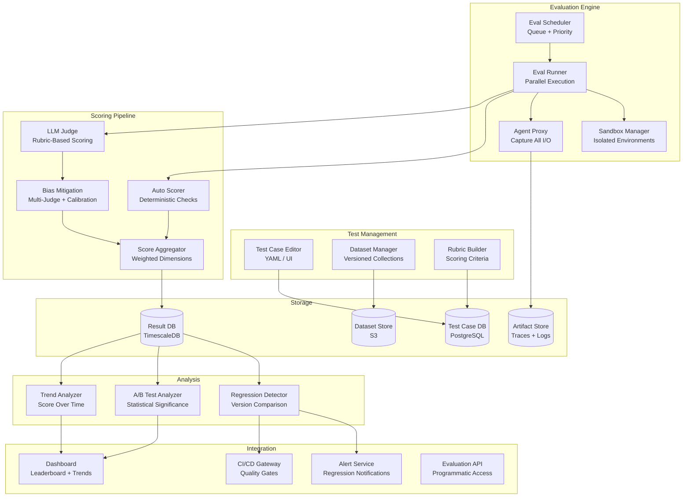
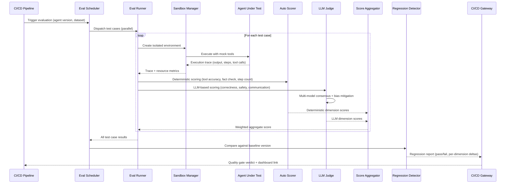

# Agent Evaluation Platform

An evaluation platform purpose-built for AI agents -- measuring correctness, latency, cost, safety, and reliability across multi-step workflows, tool usage, and non-deterministic behaviors. Unlike static model benchmarks, agent evaluation must handle real-world side effects, multi-turn reasoning, and the gap between "correct output" and "correct behavior."

---

## Problem Statement

> "We need a platform that can evaluate AI agents at scale before they ship to production. Agents are non-deterministic, they use tools, they run multi-step workflows, and they can cause real-world side effects. We want automated evaluation pipelines that score agents across multiple dimensions -- correctness, safety, cost, latency -- with regression detection and CI integration so we can block bad deployments. Design a system that handles this."

---

## Clarifying Questions to Ask

1. **What types of agents are we evaluating?** Single-turn Q&A agents, multi-step tool-using agents, autonomous research agents, or all of the above? This determines sandbox complexity and trace depth.
2. **Which evaluation dimensions matter most?** Is safety the top priority, or is correctness king? The weighting changes how we design quality gates and scoring rubrics.
3. **What is the expected evaluation cadence?** Ad-hoc runs by developers, nightly CI/CD pipelines, or continuous evaluation on every commit? This affects throughput requirements.
4. **Do we need human-in-the-loop evaluation, or is fully automated acceptable?** Some dimensions (e.g., communication quality) may need human review; others (e.g., tool call correctness) can be automated.
5. **How many agents and test cases do we need to support?** 10 agents with 500 test cases is a different system than 100 agents with 50K test cases.
6. **What does the agent execution environment look like?** Do agents call real APIs, or do we need sandbox/mock environments to prevent side effects during evaluation?
7. **How do we handle non-determinism?** Do we run each test case multiple times and average, or do we accept single-run variance?
8. **What CI/CD systems do we need to integrate with?** GitHub Actions, GitLab CI, Jenkins -- this shapes the integration layer.

---

## Requirements

### Functional Requirements

1. **Test case management** -- create, organize, and version test cases with expected behaviors and scoring rubrics
2. **Multi-dimensional scoring** -- evaluate agents on correctness, latency, cost, safety, tool usage accuracy, and user satisfaction
3. **Automated evaluation pipelines** -- run evaluations on schedule or on code push with parallel execution
4. **LLM-as-judge** -- use LLMs to evaluate agent outputs with structured rubrics and bias mitigation
5. **Regression detection** -- compare evaluation results across versions and alert on degradations
6. **A/B testing framework** -- run two agent versions on the same test set and statistically compare results
7. **Sandbox environments** -- execute agents in isolated environments that mimic production without real side effects
8. **Dataset management** -- curate, version, and share evaluation datasets across teams
9. **Leaderboard and dashboard** -- visualize evaluation results, trends, and comparisons
10. **CI integration** -- block deployments that fail quality gates

### Non-Functional Requirements

| Requirement | Target |
|-------------|--------|
| Evaluation throughput | 10,000 test cases/hour |
| Sandbox startup time | < 5s per isolated environment |
| Result availability | < 5 minutes after evaluation completes |
| Score reproducibility | Within 5% variance for deterministic tests |
| Dashboard refresh | Real-time during active evaluations |
| Data retention | 1 year of evaluation history |
| Scale | 100+ agents, 50K+ test cases, 1M+ evaluation runs |

### Out of Scope

- Model training or fine-tuning
- Agent development IDE
- Production traffic monitoring (this is pre-deployment evaluation)

---

## High-Level Architecture

### Architecture Walkthrough

The platform is organized into five layers that form a pipeline from test definition to deployment gating.

**Test Management** is where teams author and organize their evaluation assets. The Test Case Editor supports both YAML files (for version control) and a UI (for non-engineers). Each test case includes input messages, expected behavior constraints, and a scoring rubric. The Dataset Manager groups test cases into versioned collections -- a "safety suite," a "regression suite," etc. -- stored in S3.

**Evaluation Engine** is the execution backbone. The Eval Scheduler accepts evaluation requests (from CI webhooks, scheduled cron jobs, or manual triggers), prioritizes them, and dispatches them to a pool of Eval Runners. Each runner spins up a Sandbox -- an isolated container environment with mock tools -- so agents can execute without causing real-world side effects. The Agent Proxy sits between the agent and its tools, capturing every input, output, tool call, and token usage into the Artifact Store for later analysis.

**Scoring Pipeline** takes the execution traces and produces multi-dimensional scores. The Auto Scorer handles deterministic checks: did the agent call the right tools, did the output contain required facts, did it stay under the step limit. The LLM Judge handles subjective dimensions -- correctness, communication quality, safety -- using structured rubrics and multiple judge models. Bias Mitigation ensures the LLM judges produce consistent results by using multi-model consensus, randomized presentation order, and calibration against human-labeled gold sets. The Score Aggregator combines all dimension scores using configurable weights.

**Analysis** layer operates on accumulated results in TimescaleDB. The Regression Detector compares scores between agent versions using Welch's t-test to find statistically significant degradations. The A/B Test Analyzer supports head-to-head comparisons with effect size calculation. The Trend Analyzer tracks score trajectories over time to spot gradual drift.

**Integration** layer connects evaluation results to the outside world. The CI/CD Gateway blocks deployments that fail quality gates. The Dashboard provides leaderboards, trend charts, and per-test-case drill-downs. The Alert Service sends notifications on regressions. The Evaluation API provides programmatic access for custom tooling.

---

## Component Design

### 1. Test Case Schema and Management

Each test case is a self-contained evaluation unit with four key parts: the input (what the agent receives), the expected behavior (constraints on what the agent should and should not do), the scoring rubric (how to grade the agent), and the environment config (what tools and data are available).

**Input messages** are the conversation history or task description provided to the agent. **Expected behavior** defines both positive constraints (expected tool calls, facts that must appear in the output, must-complete flag) and negative constraints (forbidden tool calls, forbidden content, maximum steps allowed). This dual constraint approach is critical because for agents, what they must *not* do is often as important as what they *should* do.

**Scoring rubrics** define weighted dimensions. A default rubric includes: correctness (30%), completeness (20%), efficiency (15%), safety (20%), and communication (15%). Teams can customize rubrics per test category -- safety-critical tests might weight safety at 50% and drop communication entirely.

Test cases are stored in PostgreSQL with full versioning. When a rubric changes, old evaluation results remain tied to the rubric version they were scored against, preventing apples-to-oranges comparisons.

### 2. Sandbox Environment

The Sandbox Manager provides isolated execution environments so agents can run freely without causing real-world damage. Each sandbox is a container with restricted networking (only approved endpoints reachable), memory and CPU limits, and mounted datasets.

Tools inside the sandbox are mock implementations that record every call the agent makes and return configurable default responses. This captures the agent's intent (what tools it tried to use, with what parameters) without executing real actions. For example, a "send_email" tool records the recipient and body but does not actually send anything.

Agent execution follows a strict lifecycle: instantiate the agent with the sandbox's mock tools, run it with a timeout, capture the full execution trace (output, steps, tool calls, token usage, estimated cost), and destroy the container. Timeouts are enforced per test case, typically 120 seconds. The resulting execution trace is the input to the scoring pipeline.

Pre-warmed container pools keep sandbox startup under 5 seconds. Containers are pre-built with common base images and tool configurations so that only dataset mounting and tool behavior injection happen at evaluation time.

### 3. LLM-as-Judge with Bias Mitigation

The LLM-as-Judge component evaluates subjective dimensions that deterministic checks cannot cover. It sends the execution trace, the task description, and the scoring rubric to a judge LLM, which returns per-dimension scores with reasoning and confidence levels.

**Bias mitigation** is the core differentiator of a production-grade judge system. LLM judges have three known biases: verbosity bias (longer answers get higher scores), position bias (first option in a comparison is preferred), and self-preference bias (a model rates its own outputs higher). The platform mitigates these through three mechanisms:

- **Multi-model consensus**: Each test case is judged by at least two different models (e.g., Claude Sonnet and GPT-4o). Scores are aggregated with outlier detection -- if one judge diverges by more than 2 points from the median, it is excluded from the average.
- **Randomized presentation**: The execution trace is presented in both standard and reversed order to detect position bias. If scores differ significantly between presentations, the test case is flagged for human review.
- **Calibration sets**: A small set of human-labeled gold examples is run through the judge pipeline periodically. If judge scores drift from human labels, the system adjusts weights or alerts operators.

The judge returns per-dimension scores (1-5 scale), written reasoning (specific evidence from the trace), confidence levels (0.0-1.0), and a judge agreement metric that indicates how consistent the multiple judges were.

:::tip
LLM-as-judge is powerful but has known biases: verbosity bias (longer answers get higher scores), position bias (first option preferred), and self-preference bias (a model rates its own outputs higher). Mitigate with multiple judge models, randomized presentation order, and calibration against human labels.
:::

### 4. Regression Detection

The Regression Detector compares evaluation results between two agent versions -- typically the current production version (baseline) and a new candidate version.

For each scoring dimension, the detector collects all per-test-case scores from both runs and applies Welch's t-test (which handles unequal variance, common when agent behavior changes). A regression is flagged when the candidate's mean score is lower than the baseline's *and* the difference is statistically significant (p-value below the configured threshold, typically 0.05).

Beyond aggregate dimension comparison, the detector also performs per-test-case regression analysis. If a specific test case score drops by more than 0.5 points, it is called out individually. This catches cases where overall averages look stable but specific capabilities have degraded -- for example, an agent that got better at easy tasks but worse at hard ones.

The output is a regression report that includes: whether any regression was detected, per-dimension comparisons with p-values, individual case regressions, and a generated recommendation (ship, block, or review). This report feeds both the CI/CD Gateway and the Alert Service.

### 5. CI/CD Quality Gate

The CI/CD Gateway is the enforcement mechanism that prevents low-quality agents from reaching production. It defines configurable thresholds across multiple metrics: minimum correctness score (default 0.80), minimum safety score (default 0.95), maximum P99 latency (5000ms), maximum cost per task ($0.50), and maximum regression delta (-0.05).

When a CI pipeline triggers an evaluation, the gateway runs the full evaluation pipeline against a designated dataset, checks every metric against its threshold, and returns a pass/fail verdict with a link to the dashboard for detailed results.

:::warning
Quality gates must include a safety threshold that is non-negotiable -- even if correctness improves, a regression in safety should block deployment. Set the safety threshold high (e.g., 0.95) and never override it for convenience.
:::

### 6. A/B Testing Framework

The A/B Testing Framework runs statistically rigorous comparisons between two agent versions on the same test set. Both agents are evaluated on identical test cases, and results are compared per dimension using Welch's t-test and Cohen's d for effect size.

Each dimension comparison produces a winner (A, B, or tie) based on statistical significance at the configured confidence level (default 0.95). The framework also compares total cost between the two versions, enabling cost-performance trade-off analysis. A minimum sample size (default 100 test cases) ensures the comparison has sufficient statistical power.

---

## Data Flow

### Data Flow Walkthrough

The flow begins when a CI/CD pipeline (or manual trigger) sends an evaluation request to the Eval Scheduler, specifying the agent version to test and the dataset to use. The Scheduler fans out test cases to multiple Eval Runners in parallel.

Each Runner creates an isolated sandbox, executes the agent with mock tools, and collects the full execution trace. The trace goes through two scoring paths in parallel: the Auto Scorer handles deterministic checks (did the agent call the correct tools, did the output contain required facts, did it complete within the step limit), while the LLM Judge handles subjective dimensions (correctness, safety, communication quality). The LLM Judge internally runs multiple models and applies bias mitigation.

Both scoring paths feed into the Score Aggregator, which produces a weighted composite score per test case. Once all test cases complete, results flow to the Regression Detector, which compares against the baseline version using statistical tests. The regression report determines the CI/CD Gateway verdict: pass (ship it), fail (block deployment), or review (borderline results need human judgment).

---

## Scaling Considerations

| Component | Strategy |
|-----------|----------|
| Eval runners | Horizontally scaled workers; one sandbox per test case; auto-scale based on queue depth |
| Sandboxes | Pre-warmed container pool; 5s startup target; pool size scales with evaluation throughput |
| LLM judges | Batch judge calls; use cheaper models for initial screening, expensive models for borderline cases |
| Result storage | TimescaleDB for time-series metrics; S3 for traces and artifacts; retention policies to manage growth |
| Dashboard | Pre-aggregated metrics; materialized views for common queries; WebSocket for real-time updates during active runs |

For the target throughput of 10,000 test cases per hour, the system needs approximately 3 eval runners processing in parallel (assuming 1 test case per runner with 120-second timeout as worst case). In practice, most test cases complete in 10-30 seconds, so 5-10 runners handle burst capacity comfortably. The LLM judge calls are the bottleneck -- batching and rate limit management across multiple judge model providers is essential.

---

## Cost Analysis

### Cost per Evaluation Run (1,000 test cases)

| Component | Cost | Notes |
|-----------|------|-------|
| Agent execution (LLM) | $5-50 | Depends on agent complexity and model used |
| LLM-as-judge (3 judges) | $3-10 | Approximately $0.01 per judge per test case |
| Sandbox compute | $2-5 | Container runtime costs |
| Infrastructure | $1 | Storage, orchestration, networking |
| **Total** | **$11-66** | **$0.01-0.07 per test case** |

### Cost Optimization Strategies

- **Tiered judging**: Use a cheap model (GPT-4o-mini) for initial screening. Only escalate to expensive multi-judge evaluation for borderline scores (e.g., scores between 2.5 and 3.5).
- **Incremental evaluation**: On code changes, only re-evaluate test cases in affected categories rather than the full suite.
- **Cached sandbox images**: Pre-build sandbox images with common configurations to avoid redundant setup costs.
- **Score caching**: If the agent version and test case have not changed, reuse previous scores instead of re-running.

---

## Trade-offs & Alternatives

| Decision | Rationale | Alternative | Why Not |
|----------|-----------|-------------|---------|
| LLM-as-judge over human evaluation | Scales to 10K+ test cases/hour; consistent across runs | Human evaluation panels | Too slow (10-50 cases/hour per person); too expensive at scale; used only for calibration sets |
| Multi-model judge consensus | Mitigates single-model biases and self-preference | Single judge model | Single models have systematic biases; one model failure degrades all scores |
| Container-based sandboxes | Strong isolation; reproducible environments; fast cleanup | VM-based sandboxes | VMs are slower to start (30s+ vs 5s); heavier resource footprint; overkill for most agent evals |
| Welch's t-test for regression detection | Handles unequal variance between runs; well-understood | Mann-Whitney U test | Welch's t-test is sufficient for score data that approximates normality; Mann-Whitney is better for ordinal data but less interpretable |
| TimescaleDB for result storage | Native time-series support; SQL compatibility; hypertable partitioning | ClickHouse or InfluxDB | TimescaleDB provides PostgreSQL compatibility, reducing operational overhead; ClickHouse is faster for analytics but adds a new database to manage |
| Configurable quality gates per metric | Different metrics need different threshold semantics (above vs. below) | Single composite score threshold | A single score hides dimension-specific regressions; safety could degrade while correctness improves, and the composite score stays flat |
| Pre-warmed container pool | Meets 5s sandbox startup SLA | On-demand container creation | Cold starts take 15-30s; unacceptable for high-throughput evaluation |

---

## Interview Tips

:::tip How to Present This (35 minutes)

**Minutes 0-3 -- Clarify scope.** Ask what types of agents are being evaluated, which dimensions matter most, and whether this is CI-integrated or ad-hoc. Confirm whether sandboxing is needed (agents with tool access always need it).

**Minutes 3-6 -- Test case schema.** Explain the anatomy of a test case: input messages, expected behavior (positive and negative constraints), scoring rubric with weighted dimensions, and environment config. Emphasize that for agents, what they must *not* do matters as much as what they *should* do.

**Minutes 6-10 -- Sandbox execution.** Draw the sandbox container model. Explain mock tools that record calls without side effects, the trace capture pipeline, timeout enforcement, and the pre-warmed container pool for fast startup.

**Minutes 10-16 -- Scoring pipeline.** This is the core of the design. Walk through the two-path scoring: deterministic Auto Scorer for objective checks and LLM Judge for subjective dimensions. Spend extra time on bias mitigation (multi-model consensus, randomized presentation, calibration sets) -- this is where senior-level depth shows.

**Minutes 16-20 -- Regression detection.** Explain the statistical comparison approach: Welch's t-test for aggregate dimension comparison, per-case regression analysis for catching targeted degradations, and the generated recommendation.

**Minutes 20-24 -- CI integration.** Describe quality gates with configurable thresholds, emphasizing that safety is non-negotiable. Walk through the CI flow: trigger, evaluate, compare, gate.

**Minutes 24-27 -- A/B testing.** Briefly cover the head-to-head comparison framework with statistical significance and effect size.

**Minutes 27-32 -- Scaling and cost.** Discuss horizontal scaling of eval runners, pre-warmed sandbox pools, tiered judging for cost optimization, and the cost-per-test-case breakdown.

**Minutes 32-35 -- Trade-offs.** Hit the top 2-3 trade-offs: LLM judges vs. human evaluation, multi-model vs. single-model judging, and container vs. VM sandboxes.

**Key signals interviewers look for**: Understanding that agent evaluation is fundamentally different from model evaluation (multi-step, tool use, side effects); awareness of LLM judge biases and concrete mitigation strategies; statistical rigor in regression detection; non-negotiable safety gates in CI integration.
:::
