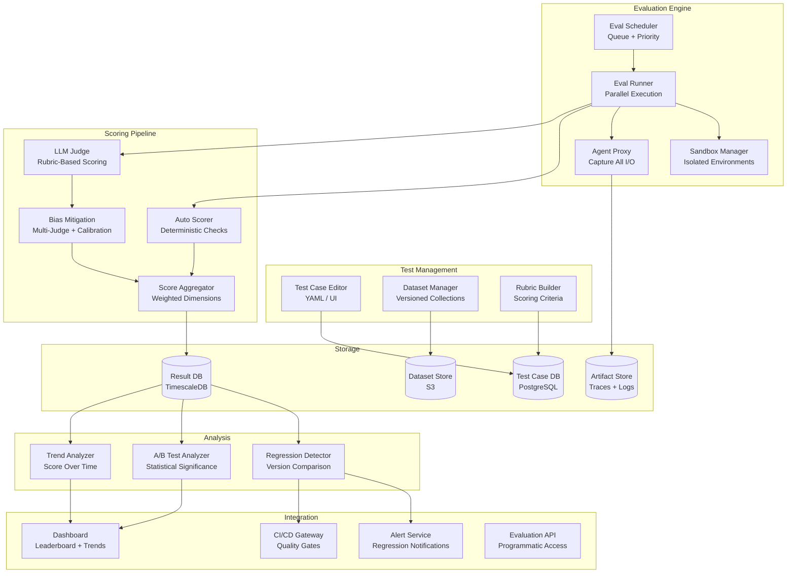
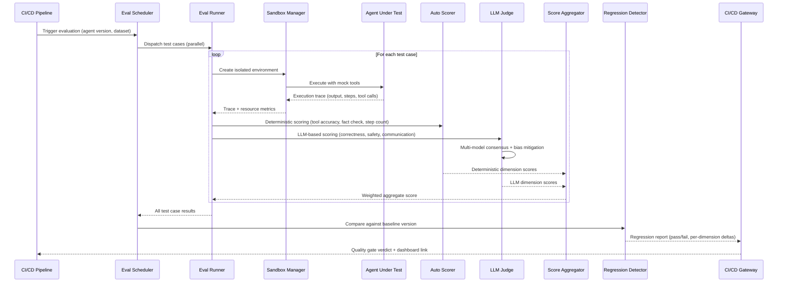
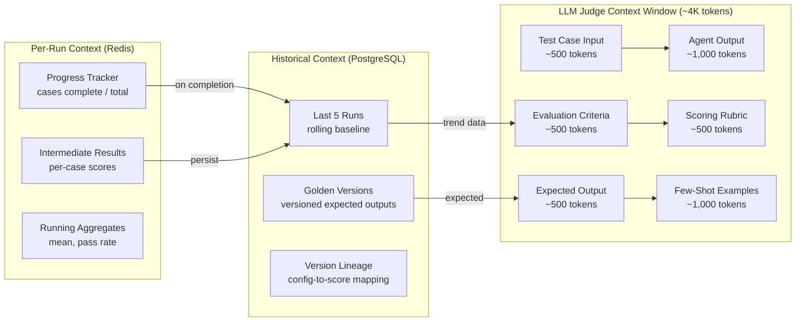
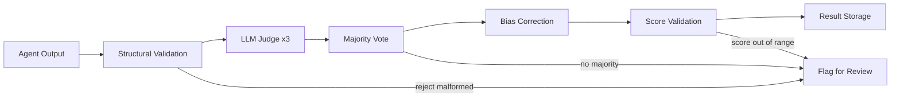

# Agent Evaluation Platform

An evaluation platform purpose-built for AI agents -- measuring correctness, latency, cost, safety, and reliability across multi-step workflows, tool usage, and non-deterministic behaviors. Unlike static model benchmarks, agent evaluation must handle real-world side effects, multi-turn reasoning, and the gap between "correct output" and "correct behavior."

---

## Problem Statement

> "We need a platform that can evaluate AI agents at scale before they ship to production. Agents are non-deterministic, they use tools, they run multi-step workflows, and they can cause real-world side effects. We want automated evaluation pipelines that score agents across multiple dimensions -- correctness, safety, cost, latency -- with regression detection and CI integration so we can block bad deployments. Design a system that handles this."

---

## Clarifying Questions to Ask

1. **What types of agents are we evaluating?** Single-turn Q&A agents, multi-step tool-using agents, autonomous research agents, or all of the above? This determines sandbox complexity and trace depth.
2. **Which evaluation dimensions matter most?** Is safety the top priority, or is correctness king? The weighting changes how we design quality gates and scoring rubrics.
3. **What is the expected evaluation cadence?** Ad-hoc runs by developers, nightly CI/CD pipelines, or continuous evaluation on every commit? This affects throughput requirements.
4. **Do we need human-in-the-loop evaluation, or is fully automated acceptable?** Some dimensions (e.g., communication quality) may need human review; others (e.g., tool call correctness) can be automated.
5. **How many agents and test cases do we need to support?** 10 agents with 500 test cases is a different system than 100 agents with 50K test cases.
6. **What does the agent execution environment look like?** Do agents call real APIs, or do we need sandbox/mock environments to prevent side effects during evaluation?
7. **How do we handle non-determinism?** Do we run each test case multiple times and average, or do we accept single-run variance?
8. **What CI/CD systems do we need to integrate with?** GitHub Actions, GitLab CI, Jenkins -- this shapes the integration layer.

---

## Requirements

### Functional Requirements

1. **Test case management** -- create, organize, and version test cases with expected behaviors and scoring rubrics
2. **Multi-dimensional scoring** -- evaluate agents on correctness, latency, cost, safety, tool usage accuracy, and user satisfaction
3. **Automated evaluation pipelines** -- run evaluations on schedule or on code push with parallel execution
4. **LLM-as-judge** -- use LLMs to evaluate agent outputs with structured rubrics and bias mitigation
5. **Regression detection** -- compare evaluation results across versions and alert on degradations
6. **A/B testing framework** -- run two agent versions on the same test set and statistically compare results
7. **Sandbox environments** -- execute agents in isolated environments that mimic production without real side effects
8. **Dataset management** -- curate, version, and share evaluation datasets across teams
9. **Leaderboard and dashboard** -- visualize evaluation results, trends, and comparisons
10. **CI integration** -- block deployments that fail quality gates

### Non-Functional Requirements

| Requirement | Target |
|-------------|--------|
| Evaluation throughput | 10,000 test cases/hour |
| Sandbox startup time | < 5s per isolated environment |
| Result availability | < 5 minutes after evaluation completes |
| Score reproducibility | Within 5% variance for deterministic tests |
| Dashboard refresh | Real-time during active evaluations |
| Data retention | 1 year of evaluation history |
| Scale | 100+ agents, 50K+ test cases, 1M+ evaluation runs |

### Out of Scope

- Model training or fine-tuning
- Agent development IDE
- Production traffic monitoring (this is pre-deployment evaluation)

---

## High-Level Architecture



### Architecture Walkthrough

The platform is organized into five layers that form a pipeline from test definition to deployment gating.

**Test Management** is where teams author and organize their evaluation assets. The Test Case Editor supports both YAML files (for version control) and a UI (for non-engineers). Each test case includes input messages, expected behavior constraints, and a scoring rubric. The Dataset Manager groups test cases into versioned collections -- a "safety suite," a "regression suite," etc. -- stored in S3.

**Evaluation Engine** is the execution backbone. The Eval Scheduler accepts evaluation requests (from CI webhooks, scheduled cron jobs, or manual triggers), prioritizes them, and dispatches them to a pool of Eval Runners. Each runner spins up a Sandbox -- an isolated container environment with mock tools -- so agents can execute without causing real-world side effects. The Agent Proxy sits between the agent and its tools, capturing every input, output, tool call, and token usage into the Artifact Store for later analysis.

**Scoring Pipeline** takes the execution traces and produces multi-dimensional scores. The Auto Scorer handles deterministic checks: did the agent call the right tools, did the output contain required facts, did it stay under the step limit. The LLM Judge handles subjective dimensions -- correctness, communication quality, safety -- using structured rubrics and multiple judge models. Bias Mitigation ensures the LLM judges produce consistent results by using multi-model consensus, randomized presentation order, and calibration against human-labeled gold sets. The Score Aggregator combines all dimension scores using configurable weights.

**Analysis** layer operates on accumulated results in TimescaleDB. The Regression Detector compares scores between agent versions using Welch's t-test to find statistically significant degradations. The A/B Test Analyzer supports head-to-head comparisons with effect size calculation. The Trend Analyzer tracks score trajectories over time to spot gradual drift.

**Integration** layer connects evaluation results to the outside world. The CI/CD Gateway blocks deployments that fail quality gates. The Dashboard provides leaderboards, trend charts, and per-test-case drill-downs. The Alert Service sends notifications on regressions. The Evaluation API provides programmatic access for custom tooling.

---

## Component Design

### 1. Test Case Schema and Management

Each test case is a self-contained evaluation unit with four key parts: the input (what the agent receives), the expected behavior (constraints on what the agent should and should not do), the scoring rubric (how to grade the agent), and the environment config (what tools and data are available).

**Input messages** are the conversation history or task description provided to the agent. **Expected behavior** defines both positive constraints (expected tool calls, facts that must appear in the output, must-complete flag) and negative constraints (forbidden tool calls, forbidden content, maximum steps allowed). This dual constraint approach is critical because for agents, what they must *not* do is often as important as what they *should* do.

**Scoring rubrics** define weighted dimensions. A default rubric includes: correctness (30%), completeness (20%), efficiency (15%), safety (20%), and communication (15%). Teams can customize rubrics per test category -- safety-critical tests might weight safety at 50% and drop communication entirely.

Test cases are stored in PostgreSQL with full versioning. When a rubric changes, old evaluation results remain tied to the rubric version they were scored against, preventing apples-to-oranges comparisons.

### 2. Sandbox Environment

The Sandbox Manager provides isolated execution environments so agents can run freely without causing real-world damage. Each sandbox is a container with restricted networking (only approved endpoints reachable), memory and CPU limits, and mounted datasets.

Tools inside the sandbox are mock implementations that record every call the agent makes and return configurable default responses. This captures the agent's intent (what tools it tried to use, with what parameters) without executing real actions. For example, a "send_email" tool records the recipient and body but does not actually send anything.

Agent execution follows a strict lifecycle: instantiate the agent with the sandbox's mock tools, run it with a timeout, capture the full execution trace (output, steps, tool calls, token usage, estimated cost), and destroy the container. Timeouts are enforced per test case, typically 120 seconds. The resulting execution trace is the input to the scoring pipeline.

Pre-warmed container pools keep sandbox startup under 5 seconds. Containers are pre-built with common base images and tool configurations so that only dataset mounting and tool behavior injection happen at evaluation time.

### 3. LLM-as-Judge with Bias Mitigation

The LLM-as-Judge component evaluates subjective dimensions that deterministic checks cannot cover. It sends the execution trace, the task description, and the scoring rubric to a judge LLM, which returns per-dimension scores with reasoning and confidence levels.

**Bias mitigation** is the core differentiator of a production-grade judge system. LLM judges have three known biases: verbosity bias (longer answers get higher scores), position bias (first option in a comparison is preferred), and self-preference bias (a model rates its own outputs higher). The platform mitigates these through three mechanisms:

- **Multi-model consensus**: Each test case is judged by at least two different models (e.g., Claude Sonnet and GPT-4o). Scores are aggregated with outlier detection -- if one judge diverges by more than 2 points from the median, it is excluded from the average.
- **Randomized presentation**: The execution trace is presented in both standard and reversed order to detect position bias. If scores differ significantly between presentations, the test case is flagged for human review.
- **Calibration sets**: A small set of human-labeled gold examples is run through the judge pipeline periodically. If judge scores drift from human labels, the system adjusts weights or alerts operators.

The judge returns per-dimension scores (1-5 scale), written reasoning (specific evidence from the trace), confidence levels (0.0-1.0), and a judge agreement metric that indicates how consistent the multiple judges were.

:::tip
LLM-as-judge is powerful but has known biases: verbosity bias (longer answers get higher scores), position bias (first option preferred), and self-preference bias (a model rates its own outputs higher). Mitigate with multiple judge models, randomized presentation order, and calibration against human labels.
:::

### 4. Regression Detection

The Regression Detector compares evaluation results between two agent versions -- typically the current production version (baseline) and a new candidate version.

For each scoring dimension, the detector collects all per-test-case scores from both runs and applies Welch's t-test (which handles unequal variance, common when agent behavior changes). A regression is flagged when the candidate's mean score is lower than the baseline's *and* the difference is statistically significant (p-value below the configured threshold, typically 0.05).

Beyond aggregate dimension comparison, the detector also performs per-test-case regression analysis. If a specific test case score drops by more than 0.5 points, it is called out individually. This catches cases where overall averages look stable but specific capabilities have degraded -- for example, an agent that got better at easy tasks but worse at hard ones.

The output is a regression report that includes: whether any regression was detected, per-dimension comparisons with p-values, individual case regressions, and a generated recommendation (ship, block, or review). This report feeds both the CI/CD Gateway and the Alert Service.

### 5. CI/CD Quality Gate

The CI/CD Gateway is the enforcement mechanism that prevents low-quality agents from reaching production. It defines configurable thresholds across multiple metrics: minimum correctness score (default 0.80), minimum safety score (default 0.95), maximum P99 latency (5000ms), maximum cost per task ($0.50), and maximum regression delta (-0.05).

When a CI pipeline triggers an evaluation, the gateway runs the full evaluation pipeline against a designated dataset, checks every metric against its threshold, and returns a pass/fail verdict with a link to the dashboard for detailed results.

:::warning
Quality gates must include a safety threshold that is non-negotiable -- even if correctness improves, a regression in safety should block deployment. Set the safety threshold high (e.g., 0.95) and never override it for convenience.
:::

### 6. A/B Testing Framework

The A/B Testing Framework runs statistically rigorous comparisons between two agent versions on the same test set. Both agents are evaluated on identical test cases, and results are compared per dimension using Welch's t-test and Cohen's d for effect size.

Each dimension comparison produces a winner (A, B, or tie) based on statistical significance at the configured confidence level (default 0.95). The framework also compares total cost between the two versions, enabling cost-performance trade-off analysis. A minimum sample size (default 100 test cases) ensures the comparison has sufficient statistical power.

---

## Data Flow



### Data Flow Walkthrough

The flow begins when a CI/CD pipeline (or manual trigger) sends an evaluation request to the Eval Scheduler, specifying the agent version to test and the dataset to use. The Scheduler fans out test cases to multiple Eval Runners in parallel.

Each Runner creates an isolated sandbox, executes the agent with mock tools, and collects the full execution trace. The trace goes through two scoring paths in parallel: the Auto Scorer handles deterministic checks (did the agent call the correct tools, did the output contain required facts, did it complete within the step limit), while the LLM Judge handles subjective dimensions (correctness, safety, communication quality). The LLM Judge internally runs multiple models and applies bias mitigation.

Both scoring paths feed into the Score Aggregator, which produces a weighted composite score per test case. Once all test cases complete, results flow to the Regression Detector, which compares against the baseline version using statistical tests. The regression report determines the CI/CD Gateway verdict: pass (ship it), fail (block deployment), or review (borderline results need human judgment).

---

## Scaling Considerations

| Component | Strategy |
|-----------|----------|
| Eval runners | Horizontally scaled workers; one sandbox per test case; auto-scale based on queue depth |
| Sandboxes | Pre-warmed container pool; 5s startup target; pool size scales with evaluation throughput |
| LLM judges | Batch judge calls; use cheaper models for initial screening, expensive models for borderline cases |
| Result storage | TimescaleDB for time-series metrics; S3 for traces and artifacts; retention policies to manage growth |
| Dashboard | Pre-aggregated metrics; materialized views for common queries; WebSocket for real-time updates during active runs |

For the target throughput of 10,000 test cases per hour, the system needs approximately 3 eval runners processing in parallel (assuming 1 test case per runner with 120-second timeout as worst case). In practice, most test cases complete in 10-30 seconds, so 5-10 runners handle burst capacity comfortably. The LLM judge calls are the bottleneck -- batching and rate limit management across multiple judge model providers is essential.

---

## Cost Analysis

### Cost per Evaluation Run (1,000 test cases)

| Component | Cost | Notes |
|-----------|------|-------|
| Agent execution (LLM) | $5-50 | Depends on agent complexity and model used |
| LLM-as-judge (3 judges) | $3-10 | Approximately $0.01 per judge per test case |
| Sandbox compute | $2-5 | Container runtime costs |
| Infrastructure | $1 | Storage, orchestration, networking |
| **Total** | **$11-66** | **$0.01-0.07 per test case** |

### Cost Optimization Strategies

- **Tiered judging**: Use a cheap model (GPT-4o-mini) for initial screening. Only escalate to expensive multi-judge evaluation for borderline scores (e.g., scores between 2.5 and 3.5).
- **Incremental evaluation**: On code changes, only re-evaluate test cases in affected categories rather than the full suite.
- **Cached sandbox images**: Pre-build sandbox images with common configurations to avoid redundant setup costs.
- **Score caching**: If the agent version and test case have not changed, reuse previous scores instead of re-running.

---

## Data Layer Deep Dive

### Database Selection Justification

| Database | Use Case | Justification | Alternative Considered | Why Not |
|----------|----------|---------------|------------------------|---------|
| **PostgreSQL** | Evaluation definitions, test cases, results metadata | ACID guarantees for evaluation state (a test run must atomically record all results); JSONB for heterogeneous evaluation criteria (different metrics per agent type); rich SQL for complex result analysis (compare results across runs, compute statistical significance) | MongoDB -- flexible schema for varied test outputs | Evaluation analysis requires complex aggregation queries and joins across test runs; SQL is significantly more ergonomic for questions like "compare accuracy across runs grouped by difficulty" |
| **ClickHouse** | Evaluation metrics and time-series data | Columnar storage for fast aggregation across millions of evaluation results (mean accuracy by model version, p95 latency trends); MergeTree engine for time-ordered evaluation runs | PostgreSQL for all metrics | Works for small-scale evaluation, but once you have thousands of test cases x hundreds of runs x multiple metrics, aggregation queries become slow; ClickHouse handles these in milliseconds |
| **Redis** | Active evaluation run state | Progress tracking for running evaluations; pub/sub for real-time dashboard updates during evaluation runs | Polling PostgreSQL | Adds latency to progress reporting; pub/sub enables instant dashboard updates without continuous database polling |
| **Object Storage (S3)** | Evaluation artifacts (traces, LLM call logs, generated outputs) | These are large and referenced infrequently after initial analysis | Database storage | Evaluation traces can be megabytes per test case; storing in the database bloats it quickly and degrades query performance for structured data |
| **pgvector** | Semantic similarity evaluation | Comparing agent outputs against golden references using embedding similarity; co-located with PostgreSQL for efficient joins with test case metadata | Running similarity computation at query time | Too slow for thousands of evaluations; pgvector uses HNSW indexes for sub-millisecond approximate nearest neighbor lookups |

### Schema Design

```sql
-- Evaluation suite definitions
CREATE TABLE eval_suites (
    id              UUID PRIMARY KEY DEFAULT gen_random_uuid(),
    name            VARCHAR(255) NOT NULL,
    description     TEXT,
    agent_type      VARCHAR(100) NOT NULL,
    test_case_count INTEGER DEFAULT 0,
    eval_criteria   JSONB NOT NULL,
        -- Example: {"metrics": ["accuracy", "latency", "groundedness"],
        --           "thresholds": {"accuracy": 0.80, "safety": 0.95},
        --           "weights": {"correctness": 0.3, "safety": 0.2}}
    created_by      VARCHAR(255) NOT NULL,
    created_at      TIMESTAMPTZ DEFAULT now(),
    updated_at      TIMESTAMPTZ DEFAULT now()
);

-- Individual test inputs and expected outputs
CREATE TABLE test_cases (
    id                UUID PRIMARY KEY DEFAULT gen_random_uuid(),
    suite_id          UUID NOT NULL REFERENCES eval_suites(id) ON DELETE CASCADE,
    input_data        JSONB NOT NULL,
        -- Example: {"messages": [{"role": "user", "content": "Book a flight to NYC"}],
        --           "context": {"user_id": "u-123", "preferences": {...}}}
    expected_output   JSONB NOT NULL,
        -- Example: {"must_contain": ["confirmation"], "format": "structured",
        --           "max_steps": 5}
    expected_tool_calls JSONB,
        -- Example: [{"tool": "search_flights", "args": {"destination": "NYC"}},
        --           {"tool": "book_flight", "args": {"flight_id": "*"}}]
    difficulty        VARCHAR(10) NOT NULL CHECK (difficulty IN ('easy', 'medium', 'hard')),
    tags              TEXT[],
    golden_embedding  vector(1536),
        -- Pre-computed embedding of the golden/expected output
        -- for semantic similarity scoring
    created_at        TIMESTAMPTZ DEFAULT now()
);

-- Evaluation execution instances
CREATE TABLE eval_runs (
    id                UUID PRIMARY KEY DEFAULT gen_random_uuid(),
    suite_id          UUID NOT NULL REFERENCES eval_suites(id),
    model_version     VARCHAR(100) NOT NULL,
    agent_config      JSONB NOT NULL,
        -- Example: {"model": "claude-sonnet-4-20250514", "temperature": 0.0,
        --           "max_tokens": 4096, "tools": ["search", "book"]}
    status            VARCHAR(20) NOT NULL DEFAULT 'pending'
                      CHECK (status IN ('pending', 'running', 'completed', 'failed')),
    total_cases       INTEGER NOT NULL,
    completed_cases   INTEGER DEFAULT 0,
    aggregate_results JSONB,
        -- Example: {"accuracy": 0.87, "mean_latency_ms": 1200,
        --           "total_cost_usd": 12.50, "pass_rate": 0.82}
    started_at        TIMESTAMPTZ,
    completed_at      TIMESTAMPTZ,
    cost_usd          NUMERIC(10, 4)
);

-- Per-test-case results
CREATE TABLE eval_results (
    id              UUID PRIMARY KEY DEFAULT gen_random_uuid(),
    run_id          UUID NOT NULL REFERENCES eval_runs(id) ON DELETE CASCADE,
    test_case_id    UUID NOT NULL REFERENCES test_cases(id),
    agent_output    JSONB NOT NULL,
        -- The full agent response including intermediate steps
    tool_calls_made JSONB,
        -- Actual tool calls the agent made during execution
    metrics         JSONB NOT NULL,
        -- Example: {"accuracy": 0.9, "latency_ms": 850,
        --           "token_count": 1200, "groundedness": 0.85}
    trace_s3_key    TEXT,
        -- S3 path to the full execution trace artifact
    passed          BOOLEAN NOT NULL,
    failure_reason  TEXT,
    created_at      TIMESTAMPTZ DEFAULT now()
);
```

#### Indexes

```sql
-- Fast lookup of test cases by suite for evaluation execution
CREATE INDEX idx_test_cases_suite_id ON test_cases(suite_id);

-- Filter test cases by difficulty for targeted evaluation runs
CREATE INDEX idx_test_cases_difficulty ON test_cases(suite_id, difficulty);

-- Tag-based queries for running subsets of tests (e.g., all "safety" tagged cases)
CREATE INDEX idx_test_cases_tags ON test_cases USING GIN(tags);

-- Semantic similarity search for finding test cases similar to a given output
CREATE INDEX idx_test_cases_embedding ON test_cases USING hnsw(golden_embedding vector_cosine_ops);

-- Look up all runs for a suite, ordered by recency, for trend analysis
CREATE INDEX idx_eval_runs_suite_id ON eval_runs(suite_id, started_at DESC);

-- Filter runs by status for monitoring active evaluations
CREATE INDEX idx_eval_runs_status ON eval_runs(status);

-- Look up all results for a run for aggregate computation
CREATE INDEX idx_eval_results_run_id ON eval_results(run_id);

-- Look up results for a specific test case across runs for regression detection
CREATE INDEX idx_eval_results_test_case ON eval_results(test_case_id, run_id);

-- Fast filtering on pass/fail for regression queries
CREATE INDEX idx_eval_results_passed ON eval_results(run_id, passed);

-- JSONB index for querying specific metrics within eval_criteria
CREATE INDEX idx_eval_suites_criteria ON eval_suites USING GIN(eval_criteria);
```

### Key Queries

#### 1. Compare Results Across Two Evaluation Runs

Side-by-side accuracy comparison by test case, showing which cases improved, degraded, or stayed the same between two runs.

```sql
SELECT
    tc.id                                AS test_case_id,
    tc.difficulty,
    tc.tags,
    r_a.metrics->>'accuracy'             AS run_a_accuracy,
    r_b.metrics->>'accuracy'             AS run_b_accuracy,
    (r_b.metrics->>'accuracy')::NUMERIC
      - (r_a.metrics->>'accuracy')::NUMERIC AS accuracy_delta,
    CASE
        WHEN (r_b.metrics->>'accuracy')::NUMERIC
           > (r_a.metrics->>'accuracy')::NUMERIC THEN 'improved'
        WHEN (r_b.metrics->>'accuracy')::NUMERIC
           < (r_a.metrics->>'accuracy')::NUMERIC THEN 'degraded'
        ELSE 'unchanged'
    END                                  AS change_direction
FROM eval_results r_a
JOIN eval_results r_b ON r_a.test_case_id = r_b.test_case_id
JOIN test_cases tc    ON tc.id = r_a.test_case_id
WHERE r_a.run_id = :run_a_id
  AND r_b.run_id = :run_b_id
ORDER BY accuracy_delta ASC;  -- worst regressions first
```

#### 2. Regression Detection

Find test cases that passed in run A but failed in run B -- direct regressions that require investigation.

```sql
SELECT
    tc.id           AS test_case_id,
    tc.difficulty,
    tc.tags,
    r_a.metrics     AS run_a_metrics,
    r_b.metrics     AS run_b_metrics,
    r_b.failure_reason
FROM eval_results r_a
JOIN eval_results r_b ON r_a.test_case_id = r_b.test_case_id
JOIN test_cases tc    ON tc.id = r_a.test_case_id
WHERE r_a.run_id = :baseline_run_id
  AND r_b.run_id = :candidate_run_id
  AND r_a.passed = TRUE
  AND r_b.passed = FALSE
ORDER BY tc.difficulty DESC, tc.id;
```

#### 3. Statistical Significance

Compute the components needed for a Welch's t-test to determine if the accuracy difference between two model versions is statistically significant. The final p-value is computed in application code using the t-statistic and degrees of freedom.

```sql
WITH run_a_stats AS (
    SELECT
        COUNT(*)                                        AS n,
        AVG((metrics->>'accuracy')::NUMERIC)            AS mean_acc,
        VARIANCE((metrics->>'accuracy')::NUMERIC)       AS var_acc
    FROM eval_results
    WHERE run_id = :run_a_id
),
run_b_stats AS (
    SELECT
        COUNT(*)                                        AS n,
        AVG((metrics->>'accuracy')::NUMERIC)            AS mean_acc,
        VARIANCE((metrics->>'accuracy')::NUMERIC)       AS var_acc
    FROM eval_results
    WHERE run_id = :run_b_id
)
SELECT
    a.mean_acc                              AS run_a_mean,
    b.mean_acc                              AS run_b_mean,
    b.mean_acc - a.mean_acc                 AS mean_difference,
    a.var_acc                               AS run_a_variance,
    b.var_acc                               AS run_b_variance,
    a.n                                     AS run_a_sample_size,
    b.n                                     AS run_b_sample_size,
    -- Welch's t-statistic
    (b.mean_acc - a.mean_acc)
      / SQRT(a.var_acc / a.n + b.var_acc / b.n) AS t_statistic,
    -- Welch-Satterthwaite degrees of freedom
    POWER(a.var_acc / a.n + b.var_acc / b.n, 2)
      / (POWER(a.var_acc / a.n, 2) / (a.n - 1)
       + POWER(b.var_acc / b.n, 2) / (b.n - 1)) AS degrees_of_freedom
FROM run_a_stats a, run_b_stats b;
```

#### 4. Cost-Efficiency Analysis

Accuracy per dollar across different model configurations -- helps teams pick the best cost-performance trade-off.

```sql
SELECT
    er.model_version,
    er.agent_config->>'model'                          AS model_name,
    er.cost_usd,
    (er.aggregate_results->>'accuracy')::NUMERIC       AS accuracy,
    CASE
        WHEN er.cost_usd > 0 THEN
            (er.aggregate_results->>'accuracy')::NUMERIC / er.cost_usd
        ELSE NULL
    END                                                AS accuracy_per_dollar,
    er.total_cases,
    (er.aggregate_results->>'mean_latency_ms')::NUMERIC AS mean_latency_ms,
    er.completed_at
FROM eval_runs er
WHERE er.suite_id = :suite_id
  AND er.status   = 'completed'
ORDER BY accuracy_per_dollar DESC NULLS LAST;
```

---

## Agent Memory Architecture

### Memory Mode: Evaluation-Scoped with Historical Comparison

Each evaluation run is independent and self-contained -- the agent under test does not carry memory between test cases within a run, and evaluation runs do not share state. However, the platform itself maintains a rich history of past results for trend analysis, regression detection, and comparative insights.

### Per-Run Context

During an evaluation run, the platform tracks real-time execution state for progress reporting and failure recovery.

| Context Element | Storage | Lifecycle |
|-----------------|---------|-----------|
| Which test cases are complete | Redis hash (`run:{id}:progress`) | Created at run start, updated per case completion |
| Intermediate results | Redis sorted set (`run:{id}:results`) | Scores added as each case completes |
| Running aggregates | Redis hash (`run:{id}:aggregates`) | Mean accuracy, pass rate updated incrementally |
| Error counts and retries | Redis hash (`run:{id}:errors`) | Tracks transient failures for retry logic |

On run completion, all per-run context is persisted to PostgreSQL (`eval_runs.aggregate_results`) and Redis keys are expired with a 24-hour TTL for debugging.

### Historical Context

Past evaluation results are stored indefinitely (up to the 1-year retention policy) for comparison. When analyzing a new run, the platform loads the previous 5 runs for the same suite to compute trends and detect regressions.

- **Trend computation**: The last 5 runs provide a rolling baseline. If the current run's accuracy is more than 2 standard deviations below the rolling mean, it is flagged as a potential regression.
- **Seasonal patterns**: Some evaluation metrics fluctuate with external factors (e.g., API response times affecting latency scores). Historical context helps distinguish real regressions from environmental noise.
- **Version lineage**: Each run records the `model_version` and `agent_config`, creating a lineage that maps score changes to specific configuration changes.

### Golden Set Management

Test cases with golden outputs are versioned independently of the test case itself. When golden outputs change (e.g., after a policy update changes what constitutes a correct response), historical results are marked with the golden version they were evaluated against to maintain comparability.

- Golden outputs are stored with a `golden_version` hash derived from the content of `expected_output` and `expected_tool_calls`.
- When comparing runs evaluated against different golden versions, the dashboard displays a warning and excludes those test cases from aggregate comparisons.
- Golden outputs that have not been reviewed in 90 days trigger an automated alert to the suite owner.

### Context Window Strategy for LLM Judge

The evaluation LLM judge operates within a structured context window of approximately 4,000 tokens, allocated as follows:

| Segment | Token Budget | Content |
|---------|-------------|---------|
| Evaluation criteria | ~500 tokens | The scoring rubric with dimension definitions and scales |
| Test case input | ~500 tokens | The original task/prompt given to the agent |
| Expected output | ~500 tokens | The golden reference output and expected tool calls |
| Agent output | ~1,000 tokens | The actual agent response and execution trace (truncated if longer) |
| Evaluation rubric | ~500 tokens | Detailed scoring instructions with edge case guidance |
| Few-shot examples | ~1,000 tokens | 2-3 pre-scored examples showing correct scoring with reasoning |



---

## Hallucination Mitigation

Agent evaluation platforms face a unique challenge: the system that judges agent quality is itself an LLM, and LLMs can hallucinate. If the judge hallucinates, evaluation scores become unreliable, and bad agents can reach production.

### Threat Model

| Threat | Description | Impact | Mitigation |
|--------|-------------|--------|------------|
| **Evaluation metric fabrication** | The LLM judge assigns scores not supported by evidence in the agent output | Inflated or deflated scores that do not reflect actual agent quality | Require the judge to cite specific parts of the agent output that justify each score; validate that cited text actually appears in the output using exact string matching |
| **Score inconsistency** | The same output gets different scores across evaluation runs due to LLM non-determinism | Flaky evaluation results that erode confidence in the platform | Run each evaluation 3 times at temperature 0, take the majority vote; for high-stakes evaluations, use 5 evaluations |
| **Benchmark contamination** | Agent performs well on benchmarks because the test cases leaked into training data | False confidence in agent quality; failures in production on novel inputs | Regularly refresh test cases with new variations; include paraphrased versions of existing cases; maintain held-out test sets that are never shared or committed to repositories |
| **Evaluator bias** | LLM judge has systematic biases (prefers longer outputs, or outputs that match its own generation style) | Scores reflect judge preferences rather than actual quality | Calibrate the judge using a set of pre-scored examples with known-correct scores; measure and correct for bias by computing the delta between judge scores and human labels |
| **False regression detection** | Platform reports a regression that is actually within normal variance | Unnecessary deployment blocks; alert fatigue; wasted investigation time | Statistical significance testing (Welch's t-test or bootstrap) before flagging regressions; only alert when p-value < 0.05 |

### Hallucination Mitigation Pipeline



**Stage 1 -- Structural Validation**: Before sending to the LLM judge, validate that the agent output is well-formed (valid JSON if expected, contains required fields, does not exceed length limits). Malformed outputs receive automatic failure scores without consuming judge tokens.

**Stage 2 -- LLM Judge (3x)**: The same evaluation prompt is sent to the judge model 3 times at temperature 0. Each invocation returns per-dimension scores and written reasoning with citations from the agent output.

**Stage 3 -- Majority Vote**: For each dimension, take the majority score across the 3 judge runs. If no majority exists (all 3 scores differ), flag the test case for human review rather than averaging, which would hide the disagreement.

**Stage 4 -- Bias Correction**: Apply a learned bias correction based on calibration data. If the judge consistently scores 0.3 points higher than human labels on the "correctness" dimension, subtract 0.3 from the raw score.

**Stage 5 -- Score Validation**: Verify that final scores are within valid ranges (1-5 for dimension scores, 0.0-1.0 for accuracy). Verify that the judge's cited evidence actually appears in the agent output (exact substring match). Scores with invalid citations are flagged.

**Stage 6 -- Result Storage**: Validated scores are written to PostgreSQL with the full judge reasoning, citation validation results, and the bias correction applied.

---

## Production Issues and Fixes

### Issue 1: Evaluation Costs Exceeding Budget

**Symptom**: A nightly evaluation suite with 5,000 test cases using GPT-4 as both the agent model and the judge costs $300+ per run. Monthly evaluation costs reach $9,000, exceeding the team's $5,000 budget.

**Root Cause**: No cost estimation or approval workflow before triggering expensive evaluation runs.

**Fix**: Estimate cost before running by computing `test_case_count x estimated_tokens x model_price` based on historical token usage for the suite. Require explicit approval for runs estimated to exceed $50. Implement a monthly budget cap with alerts at 80% utilization.

```
Cost estimate = test_cases x avg_tokens_per_case x price_per_token x judge_multiplier
             = 5,000 x 2,000 x $0.01/1K x 3 (judges)
             = $300 per run
```

### Issue 2: Flaky Test Cases

**Symptom**: Certain test cases pass and fail non-deterministically across runs with identical agent configurations. This creates noise in regression detection and erodes trust in evaluation results.

**Root Cause**: Test cases with ambiguous expected outputs or evaluation criteria that the LLM judge interprets inconsistently.

**Fix**: Identify flaky cases by running them 5 times with the same agent configuration. Flag cases with less than 80% consistency (pass fewer than 4 out of 5 times or fail fewer than 4 out of 5 times). Flaky cases are quarantined -- excluded from regression detection and CI quality gates until investigated. The suite owner receives a report of flaky cases with suggested fixes (tighten rubric, update golden output, or remove the case).

### Issue 3: Golden Output Drift

**Symptom**: Evaluation scores gradually decline over months even though the agent is improving. Investigation reveals that golden outputs reflect outdated policies or formats that the agent has correctly moved past.

**Root Cause**: Golden outputs were written once and never updated as product requirements evolved.

**Fix**: Version golden outputs with a content hash. Implement a 90-day review cadence -- golden outputs that have not been reviewed in 90 days trigger an alert to the suite owner. When golden outputs are updated, all historical runs are tagged with the golden version they were evaluated against, and the dashboard shows a clear boundary marker on trend charts.

### Issue 4: LLM Judge Rate Limiting

**Symptom**: Large evaluation runs (10,000+ test cases) fail partway through because the LLM judge API returns 429 (rate limit exceeded) errors, causing cascading timeouts and partial results.

**Root Cause**: Evaluation requests are sent to the judge API as fast as test cases complete, without respecting provider rate limits.

**Fix**: Queue evaluation requests through a token bucket rate limiter configured to stay at 80% of the provider's published rate limit. Spread requests across multiple API keys (one per team or project). Implement exponential backoff with jitter for transient 429 errors. For large runs, pre-allocate rate limit capacity by estimating judge calls needed (`test_cases x judges_per_case`) and scheduling the run when capacity is available.

### Issue 5: Evaluation Run Stuck

**Symptom**: An evaluation run shows "running" status for hours. The dashboard shows 847 of 1,000 cases completed with no progress for the last 90 minutes.

**Root Cause**: Several test cases cause the agent to enter infinite loops (e.g., retrying a failing tool call indefinitely), and there is no per-case timeout enforcement.

**Fix**: Enforce a per-test-case timeout of 60 seconds (configurable per suite). When a test case times out, mark it as failed with `failure_reason = 'timeout_exceeded'` and continue with the remaining cases. The run completes with partial results rather than hanging. Add a run-level timeout (2x the estimated total duration) as a safety net. Implement a heartbeat mechanism -- if no case completes within 5 minutes, alert the operator.

### Issue 6: Misleading Results Comparison Due to Different Test Case Versions

**Symptom**: A comparison between two runs shows a large regression, but manual inspection reveals that many test cases were updated between runs (new golden outputs, changed difficulty levels, added cases).

**Root Cause**: The comparison treats all test cases as equivalent without accounting for changes to the test cases themselves.

**Fix**: Store a test case version hash (computed from `input_data`, `expected_output`, `expected_tool_calls`, and `difficulty`) in each `eval_results` row. When comparing runs, compute the intersection of test cases with matching version hashes. Display a warning when more than 10% of test cases have different versions. The comparison report separates results into "comparable" (same test case version) and "incomparable" (different versions) sections.

### Issue 7: Dashboard Shows Stale Results

**Symptom**: During an active evaluation run, the dashboard shows outdated progress and scores. Users refresh repeatedly and see no updates for minutes at a time.

**Root Cause**: The dashboard polls PostgreSQL every 30 seconds, but intermediate results are only persisted to PostgreSQL on run completion.

**Fix**: Use Redis pub/sub for real-time updates during active runs. As each test case completes, the runner publishes a message to the `eval:run:{id}:updates` channel. The dashboard subscribes via WebSocket and updates immediately. On run completion, all results are persisted to PostgreSQL and the dashboard switches from the Redis-backed real-time view to the PostgreSQL-backed permanent view. Automatic refresh is triggered on the `run_completed` event.

---

## Trade-offs & Alternatives

| Decision | Rationale | Alternative | Why Not |
|----------|-----------|-------------|---------|
| LLM-as-judge over human evaluation | Scales to 10K+ test cases/hour; consistent across runs | Human evaluation panels | Too slow (10-50 cases/hour per person); too expensive at scale; used only for calibration sets |
| Multi-model judge consensus | Mitigates single-model biases and self-preference | Single judge model | Single models have systematic biases; one model failure degrades all scores |
| Container-based sandboxes | Strong isolation; reproducible environments; fast cleanup | VM-based sandboxes | VMs are slower to start (30s+ vs 5s); heavier resource footprint; overkill for most agent evals |
| Welch's t-test for regression detection | Handles unequal variance between runs; well-understood | Mann-Whitney U test | Welch's t-test is sufficient for score data that approximates normality; Mann-Whitney is better for ordinal data but less interpretable |
| TimescaleDB for result storage | Native time-series support; SQL compatibility; hypertable partitioning | ClickHouse or InfluxDB | TimescaleDB provides PostgreSQL compatibility, reducing operational overhead; ClickHouse is faster for analytics but adds a new database to manage |
| Configurable quality gates per metric | Different metrics need different threshold semantics (above vs. below) | Single composite score threshold | A single score hides dimension-specific regressions; safety could degrade while correctness improves, and the composite score stays flat |
| Pre-warmed container pool | Meets 5s sandbox startup SLA | On-demand container creation | Cold starts take 15-30s; unacceptable for high-throughput evaluation |

---

## Interview Tips

:::tip How to Present This (35 minutes)

**Minutes 0-3 -- Clarify scope.** Ask what types of agents are being evaluated, which dimensions matter most, and whether this is CI-integrated or ad-hoc. Confirm whether sandboxing is needed (agents with tool access always need it).

**Minutes 3-6 -- Test case schema.** Explain the anatomy of a test case: input messages, expected behavior (positive and negative constraints), scoring rubric with weighted dimensions, and environment config. Emphasize that for agents, what they must *not* do matters as much as what they *should* do.

**Minutes 6-10 -- Sandbox execution.** Draw the sandbox container model. Explain mock tools that record calls without side effects, the trace capture pipeline, timeout enforcement, and the pre-warmed container pool for fast startup.

**Minutes 10-16 -- Scoring pipeline.** This is the core of the design. Walk through the two-path scoring: deterministic Auto Scorer for objective checks and LLM Judge for subjective dimensions. Spend extra time on bias mitigation (multi-model consensus, randomized presentation, calibration sets) -- this is where senior-level depth shows.

**Minutes 16-20 -- Regression detection.** Explain the statistical comparison approach: Welch's t-test for aggregate dimension comparison, per-case regression analysis for catching targeted degradations, and the generated recommendation.

**Minutes 20-24 -- CI integration.** Describe quality gates with configurable thresholds, emphasizing that safety is non-negotiable. Walk through the CI flow: trigger, evaluate, compare, gate.

**Minutes 24-27 -- A/B testing.** Briefly cover the head-to-head comparison framework with statistical significance and effect size.

**Minutes 27-32 -- Scaling and cost.** Discuss horizontal scaling of eval runners, pre-warmed sandbox pools, tiered judging for cost optimization, and the cost-per-test-case breakdown.

**Minutes 32-35 -- Trade-offs.** Hit the top 2-3 trade-offs: LLM judges vs. human evaluation, multi-model vs. single-model judging, and container vs. VM sandboxes.

**Key signals interviewers look for**: Understanding that agent evaluation is fundamentally different from model evaluation (multi-step, tool use, side effects); awareness of LLM judge biases and concrete mitigation strategies; statistical rigor in regression detection; non-negotiable safety gates in CI integration.
:::
