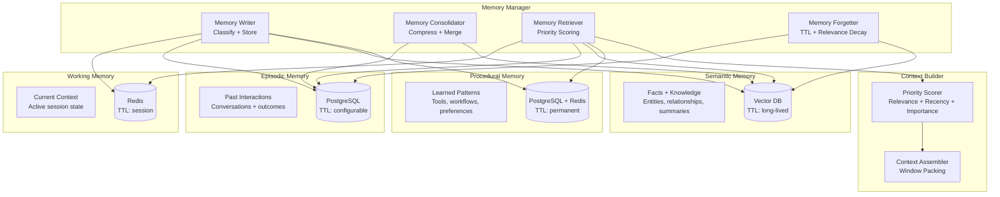
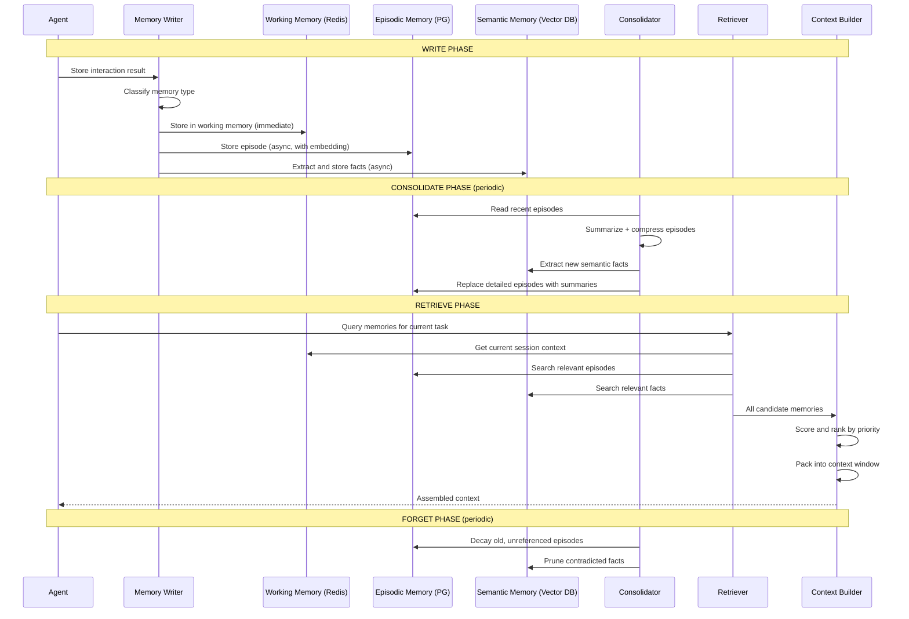

# Agent Memory System

Memory is the critical differentiator between a stateless LLM wrapper and a true AI agent. This design covers a production-grade memory system with four memory tiers (working, episodic, semantic, procedural), multi-backend storage, priority-scored retrieval, automatic consolidation, and cross-agent sharing.

---

## Problem Statement

> **Interviewer:** "Design a memory system for AI agents that supports short-term, long-term, and episodic memory with efficient retrieval. The system should allow agents to remember past interactions, learn from experience, maintain context across sessions, and share knowledge with other agents. Consider how you would handle context window limits, memory consolidation, and data retention compliance."

---

## Clarifying Questions to Ask

1. **Single agent or multi-agent?** Are we designing memory for a single agent or a fleet of agents that need to share knowledge? This drives whether we need a shared memory bus and access control.
2. **Session scope vs. persistent?** Do memories need to survive agent restarts, or is in-session context sufficient? Persistent memory requires durable storage backends.
3. **Privacy and compliance requirements?** Are there GDPR or similar data retention obligations? Do we need hard deletion from vector databases (which is non-trivial)?
4. **Memory volume per agent?** How many interactions per day does a single agent handle? This determines storage sizing and consolidation frequency.
5. **Latency budget for retrieval?** Is sub-100ms retrieval required during real-time conversations, or can we tolerate higher latency for batch/offline agents?
6. **Context window size?** What is the target LLM's context window? This determines how aggressively we must score and prune memories during context assembly.
7. **Memory types needed?** Do we need all four tiers (working, episodic, semantic, procedural), or is a subset sufficient for the use case?
8. **Cross-agent trust model?** When agents share memories, what access control model applies? Can any agent read any other agent's memory, or is it scoped by team/tenant?

---

## Requirements

### Functional Requirements

1. **Memory taxonomy** -- support working memory (current session), episodic memory (past interactions), semantic memory (facts and knowledge), and procedural memory (learned patterns and workflows)
2. **Write, consolidate, retrieve, forget** -- full memory lifecycle with automatic consolidation and configurable retention
3. **Context window management** -- dynamically select the most relevant memories to fill the LLM context window
4. **Cross-session persistence** -- memories survive agent restarts and session boundaries
5. **Memory sharing** -- agents can share relevant memories with other agents in a multi-agent system
6. **Priority scoring** -- rank memories by relevance, recency, importance, and access frequency
7. **Privacy and data retention** -- enforce data retention policies, support GDPR deletion, and isolate per-user memories

### Non-Functional Requirements

| Requirement | Target |
|-------------|--------|
| Write latency | < 50ms for working memory; < 200ms for persistent |
| Retrieval latency | < 100ms for top-20 memories |
| Context assembly latency | < 300ms to build full context |
| Storage per agent | Support 100K+ memories per agent instance |
| Cross-agent sharing latency | < 500ms |
| Retention compliance | 100% enforcement of TTL and deletion policies |
| Scale | 10K+ concurrent agents, 1B+ total memories |

### Out of Scope

- Training or fine-tuning models on memories (this is a runtime system)
- Memory visualization and debugging UI (separate tooling)
- Agent decision-making logic (this is the memory layer only)

---

## High-Level Architecture



### Architecture Walkthrough

The architecture is organized around four memory tiers, each backed by a storage technology chosen for its access pattern.

**Working Memory** uses Redis for sub-millisecond reads and writes. It holds the current session's context -- the active conversation, scratchpad variables, and intermediate reasoning state. Working memory is ephemeral, scoped to a session, and automatically evicted via TTL.

**Episodic Memory** uses PostgreSQL for structured storage of past interactions. Each episode records the conversation content, outcome (success/failure), importance score, and an embedding vector for similarity search. Episodes are partitioned by agent ID and timestamp, enabling efficient range queries and time-based retention enforcement.

**Semantic Memory** uses a vector database (Pinecone, pgvector, or similar) for long-lived factual knowledge. These are self-contained statements extracted from episodes -- things the agent has learned about the user, the domain, or the world. Retrieval is via approximate nearest-neighbor search against the current query embedding.

**Procedural Memory** uses PostgreSQL for durable storage with a Redis cache for hot patterns. Procedural memories are reusable workflows, tool usage patterns, and learned preferences. They are the smallest memory tier by volume but arguably the highest-leverage, since they encode "how to do things" rather than "what happened."

The **Memory Manager** orchestrates the full lifecycle. The Writer classifies incoming memories and routes them to the appropriate stores. The Consolidator runs periodically to compress old episodes into summaries and extract durable facts into semantic memory. The Retriever fetches and scores candidate memories from all stores in parallel. The Forgetter enforces TTL-based expiration and relevance-decay-based pruning.

The **Context Builder** sits between the Memory Manager and the LLM. It receives scored candidate memories from the Retriever, allocates a token budget across memory types (ensuring diversity), and packs the most valuable memories into the context window. When a high-priority memory exceeds the remaining budget, the Context Builder summarizes it to fit.

---

## Component Design

### 1. Memory Writer

The Memory Writer is the ingestion gateway for all memories. When an agent completes an interaction, the Writer receives the raw memory and performs two operations: classification and routing.

**Classification** uses a lightweight LLM call to determine which memory tiers the interaction belongs to. A single interaction can produce memories in multiple tiers -- for example, a customer support conversation might generate an episodic memory (the conversation itself), semantic memories (facts learned about the customer), and a procedural memory (a new workflow pattern that succeeded). The classifier also assigns an importance score from 0.0 to 1.0 based on the interaction's significance.

**Routing** writes to working memory synchronously (the fast path -- Redis SET with TTL) and to persistent stores asynchronously. For episodic and semantic storage, the Writer generates an embedding vector using the configured embedding model before inserting the record. Procedural memories are upserted so that repeated patterns update their success rate and usage count rather than creating duplicates.

The key design decision here is classifying at write time rather than at retrieval time. This adds latency to the write path (the lightweight LLM call) but means retrieval can be a pure read operation without classification overhead. Since writes are less latency-sensitive than retrievals (the agent has already completed the interaction), this trade-off is favorable.

### 2. Memory Retriever with Priority Scoring

The Memory Retriever is the read-path counterpart to the Writer. Given a query (typically the agent's current task or user message), it fetches candidate memories from all four stores in parallel and scores them using a multi-factor priority function.

**Parallel retrieval** issues concurrent requests to Redis (working memory), PostgreSQL (episodic), the vector database (semantic), and PostgreSQL+Redis (procedural). Each store returns its top-K candidates ranked by its native retrieval mechanism (recency for Redis, embedding similarity for the vector DB, etc.).

**Priority scoring** combines five weighted factors: relevance (cosine similarity to the current query, weight 0.35), recency (exponential decay with a half-life of approximately one week, weight 0.20), importance (assigned at write time and boosted by positive outcomes, weight 0.20), access frequency (how often a memory has been retrieved, capped at 1.0, weight 0.10), and type bonus (working memory gets a 0.3 boost for session continuity, procedural gets 0.2, weight 0.15).

**Deduplication** removes near-duplicates that can arise when the same fact appears in both episodic and semantic memory (for example, a fact extracted from an episode that has not yet been consolidated). The deduplicator uses embedding similarity and content hashing to identify duplicates and keeps the higher-scored version.

This scoring approach is deliberately tunable. The weights can be adjusted per agent or per use case -- a research agent might increase the relevance weight and decrease recency, while a customer support agent might boost recency and importance.

### 3. Context Window Manager

The Context Window Manager solves a bin-packing problem: given a fixed token budget (the LLM's context window minus the system prompt, current query, and output reservation), select the subset of scored memories that maximizes information value.

It first calculates the available token budget by subtracting the system prompt tokens, current query tokens, and an output reservation (default 4096 tokens) from the model's maximum context window. It then allocates this budget across memory types using a fixed ratio: 40% to working memory (current session gets the most space), 25% to semantic memory (factual grounding), 20% to episodic memory (past experience), and 15% to procedural memory (reusable patterns).

Within each allocation, it greedily packs memories in priority-score order until the budget is exhausted. If a high-priority memory exceeds the remaining budget but is important enough (greater than 50% of the type's total allocation), the manager summarizes it to fit rather than dropping it entirely.

The final output is sorted with working memory first (for session continuity) and then by priority score. The manager also reports utilization metrics: tokens used, tokens available, and how many memories were dropped -- useful for tuning budget allocations.

### 4. Memory Consolidator

The Consolidator is a background process that implements the "memory lifecycle" -- the transition from detailed, recent memories to compressed, durable knowledge. It runs periodically (typically every few hours) and performs five phases.

**Phase 1: Episode Summarization.** Episodes older than a configurable threshold (default seven days) are grouped by topic and summarized using an LLM call. The summary preserves key decisions, outcomes, errors, lessons learned, and user preferences. The original detailed episodes are then deleted and replaced with the summary, dramatically reducing storage and retrieval noise.

**Phase 2: Fact Extraction.** Recent episodes that have not yet been processed are scanned for factual statements that should live in semantic memory. These are self-contained assertions like "User prefers dark mode" or "The API rate limit is 100 requests per minute."

**Phase 3: Semantic Deduplication.** Near-duplicate facts in semantic memory are merged. When two facts contradict each other, the newer one with higher confidence wins, and the older one is pruned. This prevents semantic memory from growing unboundedly with redundant information.

**Phase 4: Procedural Statistics.** Success rates and usage counts for procedural memories are updated based on recent episodes. A workflow pattern that consistently leads to failures has its success rate decreased, making it less likely to be retrieved.

**Phase 5: Retention Enforcement.** Memories that have exceeded their TTL are hard-deleted. Additionally, memories that have not been accessed in over 30 days and have an importance score below 0.3 are pruned via relevance decay. This implements the "forgetting" function, ensuring the memory system does not grow without bound.

### 5. Cross-Agent Memory Sharing

Memory sharing enables agents in a multi-agent system to leverage each other's knowledge without re-learning from scratch. The sharing protocol has four steps.

**Retrieval:** The source agent's memories are queried using the requesting agent's query, returning the most relevant candidates.

**Filtering:** Memories marked as "private" (e.g., containing user PII or sensitive business logic) are excluded. An access control check verifies that the source and target agents have a sharing relationship (defined at the tenant or team level).

**Redaction:** Sensitive information (PII, credentials, internal identifiers) is redacted from shareable memories before transfer. This is a defense-in-depth measure -- even if the access control check passes, the content is sanitized.

**Storage with provenance:** Shared memories are written to the target agent's episodic memory with a clear provenance tag (e.g., "[Shared from agent-research-01]"). This ensures the target agent can distinguish its own experiences from imported knowledge and can trace knowledge back to its source.

### 6. Privacy and Data Retention

:::warning
Memory systems store potentially sensitive user information across sessions. Every memory must have an associated retention policy, and the system must support hard deletion (not just soft delete) for GDPR compliance. The "right to be forgotten" means removing a user's memories from all stores -- including vector databases where deletion of individual embeddings can be complex.
:::

The Retention Policy Enforcer manages six retention tiers: transient (1 hour), session (24 hours), short-term (7 days), medium-term (90 days), long-term (365 days), and permanent (never expires, used for procedural memory). Every memory is assigned a retention tier at write time.

For GDPR Article 17 (right to erasure), the enforcer issues parallel delete commands to all four stores for the target user ID. After deletion, it runs a verification pass to confirm zero remaining memories. If any memories survive (for example, due to a vector database replication lag), the enforcer raises an alert. All deletion events are recorded in an immutable audit log, which is itself exempt from deletion (regulatory requirement).

---

## Data Flow



### Data Flow Walkthrough

The memory lifecycle consists of four phases that operate on different timescales.

**Write Phase (real-time).** When an agent completes an interaction, the Memory Writer classifies the result and writes it synchronously to working memory (Redis) and asynchronously to persistent stores. The synchronous path ensures sub-50ms latency for session continuity; the async path allows embedding generation and database writes to happen without blocking the agent.

**Consolidate Phase (periodic, every few hours).** The Consolidator reads recent episodes from PostgreSQL, groups them by topic, and generates summaries using an LLM. It extracts durable facts into the vector database and replaces the original detailed episodes with compressed summaries. This is the system's "sleep cycle" -- analogous to how human memory consolidates during sleep.

**Retrieve Phase (real-time).** When the agent needs context for a new task, the Retriever queries all four stores in parallel, scores the candidates using the multi-factor priority function, deduplicates, and passes the results to the Context Builder. The Context Builder packs the most valuable memories into the available token budget and returns the assembled context to the agent.

**Forget Phase (periodic, daily).** The Consolidator applies retention policies, deleting expired memories and pruning stale ones via relevance decay. This prevents unbounded storage growth and ensures compliance with data retention policies.

---

## Scaling Considerations

| Component | Backend | Scale Strategy |
|-----------|---------|---------------|
| Working memory | Redis Cluster | Shard by agent_id; TTL auto-cleanup |
| Episodic memory | PostgreSQL | Partition by agent_id + time; read replicas |
| Semantic memory | Pinecone / pgvector | Namespace per agent; approximate search |
| Procedural memory | PostgreSQL + Redis cache | Small dataset; cache hot patterns |
| Consolidator | Background workers | Scheduled per agent; distributed lock |

**Working memory** scales horizontally via Redis Cluster, with consistent hashing by agent_id. Since working memory is ephemeral and TTL-managed, capacity planning is straightforward -- allocate approximately 50MB per active agent.

**Episodic memory** uses PostgreSQL with range partitioning by (agent_id, timestamp). This enables efficient time-based queries and retention enforcement (drop entire partitions for expired data). Read replicas handle retrieval load during peak hours.

**Semantic memory** uses a managed vector database (Pinecone, Weaviate, or pgvector) with namespace isolation per agent. Approximate nearest-neighbor search provides sub-100ms retrieval even at millions of vectors. For cost optimization at scale, consider hierarchical indexing: a coarse index across all agents for cross-agent search and a fine-grained index per agent for within-agent retrieval.

**Consolidation** runs as distributed background workers with one worker per agent, coordinated via distributed locks (Redis SETNX or PostgreSQL advisory locks) to prevent concurrent consolidation of the same agent's memories.

---

## Cost Analysis

| Component | Monthly Cost (per 1K agents) | Notes |
|-----------|-------------|-------|
| Redis (working memory) | $200 | 50MB per agent, 50GB total |
| PostgreSQL (episodic) | $500 | 100K episodes per agent |
| Vector DB (semantic) | $300 | 500K vectors per 1K agents |
| Embedding compute | $100 | Amortized over writes |
| Consolidation compute | $50 | Periodic batch jobs |
| **Total** | **$1,150/month** | **$1.15 per agent per month** |

:::info
At $1.15 per agent per month, memory is one of the cheapest components in an agent system -- but also one of the highest-leverage. An agent with good memory provides dramatically better user experience than one that forgets everything between sessions.
:::

---

## Data Layer Deep Dive

### Database Selection Justification

Each memory tier maps to a storage technology chosen for its access pattern. The table below records the selection rationale and the alternatives that were evaluated and rejected.

| Store | Technology | Why This Choice | Alternative Considered | Why Not |
|-------|-----------|----------------|----------------------|---------|
| Episodic memory | PostgreSQL (range-partitioned) + pgvector | Interaction records are relational (join to agents, users, sessions) and time-ordered; range partitioning by time makes retention enforcement a partition `DROP` rather than a mass `DELETE`; pgvector adds ANN over the same row so recent-episode recall and similarity recall share one store | Separate document DB + separate vector DB | Two stores to keep consistent; episodes are naturally relational; splitting embedding from row forces a distributed join on every recall |
| Semantic memory | PostgreSQL + pgvector, HNSW index | Facts are long-lived, dedup-heavy, and queried by cosine similarity; pgvector HNSW gives sub-100ms ANN up to a few million vectors per node; `content_hash` unique constraint enforces write-time dedup; per-user `namespace` enables wholesale drop for GDPR | Dedicated vector DB (Pinecone, Qdrant) | Adds a second system of record and its own auth/networking/billing; only justified past ~5M vectors per shard where pgvector recall/latency degrades |
| Procedural memory | PostgreSQL + Redis cache | Small, high-leverage dataset (skills/policies); needs ACID upserts to update success/failure counters atomically; a generated `success_rate` column keeps ranking cheap; hot skills cached in Redis | Store policies in the vector DB alongside facts | Procedural rows are keyed lookups and counter updates, not similarity search; mixing them with facts pollutes ANN recall |

### Schema Design

Each table lists its indexes with justification for why each index exists.

#### episodic_memory

Stores every interaction/event record an agent produces. Range-partitioned by `created_at` so expired data is dropped a partition at a time.

```sql
CREATE TABLE episodic_memory (
    id            UUID        NOT NULL DEFAULT gen_random_uuid(),
    agent_id      VARCHAR(64) NOT NULL,
    user_id       VARCHAR(64) NOT NULL,
    session_id    VARCHAR(64) NOT NULL,
    event_type    VARCHAR(32) NOT NULL
        CHECK (event_type IN ('conversation', 'action', 'observation', 'outcome')),
    content       TEXT        NOT NULL,
    outcome       VARCHAR(16)
        CHECK (outcome IN ('success', 'failure', 'partial', 'unknown')),
    importance    REAL        NOT NULL DEFAULT 0.5
        CHECK (importance >= 0.0 AND importance <= 1.0),
    embedding     vector(1536),
    access_count  INTEGER     NOT NULL DEFAULT 0,
    last_accessed_at TIMESTAMPTZ,
    retention_tier VARCHAR(16) NOT NULL DEFAULT 'medium_term'
        CHECK (retention_tier IN ('transient', 'session', 'short_term',
                                  'medium_term', 'long_term', 'permanent')),
    is_deleted    BOOLEAN     NOT NULL DEFAULT false,
    metadata      JSONB       NOT NULL DEFAULT '{}',
    created_at    TIMESTAMPTZ NOT NULL DEFAULT now(),
    expires_at    TIMESTAMPTZ,
    PRIMARY KEY (id, created_at)
) PARTITION BY RANGE (created_at);

-- One month-sized partition; a scheduler creates these ahead of time.
CREATE TABLE episodic_memory_2026_07 PARTITION OF episodic_memory
    FOR VALUES FROM ('2026-07-01') TO ('2026-08-01');

-- Recent-episode fetch: "last N episodes for this agent/session".
CREATE INDEX idx_episodic_agent_recent
    ON episodic_memory (agent_id, session_id, created_at DESC)
    WHERE is_deleted = false;

-- ANN recall over episodes. Created on each partition (pgvector HNSW does not
-- propagate from a partitioned parent), so per-partition build keeps graphs small.
CREATE INDEX idx_episodic_2026_07_embedding
    ON episodic_memory_2026_07
    USING hnsw (embedding vector_cosine_ops)
    WITH (m = 16, ef_construction = 200);

-- Retention sweep: find rows past their TTL cheaply.
CREATE INDEX idx_episodic_expires ON episodic_memory (expires_at)
    WHERE is_deleted = false;
```

**Index rationale**:
- `idx_episodic_agent_recent` -- serves the recent-episode query (`WHERE agent_id = ? AND session_id = ? ORDER BY created_at DESC`) as an index-only ordering, no sort. The partial predicate keeps tombstoned rows out of the index entirely.
- `idx_episodic_..._embedding` -- HNSW (`m = 16`, `ef_construction = 200`) gives sub-100ms ANN with recall above 0.95 for partitions under ~1M rows. Building per-partition means each graph stays small and a dropped partition drops its index with it -- no ANN compaction needed for time-based expiry.
- `idx_episodic_expires` -- lets the Forgetter locate TTL-expired rows without scanning the heap.

#### semantic_memory

Stores self-contained facts/knowledge with vector embeddings. A per-user `namespace` and a `content_hash` unique constraint are the two load-bearing columns: the first enables wholesale GDPR drops, the second enforces write-time dedup.

```sql
CREATE TABLE semantic_memory (
    id             UUID         NOT NULL DEFAULT gen_random_uuid(),
    agent_id       VARCHAR(64)  NOT NULL,
    user_id        VARCHAR(64),                       -- NULL for agent/world facts
    namespace      VARCHAR(128) NOT NULL,             -- e.g. 'user:u_8842' or 'world'
    fact           TEXT         NOT NULL,
    subject        VARCHAR(256),
    predicate      VARCHAR(128),
    object         TEXT,
    confidence     REAL         NOT NULL DEFAULT 0.7
        CHECK (confidence >= 0.0 AND confidence <= 1.0),
    source_episode_id UUID,
    embedding      vector(1536) NOT NULL,
    content_hash   CHAR(64)     NOT NULL,             -- sha256 of normalized fact
    supersedes     UUID,                              -- fact this row replaces
    valid_from     TIMESTAMPTZ  NOT NULL DEFAULT now(),
    valid_until    TIMESTAMPTZ,                       -- NULL = currently valid
    is_deleted     BOOLEAN      NOT NULL DEFAULT false,
    created_at     TIMESTAMPTZ  NOT NULL DEFAULT now(),
    updated_at     TIMESTAMPTZ  NOT NULL DEFAULT now(),
    PRIMARY KEY (id),
    CONSTRAINT uq_semantic_dedup UNIQUE (namespace, content_hash)
);

-- ANN recall: cosine similarity over currently-valid facts.
CREATE INDEX idx_semantic_embedding ON semantic_memory
    USING hnsw (embedding vector_cosine_ops)
    WITH (m = 16, ef_construction = 200);

-- Namespace scan: the GDPR path deletes/drops an entire user namespace.
CREATE INDEX idx_semantic_namespace ON semantic_memory (namespace)
    WHERE is_deleted = false;

-- Contradiction resolution: find prior facts about the same subject/predicate.
CREATE INDEX idx_semantic_subject_pred
    ON semantic_memory (namespace, subject, predicate)
    WHERE valid_until IS NULL AND is_deleted = false;
```

**Index rationale**:
- `idx_semantic_embedding` -- the primary recall path. HNSW over cosine distance; `ef_search` is set per query at runtime to trade recall against latency.
- `idx_semantic_namespace` -- GDPR erasure and per-user recall scope both filter by `namespace`; this index turns "everything about user X" into a range scan.
- `idx_semantic_subject_pred` -- the Consolidator's dedup/contradiction pass looks up existing `(subject, predicate)` facts to decide whether a new fact supersedes an old one. The partial predicate limits the index to currently-valid, live facts.

#### procedural_memory

Stores learned skills/policies. Upserted (not inserted) so repeated patterns update counters rather than duplicating. `success_rate` is a generated column so ranking never recomputes it.

```sql
CREATE TABLE procedural_memory (
    id            UUID         NOT NULL DEFAULT gen_random_uuid(),
    agent_id      VARCHAR(64)  NOT NULL,
    skill_name    VARCHAR(128) NOT NULL,
    trigger_pattern TEXT       NOT NULL,              -- when this skill applies
    policy        JSONB        NOT NULL,              -- learned parameters/steps
    tool_sequence JSONB,                              -- ordered tool calls
    success_count INTEGER      NOT NULL DEFAULT 0,
    failure_count INTEGER      NOT NULL DEFAULT 0,
    success_rate  REAL GENERATED ALWAYS AS (
        CASE WHEN (success_count + failure_count) = 0 THEN 0.0
             ELSE success_count::REAL / (success_count + failure_count)
        END
    ) STORED,
    avg_reward    REAL         NOT NULL DEFAULT 0.0,
    embedding     vector(1536),
    version       INTEGER      NOT NULL DEFAULT 1,
    created_at    TIMESTAMPTZ  NOT NULL DEFAULT now(),
    updated_at    TIMESTAMPTZ  NOT NULL DEFAULT now(),
    PRIMARY KEY (id),
    CONSTRAINT uq_procedural_skill UNIQUE (agent_id, skill_name)
);

-- Retrieval by relevance then reliability: ANN over the trigger embedding.
CREATE INDEX idx_procedural_embedding ON procedural_memory
    USING hnsw (embedding vector_cosine_ops)
    WITH (m = 16, ef_construction = 200);

-- "Best skills for this agent": ranking by proven reliability.
CREATE INDEX idx_procedural_agent_rank
    ON procedural_memory (agent_id, success_rate DESC, avg_reward DESC);
```

**Index rationale**:
- `idx_procedural_embedding` -- candidate skills are first fetched by trigger-pattern similarity, then re-ranked by `success_rate`.
- `idx_procedural_agent_rank` -- serves the "top reliable skills for this agent" query without a sort; the generated `success_rate` column keeps the sort key materialized.

### Key Queries

These are the actual queries the system runs, not simplified examples.

**1. Semantic recall via cosine distance (namespace-scoped, valid-only)**

Used by the Retriever to pull the facts most relevant to the current query, scoped to the current user's namespace (or shared `world` facts) and excluding superseded/deleted rows.

```sql
SELECT id, fact, confidence,
       1 - (embedding <=> $1) AS similarity
FROM semantic_memory
WHERE namespace = ANY($2)          -- e.g. ARRAY['user:u_8842', 'world']
  AND valid_until IS NULL
  AND is_deleted = false
ORDER BY embedding <=> $1          -- cosine distance; uses HNSW index
LIMIT 20;
```

The `<=>` operator is cosine distance; `1 - distance` converts it back to a similarity score for the downstream priority function. Filtering `valid_until IS NULL` ensures contradicted facts never resurface.

**2. Recent-episode fetch (session continuity)**

Used at the start of every turn to reload what just happened in this session.

```sql
SELECT id, event_type, content, outcome, importance, created_at
FROM episodic_memory
WHERE agent_id = $1
  AND session_id = $2
  AND is_deleted = false
  AND created_at >= now() - INTERVAL '24 hours'
ORDER BY created_at DESC
LIMIT 15;
```

The `created_at` lower bound lets the planner prune to the most recent partition(s), and the partial-index predicate (`is_deleted = false`) keeps tombstones out of the scan.

**3. Contradiction lookup + supersede (consolidation write-back)**

Used by the Consolidator: before inserting a new fact, find the current fact about the same `(subject, predicate)` so the newer, higher-confidence one can supersede it.

```sql
UPDATE semantic_memory
SET valid_until = now(),
    updated_at  = now()
WHERE namespace = $1
  AND subject   = $2
  AND predicate = $3
  AND valid_until IS NULL
  AND is_deleted = false
  AND confidence <= $4              -- only retire lower-confidence facts
RETURNING id;
```

The returned `id` is written into the new fact's `supersedes` column, preserving an audit chain of how knowledge evolved.

---

## GDPR / Right-to-Be-Forgotten: Hard Deletion from ANN Indexes

:::warning
This is the genuinely hard problem in the design. Deleting a user's *rows* is easy; deleting their *vectors from an ANN index* such that they can no longer influence recall is not. GDPR Article 17 requires provable erasure, and an HNSW graph does not support cheap, exact single-vector removal.
:::

### Why hard-deleting a vector from an ANN index is non-trivial

An HNSW index is a multi-layer proximity graph: each vector is a node wired to its nearest neighbors. The recall guarantee comes from that connectivity. Three properties make deletion painful:

1. **No in-place delete.** pgvector's HNSW (like most HNSW implementations) has no operation that removes a node and rewires its neighbors. Deleting the heap row leaves the graph node in place; it simply stops matching the visibility filter at query time.
2. **Tombstones degrade recall and latency.** The usual workaround is a soft delete: mark the row `is_deleted = true` and filter it out in the `WHERE` clause. But the vector is still traversed during graph search. As tombstones accumulate, the search visits dead nodes, `ef_search` must rise to keep recall, and latency climbs. A namespace that is 40% tombstoned can lose meaningful recall.
3. **Copies leak.** The same embedding may exist in read replicas, in a WAL/backup, and in the write-ahead embedding cache. "Forgetting" must cover all of them, and replication lag can leave a vector alive on a replica after the primary delete.

### Strategy A -- Soft-delete tombstoning + periodic rebuild/compaction

Mark rows deleted immediately (so they disappear from results within one query), then reclaim them in a scheduled compaction:

- Erasure request flips `is_deleted = true` for every matching row across all tiers; the vector is filtered out of recall from that moment.
- A nightly/weekly compaction job rebuilds the affected HNSW index (`REINDEX` / rebuild into a new index and swap) from only the live rows, physically dropping tombstoned vectors.
- During rebuild, serve queries from the old index (still filtering tombstones) and atomically swap on completion, so there is no recall gap -- only a temporary memory overhead for holding two indexes.

**Tradeoff:** immediate *logical* deletion, but physical purge is deferred to the rebuild window. Rebuilds are expensive (O(N log N) graph construction) and transiently double index memory. You must document the rebuild SLA (e.g., "physical erasure within 24h") to satisfy regulators.

### Strategy B -- Per-user namespaces/partitions dropped wholesale

Isolate each user's vectors so erasure is a drop, not a graph edit:

- Semantic memory carries a per-user `namespace` (`user:u_8842`); a dedicated HNSW index per high-value user, or per-user partitions, lets erasure `DROP` the whole structure -- instant, exact, no rebuild of anyone else's graph.
- Episodic memory is already time-partitioned; combined with per-user sub-partitioning (or a per-user table for large tenants), a user's episodes drop as a unit and their per-partition HNSW index disappears with them.

**Tradeoff:** wholesale drop is immediate and exact, but per-user partitioning explodes the object count (millions of tiny indexes), hurts cross-user recall (you cannot search one big graph), and wastes memory on graph overhead for users with few vectors. It is best reserved for large or high-risk tenants, with smaller users pooled under Strategy A.

| Strategy | Deletion latency (logical) | Physical purge | Recall during operation | Best for |
|----------|---------------------------|----------------|-------------------------|----------|
| Tombstone + rebuild | Immediate (filtered) | Deferred to rebuild | Degrades as tombstones grow; restored after rebuild | The default for pooled, many-small-user tenants |
| Per-user namespace drop | Immediate (dropped) | Immediate | Unaffected for others; cannot do one-graph cross-user search | Large / high-risk tenants requiring instant exact erasure |

:::info
In practice both are combined: per-user namespaces for isolation, tombstoning for the moment-of-request guarantee, and periodic compaction to physically reclaim space. Every erasure is written to an immutable audit log (itself exempt from deletion), and a post-deletion verification pass re-queries each store -- including replicas -- to confirm zero live vectors before the request is marked complete.
:::

---

## Memory Consolidation and Compaction

Consolidation is what keeps the system from drowning in its own history. Component Design covered the five-phase cycle; this section details the policies that govern *what* survives.

### Forgetting / decay policy

Every memory carries a decayed **retention score** combining importance (assigned at write time), recency (exponential decay), and access frequency. Memories whose score falls below an eviction threshold are candidates for forgetting -- summarized then dropped, not silently lost. Recency uses an exponential half-life so old-but-important memories fade gracefully rather than being cut off at a hard age boundary.

```python
import math
from dataclasses import dataclass


@dataclass
class MemoryRecord:
    memory_id: str
    importance: float        # 0.0 - 1.0, assigned at write time
    last_accessed_at: float  # unix seconds
    access_count: int


def retention_score(
    record: MemoryRecord,
    now: float,
    half_life_days: float = 7.0,
) -> float:
    """Blend importance, recency decay, and access frequency into a single
    0.0-1.0 retention score. Memories below the eviction threshold are
    candidates for forgetting/compaction."""
    age_days = max(0.0, (now - record.last_accessed_at) / 86_400.0)
    recency = math.exp(-math.log(2.0) * age_days / half_life_days)
    frequency = min(1.0, math.log1p(record.access_count) / math.log(50.0))
    return 0.5 * record.importance + 0.35 * recency + 0.15 * frequency


def should_forget(
    record: MemoryRecord,
    now: float,
    threshold: float = 0.15,
) -> bool:
    """A memory is forgotten once its decayed retention score drops below the
    threshold -- protecting frequently-used or high-importance memories."""
    return retention_score(record, now) < threshold
```

### Summarization and write-back

Rather than deleting old episodes outright, the Consolidator groups them by topic, produces an LLM summary that preserves decisions, outcomes, errors, and user preferences, and **writes the summary back** into episodic memory while extracting durable assertions into semantic memory. The original detailed episodes are then dropped. This is lossy by design: detail decays into gist, mirroring human memory consolidation, and dramatically shrinks both storage and retrieval noise.

### Dedup of contradictory facts

Semantic memory is dedup-heavy. Two mechanisms keep it clean:

- **Write-time dedup** -- the `(namespace, content_hash)` unique constraint rejects exact re-insertions; near-duplicates (high cosine similarity, different wording) are merged by the Consolidator, keeping the higher-confidence phrasing.
- **Contradiction resolution** -- when a new fact conflicts with an existing `(subject, predicate)` fact, the newer, higher-confidence fact wins: the old row's `valid_until` is stamped (see Key Query 3) so it stops matching recall but remains for audit, and the new row records `supersedes`. This gives a temporal, auditable chain of how the agent's beliefs changed rather than a destructive overwrite.

---

## Capacity Estimation

Back-of-the-envelope sizing for the flagship target of **10K concurrent agents** and **1B total memories**. Numbers are deliberately rounded to reason about order of magnitude, not to bill a cloud invoice.

### Vector index memory footprint

The dominant cost is the ANN index living in RAM. Assume embeddings need indexing for roughly 30% of the 1B memories (episodic summaries + live semantic facts), i.e. **~300M vectors**.

| Quantity | Value | Notes |
|----------|-------|-------|
| Vector dimensions | 1,536 | OpenAI `text-embedding-3-small` class |
| Bytes per dimension | 4 | float32 |
| Raw bytes per vector | 1,536 x 4 = **6 KiB** | before graph overhead |
| Indexed vectors | 300M | ~30% of 1B carry a live embedding |
| Raw vector data | 300M x 6 KiB ~ **1.8 TiB** | payload only |
| HNSW graph overhead | ~ m x 2 links x 8 B ~ 256 B/vector, ~1.5x total | connectivity is the price of fast recall |
| **Total ANN memory** | ~1.8 TiB x 1.5 ~ **2.7 TiB** | must be resident to hit sub-100ms |

Sharding across nodes with ~256 GiB usable RAM each gives ~11 primary shards; with one replica for HA and read throughput, **~22 vector nodes**. Quantizing to int8 (`halfvec`/PQ) cuts raw payload ~4x and can collapse this to ~6-8 nodes at a modest recall cost -- the primary lever if the footprint dominates cost.

### Write throughput

| Quantity | Value | Notes |
|----------|-------|-------|
| Concurrent agents | 10,000 | |
| Interactions per active agent | ~1 / minute | conversational pacing |
| Memory writes per interaction | ~3 | 1 episodic + facts + procedural upsert |
| **Sustained write rate** | 10,000 x 3 / 60 ~ **500 writes/sec** | each triggers an async embedding call |

At 500 writes/sec, embedding generation (batched) and HNSW inserts are comfortably within a single well-provisioned PostgreSQL primary per shard; writes are async off the agent's critical path, so a 2-3x burst headroom is enough.

### Recall QPS and replicas

| Quantity | Value | Notes |
|----------|-------|-------|
| Concurrent agents | 10,000 | |
| Retrievals per agent turn | 1 (fans out to 4 stores) | working/episodic/semantic/procedural |
| Turn cadence | ~1 every 30s | |
| **ANN recall QPS** | 10,000 / 30 ~ **330 QPS** | to the vector tier specifically |

A single HNSW shard sustains a few thousand QPS at `ef_search` tuned for 0.95 recall, so 330 QPS is served by the HA replicas already provisioned above -- recall is memory-bound, not QPS-bound, at this scale. The retrieval fan-out to Redis (working) and PostgreSQL (episodic/procedural) runs in parallel and is dominated by the ANN leg.

:::info
The takeaway for an interview: at this scale the memory system is **RAM-bound on the ANN index**, not CPU-bound on QPS. The first cost-reduction lever is vector quantization; the second is aggressive consolidation to keep the indexed-vector count down. Both attack the 2.7 TiB figure directly.
:::

---

## Failure Modes and Production Issues

The following table documents failure modes seen in production memory systems -- the issues that dominate on-call rotations rather than architecture diagrams.

| Symptom | Root Cause | Fix |
|---------|-----------|-----|
| Unbounded memory growth; storage and ANN RAM climb linearly, latency creeps up | Consolidation/forgetting not keeping pace with writes; every interaction persists forever | Enforce retention tiers with TTL-based partition drops; run the decay-based Forgetter (see `should_forget`) so low-score memories are summarized then evicted; alert when indexed-vector count exceeds the capacity plan |
| Agent acts on stale or contradictory facts (e.g. quotes an old preference the user changed) | New facts inserted without retiring the contradicting older fact; both match recall | Contradiction resolution stamps `valid_until` on superseded facts (Key Query 3); recall filters `valid_until IS NULL`; higher-confidence, newer fact wins |
| Memory poisoning -- injected or adversarial content persisted as a trusted fact and later retrieved as ground truth | Writer stores unvalidated model/user output directly into semantic memory; no provenance or trust weighting | Tag every fact with `source_episode_id` and provenance; require a confidence floor to promote to semantic memory; redact PII/secrets at write; down-weight or quarantine facts from untrusted channels |
| Recall quality collapses after an embedding-model upgrade | New query embeddings live in a different vector space than the stored (old-model) embeddings; cosine distances are meaningless across models | Version the embedding model per row; on upgrade, backfill by re-embedding in the background and query only within a matching model version until the migration completes; never mix vector spaces in one index |
| Retrieval returns irrelevant memories that crowd out useful context | `ef_search` too low (recall miss) or priority weights mistuned so recency/frequency swamp relevance | Raise `ef_search` for the recall step; re-tune the multi-factor priority weights per use case; add a similarity floor so low-relevance candidates are dropped before context packing |
| Consolidation lag -- recent facts missing from recall; duplicates and un-summarized episodes pile up | Consolidator falling behind (single worker, lock contention, or LLM rate limits during summarization) | Scale consolidation workers with per-agent distributed locks; prioritize high-importance episodes; monitor consolidation backlog age and alert past an SLA; degrade gracefully by extracting facts synchronously for high-value interactions |
| GDPR erasure verification fails -- a deleted user's vector still surfaces in recall | Replication lag or an un-rebuilt HNSW index still traverses the tombstoned node | Post-deletion verification pass queries all replicas; force-filter tombstones in recall until the compaction rebuild completes; for high-risk tenants use per-user namespace drop for immediate exact erasure |

:::tip Operational Readiness
Build a runbook per row before launch. The two that will hurt most in the first month are **embedding drift after a model upgrade** (silent recall collapse -- easy to miss without a version guard) and **unbounded growth** (a slow leak that becomes a RAM emergency). Both need alerts wired before, not after, the incident.
:::

---

## Trade-offs & Alternatives

| Decision | Rationale | Alternative | Why Not |
|----------|-----------|-------------|---------|
| Redis for working memory | Sub-ms latency, native TTL, simple key-value model | In-process dictionary | Does not survive restarts; not shareable across replicas |
| PostgreSQL for episodic memory | ACID guarantees, rich querying, mature partitioning | MongoDB / DynamoDB | Episodic data is relational (joins with agents, users, sessions); document DB adds complexity without benefit |
| Separate vector DB for semantic memory | Purpose-built ANN indexes; scales independently | pgvector extension in PostgreSQL | pgvector works well up to ~1M vectors; beyond that, a dedicated vector DB offers better indexing and operational tooling |
| Classify at write time (not retrieval time) | Retrieval is latency-critical; write path is more tolerant of LLM latency | Classify on read | Adds 200-500ms to every retrieval; duplicates classification work across reads |
| Fixed budget allocation by memory type | Ensures diversity -- agent always sees some facts, some episodes, some patterns | Dynamic allocation | Harder to debug and tune; can degenerate to all-episodic or all-semantic context |
| Exponential decay for recency scoring | Smooth, continuous decay; tunable half-life parameter | Hard cutoff (ignore memories older than N days) | Loses valuable old memories abruptly; exponential decay gracefully deprioritizes without discarding |
| LLM-based consolidation | Produces coherent summaries; extracts implicit facts | Rule-based compression (truncation, keyword extraction) | Loses nuance and context; cannot identify implicit facts or contradictions |
| Hard deletion for GDPR | Required by regulation; no ambiguity about compliance | Soft delete with access control | Regulators require provable erasure; soft delete leaves data recoverable |

---

## Interview Tips

:::tip How to Present This (35 minutes)

**Minutes 0-2: Clarify scope.** Ask about single vs. multi-agent, session vs. persistent, privacy requirements, and context window size. These questions demonstrate that you understand memory systems are not one-size-fits-all.

**Minutes 2-7: Memory taxonomy.** Draw the four-tier diagram (working, episodic, semantic, procedural) and explain each with a concrete example. This is the cognitive science foundation -- interviewers want to see you reason about why these tiers exist, not just that they do.

**Minutes 7-10: Storage backend mapping.** Explain why each tier maps to a specific technology (Redis, PostgreSQL, vector DB). Focus on access patterns: working memory is hot/ephemeral, episodic is structured/queryable, semantic is similarity-searchable, procedural is small/cacheable.

**Minutes 10-17: Write and retrieve flow.** Walk through how a memory enters the system (classification, routing, embedding) and how it is retrieved (parallel fetch, priority scoring, deduplication). Draw the sequence diagram. Emphasize the five-factor scoring function and why each factor matters.

**Minutes 17-22: Consolidation and forgetting.** Explain the five-phase consolidation cycle. This is where most candidates differentiate themselves -- consolidation is the hard part of memory systems. Discuss the analogy to human sleep-based memory consolidation.

**Minutes 22-27: Context window management.** Explain the bin-packing problem, budget allocation by type, and summarization for overflow. This shows you understand the practical constraint that makes memory systems necessary in the first place.

**Minutes 27-30: Cross-agent sharing.** Briefly cover the sharing protocol (retrieve, filter, redact, store with provenance). This shows multi-agent system thinking.

**Minutes 30-33: Privacy and compliance.** Discuss GDPR hard deletion across all stores, the challenge of deleting from vector databases, and the audit trail requirement. This is increasingly important in enterprise contexts.

**Minutes 33-35: Scale and cost.** Present the cost table. Highlight that at $1.15 per agent per month, memory is cheap but high-leverage. Discuss partitioning strategies and the consolidator's distributed coordination.

:::
