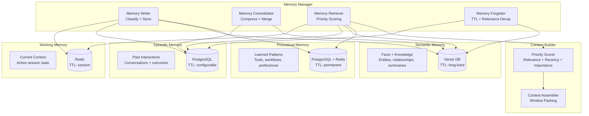
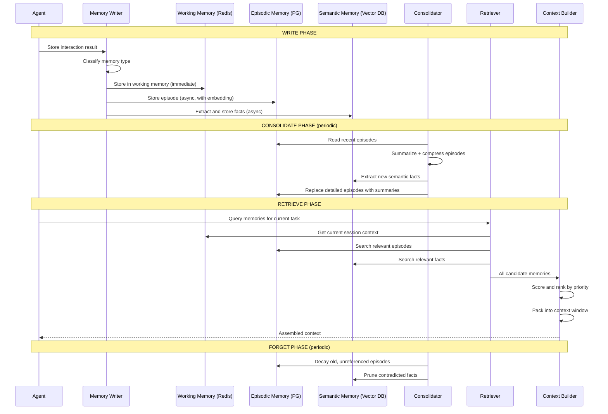

# Agent Memory System

Memory is the critical differentiator between a stateless LLM wrapper and a true AI agent. This design covers a production-grade memory system with four memory tiers (working, episodic, semantic, procedural), multi-backend storage, priority-scored retrieval, automatic consolidation, and cross-agent sharing.

---

## Problem Statement

> **Interviewer:** "Design a memory system for AI agents that supports short-term, long-term, and episodic memory with efficient retrieval. The system should allow agents to remember past interactions, learn from experience, maintain context across sessions, and share knowledge with other agents. Consider how you would handle context window limits, memory consolidation, and data retention compliance."

---

## Clarifying Questions to Ask

1. **Single agent or multi-agent?** Are we designing memory for a single agent or a fleet of agents that need to share knowledge? This drives whether we need a shared memory bus and access control.
2. **Session scope vs. persistent?** Do memories need to survive agent restarts, or is in-session context sufficient? Persistent memory requires durable storage backends.
3. **Privacy and compliance requirements?** Are there GDPR or similar data retention obligations? Do we need hard deletion from vector databases (which is non-trivial)?
4. **Memory volume per agent?** How many interactions per day does a single agent handle? This determines storage sizing and consolidation frequency.
5. **Latency budget for retrieval?** Is sub-100ms retrieval required during real-time conversations, or can we tolerate higher latency for batch/offline agents?
6. **Context window size?** What is the target LLM's context window? This determines how aggressively we must score and prune memories during context assembly.
7. **Memory types needed?** Do we need all four tiers (working, episodic, semantic, procedural), or is a subset sufficient for the use case?
8. **Cross-agent trust model?** When agents share memories, what access control model applies? Can any agent read any other agent's memory, or is it scoped by team/tenant?

---

## Requirements

### Functional Requirements

1. **Memory taxonomy** -- support working memory (current session), episodic memory (past interactions), semantic memory (facts and knowledge), and procedural memory (learned patterns and workflows)
2. **Write, consolidate, retrieve, forget** -- full memory lifecycle with automatic consolidation and configurable retention
3. **Context window management** -- dynamically select the most relevant memories to fill the LLM context window
4. **Cross-session persistence** -- memories survive agent restarts and session boundaries
5. **Memory sharing** -- agents can share relevant memories with other agents in a multi-agent system
6. **Priority scoring** -- rank memories by relevance, recency, importance, and access frequency
7. **Privacy and data retention** -- enforce data retention policies, support GDPR deletion, and isolate per-user memories

### Non-Functional Requirements

| Requirement | Target |
|-------------|--------|
| Write latency | < 50ms for working memory; < 200ms for persistent |
| Retrieval latency | < 100ms for top-20 memories |
| Context assembly latency | < 300ms to build full context |
| Storage per agent | Support 100K+ memories per agent instance |
| Cross-agent sharing latency | < 500ms |
| Retention compliance | 100% enforcement of TTL and deletion policies |
| Scale | 10K+ concurrent agents, 1B+ total memories |

### Out of Scope

- Training or fine-tuning models on memories (this is a runtime system)
- Memory visualization and debugging UI (separate tooling)
- Agent decision-making logic (this is the memory layer only)

---

## High-Level Architecture

### Architecture Walkthrough

The architecture is organized around four memory tiers, each backed by a storage technology chosen for its access pattern.

**Working Memory** uses Redis for sub-millisecond reads and writes. It holds the current session's context -- the active conversation, scratchpad variables, and intermediate reasoning state. Working memory is ephemeral, scoped to a session, and automatically evicted via TTL.

**Episodic Memory** uses PostgreSQL for structured storage of past interactions. Each episode records the conversation content, outcome (success/failure), importance score, and an embedding vector for similarity search. Episodes are partitioned by agent ID and timestamp, enabling efficient range queries and time-based retention enforcement.

**Semantic Memory** uses a vector database (Pinecone, pgvector, or similar) for long-lived factual knowledge. These are self-contained statements extracted from episodes -- things the agent has learned about the user, the domain, or the world. Retrieval is via approximate nearest-neighbor search against the current query embedding.

**Procedural Memory** uses PostgreSQL for durable storage with a Redis cache for hot patterns. Procedural memories are reusable workflows, tool usage patterns, and learned preferences. They are the smallest memory tier by volume but arguably the highest-leverage, since they encode "how to do things" rather than "what happened."

The **Memory Manager** orchestrates the full lifecycle. The Writer classifies incoming memories and routes them to the appropriate stores. The Consolidator runs periodically to compress old episodes into summaries and extract durable facts into semantic memory. The Retriever fetches and scores candidate memories from all stores in parallel. The Forgetter enforces TTL-based expiration and relevance-decay-based pruning.

The **Context Builder** sits between the Memory Manager and the LLM. It receives scored candidate memories from the Retriever, allocates a token budget across memory types (ensuring diversity), and packs the most valuable memories into the context window. When a high-priority memory exceeds the remaining budget, the Context Builder summarizes it to fit.

---

## Component Design

### 1. Memory Writer

The Memory Writer is the ingestion gateway for all memories. When an agent completes an interaction, the Writer receives the raw memory and performs two operations: classification and routing.

**Classification** uses a lightweight LLM call to determine which memory tiers the interaction belongs to. A single interaction can produce memories in multiple tiers -- for example, a customer support conversation might generate an episodic memory (the conversation itself), semantic memories (facts learned about the customer), and a procedural memory (a new workflow pattern that succeeded). The classifier also assigns an importance score from 0.0 to 1.0 based on the interaction's significance.

**Routing** writes to working memory synchronously (the fast path -- Redis SET with TTL) and to persistent stores asynchronously. For episodic and semantic storage, the Writer generates an embedding vector using the configured embedding model before inserting the record. Procedural memories are upserted so that repeated patterns update their success rate and usage count rather than creating duplicates.

The key design decision here is classifying at write time rather than at retrieval time. This adds latency to the write path (the lightweight LLM call) but means retrieval can be a pure read operation without classification overhead. Since writes are less latency-sensitive than retrievals (the agent has already completed the interaction), this trade-off is favorable.

### 2. Memory Retriever with Priority Scoring

The Memory Retriever is the read-path counterpart to the Writer. Given a query (typically the agent's current task or user message), it fetches candidate memories from all four stores in parallel and scores them using a multi-factor priority function.

**Parallel retrieval** issues concurrent requests to Redis (working memory), PostgreSQL (episodic), the vector database (semantic), and PostgreSQL+Redis (procedural). Each store returns its top-K candidates ranked by its native retrieval mechanism (recency for Redis, embedding similarity for the vector DB, etc.).

**Priority scoring** combines five weighted factors: relevance (cosine similarity to the current query, weight 0.35), recency (exponential decay with a half-life of approximately one week, weight 0.20), importance (assigned at write time and boosted by positive outcomes, weight 0.20), access frequency (how often a memory has been retrieved, capped at 1.0, weight 0.10), and type bonus (working memory gets a 0.3 boost for session continuity, procedural gets 0.2, weight 0.15).

**Deduplication** removes near-duplicates that can arise when the same fact appears in both episodic and semantic memory (for example, a fact extracted from an episode that has not yet been consolidated). The deduplicator uses embedding similarity and content hashing to identify duplicates and keeps the higher-scored version.

This scoring approach is deliberately tunable. The weights can be adjusted per agent or per use case -- a research agent might increase the relevance weight and decrease recency, while a customer support agent might boost recency and importance.

### 3. Context Window Manager

The Context Window Manager solves a bin-packing problem: given a fixed token budget (the LLM's context window minus the system prompt, current query, and output reservation), select the subset of scored memories that maximizes information value.

It first calculates the available token budget by subtracting the system prompt tokens, current query tokens, and an output reservation (default 4096 tokens) from the model's maximum context window. It then allocates this budget across memory types using a fixed ratio: 40% to working memory (current session gets the most space), 25% to semantic memory (factual grounding), 20% to episodic memory (past experience), and 15% to procedural memory (reusable patterns).

Within each allocation, it greedily packs memories in priority-score order until the budget is exhausted. If a high-priority memory exceeds the remaining budget but is important enough (greater than 50% of the type's total allocation), the manager summarizes it to fit rather than dropping it entirely.

The final output is sorted with working memory first (for session continuity) and then by priority score. The manager also reports utilization metrics: tokens used, tokens available, and how many memories were dropped -- useful for tuning budget allocations.

### 4. Memory Consolidator

The Consolidator is a background process that implements the "memory lifecycle" -- the transition from detailed, recent memories to compressed, durable knowledge. It runs periodically (typically every few hours) and performs five phases.

**Phase 1: Episode Summarization.** Episodes older than a configurable threshold (default seven days) are grouped by topic and summarized using an LLM call. The summary preserves key decisions, outcomes, errors, lessons learned, and user preferences. The original detailed episodes are then deleted and replaced with the summary, dramatically reducing storage and retrieval noise.

**Phase 2: Fact Extraction.** Recent episodes that have not yet been processed are scanned for factual statements that should live in semantic memory. These are self-contained assertions like "User prefers dark mode" or "The API rate limit is 100 requests per minute."

**Phase 3: Semantic Deduplication.** Near-duplicate facts in semantic memory are merged. When two facts contradict each other, the newer one with higher confidence wins, and the older one is pruned. This prevents semantic memory from growing unboundedly with redundant information.

**Phase 4: Procedural Statistics.** Success rates and usage counts for procedural memories are updated based on recent episodes. A workflow pattern that consistently leads to failures has its success rate decreased, making it less likely to be retrieved.

**Phase 5: Retention Enforcement.** Memories that have exceeded their TTL are hard-deleted. Additionally, memories that have not been accessed in over 30 days and have an importance score below 0.3 are pruned via relevance decay. This implements the "forgetting" function, ensuring the memory system does not grow without bound.

### 5. Cross-Agent Memory Sharing

Memory sharing enables agents in a multi-agent system to leverage each other's knowledge without re-learning from scratch. The sharing protocol has four steps.

**Retrieval:** The source agent's memories are queried using the requesting agent's query, returning the most relevant candidates.

**Filtering:** Memories marked as "private" (e.g., containing user PII or sensitive business logic) are excluded. An access control check verifies that the source and target agents have a sharing relationship (defined at the tenant or team level).

**Redaction:** Sensitive information (PII, credentials, internal identifiers) is redacted from shareable memories before transfer. This is a defense-in-depth measure -- even if the access control check passes, the content is sanitized.

**Storage with provenance:** Shared memories are written to the target agent's episodic memory with a clear provenance tag (e.g., "[Shared from agent-research-01]"). This ensures the target agent can distinguish its own experiences from imported knowledge and can trace knowledge back to its source.

### 6. Privacy and Data Retention

:::warning
Memory systems store potentially sensitive user information across sessions. Every memory must have an associated retention policy, and the system must support hard deletion (not just soft delete) for GDPR compliance. The "right to be forgotten" means removing a user's memories from all stores -- including vector databases where deletion of individual embeddings can be complex.
:::

The Retention Policy Enforcer manages six retention tiers: transient (1 hour), session (24 hours), short-term (7 days), medium-term (90 days), long-term (365 days), and permanent (never expires, used for procedural memory). Every memory is assigned a retention tier at write time.

For GDPR Article 17 (right to erasure), the enforcer issues parallel delete commands to all four stores for the target user ID. After deletion, it runs a verification pass to confirm zero remaining memories. If any memories survive (for example, due to a vector database replication lag), the enforcer raises an alert. All deletion events are recorded in an immutable audit log, which is itself exempt from deletion (regulatory requirement).

---

## Data Flow

### Data Flow Walkthrough

The memory lifecycle consists of four phases that operate on different timescales.

**Write Phase (real-time).** When an agent completes an interaction, the Memory Writer classifies the result and writes it synchronously to working memory (Redis) and asynchronously to persistent stores. The synchronous path ensures sub-50ms latency for session continuity; the async path allows embedding generation and database writes to happen without blocking the agent.

**Consolidate Phase (periodic, every few hours).** The Consolidator reads recent episodes from PostgreSQL, groups them by topic, and generates summaries using an LLM. It extracts durable facts into the vector database and replaces the original detailed episodes with compressed summaries. This is the system's "sleep cycle" -- analogous to how human memory consolidates during sleep.

**Retrieve Phase (real-time).** When the agent needs context for a new task, the Retriever queries all four stores in parallel, scores the candidates using the multi-factor priority function, deduplicates, and passes the results to the Context Builder. The Context Builder packs the most valuable memories into the available token budget and returns the assembled context to the agent.

**Forget Phase (periodic, daily).** The Consolidator applies retention policies, deleting expired memories and pruning stale ones via relevance decay. This prevents unbounded storage growth and ensures compliance with data retention policies.

---

## Scaling Considerations

| Component | Backend | Scale Strategy |
|-----------|---------|---------------|
| Working memory | Redis Cluster | Shard by agent_id; TTL auto-cleanup |
| Episodic memory | PostgreSQL | Partition by agent_id + time; read replicas |
| Semantic memory | Pinecone / pgvector | Namespace per agent; approximate search |
| Procedural memory | PostgreSQL + Redis cache | Small dataset; cache hot patterns |
| Consolidator | Background workers | Scheduled per agent; distributed lock |

**Working memory** scales horizontally via Redis Cluster, with consistent hashing by agent_id. Since working memory is ephemeral and TTL-managed, capacity planning is straightforward -- allocate approximately 50MB per active agent.

**Episodic memory** uses PostgreSQL with range partitioning by (agent_id, timestamp). This enables efficient time-based queries and retention enforcement (drop entire partitions for expired data). Read replicas handle retrieval load during peak hours.

**Semantic memory** uses a managed vector database (Pinecone, Weaviate, or pgvector) with namespace isolation per agent. Approximate nearest-neighbor search provides sub-100ms retrieval even at millions of vectors. For cost optimization at scale, consider hierarchical indexing: a coarse index across all agents for cross-agent search and a fine-grained index per agent for within-agent retrieval.

**Consolidation** runs as distributed background workers with one worker per agent, coordinated via distributed locks (Redis SETNX or PostgreSQL advisory locks) to prevent concurrent consolidation of the same agent's memories.

---

## Cost Analysis

| Component | Monthly Cost (per 1K agents) | Notes |
|-----------|-------------|-------|
| Redis (working memory) | $200 | 50MB per agent, 50GB total |
| PostgreSQL (episodic) | $500 | 100K episodes per agent |
| Vector DB (semantic) | $300 | 500K vectors per 1K agents |
| Embedding compute | $100 | Amortized over writes |
| Consolidation compute | $50 | Periodic batch jobs |
| **Total** | **$1,150/month** | **$1.15 per agent per month** |

:::info
At $1.15 per agent per month, memory is one of the cheapest components in an agent system -- but also one of the highest-leverage. An agent with good memory provides dramatically better user experience than one that forgets everything between sessions.
:::

---

## Trade-offs & Alternatives

| Decision | Rationale | Alternative | Why Not |
|----------|-----------|-------------|---------|
| Redis for working memory | Sub-ms latency, native TTL, simple key-value model | In-process dictionary | Does not survive restarts; not shareable across replicas |
| PostgreSQL for episodic memory | ACID guarantees, rich querying, mature partitioning | MongoDB / DynamoDB | Episodic data is relational (joins with agents, users, sessions); document DB adds complexity without benefit |
| Separate vector DB for semantic memory | Purpose-built ANN indexes; scales independently | pgvector extension in PostgreSQL | pgvector works well up to ~1M vectors; beyond that, a dedicated vector DB offers better indexing and operational tooling |
| Classify at write time (not retrieval time) | Retrieval is latency-critical; write path is more tolerant of LLM latency | Classify on read | Adds 200-500ms to every retrieval; duplicates classification work across reads |
| Fixed budget allocation by memory type | Ensures diversity -- agent always sees some facts, some episodes, some patterns | Dynamic allocation | Harder to debug and tune; can degenerate to all-episodic or all-semantic context |
| Exponential decay for recency scoring | Smooth, continuous decay; tunable half-life parameter | Hard cutoff (ignore memories older than N days) | Loses valuable old memories abruptly; exponential decay gracefully deprioritizes without discarding |
| LLM-based consolidation | Produces coherent summaries; extracts implicit facts | Rule-based compression (truncation, keyword extraction) | Loses nuance and context; cannot identify implicit facts or contradictions |
| Hard deletion for GDPR | Required by regulation; no ambiguity about compliance | Soft delete with access control | Regulators require provable erasure; soft delete leaves data recoverable |

---

## Interview Tips

:::tip How to Present This (35 minutes)

**Minutes 0-2: Clarify scope.** Ask about single vs. multi-agent, session vs. persistent, privacy requirements, and context window size. These questions demonstrate that you understand memory systems are not one-size-fits-all.

**Minutes 2-7: Memory taxonomy.** Draw the four-tier diagram (working, episodic, semantic, procedural) and explain each with a concrete example. This is the cognitive science foundation -- interviewers want to see you reason about why these tiers exist, not just that they do.

**Minutes 7-10: Storage backend mapping.** Explain why each tier maps to a specific technology (Redis, PostgreSQL, vector DB). Focus on access patterns: working memory is hot/ephemeral, episodic is structured/queryable, semantic is similarity-searchable, procedural is small/cacheable.

**Minutes 10-17: Write and retrieve flow.** Walk through how a memory enters the system (classification, routing, embedding) and how it is retrieved (parallel fetch, priority scoring, deduplication). Draw the sequence diagram. Emphasize the five-factor scoring function and why each factor matters.

**Minutes 17-22: Consolidation and forgetting.** Explain the five-phase consolidation cycle. This is where most candidates differentiate themselves -- consolidation is the hard part of memory systems. Discuss the analogy to human sleep-based memory consolidation.

**Minutes 22-27: Context window management.** Explain the bin-packing problem, budget allocation by type, and summarization for overflow. This shows you understand the practical constraint that makes memory systems necessary in the first place.

**Minutes 27-30: Cross-agent sharing.** Briefly cover the sharing protocol (retrieve, filter, redact, store with provenance). This shows multi-agent system thinking.

**Minutes 30-33: Privacy and compliance.** Discuss GDPR hard deletion across all stores, the challenge of deleting from vector databases, and the audit trail requirement. This is increasingly important in enterprise contexts.

**Minutes 33-35: Scale and cost.** Present the cost table. Highlight that at $1.15 per agent per month, memory is cheap but high-leverage. Discuss partitioning strategies and the consolidator's distributed coordination.

:::
