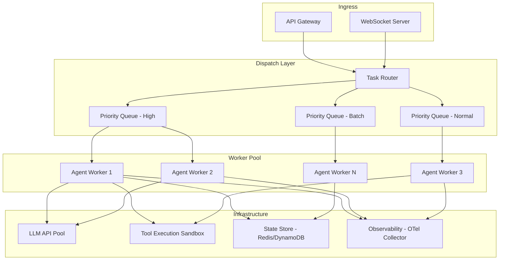
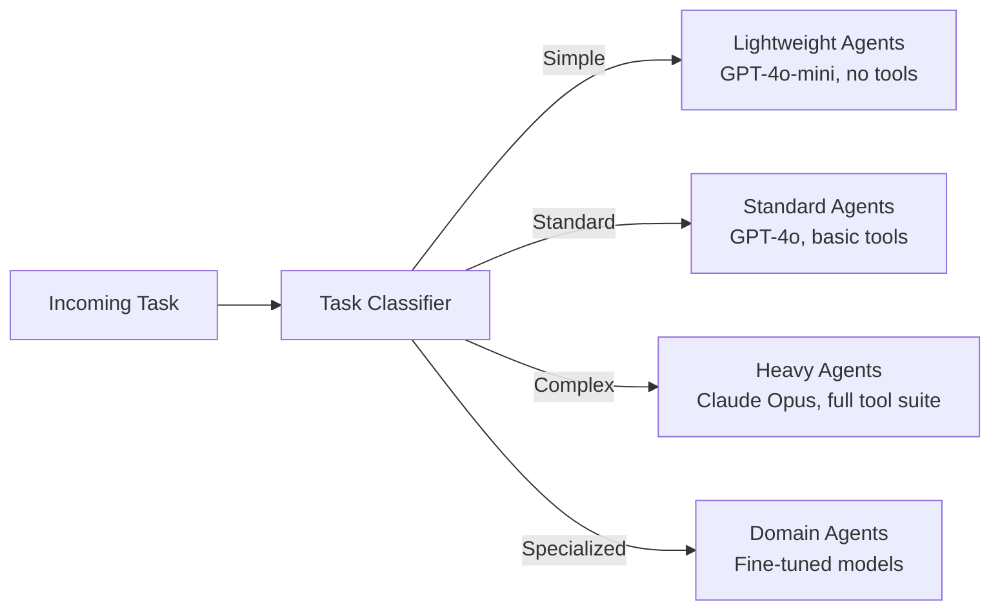
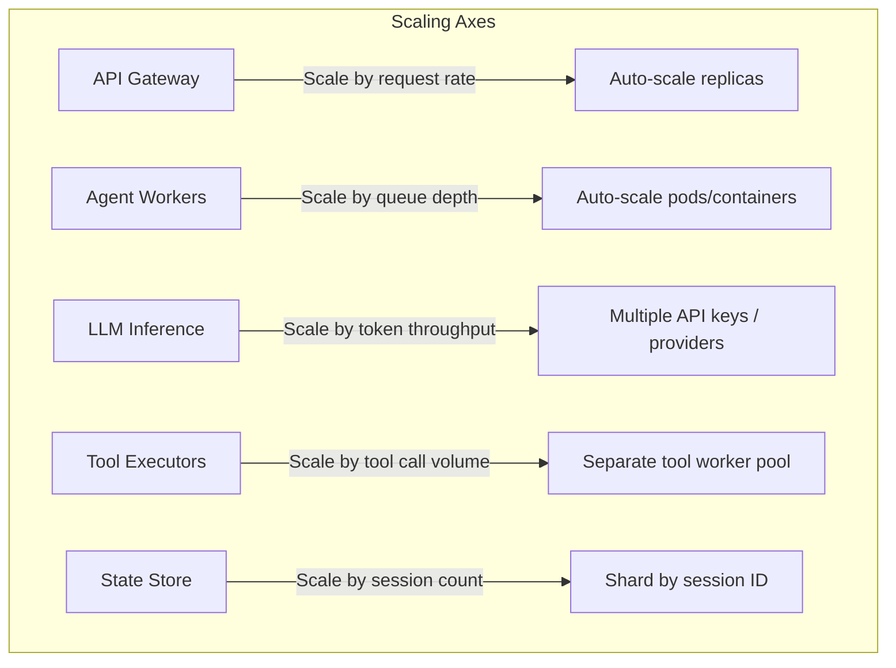
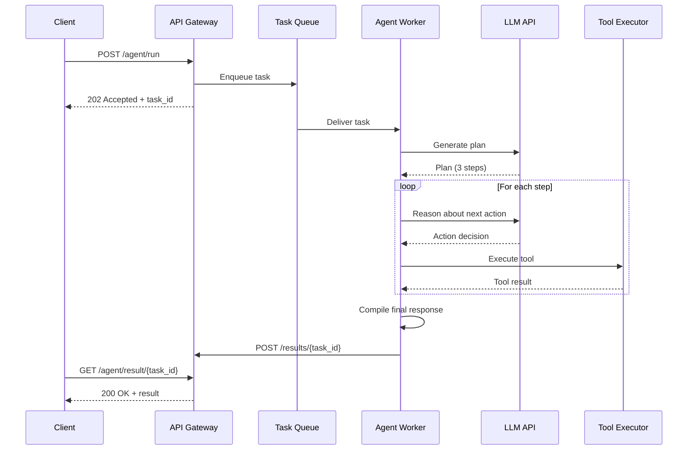

# Agent Orchestration at Scale

Orchestrating agents at scale is fundamentally different from orchestrating web services. Web services are CPU-bound with predictable latency (P99 typically within 2-3x of P50), but agent workloads are I/O-bound with wildly variable latency -- a single agent step can take 1 second (classification) or 60 seconds (code generation), a 60x spread that breaks every assumption in traditional load balancers. Agents are also token-budget-limited rather than CPU-limited: the scarce resource is not compute cycles but the dollars spent on LLM inference and the context-window capacity consumed per step. Worst of all, LLM calls are non-idempotent by default -- retrying a reasoning step produces a different plan, which means naive retry logic can fork an agent into contradictory execution paths. This page covers the architecture patterns that tame these properties at production scale.

---

## High-Level Architecture



---

## Queue-Based Dispatching

The foundation of scalable agent orchestration is asynchronous, queue-based dispatching. Instead of processing requests synchronously, the system enqueues tasks and lets a pool of workers consume them at their own pace.

### Why Queues?

| Problem | Queue-Based Solution |
|---------|---------------------|
| LLM API latency is unpredictable (1-30s) | Workers process at their own pace; callers do not block |
| Burst traffic overwhelms LLM rate limits | Queue absorbs bursts; workers drain at a sustainable rate |
| Worker crashes lose in-flight work | Message redelivery ensures at-least-once processing |
| Different tasks need different priorities | Priority queues route urgent tasks to the front |

### Implementation Pattern

```python
class Priority(IntEnum):
    HIGH = 0        # User-facing, real-time
    NORMAL = 1      # Standard agent tasks
    BATCH = 2       # Background / bulk

class TaskDispatcher:
    def __init__(self, queue_client, num_workers=10): ...

    async def submit(self, task):
        await self.queue.enqueue(f"agent-tasks-{task.priority.name}", task)

    async def _worker_loop(self, worker_id):
        while True:
            # Drain highest-priority queue first
            task = (await self.queue.dequeue("high")
                    or await self.queue.dequeue("normal")
                    or await self.queue.dequeue("batch"))
            if task:
                await self._process(worker_id, task)
```

:::tip
In production, use a managed queue service (SQS, Cloud Tasks, RabbitMQ) rather than an in-process priority queue. Managed queues provide durability, dead-letter routing, and visibility metrics out of the box.
:::

---

## Dispatch Strategy Tradeoffs

Choosing a dispatch strategy is one of the earliest and most consequential architecture decisions. The right choice depends on your latency profile, cost sensitivity, and failure-domain requirements.

### Push vs Pull Dispatch

In **push dispatch**, a central dispatcher assigns tasks to workers. The dispatcher maintains a view of every worker's load and makes placement decisions. In **pull dispatch**, idle workers claim tasks from a shared queue -- the dispatcher does not need to know about individual workers at all.

| Dimension | Push | Pull |
|-----------|------|------|
| **Load visibility** | Full -- dispatcher sees all worker states | Partial -- only queue depth is visible |
| **Single point of failure** | Dispatcher is a SPOF | No SPOF; any worker can consume from the queue |
| **Thundering herd risk** | None -- dispatcher routes deterministically | Yes -- N idle workers may all poll simultaneously |
| **Latency prediction** | Must estimate per-task latency accurately | Not required; workers self-select when ready |
| **Implementation complexity** | High -- health checks, heartbeats, rebalancing | Low -- queue consumer is straightforward |

For agentic workloads, **pull with priority queues** is almost always the right choice. Agent step latency varies by 100x (1s for classification vs 60s for code generation), making push-based load prediction unreliable. A push dispatcher that assumes 5s average latency will over-assign to workers stuck on a 60s generation step and under-assign to workers that just finished a 1s classification. Pull dispatch sidesteps this entirely: workers only claim new work when they are actually idle.

To mitigate thundering herd in pull-based systems, use **exponential backoff with jitter** on empty-queue polls, and set SQS/RabbitMQ visibility timeouts to exceed your longest expected agent step duration.

### Single Queue vs Multi-Queue

A **single queue** is operationally simple: one consumer group, one dead-letter queue, one set of metrics. But it conflates priorities. A batch job that was enqueued first will be processed before a user-facing request that arrives second.

**Multi-queue** (high / normal / batch) solves this by giving each priority tier its own queue. Workers drain the high-priority queue first, then normal, then batch. This prevents batch jobs from starving interactive requests.

The tradeoffs:

- **Routing complexity** -- The dispatcher must classify each task's priority at ingestion time. Misclassification (a complex task marked "high") wastes premium queue capacity.
- **Queue imbalance** -- If the high-priority queue is empty, workers assigned to it sit idle while the batch queue grows unboundedly. Strict queue affinity wastes capacity.
- **Monitoring overhead** -- Three queues means three sets of depth metrics, DLQ configurations, and alerting rules.

**Weighted fair queuing** is the middle ground: workers pull from all queues but with weighted probability (e.g., 60% high, 30% normal, 10% batch). This ensures batch work still progresses even under sustained interactive load, while high-priority tasks get the majority of worker attention.

```python
import random

class WeightedFairDispatcher:
    """Pull from multiple priority queues with weighted probability.
    Prevents starvation of low-priority queues while preserving priority ordering."""

    def __init__(self, queues: dict[str, float]):
        # e.g., {"high": 0.6, "normal": 0.3, "batch": 0.1}
        self.queues = queues

    async def next_task(self, queue_client) -> Task | None:
        # Weighted random selection determines poll order
        order = self._weighted_shuffle()
        for queue_name in order:
            task = await queue_client.dequeue(queue_name)
            if task:
                return task
        return None

    def _weighted_shuffle(self) -> list[str]:
        """Return queue names ordered by weighted random priority."""
        items = list(self.queues.items())
        result = []
        while items:
            names, weights = zip(*items)
            total = sum(weights)
            r = random.uniform(0, total)
            cumulative = 0.0
            for i, (name, weight) in enumerate(items):
                cumulative += weight
                if r <= cumulative:
                    result.append(name)
                    items.pop(i)
                    break
        return result
```

### Eager vs Lazy Execution

Once an agent has a plan (e.g., "search the web, read the top 3 results, synthesize"), the orchestrator must decide *when* to execute each step.

**Eager execution** starts all independent steps immediately, parallelizing where the dependency graph allows. If step 1 and step 2 are independent, both run concurrently. This minimizes wall-clock latency but wastes tokens if an early step's result changes the plan -- the parallel steps were based on a now-stale assumption.

**Lazy execution** runs one step at a time, feeding each result back to the LLM before deciding the next step. This is slower (total latency = sum of step latencies) but more token-efficient because every step is informed by the latest state. When a step reveals that the original plan is wrong, no tokens have been wasted on pre-empted work.

| Dimension | Eager | Lazy |
|-----------|-------|------|
| **Total latency** | Lower (parallel steps) | Higher (sequential) |
| **Token efficiency** | Lower (speculative work may be discarded) | Higher (every step is informed) |
| **Plan stability** | Requires stable plans; fragile if early steps change direction | Naturally adapts; each step re-evaluates |
| **Implementation** | Complex -- dependency graphs, cancellation, result merging | Simple -- linear loop |
| **Best for** | Latency-constrained, high-confidence plans | Budget-constrained, exploratory tasks |

For **budget-constrained** systems (most production deployments), lazy execution is usually correct. For **latency-constrained** systems (real-time assistants), eager execution with **speculative execution** -- run parallel steps but discard results if the plan changes -- gives the best of both worlds at the cost of higher token spend.

### Decision Summary

| Your constraint | Dispatch | Queue topology | Execution |
|-----------------|----------|----------------|-----------|
| Lowest operational complexity | Pull | Single queue | Lazy |
| User-facing latency SLA < 5s | Pull | Multi-queue (weighted fair) | Eager with speculation |
| Strict cost budget | Pull | Multi-queue (weighted fair) | Lazy |
| High throughput batch processing | Pull | Single queue | Eager |
| Mixed interactive + batch | Pull | Multi-queue (weighted fair) | Lazy for batch, eager for interactive |

---

## Task Routing

Not all agent tasks are equal. A simple FAQ lookup needs a fast, cheap model. A complex multi-step research task needs a powerful model with tool access. Task routing ensures each request goes to the right agent configuration.

### Routing Strategies



### Example Router

```python
class TaskComplexity(Enum):
    SIMPLE = "simple"       # FAQs, single-step lookups
    STANDARD = "standard"   # Multi-step, 1-3 tool calls
    COMPLEX = "complex"     # Multi-tool research, long-running
    SPECIALIZED = "specialized"  # Domain-specific (legal, medical)

class TaskRouter:
    def __init__(self, classifier_llm, agent_pools): ...

    async def route(self, task):
        complexity = await self._classify(task)     # small LLM classifies
        pool = self.pools[complexity]
        return await pool.acquire_worker()          # route to matching pool

    async def _classify(self, task) -> TaskComplexity:
        result = await self.classifier.generate(
            f"Classify complexity: {task.payload['instruction']}", max_tokens=10)
        return TaskComplexity(result.strip().lower())
```

:::info Cost Optimization
Task routing is one of the highest-leverage cost optimizations in agentic systems. Routing 60% of traffic to a model that costs 10x less than the premium tier can reduce LLM spend by 50% or more with minimal quality impact.
:::

---

## Load Balancing Agents

Agent workloads are fundamentally different from traditional web workloads. A single agent step might take 500ms (simple LLM call) or 60 seconds (multi-tool research chain). Standard round-robin load balancing causes head-of-line blocking.

### Strategies

| Strategy | Description | Best For |
|----------|-------------|----------|
| **Weighted round-robin** | Distribute based on worker capacity | Homogeneous workloads |
| **Least-connections** | Route to the worker with fewest active tasks | Variable-latency tasks |
| **Work-stealing** | Idle workers pull tasks from busy workers' queues | Mixed short/long tasks |
| **Capacity-aware** | Route based on current token budget remaining | LLM rate-limit management |

### Capacity-Aware Load Balancer

```python
class CapacityAwareBalancer:
    """Routes tasks based on remaining LLM token budget per worker."""

    async def select_worker(self, estimated_tokens):
        candidates = [
            (await self.rate_limiter.remaining_budget(w.id), w)
            for w in self.workers
        ]
        candidates = [(r, w) for r, w in candidates if r >= estimated_tokens]
        if not candidates:
            raise BackpressureError("All workers at capacity.")
        candidates.sort(reverse=True, key=lambda x: x[0])
        return candidates[0][1]  # worker with most headroom
```

### Work-Stealing Scheduler

Capacity-aware balancing solves the *assignment* problem, but it cannot fix an imbalance that develops *after* assignment. If worker A draws a 60-second code-generation task while workers B, C, and D finish their 2-second classification tasks, three workers sit idle while A is overloaded. Work-stealing solves this dynamically.

```python
import asyncio
from dataclasses import dataclass

@dataclass
class Task:
    id: str
    priority: int
    payload: dict

class WorkerQueue:
    """Per-worker double-ended task queue."""
    def __init__(self, worker_id: str):
        self.worker_id = worker_id
        self._deque: list[Task] = []

    @property
    def queue_depth(self) -> int:
        return len(self._deque)

    def enqueue(self, task: Task):
        self._deque.append(task)

    def dequeue_front(self) -> Task | None:
        return self._deque.pop(0) if self._deque else None

    def dequeue_back(self) -> Task | None:
        return self._deque.pop() if self._deque else None


class WorkStealingScheduler:
    """When a worker finishes its task and its local queue is empty, it steals
    from the busiest worker's queue. This naturally balances heterogeneous
    workloads where some tasks take 1s and others take 60s.

    Without work-stealing, a worker processing a 60s task blocks while
    neighbors sit idle. With work-stealing, idle workers pull from the
    longest queue -- reducing P99 latency dramatically.

    Design decisions:
    - Steal from the BACK of the victim's queue (least recently added).
      The front of the queue contains the next task the victim will execute,
      which is likely highest priority. Stealing from the back avoids
      reordering high-priority work.
    - Require queue_depth > 1 on the victim: never steal a worker's only
      queued task, since it is about to execute it.
    - Single async lock: work-stealing is rare (only when a worker is idle),
      so lock contention is minimal. For extremely high worker counts (>500),
      replace with per-worker locks and random victim selection.
    """

    def __init__(self, workers: list[WorkerQueue]):
        self.workers = workers
        self.lock = asyncio.Lock()

    async def steal_work(self, idle_worker_id: int) -> Task | None:
        async with self.lock:
            # Find worker with longest queue
            busiest = max(
                ((i, w) for i, w in enumerate(self.workers)
                 if i != idle_worker_id and w.queue_depth > 1),
                key=lambda x: x[1].queue_depth,
                default=None,
            )
            if busiest is None:
                return None

            idx, worker = busiest
            # Steal from the BACK of the queue (least recently added = likely lowest priority)
            # This avoids reordering high-priority work
            stolen = worker.dequeue_back()
            return stolen
```

In practice, work-stealing reduces P99 latency by 40-60% in mixed workloads compared to static assignment, because idle capacity is redistributed within seconds rather than waiting for the next scaling event.

---

## Horizontal Scaling

### Scaling Dimensions

Agentic systems have multiple independent scaling axes.



### Auto-Scaling Configuration (Kubernetes)

```yaml
apiVersion: autoscaling/v2
kind: HorizontalPodAutoscaler
metadata:
  name: agent-worker-hpa
spec:
  scaleTargetRef:
    apiVersion: apps/v1
    kind: Deployment
    name: agent-workers
  minReplicas: 3
  maxReplicas: 50
  metrics:
    # Scale based on queue depth
    - type: External
      external:
        metric:
          name: sqs_approximate_number_of_messages_visible
          selector:
            matchLabels:
              queue: agent-tasks
        target:
          type: AverageValue
          averageValue: "5"  # Target 5 messages per worker
    # Also consider CPU for tool execution
    - type: Resource
      resource:
        name: cpu
        target:
          type: Utilization
          targetAverageUtilization: 70
  behavior:
    scaleUp:
      stabilizationWindowSeconds: 30   # Scale up quickly
    scaleDown:
      stabilizationWindowSeconds: 300  # Scale down slowly to avoid flapping
```

---

## Async Execution

Most agent tasks are I/O-bound (waiting for LLM responses, tool execution, database queries). Async execution maximizes throughput per worker.

### Request Lifecycle



### Long-Polling and Streaming

For interactive use cases, clients need results as they are produced, not after the entire agent loop completes.

```python
@app.post("/agent/run-stream")
async def run_agent_stream(request):
    async def event_stream():
        async for event in agent.run_streaming(request):
            # SSE: emit thinking, tool_call, tool_result, final events
            yield f"data: {json.dumps({'type': event.type, **event.data})}\n\n"
    return StreamingResponse(event_stream(), media_type="text/event-stream")
```

---

## Workflow Engines

For complex, multi-step agent orchestration -- especially when steps can run for minutes, require human approval, or must be durable across process restarts -- use a workflow engine.

### Temporal Example

```python
@workflow.defn
class AgentWorkflow:
    @workflow.run
    async def run(self, task):
        # Step 1: LLM plans (durable activity with retry)
        plan = await workflow.execute_activity(
            call_llm, args=[task.prompt, "gpt-4o"], timeout=30s, retries=3)
        # Step 2: Execute each step; optionally wait for human approval
        results = []
        for step in parse_plan(plan):
            if step.requires_approval:
                if not await workflow.wait_condition(self.approved, timeout=24h):
                    return "Cancelled: approval timeout."
            result = await workflow.execute_activity(
                execute_tool, args=[step.tool_name, step.params], timeout=60s)
            results.append(result)
        # Step 3: Synthesize results via LLM
        return await workflow.execute_activity(
            call_llm, args=[synthesis_prompt(results), "gpt-4o"], timeout=30s)
```

### Temporal vs. Prefect vs. Custom

| Feature | Temporal | Prefect | Custom (Queues + DB) |
|---------|----------|---------|---------------------|
| Durable execution | Built-in | Built-in | Must implement |
| Human-in-the-loop | Native signals | Limited | Must implement |
| Versioning | Workflow versioning | Flow versioning | Must implement |
| Observability | Temporal UI | Prefect UI | Must build |
| Learning curve | High | Medium | Low (initially) |
| Operational overhead | Temporal cluster | Prefect server | Just queues + DB |

:::warning
Custom orchestration seems simpler at first, but production requirements (retries, timeouts, checkpointing, versioning, observability) accumulate quickly. Evaluate Temporal or a similar engine before building your own -- the total cost of ownership is often lower.
:::

---

## Backpressure

When downstream systems (LLM APIs, tool services) cannot keep up with incoming traffic, the system must apply backpressure to prevent cascading failure.

### Backpressure Strategies

```python
class BackpressureController:
    def __init__(self, max_concurrent, max_queue_depth): ...

    async def submit(self, task):
        if self.queue_depth >= self.max_queue_depth:          # 1: shed load
            raise ServiceOverloadedError(retry_after=30)
        self.queue_depth += 1
        try:
            async with self.semaphore:                        # 2: cap concurrency
                if self.error_rate > 0.3:                     # 3: adaptive slowdown
                    await asyncio.sleep(self._adaptive_delay())
                return await self.worker.process(task)
        finally:
            self.queue_depth -= 1
```

### Key Backpressure Signals

| Signal | Source | Action |
|--------|--------|--------|
| Queue depth exceeds threshold | Message queue metrics | Reject new tasks with 429 |
| LLM rate limit hit | API response (429) | Reduce worker concurrency |
| Tool execution timeouts spike | Tool executor metrics | Shed load on that tool |
| Memory/CPU pressure on workers | Container metrics | Stop accepting new tasks |

---

## The Budget-Aware Agent Loop

The ReAct (Reasoning + Acting) loop is the core execution primitive in agentic AI. A naive implementation runs until the LLM emits a "final answer" token -- but in production, a confused or under-specified model can loop indefinitely, calling the same tool with the same parameters and burning through the entire token budget in seconds. This section presents a production-grade ReAct loop with three safety mechanisms that prevent runaway cost.

```python
import hashlib
import json
from dataclasses import dataclass, field
from enum import Enum

# --- Supporting types ---

@dataclass
class TokenUsage:
    prompt_tokens: int = 0
    completion_tokens: int = 0
    cost_usd: float = 0.0

@dataclass
class TokenBudget:
    max_usd: float
    max_tokens: int
    _spent_usd: float = 0.0
    _spent_tokens: int = 0

    @property
    def spent_ratio(self) -> float:
        """Fraction of budget consumed (0.0 to 1.0), using whichever limit is tighter."""
        usd_ratio = self._spent_usd / self.max_usd if self.max_usd > 0 else 0
        token_ratio = self._spent_tokens / self.max_tokens if self.max_tokens > 0 else 0
        return max(usd_ratio, token_ratio)

    @property
    def spent_usd(self) -> float:
        return self._spent_usd

    def record_step(self, usage: TokenUsage):
        self._spent_usd += usage.cost_usd
        self._spent_tokens += usage.prompt_tokens + usage.completion_tokens

@dataclass
class LLMAction:
    type: str           # "tool_call" | "final_answer"
    content: str = ""
    tool_name: str = ""
    parameters: dict = field(default_factory=dict)
    usage: TokenUsage = field(default_factory=TokenUsage)

@dataclass
class AgentResult:
    answer: str
    steps: int
    cost: float
    status: str         # "complete" | "forced_budget" | "forced_loop_detected" | "forced_max_steps"


def hash_params(tool_name: str, parameters: dict) -> str:
    """Deterministic hash of tool call signature for loop detection."""
    raw = json.dumps({"tool": tool_name, "params": parameters}, sort_keys=True)
    return hashlib.sha256(raw.encode()).hexdigest()[:16]


def format_observation(step: dict) -> str:
    """Format a scratchpad observation for the synthesis prompt."""
    if step.get("type") == "observation":
        return f"[{step['tool']}] (cost: ${step['cost']:.4f})\n{step['result']}"
    return step.get("content", "")


# --- Core algorithm ---

class BudgetAwareReActLoop:
    """Production ReAct loop with cost tracking, loop detection, and forced synthesis.

    The naive ReAct loop runs until the LLM says "final answer." In production, this
    is dangerous: a confused model can loop indefinitely, burning tokens. This implementation
    adds three safety mechanisms:
    1. Hard budget cap -- force synthesis when 80% of budget is spent
    2. Step limit -- cap total iterations (default 15)
    3. Loop detection -- detect repeated tool calls with identical parameters
    """

    def __init__(self, llm, tools, budget: TokenBudget, max_steps: int = 15):
        self.llm = llm
        self.tools = tools
        self.budget = budget
        self.max_steps = max_steps
        self.tool_call_history: list[tuple[str, str]] = []  # (tool_name, param_hash)

    async def run(self, task: str, context: list[dict]) -> AgentResult:
        scratchpad: list[dict] = []

        for step in range(self.max_steps):
            # --- Safety check 1: budget cap ---
            if self.budget.spent_ratio > 0.8:
                return await self._force_synthesis(task, scratchpad, reason="budget")

            # --- Safety check 2: loop detection ---
            if self._detect_loop(scratchpad, window=3):
                return await self._force_synthesis(task, scratchpad, reason="loop_detected")

            # --- Reasoning step: LLM decides next action ---
            action: LLMAction = await self.llm.generate(
                self._build_prompt(task, context, scratchpad),
                model=self._select_model_for_step(step, scratchpad),
            )
            self.budget.record_step(action.usage)

            # --- Terminal: LLM produced a final answer ---
            if action.type == "final_answer":
                return AgentResult(
                    answer=action.content,
                    steps=len(scratchpad),
                    cost=self.budget.spent_usd,
                    status="complete",
                )

            # --- Non-terminal: tool call ---
            if action.type == "tool_call":
                param_hash = hash_params(action.tool_name, action.parameters)

                # Loop detection: same tool + same params in recent history = likely stuck
                recent_calls = self.tool_call_history[-3:]
                if (action.tool_name, param_hash) in recent_calls:
                    scratchpad.append({
                        "type": "system",
                        "content": (
                            f"You already called {action.tool_name} with these exact "
                            f"parameters. Try a different approach or provide final answer."
                        ),
                    })
                    continue

                self.tool_call_history.append((action.tool_name, param_hash))
                result = await self.tools.execute(action.tool_name, action.parameters)
                scratchpad.append({
                    "type": "observation",
                    "tool": action.tool_name,
                    "result": result,
                    "cost": action.usage.cost_usd,
                })

        # --- Safety check 3: max steps exceeded ---
        return await self._force_synthesis(task, scratchpad, reason="max_steps")

    def _detect_loop(self, scratchpad: list[dict], window: int = 3) -> bool:
        """Detect if the last N observations are semantically identical.

        This catches the common failure mode where the agent calls the same search
        tool repeatedly, getting the same results each time but failing to recognize
        it should change strategy or synthesize.
        """
        recent = [s for s in scratchpad[-(window * 2):] if s["type"] == "observation"]
        if len(recent) < window:
            return False
        results = [str(s["result"]) for s in recent[-window:]]
        return len(set(results)) == 1  # all identical results = stuck

    def _select_model_for_step(self, step: int, scratchpad: list) -> str:
        """Adaptive model selection based on step phase and remaining budget.

        First step (planning) uses a strong model because plan quality determines
        the entire session's effectiveness. Middle steps (tool parameter generation)
        are simpler and can use a cheaper model. When budget is tight, downgrade
        aggressively to preserve capacity for final synthesis.
        """
        if step == 0:
            return "gpt-4o"         # planning needs strong reasoning
        if self.budget.spent_ratio > 0.6:
            return "gpt-4o-mini"    # conserve budget in late steps
        return "gpt-4o"

    def _build_prompt(self, task: str, context: list[dict], scratchpad: list[dict]) -> str:
        """Construct the ReAct prompt with task, context, and accumulated scratchpad."""
        parts = [f"Task: {task}"]
        if context:
            parts.append("Context:\n" + "\n".join(str(c) for c in context))
        if scratchpad:
            parts.append("Scratchpad (previous steps):")
            for entry in scratchpad:
                parts.append(format_observation(entry))
        budget_pct = int(self.budget.spent_ratio * 100)
        parts.append(
            f"\n[Budget: {budget_pct}% consumed. "
            f"{'Wrap up soon -- provide final answer if possible.' if budget_pct > 60 else 'Proceed.'}]"
        )
        return "\n\n".join(parts)

    async def _force_synthesis(self, task: str, scratchpad: list[dict], reason: str) -> AgentResult:
        """When budget/steps run out, force the LLM to synthesize from what it has.

        Uses the cheapest viable model since we are budget-constrained at this point.
        The prompt explicitly forbids further tool calls to prevent the model from
        trying to continue the loop.
        """
        observations = [s for s in scratchpad if s["type"] == "observation"]
        formatted = "\n\n".join(format_observation(s) for s in observations)

        prompt = (
            "You must now provide your final answer based on the information "
            "gathered so far. Do NOT request additional tool calls.\n\n"
            f"Task: {task}\n\n"
            f"Gathered information ({len(observations)} observations):\n{formatted}"
        )
        answer = await self.llm.generate(prompt, model="gpt-4o-mini")
        self.budget.record_step(answer.usage)
        return AgentResult(
            answer=answer.content,
            steps=len(scratchpad),
            cost=self.budget.spent_usd,
            status=f"forced_{reason}",
        )
```

### Key Design Decisions

**Why 80% budget threshold for forced synthesis, not 90% or 100%?** The synthesis step itself consumes tokens -- typically 1,000-3,000 tokens for the prompt plus 500-2,000 for the response. If you wait until 100% of the budget is consumed, there is literally no budget left to generate the synthesis. At 90%, you are gambling that synthesis will fit in the remaining 10%. The 80% threshold guarantees enough headroom for a thorough synthesis response even in worst-case scenarios (large scratchpad requiring extensive summarization). In practice, the synthesis step consumes 5-15% of total budget, making 80% the safe threshold.

**Why loop detection matters.** The single most common failure mode in production agentic systems is the *search loop*: the agent calls a search tool, gets results, decides the results are insufficient, calls the same search tool with the same query, gets the same results, and repeats. Without loop detection, this burns through the entire budget in 10-30 seconds. The `_detect_loop` method catches this by comparing the last N observation outputs. Semantic similarity (embedding-based) would catch near-duplicates too, but string equality catches 90% of loops at zero additional cost.

**Why model selection varies by step.** Planning (step 0) requires strong reasoning to decompose a complex task into the right sequence of tool calls. A weak model produces bad plans, and no amount of good execution recovers from a bad plan. But once the plan exists, generating tool call parameters is a simpler task -- extracting search queries, formatting API parameters -- where a cheaper model performs comparably. This single optimization typically saves 30-40% of token cost per session because mid-loop steps are the majority of total LLM calls. The late-stage downgrade (when `spent_ratio > 0.6`) adds another 10-15% savings by switching to the cheapest model once the heavy reasoning is complete.

---

## Interview Preparation

**Sample question:** "Design a system that orchestrates 1,000 concurrent agent sessions with different priority levels."

**Strong answer checklist:**
1. Queue-based dispatch with priority lanes (high/normal/batch)
2. Task routing to match complexity with appropriate model tier
3. Stateless workers with externalized state for horizontal scaling
4. Async execution with SSE/WebSocket for real-time streaming
5. Backpressure via queue depth limits and adaptive rate limiting
6. Auto-scaling based on queue depth, not just CPU
7. Workflow engine (Temporal) for durable, multi-step agent tasks
8. Observability at every layer -- not an afterthought
