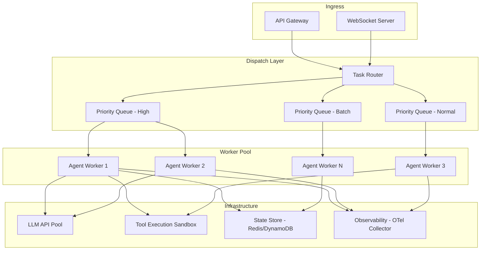
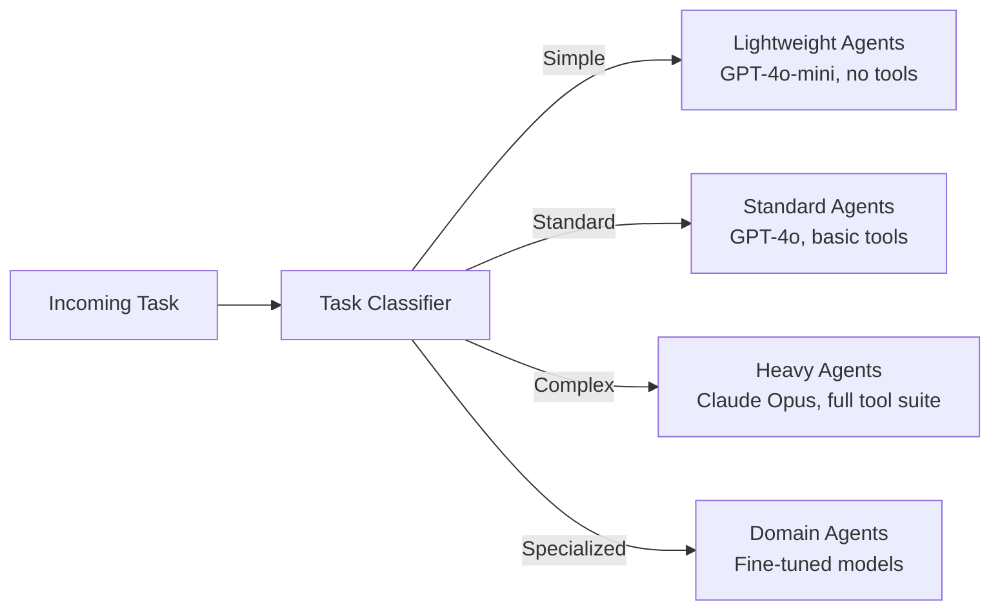
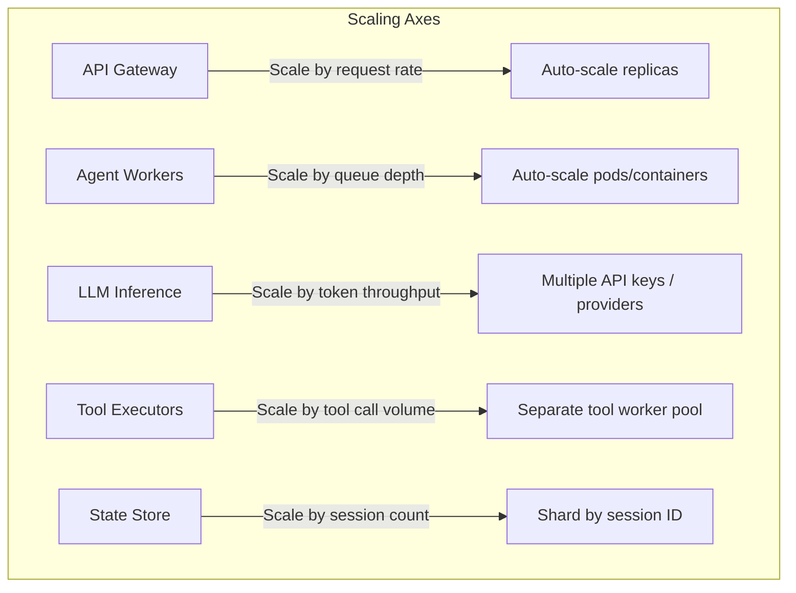
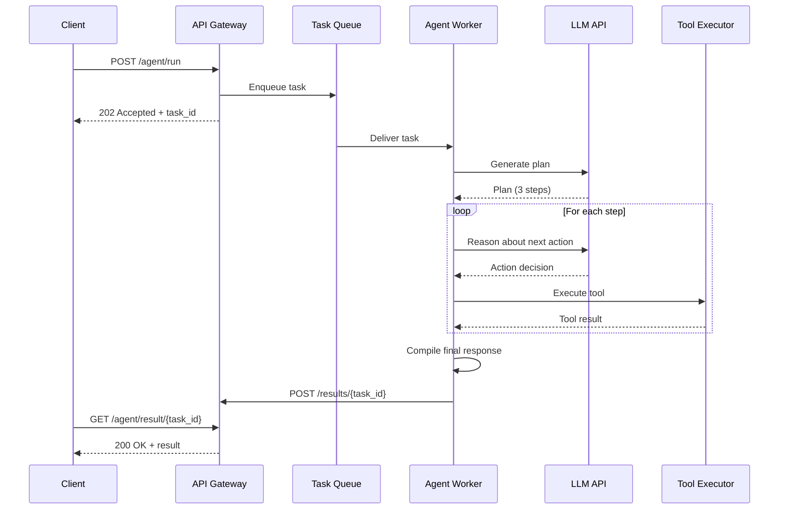

# Agent Orchestration at Scale

A single agent handling one request is straightforward. Thousands of agents processing millions of requests with varying latencies, costs, and failure modes is a distributed systems problem. This page covers the architecture patterns that make large-scale agent orchestration possible.

---

## High-Level Architecture



---

## Queue-Based Dispatching

The foundation of scalable agent orchestration is asynchronous, queue-based dispatching. Instead of processing requests synchronously, the system enqueues tasks and lets a pool of workers consume them at their own pace.

### Why Queues?

| Problem | Queue-Based Solution |
|---------|---------------------|
| LLM API latency is unpredictable (1-30s) | Workers process at their own pace; callers do not block |
| Burst traffic overwhelms LLM rate limits | Queue absorbs bursts; workers drain at a sustainable rate |
| Worker crashes lose in-flight work | Message redelivery ensures at-least-once processing |
| Different tasks need different priorities | Priority queues route urgent tasks to the front |

### Implementation Pattern

```python
class Priority(IntEnum):
    HIGH = 0        # User-facing, real-time
    NORMAL = 1      # Standard agent tasks
    BATCH = 2       # Background / bulk

class TaskDispatcher:
    def __init__(self, queue_client, num_workers=10): ...

    async def submit(self, task):
        await self.queue.enqueue(f"agent-tasks-{task.priority.name}", task)

    async def _worker_loop(self, worker_id):
        while True:
            # Drain highest-priority queue first
            task = (await self.queue.dequeue("high")
                    or await self.queue.dequeue("normal")
                    or await self.queue.dequeue("batch"))
            if task:
                await self._process(worker_id, task)
```

:::tip
In production, use a managed queue service (SQS, Cloud Tasks, RabbitMQ) rather than an in-process priority queue. Managed queues provide durability, dead-letter routing, and visibility metrics out of the box.
:::

---

## Task Routing

Not all agent tasks are equal. A simple FAQ lookup needs a fast, cheap model. A complex multi-step research task needs a powerful model with tool access. Task routing ensures each request goes to the right agent configuration.

### Routing Strategies



### Example Router

```python
class TaskComplexity(Enum):
    SIMPLE = "simple"       # FAQs, single-step lookups
    STANDARD = "standard"   # Multi-step, 1-3 tool calls
    COMPLEX = "complex"     # Multi-tool research, long-running
    SPECIALIZED = "specialized"  # Domain-specific (legal, medical)

class TaskRouter:
    def __init__(self, classifier_llm, agent_pools): ...

    async def route(self, task):
        complexity = await self._classify(task)     # small LLM classifies
        pool = self.pools[complexity]
        return await pool.acquire_worker()          # route to matching pool

    async def _classify(self, task) -> TaskComplexity:
        result = await self.classifier.generate(
            f"Classify complexity: {task.payload['instruction']}", max_tokens=10)
        return TaskComplexity(result.strip().lower())
```

:::info Cost Optimization
Task routing is one of the highest-leverage cost optimizations in agentic systems. Routing 60% of traffic to a model that costs 10x less than the premium tier can reduce LLM spend by 50% or more with minimal quality impact.
:::

---

## Load Balancing Agents

Agent workloads are fundamentally different from traditional web workloads. A single agent step might take 500ms (simple LLM call) or 60 seconds (multi-tool research chain). Standard round-robin load balancing causes head-of-line blocking.

### Strategies

| Strategy | Description | Best For |
|----------|-------------|----------|
| **Weighted round-robin** | Distribute based on worker capacity | Homogeneous workloads |
| **Least-connections** | Route to the worker with fewest active tasks | Variable-latency tasks |
| **Work-stealing** | Idle workers pull tasks from busy workers' queues | Mixed short/long tasks |
| **Capacity-aware** | Route based on current token budget remaining | LLM rate-limit management |

### Capacity-Aware Load Balancer

```python
class CapacityAwareBalancer:
    """Routes tasks based on remaining LLM token budget per worker."""

    async def select_worker(self, estimated_tokens):
        candidates = [
            (await self.rate_limiter.remaining_budget(w.id), w)
            for w in self.workers
        ]
        candidates = [(r, w) for r, w in candidates if r >= estimated_tokens]
        if not candidates:
            raise BackpressureError("All workers at capacity.")
        candidates.sort(reverse=True, key=lambda x: x[0])
        return candidates[0][1]  # worker with most headroom
```

---

## Horizontal Scaling

### Scaling Dimensions

Agentic systems have multiple independent scaling axes.



### Auto-Scaling Configuration (Kubernetes)

```yaml
apiVersion: autoscaling/v2
kind: HorizontalPodAutoscaler
metadata:
  name: agent-worker-hpa
spec:
  scaleTargetRef:
    apiVersion: apps/v1
    kind: Deployment
    name: agent-workers
  minReplicas: 3
  maxReplicas: 50
  metrics:
    # Scale based on queue depth
    - type: External
      external:
        metric:
          name: sqs_approximate_number_of_messages_visible
          selector:
            matchLabels:
              queue: agent-tasks
        target:
          type: AverageValue
          averageValue: "5"  # Target 5 messages per worker
    # Also consider CPU for tool execution
    - type: Resource
      resource:
        name: cpu
        target:
          type: Utilization
          targetAverageUtilization: 70
  behavior:
    scaleUp:
      stabilizationWindowSeconds: 30   # Scale up quickly
    scaleDown:
      stabilizationWindowSeconds: 300  # Scale down slowly to avoid flapping
```

---

## Async Execution

Most agent tasks are I/O-bound (waiting for LLM responses, tool execution, database queries). Async execution maximizes throughput per worker.

### Request Lifecycle



### Long-Polling and Streaming

For interactive use cases, clients need results as they are produced, not after the entire agent loop completes.

```python
@app.post("/agent/run-stream")
async def run_agent_stream(request):
    async def event_stream():
        async for event in agent.run_streaming(request):
            # SSE: emit thinking, tool_call, tool_result, final events
            yield f"data: {json.dumps({'type': event.type, **event.data})}\n\n"
    return StreamingResponse(event_stream(), media_type="text/event-stream")
```

---

## Workflow Engines

For complex, multi-step agent orchestration -- especially when steps can run for minutes, require human approval, or must be durable across process restarts -- use a workflow engine.

### Temporal Example

```python
@workflow.defn
class AgentWorkflow:
    @workflow.run
    async def run(self, task):
        # Step 1: LLM plans (durable activity with retry)
        plan = await workflow.execute_activity(
            call_llm, args=[task.prompt, "gpt-4o"], timeout=30s, retries=3)
        # Step 2: Execute each step; optionally wait for human approval
        results = []
        for step in parse_plan(plan):
            if step.requires_approval:
                if not await workflow.wait_condition(self.approved, timeout=24h):
                    return "Cancelled: approval timeout."
            result = await workflow.execute_activity(
                execute_tool, args=[step.tool_name, step.params], timeout=60s)
            results.append(result)
        # Step 3: Synthesize results via LLM
        return await workflow.execute_activity(
            call_llm, args=[synthesis_prompt(results), "gpt-4o"], timeout=30s)
```

### Temporal vs. Prefect vs. Custom

| Feature | Temporal | Prefect | Custom (Queues + DB) |
|---------|----------|---------|---------------------|
| Durable execution | Built-in | Built-in | Must implement |
| Human-in-the-loop | Native signals | Limited | Must implement |
| Versioning | Workflow versioning | Flow versioning | Must implement |
| Observability | Temporal UI | Prefect UI | Must build |
| Learning curve | High | Medium | Low (initially) |
| Operational overhead | Temporal cluster | Prefect server | Just queues + DB |

:::warning
Custom orchestration seems simpler at first, but production requirements (retries, timeouts, checkpointing, versioning, observability) accumulate quickly. Evaluate Temporal or a similar engine before building your own -- the total cost of ownership is often lower.
:::

---

## Backpressure

When downstream systems (LLM APIs, tool services) cannot keep up with incoming traffic, the system must apply backpressure to prevent cascading failure.

### Backpressure Strategies

```python
class BackpressureController:
    def __init__(self, max_concurrent, max_queue_depth): ...

    async def submit(self, task):
        if self.queue_depth >= self.max_queue_depth:          # 1: shed load
            raise ServiceOverloadedError(retry_after=30)
        self.queue_depth += 1
        try:
            async with self.semaphore:                        # 2: cap concurrency
                if self.error_rate > 0.3:                     # 3: adaptive slowdown
                    await asyncio.sleep(self._adaptive_delay())
                return await self.worker.process(task)
        finally:
            self.queue_depth -= 1
```

### Key Backpressure Signals

| Signal | Source | Action |
|--------|--------|--------|
| Queue depth exceeds threshold | Message queue metrics | Reject new tasks with 429 |
| LLM rate limit hit | API response (429) | Reduce worker concurrency |
| Tool execution timeouts spike | Tool executor metrics | Shed load on that tool |
| Memory/CPU pressure on workers | Container metrics | Stop accepting new tasks |

---

## Interview Preparation

**Sample question:** "Design a system that orchestrates 1,000 concurrent agent sessions with different priority levels."

**Strong answer checklist:**
1. Queue-based dispatch with priority lanes (high/normal/batch)
2. Task routing to match complexity with appropriate model tier
3. Stateless workers with externalized state for horizontal scaling
4. Async execution with SSE/WebSocket for real-time streaming
5. Backpressure via queue depth limits and adaptive rate limiting
6. Auto-scaling based on queue depth, not just CPU
7. Workflow engine (Temporal) for durable, multi-step agent tasks
8. Observability at every layer -- not an afterthought
