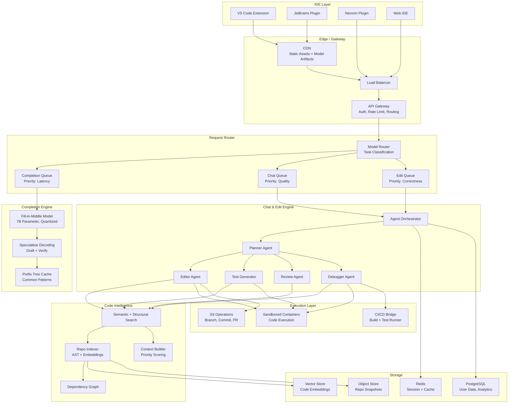
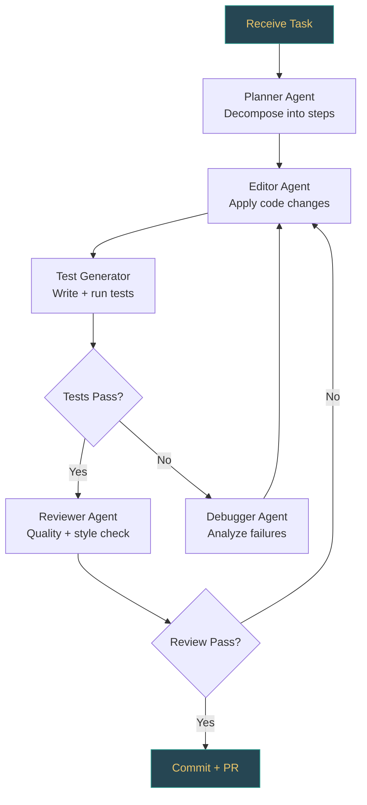
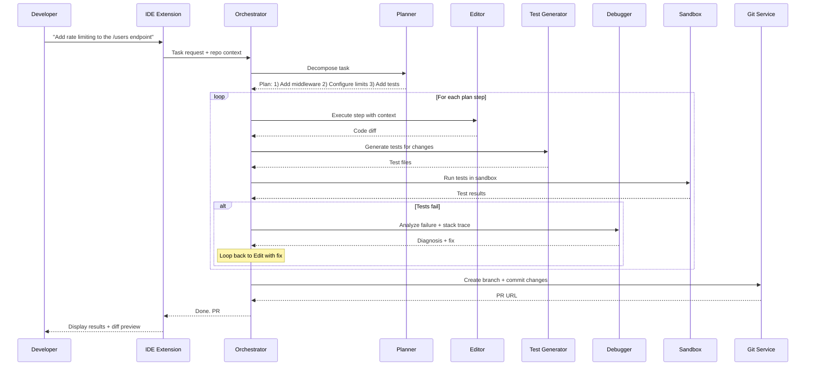
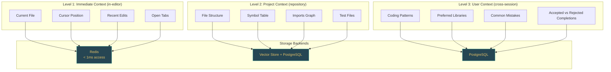
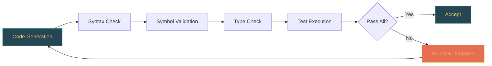

# AI Code Assistant

Design a production AI coding assistant that provides real-time code completions, chat-based assistance, multi-file editing, test generation, code review automation, and CI/CD integration at scale. This is one of the most complex agentic system designs -- it combines low-latency inference, deep codebase understanding, multi-step planning, and high-stakes execution.

---

## Problem Statement

> Design an AI-powered coding assistant (like GitHub Copilot, Cursor, or Cody) that integrates with IDEs to provide real-time code completions, chat-based code assistance, multi-file editing, automated test generation, pull request review, and CI/CD integration. The system must serve millions of concurrent developers with sub-200ms completion latency while maintaining code correctness and security.

---

## Clarifying Questions to Ask

1. What IDE integrations are required? (VS Code only, or JetBrains/Neovim/web too?)
2. Do we need real-time inline completions AND chat mode, or just one?
3. What programming languages must be supported?
4. Is multi-repo/monorepo support needed?
5. What is the tenant model -- individual developers, teams, or enterprises?
6. Are there compliance requirements (SOC 2, on-premise deployment options)?
7. Should the assistant be able to execute code (run tests, build), or only suggest?

---

## Requirements

### Functional Requirements

1. **Real-time inline completions** -- suggest single-line and multi-line completions as the developer types, with fill-in-the-middle (FIM) support
2. **Chat-based assistance** -- answer natural language questions about code, explain errors, suggest refactors, and generate code from descriptions
3. **Repository-wide context awareness** -- understand the full codebase including cross-file dependencies, imports, types, and conventions
4. **Multi-file editing** -- accept a high-level task (e.g., "add pagination to the users API") and produce coordinated edits across multiple files
5. **Automated test generation** -- generate unit, integration, and edge-case tests for existing or newly written code
6. **Code review automation** -- analyze pull requests for bugs, security issues, style violations, and quality concerns, then post inline comments
7. **CI/CD integration** -- trigger builds, run tests in sandboxed environments, observe failures, and iterate on fixes automatically
8. **Multi-repo support** -- understand cross-repository dependencies for monorepo and multi-service architectures

### Non-Functional Requirements

| Requirement | Target |
|-------------|--------|
| Inline completion latency | < 200ms (p95) |
| Multi-line completion latency | < 500ms (p95) |
| Chat response latency | < 2s (first token) |
| Multi-file edit latency | < 60s for simple tasks |
| Availability | 99.9% uptime |
| Concurrent users | 2M+ |
| First-pass correctness | > 90% (edits that compile and pass tests) |
| Repository size support | 100K+ lines, 500+ files |
| Cost per user per day | < $0.15 |
| Security | No code exfiltration, tenant isolation, SOC 2 |

### Out of Scope

- Natural language to full application generation (scaffolding only)
- Non-code file editing (images, binary assets)
- Real-time collaborative editing (Google Docs-style)
- IDE development itself (we integrate with existing IDEs)

---

## High-Level Architecture

The system follows a **dual-path design**: a fast completion path optimized for sub-200ms latency, and a deep agent path for multi-step tasks like editing, testing, and reviewing.

### System Architecture



### Agent Orchestration Detail

The agent orchestrator drives the **edit-test-debug loop**, which is the core cycle for multi-file editing tasks.



### Architecture Walkthrough

The dual-path architecture separates concerns by latency budget:

- **Fast path (Completion Engine)**: keystrokes flow through the CDN and load balancer to a specialized 7B fill-in-middle model. Speculative decoding and prefix tree caching keep latency under 200ms. No orchestration overhead -- single model call, single response.
- **Deep path (Agent Orchestrator)**: chat messages, edit requests, and review tasks route to the agent orchestrator, which decomposes work into planning, editing, testing, and debugging steps. Each step may involve multiple LLM calls, code execution, and repository search. Latency budget is seconds to minutes, not milliseconds.

The **Model Router** sits at the junction, classifying each request by task type and routing to the appropriate queue and engine. This prevents expensive agent orchestration from blocking the latency-critical completion path.

---

## Component Design

### 1. Completion Engine

The completion engine handles real-time inline suggestions. It uses a specialized **fill-in-middle (FIM) model** -- a 7B-parameter model fine-tuned specifically for code completion with prefix, suffix, and cursor position as inputs.

**Speculative decoding** is the key latency optimization: a small draft model (1-2B parameters) generates candidate tokens quickly, and the larger 7B model verifies them in a single forward pass. When the draft model predicts correctly (which happens 70-80% of the time for code), you get the quality of the large model at the speed of the small one.

**Prefix tree caching** stores common completion patterns (import statements, boilerplate, common API calls) in a trie structure indexed by file type and context. Cache hits bypass model inference entirely, returning results in under 10ms.

The completion engine runs on dedicated GPU instances with models pre-loaded in memory. There is no cold start -- instances are always warm. KV-cache is maintained per-session so that sequential keystrokes reuse prior computation rather than reprocessing the full context.

### 2. Model Router

The model router classifies incoming requests and routes them to the optimal model and queue. Classification uses a lightweight model (or heuristic rules) to determine:

- **Task type**: completion, chat, edit, review, test generation
- **Complexity**: simple (single-file, small change) vs. complex (multi-file, architectural)
- **Latency budget**: real-time (< 200ms), interactive (< 2s), background (< 60s)

Routing decisions include which model to use (7B for completions, 70B+ for complex reasoning), which queue to place the request in (priority queues per task type), and whether to enable agent orchestration or use a single-shot model call.

The router also handles **model fallback**: if the primary model provider is at capacity, requests are rerouted to a secondary provider (e.g., Azure OpenAI as fallback to direct OpenAI) with appropriate prompt adjustments.

### 3. Agent Orchestrator (Chat & Edit Mode)

The orchestrator manages multi-step tasks through a **plan-edit-test-debug cycle**:

1. **Planner Agent** -- receives the task description, retrieves relevant code context from the Code Intelligence layer, and produces a step-by-step plan. Each step specifies which files to modify, what changes to make, and what tests to run.
2. **Editor Agent** -- executes each plan step by generating code diffs. It receives the current file content, the plan step, and relevant context (types, imports, related files). It produces minimal, targeted edits rather than rewriting entire files.
3. **Test Generator** -- writes test cases for the changes. It analyzes existing test patterns in the repository and generates tests that follow the same style, framework, and assertion patterns.
4. **Debugger Agent** -- when tests fail, it receives the error output, stack trace, and the failing test. It diagnoses the root cause and produces a fix. The fix feeds back into the Editor Agent, creating the edit-test-debug loop.
5. **Reviewer Agent** -- after tests pass, it performs a quality review: checks for code style consistency, potential bugs, security issues, and adherence to the plan. If it finds issues, it sends the code back to the Editor Agent.

The orchestrator tracks state across these steps, enforces a maximum iteration count (typically 3-5 cycles) to prevent infinite loops, and streams intermediate progress to the IDE so the developer can observe and intervene.

### 4. Code Intelligence Layer

The Code Intelligence layer provides deep codebase understanding. It is the shared foundation that both the completion engine and the agent orchestrator depend on.

**Repo Indexer** -- on repository clone or push, the indexer parses every file to extract an AST (abstract syntax tree). From the AST it builds: symbol tables (functions, classes, variables with their types and signatures), import/export graphs, and call graphs. It also generates embeddings for every function and class using a code-specific embedding model (e.g., CodeBERT or StarEncoder). These embeddings are stored in the vector store for semantic search.

**Semantic and Structural Search** -- supports two query modes. Semantic search uses vector similarity to find code that is conceptually related to a query (e.g., "authentication middleware" finds relevant files even if they use different terminology). Structural search uses AST queries to find exact patterns (e.g., "all functions that accept a `Request` parameter and return a `Response`").

**Dependency Graph** -- tracks which files depend on which other files, which functions call which functions, and which types are used where. When the Editor Agent modifies a function signature, the dependency graph identifies all callers that need updating.

**Context Builder** -- assembles the optimal context window for any LLM call. Given a target file and cursor position, it uses priority scoring to select the most relevant context: current file (highest priority), imported files, files with shared types, recently edited files, and test files. The context builder respects the model's token limit and trims lower-priority context first.

### 5. Code Review Pipeline

The review pipeline handles automated pull request analysis. It uses a **multi-pass architecture** where each review concern gets specialized treatment.

**Multi-pass analysis** -- the pipeline runs separate passes for different review categories:
- **Bug detection pass** -- uses a large, capable model (70B+) with prompts specialized for logic errors, off-by-one mistakes, null pointer risks, race conditions, and resource leaks
- **Security pass** -- uses a large model with security-focused prompts covering injection vulnerabilities, authentication bypasses, secrets in code, and insecure dependencies
- **Style pass** -- uses a smaller, faster model (7B-13B) for formatting, naming conventions, and idiomatic patterns
- **Quality pass** -- evaluates test coverage, documentation completeness, and architectural consistency

**Codebase RAG** -- for each changed file, the pipeline retrieves related files from the codebase index to build cross-file context. This is critical for detecting issues like breaking interface contracts, inconsistent error handling across services, or duplicated logic.

**Confidence-gated commenting** -- each finding gets a confidence score (0.0-1.0). Only findings above the threshold (0.8) are posted as PR comments. Findings between 0.5 and 0.8 are logged for internal analysis but not posted. Findings below 0.5 are discarded. This prevents the system from eroding developer trust with noisy false positives.

**Feedback loop** -- developer reactions to review comments (resolve, dismiss, thumbs up, thumbs down) are tracked and used to tune the system. Dismissed comments reduce confidence scores for similar patterns. Resolved comments reinforce them. Over time, the confidence thresholds and specialized prompts are adjusted per-repository to match the team's preferences and coding standards.

### 6. Execution Layer

The execution layer provides safe code execution for testing and debugging.

**Sandboxed containers** -- each execution request runs in an isolated container with the repository code, dependencies, and test framework pre-installed. Containers are ephemeral (destroyed after use), resource-limited (CPU, memory, network, disk), and network-restricted (no external access except package registries). A warm pool of pre-built containers per popular language/framework combination reduces cold start time to under 2 seconds.

**Git operations** -- the execution layer can create branches, apply commits, open pull requests, and push changes. All git operations are performed with a bot identity and require explicit developer approval before merging.

**CI/CD bridge** -- integrates with existing CI/CD systems (GitHub Actions, GitLab CI, Jenkins). When the Debugger Agent needs to understand a test failure, it can trigger a CI run, observe the output, and feed the results back into the debug cycle. The bridge normalizes output across CI systems into a standard format that the agent can parse.

---

## Data Flow

### Inline Completion Flow

1. **Keystroke** -- the developer types a character in the IDE
2. **Debounce** -- the IDE extension waits 50-100ms for the developer to stop typing (avoids firing on every keystroke)
3. **Context extraction** -- the extension captures: prefix (code before cursor), suffix (code after cursor), file path, language, and open file tabs
4. **Request** -- the context is sent to the API gateway, which routes it through the model router to the completion queue
5. **Prefix tree lookup** -- the completion engine checks the prefix tree cache for an exact or near-exact match. On cache hit, the result is returned immediately (< 10ms)
6. **Model inference** -- on cache miss, the fill-in-middle model runs with speculative decoding. The KV-cache from the previous request for this session is reused to avoid reprocessing the full prefix
7. **Response** -- the completion is returned to the IDE, which displays it as a ghost text suggestion
8. **Accept/reject** -- the developer accepts (Tab) or rejects (keeps typing) the suggestion. This signal is logged for model improvement

Total latency budget: < 200ms end-to-end (p95).

### Edit-Test-Debug Cycle



### Code Review Flow

1. **PR webhook** -- a new pull request or push to an existing PR triggers a webhook to the review service
2. **Diff extraction** -- the service fetches the PR diff, identifies changed files, and extracts the before/after content for each file
3. **Context building** -- for each changed file, the Code Intelligence layer retrieves related files (imports, callers, tests) from the codebase index to build cross-file context
4. **Multi-pass analysis** -- the diff and context are sent through each review pass (bug, security, style, quality). Smaller models handle style; larger models handle bug and security detection. Each pass uses specialized prompts tuned for its concern
5. **Finding aggregation** -- results from all passes are deduplicated (same issue found by multiple passes), merged, and scored for confidence
6. **Confidence gating** -- findings above the 0.8 threshold are converted to PR comments. Findings below 0.8 are logged but not posted
7. **Comment posting** -- approved findings are posted as inline PR comments at the relevant line numbers, with explanations and suggested fixes
8. **Feedback collection** -- developer reactions (resolve, dismiss) are recorded and fed back into the confidence model

---

## Scaling Considerations

### CDN and Edge Caching

Static model artifacts, IDE extension assets, and frequently used completion patterns are cached at the CDN edge. This reduces round-trip latency for users far from the inference servers and offloads traffic from the origin.

### Model Routing by Task Complexity

Not every request needs the most expensive model. The model router sends simple completions to the quantized 7B model, straightforward chat questions to a 13B-30B model, and complex multi-file edits to a 70B+ model. This reduces average cost per request by 3-5x compared to using the large model for everything.

### Incremental Index Updates

Full repository re-indexing is expensive for large codebases. On each git push, the indexer performs a differential update: it identifies changed files from the git diff, re-parses only those files, updates their AST entries and embeddings, and propagates changes through the dependency graph. Full re-indexing runs only on initial clone or when the incremental update detects structural inconsistencies.

### Container Pooling

The execution layer maintains a warm pool of pre-built containers for popular language/framework combinations (Node.js + Jest, Python + pytest, Java + JUnit, Go + testing). When a test execution request arrives, a warm container is claimed from the pool, the repository code is mounted, and tests run immediately. Pool size is auto-scaled based on demand.

### Request Batching

During high-traffic periods, the completion engine batches multiple requests for the same model into a single GPU forward pass. This increases throughput by 2-4x with minimal latency impact (< 5ms additional wait for batching).

### Horizontal Scaling

Each component scales independently. Completion engine instances scale based on GPU utilization. Agent orchestrator instances scale based on active task count. Code Intelligence services scale based on query rate. The model router and API gateway are stateless and scale horizontally behind the load balancer.

---

## Cost Analysis

### Cost Per User Per Day

| Component | Calls/Day | Tokens/Call | Unit Cost | Daily Cost |
|-----------|-----------|-------------|-----------|------------|
| Inline completions (7B) | 200 | 500 | $0.10/1M tokens | $0.010 |
| Chat responses (30B) | 15 | 2,000 | $0.80/1M tokens | $0.024 |
| Multi-file edits (70B+) | 2 | 8,000 | $3.00/1M tokens | $0.048 |
| Test generation | 3 | 3,000 | $1.50/1M tokens | $0.014 |
| Code review (per PR) | 1 | 10,000 | $2.00/1M tokens | $0.020 |
| Sandbox execution | 5 | -- | $0.002/run | $0.010 |
| Embedding/indexing | amortized | -- | -- | $0.005 |
| **Total per user per day** | | | | **$0.131** |

The $0.131 daily cost falls under the $0.15 budget, leaving headroom for usage spikes and heavy users.

### Monthly Cost at Scale (2M Users)

| Category | Monthly Cost |
|----------|-------------|
| LLM inference (completion + chat + edit) | $5,400,000 |
| GPU infrastructure (dedicated completion) | $1,200,000 |
| Compute (orchestrator, indexer, gateway) | $400,000 |
| Storage (vector store, object store, DB) | $150,000 |
| Sandbox execution | $600,000 |
| CDN and networking | $200,000 |
| Observability and monitoring | $50,000 |
| **Total monthly** | **$8,000,000** |
| **Revenue at $20/user/month** | **$40,000,000** |
| **Gross margin** | **80%** |

---

## Data Layer Deep Dive

### Database Selection Justification

| Store | Technology | Why This Choice | Alternative Considered | Why Not |
|-------|-----------|-----------------|----------------------|---------|
| Relational | PostgreSQL | ACID guarantees, JSONB for storing heterogeneous code snippets and AST metadata, full-text search for code search | MongoDB (flexible schema for code snippets) | Feedback and session management is inherently relational; joins across sessions, completions, and users are frequent |
| Cache | Redis | Sub-ms reads for real-time code completion (latency is critical -- user expects < 500ms), caching recent completions, TTL for session expiration | In-memory only | Loses state on crash, no sharing across IDE instances |
| Vector store | pgvector or Qdrant | Semantic code search across the repository, finding similar code patterns, retrieving relevant documentation. pgvector for codebases < 500K chunks; Qdrant for large monorepos with payload filtering (filter by language, file path, recency) | Tree-sitter-based AST search only | Works for structural queries but misses semantic similarity -- "find code that handles authentication" requires embeddings |
| Object storage | S3 | Full repository indexing produces large amounts of data (AST dumps, symbol tables). Store in S3, index metadata in PostgreSQL | Git directly | Too slow for repeated traversal during indexing |

### Schema Design

#### 1. code_sessions -- active coding sessions

```sql
CREATE TABLE code_sessions (
    id UUID PRIMARY KEY DEFAULT gen_random_uuid(),
    user_id VARCHAR(64) NOT NULL,
    project_id VARCHAR(128) NOT NULL,
    ide_type VARCHAR(30) NOT NULL CHECK (ide_type IN ('vscode', 'jetbrains', 'neovim', 'web')),
    active_file TEXT,
    cursor_position JSONB,
    open_files TEXT[],
    language VARCHAR(30),
    status VARCHAR(20) DEFAULT 'active',
    created_at TIMESTAMPTZ NOT NULL DEFAULT now(),
    last_activity_at TIMESTAMPTZ NOT NULL DEFAULT now()
);
CREATE INDEX idx_sessions_user_project ON code_sessions(user_id, project_id);
CREATE INDEX idx_sessions_activity ON code_sessions(last_activity_at DESC);
```

#### 2. code_chunks -- indexed repository code

```sql
CREATE TABLE code_chunks (
    id UUID PRIMARY KEY DEFAULT gen_random_uuid(),
    project_id VARCHAR(128) NOT NULL,
    file_path TEXT NOT NULL,
    chunk_type VARCHAR(30) NOT NULL CHECK (chunk_type IN ('function', 'class', 'module', 'block', 'comment')),
    symbol_name TEXT,
    content TEXT NOT NULL,
    language VARCHAR(30) NOT NULL,
    start_line INTEGER NOT NULL,
    end_line INTEGER NOT NULL,
    embedding vector(1536),
    ast_hash VARCHAR(64),
    last_indexed_at TIMESTAMPTZ NOT NULL DEFAULT now()
);
CREATE INDEX idx_chunks_embedding ON code_chunks USING hnsw (embedding vector_cosine_ops) WITH (m = 16, ef_construction = 200);
CREATE INDEX idx_chunks_project_file ON code_chunks(project_id, file_path);
CREATE INDEX idx_chunks_symbol ON code_chunks(project_id, symbol_name) WHERE symbol_name IS NOT NULL;
```

#### 3. completion_history -- past completions for learning

```sql
CREATE TABLE completion_history (
    id UUID PRIMARY KEY DEFAULT gen_random_uuid(),
    session_id UUID REFERENCES code_sessions(id),
    prompt_context TEXT NOT NULL,
    completion TEXT NOT NULL,
    model VARCHAR(50) NOT NULL,
    accepted BOOLEAN,
    edit_distance INTEGER,
    latency_ms INTEGER NOT NULL,
    tokens_in INTEGER,
    tokens_out INTEGER,
    created_at TIMESTAMPTZ NOT NULL DEFAULT now()
);
CREATE INDEX idx_completions_session ON completion_history(session_id, created_at DESC);
CREATE INDEX idx_completions_accepted ON completion_history(accepted, created_at DESC);
```

### Key Queries

1. **Semantic code search** -- find functions similar to a query (pgvector similarity with language filter)
2. **Symbol lookup** -- find all definitions and references of a symbol across the project
3. **Completion acceptance rate** -- analytics on which types of completions users accept
4. **Stale index detection** -- find files modified since last indexing

---

## Agent Memory Architecture

The code assistant requires a **multi-level memory model with workspace awareness**. Unlike conversational chatbots that track a single thread, the code assistant needs three distinct memory scopes operating at different latency tiers.

### Multi-Level Memory Hierarchy



### Memory Scopes

- **Immediate context (in-editor)**: current file, cursor position, recent edits, open tabs. Stored in Redis for < 1ms access. This is the highest-priority, lowest-latency tier -- every completion request reads from it.
- **Project context (repository)**: file structure, symbol table, imports graph, test files. Indexed in the vector store and PostgreSQL. Updated incrementally on file save events. Queried during context building for both completions and agent tasks.
- **User context (cross-session)**: coding patterns, preferred libraries, common mistakes, accepted vs rejected completions. Stored in PostgreSQL. Used to personalize suggestions over time -- if a user consistently rejects suggestions using a particular library, the system learns to avoid it.

### Context Window Strategy for Code Completion

Code completion has extreme latency requirements (< 500ms total). Context must be assembled in < 50ms:

| Context Source | Token Budget | Purpose |
|---------------|-------------|---------|
| Current file content around cursor | ~2,000 tokens | Immediate syntactic and semantic context |
| Imported/referenced files (follow imports) | ~1,500 tokens | Type signatures, function contracts |
| Similar code from the repository (vector search) | ~1,000 tokens | Project-specific patterns and conventions |
| Recent completions in this session | ~500 tokens | Continuity and consistency |
| **Total** | **~5,000 tokens** | Small, fast model (GPT-4o-mini or Claude Haiku) |

### Context Window Strategy for Complex Tasks

Refactoring, debugging, and code review have more budget and less latency pressure:

| Context Source | Token Budget | Purpose |
|---------------|-------------|---------|
| Full file under review | up to 8,000 tokens | Complete understanding of the file |
| Related files (imports, tests, callers) | ~4,000 tokens | Cross-file dependencies and impact |
| Project conventions (linting rules, style guide) | ~500 tokens | Consistency with existing codebase |
| **Total** | **~12,500 tokens** | GPT-4o or Claude Sonnet |

### Incremental Indexing

The code assistant does not re-index the entire repository on every change. It watches for file system events (save, create, delete) and re-indexes only affected files. Symbol table updates are propagated to dependent files -- if a function signature changes, the indexer re-indexes all callers identified through the dependency graph. Full re-indexing is reserved for initial clone and branch switches.

---

## Hallucination Mitigation

Code generation hallucinations are particularly dangerous because they produce code that looks plausible but is incorrect. The following categories and mitigations address the most common failure modes in production.

### Hallucination Categories

- **API hallucination**: The agent suggests calling functions or methods that do not exist in the codebase or imported libraries. Mitigation: validate all function calls in generated code against the symbol table. If a suggested function does not exist in the project or installed packages, flag it and suggest alternatives from the actual symbol table.
- **Import hallucination**: The agent suggests importing modules that do not exist. Mitigation: validate import statements against installed packages (check `package.json`, `requirements.txt`, `go.mod`) and the project file structure.
- **Type mismatch**: The agent generates code with wrong types (e.g., passing a string to a function expecting an integer). Mitigation: use type information from the AST and language server. When generating code, include type signatures of referenced functions in the context.
- **Outdated API usage**: The agent suggests deprecated or removed API patterns from training data. Mitigation: include the project's dependency versions in context; prefer code patterns already used in the repository (retrieved via vector search) over patterns from training data.
- **Fabricated test assertions**: When generating tests, the agent may assert against fabricated expected values. Mitigation: for unit test generation, run the code under test with sample inputs and use actual outputs as expected values rather than generating them.
- **Code that compiles but is logically wrong**: The hardest category to detect. Mitigation: generate test cases alongside code changes; run the existing test suite after applying changes; use static analysis (linting, type checking) as a validation gate.

### Validation Pipeline

Every generated code block passes through a multi-stage validation pipeline before being presented to the developer:



Each stage catches a different class of errors:
- **Syntax Check**: catches malformed code, unclosed brackets, invalid syntax
- **Symbol Validation**: catches references to non-existent functions, classes, or modules
- **Type Check**: catches type mismatches, wrong argument counts, incompatible return types
- **Test Execution**: catches logical errors by running existing and generated tests

If any stage fails, the error is fed back to the generation step with diagnostic context, and the model retries with the failure information included.

---

## Production Issues and Fixes

| Issue | Symptoms | Root Cause | Fix |
|-------|----------|-----------|-----|
| High completion rejection rate | > 70% of completions dismissed by users | Context window too small, missing relevant code context | Increase context retrieval to include imported files and recent edits; track acceptance by context type to identify what is missing |
| Latency spikes on large files | Completion takes > 2s on files with 1000+ lines | Sending entire file to LLM, tokenization overhead | Truncate to 200 lines around cursor; use AST to identify the enclosing function/class and send only that |
| Index staleness after branch switches | Agent suggests code from wrong branch | File system events not captured during git checkout | Hook into git post-checkout; trigger full re-index on branch switch; invalidate vector store entries for changed files |
| Memory pressure from large monorepos | OOM errors during indexing, slow vector search | Indexing millions of files, vector store too large | Scope indexing to recently-modified files and files in open editor tabs; use tiered indexing (full for active dirs, metadata-only for others) |
| Agent suggests patterns inconsistent with codebase | Generated code uses different naming conventions, frameworks | LLM falling back to training data instead of project-specific patterns | Increase weight of repository-retrieved examples in context; add project style guide to system prompt |
| Completion inserts break existing tests | Code changes pass syntax check but break integration tests | No test-aware validation before suggesting | Run affected tests in background after completion is accepted; warn user if tests fail; suggest fixes |
| Security vulnerabilities in generated code | Agent generates SQL injection, XSS-prone code | LLM not trained on secure coding practices for this stack | Add security linting (semgrep, bandit) as post-generation validation; reject completions with known vulnerability patterns |

---

## Trade-offs & Alternatives

| Decision | Rationale | Alternative | Why Not |
|----------|-----------|-------------|---------|
| Separate completion and chat paths | Completions need < 200ms; chat can tolerate 2s | Single model for both | Latency requirements are fundamentally different |
| Specialized 7B for completions | Speed + cost at scale for 2M users | Large model for everything | Cost prohibitive -- would 10x the inference bill |
| Speculative decoding | Higher throughput with equivalent quality | Standard autoregressive decoding | 30-40% slower per-token generation |
| Multi-pass code review | Specialized prompts per concern yield higher precision | Single "review this" prompt | Lower quality; misses category-specific patterns |
| Confidence-gated commenting | Reduces false positives; preserves developer trust | Post all findings | Noisy suggestions erode trust and get ignored |
| Incremental index updates | Avoids full rebuild cost on every push | Full rebuild per push | O(n) cost does not scale for large repos |
| Smaller models for style pass | Style checks are well-defined; large model is overkill | Large model for every pass | Wastes GPU budget on low-complexity tasks |
| Warm container pool | Eliminates cold start for test execution | On-demand container creation | 10-30s cold start breaks the edit-test-debug loop |
| Feedback loop on reviews | Adapts to team preferences over time | Static confidence thresholds | One-size-fits-all thresholds produce too many false positives for some teams |

---

## Interview Tips

:::tip How to Present This (35 minutes)
- **Minutes 1-5**: Clarify requirements -- especially latency tiers (completion vs. chat vs. edit) and scale (concurrent users, repo size)
- **Minutes 5-15**: Draw the dual-path architecture -- completion engine (fast path) vs. agent orchestrator (deep path). Explain why they are separated
- **Minutes 15-25**: Deep dive into 2-3 components (pick based on interviewer interest): completion engine (speculative decoding, KV-cache), code intelligence (AST + embeddings, dependency graph), or review pipeline (multi-pass, confidence gating, feedback loop)
- **Minutes 25-30**: Discuss scaling (model routing by complexity, incremental indexing, container pooling) and cost analysis (per-user-per-day breakdown)
- **Minutes 30-35**: Trade-offs table and follow-up discussion
:::

:::info Key Signals Interviewers Look For
- **Latency awareness** -- you understand that 200ms and 60s tasks require fundamentally different architectures, not just different timeouts
- **Cost consciousness** -- you can estimate per-user-per-day cost and explain model selection trade-offs in dollar terms
- **Production thinking** -- you address trust (confidence gating), feedback loops, incremental updates, and failure modes, not just happy-path functionality
- **Codebase understanding depth** -- you know that naive "embed everything" is insufficient and that AST-based structural search, dependency graphs, and priority-scored context building are necessary for real codebases
:::
