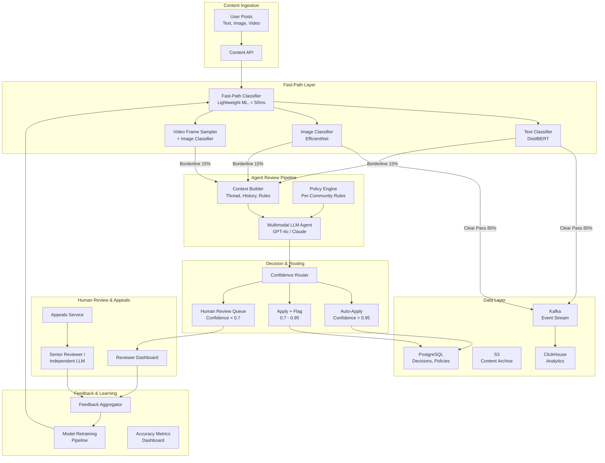
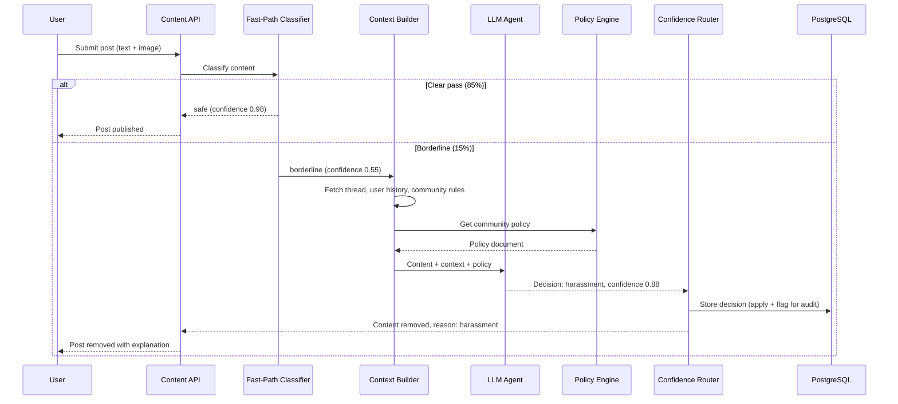

# AI-Powered Content Moderation System

A tiered content moderation system that combines lightweight ML classifiers for high-throughput first-pass filtering with LLM-powered contextual review for borderline content, achieving sub-second moderation latency across 10 million daily posts while keeping false positive and false negative rates extremely low.

---

## Problem Statement

> Design a content moderation system that uses AI agents to review user-generated content (text, images, video) across a social media platform. It must handle 10 million posts per day with sub-second moderation latency for most content.

---

## Clarifying Questions to Ask

1. **Content types and distribution** -- What is the breakdown of text, image, and video content? Are videos short-form (under 60 seconds) or long-form? Does the system need to moderate live streams?
2. **Policy complexity** -- How many distinct communities or regions have their own moderation rules? Are policies versioned, and how frequently do they change?
3. **Latency tolerance by content type** -- Is sub-second latency required for all content types, or only text? Can video moderation be asynchronous with the content held until review completes?
4. **Appeal volume and SLA** -- What percentage of moderation decisions are appealed? What is the expected turnaround time for appeal resolution?
5. **Regulatory requirements** -- Are there jurisdiction-specific mandates (e.g., EU Digital Services Act, NetzDG) that require reporting or specific response timelines?
6. **Human reviewer capacity** -- How many human moderators are available? What is their average review throughput per hour?

---

## Requirements

### Functional Requirements

1. Classify content as safe, needs-review, or violating (with violation category such as hate speech, harassment, spam, NSFW, misinformation)
2. Support text, image, and video moderation across multiple modalities
3. Configurable moderation policies per community and per region
4. Human review queue for edge cases with priority ordering
5. Appeal workflow allowing users to contest moderation decisions
6. Feedback loop from human decisions to retrain classifiers

### Non-Functional Requirements

| Requirement | Target |
|-------------|--------|
| Latency (p95) | < 1 second for text and image |
| Throughput | 10 million posts/day (~115 posts/second) |
| False positive rate | < 2% (blocking good content is costly) |
| False negative rate | < 0.5% (allowing bad content is worse) |
| Availability | 99.9% uptime |
| Human review turnaround | < 15 minutes for high-priority items |

### Out of Scope

- Live stream moderation (real-time video feed analysis)
- Automated legal takedown processing (DMCA, court orders)
- User reputation scoring system
- Content recommendation or ranking

---

## High-Level Architecture

### Architecture Walkthrough

The architecture uses a **tiered design** that separates cheap, fast classification from expensive, deep analysis.

The **Content Ingestion** layer receives all user-generated posts through the Content API, which normalizes content into a standard format (text extracted, images resized, video keyframes sampled) and publishes to the processing pipeline.

The **Fast-Path Layer** runs lightweight ML classifiers that process content in under 50ms. Text goes through a fine-tuned DistilBERT model, images through EfficientNet, and video through keyframe sampling plus image classification. Approximately 85% of content is clearly safe and passes through immediately. Obviously violating content (known spam patterns, NSFW images with high confidence) is auto-removed. The remaining 15% of borderline content is routed to the Agent Review Pipeline.

The **Agent Review Pipeline** is the intelligent core. The Context Builder assembles a rich context package: the content itself, the conversation thread it belongs to, the poster's recent history, and the specific community's moderation rules. The Multimodal LLM Agent evaluates the content against the applicable policy, producing a classification decision, a confidence score, and human-readable reasoning. The Policy Engine stores per-community and per-region rules in a versioned configuration database.

The **Confidence Router** directs decisions based on the agent's confidence score. High-confidence decisions (above 0.95) are auto-applied. Medium-confidence decisions (0.7 to 0.95) are applied but flagged for quality audit. Low-confidence decisions (below 0.7) route to the Human Review Queue.

The **Human Review and Appeals** layer provides a reviewer dashboard where moderators handle low-confidence cases, and an Appeals Service where users can contest decisions. Appeals go to either a senior human reviewer or an independent LLM evaluation to avoid bias from the original decision.

The **Feedback and Learning** layer closes the loop: human decisions are aggregated, accuracy metrics are tracked, and the fast-path classifier is periodically retrained on the growing corpus of human-labeled examples.

---

## Component Design

### 1. Fast-Path Classifier

The fast-path classifier is the volume workhorse. It processes 85% of all content without involving an LLM, which is the primary cost and latency optimization. The classifier is a set of lightweight ML models -- DistilBERT for text (6 layers, 66M parameters) and EfficientNet-B0 for images -- running on GPU inference servers with dynamic batching. Each model outputs a multi-label classification (spam, hate speech, NSFW, harassment, safe) with confidence scores. Content scoring below 0.3 on all violation categories is immediately passed. Content scoring above 0.9 on any violation category is immediately actioned. Everything in between goes to the agent pipeline.

The classifier is retrained weekly using the latest human-reviewed decisions as labeled training data. This creates a virtuous cycle: as the LLM agent and human reviewers handle borderline cases, their decisions improve the fast-path classifier, which gradually handles more cases autonomously.

### 2. Context Builder

The Context Builder transforms a raw post into a rich moderation context. For a given post, it retrieves the full conversation thread (up to 20 messages), the poster's recent moderation history (last 30 days of flags and violations), and the community's specific moderation rules. This context is critical for accurate moderation -- a message reading "I'm going to destroy you" means something very different in a gaming community versus a political discussion forum. Without context, the false positive rate on context-dependent content exceeds 15%.

### 3. Policy Engine

The Policy Engine stores moderation rules as structured configuration rather than hardcoded logic. Each community or region has a policy document specifying: which categories to moderate (some communities allow NSFW content), severity thresholds per category, required actions per severity level (warn, remove, ban), and any jurisdiction-specific requirements. Policies are versioned so that changes can be rolled back and audited. The engine exposes policies as structured data that is injected into the LLM agent's prompt.

### 4. Confidence Router

The confidence router is the traffic control mechanism that balances automation with safety. The thresholds (0.95 and 0.7) are calibrated against historical data: at 0.95 confidence, the agent's accuracy is 99.2%, making auto-application safe. Between 0.7 and 0.95, accuracy is 94%, so decisions are applied (to maintain speed) but flagged for audit sampling. Below 0.7, accuracy drops below 85%, so human review is required.

### 5. Appeals Service

The Appeals Service provides fairness and regulatory compliance. When a user appeals, the system routes the case to an independent review path -- either a senior human reviewer or a separate LLM evaluation that does not see the original decision's reasoning. This prevents confirmation bias. Appeal outcomes feed back into the accuracy metrics, helping identify systematic errors in the moderation pipeline.

---

## Data Flow

### Happy Path Walkthrough

A user submits a text post with an attached image. The Content API normalizes both modalities and sends them to the Fast-Path Classifier. The text classifier returns a confidence of 0.12 for all violation categories, and the image classifier returns 0.08. Both are well below the borderline threshold, so the content is immediately published. Total latency: 45ms. No LLM call is made. This path handles 85% of all content.

### Error/Edge Case Path

A user posts a sarcastic comment in a political discussion forum that the fast-path classifier flags as borderline hate speech (confidence 0.55). The Context Builder fetches the full conversation thread and discovers the comment is a direct quote of a politician being discussed. The user has no prior moderation history. The community's policy allows political commentary with quotations. The LLM agent, seeing the full context, classifies the content as safe with confidence 0.82. The confidence router auto-applies the "safe" decision but flags it for audit since 0.82 falls in the medium-confidence band. If the agent had only seen the text without context, it would have likely flagged it as a violation -- context-aware moderation reduces false positives by 40% on political and satirical content.

---

## Scaling Considerations

The fast-path classifier is the throughput engine. At 115 posts per second, GPU inference servers with dynamic batching handle the load comfortably. Each server processes approximately 500 classifications per second with batches of 32. Three servers provide 3x redundancy.

The LLM agent pipeline processes only 15% of content (approximately 17 posts per second). With an average LLM call taking 800ms, this requires approximately 14 concurrent LLM calls. A pool of 20 concurrent slots provides headroom for bursts.

The human review queue processes approximately 2-3% of total content (those below 0.7 confidence from the agent pipeline), which is roughly 200,000-300,000 items per day. With an average review time of 30 seconds per item, this requires approximately 70-100 moderators working 8-hour shifts.

During viral events or coordinated attacks, the system implements backpressure: if the agent pipeline queue exceeds a threshold, the fast-path classifier temporarily tightens its thresholds (passing more content without agent review) to prevent cascading delays. This trades a small increase in false negatives for maintaining system responsiveness.

Sharding the human review queue by content category and region ensures that reviewers with relevant expertise and language skills handle appropriate cases.

---

## Cost Analysis

| Component | Volume/Day | Unit Cost | Daily Cost |
|-----------|-----------|-----------|------------|
| Fast-path GPU inference | 10M classifications | $0.00001/classification | $100 |
| LLM agent review | 1.5M posts (15%) | $0.008/review (avg 2K tokens) | $12,000 |
| Human review | 250K posts (2.5%) | $0.15/review (30s at $18/hr) | $37,500 |
| Infrastructure (Kafka, PG, S3) | -- | -- | $500 |
| **Total daily** | | | **$50,100** |
| **Cost per post (blended)** | | | **$0.005** |

The dominant cost is human review. Every improvement in LLM agent accuracy that moves content from human review to auto-decision saves approximately $0.14 per post. A 1% improvement in agent accuracy at the 0.7 threshold saves roughly $1,500 per day.

---

## Trade-offs & Alternatives

| Decision | Rationale | Alternative | Why Not |
|----------|-----------|-------------|---------|
| Tiered classifier + LLM agent | 85% of content handled at $0.00001/post; only borderline cases hit the expensive LLM path | LLM for all content | At $0.008 per LLM review, processing 10M posts costs $80K/day vs $12K/day with tiering |
| Context-aware moderation (thread + history) | Reduces false positives by 40% on context-dependent content (sarcasm, quotes, community norms) | Moderate each post in isolation | Isolated moderation cannot distinguish sarcasm from genuine hate speech; unacceptable false positive rate |
| Confidence-based routing with three tiers | Balances automation speed with accuracy; auto-applies safe decisions while protecting against errors | Binary auto/human split | Wastes human reviewer time on medium-confidence cases that the agent handles at 94% accuracy |
| Independent appeal review (separate LLM or senior reviewer) | Prevents confirmation bias; regulatory compliance in many jurisdictions | Same system re-reviews its own decision | Original decision reasoning biases the re-review; user trust erodes if appeals feel rubber-stamped |
| Weekly retraining of fast-path classifier | Adapts to evolving content patterns and new abuse vectors | Static model updated quarterly | Content patterns shift weekly; a static model degrades 2-3% accuracy per month on emerging abuse types |
| Per-community policy engine | Allows communities to set contextually appropriate rules (e.g., NSFW-allowed communities) | One global policy for all content | Overly restrictive for some communities, overly permissive for others; user backlash in both directions |

---

## Interview Tips

:::tip How to Present This (35 minutes)
- **Minutes 1-5**: Clarify requirements. Ask about content type distribution, policy complexity, latency tolerance by modality, and regulatory requirements. State out-of-scope items (live streaming, legal takedowns). This scoping prevents you from over-designing.
- **Minutes 5-15**: Draw the tiered architecture. Start with the fast-path classifier as the volume workhorse, then the LLM agent pipeline for borderline cases, then the human review queue. Emphasize the 85/15 split and why this tiering is the key economic decision.
- **Minutes 15-25**: Deep dive into the Context Builder (why context matters for accuracy), the Confidence Router (how thresholds are calibrated), and the Feedback Loop (how human decisions retrain the fast-path classifier). Use the sequence diagram to walk through a borderline case.
- **Minutes 25-30**: Discuss scaling (GPU batching for fast-path, concurrent LLM pool sizing, human reviewer capacity planning), cost analysis (show the per-post blended cost), and the backpressure mechanism during viral events.
- **Minutes 30-35**: Handle follow-ups. Common questions: "How do you handle new abuse patterns?" (fast-path retraining + policy engine updates), "How do you prevent bias in moderation?" (independent appeal path, demographic fairness audits on moderation rates), "How do you moderate video?" (keyframe sampling + audio transcription, async processing with content held until review).
:::
