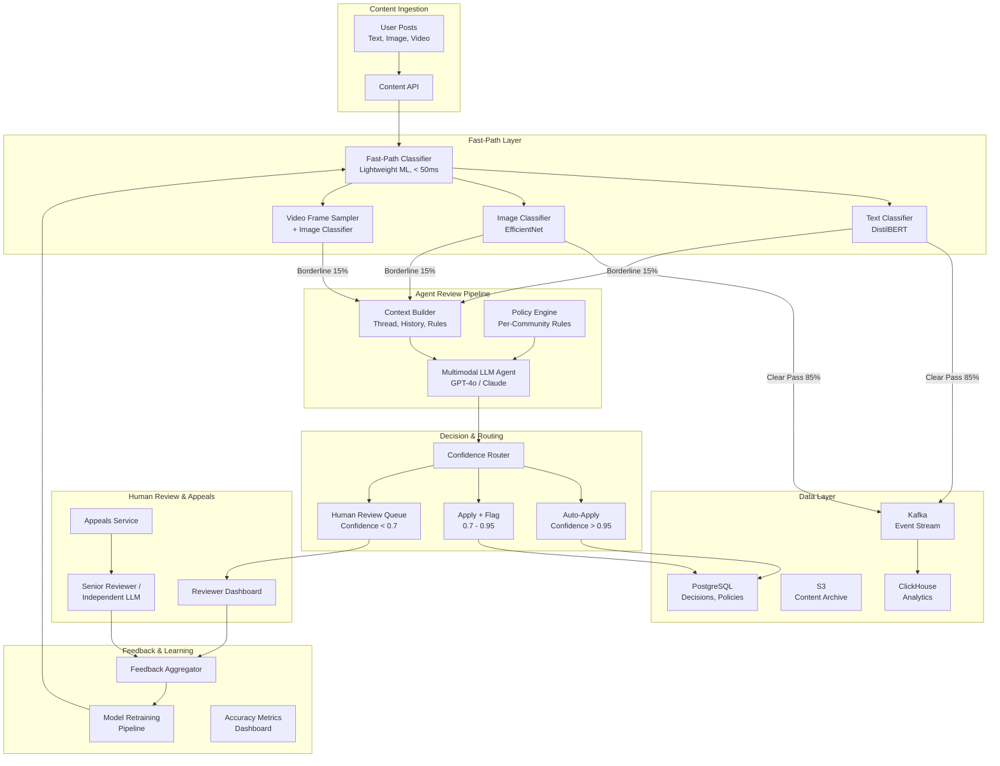
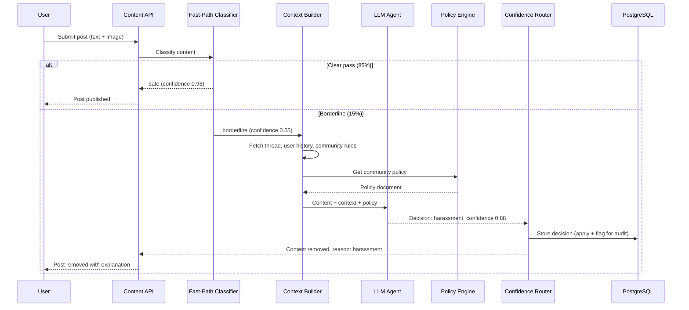
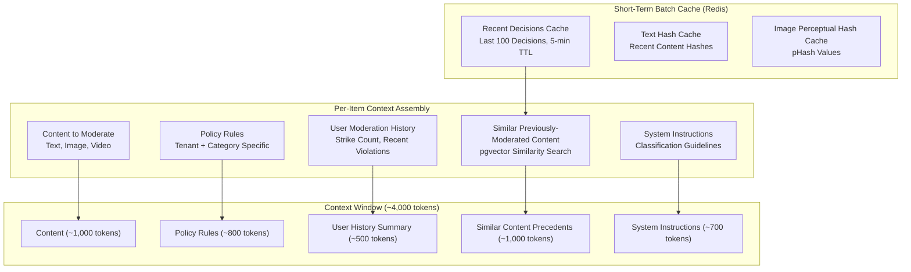
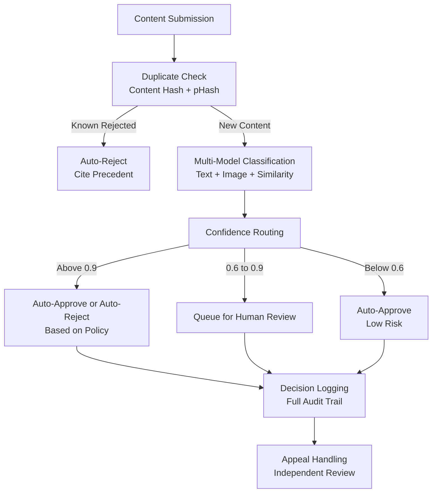

# AI-Powered Content Moderation System

A tiered content moderation system that combines lightweight ML classifiers for high-throughput first-pass filtering with LLM-powered contextual review for borderline content, achieving sub-second moderation latency across 10 million daily posts while keeping false positive and false negative rates extremely low.

---

## Problem Statement

> Design a content moderation system that uses AI agents to review user-generated content (text, images, video) across a social media platform. It must handle 10 million posts per day with sub-second moderation latency for most content.

---

## Clarifying Questions to Ask

1. **Content types and distribution** -- What is the breakdown of text, image, and video content? Are videos short-form (under 60 seconds) or long-form? Does the system need to moderate live streams?
2. **Policy complexity** -- How many distinct communities or regions have their own moderation rules? Are policies versioned, and how frequently do they change?
3. **Latency tolerance by content type** -- Is sub-second latency required for all content types, or only text? Can video moderation be asynchronous with the content held until review completes?
4. **Appeal volume and SLA** -- What percentage of moderation decisions are appealed? What is the expected turnaround time for appeal resolution?
5. **Regulatory requirements** -- Are there jurisdiction-specific mandates (e.g., EU Digital Services Act, NetzDG) that require reporting or specific response timelines?
6. **Human reviewer capacity** -- How many human moderators are available? What is their average review throughput per hour?

---

## Requirements

### Functional Requirements

1. Classify content as safe, needs-review, or violating (with violation category such as hate speech, harassment, spam, NSFW, misinformation)
2. Support text, image, and video moderation across multiple modalities
3. Configurable moderation policies per community and per region
4. Human review queue for edge cases with priority ordering
5. Appeal workflow allowing users to contest moderation decisions
6. Feedback loop from human decisions to retrain classifiers

### Non-Functional Requirements

| Requirement | Target |
|-------------|--------|
| Latency (p95) | < 1 second for text and image |
| Throughput | 10 million posts/day (~115 posts/second) |
| False positive rate | < 2% (blocking good content is costly) |
| False negative rate | < 0.5% (allowing bad content is worse) |
| Availability | 99.9% uptime |
| Human review turnaround | < 15 minutes for high-priority items |

### Out of Scope

- Live stream moderation (real-time video feed analysis)
- Automated legal takedown processing (DMCA, court orders)
- User reputation scoring system
- Content recommendation or ranking

---

## High-Level Architecture



### Architecture Walkthrough

The architecture uses a **tiered design** that separates cheap, fast classification from expensive, deep analysis.

The **Content Ingestion** layer receives all user-generated posts through the Content API, which normalizes content into a standard format (text extracted, images resized, video keyframes sampled) and publishes to the processing pipeline.

The **Fast-Path Layer** runs lightweight ML classifiers that process content in under 50ms. Text goes through a fine-tuned DistilBERT model, images through EfficientNet, and video through keyframe sampling plus image classification. Approximately 85% of content is clearly safe and passes through immediately. Obviously violating content (known spam patterns, NSFW images with high confidence) is auto-removed. The remaining 15% of borderline content is routed to the Agent Review Pipeline.

The **Agent Review Pipeline** is the intelligent core. The Context Builder assembles a rich context package: the content itself, the conversation thread it belongs to, the poster's recent history, and the specific community's moderation rules. The Multimodal LLM Agent evaluates the content against the applicable policy, producing a classification decision, a confidence score, and human-readable reasoning. The Policy Engine stores per-community and per-region rules in a versioned configuration database.

The **Confidence Router** directs decisions based on the agent's confidence score. High-confidence decisions (above 0.95) are auto-applied. Medium-confidence decisions (0.7 to 0.95) are applied but flagged for quality audit. Low-confidence decisions (below 0.7) route to the Human Review Queue.

The **Human Review and Appeals** layer provides a reviewer dashboard where moderators handle low-confidence cases, and an Appeals Service where users can contest decisions. Appeals go to either a senior human reviewer or an independent LLM evaluation to avoid bias from the original decision.

The **Feedback and Learning** layer closes the loop: human decisions are aggregated, accuracy metrics are tracked, and the fast-path classifier is periodically retrained on the growing corpus of human-labeled examples.

---

## Component Design

### 1. Fast-Path Classifier

The fast-path classifier is the volume workhorse. It processes 85% of all content without involving an LLM, which is the primary cost and latency optimization. The classifier is a set of lightweight ML models -- DistilBERT for text (6 layers, 66M parameters) and EfficientNet-B0 for images -- running on GPU inference servers with dynamic batching. Each model outputs a multi-label classification (spam, hate speech, NSFW, harassment, safe) with confidence scores. Content scoring below 0.3 on all violation categories is immediately passed. Content scoring above 0.9 on any violation category is immediately actioned. Everything in between goes to the agent pipeline.

The classifier is retrained weekly using the latest human-reviewed decisions as labeled training data. This creates a virtuous cycle: as the LLM agent and human reviewers handle borderline cases, their decisions improve the fast-path classifier, which gradually handles more cases autonomously.

### 2. Context Builder

The Context Builder transforms a raw post into a rich moderation context. For a given post, it retrieves the full conversation thread (up to 20 messages), the poster's recent moderation history (last 30 days of flags and violations), and the community's specific moderation rules. This context is critical for accurate moderation -- a message reading "I'm going to destroy you" means something very different in a gaming community versus a political discussion forum. Without context, the false positive rate on context-dependent content exceeds 15%.

### 3. Policy Engine

The Policy Engine stores moderation rules as structured configuration rather than hardcoded logic. Each community or region has a policy document specifying: which categories to moderate (some communities allow NSFW content), severity thresholds per category, required actions per severity level (warn, remove, ban), and any jurisdiction-specific requirements. Policies are versioned so that changes can be rolled back and audited. The engine exposes policies as structured data that is injected into the LLM agent's prompt.

### 4. Confidence Router

The confidence router is the traffic control mechanism that balances automation with safety. The thresholds (0.95 and 0.7) are calibrated against historical data: at 0.95 confidence, the agent's accuracy is 99.2%, making auto-application safe. Between 0.7 and 0.95, accuracy is 94%, so decisions are applied (to maintain speed) but flagged for audit sampling. Below 0.7, accuracy drops below 85%, so human review is required.

### 5. Appeals Service

The Appeals Service provides fairness and regulatory compliance. When a user appeals, the system routes the case to an independent review path -- either a senior human reviewer or a separate LLM evaluation that does not see the original decision's reasoning. This prevents confirmation bias. Appeal outcomes feed back into the accuracy metrics, helping identify systematic errors in the moderation pipeline.

---

## Data Flow



### Happy Path Walkthrough

A user submits a text post with an attached image. The Content API normalizes both modalities and sends them to the Fast-Path Classifier. The text classifier returns a confidence of 0.12 for all violation categories, and the image classifier returns 0.08. Both are well below the borderline threshold, so the content is immediately published. Total latency: 45ms. No LLM call is made. This path handles 85% of all content.

### Error/Edge Case Path

A user posts a sarcastic comment in a political discussion forum that the fast-path classifier flags as borderline hate speech (confidence 0.55). The Context Builder fetches the full conversation thread and discovers the comment is a direct quote of a politician being discussed. The user has no prior moderation history. The community's policy allows political commentary with quotations. The LLM agent, seeing the full context, classifies the content as safe with confidence 0.82. The confidence router auto-applies the "safe" decision but flags it for audit since 0.82 falls in the medium-confidence band. If the agent had only seen the text without context, it would have likely flagged it as a violation -- context-aware moderation reduces false positives by 40% on political and satirical content.

---

## Scaling Considerations

The fast-path classifier is the throughput engine. At 115 posts per second, GPU inference servers with dynamic batching handle the load comfortably. Each server processes approximately 500 classifications per second with batches of 32. Three servers provide 3x redundancy.

The LLM agent pipeline processes only 15% of content (approximately 17 posts per second). With an average LLM call taking 800ms, this requires approximately 14 concurrent LLM calls. A pool of 20 concurrent slots provides headroom for bursts.

The human review queue processes approximately 2-3% of total content (those below 0.7 confidence from the agent pipeline), which is roughly 200,000-300,000 items per day. With an average review time of 30 seconds per item, this requires approximately 70-100 moderators working 8-hour shifts.

During viral events or coordinated attacks, the system implements backpressure: if the agent pipeline queue exceeds a threshold, the fast-path classifier temporarily tightens its thresholds (passing more content without agent review) to prevent cascading delays. This trades a small increase in false negatives for maintaining system responsiveness.

Sharding the human review queue by content category and region ensures that reviewers with relevant expertise and language skills handle appropriate cases.

---

## Cost Analysis

| Component | Volume/Day | Unit Cost | Daily Cost |
|-----------|-----------|-----------|------------|
| Fast-path GPU inference | 10M classifications | $0.00001/classification | $100 |
| LLM agent review | 1.5M posts (15%) | $0.008/review (avg 2K tokens) | $12,000 |
| Human review | 250K posts (2.5%) | $0.15/review (30s at $18/hr) | $37,500 |
| Infrastructure (Kafka, PG, S3) | -- | -- | $500 |
| **Total daily** | | | **$50,100** |
| **Cost per post (blended)** | | | **$0.005** |

The dominant cost is human review. Every improvement in LLM agent accuracy that moves content from human review to auto-decision saves approximately $0.14 per post. A 1% improvement in agent accuracy at the 0.7 threshold saves roughly $1,500 per day.

---

## Data Layer Deep Dive

### Database Selection Justification

Each data store in the architecture was chosen for a specific reason tied to the moderation workload it serves. The table below summarizes the selection rationale and the alternatives that were evaluated and rejected.

| Store | Technology | Why This Choice | Alternative Considered | Why Not |
|-------|-----------|----------------|----------------------|---------|
| Moderation decisions, policy rules, appeal history | PostgreSQL | ACID guarantees for moderation state -- a content piece must have exactly one moderation decision at a time; JSONB for heterogeneous content metadata (text posts, images, and videos have different attributes); full-text search for searching moderation history and policy documents | MongoDB | Flexible schema, but moderation decisions involve complex relational queries -- appeals reference original decisions, policy updates affect pending reviews, user history lookups span multiple content types -- all relational patterns that are cumbersome to model in a document store |
| Real-time moderation queues and rate limiting | Redis | Sorted sets for priority-based review queues (ordering by severity and waiting time); TTL for temporary content holds (holding content pending review without manual cleanup); rate limiting per user to prevent spam flooding the moderation pipeline | SQS | Durable queue but lacks the priority ordering and rate limiting primitives built into Redis; SQS FIFO queues do not support dynamic re-prioritization, which is essential when a high-severity item arrives and must jump the queue |
| Content similarity detection | pgvector | Detect near-duplicate harmful content (same hate speech reposted with minor text variations); find content similar to previously removed content to catch rephrased versions of known violations; runs inside the existing PostgreSQL instance without a separate managed service | Perceptual hashing only | Works for exact or near-duplicates of images and videos but misses semantic similarity -- rephrased versions of the same harmful message with different wording evade hash-based detection entirely |
| Moderation analytics | ClickHouse | High-volume event streams (every content submission is logged as an event); aggregation queries for dashboards (violation rates, response times, false positive rates, policy effectiveness); columnar storage handles billions of moderation events efficiently | PostgreSQL with materialized views | Works initially, but moderation at scale produces billions of events per month -- columnar storage is necessary for sub-second dashboard queries over that volume; analytical workload would compete with the OLTP moderation decision workload |

### Schema Design

The following schemas define the core data model for the content moderation system. Each table includes its indexes with justification for why each index exists.

#### moderation_items

Stores every piece of content submitted for moderation, including the auto-classification results and the final decision.

```sql
CREATE TABLE moderation_items (
    id UUID PRIMARY KEY DEFAULT gen_random_uuid(),
    tenant_id VARCHAR(64) NOT NULL,
    content_type VARCHAR(10) NOT NULL
        CHECK (content_type IN ('text', 'image', 'video', 'audio', 'link')),
    content_text TEXT,
    content_url TEXT,
    content_hash VARCHAR(128),
    user_id VARCHAR(64) NOT NULL,
    submission_context JSONB DEFAULT '{}',
    auto_classification JSONB DEFAULT '{}',
    -- auto_classification contains: { "category": "hate_speech", "confidence": 0.87, "model_version": "v2.3" }
    final_decision VARCHAR(20) NOT NULL DEFAULT 'pending'
        CHECK (final_decision IN ('approved', 'rejected', 'escalated', 'pending')),
    decided_by VARCHAR(64),
    -- decided_by is 'auto' for automated decisions or the reviewer_id for human decisions
    policy_violated TEXT[],
    created_at TIMESTAMPTZ NOT NULL DEFAULT now(),
    decided_at TIMESTAMPTZ
);

-- Priority review queue: pending items ordered by severity and waiting time
CREATE INDEX idx_moderation_pending ON moderation_items(final_decision, created_at)
    WHERE final_decision = 'pending';

-- User moderation history: lookup all moderation decisions for a specific user
CREATE INDEX idx_moderation_user ON moderation_items(user_id, created_at DESC);

-- Content deduplication: find items with the same content hash
CREATE INDEX idx_moderation_hash ON moderation_items(content_hash)
    WHERE content_hash IS NOT NULL;

-- Tenant-level dashboard: filter by tenant and decision status
CREATE INDEX idx_moderation_tenant_decision ON moderation_items(tenant_id, final_decision);
```

**Index rationale**:
- `idx_moderation_pending` -- A partial index on only pending items. The human review queue queries this constantly to fetch the next item to review. Without this index, every queue poll scans the full table (which is dominated by already-decided items).
- `idx_moderation_user` -- The repeat offender check (see Key Queries below) loads a user's recent moderation history. This composite index on `(user_id, created_at DESC)` serves that query without a sort operation.
- `idx_moderation_hash` -- Content deduplication at submission time. When new content arrives, the system checks if the same hash has been seen before and was previously rejected, enabling instant re-rejection without running the full classification pipeline.
- `idx_moderation_tenant_decision` -- Multi-tenant dashboards filter by tenant and decision status. Without this index, every dashboard load scans the full moderation history.

#### moderation_policies

Stores configurable policy rules that control how content is classified and what automated actions are taken. Policies are versioned with effective date ranges so that changes can be audited and rolled back.

```sql
CREATE TABLE moderation_policies (
    id UUID PRIMARY KEY DEFAULT gen_random_uuid(),
    tenant_id VARCHAR(64) NOT NULL,
    policy_name VARCHAR(128) NOT NULL,
    category VARCHAR(50) NOT NULL,
    severity VARCHAR(20) NOT NULL,
    auto_action VARCHAR(20) NOT NULL
        CHECK (auto_action IN ('approve', 'reject', 'queue_for_review')),
    confidence_threshold NUMERIC(3, 2) NOT NULL,
    is_active BOOLEAN NOT NULL DEFAULT true,
    effective_from TIMESTAMPTZ NOT NULL DEFAULT now(),
    effective_until TIMESTAMPTZ
);

-- Policy lookup: active policies for a tenant in a specific category
CREATE INDEX idx_policies_tenant_category ON moderation_policies(tenant_id, category)
    WHERE is_active = true;

-- Policy versioning: find all versions of a policy over time
CREATE INDEX idx_policies_effective ON moderation_policies(tenant_id, effective_from DESC);
```

**Index rationale**:
- `idx_policies_tenant_category` -- A partial index on only active policies. Every moderation decision looks up the applicable policy rules for the tenant and content category. This index ensures that lookup is fast and excludes deactivated policies at the index level.
- `idx_policies_effective` -- Policy audit queries need to find what rules were in effect at a specific point in time. This index supports temporal queries like "what policies were active on date X" by scanning effective dates in descending order.

#### appeals

Tracks user appeals of moderation decisions, linking each appeal back to the original moderation item.

```sql
CREATE TABLE appeals (
    id UUID PRIMARY KEY DEFAULT gen_random_uuid(),
    moderation_item_id UUID NOT NULL REFERENCES moderation_items(id),
    user_id VARCHAR(64) NOT NULL,
    appeal_reason TEXT NOT NULL,
    appeal_status VARCHAR(20) NOT NULL DEFAULT 'pending'
        CHECK (appeal_status IN ('pending', 'upheld', 'overturned')),
    reviewer_id VARCHAR(64),
    review_notes TEXT,
    created_at TIMESTAMPTZ NOT NULL DEFAULT now(),
    resolved_at TIMESTAMPTZ
);

-- Pending appeals queue: ordered by creation time for FIFO processing
CREATE INDEX idx_appeals_pending ON appeals(created_at)
    WHERE appeal_status = 'pending';

-- Appeal lookup by original moderation item
CREATE INDEX idx_appeals_item ON appeals(moderation_item_id);

-- User appeal history: check how many appeals a user has filed
CREATE INDEX idx_appeals_user ON appeals(user_id, created_at DESC);
```

**Index rationale**:
- `idx_appeals_pending` -- A partial index on only pending appeals. The appeal review queue polls this index to fetch the next appeal to process. Resolved appeals (the majority of the table over time) are excluded at the index level.
- `idx_appeals_item` -- When viewing a moderation decision, the system needs to check if an appeal exists. This index supports that lookup without scanning the full appeals table.
- `idx_appeals_user` -- Abuse detection for the appeals process. Users who file excessive appeals may be gaming the system. This index supports the query "how many appeals has this user filed in the last 30 days" efficiently.

#### user_moderation_history

Maintains a per-user aggregate of moderation activity for fast repeat-offender checks and progressive enforcement (strike-based systems).

```sql
CREATE TABLE user_moderation_history (
    user_id VARCHAR(64) PRIMARY KEY,
    total_violations INTEGER NOT NULL DEFAULT 0,
    violations_30d INTEGER NOT NULL DEFAULT 0,
    current_strike_count INTEGER NOT NULL DEFAULT 0,
    last_violation_at TIMESTAMPTZ,
    is_suspended BOOLEAN NOT NULL DEFAULT false,
    suspension_expires_at TIMESTAMPTZ
);

-- Suspended user lookup: quickly find all currently suspended users
CREATE INDEX idx_user_suspended ON user_moderation_history(suspension_expires_at)
    WHERE is_suspended = true;
```

**Index rationale**:
- `idx_user_suspended` -- A partial index on only suspended users. The content submission pipeline checks this index to immediately reject content from suspended users before running any classification. Unsuspended users (the vast majority) are excluded at the index level, keeping the index small and fast.

### Key Queries

These are the actual queries the system executes in production, not simplified examples.

**1. Priority-based review queue -- pending items ordered by severity and waiting time**

Used by the human review dashboard to fetch the next highest-priority item. Items with higher-severity auto-classifications are reviewed first; within the same severity, older items are reviewed first (FIFO within priority).

```sql
SELECT mi.id, mi.content_type, mi.content_text, mi.content_url,
       mi.auto_classification, mi.submission_context,
       mi.created_at,
       umh.current_strike_count,
       umh.violations_30d
FROM moderation_items mi
LEFT JOIN user_moderation_history umh ON mi.user_id = umh.user_id
WHERE mi.final_decision = 'pending'
ORDER BY
    CASE (mi.auto_classification->>'category')
        WHEN 'csam' THEN 1
        WHEN 'violence_threats' THEN 2
        WHEN 'hate_speech' THEN 3
        WHEN 'harassment' THEN 4
        WHEN 'spam' THEN 5
        ELSE 6
    END,
    mi.created_at ASC
LIMIT 10;
```

The `CASE` expression implements static priority ordering by violation category. CSAM is always reviewed first regardless of queue depth. The `LEFT JOIN` against `user_moderation_history` provides the reviewer with the user's strike count inline, enabling informed escalation decisions without a separate lookup.

**2. User violation pattern -- check if a user is a repeat offender**

Used during classification to decide whether to escalate enforcement. A first-time offender may receive a warning; a user with 3 strikes in 30 days receives a suspension.

```sql
SELECT user_id,
       current_strike_count,
       violations_30d,
       last_violation_at,
       is_suspended,
       suspension_expires_at
FROM user_moderation_history
WHERE user_id = $1;
```

This is a primary key lookup -- single row, sub-millisecond. The `violations_30d` counter is updated by a scheduled job that decrements counts as violations age past the 30-day window, rather than recounting on every query (which would require scanning the `moderation_items` table).

**3. Policy effectiveness -- false positive and false negative rates per policy rule**

Used by the moderation operations team to evaluate and tune policy rules. A high false positive rate (content auto-rejected but later overturned on appeal) indicates the confidence threshold is too aggressive. A high false negative rate (content auto-approved but later reported by users) indicates the threshold is too lenient.

```sql
SELECT mp.id AS policy_id,
       mp.policy_name,
       mp.category,
       mp.confidence_threshold,
       COUNT(mi.id) AS total_decisions,
       COUNT(CASE WHEN a.appeal_status = 'overturned' THEN 1 END) AS false_positives,
       COUNT(CASE WHEN mi.final_decision = 'approved'
                   AND mi.id IN (SELECT moderation_item_id FROM appeals WHERE appeal_status = 'upheld')
             THEN 1 END) AS false_negatives,
       ROUND(
           COUNT(CASE WHEN a.appeal_status = 'overturned' THEN 1 END)::NUMERIC
           / NULLIF(COUNT(mi.id), 0) * 100, 2
       ) AS false_positive_rate_pct
FROM moderation_policies mp
JOIN moderation_items mi ON mi.tenant_id = mp.tenant_id
    AND mi.auto_classification->>'category' = mp.category
LEFT JOIN appeals a ON a.moderation_item_id = mi.id
WHERE mp.is_active = true
  AND mi.created_at >= now() - INTERVAL '30 days'
GROUP BY mp.id, mp.policy_name, mp.category, mp.confidence_threshold
ORDER BY false_positive_rate_pct DESC;
```

This query runs against PostgreSQL for the operational dashboard. For high-volume analytics over longer time ranges, the equivalent query runs against ClickHouse where the columnar storage handles the aggregation over billions of events.

**4. Content similarity search -- find previously-moderated similar content**

Used during classification to check if similar content has been seen before and what decision was made. If a near-identical piece of content was previously rejected for hate speech, the new submission can be fast-tracked to rejection without running the full LLM pipeline.

```sql
SELECT id, content_type, content_text, final_decision,
       policy_violated,
       1 - (content_embedding <=> $1) AS similarity
FROM moderation_items
WHERE final_decision IN ('rejected', 'approved')
  AND tenant_id = $2
ORDER BY content_embedding <=> $1
LIMIT 5;
```

The `<=>` operator computes cosine distance using the pgvector extension. The query returns the 5 most similar previously-moderated items along with their decisions. If the top match has similarity above 0.92 and was previously rejected, the system auto-rejects the new submission and logs the precedent item ID for audit. If similarity is between 0.75 and 0.92, the result is included in the LLM agent's context to inform its decision.

---

## Agent Memory Architecture

Content moderation is fundamentally different from conversational agents in its memory requirements. There is no multi-turn conversation to maintain -- each moderation decision is independent. However, the agent still needs contextual memory to make informed decisions: the user's moderation history (is this a repeat offender?), recent content from the same user (is this part of a coordinated spam campaign?), and similar previously-moderated content (is this a known harmful pattern?).

### Memory Mode: Stateless Per-Item with User Context Lookup

Each content item is moderated independently. The agent does not maintain a "session" across multiple moderation decisions. Instead, it performs targeted lookups to assemble the context needed for each decision.



### Context Window Strategy

The system uses a fixed token budget of approximately 4,000 tokens per moderation decision. This is deliberately compact -- moderation decisions should be fast and focused, unlike open-ended conversations.

| Context Component | Token Budget | Source |
|-------------------|-------------|--------|
| Content to moderate (text, transcription, or image description) | ~1,000 tokens | Content API |
| Policy rules for relevant categories | ~800 tokens | PostgreSQL (moderation_policies) |
| User moderation history summary | ~500 tokens | PostgreSQL (user_moderation_history) |
| Similar previously-moderated content and their decisions | ~1,000 tokens | pgvector similarity search |
| System instructions (classification guidelines, output format) | ~700 tokens | Static configuration |
| **Total per decision** | **~4,000 tokens** | |

This compact budget means each LLM moderation call costs approximately $0.008 (at GPT-4o pricing). The budget is deliberately smaller than a conversational agent because moderation is a classification task, not a generation task -- the agent needs to decide and cite a policy, not generate a lengthy response.

### Batch Memory for Coordinated Attack Detection

When moderating a stream of content from the same source (e.g., a spam campaign or a coordinated harassment attack), the agent maintains a short-term cache in Redis to detect patterns that would not be visible from any single moderation decision.

The batch cache tracks three signals:

1. **Same user, multiple submissions** -- If a user submits more than 10 items in 1 minute, all pending items from that user are flagged for batch review rather than individual moderation.
2. **Same text hash** -- If the same content hash appears more than 5 times across different users in a 5-minute window, the system triggers a coordinated-attack alert and auto-holds all matching content.
3. **Same image perceptual hash** -- If the same pHash value appears more than 3 times across different users, the system flags a coordinated image-based campaign (e.g., the same meme with minor variations being distributed by multiple accounts).

The batch cache uses Redis sorted sets with TTL-based expiration. Entries expire after 5 minutes, keeping the cache small and focused on detecting real-time campaigns rather than maintaining historical state.

:::note Design Decision
The batch cache is deliberately ephemeral (5-minute TTL). Long-term pattern detection is handled by offline analytics in ClickHouse, not by the real-time moderation pipeline. This separation prevents the real-time path from being slowed by expensive historical queries.
:::

---

## Hallucination Mitigation

In content moderation, "hallucination" manifests differently than in conversational AI. The agent is not generating prose for a user -- it is making classification decisions. Hallucinations in this context mean incorrect classifications: flagging benign content, missing harmful content, applying nonexistent policies, or making inconsistent decisions. Each type has a distinct mitigation strategy.

### Moderation Hallucination Prevention Pipeline



### Type 1: False Positive (Over-Moderation)

The agent flags benign content as harmful. This is the most visible hallucination type because affected users notice immediately and complain.

**Mitigation**: Confidence thresholds per category. The system only auto-rejects content above 0.9 confidence. Content between 0.6 and 0.9 confidence is sent to human review. Content below 0.6 confidence is auto-approved. High-stakes categories (CSAM) use a lower auto-approve threshold (0.3) because the cost of a false negative is catastrophically higher than the cost of a false positive.

| Category | Auto-Approve Below | Human Review | Auto-Reject Above |
|----------|-------------------|--------------|-------------------|
| Spam | 0.6 | 0.6 -- 0.9 | 0.9 |
| Hate speech | 0.5 | 0.5 -- 0.9 | 0.9 |
| Harassment | 0.5 | 0.5 -- 0.9 | 0.9 |
| NSFW | 0.6 | 0.6 -- 0.9 | 0.9 |
| CSAM | 0.3 | 0.3 -- 0.9 | 0.9 |
| Violence/threats | 0.4 | 0.4 -- 0.9 | 0.9 |

These thresholds are tuned on production data. Moving the hate speech auto-approve threshold from 0.5 to 0.6 reduced false positives by 25% but increased human review volume by 8% -- a worthwhile trade-off given the user trust impact of incorrectly removing speech.

### Type 2: False Negative (Under-Moderation)

The agent misses harmful content and approves it. This is the most dangerous hallucination type because harmful content reaches the platform's users.

**Mitigation**: Multi-model ensemble. Content is run through multiple classifiers simultaneously: a text classifier (DistilBERT fine-tuned on moderation data), an image classifier (EfficientNet trained on known-harmful imagery), and a similarity search against previously-removed content (pgvector). If ANY model flags the content above the review threshold, the content is sent to human review regardless of what other models say. This ensemble approach means a false negative requires ALL models to miss the harmful content simultaneously, which is statistically much less likely than any single model missing it.

### Type 3: Policy Hallucination

The agent applies a policy rule that does not exist or misinterprets an existing policy. For example, the agent might claim content violates a "community guidelines section 4.2" that was never defined.

**Mitigation**: Policy rules are stored as structured data in the database, not embedded in the LLM prompt as free text. The LLM receives specific, numbered policy rules and must cite which rule was violated by its ID. The system validates that the cited policy ID exists in the `moderation_policies` table and is currently active. If the agent cites a nonexistent policy, the decision is rejected and re-evaluated.

### Type 4: Context-Insensitive Moderation

The agent flags medical or educational content as harmful. For example, a discussion of self-harm symptoms on a mental health forum is misclassified as promoting self-harm, or a medical image in a dermatology community is flagged as graphic content.

**Mitigation**: The `submission_context` field (stored as JSONB in the `moderation_items` table) is included in the moderation prompt. This context specifies the community type (health forum, gaming community, news platform), which determines which policy set applies. Different contexts have different policy configurations -- a medical community has relaxed thresholds for medical imagery, while a children's platform has stricter thresholds across all categories. The Policy Engine selects the appropriate policy set based on the `tenant_id` and `submission_context` before the LLM ever sees the content.

### Type 5: Inconsistent Decisions

The same content receives different moderation decisions across different instances or at different times. This inconsistency undermines user trust and creates legal liability.

**Mitigation**: Content similarity search is performed before every moderation decision. The system queries pgvector to find previously-moderated content with cosine similarity above 0.75. If a near-identical piece of content (similarity above 0.92) was previously moderated, the system uses the precedent decision rather than making an independent classification. For similar but not identical content (0.75 to 0.92), the precedent decisions are included in the LLM's context to inform consistency. This precedent-based approach ensures that moderation decisions converge over time rather than oscillating.

:::warning Critical Design Principle
These five mitigation types are complementary, not alternative. Over-moderation mitigation (confidence thresholds) and under-moderation mitigation (multi-model ensemble) work together -- thresholds prevent false positives while the ensemble prevents false negatives. Removing either one pushes the system to an unacceptable error rate in the opposite direction.
:::

---

## Production Issues and Fixes

The following table documents production issues observed in content moderation system deployments, their root causes, and the fixes applied. These are the issues that do not appear in architecture diagrams but dominate on-call rotations.

| Issue | Symptoms | Root Cause | Fix |
|-------|----------|-----------|-----|
| Moderation latency spike during viral content | p95 latency jumps from 200ms to 5+ seconds; review queue depth grows 10x in minutes; users experience delayed post publishing | Viral event generates a sudden surge of content submissions that overwhelms the fixed-size worker pool; LLM agent pipeline becomes the bottleneck as the queue of borderline content grows faster than it can be processed | Auto-scale review queue workers based on queue depth (trigger scaling at 2x normal depth); implement priority-based processing so high-severity items (CSAM, violence) are processed first regardless of queue depth; temporarily tighten fast-path thresholds to pass more content without agent review during surges |
| Policy update not applied to pending items | Moderators update a policy rule (e.g., lower the threshold for hate speech); items already in the pending queue continue to be evaluated against the old policy; inconsistent decisions during the transition period | Policy rules are loaded once when the item enters the queue; pending items do not re-evaluate against updated policies because the classification was already performed with the old rules | Version policy rules with `effective_from` and `effective_until` timestamps; when a policy changes, trigger a re-evaluation job that scans pending items matching the affected category and re-classifies them against the new policy; log both the original and re-evaluated classifications for audit |
| False positive spike after model update | False positive rate jumps from 1.8% to 6% after deploying a new version of the text classifier; user complaints about wrongly removed content increase 3x within hours | New model version was trained on a dataset with different class distributions; the model is more aggressive on borderline content; no comparison against the production model before full rollout | Canary deployment for model changes -- run the new model in shadow mode alongside the production model for 48 hours; compare decisions on the same content; only promote the new model if its false positive rate stays within 0.5% of the production model; implement automatic rollback if false positive rate exceeds the threshold within the first 4 hours of full deployment |
| Coordinated spam campaign overwhelming queue | Human review queue grows from 200K to 2M items in under an hour; moderators cannot keep pace; spam content leaks to the platform | A coordinated campaign uses thousands of accounts to post the same or similar spam content; each individual post looks borderline (not high enough confidence for auto-reject), so all of them land in the human review queue | Pattern detection in the batch cache: if more than 50 items from the same IP range or with the same content hash arrive within 1 minute, auto-hold all matching content and trigger an alert; add a bulk moderation action that allows reviewers to reject all items matching a pattern (same hash, same text, same source IP) in a single action rather than reviewing each individually |
| Appeal backlog growing | Average appeal resolution time exceeds the 15-minute SLA; appeal queue depth grows linearly week over week; user satisfaction with the appeals process drops | All appeals receive equal treatment regardless of complexity; obviously valid appeals (content is clearly benign, auto-classification confidence was just above the threshold) wait in the same queue as genuinely ambiguous cases | Auto-classify appeals at submission time: if the original auto-classification confidence was between 0.6 and 0.7 (just above the auto-approve threshold), and the content does not match any known harmful pattern, auto-overturn the decision; route genuinely ambiguous appeals to senior reviewers; provide users with an estimated resolution time based on queue position |
| Cross-language moderation gaps | Harmful content in non-English languages (particularly languages with limited training data) passes through moderation at 3x the rate of English content; user reports of non-English harmful content spike | The primary text classifier was trained predominantly on English data; non-English content receives uniformly low confidence scores, which routes it to auto-approve rather than human review | Add language detection as a pre-processing step; route non-English content to language-specific classifiers where available; for languages without dedicated classifiers, translate content to English before classification (accepting the latency cost); lower the auto-approve threshold for languages without dedicated classifiers to 0.3 so more content is reviewed by humans until classifier coverage improves |
| Perceptual hash collision causing wrong rejections | Users report that original, non-violating images are being auto-rejected; investigation reveals the rejected images share a perceptual hash with previously-removed harmful images but are visually different | Perceptual hashing (pHash) produces collisions for images that share structural similarity (same layout, similar color distribution) even when the actual content is different; a nature photograph collides with a known-harmful image because both share a similar color gradient and composition | Add a secondary verification step when rejecting based on hash match alone: after a hash match is found, compute a pixel-level structural similarity (SSIM) between the candidate image and the matched image; only auto-reject if SSIM exceeds 0.85; below that threshold, route to human review with both images displayed side by side for comparison |

:::tip Operational Readiness
Before launching a content moderation system, build runbooks for each issue in this table. Viral content events and coordinated attacks will happen within the first month. Having pre-written runbooks with specific metric thresholds (queue depth triggers, false positive rate alerts, latency percentile alarms) and remediation steps reduces mean time to resolution from hours to minutes.
:::

---

## Trade-offs & Alternatives

| Decision | Rationale | Alternative | Why Not |
|----------|-----------|-------------|---------|
| Tiered classifier + LLM agent | 85% of content handled at $0.00001/post; only borderline cases hit the expensive LLM path | LLM for all content | At $0.008 per LLM review, processing 10M posts costs $80K/day vs $12K/day with tiering |
| Context-aware moderation (thread + history) | Reduces false positives by 40% on context-dependent content (sarcasm, quotes, community norms) | Moderate each post in isolation | Isolated moderation cannot distinguish sarcasm from genuine hate speech; unacceptable false positive rate |
| Confidence-based routing with three tiers | Balances automation speed with accuracy; auto-applies safe decisions while protecting against errors | Binary auto/human split | Wastes human reviewer time on medium-confidence cases that the agent handles at 94% accuracy |
| Independent appeal review (separate LLM or senior reviewer) | Prevents confirmation bias; regulatory compliance in many jurisdictions | Same system re-reviews its own decision | Original decision reasoning biases the re-review; user trust erodes if appeals feel rubber-stamped |
| Weekly retraining of fast-path classifier | Adapts to evolving content patterns and new abuse vectors | Static model updated quarterly | Content patterns shift weekly; a static model degrades 2-3% accuracy per month on emerging abuse types |
| Per-community policy engine | Allows communities to set contextually appropriate rules (e.g., NSFW-allowed communities) | One global policy for all content | Overly restrictive for some communities, overly permissive for others; user backlash in both directions |

---

## Interview Tips

:::tip How to Present This (35 minutes)
- **Minutes 1-5**: Clarify requirements. Ask about content type distribution, policy complexity, latency tolerance by modality, and regulatory requirements. State out-of-scope items (live streaming, legal takedowns). This scoping prevents you from over-designing.
- **Minutes 5-15**: Draw the tiered architecture. Start with the fast-path classifier as the volume workhorse, then the LLM agent pipeline for borderline cases, then the human review queue. Emphasize the 85/15 split and why this tiering is the key economic decision.
- **Minutes 15-25**: Deep dive into the Context Builder (why context matters for accuracy), the Confidence Router (how thresholds are calibrated), and the Feedback Loop (how human decisions retrain the fast-path classifier). Use the sequence diagram to walk through a borderline case.
- **Minutes 25-30**: Discuss scaling (GPU batching for fast-path, concurrent LLM pool sizing, human reviewer capacity planning), cost analysis (show the per-post blended cost), and the backpressure mechanism during viral events.
- **Minutes 30-35**: Handle follow-ups. Common questions: "How do you handle new abuse patterns?" (fast-path retraining + policy engine updates), "How do you prevent bias in moderation?" (independent appeal path, demographic fairness audits on moderation rates), "How do you moderate video?" (keyframe sampling + audio transcription, async processing with content held until review).
:::
