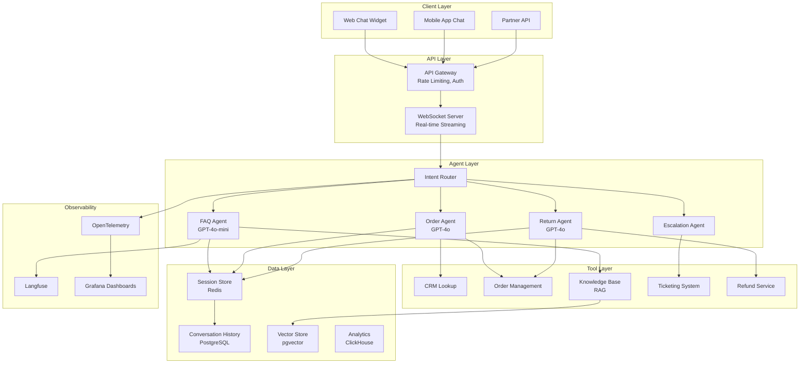
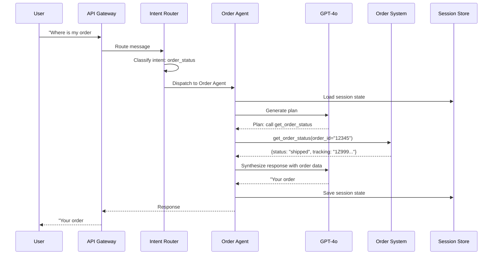
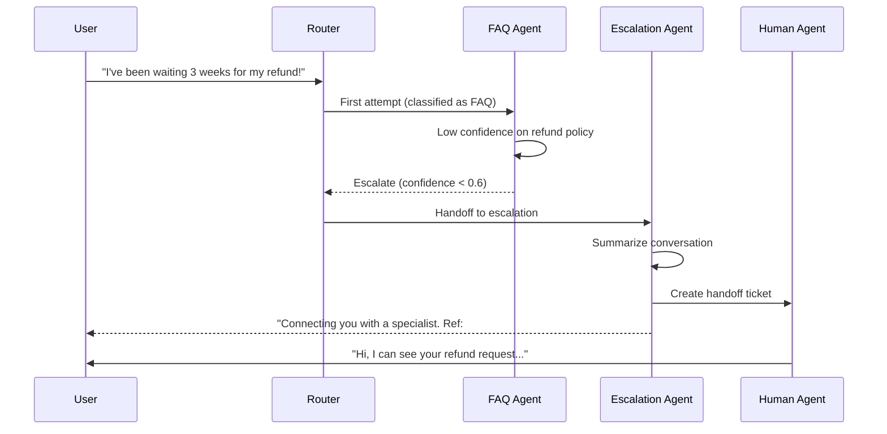

# Customer Support Agent

This design covers a production-grade AI-powered customer support agent that handles customer inquiries via chat, resolves common issues autonomously, and escalates to human agents when necessary. It is a canonical interview problem that tests your ability to combine LLM orchestration, tool integration, cost optimization, and production reliability.

---

## Problem Statement

> Design an AI-powered customer support agent for an e-commerce company. The system should handle customer inquiries through chat (web and mobile), answer questions about products, orders, returns, and account details, perform actions like looking up orders or initiating refunds, and escalate to human agents when the AI cannot resolve the issue. The system must support 5,000 concurrent sessions during peak hours, resolve at least 70% of conversations without human intervention, and keep the cost per conversation under $0.15. The company is SOC 2 and GDPR compliant, and all designs must respect those constraints.

---

## Clarifying Questions to Ask

Before designing, clarify these with the interviewer:

1. **Scale and traffic** -- What are the peak concurrent sessions? Is there seasonal variance (e.g., Black Friday spikes)? What is the expected daily conversation volume?
2. **Channels** -- Is this chat-only, or do we need to support voice and email as well? Are web and mobile the only entry points, or do we also serve partner APIs?
3. **Integration surface** -- What backend systems already exist? Do we have APIs for the order management system, CRM, and ticketing system, or do we need to build connectors?
4. **Scope of autonomous actions** -- Which actions can the agent perform directly (e.g., issue refunds, cancel orders) and which require human approval? What are the dollar thresholds for autonomous actions?
5. **Compliance requirements** -- What PII handling rules apply? Do we need to mask data in logs? Are there data residency requirements (e.g., EU data stays in EU)?
6. **SLAs and latency** -- What is the acceptable time-to-first-token? What latency is tolerable for tool calls like order lookups? Is there an SLA for escalation response time?

---

## Requirements

### Functional Requirements

1. Handle customer inquiries via chat (web and mobile)
2. Answer questions about products, orders, returns, and account details
3. Perform actions: look up orders, initiate returns, create support tickets, issue refunds
4. Escalate to human agents when the AI cannot resolve the issue
5. Support multi-turn conversations with context retention
6. Provide consistent responses aligned with company policies

### Non-Functional Requirements

| Requirement | Target |
|-------------|--------|
| Latency (first response) | < 3 seconds |
| Latency (subsequent turns) | < 2 seconds |
| Availability | 99.9% uptime |
| Concurrent sessions | 5,000 |
| Resolution rate (no human) | > 70% |
| Cost per conversation | < $0.15 |
| Security | PII masking, SOC 2, GDPR compliance |

### Out of Scope

- Voice support (chat only for this design)
- Proactive outreach (reactive only)
- Multi-language (English only for V1)

---

## High-Level Architecture

### Architecture Walkthrough

The architecture follows a layered design that separates concerns and enables independent scaling of each tier.

The **Client Layer** accepts requests from web chat widgets, mobile app chat, and partner APIs. All traffic funnels through the **API Layer**, where an API Gateway handles authentication, rate limiting, and tenant identification, and a WebSocket server provides real-time streaming for token-by-token response delivery.

The **Agent Layer** is the core of the system. An Intent Router classifies each incoming message and dispatches it to the appropriate specialist agent -- FAQ, Order, Return, or Escalation. Each agent is purpose-built for its domain: the FAQ Agent uses RAG over a knowledge base for informational queries, the Order and Return Agents have tool access to the CRM and order management system for transactional queries, and the Escalation Agent handles handoffs to human support. This specialization allows each agent to use the optimal model for its task (cheap models for FAQ, more capable models for order actions), which is the primary cost optimization lever.

The **Tool Layer** exposes backend systems as callable tools -- CRM lookups, order management, knowledge base retrieval, ticketing, and refund processing. The **Data Layer** stores session state in Redis for fast access, persists conversation history in PostgreSQL, indexes knowledge base articles in pgvector, and streams analytics events to ClickHouse. The **Observability** stack (OpenTelemetry, Langfuse, Grafana) provides end-to-end tracing, LLM-specific metrics, and operational dashboards.

---

## Component Design

### 1. Intent Router

The Intent Router is the entry point for every customer message. Its job is to classify the user's intent and dispatch to the correct specialist agent. It exists as a separate component for one critical reason: **cost optimization**. Without a router, every message would go to the most capable (and most expensive) model. With routing, simple FAQ questions (60% of traffic) go to GPT-4o-mini at $0.15/1M input tokens, while only complex order and return issues go to GPT-4o at $2.50/1M input tokens.

The router uses GPT-4o-mini for classification itself -- it is a lightweight, fast classification task that does not need a large model. It maintains a mapping of intents to agent configurations:

| Intent | Agent | Model | Priority |
|--------|-------|-------|----------|
| FAQ / general question | FAQ Agent | GPT-4o-mini | Low |
| Order status | Order Agent | GPT-4o | Normal |
| Return request | Return Agent | GPT-4o | Normal |
| Billing issue | Order Agent | GPT-4o | High |
| Complaint / request for human | Escalation Agent | GPT-4o | High |
| Unknown | FAQ Agent | GPT-4o-mini | Normal |

The router also includes a hard-coded override: if the user explicitly asks for a human agent (detected via keyword matching, not LLM), the message is routed directly to the Escalation Agent regardless of classified intent. This ensures customers are never trapped in an AI loop when they want human help.

The classification uses the last 4 messages of conversation history (not just the current message) to handle context-dependent intents. For example, if a customer has been asking about an order and then says "this is unacceptable," the router sees the order context and routes to Escalation rather than FAQ.

### 2. FAQ Agent (RAG-Based)

The FAQ Agent handles product questions, policy inquiries, and general information -- roughly 60% of all conversations. It uses Retrieval-Augmented Generation (RAG) over the company knowledge base.

**Retrieval strategy**: When a message arrives, the agent embeds the query and retrieves the top 5 relevant articles from the pgvector store, filtering to only published articles. The retrieved documents are injected into the system prompt as context, and the LLM generates a response grounded in those documents.

**Model and temperature**: The agent uses GPT-4o-mini with a temperature of 0.1. The low temperature ensures consistent, factual responses -- customer support answers should not vary creatively between sessions. GPT-4o-mini is sufficient because FAQ responses are largely extractive (pulling answers from retrieved documents rather than reasoning over complex scenarios).

**Confidence thresholds and escalation**: The agent evaluates confidence in its response. If confidence falls below 0.6, the agent does not attempt an answer. Instead, it returns an escalation signal with the reason "low_confidence" and the confidence score. This prevents the agent from confidently delivering wrong answers, which erodes customer trust faster than admitting it cannot help. The threshold of 0.6 is tuned based on production data -- too high and you escalate too many routine questions; too low and you deliver unreliable answers.

### 3. Order Agent

The Order Agent handles order lookups, status checks, and modifications. Unlike the FAQ Agent, it needs to take actions -- looking up real data and creating real tickets -- which makes it more complex and requires a more capable model (GPT-4o).

**Tool access**: The agent has access to three tools:

| Tool | Purpose | Required Parameters |
|------|---------|-------------------|
| `lookup_order` | Find an order by order ID or customer email | `order_id` (optional), `email` (optional) |
| `get_order_status` | Get current status and tracking info | `order_id` (required) |
| `create_support_ticket` | Create a ticket for issues needing manual review | `subject`, `description`, `priority` |

**CRM integration**: The agent first loads session state from Redis to understand the customer context (authenticated user, previous messages). It then sends the message and conversation history to the LLM, which generates a plan -- typically a tool call sequence. For example, for "Where is my order #12345?", the LLM plans to call `get_order_status`, receives the order data (status, tracking number, carrier), and synthesizes a natural-language response.

**Why GPT-4o instead of GPT-4o-mini**: The Order Agent needs to reason about when to call which tool, interpret structured API responses, and compose responses that combine data from multiple sources. GPT-4o-mini's smaller capacity leads to more frequent tool-calling errors and hallucinated order data in testing. The cost difference is justified by the higher accuracy requirement for transactional queries.

### 4. Escalation Agent

The Escalation Agent manages the handoff from AI to human support. Its design goal is to make the handoff as smooth as possible -- the human agent should have full context without needing to ask the customer to repeat themselves.

**Conversation summarization**: When escalation is triggered, the agent uses GPT-4o-mini to generate a structured summary of the conversation. The summary includes: the customer's core issue, what steps the AI already took (tool calls, information retrieved), relevant order or account information discovered during the conversation, and the reason for escalation (low confidence, customer request, policy constraint).

**Handoff protocol**: The agent creates a handoff ticket in the ticketing system with the session ID, customer ID, conversation summary, full conversation history, priority level, and escalation reason. Priority is determined by signals in the conversation -- mentions of legal action, repeated frustration, high-value orders, or billing disputes increase priority.

**Ticket creation and customer communication**: The agent gives the customer a reference number and a message acknowledging the handoff. This is important for customer experience -- the customer knows their issue is not being dropped.

| Escalation Trigger | Priority Assignment |
|--------------------|-------------------|
| Customer explicitly requests human | Normal |
| Low confidence on FAQ response | Normal |
| Billing dispute over threshold | High |
| Repeated failed resolution attempts | High |
| Mention of legal action or regulatory complaint | Critical |

---

## Data Flow

### Happy Path: Order Status Inquiry

### Happy Path Walkthrough

The user sends "Where is my order #12345?" through the web chat widget. The API Gateway authenticates the request and forwards it to the Intent Router. The router classifies the intent as `order_status` using GPT-4o-mini (a lightweight classification call costing fractions of a cent) and dispatches to the Order Agent.

The Order Agent loads the session state from Redis to check for any prior context (is this a returning customer? have they already asked about this order?). It sends the message and conversation history to GPT-4o, which generates a plan: call the `get_order_status` tool with `order_id="12345"`.

The agent executes the tool call against the Order Management System, which returns structured data: the order is shipped, the tracking number is "1Z999...", and the carrier is UPS. The agent sends this data back to GPT-4o to synthesize a natural-language response: "Your order #12345 was shipped on June 8 and is currently in transit. Your tracking number is 1Z999..."

The agent saves the updated session state (including this turn) to Redis and returns the response through the API Gateway to the user. Total latency: under 3 seconds. Total cost: approximately $0.015.

### Escalation Path

### Escalation Path Walkthrough

The user sends "I've been waiting 3 weeks for my refund!" The Intent Router classifies this as an FAQ-type query (refund policy) and dispatches to the FAQ Agent. The FAQ Agent retrieves relevant knowledge base articles about refund timelines, but the retrieved documents cover standard refund policy (5-7 business days) -- they do not address a 3-week delay, which is an exception case.

The agent's confidence score drops below 0.6 because the retrieved documents do not directly address the user's specific complaint. Rather than generating a generic refund policy response (which would frustrate an already upset customer), the FAQ Agent returns an escalation signal.

The Router receives the escalation signal and hands off to the Escalation Agent. The Escalation Agent summarizes the conversation (customer issue: refund delayed beyond normal timeline, no resolution found in knowledge base), creates a handoff ticket in the ticketing system with high priority (billing-related, customer frustration signals), and responds to the user with a reference number. The human agent picks up the ticket and sees the full context -- they know the customer has been waiting 3 weeks and that the AI could not resolve it, so they can skip the initial diagnostic questions and go straight to investigating the delayed refund.

---

## Scaling Considerations

### Traffic Patterns

| Time | Traffic Level | Strategy |
|------|--------------|----------|
| Business hours (9 AM - 6 PM) | Peak: 5,000 concurrent | Full scaling |
| Evening (6 PM - 11 PM) | Moderate: 2,000 concurrent | Moderate scaling |
| Night (11 PM - 9 AM) | Low: 500 concurrent | Minimum scaling |
| Sale events (Black Friday) | Spike: 20,000 concurrent | Pre-scaled + auto-scale |

### Auto-Scaling Strategy

The agent workers scale horizontally based on queue depth, targeting 10 concurrent sessions per worker. Minimum replicas are set to 5 (to handle low overnight traffic without cold starts), maximum at 100 (for Black Friday spikes). Scale-up cooldown is 30 seconds (react fast to spikes) while scale-down cooldown is 300 seconds (avoid flapping).

The Redis session store runs in cluster mode with 3 shards and 2 replicas per shard, providing both read throughput and fault tolerance. Sessions have a TTL to prevent unbounded memory growth.

LLM API calls are distributed across multiple providers (OpenAI primary, Azure OpenAI fallback) with a combined rate limit of 10,000+ requests per minute and automatic failover.

### Bottleneck Analysis

| Component | Bottleneck | Mitigation |
|-----------|-----------|------------|
| LLM API | Rate limits (TPM/RPM) | Multiple API keys, multiple providers, request queuing |
| WebSocket server | Connection count | Horizontal scaling, connection pooling |
| Redis | Memory for sessions | Cluster mode, TTL on sessions, tiered storage |
| Knowledge base (vector search) | Query latency under load | Read replicas, result caching |
| Order management API | Rate limits from upstream | Cache recent orders, batch queries |

### Semantic Caching

For high-traffic deployments, semantic caching can dramatically reduce LLM costs. Before making a new LLM call, the system embeds the incoming query and checks similarity against recent queries in a cache. If a cached query has a cosine similarity above 0.95, the cached response is returned directly without an LLM call. This is particularly effective for the FAQ Agent, where many customers ask semantically identical questions ("where is my order" vs. "order status" vs. "track my package"). At 50,000 daily conversations with 60% FAQ traffic, even a 30% cache hit rate saves roughly 9,000 LLM calls per day.

### LLM Provider Abstraction and Circuit Breakers

Rather than coupling directly to a single LLM provider, the system uses an **LLM Gateway** -- an internal abstraction layer that routes requests to different providers (OpenAI, Azure OpenAI, Anthropic) based on configuration, cost, and availability.

Each provider connection has its own **circuit breaker**. When a provider's error rate exceeds a threshold (e.g., 5 errors in 30 seconds), the circuit breaker trips and routes all traffic to the fallback provider. The circuit breaker enters a half-open state after a cooldown period, allowing a small percentage of test requests through to detect recovery. This prevents cascading failures during provider outages -- without circuit breakers, retries against a down provider would exhaust rate limits and increase latency for all customers.

The LLM Gateway also enables transparent model upgrades, A/B testing between providers, and per-model cost tracking.

### Multi-Tenant Considerations

If this system evolves into a platform serving multiple enterprise tenants (each with their own knowledge base, tools, and brand voice), two isolation strategies become critical:

- **Vector store isolation**: Use namespace-based isolation within the vector store rather than separate instances per tenant. Each tenant's knowledge base documents are indexed under a tenant-specific namespace. Queries are scoped to the tenant's namespace, preventing cross-tenant data leakage. Separate instances per tenant do not scale past a few hundred tenants.
- **Database isolation**: Use row-level security in PostgreSQL for tenant configuration and conversation history. Every row carries a `tenant_id`, and database policies enforce that queries can only access rows matching the authenticated tenant. This provides strong isolation without the operational overhead of separate databases per tenant.

---

## Cost Analysis

### Per-Conversation Cost Breakdown

| Component | Tokens/Calls | Unit Cost | Cost per Conversation |
|-----------|-------------|-----------|----------------------|
| Intent classification | 200 tokens (mini) | $0.15/1M | $0.00003 |
| FAQ response (3 turns) | 3,000 tokens (mini) | $0.15/1M in, $0.60/1M out | $0.0008 |
| Order lookup (3 turns) | 4,500 tokens (4o) | $2.50/1M in, $10/1M out | $0.015 |
| RAG retrieval | 3 queries | $0.001/query | $0.003 |
| Redis session | 1 session | ~$0 | negligible |
| **Total (FAQ path)** | | | **$0.004** |
| **Total (order path)** | | | **$0.018** |
| **Blended average** | 60% FAQ, 40% order | | **$0.010** |

:::tip
The blended cost per conversation ($0.01) is well under the $0.15 budget. This headroom allows for longer conversations, retries, and the occasional expensive escalation path without exceeding budget.
:::

### Monthly Cost at Scale

| Metric | Value |
|--------|-------|
| Daily conversations | 50,000 |
| Monthly conversations | 1,500,000 |
| Blended cost per conversation | $0.010 |
| **Monthly LLM cost** | **$15,000** |
| Infrastructure (Redis, compute, networking) | $3,000 |
| Observability (Langfuse, Grafana) | $500 |
| **Total monthly cost** | **$18,500** |

---

## Failure Modes and Mitigations

| Failure | Impact | Mitigation |
|---------|--------|------------|
| Primary LLM down | No AI responses | Fallback to Azure OpenAI; circuit breaker |
| Redis down | Session loss | Redis Cluster with replicas; fall back to stateless mode |
| Order API down | Cannot look up orders | Return cached data if available; apologize and create ticket |
| Vector store slow | Slow FAQ responses | Cache top-100 FAQ answers; serve from cache on timeout |
| Prompt injection | Unauthorized actions | Input filtering, tool sandboxing, least privilege |

---

## Trade-offs & Alternatives

| Decision | Rationale | Alternative | Why Not |
|----------|-----------|-------------|---------|
| Specialized agents per intent | Each agent uses the optimal model and tools for its domain; enables independent iteration and cost control | Single general-purpose agent handling all intents | Higher cost (every query hits the expensive model), harder to tune prompts (one prompt tries to cover FAQ, orders, returns), and tool sprawl in a single agent's context window |
| GPT-4o-mini for FAQ, GPT-4o for orders | 10x cost difference between models; FAQ is extractive and does not need complex reasoning | Use GPT-4o for everything | Blended cost jumps from $0.01 to $0.04+ per conversation; at 1.5M monthly conversations, that is $45K+ extra per month with no quality improvement on FAQ responses |
| pgvector for knowledge base | Runs inside existing PostgreSQL infrastructure; no additional managed service; sufficient for knowledge bases under 1M documents | Dedicated vector database (Pinecone, Qdrant) | Adds operational complexity and cost; pgvector handles the expected scale; migrate to a dedicated solution if vector search latency becomes a bottleneck |
| Redis for session state | Sub-millisecond reads; built-in TTL for session expiration; cluster mode for fault tolerance | Store sessions in PostgreSQL | Adds 5-10ms per read to every turn of every conversation; at 5,000 concurrent sessions, this latency compounds |
| Confidence-based escalation (threshold 0.6) | Prevents low-quality AI responses from reaching customers; preserves trust | Always attempt an answer regardless of confidence | Low-confidence answers are often wrong; incorrect answers from the AI are harder to recover from than a prompt escalation |
| LLM Gateway with circuit breakers | Provider-agnostic; enables failover, A/B testing, and cost optimization across providers | Direct integration with a single LLM provider | Single point of failure; no fallback during outages; vendor lock-in on pricing and availability |
| Namespace-based vector store isolation (multi-tenant) | Scales to thousands of tenants without operational overhead of separate instances | Separate vector store instance per tenant | Does not scale past a few hundred tenants; massive infrastructure overhead; most tenants have small knowledge bases that do not justify dedicated resources |

---

## Interview Tips

:::tip How to Present This (35 minutes)
- **Minutes 1-5**: Clarify requirements and state assumptions. Ask about scale, channels, integration surface, compliance. Explicitly state what is out of scope (voice, multi-language). This shows maturity -- juniors skip straight to architecture.
- **Minutes 5-15**: Draw the high-level architecture diagram. Walk through each layer: client, API, agent, tool, data, observability. Explain the Intent Router as the key architectural decision -- it is the cost optimization lever that makes the system economically viable.
- **Minutes 15-25**: Deep dive into 2-3 components. Pick the Intent Router (explain the model tiering strategy), the FAQ Agent (explain RAG, confidence thresholds, escalation logic), and the Escalation Agent (explain conversation summarization and handoff protocol). Use the sequence diagrams to walk through a happy path and an escalation path.
- **Minutes 25-30**: Discuss scaling (traffic patterns, auto-scaling, semantic caching, circuit breakers), cost analysis (per-conversation breakdown, monthly projection), and failure modes. Mention multi-tenant considerations if relevant to the interviewer's company.
- **Minutes 30-35**: Handle follow-up questions. Common ones: "How would you add voice support?" (separate ASR/TTS layer, same agent backend), "How do you prevent prompt injection?" (input filtering, tool sandboxing, least privilege on tool access), "How would you evaluate agent quality?" (Langfuse traces, human evaluation of sampled conversations, A/B testing prompt changes).
:::
