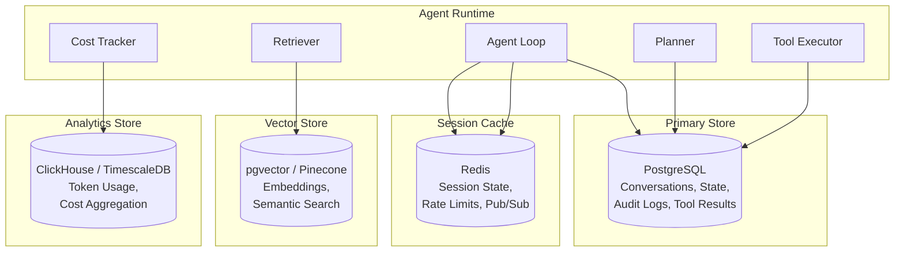
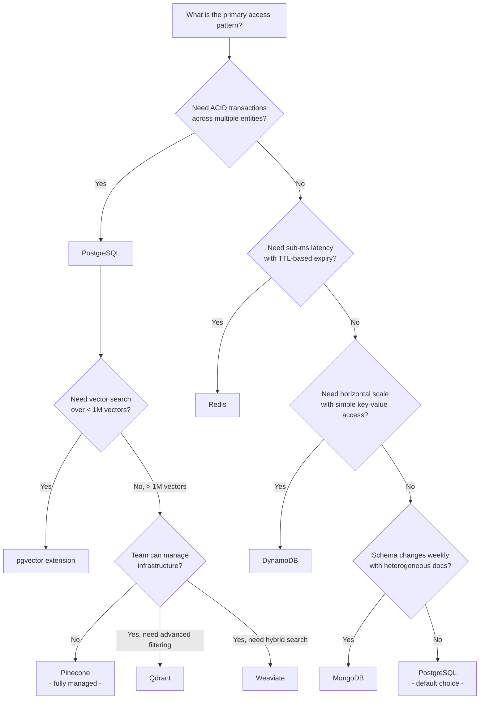

# Data Layer Design

The data layer of an agentic AI system is not a single database -- it is a polyglot persistence architecture where each store is chosen for a specific access pattern. Conversation history requires append-heavy writes with paginated reads. Session state demands sub-millisecond latency with automatic expiration. Semantic memory needs approximate nearest neighbor search across high-dimensional vectors. Cost tracking requires time-series aggregation. No single database excels at all of these, and choosing the wrong store for a given workload creates performance cliffs that are expensive to fix after launch.

This document covers the decision framework for selecting databases, the schema designs that make those databases efficient for agentic workloads, and the query patterns that keep latency predictable at scale.

---

## 1. Database Selection Framework

### The Polyglot Persistence Model

Agentic systems interact with data in fundamentally different ways depending on the component. The planner reads conversation history sequentially. The retriever performs similarity search over embeddings. The cost tracker aggregates token counts across time ranges. The session manager reads and writes ephemeral state at high frequency. Forcing all of these access patterns into a single database leads to either poor performance or contorted schema design.



### Why PostgreSQL Is the Default for Agentic Systems

PostgreSQL is the gravitational center of most agentic data layers. This is not because it is the best at any single thing, but because it is good enough at almost everything, and operational simplicity compounds.

**ACID guarantees matter for agent state.** When an agent checkpoints its state after completing step 3 of a 7-step plan, that checkpoint must be durable. If the process crashes and the checkpoint was only partially written, the agent either re-executes an already-completed step (wasting tokens and money) or skips a step (producing incorrect results). PostgreSQL's transactional writes eliminate this class of bug entirely.

**JSONB handles semi-structured data without schema migration.** Tool results are heterogeneous -- a web search returns `{results: [...]}`, a code execution returns `{stdout, stderr, exit_code}`, a database query returns `{columns, rows}`. Storing these in a JSONB column avoids the need for a separate table per tool type, while still allowing indexed queries on specific JSON paths.

**pgvector provides vector search without another service.** For teams with fewer than 1 million vectors, pgvector eliminates the operational burden of a separate vector database. The embeddings live alongside the metadata they describe, queries can join vector similarity with relational filters in a single SQL statement, and there is one fewer service to monitor, back up, and scale.

**Row-level security enables multi-tenancy.** In a SaaS agentic platform, tenant isolation is a hard requirement. PostgreSQL's RLS policies enforce tenant boundaries at the database level, making it impossible for application-layer bugs to leak data across tenants.

```sql
-- Enable RLS on the conversations table
ALTER TABLE conversations ENABLE ROW LEVEL SECURITY;

-- Tenants can only see their own data
CREATE POLICY tenant_isolation ON conversations
    USING (tenant_id = current_setting('app.current_tenant')::UUID);

-- Application sets the tenant context on each connection
SET app.current_tenant = 'tenant-uuid-here';
```

### When to Choose MongoDB

MongoDB is the right choice when the data model is genuinely schema-flexible and will remain so. This is less common than teams assume -- most "flexible" schemas stabilize within a few months -- but there are legitimate cases in agentic systems.

**Heterogeneous agent outputs.** If your system runs dozens of different agent types, each producing structurally different outputs (research reports, code diffs, data analysis results, image descriptions), and you need to store and query all of them in a single collection, MongoDB's document model avoids the JSONB-in-PostgreSQL pattern where every query requires `->` and `->>` operators.

**Rapid prototyping with uncertain data models.** In the first 90 days of building an agentic system, the schema changes weekly. MongoDB's schemaless writes reduce the friction of iteration. The trade-off is that you accumulate schema debt -- documents from week 1 look nothing like documents from week 12, and your application code must handle both.

**When NOT to choose MongoDB.** If you need transactional writes across multiple collections (agent state + conversation history + tool results in one atomic operation), MongoDB's multi-document transactions add complexity and latency. If you need vector search, MongoDB Atlas Vector Search exists but lags behind pgvector and dedicated vector databases in performance and feature set.

### When to Choose DynamoDB

DynamoDB is the right choice when you need predictable single-digit-millisecond latency at any scale, and your access patterns are known and fixed.

**Session state at massive scale.** A system handling 100K concurrent agent sessions needs a key-value store that scales horizontally without capacity planning. DynamoDB's on-demand mode auto-scales to any throughput, and its single-digit-ms reads on the partition key make it ideal for session lookups.

**The constraint is query flexibility.** DynamoDB's query model is limited to partition key + sort key. If you need ad-hoc queries (find all sessions where the agent used tool X, or search conversation history by keyword), you need a Global Secondary Index for each access pattern, and GSIs have their own throughput limits. If your queries are unpredictable, DynamoDB is the wrong choice.

```python
# DynamoDB session state -- access pattern is always by session_id
import boto3

dynamodb = boto3.resource("dynamodb")
table = dynamodb.Table("agent_sessions")

# Write: single-digit-ms latency regardless of table size
table.put_item(Item={
    "session_id": "sess-abc-123",
    "user_id": "user-456",
    "state": {"current_step": 3, "plan": [...]},
    "version": 5,
    "ttl": int(time.time()) + 3600,  # DynamoDB TTL auto-deletes
})

# Read: partition key lookup, always fast
response = table.get_item(Key={"session_id": "sess-abc-123"})
session = response["Item"]
```

### Redis for Session State

Redis serves two distinct roles in agentic systems, and conflating them causes production incidents.

**Redis as a cache** is straightforward: store session state with a TTL, accept that data may be evicted under memory pressure, and always be able to reconstruct state from the durable store. This is the correct pattern for short-lived chat sessions where losing state means the user restarts the conversation.

**Redis as a primary store** requires persistence (RDB snapshots + AOF logs), replication, and careful memory management. If Redis is the only copy of session state and it restarts without persistence, every active session is lost. This is acceptable only if session loss is a minor inconvenience, not a data loss event.

```python
import redis.asyncio as redis

class RedisSessionManager:
    def __init__(self, redis_url: str, default_ttl: int = 3600):
        self.client = redis.from_url(redis_url)
        self.default_ttl = default_ttl

    async def save_session(self, session_id: str, state: dict, ttl: int = None):
        """Save with TTL -- session auto-expires if the user abandons it."""
        await self.client.setex(
            f"session:{session_id}",
            ttl or self.default_ttl,
            json.dumps(state),
        )

    async def load_session(self, session_id: str) -> dict | None:
        data = await self.client.get(f"session:{session_id}")
        return json.loads(data) if data else None

    async def extend_session(self, session_id: str, seconds: int):
        """Extend TTL when user is active -- prevents mid-conversation expiry."""
        await self.client.expire(f"session:{session_id}", seconds)

    async def publish_event(self, channel: str, event: dict):
        """Pub/sub for real-time streaming -- token-by-token output to frontend."""
        await self.client.publish(channel, json.dumps(event))
```

**Redis pub/sub for streaming.** When an agent generates a response token-by-token, the frontend needs real-time updates. Redis pub/sub provides the low-latency channel for this, with the agent worker publishing tokens and the WebSocket server subscribing. This avoids polling and keeps the streaming latency under 10ms.

### Database Comparison Matrix

| Dimension | PostgreSQL | MongoDB | DynamoDB | Redis |
|-----------|-----------|---------|----------|-------|
| **Consistency** | Strong (ACID) | Tunable (eventual to strong) | Strong (per-item) or eventual | Strong (single-instance), eventual (cluster) |
| **Read latency (p50)** | 1-5ms (indexed) | 1-5ms (indexed) | 1-5ms (partition key) | < 1ms |
| **Write latency (p50)** | 2-10ms | 2-10ms | 5-10ms | < 1ms |
| **Horizontal scalability** | Read replicas; write scaling requires sharding (Citus) | Native sharding | Unlimited (on-demand) | Cluster mode, 1000 nodes max |
| **Query flexibility** | Full SQL, joins, CTEs, full-text search | Aggregation pipeline, flexible queries | Partition key + sort key + GSIs | Key-value, sorted sets, limited querying |
| **Schema evolution** | Migrations required (Alembic, Flyway) | Schemaless (application manages) | Schemaless (application manages) | Schemaless |
| **Multi-tenancy** | RLS, schema-per-tenant | Database-per-tenant, field filtering | Partition key prefix | Key prefix |
| **Operational cost** | Moderate (managed: RDS, Aurora) | Moderate (managed: Atlas) | Low (fully managed, pay-per-request) | Low-moderate (managed: ElastiCache) |
| **Vector search** | pgvector extension | Atlas Vector Search | Not supported | Redis Search (limited) |
| **Best for** | Primary data store, audit logs, relational queries | Heterogeneous documents, rapid prototyping | Session state at scale, simple key-value | Session cache, pub/sub, rate limiting |

:::tip Interview Angle
When asked "How would you choose the database for an agentic system?", avoid the trap of picking one database for everything. Explain the polyglot model: PostgreSQL as the primary store for durable, queryable data; Redis for ephemeral session state; a vector store (pgvector or dedicated) for embeddings; and optionally a time-series database for analytics. Then justify each choice with the specific access pattern it serves.
:::

---

## 2. Vector Database Deep Dive

Vector databases are the backbone of retrieval-augmented generation (RAG) in agentic systems. The agent retrieves relevant context by embedding a query and finding the nearest neighbors in a high-dimensional vector space. The choice of vector database affects retrieval latency, recall quality, operational burden, and cost.

### Vector Database Comparison

| Dimension | pgvector | Pinecone | Qdrant | Weaviate | Chroma |
|-----------|---------|----------|--------|----------|--------|
| **Deployment** | Extension on existing PostgreSQL | Fully managed (serverless or pod) | Self-hosted or Qdrant Cloud | Self-hosted or Weaviate Cloud | Local / embedded |
| **Max vectors (practical)** | ~1-5M (performance degrades) | Billions (serverless) | Hundreds of millions | Hundreds of millions | ~1M (not production-grade) |
| **Latency p99 (1M vectors)** | 20-50ms (HNSW) | 10-30ms | 10-30ms | 15-40ms | 20-100ms |
| **Metadata filtering** | SQL WHERE clauses | Native filter expressions | Payload filtering (rich) | GraphQL filters | Basic dictionary filtering |
| **Multi-tenancy** | RLS or schema-per-tenant | Namespace-per-tenant | Collection-per-tenant or payload filter | Multi-tenant classes | Collection-per-tenant |
| **Hybrid search** | Requires manual BM25 + vector fusion | Not built-in (metadata filters only) | Sparse + dense vectors | BM25 + vector built-in | Not supported |
| **Cost model** | Included with PostgreSQL (compute only) | Per-vector storage + per-query | Compute + storage (self-hosted) or per-vector (cloud) | Compute + storage | Free (open source) |
| **Operational burden** | Low (part of existing PostgreSQL) | None (fully managed) | Moderate (self-hosted) to low (cloud) | Moderate (self-hosted) to low (cloud) | Minimal (embedded) |
| **Best for** | < 1M vectors, existing PostgreSQL, simplicity | Large-scale production, no ops team | Advanced filtering, self-hosted requirement | Hybrid search, multi-modal | Development, testing, prototyping |

### pgvector: When Your PostgreSQL Is Enough

pgvector is the right choice when you have fewer than 1-5 million vectors, you already run PostgreSQL, and you want to avoid the operational overhead of a separate vector service.

**HNSW vs IVFFlat indexing.** pgvector supports two index types, and the choice has significant performance implications.

| Parameter | HNSW | IVFFlat |
|-----------|------|---------|
| **Build time** | Slow (hours for 1M vectors) | Fast (minutes for 1M vectors) |
| **Query latency** | Lower (graph traversal) | Higher (scan lists, then refine) |
| **Recall at same speed** | Higher | Lower |
| **Memory usage** | Higher (stores graph edges) | Lower |
| **Updates** | Efficient (insert into graph) | Requires periodic re-indexing |
| **When to use** | Production workloads, query-heavy | Batch indexing, rebuild-friendly workloads |

**HNSW is the default choice** for production agentic systems because agents query the vector store on every retrieval step, and query latency directly impacts response time. IVFFlat is appropriate only when you can tolerate periodic full re-indexes (e.g., a nightly batch job that re-embeds all documents).

```sql
-- Create a table for document chunks with embeddings
CREATE TABLE document_chunks (
    chunk_id        UUID PRIMARY KEY DEFAULT gen_random_uuid(),
    document_id     UUID NOT NULL,
    tenant_id       UUID NOT NULL,
    content         TEXT NOT NULL,
    embedding       vector(1536),        -- OpenAI text-embedding-3-small dimension
    chunk_index     INTEGER NOT NULL,    -- position within the document
    metadata        JSONB DEFAULT '{}',
    source_hash     TEXT NOT NULL,        -- hash of source content for staleness detection
    created_at      TIMESTAMPTZ NOT NULL DEFAULT now(),
    updated_at      TIMESTAMPTZ NOT NULL DEFAULT now()
);

-- HNSW index for fast approximate nearest neighbor search
-- m=16: number of connections per node (higher = better recall, more memory)
-- ef_construction=200: build-time search width (higher = better recall, slower build)
CREATE INDEX idx_chunks_embedding ON document_chunks
    USING hnsw (embedding vector_cosine_ops)
    WITH (m = 16, ef_construction = 200);

-- Tenant-scoped queries: filter by tenant, then vector search
CREATE INDEX idx_chunks_tenant ON document_chunks(tenant_id);

-- Staleness detection: find chunks whose source has changed
CREATE INDEX idx_chunks_document_updated ON document_chunks(document_id, updated_at);
```

**Performance tuning parameters:**

- **`m` (connections per node):** Default 16. Increasing to 32 or 64 improves recall but doubles or quadruples memory. For most agentic RAG workloads, 16 is sufficient because you are retrieving top-5 to top-20 chunks, not doing exhaustive similarity search.
- **`ef_construction` (build-time quality):** Default 64. Set to 200 for production to ensure the graph is well-connected. This is a one-time build cost.
- **`ef_search` (query-time quality):** Set per-query with `SET hnsw.ef_search = 100`. Higher values improve recall at the cost of latency. Start at 100 and tune based on your recall requirements.

```sql
-- Set query-time search quality
SET hnsw.ef_search = 100;

-- Semantic search: find the 10 most similar chunks for a tenant
SELECT chunk_id, content, metadata,
       1 - (embedding <=> $1::vector) AS similarity
FROM document_chunks
WHERE tenant_id = $2
ORDER BY embedding <=> $1::vector
LIMIT 10;
```

:::warning
pgvector performs a full table scan when no index exists or when the query planner decides the index is not selective enough. Always verify with `EXPLAIN ANALYZE` that your vector queries use the HNSW index. If the query filters by tenant_id first and the filtered set is small, PostgreSQL may choose a sequential scan over the vector index -- in which case a composite approach (filter first, then vector search in application code) may be necessary.
:::

### Pinecone: Managed Vector Search at Scale

Pinecone is the right choice when you need vector search at scale (millions to billions of vectors) and your team does not want to manage vector infrastructure. Its serverless pricing model charges per query and per GB stored, which aligns well with agentic workloads that have variable traffic.

**Namespace-based multi-tenancy.** Each tenant gets its own namespace within a single Pinecone index, providing logical isolation without the cost of separate indexes.

```python
from pinecone import Pinecone

pc = Pinecone(api_key="your-api-key")
index = pc.Index("agent-knowledge-base")

# Upsert vectors into a tenant-specific namespace
index.upsert(
    vectors=[
        {
            "id": "chunk-001",
            "values": embedding_vector,  # list[float], dimension must match index
            "metadata": {
                "document_id": "doc-abc",
                "content": "The agent orchestration layer...",
                "source": "architecture-docs",
                "updated_at": "2025-01-15T10:30:00Z",
            },
        }
    ],
    namespace="tenant-xyz",  # tenant isolation
)

# Query with metadata filtering
results = index.query(
    vector=query_embedding,
    top_k=10,
    namespace="tenant-xyz",
    filter={
        "source": {"$eq": "architecture-docs"},
        "updated_at": {"$gte": "2025-01-01T00:00:00Z"},
    },
    include_metadata=True,
)
```

### Qdrant: Self-Hosted with Advanced Filtering

Qdrant is the right choice when you need rich payload filtering, quantization for memory efficiency, and the ability to self-host (for compliance or cost reasons).

**Quantization support.** Qdrant supports scalar and product quantization, reducing memory usage by 4-32x with minimal recall loss. This is critical for agentic systems with large knowledge bases where the vector store would otherwise require expensive high-memory instances.

```python
from qdrant_client import QdrantClient
from qdrant_client.models import Distance, VectorParams, PointStruct

client = QdrantClient(url="http://localhost:6333")

# Create collection with quantization
client.create_collection(
    collection_name="agent_knowledge",
    vectors_config=VectorParams(size=1536, distance=Distance.COSINE),
    quantization_config={
        "scalar": {"type": "int8", "quantile": 0.99, "always_ram": True}
    },
)

# Search with payload filtering -- find chunks from a specific document type
results = client.search(
    collection_name="agent_knowledge",
    query_vector=query_embedding,
    query_filter={
        "must": [
            {"key": "tenant_id", "match": {"value": "tenant-xyz"}},
            {"key": "doc_type", "match": {"value": "technical"}},
        ],
        "must_not": [
            {"key": "is_stale", "match": {"value": True}},
        ],
    },
    limit=10,
)
```

### Weaviate: Built-In Hybrid Search

Weaviate is the right choice when you need hybrid search (BM25 keyword matching + vector semantic search) without implementing the fusion logic yourself. This is valuable for agentic systems where queries mix exact terminology (API names, error codes) with semantic meaning.

```python
import weaviate

client = weaviate.connect_to_local()

# Hybrid search: combines BM25 keyword matching with vector similarity
response = client.collections.get("DocumentChunk").query.hybrid(
    query="how to handle rate limit errors in the orchestration layer",
    alpha=0.5,  # 0 = pure BM25, 1 = pure vector, 0.5 = equal weight
    limit=10,
    filters=weaviate.classes.query.Filter.by_property("tenant_id").equal("tenant-xyz"),
    return_metadata=weaviate.classes.query.MetadataQuery(score=True),
)
```

### Hybrid Search Architecture

Pure vector search fails on exact matches (searching for "HTTP 429" should return documents containing that exact string, not semantically similar documents about "rate limiting"). Pure keyword search (BM25) fails on semantic queries ("how to handle when the API is overwhelmed" should match documents about rate limiting even if they never use the word "overwhelmed"). Production RAG systems combine both.

**Reciprocal Rank Fusion (RRF)** is the standard algorithm for combining ranked lists from different retrieval methods.

```python
def reciprocal_rank_fusion(
    ranked_lists: list[list[str]],
    k: int = 60,
) -> list[tuple[str, float]]:
    """
    Combine multiple ranked lists using Reciprocal Rank Fusion.

    For each document, RRF score = sum(1 / (k + rank_i)) across all lists.
    k=60 is the standard constant from the original paper (Cormack et al., 2009).
    Higher k reduces the influence of high-ranked items.
    """
    scores: dict[str, float] = {}
    for ranked_list in ranked_lists:
        for rank, doc_id in enumerate(ranked_list, start=1):
            scores[doc_id] = scores.get(doc_id, 0.0) + 1.0 / (k + rank)

    return sorted(scores.items(), key=lambda x: x[1], reverse=True)


# Usage: combine BM25 and vector search results
bm25_results = full_text_search(query)        # returns list of doc_ids
vector_results = vector_similarity_search(query)  # returns list of doc_ids

fused = reciprocal_rank_fusion([bm25_results, vector_results])
top_10 = [doc_id for doc_id, score in fused[:10]]
```

### Handling Updates and Deletes in Vector Stores

Updates and deletes in vector stores are a non-trivial problem because HNSW indexes do not support in-place updates. When a document is re-indexed (new content, new embedding), the old vector must be deleted and the new one inserted. This creates three challenges:

1. **Stale reads during re-indexing.** Between deleting the old vector and inserting the new one, queries may miss the document entirely. Solution: insert the new vector first (with a new ID), then delete the old one. Accept brief duplicates over brief gaps.

2. **Orphaned vectors.** If the deletion step fails after the new vector is inserted, you have duplicate vectors for the same content. Solution: use a separate metadata field (`is_current: true/false`) and filter on it during queries. A background job cleans up non-current vectors.

3. **Index fragmentation.** Repeated inserts and deletes in an HNSW index can degrade recall because deleted nodes leave "holes" in the graph. Solution: periodically rebuild the index (pgvector: `REINDEX INDEX idx_chunks_embedding`; Qdrant: triggers optimization automatically).

```python
class VectorStoreUpdater:
    """Atomic-safe document update in a vector store."""

    async def update_document(self, document_id: str, new_chunks: list[dict]):
        # Step 1: Insert new chunks with is_current=True
        new_chunk_ids = []
        for chunk in new_chunks:
            chunk_id = await self.store.upsert(
                id=str(uuid4()),
                vector=chunk["embedding"],
                metadata={**chunk["metadata"], "document_id": document_id, "is_current": True},
            )
            new_chunk_ids.append(chunk_id)

        # Step 2: Mark old chunks as non-current
        old_chunks = await self.store.query_by_metadata(
            {"document_id": document_id, "is_current": True}
        )
        old_chunk_ids = [c.id for c in old_chunks if c.id not in new_chunk_ids]

        for old_id in old_chunk_ids:
            await self.store.update_metadata(old_id, {"is_current": False})

        # Step 3: Background job deletes non-current chunks
        # (runs periodically, not inline)
```

:::info
All vector queries in production should include a filter for `is_current = True` (or equivalent). This ensures that stale and orphaned vectors are never returned to the agent, even if the background cleanup job is behind schedule.
:::

---

## 3. Schema Design Patterns for Agentic Systems

Every schema below is PostgreSQL. Each column and index exists for a specific reason documented inline. These schemas are designed for a multi-tenant SaaS platform running agentic AI workloads.

### 3.1 Conversation History Schema

```sql
-- Conversations group messages into logical sessions.
-- A user may have many conversations; each conversation belongs to one tenant.
CREATE TABLE conversations (
    conversation_id   UUID PRIMARY KEY DEFAULT gen_random_uuid(),
    tenant_id         UUID NOT NULL,          -- multi-tenancy: RLS filters on this
    user_id           UUID NOT NULL,          -- the human user who initiated the conversation
    agent_type        TEXT NOT NULL,          -- "research", "code_assistant", "support"
    title             TEXT,                    -- auto-generated or user-provided title
    status            TEXT NOT NULL DEFAULT 'active'
                      CHECK (status IN ('active', 'completed', 'archived', 'failed')),
    metadata          JSONB DEFAULT '{}',     -- arbitrary key-value pairs (tags, source, etc.)
    created_at        TIMESTAMPTZ NOT NULL DEFAULT now(),
    updated_at        TIMESTAMPTZ NOT NULL DEFAULT now(),
    archived_at       TIMESTAMPTZ             -- NULL until archived; enables partition pruning
);

-- Most common query: "show me all conversations for this user, newest first"
CREATE INDEX idx_conversations_user_created
    ON conversations(tenant_id, user_id, created_at DESC);

-- Filter active conversations for cleanup jobs
CREATE INDEX idx_conversations_status
    ON conversations(status) WHERE status = 'active';


-- Messages are the individual turns within a conversation.
-- This table is append-heavy: messages are inserted but almost never updated.
CREATE TABLE messages (
    message_id        UUID PRIMARY KEY DEFAULT gen_random_uuid(),
    conversation_id   UUID NOT NULL REFERENCES conversations(conversation_id),
    tenant_id         UUID NOT NULL,          -- denormalized for RLS (avoids join to conversations)
    role              TEXT NOT NULL CHECK (role IN ('user', 'assistant', 'system', 'tool')),
    content           TEXT,                    -- NULL for tool-result messages with only structured data
    tool_calls        JSONB,                  -- LLM-generated tool call requests
    tool_results      JSONB,                  -- tool execution results (heterogeneous structure)
    token_count       INTEGER,                -- tokens consumed by this message
    model             TEXT,                    -- "gpt-4o", "claude-sonnet-4-20250514", etc.
    latency_ms        INTEGER,                -- LLM response time for assistant messages
    created_at        TIMESTAMPTZ NOT NULL DEFAULT now(),

    -- Full-text search vector, auto-maintained by trigger
    search_vector     tsvector GENERATED ALWAYS AS (
                          to_tsvector('english', coalesce(content, ''))
                      ) STORED
);

-- Primary query: paginated history retrieval for a conversation, most recent first.
-- Compound index on (conversation_id, created_at DESC) enables cursor-based pagination
-- without sorting at query time.
CREATE INDEX idx_messages_conversation_created
    ON messages(conversation_id, created_at DESC);

-- RLS enforcement: every query filters by tenant_id
CREATE INDEX idx_messages_tenant
    ON messages(tenant_id);

-- Full-text search across conversation content
CREATE INDEX idx_messages_search ON messages USING GIN (search_vector);
```

**Why `tenant_id` is denormalized on `messages`.** Without denormalization, every query on `messages` would need to join to `conversations` to apply the RLS policy on `tenant_id`. Since `messages` is the highest-volume table in the system, this join is expensive. Denormalizing `tenant_id` allows the RLS policy to filter directly on `messages` without a join.

**Why `tool_results` is JSONB.** Each tool returns a different structure. A web search returns `{"results": [{"title": "...", "url": "...", "snippet": "..."}]}`. A code execution returns `{"stdout": "...", "stderr": "...", "exit_code": 0}`. A SQL query returns `{"columns": [...], "rows": [...]}`. JSONB accommodates all of these without schema changes, and GIN indexes on specific paths (e.g., `CREATE INDEX ON messages USING GIN ((tool_results->'error'))`) enable targeted queries when needed.

**Why the `search_vector` is a generated column.** Using a generated column (PostgreSQL 12+) ensures the tsvector is always in sync with the content, without requiring application-level code or triggers. This is simpler and less error-prone than maintaining a separate trigger.

### 3.2 Agent State Machine Schema

```sql
-- Agent sessions track the lifecycle of an agent execution from start to finish.
-- Each session is a state machine: pending -> running -> completed/failed/cancelled.
CREATE TABLE agent_sessions (
    session_id        UUID PRIMARY KEY DEFAULT gen_random_uuid(),
    conversation_id   UUID REFERENCES conversations(conversation_id),
    tenant_id         UUID NOT NULL,
    agent_type        TEXT NOT NULL,
    status            TEXT NOT NULL DEFAULT 'pending'
                      CHECK (status IN ('pending', 'running', 'completed', 'failed',
                                        'cancelled', 'timed_out')),
    current_step      INTEGER NOT NULL DEFAULT 0,
    total_steps       INTEGER,                -- NULL until plan is generated
    plan              JSONB,                  -- the agent's planned steps
    final_result      JSONB,                  -- the agent's final output
    error             JSONB,                  -- error details if status = 'failed'
    version           INTEGER NOT NULL DEFAULT 0,  -- optimistic concurrency control
    accumulated_cost  NUMERIC(10, 6) DEFAULT 0,    -- running cost in USD
    total_tokens      INTEGER DEFAULT 0,
    timeout_at        TIMESTAMPTZ,            -- hard deadline for the session
    created_at        TIMESTAMPTZ NOT NULL DEFAULT now(),
    updated_at        TIMESTAMPTZ NOT NULL DEFAULT now(),
    completed_at      TIMESTAMPTZ
);

-- Find active sessions for a user (monitoring dashboard)
CREATE INDEX idx_sessions_tenant_status
    ON agent_sessions(tenant_id, status, created_at DESC);

-- Timeout enforcement: background job queries sessions past their deadline
CREATE INDEX idx_sessions_timeout
    ON agent_sessions(timeout_at)
    WHERE status = 'running' AND timeout_at IS NOT NULL;


-- Agent steps record individual actions within a session.
-- Each step has its own state, enabling granular recovery.
CREATE TABLE agent_steps (
    step_id           UUID PRIMARY KEY DEFAULT gen_random_uuid(),
    session_id        UUID NOT NULL REFERENCES agent_sessions(session_id),
    tenant_id         UUID NOT NULL,
    step_index        INTEGER NOT NULL,       -- 0-based step position
    step_type         TEXT NOT NULL            -- "plan", "tool_call", "llm_call", "synthesize"
                      CHECK (step_type IN ('plan', 'tool_call', 'llm_call',
                                           'synthesize', 'human_review', 'checkpoint')),
    status            TEXT NOT NULL DEFAULT 'pending'
                      CHECK (status IN ('pending', 'running', 'completed',
                                        'failed', 'skipped', 'retried')),
    input_data        JSONB,                  -- input to this step
    output_data       JSONB,                  -- output of this step
    error_data        JSONB,                  -- error details if step failed
    retry_count       INTEGER NOT NULL DEFAULT 0,
    latency_ms        INTEGER,
    token_count       INTEGER,
    cost              NUMERIC(10, 6),
    created_at        TIMESTAMPTZ NOT NULL DEFAULT now(),
    completed_at      TIMESTAMPTZ,

    UNIQUE (session_id, step_index)           -- enforce step ordering
);

-- Primary query: load all steps for a session in order (checkpoint recovery)
CREATE INDEX idx_steps_session_index
    ON agent_steps(session_id, step_index);
```

**Optimistic concurrency control with `version`.** When multiple workers might update the same session (e.g., a timeout monitor and the agent worker), the `version` column prevents lost updates. The update query includes `WHERE version = expected_version`, and the application retries on conflict.

```sql
-- Optimistic concurrency: update only if version matches
UPDATE agent_sessions
SET current_step = $1,
    status = $2,
    version = version + 1,
    updated_at = now()
WHERE session_id = $3
  AND version = $4
RETURNING version;

-- If RETURNING returns no rows, the version was stale -- retry with fresh data.
```

**Why `UNIQUE (session_id, step_index)`.** This constraint ensures that step indices are unique within a session, preventing duplicate steps from being recorded during retry logic. It also provides an implicit index that makes the "load all steps for a session in order" query efficient.

### 3.3 Tool Execution Log Schema

```sql
-- Tool executions record every tool call made by any agent.
-- This table serves dual purposes: operational debugging and idempotency checks.
CREATE TABLE tool_executions (
    execution_id      UUID PRIMARY KEY DEFAULT gen_random_uuid(),
    session_id        UUID NOT NULL REFERENCES agent_sessions(session_id),
    step_id           UUID REFERENCES agent_steps(step_id),
    tenant_id         UUID NOT NULL,
    tool_name         TEXT NOT NULL,           -- "web_search", "code_execute", "sql_query"
    tool_version      TEXT,                    -- "1.2.3" -- which version of the tool ran
    idempotency_key   TEXT NOT NULL,           -- hash of (tool_name + canonical_params)
    parameters        JSONB NOT NULL,          -- input parameters to the tool
    result            JSONB,                   -- tool output (NULL if still running)
    error             JSONB,                   -- error details if tool failed
    status            TEXT NOT NULL DEFAULT 'pending'
                      CHECK (status IN ('pending', 'running', 'completed', 'failed', 'timed_out')),
    latency_ms        INTEGER,
    retry_count       INTEGER NOT NULL DEFAULT 0,
    created_at        TIMESTAMPTZ NOT NULL DEFAULT now(),
    completed_at      TIMESTAMPTZ
);

-- Idempotency check: before executing a tool, check if an identical call already succeeded.
-- UNIQUE constraint ensures no duplicate idempotency keys within a session.
CREATE UNIQUE INDEX idx_tool_executions_idempotency
    ON tool_executions(session_id, idempotency_key)
    WHERE status = 'completed';

-- Operational dashboard: tool performance by name
CREATE INDEX idx_tool_executions_tool_name
    ON tool_executions(tool_name, created_at DESC);

-- Find failed tool executions for alerting
CREATE INDEX idx_tool_executions_failed
    ON tool_executions(created_at DESC)
    WHERE status = 'failed';
```

**Why a partial unique index on `idempotency_key`.** The `WHERE status = 'completed'` filter ensures that failed or pending executions do not block retries. If a tool call fails, the same idempotency key can be used for a retry. Only after a successful completion does the key become "locked," preventing duplicate execution.

### 3.4 Vector Store Metadata Schema

```sql
-- Document chunks store the text and metadata for RAG retrieval.
-- Embeddings are stored in the embedding column and indexed with HNSW.
CREATE TABLE document_chunks (
    chunk_id          UUID PRIMARY KEY DEFAULT gen_random_uuid(),
    document_id       UUID NOT NULL,          -- logical document this chunk belongs to
    tenant_id         UUID NOT NULL,
    collection_name   TEXT NOT NULL DEFAULT 'default',  -- logical grouping (e.g., "policies", "docs")
    content           TEXT NOT NULL,           -- the actual text content of the chunk
    embedding         vector(1536),            -- embedding vector (dimension matches model)
    chunk_index       INTEGER NOT NULL,        -- position within the document (for ordering)
    total_chunks      INTEGER,                 -- total chunks in the parent document
    char_count        INTEGER NOT NULL,        -- character count for statistics
    token_count       INTEGER,                 -- token count for context window budgeting
    metadata          JSONB DEFAULT '{}',      -- arbitrary metadata (author, tags, section, etc.)
    source_url        TEXT,                    -- where this content came from
    source_hash       TEXT NOT NULL,           -- SHA-256 of source content for staleness detection
    embedding_model   TEXT NOT NULL,           -- "text-embedding-3-small" -- track which model generated this
    is_current        BOOLEAN NOT NULL DEFAULT TRUE,  -- FALSE = pending deletion by cleanup job
    created_at        TIMESTAMPTZ NOT NULL DEFAULT now(),
    updated_at        TIMESTAMPTZ NOT NULL DEFAULT now()
);

-- HNSW vector index for similarity search
CREATE INDEX idx_chunks_embedding ON document_chunks
    USING hnsw (embedding vector_cosine_ops)
    WITH (m = 16, ef_construction = 200);

-- Tenant + collection scoping for filtered vector search
CREATE INDEX idx_chunks_tenant_collection
    ON document_chunks(tenant_id, collection_name)
    WHERE is_current = TRUE;

-- Staleness detection: find chunks whose source documents have been updated
-- Compare source_hash against current document hash to detect changes
CREATE INDEX idx_chunks_staleness
    ON document_chunks(document_id, source_hash);

-- Ordering chunks within a document (for reassembly)
CREATE INDEX idx_chunks_document_order
    ON document_chunks(document_id, chunk_index)
    WHERE is_current = TRUE;
```

**Why `source_hash` exists.** When the source document is updated, the ingestion pipeline computes its SHA-256 hash. If the hash differs from the stored `source_hash`, the chunks are stale and need re-embedding. This avoids re-embedding unchanged documents, which saves both compute (embedding API calls) and time.

**Why `embedding_model` is tracked.** Embeddings from different models are not comparable. If you upgrade from `text-embedding-ada-002` to `text-embedding-3-small`, the old embeddings must be re-generated. Tracking the model per chunk allows incremental migration: serve queries against old embeddings while re-embedding in the background, then switch over.

### 3.5 Analytics and Cost Tracking Schema

```sql
-- LLM calls record every interaction with an LLM API.
-- This is the source of truth for cost accounting and performance monitoring.
CREATE TABLE llm_calls (
    call_id           UUID PRIMARY KEY DEFAULT gen_random_uuid(),
    session_id        UUID REFERENCES agent_sessions(session_id),
    step_id           UUID REFERENCES agent_steps(step_id),
    tenant_id         UUID NOT NULL,
    model             TEXT NOT NULL,           -- "gpt-4o-2024-08-06", "claude-sonnet-4-20250514"
    provider          TEXT NOT NULL,           -- "openai", "anthropic", "azure"
    prompt_tokens     INTEGER NOT NULL,
    completion_tokens INTEGER NOT NULL,
    total_tokens      INTEGER GENERATED ALWAYS AS (prompt_tokens + completion_tokens) STORED,
    cached_tokens     INTEGER DEFAULT 0,       -- prompt cache hits (Anthropic, OpenAI)
    latency_ms        INTEGER NOT NULL,
    cost_usd          NUMERIC(10, 6) NOT NULL, -- calculated from token counts and pricing
    temperature       REAL,
    max_tokens        INTEGER,
    is_streaming      BOOLEAN DEFAULT FALSE,
    error_type        TEXT,                    -- NULL on success; "rate_limit", "context_overflow", etc.
    created_at        TIMESTAMPTZ NOT NULL DEFAULT now()
);

-- Cost rollup: aggregate by tenant, model, and time period
CREATE INDEX idx_llm_calls_cost_rollup
    ON llm_calls(tenant_id, model, created_at DESC);

-- Performance monitoring: latency percentiles by model
CREATE INDEX idx_llm_calls_latency
    ON llm_calls(model, latency_ms, created_at DESC);

-- Error rate tracking
CREATE INDEX idx_llm_calls_errors
    ON llm_calls(created_at DESC)
    WHERE error_type IS NOT NULL;


-- Cost tracking provides pre-aggregated daily cost summaries.
-- This avoids scanning the llm_calls table for dashboard queries.
CREATE TABLE cost_daily_rollup (
    rollup_id         UUID PRIMARY KEY DEFAULT gen_random_uuid(),
    tenant_id         UUID NOT NULL,
    date              DATE NOT NULL,
    model             TEXT NOT NULL,
    agent_type        TEXT NOT NULL,
    total_calls       INTEGER NOT NULL DEFAULT 0,
    total_prompt_tokens     BIGINT NOT NULL DEFAULT 0,
    total_completion_tokens BIGINT NOT NULL DEFAULT 0,
    total_cached_tokens     BIGINT NOT NULL DEFAULT 0,
    total_cost_usd    NUMERIC(12, 6) NOT NULL DEFAULT 0,
    avg_latency_ms    INTEGER,
    p99_latency_ms    INTEGER,
    error_count       INTEGER NOT NULL DEFAULT 0,

    UNIQUE (tenant_id, date, model, agent_type)
);

-- Dashboard query: cost trend for a tenant over the last 30 days
CREATE INDEX idx_cost_rollup_tenant_date
    ON cost_daily_rollup(tenant_id, date DESC);
```

**Why a separate `cost_daily_rollup` table.** The `llm_calls` table grows by millions of rows per day in a production system. Dashboard queries that aggregate cost across a 30-day window would scan millions of rows and take seconds. The rollup table pre-aggregates by tenant, date, model, and agent type, making dashboard queries hit at most ~1000 rows regardless of call volume.

**Why `total_tokens` is a generated column.** This ensures consistency -- the total always equals prompt + completion. Application code cannot accidentally set an inconsistent total.

:::tip Interview Angle
When asked "How would you track costs in an agentic system?", describe the two-level approach: per-call recording in `llm_calls` for forensic analysis, and pre-aggregated `cost_daily_rollup` for dashboards and budget enforcement. Explain that the rollup is populated by a periodic job (or a trigger), not computed on the fly.
:::

---

## 4. Query Patterns for Agentic Systems

Each query below solves a specific problem that arises in production agentic systems. The SQL is PostgreSQL-specific and assumes the schemas defined in Section 3.

### 4.1 Session History Retrieval (Cursor-Based Pagination)

**Problem:** Load conversation history for display, most recent messages first, with pagination. OFFSET-based pagination breaks at scale because `OFFSET 10000` requires scanning 10000 rows to skip them.

**Solution:** Cursor-based pagination using `created_at` as the cursor. The client sends the `created_at` of the last message it received, and the query returns the next page.

```sql
-- First page: no cursor
SELECT message_id, role, content, tool_calls, tool_results,
       token_count, model, latency_ms, created_at
FROM messages
WHERE conversation_id = $1
  AND tenant_id = $2
ORDER BY created_at DESC
LIMIT 50;

-- Subsequent pages: cursor is the created_at of the last message from the previous page
SELECT message_id, role, content, tool_calls, tool_results,
       token_count, model, latency_ms, created_at
FROM messages
WHERE conversation_id = $1
  AND tenant_id = $2
  AND created_at < $3  -- cursor: created_at of the last message on the previous page
ORDER BY created_at DESC
LIMIT 50;
```

**Why this works efficiently.** The index `idx_messages_conversation_created ON messages(conversation_id, created_at DESC)` allows PostgreSQL to seek directly to the cursor position and scan forward, regardless of how many messages exist before the cursor. The cost is O(page_size), not O(offset + page_size).

### 4.2 Agent State Checkpoint Load

**Problem:** When an agent worker picks up a session (after a crash or during normal processing), it needs to load the latest checkpoint and determine where to resume.

```sql
-- Load session with version check for optimistic concurrency
SELECT session_id, current_step, total_steps, plan, status,
       version, accumulated_cost, total_tokens, timeout_at
FROM agent_sessions
WHERE session_id = $1
  AND tenant_id = $2
  AND status IN ('running', 'pending');

-- Load all completed steps to reconstruct state
SELECT step_index, step_type, output_data, status
FROM agent_steps
WHERE session_id = $1
  AND tenant_id = $2
  AND status = 'completed'
ORDER BY step_index;
```

**Why the version column matters here.** After loading the session, the worker stores the `version` value. When it completes a step and updates the session, it includes `WHERE version = stored_version`. If another worker (or a timeout monitor) has modified the session in the meantime, the update fails, and the worker knows to reload and re-evaluate.

### 4.3 Idempotent Tool Execution Check

**Problem:** Before executing a tool, check if an identical call has already succeeded in this session. This prevents duplicate side effects (sending an email twice, creating a duplicate record).

```sql
-- Check for existing completed execution with the same idempotency key
SELECT execution_id, result, completed_at
FROM tool_executions
WHERE session_id = $1
  AND idempotency_key = $2
  AND status = 'completed'
LIMIT 1;

-- If found: return the cached result without re-executing.
-- If not found: proceed with execution and insert a new row.
```

```python
import hashlib
import json

def compute_idempotency_key(tool_name: str, parameters: dict) -> str:
    """Deterministic hash of tool name + canonicalized parameters."""
    canonical = json.dumps(
        {"tool": tool_name, "params": parameters},
        sort_keys=True,
        separators=(",", ":"),  # no whitespace for deterministic output
    )
    return hashlib.sha256(canonical.encode()).hexdigest()


async def execute_tool_idempotently(
    session_id: str, tool_name: str, parameters: dict, executor, db
):
    key = compute_idempotency_key(tool_name, parameters)

    # Check for cached result
    cached = await db.fetchrow(
        """SELECT result FROM tool_executions
           WHERE session_id = $1 AND idempotency_key = $2
             AND status = 'completed' LIMIT 1""",
        session_id, key,
    )
    if cached:
        return cached["result"]

    # Execute and record
    execution_id = str(uuid4())
    await db.execute(
        """INSERT INTO tool_executions (execution_id, session_id, tenant_id,
               tool_name, idempotency_key, parameters, status)
           VALUES ($1, $2, $3, $4, $5, $6, 'running')""",
        execution_id, session_id, tenant_id, tool_name, key, json.dumps(parameters),
    )

    try:
        result = await executor.run(tool_name, parameters)
        await db.execute(
            """UPDATE tool_executions
               SET result = $1, status = 'completed',
                   latency_ms = $2, completed_at = now()
               WHERE execution_id = $3""",
            json.dumps(result), latency_ms, execution_id,
        )
        return result
    except Exception as e:
        await db.execute(
            """UPDATE tool_executions
               SET error = $1, status = 'failed', completed_at = now()
               WHERE execution_id = $2""",
            json.dumps({"error": str(e), "type": type(e).__name__}), execution_id,
        )
        raise
```

### 4.4 Full-Text Search Across Conversations

**Problem:** A user searches their conversation history for a specific topic. This requires full-text search across all messages in all of the user's conversations.

```sql
-- Search across all conversations for a user
SELECT m.message_id, m.content, m.created_at,
       c.conversation_id, c.title,
       ts_rank(m.search_vector, query) AS rank
FROM messages m
JOIN conversations c ON m.conversation_id = c.conversation_id
CROSS JOIN plainto_tsquery('english', $1) AS query
WHERE m.tenant_id = $2
  AND c.user_id = $3
  AND m.search_vector @@ query
ORDER BY rank DESC, m.created_at DESC
LIMIT 20;
```

**Why `plainto_tsquery` instead of `to_tsquery`.** `plainto_tsquery` handles raw user input safely -- it automatically splits words and applies AND logic. `to_tsquery` requires properly formatted query syntax (with `&`, `|`, `!` operators), which is fragile when processing direct user input.

### 4.5 Cost Rollup Queries

**Problem:** Aggregate LLM costs by model and time period for a tenant's billing dashboard.

```sql
-- Daily cost breakdown for the last 30 days (uses pre-aggregated rollup table)
SELECT date, model, agent_type,
       total_calls, total_cost_usd,
       total_prompt_tokens, total_completion_tokens,
       avg_latency_ms, error_count
FROM cost_daily_rollup
WHERE tenant_id = $1
  AND date >= CURRENT_DATE - INTERVAL '30 days'
ORDER BY date DESC, total_cost_usd DESC;

-- Weekly cost rollup (aggregates the daily rollup)
SELECT date_trunc('week', date) AS week,
       model,
       SUM(total_calls) AS calls,
       SUM(total_cost_usd) AS cost_usd,
       SUM(total_prompt_tokens) AS prompt_tokens,
       SUM(total_completion_tokens) AS completion_tokens
FROM cost_daily_rollup
WHERE tenant_id = $1
  AND date >= CURRENT_DATE - INTERVAL '90 days'
GROUP BY week, model
ORDER BY week DESC, cost_usd DESC;

-- Budget enforcement: check if tenant has exceeded monthly budget
SELECT SUM(total_cost_usd) AS month_cost
FROM cost_daily_rollup
WHERE tenant_id = $1
  AND date >= date_trunc('month', CURRENT_DATE);
-- Application compares month_cost against tenant's budget limit
```

**How the rollup table is populated.** A scheduled job (cron, pg_cron, or an external scheduler) runs hourly to aggregate new data from `llm_calls` into `cost_daily_rollup`.

```sql
-- Upsert daily rollup from raw llm_calls data
INSERT INTO cost_daily_rollup (
    tenant_id, date, model, agent_type,
    total_calls, total_prompt_tokens, total_completion_tokens,
    total_cached_tokens, total_cost_usd, avg_latency_ms,
    p99_latency_ms, error_count
)
SELECT
    lc.tenant_id,
    lc.created_at::DATE AS date,
    lc.model,
    COALESCE(s.agent_type, 'unknown') AS agent_type,
    COUNT(*) AS total_calls,
    SUM(lc.prompt_tokens) AS total_prompt_tokens,
    SUM(lc.completion_tokens) AS total_completion_tokens,
    SUM(lc.cached_tokens) AS total_cached_tokens,
    SUM(lc.cost_usd) AS total_cost_usd,
    AVG(lc.latency_ms)::INTEGER AS avg_latency_ms,
    PERCENTILE_CONT(0.99) WITHIN GROUP (ORDER BY lc.latency_ms)::INTEGER AS p99_latency_ms,
    COUNT(*) FILTER (WHERE lc.error_type IS NOT NULL) AS error_count
FROM llm_calls lc
LEFT JOIN agent_sessions s ON lc.session_id = s.session_id
WHERE lc.created_at >= CURRENT_DATE - INTERVAL '1 day'
GROUP BY lc.tenant_id, lc.created_at::DATE, lc.model, COALESCE(s.agent_type, 'unknown')
ON CONFLICT (tenant_id, date, model, agent_type)
DO UPDATE SET
    total_calls = EXCLUDED.total_calls,
    total_prompt_tokens = EXCLUDED.total_prompt_tokens,
    total_completion_tokens = EXCLUDED.total_completion_tokens,
    total_cached_tokens = EXCLUDED.total_cached_tokens,
    total_cost_usd = EXCLUDED.total_cost_usd,
    avg_latency_ms = EXCLUDED.avg_latency_ms,
    p99_latency_ms = EXCLUDED.p99_latency_ms,
    error_count = EXCLUDED.error_count;
```

### 4.6 Stale Document Detection

**Problem:** After source documents are updated, find all chunks that need re-embedding because their source content has changed.

```sql
-- Find stale chunks by comparing source_hash against the current document hash.
-- The document_registry table is maintained by the ingestion pipeline.
SELECT dc.chunk_id, dc.document_id, dc.source_hash AS stored_hash,
       dr.current_hash, dr.updated_at AS source_updated_at
FROM document_chunks dc
JOIN document_registry dr ON dc.document_id = dr.document_id
WHERE dc.tenant_id = $1
  AND dc.is_current = TRUE
  AND dc.source_hash != dr.current_hash
ORDER BY dr.updated_at DESC;

-- Supporting table: tracks the current state of each source document
CREATE TABLE document_registry (
    document_id       UUID PRIMARY KEY,
    tenant_id         UUID NOT NULL,
    source_url        TEXT NOT NULL,
    current_hash      TEXT NOT NULL,        -- SHA-256 of the current source content
    chunk_count       INTEGER,              -- how many chunks this document produced
    last_indexed_at   TIMESTAMPTZ,          -- when the chunks were last generated
    updated_at        TIMESTAMPTZ NOT NULL DEFAULT now(),
    created_at        TIMESTAMPTZ NOT NULL DEFAULT now()
);

CREATE INDEX idx_document_registry_tenant
    ON document_registry(tenant_id);
```

### 4.7 Session Cleanup with Partitioning

**Problem:** Expired sessions and their associated messages accumulate and degrade query performance. Deleting millions of rows in a single transaction locks the table and blocks production queries.

**Solution:** Partition the `messages` table by month, and drop entire partitions instead of deleting individual rows.

```sql
-- Partition messages by month for efficient bulk cleanup
CREATE TABLE messages (
    message_id        UUID NOT NULL DEFAULT gen_random_uuid(),
    conversation_id   UUID NOT NULL,
    tenant_id         UUID NOT NULL,
    role              TEXT NOT NULL,
    content           TEXT,
    tool_calls        JSONB,
    tool_results      JSONB,
    token_count       INTEGER,
    model             TEXT,
    latency_ms        INTEGER,
    created_at        TIMESTAMPTZ NOT NULL DEFAULT now(),
    search_vector     tsvector GENERATED ALWAYS AS (
                          to_tsvector('english', coalesce(content, ''))
                      ) STORED,
    PRIMARY KEY (message_id, created_at)  -- partition key must be in PK
) PARTITION BY RANGE (created_at);

-- Create monthly partitions
CREATE TABLE messages_2025_01 PARTITION OF messages
    FOR VALUES FROM ('2025-01-01') TO ('2025-02-01');
CREATE TABLE messages_2025_02 PARTITION OF messages
    FOR VALUES FROM ('2025-02-01') TO ('2025-03-01');
-- ... create partitions ahead of time with a scheduled job

-- Drop old partitions instead of DELETE -- instant, no table locks
-- Retention policy: keep 6 months of data
DROP TABLE messages_2024_07;
```

**Why partitioning instead of batch DELETE.** A `DELETE FROM messages WHERE created_at < '2024-07-01'` on a table with 100 million rows takes minutes, holds row-level locks, generates gigabytes of WAL, and causes checkpoint spikes. `DROP TABLE messages_2024_07` completes in milliseconds regardless of partition size, because it removes the file from the filesystem rather than marking individual rows as deleted.

:::warning
Partition-based cleanup requires that all queries on `messages` include `created_at` in the WHERE clause (or at least a range that allows partition pruning). Without this, PostgreSQL scans all partitions, which is slower than an unpartitioned table. Design your application queries around partition awareness.
:::

---

## 5. Connection Pooling and Performance

### Why Agents Need Connection Pooling

A single agent execution may perform 5-15 database operations: load session, load conversation history, query vector store, record tool execution, update session state, write messages, track LLM cost. If each operation opens a new PostgreSQL connection, a system running 100 concurrent agents needs 500-1500 connections. PostgreSQL's default `max_connections` is 100, and performance degrades significantly above 200-300 connections even on large instances (each connection consumes ~10MB of shared memory).

### PgBouncer Configuration

PgBouncer sits between the application and PostgreSQL, multiplexing many application connections onto a smaller pool of database connections.

```ini
; pgbouncer.ini
[databases]
agent_db = host=postgres-primary port=5432 dbname=agent_db

[pgbouncer]
; Transaction pooling: connection is returned to pool after each transaction.
; This is the correct mode for agentic systems because agent steps are
; short transactions, not long-held sessions.
pool_mode = transaction

; Pool sizing: match the number of PostgreSQL connections you can sustain.
; Formula: pool_size = num_cpu_cores * 2 + disk_spindles
; For a 4-core RDS instance with SSD: 4 * 2 + 1 = 9, round up to 10.
default_pool_size = 20
max_client_conn = 1000    ; accept up to 1000 application connections
reserve_pool_size = 5     ; overflow pool for burst traffic
reserve_pool_timeout = 3  ; wait up to 3s for a connection before using reserve

; Timeouts
server_idle_timeout = 300  ; close idle backend connections after 5 minutes
client_idle_timeout = 60   ; close idle client connections after 1 minute
query_timeout = 30         ; kill queries running longer than 30 seconds
```

### Connection Pool Sizing Formula

```
pool_size = num_agent_workers * max_concurrent_steps_per_worker * db_calls_per_step_avg
                                                   /
                          avg_db_call_duration_ms / 1000

Simplified: pool_size = concurrent_db_calls_peak
```

In practice, measure the peak concurrent database connections under load and set the pool size to 1.5x that value to handle bursts.

### Read Replica Routing

Analytics queries (cost rollups, performance dashboards, conversation search) should run against read replicas, not the primary. This prevents analytical workloads from competing with operational writes.

```python
from sqlalchemy import create_engine
from sqlalchemy.orm import Session

# Separate engines for write and read workloads
write_engine = create_engine("postgresql://pgbouncer:6432/agent_db")
read_engine = create_engine("postgresql://pgbouncer-readonly:6432/agent_db")

class DatabaseRouter:
    """Route queries to primary or replica based on operation type."""

    def get_session(self, readonly: bool = False) -> Session:
        engine = read_engine if readonly else write_engine
        return Session(bind=engine)

    async def execute_read(self, query, params=None):
        """Analytics, dashboards, search -- all go to replica."""
        async with self.get_session(readonly=True) as session:
            return await session.execute(query, params)

    async def execute_write(self, query, params=None):
        """State updates, message inserts -- all go to primary."""
        async with self.get_session(readonly=False) as session:
            result = await session.execute(query, params)
            await session.commit()
            return result
```

### EXPLAIN ANALYZE: Verifying Index Usage

Always verify that your critical queries use indexes. A missing index on a high-volume query can degrade the entire system.

```sql
-- Verify that session history retrieval uses the compound index
EXPLAIN (ANALYZE, BUFFERS, FORMAT TEXT)
SELECT message_id, role, content, created_at
FROM messages
WHERE conversation_id = 'abc-123'
  AND tenant_id = 'tenant-xyz'
ORDER BY created_at DESC
LIMIT 50;

-- Expected output (good):
-- Limit (actual time=0.05..0.08 rows=50)
--   -> Index Scan using idx_messages_conversation_created
--      on messages (actual time=0.04..0.07 rows=50)
--        Index Cond: (conversation_id = 'abc-123')
--        Filter: (tenant_id = 'tenant-xyz')
--        Buffers: shared hit=4

-- Red flag (bad):
-- Limit (actual time=150.00..155.00 rows=50)
--   -> Sort (actual time=150.00..150.05 rows=50)
--     Sort Key: created_at DESC
--       -> Seq Scan on messages (actual time=0.01..140.00 rows=500000)
--            Filter: (conversation_id = 'abc-123')
```

:::info
If EXPLAIN ANALYZE shows a sequential scan where you expect an index scan, common causes are: (1) the index does not exist, (2) the column order in the index does not match the query, (3) the table statistics are stale (`ANALYZE messages;`), or (4) the table is small enough that PostgreSQL decides a sequential scan is faster (which is correct for small tables).
:::

---

## 6. Multi-Tenancy Patterns

Multi-tenancy in agentic systems is a hard requirement for any SaaS platform. The data layer must enforce tenant isolation at every level -- relational data, vector stores, session caches, and analytics.

### Row-Level Security (RLS) in PostgreSQL

RLS is the strongest form of tenant isolation that does not require separate databases. The policies are enforced by PostgreSQL itself, making it impossible for application-layer bugs to leak data across tenants.

```sql
-- Enable RLS on all tenant-scoped tables
ALTER TABLE conversations ENABLE ROW LEVEL SECURITY;
ALTER TABLE messages ENABLE ROW LEVEL SECURITY;
ALTER TABLE agent_sessions ENABLE ROW LEVEL SECURITY;
ALTER TABLE agent_steps ENABLE ROW LEVEL SECURITY;
ALTER TABLE tool_executions ENABLE ROW LEVEL SECURITY;
ALTER TABLE llm_calls ENABLE ROW LEVEL SECURITY;
ALTER TABLE document_chunks ENABLE ROW LEVEL SECURITY;

-- Create tenant isolation policies
-- The tenant_id is set on the connection by the application layer
CREATE POLICY tenant_isolation_conversations ON conversations
    USING (tenant_id = current_setting('app.current_tenant')::UUID);

CREATE POLICY tenant_isolation_messages ON messages
    USING (tenant_id = current_setting('app.current_tenant')::UUID);

CREATE POLICY tenant_isolation_sessions ON agent_sessions
    USING (tenant_id = current_setting('app.current_tenant')::UUID);

-- ... same pattern for all tenant-scoped tables

-- Application sets the tenant context at the start of each request
-- This is typically done in middleware (FastAPI dependency, Express middleware, etc.)
```

```python
from contextlib import asynccontextmanager
import asyncpg

class TenantAwareDB:
    def __init__(self, pool: asyncpg.Pool):
        self.pool = pool

    @asynccontextmanager
    async def tenant_connection(self, tenant_id: str):
        """Acquire a connection with the tenant context set.

        Every query through this connection is automatically filtered
        by the RLS policy -- the application cannot accidentally
        access another tenant's data.
        """
        async with self.pool.acquire() as conn:
            await conn.execute(
                "SET app.current_tenant = $1", tenant_id
            )
            try:
                yield conn
            finally:
                # Reset to prevent tenant context leaking to the next user
                # of this pooled connection
                await conn.execute("RESET app.current_tenant")
```

:::warning
When using RLS with PgBouncer in transaction pooling mode, you must set and reset the tenant context within each transaction. PgBouncer reuses connections across clients, and a stale `app.current_tenant` setting from a previous client would leak data. The `RESET` in the `finally` block above is critical.
:::

### Namespace-Based Isolation in Vector Stores

Vector stores use different isolation mechanisms depending on the provider:

| Vector Store | Isolation Mechanism | Isolation Strength |
|-------------|--------------------|--------------------|
| **pgvector** | RLS on `document_chunks` table | Strong (database-enforced) |
| **Pinecone** | Namespace per tenant | Logical (API-enforced) |
| **Qdrant** | Collection per tenant or payload filter | Configurable |
| **Weaviate** | Multi-tenant class | Built-in |

```python
# Pinecone: namespace-per-tenant isolation
def search_tenant_vectors(index, tenant_id: str, query_vector: list[float], top_k: int = 10):
    """Each tenant's vectors are in their own namespace -- queries cannot cross namespaces."""
    return index.query(
        vector=query_vector,
        top_k=top_k,
        namespace=f"tenant-{tenant_id}",  # strict isolation
        include_metadata=True,
    )
```

### Schema-Per-Tenant vs Row-Per-Tenant

| Dimension | Schema-Per-Tenant | Row-Per-Tenant (with RLS) |
|-----------|------------------|--------------------------|
| **Isolation strength** | Strongest (separate schemas, separate indexes) | Strong (database-enforced policies) |
| **Operational complexity** | High (N schemas to migrate, backup, monitor) | Low (one schema, one set of indexes) |
| **Query performance** | Excellent (smaller indexes per tenant) | Good (indexes include tenant_id prefix) |
| **Connection management** | Each connection targets a schema | Single pool with SET per-request |
| **Tenant limit** | Practical limit ~100-500 schemas | Unlimited |
| **Cross-tenant queries** | Difficult (UNION across schemas) | Easy (superuser bypasses RLS) |
| **Best for** | Regulated industries, high-value enterprise tenants | SaaS with many tenants, self-serve customers |

**The recommended default is row-per-tenant with RLS.** Schema-per-tenant is appropriate only when regulatory requirements demand physical separation (e.g., healthcare data that must not coexist in the same table as other tenants' data), or when a single tenant's data is large enough that dedicated indexes provide meaningful performance benefit.

### Tenant-Aware Connection Routing

For large multi-tenant deployments, different tenants may be routed to different database clusters based on their tier, region, or data residency requirements.

```python
class TenantRouter:
    """Route tenants to the appropriate database cluster."""

    def __init__(self, tenant_config: dict):
        # tenant_config maps tenant_id -> cluster config
        # Example: {"tenant-abc": {"cluster": "us-east-primary", "tier": "enterprise"}}
        self.tenant_config = tenant_config
        self.pools: dict[str, asyncpg.Pool] = {}

    async def get_pool(self, tenant_id: str) -> asyncpg.Pool:
        config = self.tenant_config.get(tenant_id, self.default_config)
        cluster = config["cluster"]

        if cluster not in self.pools:
            self.pools[cluster] = await asyncpg.create_pool(
                dsn=self.cluster_dsns[cluster],
                min_size=5,
                max_size=20,
            )
        return self.pools[cluster]

    async def execute_for_tenant(self, tenant_id: str, query: str, *args):
        pool = await self.get_pool(tenant_id)
        async with pool.acquire() as conn:
            await conn.execute("SET app.current_tenant = $1", tenant_id)
            try:
                return await conn.fetch(query, *args)
            finally:
                await conn.execute("RESET app.current_tenant")
```

---

## 7. Trade-offs and Decision Guide

### Database Selection Decision Tree



### Quick Reference Decision Matrix

| If your system needs... | Choose | Because |
|------------------------|--------|---------|
| Conversation history with full-text search | PostgreSQL | ACID writes, tsvector search, JSONB for tool results |
| Session state for interactive chat (< 1 hour) | Redis with TTL | Sub-ms latency, automatic expiry, no durability needed |
| Session state for long-running workflows (hours-days) | PostgreSQL | Durability, version control, queryable state |
| Session state at 100K+ concurrent sessions | DynamoDB on-demand | Auto-scaling, single-digit-ms, no capacity planning |
| Vector search with < 1M vectors | pgvector | One fewer service, SQL joins with metadata, RLS for tenants |
| Vector search at scale, no ops team | Pinecone serverless | Fully managed, namespace-per-tenant, pay-per-query |
| Vector search with advanced filtering, self-hosted | Qdrant | Rich payload filtering, quantization, on-premises option |
| Hybrid search (BM25 + vector) | Weaviate | Built-in fusion, no custom RRF implementation needed |
| LLM cost tracking and analytics | PostgreSQL + rollup table | Per-call recording + pre-aggregated dashboard queries |
| Real-time token streaming to frontend | Redis pub/sub | Low-latency publish/subscribe, no persistent storage needed |
| Multi-tenant data isolation | PostgreSQL RLS | Database-enforced policies, impossible to bypass in application code |
| Audit log for compliance | PostgreSQL (append-only table) | ACID, immutable records, full SQL for forensic queries |

### Common Anti-Patterns

:::warning Anti-Pattern: Single Database for Everything
Using one PostgreSQL instance for session state, conversation history, vector search, and real-time streaming creates contention between workloads. A long-running analytics query blocks session state writes. A vector index rebuild degrades conversation retrieval latency. Use the polyglot model: each workload gets the store that matches its access pattern.
:::

:::warning Anti-Pattern: Redis as the Only Copy of Critical State
Redis without persistence (or with persistence but no replication) is not a durable store. If agent state is in Redis and Redis restarts, every active session is lost. Use Redis as a cache backed by PostgreSQL, or configure Redis with AOF persistence + replication and accept that you are running a distributed system with all its operational complexity.
:::

:::warning Anti-Pattern: OFFSET-Based Pagination
`SELECT ... OFFSET 10000 LIMIT 50` scans and discards 10000 rows before returning 50. As conversations grow longer, pagination gets slower. Always use cursor-based pagination (keyset pagination) for conversation history and any other paginated query.
:::

:::warning Anti-Pattern: Storing Embeddings Without Model Metadata
If you store vectors without recording which embedding model generated them, a model upgrade forces a full re-embed of the entire corpus with no way to do it incrementally. Always store the model name and version alongside the embedding.
:::

:::tip Interview Angle
When discussing data layer design in interviews, lead with the access pattern analysis: "First, I would identify the distinct access patterns -- sequential reads for conversation history, key-value lookups for session state, approximate nearest neighbor for retrieval, time-series aggregation for cost tracking. Then I would select the store that matches each pattern, starting with PostgreSQL as the default and adding specialized stores only where PostgreSQL is demonstrably insufficient." This shows systematic thinking rather than technology-first reasoning.
:::

---

## Summary

The data layer of an agentic AI system is a polyglot persistence architecture driven by access patterns, not technology preferences. PostgreSQL serves as the gravitational center -- handling conversation history, agent state, tool execution logs, cost tracking, and (via pgvector) vector search for moderate-scale deployments. Redis provides sub-millisecond session state for interactive workloads. Dedicated vector databases (Pinecone, Qdrant, Weaviate) take over when vector search exceeds PostgreSQL's practical limits. The schema designs in this document enforce data integrity through constraints, enable efficient queries through targeted indexes, and support multi-tenancy through row-level security. Every index exists because a specific query pattern demands it, and every denormalization is a deliberate trade-off between write complexity and read performance.
