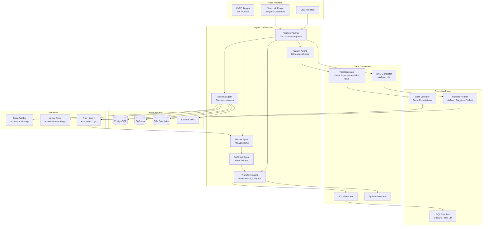
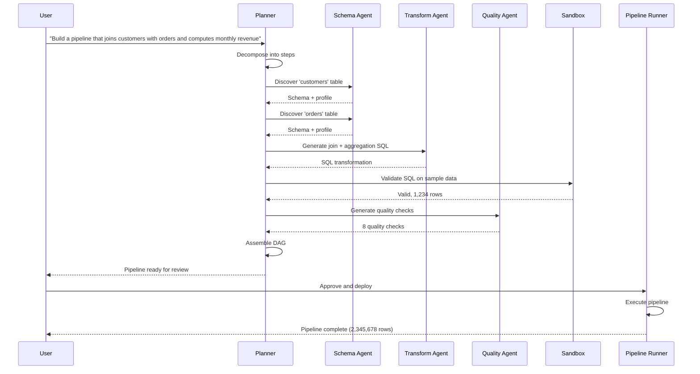
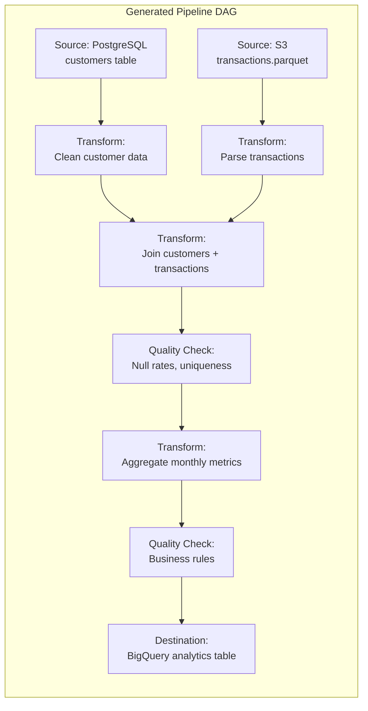

# Data Pipeline Agent

Design an AI agent that helps data engineers build and manage data pipelines by automating schema discovery, transformation generation, data quality checks, pipeline monitoring, and self-healing. This is a strong system design interview topic because it combines agentic reasoning with infrastructure automation and demands both correctness and efficiency at scale.

---

## Problem Statement

> "Design an AI-powered agent that can connect to heterogeneous data sources, discover schemas, generate SQL and Python transformations from natural language descriptions, assemble those transformations into runnable pipeline DAGs, enforce data quality, monitor pipeline health in production, and automatically heal common failures such as schema drift. Walk me through the architecture, key components, data flow, and how you would keep the system safe and cost-effective."

---

## Clarifying Questions to Ask

1. **What data sources are in scope?** Relational databases only, or also data lakes (S3/GCS), streaming systems (Kafka), and external APIs?
2. **Which orchestration framework is the target?** Airflow, Dagster, Prefect, dbt, or a custom runner? This changes the DAG generation strategy.
3. **What is the expected pipeline scale?** Number of pipelines, tables per pipeline, and volume of data flowing through -- this drives execution-layer sizing.
4. **Who approves generated pipelines?** Should the agent deploy directly, or must a data engineer review and merge generated code through a CI/CD workflow?
5. **What security posture is required?** Are we dealing with PII/PHI data? This determines credential management, row-level access policies, and audit requirements.
6. **What is the acceptable blast radius for self-healing?** Should the agent auto-fix minor schema drift without approval, or must every fix be human-approved?

---

## Requirements

### Functional Requirements

1. **Schema discovery** -- connect to data sources (databases, APIs, files) and automatically discover schemas with semantic enrichment
2. **Transformation generation** -- generate SQL/Python transformations from natural language descriptions
3. **Pipeline construction** -- assemble discovered sources and transformations into a runnable DAG (Airflow, dbt, etc.)
4. **Data quality checks** -- automatically generate and run quality checks (null rates, uniqueness, distributions, business rules)
5. **Monitoring and alerting** -- detect anomalies in pipeline runs (row count swings, duration spikes, quality failures) and alert engineers
6. **Self-healing** -- diagnose and attempt to fix common pipeline failures automatically (schema drift, null constraint violations, type mismatches)

### Non-Functional Requirements

| Requirement | Target |
|-------------|--------|
| Latency (schema discovery) | < 30 seconds per source |
| Latency (transformation generation) | < 20 seconds |
| Pipeline correctness | 100% of generated SQL must be syntactically valid |
| Data quality | Detect 95% of schema drift within one pipeline run |
| Cost per pipeline task | < $0.25 |
| Security | Never expose raw credentials; use IAM roles and secret managers |

### Out of Scope

- Real-time / streaming pipeline construction (focus is on batch and micro-batch)
- Building a full-featured data catalog UI (we store catalog metadata but do not build an exploration frontend)
- Fine-tuning LLMs on proprietary SQL -- we rely on prompt engineering, few-shot examples, and sandbox validation

---

## High-Level Architecture

### Architecture Walkthrough

The architecture is organized into five layers. Users interact through a chat interface, a notebook plugin, or CI/CD triggers. All requests flow into an **Agent Orchestrator** layer that houses six specialized agents -- each responsible for a distinct concern (planning, schema discovery, transformation, quality, monitoring, self-healing). The orchestrator delegates to a **Code Generation** layer that produces SQL, Python, DAG definitions, and test code. All generated code is validated in a **Sandbox** before it reaches the production **Execution Layer** (Airflow, Dagster, or Prefect). A **Metadata** layer consisting of a data catalog, a vector store of schema embeddings, and run history provides the contextual backbone -- agents query it to understand what exists, what has changed, and what has happened before.

The key architectural insight is separation of concerns: the Planner never generates SQL directly; the Transform Agent never deploys a pipeline. Each agent has a narrow mandate with well-defined inputs and outputs, making the system easier to test, debug, and evolve.

---

## Component Design

### Pipeline Planner

The Planner is the entry point for all user requests. It decomposes a natural language request ("Build a pipeline that joins customers with orders and computes monthly revenue") into a structured execution plan: which sources to discover, which transformations to generate, which quality checks to apply, and how to wire them into a DAG. It coordinates the other agents, aggregates their outputs, and presents a cohesive result to the user.

**Why it exists:** Without a planner, the user would have to invoke each agent manually and stitch results together. The planner provides the "agentic loop" -- it reasons about what to do next, handles inter-agent dependencies, and re-plans when intermediate results change the approach.

**Key decisions:** The planner uses a plan-then-execute pattern rather than a purely reactive loop. It generates the full plan upfront, then executes steps, revising the plan if a step produces unexpected results (e.g., schema discovery reveals that a table does not exist).

### Schema Agent

The Schema Agent connects to heterogeneous data sources (PostgreSQL, BigQuery, S3, APIs), extracts raw schema metadata (table names, column names, types, constraints), profiles the data (sample rows, null rates, cardinality, value distributions), and enriches the schema with LLM-generated semantic descriptions (business meaning of each table and column, likely primary/foreign keys, data quality observations).

**Why it exists:** Raw schema metadata (column names like `cust_id`, `txn_amt`) is not enough for downstream agents to generate correct transformations. Semantic enrichment turns cryptic column names into business context, and profiling provides the statistical baseline needed for quality check generation.

**Key decisions:** Enriched schemas are embedded as vectors and stored in the vector store, enabling semantic search. When the Transform Agent needs to find tables relevant to a request ("monthly revenue by customer segment"), it searches the vector store rather than scanning all tables. This scales to catalogs with thousands of tables.

### Transform Agent

The Transform Agent receives a natural language transformation description along with source and (optionally) target schemas, and produces syntactically valid, well-commented SQL (or Python for complex logic). It retrieves similar existing transformations from the vector store as few-shot examples, calls the LLM with the schemas and examples in context, extracts the generated SQL, and validates it in the sandbox.

**Why it exists:** Generating correct SQL from natural language is the core value proposition of the system. Separating it into its own agent allows specialized prompt engineering, dedicated validation, and a self-correction loop.

**Key decisions:** If sandbox validation fails (syntax error, missing column), the agent re-prompts the LLM with the error message and schema context. This self-correction loop runs up to two iterations. Generated SQL is required to use standard SQL compatible with both BigQuery and PostgreSQL, use CTEs for readability, and handle NULL values explicitly.

### Quality Agent

The Quality Agent generates data quality checks for a given table. It combines rule-based checks (not-null for required columns, uniqueness for primary keys) with LLM-generated checks (value range validation, referential integrity, distribution anomaly thresholds, freshness checks for timestamp columns, business rule validation).

**Why it exists:** Data quality is the top concern for production pipelines, yet most teams under-invest in quality checks because writing them is tedious. Automating quality check generation from schema profiles and business descriptions dramatically increases coverage.

**Key decisions:** Rule-based checks are always generated -- they do not require an LLM call and are guaranteed to be correct. LLM-generated checks add business-aware coverage (e.g., "price should be positive," "order date should not be in the future") but are validated against the schema before inclusion.

### Monitor Agent

The Monitor Agent analyzes completed pipeline runs for anomalies. It compares execution duration against historical averages, checks output row counts for unexpected swings (below 50% or above 300% of the historical average), evaluates quality check results, and feeds anomalies to the LLM for root-cause analysis with severity assessment and recommended actions.

**Why it exists:** Pipeline failures are often silent -- a pipeline completes successfully but produces wrong or incomplete data. The Monitor Agent catches these "silent failures" by looking at statistical deviations rather than just exit codes.

**Key decisions:** The agent uses a hybrid approach: deterministic rules for straightforward anomalies (duration, row counts) and LLM analysis for complex pattern recognition across multiple signals. Recent run history (last 10 runs) is included in the LLM context to identify trends.

### Self-Heal Agent

When the Monitor Agent detects a failure, the Self-Heal Agent diagnoses it and attempts an automatic fix. It classifies failures using regex pattern matching against known failure types (schema drift, null constraint violations, type mismatches, timeouts, permission errors), gathers context (source schema, transformation SQL, run logs), and applies a type-specific healing strategy.

**Why it exists:** Many pipeline failures are routine and fixable (a source table added a column, a nullable column became non-nullable). Automating fixes for these common cases reduces on-call burden and mean time to recovery.

**Key decisions:** For schema drift, the agent re-discovers the source schema, computes a diff, and -- if the change is minor (column added, column renamed) -- adapts the transformation SQL automatically without human approval. For major schema changes (column removed, type changed), the agent creates a draft fix that requires human approval. This graduated autonomy balances speed with safety.

---

## Data Flow

### End-to-End Pipeline Build

### Pipeline DAG Structure

The data flow follows a strict sequence. The user's natural language request enters the Planner, which decomposes it into schema discovery, transformation generation, and quality check generation steps. Schema discovery runs first because downstream agents need schema context. Once schemas are available, the Transform Agent generates SQL and the Sandbox validates it against sample data. Quality checks are generated based on the profiled schemas. Finally, the Planner assembles all components into a DAG definition (Airflow or dbt), presents it for review, and deploys on approval. In production, the Monitor Agent watches each run and triggers the Self-Heal Agent if failures occur.

---

## Variant: Natural Language Data Analysis

This variant addresses a closely related problem: instead of building reusable pipelines, the agent answers ad-hoc analytical questions from natural language by generating and executing SQL, running Python computations, and producing visualizations.

A **Planner Agent** receives the user's question and the database schema, then generates an analysis plan covering what data to fetch, what computations to run, and what visualizations to create. Specialized agents execute each step.

### Key Design Decisions

**NL-to-SQL with read-only database access.** The SQL Agent generates queries and executes them against a read-only database connection with query timeouts and row limits. This ensures the agent cannot modify production data regardless of what the LLM generates.

**Schema injection into SQL agent prompt.** The database schema (table names, columns, types, sample values) is injected directly into the SQL Agent's system prompt. For databases with hundreds of tables, RAG is used to retrieve only the tables relevant to the user's question, keeping the prompt focused and within token limits.

**SQL injection prevention via whitelist of allowed operations.** All generated SQL is validated against a whitelist that permits only SELECT statements. DDL (CREATE, DROP, ALTER) and DML (INSERT, UPDATE, DELETE) are rejected before execution. Parameterized queries are used where possible.

**Query cost estimation with EXPLAIN.** Before executing a generated query, the agent runs EXPLAIN to estimate cost. Queries predicted to scan too many rows or take too long are rejected with a suggestion to add filters or aggregations.

**Sandboxed Python execution in Docker containers.** When the analysis requires statistical computation or data transformation beyond SQL, the Python Agent generates pandas/scipy/sklearn code that runs in ephemeral Docker containers with no network access, limited CPU and memory, and a hard timeout. The container is destroyed after each execution.

**Iterative refinement.** When the user says "show me a different chart type" or "filter to just Q4," the Planner modifies the existing analysis plan rather than starting from scratch. This preserves context, avoids redundant queries, and provides a conversational analysis experience.

---

## Scaling Considerations

- **Schema caching.** Pre-compute and cache schema metadata and embeddings. Invalidate on detected schema changes rather than re-discovering on every request.
- **Transformation indexing.** Store all generated transformations in the vector store. As the library grows, the Transform Agent's few-shot examples improve, producing better SQL with fewer self-correction iterations.
- **Sandbox pooling.** Maintain a pool of warm sandbox instances (DuckDB or Docker containers) to eliminate cold-start latency for SQL validation and Python execution.
- **Horizontal orchestrator scaling.** The agent orchestrator is stateless -- conversation state lives in Redis. Any orchestrator instance can handle any request, enabling straightforward horizontal scaling.
- **Query result caching.** For the NL analysis variant, cache query results keyed on the SQL hash to avoid redundant database queries during iterative refinement.
- **Tiered monitoring.** Run deterministic anomaly checks (row counts, duration) on every pipeline run. Run LLM-based analysis only when anomalies are detected, keeping monitoring costs proportional to incident rate rather than run volume.

---

## Cost Analysis

| Operation | Tokens | Cost |
|-----------|--------|------|
| Schema discovery (per source) | 5K-15K | $0.02-$0.08 |
| Transformation generation | 10K-30K | $0.05-$0.30 |
| Quality check generation | 5K-10K | $0.02-$0.05 |
| DAG generation | 8K-20K | $0.04-$0.20 |
| Self-healing (per failure) | 10K-25K | $0.05-$0.25 |
| Monitoring analysis | 5K-15K | $0.02-$0.08 |
| **Typical full pipeline build** | **40K-100K** | **$0.20-$0.80** |

The dominant cost driver is transformation generation, especially when self-correction loops are needed. Caching similar transformations as few-shot examples reduces iteration count and therefore cost over time. Monitoring costs are kept low by reserving LLM calls for anomaly investigation rather than routine run analysis.

---

## Trade-offs & Alternatives

| Decision | Rationale | Alternative | Why Not |
|----------|-----------|-------------|---------|
| Separate agents per concern (schema, transform, quality, etc.) | Clear ownership, testable in isolation, specialized prompts per task | Single monolithic agent that handles everything | Monolithic prompts are harder to tune, debug, and evaluate; a quality regression in one capability affects all capabilities |
| Sandbox validation of all generated SQL | Catches syntax errors before deployment; enables self-correction loop | Static analysis / linting only | Static analysis misses semantic errors (wrong joins, missing columns); sandbox validation with sample data catches both syntax and logic issues |
| Vector store for schema and transformation retrieval | Scales to thousands of tables; enables semantic search ("revenue" finds `txn_amount`) | Full schema in every prompt | Full schema exceeds token limits for large catalogs; irrelevant context reduces generation quality |
| Graduated self-healing autonomy (auto-fix minor, draft-fix major) | Balances speed (common fixes applied immediately) with safety (major changes reviewed) | Fully autonomous self-healing | Unbounded auto-fix risks propagating errors; a renamed column might indicate a business logic change that requires transformation redesign |
| DuckDB as SQL sandbox | Fast, in-process, supports standard SQL, no infrastructure required | Dedicated test database instance | Test databases require provisioning, credential management, and data seeding; DuckDB runs locally with sample data |
| Read-only DB connection for NL analysis variant | Prevents data modification regardless of LLM output | Row-level security with write permissions | Defense in depth -- read-only connection is simpler, harder to misconfigure, and provides a stronger guarantee |

---

## Interview Tips

:::tip How to Present This (35 minutes)
**Minutes 0-5 -- Clarify and scope.** Ask about data sources, orchestration framework, team size, and approval workflow. State your assumptions and what you are putting out of scope (streaming, catalog UI).

**Minutes 5-10 -- Draw the architecture.** Sketch the five layers (user interface, agent orchestrator, code generation, execution, metadata) and the six agents. Emphasize the separation of concerns: each agent has a narrow mandate.

**Minutes 10-18 -- Deep dive on two components.** Pick the Transform Agent and the Self-Heal Agent. For the Transform Agent, explain the schema context injection, few-shot example retrieval, sandbox validation, and self-correction loop. For the Self-Heal Agent, explain failure classification, graduated autonomy (auto-fix minor vs. draft-fix major), and schema diff.

**Minutes 18-23 -- Walk through the data flow.** Use the sequence diagram to trace a request from "Build a pipeline that joins customers with orders" through schema discovery, transformation generation, sandbox validation, quality check generation, DAG assembly, and deployment.

**Minutes 23-28 -- Security and safety.** Cover credential management (IAM roles, secret managers, never in prompts), sandbox isolation for all generated code, read-only connections for the NL analysis variant, SQL whitelist validation, and the blast-radius model for self-healing.

**Minutes 28-32 -- Scaling and cost.** Discuss schema caching, transformation indexing for improving few-shot quality over time, sandbox pooling, and the tiered monitoring approach. Walk through the cost table and explain why the typical pipeline build stays under $1.

**Minutes 32-35 -- Trade-offs.** Highlight one or two rows from the trade-offs table. The strongest move is to explain what you chose, what you considered, and why you rejected the alternative -- this demonstrates design maturity.
:::
