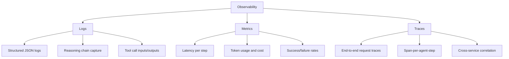
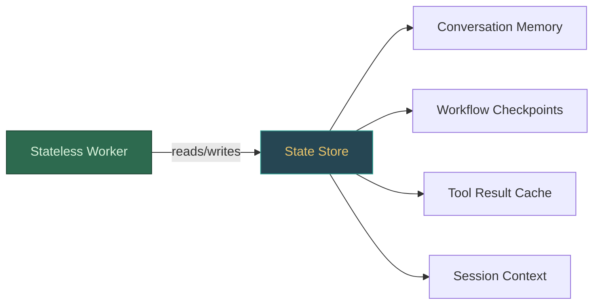
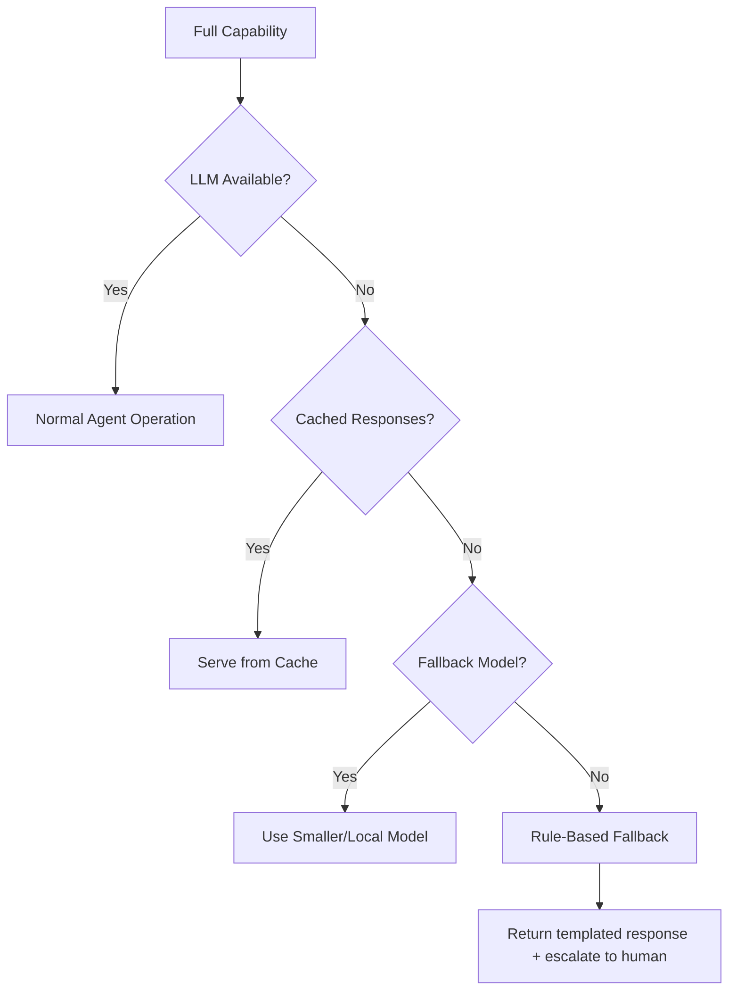
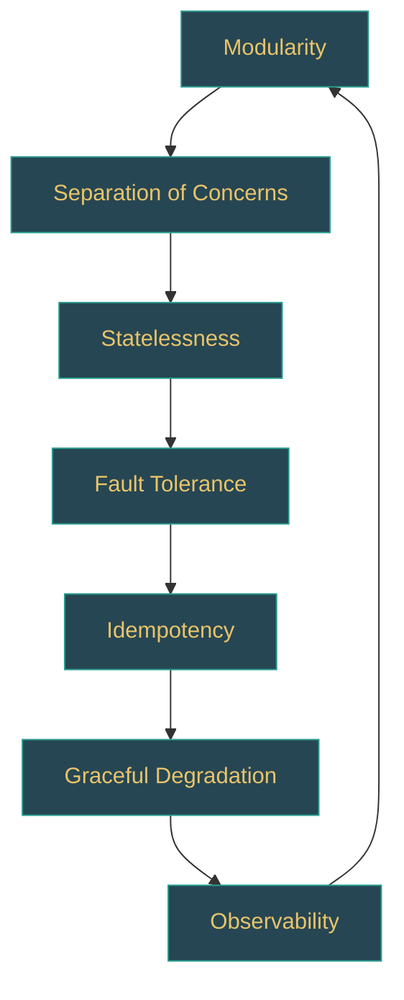

# Design Principles

Traditional distributed systems are deterministic: the same input produces the same output, failures are classifiable, and retry logic is straightforward. Agentic AI systems break all three assumptions. An LLM might return a different tool-call sequence on every invocation, a single "retry" can double your API bill, and a failure in step 5 of an 8-step reasoning chain may require replaying the entire chain rather than just retrying the failed call. The seven principles below are the engineering constraints that keep this inherent non-determinism from becoming production chaos.

---

## 1. Modularity

**Principle:** Decompose the system into independent, replaceable components with well-defined interfaces.

An agentic system is not a monolith. The LLM, the tool executor, the memory store, the planner, and the output formatter are all separate concerns. When each component hides its implementation behind a stable interface, you can swap an OpenAI model for an Anthropic model -- or replace an in-memory tool registry with a distributed one -- without rewriting the agent loop.

### Example

```python
import hashlib
import json
from abc import ABC, abstractmethod


class ToolExecutor(ABC):
    async def execute(self, tool_name, parameters) -> dict: ...

class LocalToolExecutor(ToolExecutor):
    async def execute(self, tool_name, parameters):
        return await self._registry[tool_name](**parameters)

class SandboxedToolExecutor(ToolExecutor):
    async def execute(self, tool_name, parameters):
        return await self._sandbox.run(tool_name, parameters, timeout=30)
```

:::tip Interview Angle
When asked "How would you swap the LLM provider in your agent?" the answer is modularity. Show that the LLM is behind an interface, and the agent loop only depends on that interface -- not on any provider SDK directly.
:::

### Benefits

| Benefit | How It Helps |
|---------|-------------|
| Independent deployment | Update the tool executor without redeploying the planner |
| Testability | Mock the LLM interface for deterministic unit tests |
| Team parallelism | Different teams own different modules |
| Vendor flexibility | Switch providers without architectural changes |

---

## 2. Fault Tolerance

**Principle:** Assume every external call will fail. Design for it.

Agentic systems make frequent calls to LLM APIs, external tools, databases, and third-party services. Any of these can fail due to rate limits, network partitions, or provider outages. A production agent must degrade gracefully rather than crash.

### Example

```python
class ResilientLLMClient:
    def __init__(self, primary, fallback):
        self.primary, self.fallback = primary, fallback

    @retry(stop=3, wait=exponential_backoff(max=10))
    async def generate(self, prompt, **kwargs):
        try:
            return await self.primary.generate(prompt, **kwargs)
        except RateLimitError:
            return await self.fallback.generate(prompt, **kwargs)
```

### Key Strategies

- **Retries with exponential backoff and jitter** for transient failures
- **Fallback providers** for LLM API outages
- **Circuit breakers** to stop cascading failures
- **Timeouts on every external call** -- never wait indefinitely
- **Dead-letter queues** for tasks that exhaust all retries

:::warning
Never retry non-idempotent operations without deduplication. If the agent creates a database record and the acknowledgement is lost, a naive retry creates a duplicate.
:::

---

## 3. Idempotency

**Principle:** Every operation should be safe to retry. Running the same action twice must produce the same result as running it once.

LLM-based systems are especially vulnerable to duplicate execution because retries are frequent (rate limits, timeouts) and agents may re-execute steps during recovery from checkpoints.

### Example

```python
class IdempotentToolExecutor:
    def __init__(self, executor, cache):
        self._executor, self._cache = executor, cache

    async def execute(self, tool_name, parameters, idempotency_key=None):
        canonical = json.dumps({"tool": tool_name, "params": parameters}, sort_keys=True)
        key = idempotency_key or hashlib.sha256(canonical.encode()).hexdigest()
        cached = await self._cache.get(key)
        if cached is not None:
            return cached
        result = await self._executor.execute(tool_name, parameters)
        await self._cache.set(key, result, ttl=3600)
        return result
```

### Where Idempotency Matters Most

1. **Tool execution** -- sending emails, creating records, making payments
2. **State transitions** -- moving a workflow from one stage to the next
3. **Checkpoint recovery** -- replaying from the last saved state

---

## 4. Observability

**Principle:** If you cannot see it, you cannot debug it. Instrument every layer.

Agentic systems are non-deterministic. The same input can produce different reasoning chains, different tool calls, and different outputs. Without deep observability, debugging production failures is nearly impossible.

### The Three Pillars for Agents



### What to Capture

| Layer | Data Points |
|-------|------------|
| LLM call | Prompt, completion, model, tokens used, latency, cost |
| Tool call | Tool name, parameters, result, duration, success/failure |
| Agent step | Step number, reasoning, decision, action taken |
| Workflow | Total duration, steps executed, retries, final outcome |

:::info
Tools like LangSmith, Langfuse, and Arize Phoenix are purpose-built for LLM observability. They capture prompt-completion pairs, token costs, and latency in a way that generic APM tools do not.
:::

---

## 5. Separation of Concerns

**Principle:** Each component should have one reason to change.

In an agentic system, this means separating:

- **Reasoning** (the LLM decides what to do) from **execution** (tools carry out the action)
- **Planning** (decomposing goals into steps) from **scheduling** (ordering and dispatching steps)
- **State management** (persisting context) from **business logic** (domain-specific rules)
- **Safety** (guardrails, content filtering) from **core agent logic**

### Anti-Pattern: The God Agent

```python
# BAD: One class handles planning, execution, state, safety, logging, formatting
class GodAgent:
    async def handle(self, user_input):
        plan = await self.llm.generate(f"Plan for: {user_input}")
        for step in self.parse_plan(plan):
            result = await self.run_tool(step.tool, step.params)
            self.memory.append(result)
            if self.is_harmful(result): return "Blocked."
        return self.format_response(self.memory)
```

### Refactored: Clean Separation

```python
# GOOD: Each concern is injected as a separate component
class AgentOrchestrator:
    def __init__(self, planner, executor, memory, guardrail, formatter): ...

    async def handle(self, user_input):
        if not await self.guardrail.check_input(user_input):
            return self.formatter.blocked_response()
        plan = await self.planner.create_plan(user_input, self.memory.context())
        for step in plan.steps:
            result = await self.executor.execute(step)
            await self.memory.record(step, result)
            if not await self.guardrail.check_output(result):
                return self.formatter.blocked_response()
        return self.formatter.format(self.memory.context())
```

---

## 6. Statelessness vs. Statefulness

**Principle:** Make agent workers stateless; push state to dedicated, durable stores.

This is the same principle that makes web servers horizontally scalable. An agent worker should be able to process any request without relying on local memory from a previous request.

### State Spectrum



### When to Use Each

| Approach | Use Case | Trade-off |
|----------|----------|-----------|
| **Stateless workers** | Agent step execution, tool calls, LLM inference | Requires external state store; adds latency for state retrieval |
| **Stateful sessions** | Long-running conversations, interactive debugging | Harder to scale; requires sticky sessions or session migration |
| **Hybrid** | Stateless workers with session affinity hints | Best balance for most production systems |

### Example: Externalized State

```python
class StatelessAgentWorker:
    def __init__(self, llm, tool_executor, state_store): ...

    async def process_step(self, session_id, step_id):
        state = await self.state_store.load(session_id)       # load from external store
        step = state.pending_steps[step_id]
        result = await self.tool_executor.execute(step.tool, step.params)
        state.record_result(step_id, result)
        await self.state_store.save(session_id, state)        # persist back
        return result
```

:::tip
In a system design interview, explicitly call out this pattern. Interviewers want to hear that your agent workers are stateless and can scale horizontally behind a load balancer.
:::

---

## 7. Graceful Degradation

**Principle:** When a component fails, the system should provide reduced functionality rather than no functionality.

Agentic systems have many failure modes. The LLM might be slow, a tool might be down, or the memory store might be temporarily unreachable. A well-designed system handles each failure mode with a specific degradation strategy.

### Degradation Hierarchy



### Degradation Strategies by Component

| Component | Failure | Degradation |
|-----------|---------|-------------|
| Primary LLM | Rate limited / down | Fall back to secondary provider or smaller model |
| Tool | Timeout / error | Return cached result or skip with explanation |
| Memory store | Unreachable | Proceed with in-context memory only (limited history) |
| Vector search | Latency spike | Return results from a pre-computed cache |
| Guardrail service | Down | Apply conservative local rules; block uncertain inputs |

### Example

```python
class DegradingAgent:
    async def generate_response(self, query, context):
        try:
            return await self._full_agent_response(query, context)   # Level 1: full LLM
        except LLMUnavailableError:
            pass
        cached = await self._find_similar_cached_response(query)     # Level 2: cache
        if cached:
            return cached + "\n(Cached response -- live agent unavailable.)"
        return self._rule_based_response(query)                      # Level 3: rules
```

:::warning
Graceful degradation does not mean silent failure. Always log the degradation event, emit a metric, and -- when user-facing -- communicate that the response quality may be reduced. Transparency builds trust.
:::

---

## Putting It All Together

These seven principles are not independent. They reinforce each other.

| Principle | Enables |
|-----------|---------|
| Modularity | Separation of concerns, testability |
| Fault tolerance | Graceful degradation, idempotency |
| Idempotency | Safe retries, checkpoint recovery |
| Observability | Debugging non-deterministic behaviour |
| Separation of concerns | Modularity, team autonomy |
| Statelessness | Horizontal scaling, fault tolerance |
| Graceful degradation | User trust, system availability |



---

## Critical Algorithm: Cost-Aware Adaptive Model Router

The single most expensive mistake in agentic AI is routing every LLM call to the same frontier model. In a multi-step agent loop where each session triggers 5-15 LLM calls, sending every call to GPT-4o at ~$10/1M output tokens creates runaway costs. Most of those calls -- classification, parameter extraction, simple reformulation -- do not need frontier-level reasoning. An adaptive router that dispatches each step to the cheapest model meeting quality constraints can cut LLM spend by 60-80% without measurable quality loss on aggregate task completion.

The naive approach breaks at roughly $5K/month in LLM spend. Below that threshold, the engineering cost of maintaining a router exceeds the savings. Above it, the router pays for itself within weeks.

```python
from abc import ABC, abstractmethod
from dataclasses import dataclass
from enum import Enum
import hashlib, json, logging

logger = logging.getLogger(__name__)


class Complexity(Enum):
    SIMPLE = "simple"        # FAQ, classification, entity extraction
    MODERATE = "moderate"    # multi-step reasoning, tool selection
    COMPLEX = "complex"      # code generation, nuanced analysis
    CRITICAL = "critical"    # financial decisions, safety-critical outputs


@dataclass
class ModelConfig:
    name: str
    cost_per_1k_input: float      # USD per 1K input tokens
    cost_per_1k_output: float     # USD per 1K output tokens
    quality_score: float          # 0.0 - 1.0, calibrated on eval set
    max_tokens: int
    latency_p50_ms: int


@dataclass
class AgentTask:
    instruction: str
    estimated_output_tokens: int
    step_index: int


class BudgetExhaustedError(Exception):
    def __init__(self, remaining: float, tokens_needed: int):
        super().__init__(
            f"Budget exhausted: ${remaining:.4f} remaining, "
            f"need ~{tokens_needed} output tokens"
        )


class ComplexityClassifier(ABC):
    @abstractmethod
    async def classify(self, instruction: str) -> Complexity: ...


class AdaptiveModelRouter:
    """Routes each agent step to the cost-optimal model that meets quality constraints.

    This is the most impactful cost optimization in agentic systems. A naive system
    sends every request to GPT-4o at $10/1M output tokens. An adaptive router sends
    60% of traffic to GPT-4o-mini at $0.60/1M output tokens -- a 10x savings on the
    majority of requests.
    """

    def __init__(self, models: list[ModelConfig], classifier: ComplexityClassifier):
        # Models sorted by cost ascending so the cheapest qualified model is always first
        self.models = sorted(models, key=lambda m: m.cost_per_1k_output)
        self.classifier = classifier

    async def route(self, task: AgentTask, budget: "TokenBudget") -> ModelConfig:
        complexity = await self.classifier.classify(task.instruction)

        # Hard constraint: remaining budget must cover worst-case token usage
        affordable = [
            m for m in self.models
            if m.cost_per_1k_output * (task.estimated_output_tokens / 1000)
               <= budget.remaining_usd
        ]
        if not affordable:
            raise BudgetExhaustedError(
                budget.remaining_usd, task.estimated_output_tokens
            )

        # Quality constraint: model must meet minimum quality for this complexity tier
        quality_floor = {
            Complexity.SIMPLE: 0.5,      # FAQ, classification -- any model works
            Complexity.MODERATE: 0.7,    # multi-step reasoning, tool selection
            Complexity.COMPLEX: 0.85,    # code generation, nuanced analysis
            Complexity.CRITICAL: 0.95,   # financial decisions, safety-critical
        }

        qualified = [
            m for m in affordable
            if m.quality_score >= quality_floor[complexity]
        ]

        if not qualified:
            # No model meets both budget AND quality -- take the best affordable
            # model and flag for human review
            best = max(affordable, key=lambda m: m.quality_score)
            logger.warning(
                "quality_compromise",
                extra={
                    "required": quality_floor[complexity],
                    "actual": best.quality_score,
                    "model": best.name,
                },
            )
            return best

        # Among qualified models, pick cheapest (list is pre-sorted by cost)
        return qualified[0]


class TokenBudget:
    """Tracks spend across an entire agent session with per-step allocation.

    Prevents a single expensive step from consuming the budget that later steps need.
    The per_step_budget property distributes remaining funds evenly across remaining
    steps, creating back-pressure on the router to choose cheaper models as the
    session progresses.
    """

    def __init__(self, total_usd: float, max_steps: int):
        self.total_usd = total_usd
        self.spent_usd = 0.0
        self.max_steps = max_steps
        self.step_count = 0

    @property
    def remaining_usd(self) -> float:
        return self.total_usd - self.spent_usd

    @property
    def per_step_budget(self) -> float:
        remaining_steps = max(1, self.max_steps - self.step_count)
        return self.remaining_usd / remaining_steps

    def record(self, model: str, input_tokens: int, output_tokens: int, cost: float):
        self.spent_usd += cost
        self.step_count += 1
        if self.spent_usd > self.total_usd * 0.8:
            logger.warning(
                "budget_80pct",
                extra={"spent": self.spent_usd, "total": self.total_usd},
            )
```

The router's `quality_floor` mapping is the key design decision. Set thresholds too high and you waste budget on over-qualified models for simple tasks. Set them too low and complex reasoning tasks produce unreliable outputs. Calibrate by running an evaluation set against each model tier and measuring task completion accuracy. In practice, start with a conservative mapping (route everything to the frontier model), collect a labeled dataset of task-complexity pairs from production traces, then progressively lower thresholds as you gain confidence in each model tier's accuracy on your specific workloads.

---

## When Principles Collide: Design Decision Framework

The seven principles above are individually sound, but production systems force you to choose between them. Every senior design interview eventually reaches the question: "what would you trade off and why?" This section addresses the five most common conflicts in agentic AI architecture.

### Modularity vs Latency

Every service boundary adds a network hop. An agent that calls an LLM service, then a tool-execution service, then a second LLM service pays three round-trips -- typically 50-150ms of pure network overhead on top of the actual compute time. A monolithic agent loop with in-process tool execution pays zero network overhead for the same three steps. The modular architecture wins when you need independent scaling (the tool executor is CPU-bound while the LLM gateway is I/O-bound) or when teams ship on different deployment cadences. For systems below roughly 1,000 QPS, a modular monolith -- separate modules within a single deployable unit -- usually delivers better p99 latency than a microservice decomposition. The concrete recommendation: start monolithic, measure per-component scaling pressure, and extract services only when a specific module hits a resource ceiling that the rest of the system does not share.

### Observability vs Cost

Logging every prompt-completion pair costs real money in storage and egress. At 10K agent sessions per day with an average of 4K tokens per LLM call and 8 calls per session, you generate roughly 320M tokens per day of raw trace data. Stored as structured JSON, that is 1-2 GB/day before indexing. Full capture is essential during development and the first weeks of production, but unsustainable at scale. Head-based sampling (log 10% of all sessions randomly) is cheap but misses rare failures. Tail-based sampling (capture the full trace only when the session errors or exceeds a latency threshold) catches the interesting cases but requires buffering traces in memory until the outcome is known. The practical approach: use tail-based sampling in production with a 5-10% random head sample as a baseline, and always capture the full trace for any session flagged by guardrails or user feedback.

### Fault Tolerance vs User Experience

A three-tier fallback chain (GPT-4o, then Claude Sonnet, then GPT-4o-mini, then a template) maximizes availability but introduces response quality inconsistency. A user who asks a nuanced question might get a frontier-quality answer on their first try and a generic template on the retry -- even within the same conversation. This inconsistency erodes trust faster than a clean error message. The design choice depends on the domain: for customer support agents where any answer is better than no answer, cascade aggressively. For financial advisory or medical triage agents where a wrong answer is worse than no answer, fail fast after the first fallback tier and route to a human. In all cases, communicate the degradation to the user so they can calibrate their trust in the response.

### Idempotency vs Freshness

Caching tool results for idempotency guarantees means serving potentially stale data. An order-status lookup cached with a 60-second TTL is stale if the customer's package was delivered 10 seconds after the cache write. The tension is real: without caching, a retry storm during an LLM rate-limit event can hammer your downstream services; with caching, you trade correctness for resilience. The resolution is to classify tools by staleness tolerance. Read-only reference data (product catalogs, FAQ lookups) tolerates TTLs of minutes to hours. Transactional state queries (order status, account balance) should use short TTLs of 5-10 seconds or bypass the idempotency cache entirely and instead deduplicate only write operations. Never apply a single TTL policy across all tools -- it will be wrong for at least half of them.

### Statelessness vs Context Quality

Loading full conversation state from Redis on every agent step adds 2-5ms per load. In a 10-step agent loop, that is 20-50ms of cumulative state-loading overhead -- usually negligible compared to LLM latency of 500-2000ms per call. But the overhead becomes significant when state payloads grow large: a conversation with 50 turns and embedded tool results can reach 100KB+, and deserializing that on every step adds real cost. The alternative -- keeping state in-process on a pinned worker -- eliminates serialization overhead but prevents failover to another worker if the process crashes mid-session. The break-even point is session duration: for short sessions (under 5 steps, under 30 seconds), in-process state with at-most-once delivery is simpler and faster. For long-running sessions (10+ steps, minutes to hours), externalized state with checkpointing is the only safe option because the probability of a mid-session worker failure becomes non-trivial.

### Decision Table

| Conflict | Default Choice | Switch When | Key Metric to Watch |
|----------|---------------|-------------|-------------------|
| Modularity vs Latency | Modular monolith | Single module needs independent scaling or separate deploy cadence | p99 latency per agent step, QPS per module |
| Observability vs Cost | Tail-based sampling + 5% head sample | Debugging a specific failure class requires full capture temporarily | Storage cost/month, mean-time-to-diagnosis |
| Fault Tolerance vs UX | Fail fast after 1 fallback | Domain tolerates inconsistent quality (e.g., support chatbot) | Fallback trigger rate, user satisfaction delta between tiers |
| Idempotency vs Freshness | Cache writes only, short TTL for reads | Read-heavy reference data with low change rate | Cache hit rate, stale-response incident count |
| Statelessness vs Context | Externalized state (Redis) | Sessions are short-lived and worker failure is rare | State-load p99 latency, session failure rate |

---

## Interview Preparation

When discussing design principles in an interview, structure your answer around trade-offs rather than absolutes.

**Sample question:** "How would you design an agent system that handles 10,000 concurrent sessions?"

**Strong answer structure:**
1. Start with **statelessness** -- workers behind a load balancer, state in Redis/DynamoDB
2. Layer in **modularity** -- separate LLM inference, tool execution, and state management into independently scalable services
3. Add **fault tolerance** -- retries, circuit breakers, fallback providers
4. Ensure **idempotency** -- deduplicate tool executions on retry
5. Prove **observability** -- distributed tracing with OpenTelemetry, cost dashboards
6. Discuss **graceful degradation** -- what happens when you hit LLM rate limits at scale

This demonstrates systems thinking, which is what interviewers at the senior level are looking for.
