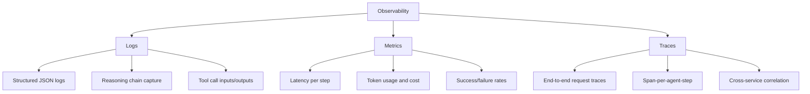
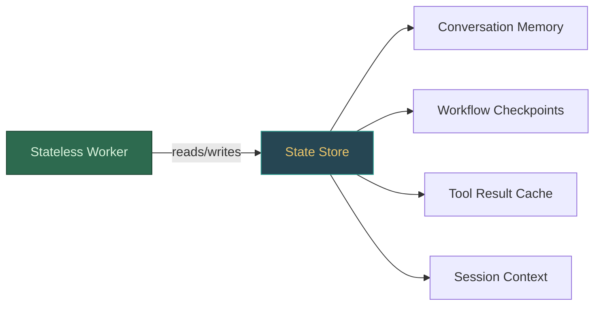
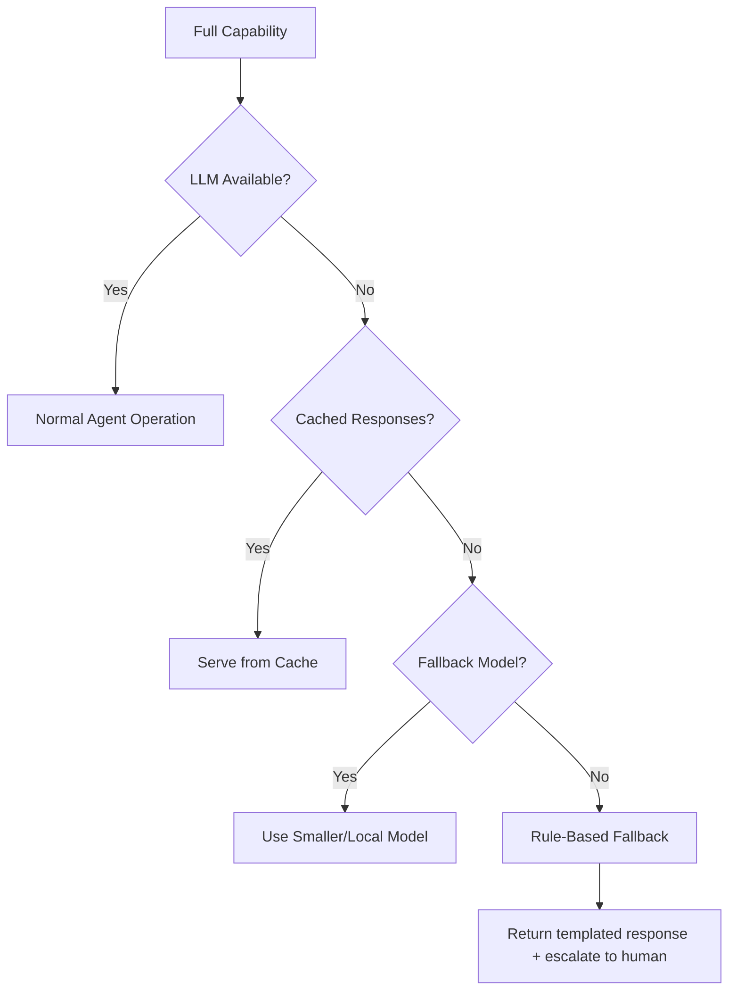
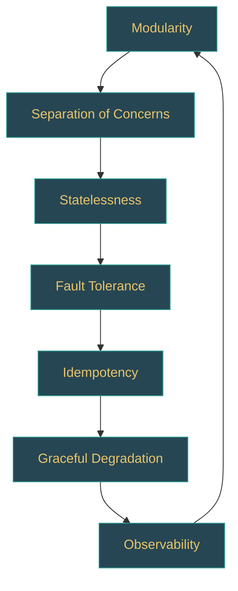

# Design Principles

Building agentic AI systems that survive contact with production traffic requires the same rigour as any distributed system -- plus additional discipline around non-deterministic LLM behaviour. This page covers the seven foundational principles every agentic system architect must internalise.

---

## 1. Modularity

**Principle:** Decompose the system into independent, replaceable components with well-defined interfaces.

An agentic system is not a monolith. The LLM, the tool executor, the memory store, the planner, and the output formatter are all separate concerns. When each component hides its implementation behind a stable interface, you can swap an OpenAI model for an Anthropic model -- or replace an in-memory tool registry with a distributed one -- without rewriting the agent loop.

### Example

```python
class ToolExecutor(ABC):
    async def execute(self, tool_name, parameters) -> dict: ...

class LocalToolExecutor(ToolExecutor):
    async def execute(self, tool_name, parameters):
        return await self._registry[tool_name](**parameters)

class SandboxedToolExecutor(ToolExecutor):
    async def execute(self, tool_name, parameters):
        return await self._sandbox.run(tool_name, parameters, timeout=30)
```

:::tip Interview Angle
When asked "How would you swap the LLM provider in your agent?" the answer is modularity. Show that the LLM is behind an interface, and the agent loop only depends on that interface -- not on any provider SDK directly.
:::

### Benefits

| Benefit | How It Helps |
|---------|-------------|
| Independent deployment | Update the tool executor without redeploying the planner |
| Testability | Mock the LLM interface for deterministic unit tests |
| Team parallelism | Different teams own different modules |
| Vendor flexibility | Switch providers without architectural changes |

---

## 2. Fault Tolerance

**Principle:** Assume every external call will fail. Design for it.

Agentic systems make frequent calls to LLM APIs, external tools, databases, and third-party services. Any of these can fail due to rate limits, network partitions, or provider outages. A production agent must degrade gracefully rather than crash.

### Example

```python
class ResilientLLMClient:
    def __init__(self, primary, fallback):
        self.primary, self.fallback = primary, fallback

    @retry(stop=3, wait=exponential_backoff(max=10))
    async def generate(self, prompt, **kwargs):
        try:
            return await self.primary.generate(prompt, **kwargs)
        except RateLimitError:
            return await self.fallback.generate(prompt, **kwargs)
```

### Key Strategies

- **Retries with exponential backoff and jitter** for transient failures
- **Fallback providers** for LLM API outages
- **Circuit breakers** to stop cascading failures
- **Timeouts on every external call** -- never wait indefinitely
- **Dead-letter queues** for tasks that exhaust all retries

:::warning
Never retry non-idempotent operations without deduplication. If the agent creates a database record and the acknowledgement is lost, a naive retry creates a duplicate.
:::

---

## 3. Idempotency

**Principle:** Every operation should be safe to retry. Running the same action twice must produce the same result as running it once.

LLM-based systems are especially vulnerable to duplicate execution because retries are frequent (rate limits, timeouts) and agents may re-execute steps during recovery from checkpoints.

### Example

```python
class IdempotentToolExecutor:
    def __init__(self, executor, cache):
        self._executor, self._cache = executor, cache

    async def execute(self, tool_name, parameters, idempotency_key=None):
        key = idempotency_key or sha256(canonical_json(tool_name, parameters))
        cached = await self._cache.get(key)
        if cached is not None:
            return cached
        result = await self._executor.execute(tool_name, parameters)
        await self._cache.set(key, result, ttl=3600)
        return result
```

### Where Idempotency Matters Most

1. **Tool execution** -- sending emails, creating records, making payments
2. **State transitions** -- moving a workflow from one stage to the next
3. **Checkpoint recovery** -- replaying from the last saved state

---

## 4. Observability

**Principle:** If you cannot see it, you cannot debug it. Instrument every layer.

Agentic systems are non-deterministic. The same input can produce different reasoning chains, different tool calls, and different outputs. Without deep observability, debugging production failures is nearly impossible.

### The Three Pillars for Agents



### What to Capture

| Layer | Data Points |
|-------|------------|
| LLM call | Prompt, completion, model, tokens used, latency, cost |
| Tool call | Tool name, parameters, result, duration, success/failure |
| Agent step | Step number, reasoning, decision, action taken |
| Workflow | Total duration, steps executed, retries, final outcome |

:::info
Tools like LangSmith, Langfuse, and Arize Phoenix are purpose-built for LLM observability. They capture prompt-completion pairs, token costs, and latency in a way that generic APM tools do not.
:::

---

## 5. Separation of Concerns

**Principle:** Each component should have one reason to change.

In an agentic system, this means separating:

- **Reasoning** (the LLM decides what to do) from **execution** (tools carry out the action)
- **Planning** (decomposing goals into steps) from **scheduling** (ordering and dispatching steps)
- **State management** (persisting context) from **business logic** (domain-specific rules)
- **Safety** (guardrails, content filtering) from **core agent logic**

### Anti-Pattern: The God Agent

```python
# BAD: One class handles planning, execution, state, safety, logging, formatting
class GodAgent:
    async def handle(self, user_input):
        plan = await self.llm.generate(f"Plan for: {user_input}")
        for step in self.parse_plan(plan):
            result = await self.run_tool(step.tool, step.params)
            self.memory.append(result)
            if self.is_harmful(result): return "Blocked."
        return self.format_response(self.memory)
```

### Refactored: Clean Separation

```python
# GOOD: Each concern is injected as a separate component
class AgentOrchestrator:
    def __init__(self, planner, executor, memory, guardrail, formatter): ...

    async def handle(self, user_input):
        if not await self.guardrail.check_input(user_input):
            return self.formatter.blocked_response()
        plan = await self.planner.create_plan(user_input, self.memory.context())
        for step in plan.steps:
            result = await self.executor.execute(step)
            await self.memory.record(step, result)
            if not await self.guardrail.check_output(result):
                return self.formatter.blocked_response()
        return self.formatter.format(self.memory.context())
```

---

## 6. Statelessness vs. Statefulness

**Principle:** Make agent workers stateless; push state to dedicated, durable stores.

This is the same principle that makes web servers horizontally scalable. An agent worker should be able to process any request without relying on local memory from a previous request.

### State Spectrum



### When to Use Each

| Approach | Use Case | Trade-off |
|----------|----------|-----------|
| **Stateless workers** | Agent step execution, tool calls, LLM inference | Requires external state store; adds latency for state retrieval |
| **Stateful sessions** | Long-running conversations, interactive debugging | Harder to scale; requires sticky sessions or session migration |
| **Hybrid** | Stateless workers with session affinity hints | Best balance for most production systems |

### Example: Externalized State

```python
class StatelessAgentWorker:
    def __init__(self, llm, tool_executor, state_store): ...

    async def process_step(self, session_id, step_id):
        state = await self.state_store.load(session_id)       # load from external store
        step = state.pending_steps[step_id]
        result = await self.tool_executor.execute(step.tool, step.params)
        state.record_result(step_id, result)
        await self.state_store.save(session_id, state)        # persist back
        return result
```

:::tip
In a system design interview, explicitly call out this pattern. Interviewers want to hear that your agent workers are stateless and can scale horizontally behind a load balancer.
:::

---

## 7. Graceful Degradation

**Principle:** When a component fails, the system should provide reduced functionality rather than no functionality.

Agentic systems have many failure modes. The LLM might be slow, a tool might be down, or the memory store might be temporarily unreachable. A well-designed system handles each failure mode with a specific degradation strategy.

### Degradation Hierarchy



### Degradation Strategies by Component

| Component | Failure | Degradation |
|-----------|---------|-------------|
| Primary LLM | Rate limited / down | Fall back to secondary provider or smaller model |
| Tool | Timeout / error | Return cached result or skip with explanation |
| Memory store | Unreachable | Proceed with in-context memory only (limited history) |
| Vector search | Latency spike | Return results from a pre-computed cache |
| Guardrail service | Down | Apply conservative local rules; block uncertain inputs |

### Example

```python
class DegradingAgent:
    async def generate_response(self, query, context):
        try:
            return await self._full_agent_response(query, context)   # Level 1: full LLM
        except LLMUnavailableError:
            pass
        cached = await self._find_similar_cached_response(query)     # Level 2: cache
        if cached:
            return cached + "\n(Cached response -- live agent unavailable.)"
        return self._rule_based_response(query)                      # Level 3: rules
```

:::warning
Graceful degradation does not mean silent failure. Always log the degradation event, emit a metric, and -- when user-facing -- communicate that the response quality may be reduced. Transparency builds trust.
:::

---

## Putting It All Together

These seven principles are not independent. They reinforce each other.

| Principle | Enables |
|-----------|---------|
| Modularity | Separation of concerns, testability |
| Fault tolerance | Graceful degradation, idempotency |
| Idempotency | Safe retries, checkpoint recovery |
| Observability | Debugging non-deterministic behaviour |
| Separation of concerns | Modularity, team autonomy |
| Statelessness | Horizontal scaling, fault tolerance |
| Graceful degradation | User trust, system availability |



---

## Interview Preparation

When discussing design principles in an interview, structure your answer around trade-offs rather than absolutes.

**Sample question:** "How would you design an agent system that handles 10,000 concurrent sessions?"

**Strong answer structure:**
1. Start with **statelessness** -- workers behind a load balancer, state in Redis/DynamoDB
2. Layer in **modularity** -- separate LLM inference, tool execution, and state management into independently scalable services
3. Add **fault tolerance** -- retries, circuit breakers, fallback providers
4. Ensure **idempotency** -- deduplicate tool executions on retry
5. Prove **observability** -- distributed tracing with OpenTelemetry, cost dashboards
6. Discuss **graceful degradation** -- what happens when you hit LLM rate limits at scale

This demonstrates systems thinking, which is what interviewers at the senior level are looking for.
