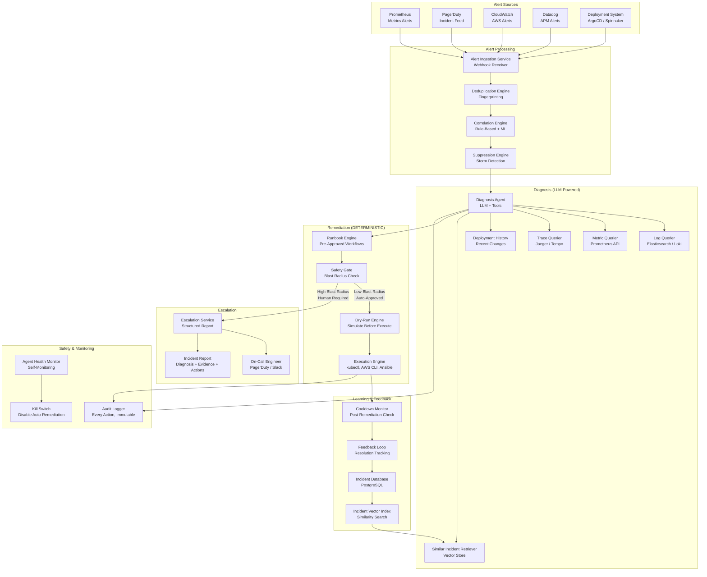
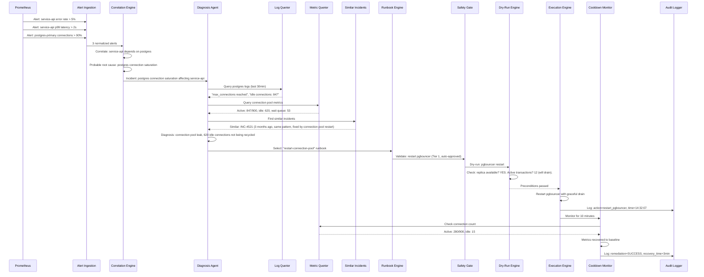
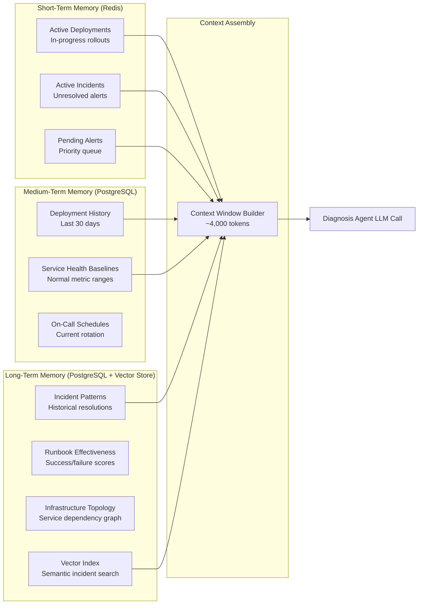
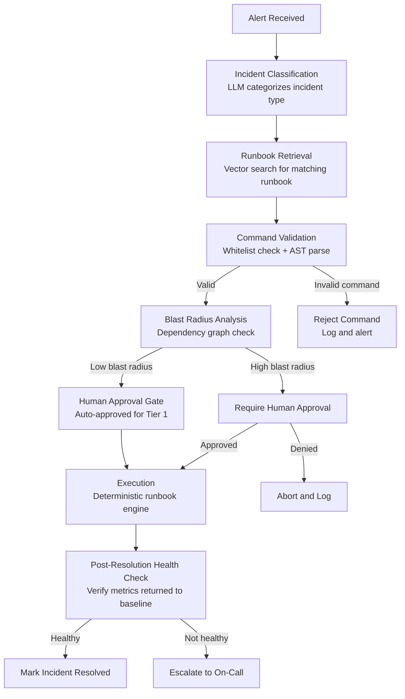

# Autonomous DevOps Agent

An autonomous DevOps agent that ingests alerts from monitoring systems, correlates them into incidents, uses LLM-powered diagnosis to identify root causes, selects pre-approved remediation runbooks, and executes them through deterministic safety gates -- all within 60 seconds of alert ingestion, with blast radius limits that ensure the agent never makes an outage worse.

---

## Problem Statement

> Design an AI agent that monitors production infrastructure, diagnoses incidents, and takes remediation actions. It should handle alerts from monitoring systems, investigate root causes, and either auto-remediate or escalate to on-call engineers with a detailed analysis.

---

## Clarifying Questions to Ask

1. **Infrastructure scope** -- What is the infrastructure footprint? Kubernetes, VMs, serverless, or a mix? How many services and environments (production, staging, development)?
2. **Monitoring stack** -- Which monitoring tools are in place (Prometheus, Datadog, PagerDuty, CloudWatch)? Are structured logs available in a queryable system (Elasticsearch, Loki)?
3. **Existing runbooks** -- Are there documented runbooks for common incidents? How many are formalized and how many are tribal knowledge?
4. **Risk tolerance** -- What auto-remediation actions are acceptable without human approval? Is there a service tier system (critical services vs. internal tools) that affects risk tolerance?
5. **Incident volume** -- How many alerts per day? What is the noise-to-signal ratio? What percentage of alerts are actionable?
6. **Team structure** -- How large is the on-call rotation? What is the current mean time to resolution (MTTR)? What is the escalation policy?

---

## Requirements

### Functional Requirements

1. Ingest alerts from monitoring systems (Prometheus, PagerDuty, CloudWatch, Datadog)
2. Deduplicate and correlate alerts across services into coherent incidents
3. Diagnose root causes by querying logs, metrics, traces, and deployment history
4. Select appropriate remediation runbooks based on diagnosis
5. Execute low-risk remediations automatically with safety gates
6. Escalate high-risk incidents to on-call engineers with structured analysis
7. Learn from past incidents by indexing resolved incidents for similarity search

### Non-Functional Requirements

| Requirement | Target |
|-------------|--------|
| Time to first investigation step | < 60 seconds from alert |
| Auto-remediation safety | Reversible, bounded, audited |
| False positive remediation rate | < 1% (must not take action on misdiagnosed incidents) |
| Audit trail | 100% of actions logged with timestamps |
| Availability | 99.99% (the agent must be more available than the systems it monitors) |
| Escalation response | Structured analysis delivered to on-call within 90 seconds |

### Out of Scope

- Capacity planning and predictive scaling
- Security incident response (SOC automation)
- Infrastructure provisioning and configuration management
- Cost optimization recommendations

---

## High-Level Architecture



### Architecture Walkthrough

The architecture enforces a strict boundary between LLM-powered diagnosis (allowed to reason, investigate, and suggest) and deterministic remediation (pre-approved scripts with safety checks).

The **Alert Processing** layer handles the first critical step: turning noisy alert streams into actionable incidents. The Alert Ingestion Service receives webhooks from all monitoring systems and normalizes them into a common alert format. The Deduplication Engine uses alert fingerprinting (source + metric + threshold + service) to collapse duplicate alerts into a single entry. The Correlation Engine groups related alerts into incidents -- for example, if a database goes down, it correlates the database alert with the downstream service error rate alerts and the user-facing latency alerts into one incident. The Suppression Engine detects alert storms (more than 50 alerts in 5 minutes from related services) and suppresses duplicate noise while preserving the root cause alert.

The **Diagnosis Layer** is LLM-powered and investigative. The Diagnosis Agent receives a correlated incident and begins investigation using tools: it queries logs for error patterns around the incident time, pulls metric graphs for the affected services, checks recent deployments for correlation with the incident onset, and retrieves similar past incidents from the vector store. The LLM synthesizes these data sources into a root cause hypothesis with supporting evidence. If similar past incidents are found, the agent considers those resolutions as strong hints for the current incident.

The **Remediation Layer** is entirely deterministic. The Runbook Engine stores pre-approved remediation procedures as parameterized workflows. Each runbook has preconditions (which incidents it applies to), parameters (e.g., service name, number of replicas), execution steps, rollback procedures, and a defined blast radius. The Safety Gate validates the proposed action: is the blast radius acceptable for auto-execution? Are all preconditions met? Has this action been approved for this service tier? Low-blast-radius actions (restart a single pod, clear a cache) are auto-approved and proceed to dry-run validation. High-blast-radius actions (roll back a production deployment, scale down a cluster) require human approval.

The **Escalation Service** packages the agent's investigation into a structured incident report for the on-call engineer: the correlated alerts, the root cause hypothesis with supporting evidence, similar past incidents and their resolutions, and the agent's recommended action (if it could not auto-remediate). This report saves the on-call engineer 10-15 minutes of initial triage.

The **Learning and Feedback** layer closes the loop. Every resolved incident (whether auto-remediated or human-resolved) is indexed in the incident database with the final root cause, resolution steps, and outcome. The vector index enables similarity search: when a new incident occurs, the agent retrieves past incidents with similar alert patterns, error messages, and affected services. The Cooldown Monitor watches metrics for 10 minutes after any remediation action to verify the fix was effective; if metrics do not improve, it escalates to the on-call engineer.

---

## Component Design

### 1. Alert Correlation Engine

The Correlation Engine is critical for reducing noise and enabling accurate diagnosis. It uses two correlation strategies: rule-based correlation (e.g., "if database X is down and services A, B, C that depend on database X have elevated error rates, group into one incident") and ML-based correlation (trained on historical incident data to learn which alert patterns co-occur). The rule-based layer handles known service dependency patterns with high precision. The ML layer catches emergent patterns that are not covered by static rules.

The engine maintains a service dependency graph (extracted from service mesh configuration or API gateway routing rules) that maps which services depend on which. When an alert fires for a service, the engine checks downstream services for correlated alerts within a 5-minute window. Correlated alerts are grouped into an incident with a designated "probable root cause" service (the highest in the dependency chain).

### 2. Diagnosis Agent (LLM)

The Diagnosis Agent operates as a tool-using LLM agent. Its system prompt includes the incident context (correlated alerts, affected services, timeline) and instructions to investigate using available tools. The agent follows a diagnostic methodology: (1) check for recent deployments that correlate with incident onset, (2) query logs for error patterns, (3) check resource metrics (CPU, memory, disk, network), (4) check dependencies (database, cache, external APIs), (5) retrieve similar past incidents.

The agent's output is a structured diagnosis: root cause hypothesis, supporting evidence (specific log lines, metric values, deployment timestamps), confidence level, and recommended remediation. If the agent cannot determine the root cause with sufficient confidence, it explicitly states "unable to determine root cause" and lists what it investigated and what additional data would help -- this is then included in the escalation report.

The agent is constrained to investigation only. It queries data sources (read-only access to logs, metrics, traces, and deployment history) but cannot take any remediation action directly. This separation ensures that LLM reasoning errors remain in the analysis domain and never cause infrastructure changes.

### 3. Similar Incident Retriever

Every resolved incident is embedded as a vector using a combination of: alert types, error messages, affected services, time-of-day patterns, and resolution steps. When a new incident occurs, the retriever finds the top 5 most similar past incidents and presents them to the Diagnosis Agent. Each similar incident includes: when it happened, what the root cause was, what remediation was applied, and whether the remediation was successful.

This is the agent's institutional memory. Over time, as more incidents are resolved and indexed, the agent's diagnostic accuracy improves because it can leverage historical patterns. A new on-call engineer benefits from the accumulated knowledge of every past incident, reducing the knowledge gap between senior and junior engineers.

### 4. Safety Gate (Deterministic)

The Safety Gate is the boundary between diagnosis and action. It enforces blast radius limits using a tiered approval system:

- **Tier 1 (Auto-Approved)**: Restart a single pod, clear a cache, increase replica count by 1-2, retry a failed job. These actions are low-risk, reversible, and bounded. The blast radius is a single service instance.
- **Tier 2 (Auto-Approved with Monitoring)**: Scale a service horizontally (up to 2x current count), toggle a feature flag off, redirect traffic from one region. These actions have moderate scope and require the Cooldown Monitor to verify effectiveness.
- **Tier 3 (Human Approval Required)**: Roll back a deployment, scale down a cluster, modify database configuration, restart a database, modify load balancer rules. These actions have large blast radius or are potentially irreversible.

The Safety Gate also enforces rate limits: no more than 3 auto-remediation actions per service per hour, and no more than 10 total auto-remediation actions per hour across all services. This prevents cascading automated actions from compounding an outage.

### 5. Dry-Run Engine

Before executing any auto-approved action, the Dry-Run Engine simulates the execution and presents what would happen. For a pod restart, it verifies: the pod exists, the service has sufficient replicas to tolerate the restart, there are no pending deployments, and the health check endpoint is responding on other replicas. For a scaling action, it verifies: the cluster has sufficient resources (CPU, memory) to schedule additional pods, the autoscaler is not already scaling, and the service's resource requests are within node capacity.

The dry-run output is logged in the audit trail. If any precondition check fails, the action is blocked and escalated to the on-call engineer with the specific failure reason.

### 6. Cooldown Monitor

After any remediation action, the Cooldown Monitor watches the affected service's metrics for 10 minutes. It checks: has the error rate returned to baseline? Has latency recovered? Is the service healthy according to its health check? If metrics improve within 5 minutes, the remediation is marked as successful. If metrics do not improve or worsen, the monitor triggers an escalation: "Auto-remediation attempted [action] at [time]. Metrics have not improved. Escalating for manual investigation." The monitor also checks for new alerts from the affected service during the cooldown period, which might indicate the remediation caused a new problem.

---

## Data Flow



### Happy Path Walkthrough

Prometheus fires three alerts within a 2-minute window: service-api error rate exceeds 5%, service-api p99 latency exceeds 2 seconds, and postgres-primary connections exceed 90%. The Alert Ingestion Service normalizes all three alerts. The Correlation Engine checks the service dependency graph: service-api depends on postgres-primary. The three alerts are correlated into a single incident with postgres connection saturation as the probable root cause.

The Diagnosis Agent begins investigation within 10 seconds of alert ingestion. It queries postgres logs and finds "max_connections reached" errors and 847 idle connections. It queries connection pool metrics and confirms 620 idle connections are not being recycled. It retrieves similar past incidents and finds INC-4521 from 3 months ago with the same pattern, resolved by restarting the connection pooler (pgbouncer).

The agent diagnoses a connection pool leak (idle connections accumulating without being recycled) and selects the "restart-connection-pool" runbook. The Safety Gate classifies this as Tier 1 (pgbouncer restart is low-blast-radius: it gracefully drains active connections and restarts, taking approximately 2 seconds). The Dry-Run Engine verifies a replica pgbouncer is available and that active transactions will drain gracefully.

The Execution Engine restarts pgbouncer. Within 3 minutes, connection count drops from 847 to 280, error rate returns to baseline, and latency recovers. The Cooldown Monitor marks the remediation as successful. Total time from first alert to resolution: 4 minutes, with zero human intervention.

### Error/Edge Case Path

During a major deployment rollout, 40 services simultaneously report elevated error rates. The Suppression Engine detects the alert storm (40+ alerts in 2 minutes from related services) and suppresses downstream noise, preserving the deployment event as the probable root cause. The Diagnosis Agent correlates the incident onset with the deployment timestamp (ArgoCD reports a deployment to service-core 90 seconds before the first alert).

The agent diagnoses a bad deployment and recommends rollback. The Safety Gate classifies a production deployment rollback as Tier 3 (high blast radius, human approval required). The Escalation Service packages the full analysis into a structured report: "Root cause: deployment v2.14.3 of service-core introduced a regression. 40 downstream services affected. Recommended action: rollback to v2.14.2. Evidence: error rate spike correlates exactly with deployment timestamp; no other changes in the deployment window." The report is delivered to the on-call engineer via PagerDuty and Slack within 90 seconds of the first alert. The engineer reviews the evidence, approves the rollback, and the Runbook Engine executes it.

---

## Scaling Considerations

The agent must be more reliable than the systems it monitors. It runs in a separate failure domain (different Kubernetes cluster, different cloud region if possible) with its own monitoring (self-monitoring via a simple health check that does not depend on the main monitoring stack).

**Alert volume scaling**: During major outages, alert volume can spike 100x. The Deduplication and Suppression engines handle this by collapsing duplicate alerts and suppressing storm noise. The Diagnosis Agent uses a priority queue with concurrency limits: maximum 5 concurrent incident diagnoses, prioritized by service tier (critical services first).

**Log and metric query scaling**: The Diagnosis Agent queries large volumes of logs and metrics during investigation. To prevent the agent from overwhelming the logging infrastructure during an outage (when logs are already under heavy load), queries are rate-limited and use sampling for high-volume log streams. The agent queries the most recent 30 minutes of data first and expands the window only if needed.

**Incident knowledge base scaling**: As the incident database grows (thousands of incidents over months), the similarity search remains fast because vector search is sublinear. The vector index is rebuilt weekly to incorporate newly resolved incidents. Retrieval is scoped to the same service or service group to keep results relevant.

**Multi-cluster support**: For organizations with multiple Kubernetes clusters or cloud regions, the agent runs one diagnosis pipeline per cluster with a global correlation layer that detects cross-cluster incidents (e.g., a shared database affecting services in multiple clusters).

---

## Cost Analysis

| Component | Specification | Monthly Cost |
|-----------|--------------|-------------|
| Agent infrastructure (3 replicas, separate cluster) | Diagnosis + execution services | $1,500 |
| LLM API calls (diagnosis) | ~3,000 incidents/month, avg $0.05/diagnosis | $150 |
| Vector store (incident knowledge base) | Milvus / pgvector, 10K incidents | $100 |
| Log/metric query costs | Elasticsearch/Prometheus API calls | $200 |
| Monitoring stack integration | Webhook receivers, API connectors | $100 |
| **Total monthly** | | **$2,050** |

The cost justification is straightforward: if the agent reduces mean time to resolution by 10 minutes per incident, and the organization has 200 incidents per month with an average revenue impact of $500 per minute of downtime, the agent saves $1M per month in reduced downtime. Even a 5% improvement in MTTR pays for the system many times over.

---

## Data Layer Deep Dive

### Database Selection Justification

Each data store in the architecture was chosen for a specific reason tied to the workload it serves. The table below summarizes the selection rationale and the alternatives that were evaluated and rejected.

| Store | Technology | Why This Choice | Alternative Considered | Why Not |
|-------|-----------|----------------|----------------------|---------|
| Deployment records, incident history, audit trail | PostgreSQL | ACID guarantees for deployment state -- cannot lose track of a half-completed rollout; JSONB for heterogeneous infrastructure state (different cloud resources have different attributes); row-level security for multi-team isolation | MongoDB | Flexible schema for varied infra configs, but deployment state machines are inherently sequential and relational -- steps depend on prior steps; MongoDB's eventual consistency is unacceptable for deployment state where a missed step means a broken rollout |
| Real-time infrastructure state and alert deduplication | Redis | Sub-millisecond reads for current service health status; TTL for auto-expiring transient alerts without manual cleanup; sorted sets for priority-based alert queues that surface critical alerts first | In-memory only | Loses state during agent restart; misses alerts that arrive during a restart window; no persistence means an agent crash during an incident causes total context loss |
| Infrastructure metrics | TimescaleDB | Purpose-built time-series queries on CPU, memory, latency, and error rates; continuous aggregates for dashboards without expensive re-computation; hypertables with automatic partitioning by time | Prometheus | Good for metrics collection and alerting, but lacks SQL joins -- correlating metrics with deployment events and incidents requires relational queries that Prometheus cannot express; TimescaleDB enables queries like "show error rate around the time of each deployment" |
| Deployment artifacts and logs | Object Storage (S3) | Terraform state files, deployment logs, and rollback snapshots are large and append-heavy; S3 scales independently of the database; versioned buckets provide audit trail for every artifact revision | Database storage (PostgreSQL large objects) | Logs and artifacts are too large for database storage; a single deployment log can exceed 100MB; S3 scales to petabytes without affecting database query performance |

### Schema Design

The following schemas define the core data model. Each table includes its indexes with justification for why each index exists.

#### deployments

Tracks each deployment through its lifecycle, including rollback capability and health check results.

```sql
CREATE TABLE deployments (
    id UUID PRIMARY KEY DEFAULT gen_random_uuid(),
    service_name VARCHAR(128) NOT NULL,
    environment VARCHAR(20) NOT NULL CHECK (environment IN ('production', 'staging', 'development')),
    version VARCHAR(64) NOT NULL,
    previous_version VARCHAR(64),
    strategy VARCHAR(20) NOT NULL CHECK (strategy IN ('rolling', 'blue-green', 'canary')),
    status VARCHAR(20) NOT NULL DEFAULT 'pending'
        CHECK (status IN ('pending', 'in_progress', 'succeeded', 'failed', 'rolled_back')),
    initiated_by VARCHAR(128) NOT NULL,
    approval_status VARCHAR(20) DEFAULT 'pending'
        CHECK (approval_status IN ('pending', 'approved', 'rejected', 'auto_approved')),
    health_check_result JSONB DEFAULT '{}',
    rollback_triggered BOOLEAN DEFAULT false,
    created_at TIMESTAMPTZ NOT NULL DEFAULT now(),
    completed_at TIMESTAMPTZ
);

-- Deployment history for a service in a specific environment, most recent first
CREATE INDEX idx_deployments_service_env ON deployments(service_name, environment, created_at DESC);

-- Find all deployments that were rolled back (rollback rate analysis)
CREATE INDEX idx_deployments_rollback ON deployments(rollback_triggered, created_at DESC)
    WHERE rollback_triggered = true;

-- Active deployments that have not yet completed (in-progress monitoring)
CREATE INDEX idx_deployments_active ON deployments(status, created_at)
    WHERE status IN ('pending', 'in_progress');
```

**Index rationale**:
- `idx_deployments_service_env` -- The Diagnosis Agent queries deployment history for a specific service and environment when correlating incidents with recent changes. The composite index on `(service_name, environment, created_at DESC)` serves this query as an index-only scan with no sort required.
- `idx_deployments_rollback` -- Rollback rate analysis requires scanning only deployments that triggered rollbacks. The partial index avoids scanning the vast majority of successful deployments.
- `idx_deployments_active` -- The agent monitors in-progress deployments for health check failures. The partial index covers only active deployments, which are typically fewer than 1% of all records.

#### incidents

Tracks incident lifecycle from alert to resolution, including whether the agent resolved it automatically.

```sql
CREATE TABLE incidents (
    id UUID PRIMARY KEY DEFAULT gen_random_uuid(),
    service_name VARCHAR(128) NOT NULL,
    severity VARCHAR(10) NOT NULL CHECK (severity IN ('critical', 'high', 'medium', 'low')),
    alert_source VARCHAR(50) NOT NULL,
    description TEXT NOT NULL,
    root_cause TEXT,
    resolution_steps JSONB DEFAULT '[]',
    auto_resolved BOOLEAN DEFAULT false,
    resolution_time_ms BIGINT,
    created_at TIMESTAMPTZ NOT NULL DEFAULT now(),
    resolved_at TIMESTAMPTZ
);

-- Incident history for a service, most recent first (used by Diagnosis Agent)
CREATE INDEX idx_incidents_service ON incidents(service_name, created_at DESC);

-- MTTR analysis by severity (aggregate queries for dashboards)
CREATE INDEX idx_incidents_severity ON incidents(severity, resolved_at)
    WHERE resolved_at IS NOT NULL;

-- Find unresolved incidents (active incident monitoring)
CREATE INDEX idx_incidents_unresolved ON incidents(created_at DESC)
    WHERE resolved_at IS NULL;
```

**Index rationale**:
- `idx_incidents_service` -- The Similar Incident Retriever queries past incidents for a specific service to find resolution patterns. This composite index serves that lookup efficiently.
- `idx_incidents_severity` -- MTTR dashboards group by severity and filter to resolved incidents. The composite index with a filter on resolved incidents avoids scanning open incidents that have no resolution time.
- `idx_incidents_unresolved` -- The agent continuously monitors unresolved incidents. The partial index covers only open incidents, which are a small fraction of the total.

#### infrastructure_state

Captures the current and desired state of every managed resource for drift detection.

```sql
CREATE TABLE infrastructure_state (
    id UUID PRIMARY KEY DEFAULT gen_random_uuid(),
    resource_type VARCHAR(64) NOT NULL,
    resource_id VARCHAR(256) NOT NULL,
    cloud_provider VARCHAR(20) NOT NULL CHECK (cloud_provider IN ('aws', 'gcp', 'azure', 'on_prem')),
    region VARCHAR(50) NOT NULL,
    current_state JSONB NOT NULL DEFAULT '{}',
    desired_state JSONB NOT NULL DEFAULT '{}',
    drift_detected BOOLEAN DEFAULT false,
    last_synced_at TIMESTAMPTZ NOT NULL DEFAULT now()
);

-- Lookup by resource identifier (unique constraint on cloud resource)
CREATE UNIQUE INDEX idx_infra_resource ON infrastructure_state(cloud_provider, resource_id);

-- Find all resources with drift (drift detection dashboard)
CREATE INDEX idx_infra_drift ON infrastructure_state(drift_detected, last_synced_at)
    WHERE drift_detected = true;

-- Stale resources that have not synced recently (sync health monitoring)
CREATE INDEX idx_infra_stale ON infrastructure_state(last_synced_at)
    WHERE last_synced_at < now() - INTERVAL '1 hour';
```

**Index rationale**:
- `idx_infra_resource` -- Each cloud resource is uniquely identified by provider and resource ID. The unique index enforces this constraint and serves direct lookups when the agent needs current state for a specific resource.
- `idx_infra_drift` -- The drift detection dashboard shows only resources that have drifted. The partial index avoids scanning the majority of resources that are in sync.
- `idx_infra_stale` -- Resources that have not synced recently may indicate a connectivity issue with the cloud provider. This index supports the sync health monitoring query.

#### runbook_executions

Records every automated runbook execution for audit and effectiveness analysis.

```sql
CREATE TABLE runbook_executions (
    id UUID PRIMARY KEY DEFAULT gen_random_uuid(),
    incident_id UUID NOT NULL REFERENCES incidents(id),
    runbook_name VARCHAR(128) NOT NULL,
    steps_executed JSONB NOT NULL DEFAULT '[]',
    outcome VARCHAR(20) NOT NULL CHECK (outcome IN ('success', 'failure', 'partial', 'aborted')),
    was_manual_override BOOLEAN DEFAULT false,
    created_at TIMESTAMPTZ NOT NULL DEFAULT now()
);

-- Execution history for a specific incident (audit trail)
CREATE INDEX idx_runbook_incident ON runbook_executions(incident_id, created_at);

-- Runbook effectiveness analysis (success rate per runbook)
CREATE INDEX idx_runbook_name_outcome ON runbook_executions(runbook_name, outcome);
```

**Index rationale**:
- `idx_runbook_incident` -- The audit trail requires loading all runbook executions for a given incident. The composite index serves this join efficiently.
- `idx_runbook_name_outcome` -- Runbook effectiveness queries group by runbook name and count outcomes. This composite index enables an index-only scan for the aggregation.

### Key Queries

These are the actual queries the system executes in production, not simplified examples.

**1. Deployment history with rollback rate**

Used by the operations dashboard to track deployment reliability per service.

```sql
SELECT service_name,
       environment,
       COUNT(*) AS total_deployments,
       COUNT(*) FILTER (WHERE rollback_triggered = true) AS rollbacks,
       ROUND(
           100.0 * COUNT(*) FILTER (WHERE rollback_triggered = true) / COUNT(*),
           2
       ) AS rollback_rate_pct
FROM deployments
WHERE created_at >= now() - INTERVAL '30 days'
GROUP BY service_name, environment
ORDER BY rollback_rate_pct DESC;
```

This query uses PostgreSQL's `FILTER` clause to count rollbacks within the same aggregation pass, avoiding a self-join. The 30-day window keeps the scan bounded. Services with high rollback rates are flagged for deployment pipeline review.

**2. Mean time to resolution (MTTR) by service**

Used by the SRE dashboard to track incident resolution performance and identify services that consistently take longer to resolve.

```sql
SELECT service_name,
       severity,
       COUNT(*) AS incident_count,
       ROUND(AVG(resolution_time_ms) / 1000.0, 1) AS avg_mttr_seconds,
       ROUND(PERCENTILE_CONT(0.50) WITHIN GROUP (ORDER BY resolution_time_ms) / 1000.0, 1) AS p50_mttr_seconds,
       ROUND(PERCENTILE_CONT(0.95) WITHIN GROUP (ORDER BY resolution_time_ms) / 1000.0, 1) AS p95_mttr_seconds,
       ROUND(100.0 * COUNT(*) FILTER (WHERE auto_resolved = true) / COUNT(*), 1) AS auto_resolve_pct
FROM incidents
WHERE resolved_at IS NOT NULL
  AND created_at >= now() - INTERVAL '90 days'
GROUP BY service_name, severity
ORDER BY avg_mttr_seconds DESC;
```

MTTR is reported as both p50 (typical) and p95 (worst case). The `auto_resolve_pct` column shows how effective the agent is at resolving incidents for each service -- a low percentage indicates the agent lacks runbooks for that service's failure modes.

**3. Infrastructure drift detection**

Used by the agent to identify resources whose current state has diverged from the desired state.

```sql
SELECT resource_type,
       resource_id,
       cloud_provider,
       region,
       current_state,
       desired_state,
       last_synced_at,
       now() - last_synced_at AS time_since_sync
FROM infrastructure_state
WHERE drift_detected = true
ORDER BY last_synced_at ASC;
```

Resources are ordered by sync time (oldest first) so that the longest-standing drifts are addressed first. The agent compares `current_state` and `desired_state` JSONB fields to generate a diff that describes exactly what changed.

**4. Runbook effectiveness (auto-resolution rate)**

Used by the platform team to evaluate which runbooks are working and which need revision.

```sql
SELECT r.runbook_name,
       COUNT(*) AS total_executions,
       COUNT(*) FILTER (WHERE r.outcome = 'success') AS successes,
       COUNT(*) FILTER (WHERE r.outcome = 'failure') AS failures,
       ROUND(100.0 * COUNT(*) FILTER (WHERE r.outcome = 'success') / COUNT(*), 1) AS success_rate_pct,
       ROUND(AVG(i.resolution_time_ms) FILTER (WHERE r.outcome = 'success') / 1000.0, 1) AS avg_resolution_seconds
FROM runbook_executions r
JOIN incidents i ON r.incident_id = i.id
WHERE r.created_at >= now() - INTERVAL '30 days'
GROUP BY r.runbook_name
ORDER BY total_executions DESC;
```

Runbooks with a success rate below 70% are flagged for review. The join with incidents provides resolution time context -- a runbook that succeeds but takes 30 minutes is less valuable than one that resolves in 2 minutes.

---

## Agent Memory Architecture

Memory management in a DevOps agent differs fundamentally from conversational agents. The agent does not maintain a dialogue with a user -- it maintains operational context about infrastructure, active incidents, and ongoing deployments. Its memory model is optimized for operational awareness rather than conversational continuity.

### Memory Tiers



**Short-term memory (Redis)** holds the agent's immediate operational awareness: deployments currently in progress (service, version, strategy, current step), active incidents that have not yet been resolved, and the pending alert queue ordered by severity. This data changes on every agent cycle (every few seconds) and requires sub-millisecond reads. Redis TTLs auto-expire completed deployments and resolved incidents after 1 hour, keeping the working set small.

**Medium-term memory (PostgreSQL)** holds context that changes daily or weekly: the deployment history for the last 30 days (used to correlate incidents with recent changes), service health baselines (normal CPU, memory, error rate, and latency ranges for each service -- used to determine whether current metrics are anomalous), and the current on-call schedule (who to page when escalation is needed). This data is queried at the start of each incident diagnosis, not on every agent cycle.

**Long-term memory (PostgreSQL + vector store)** holds institutional knowledge: historical incident patterns (how past incidents of each type were resolved), runbook effectiveness scores (which runbooks succeed and which fail for each service), and the infrastructure topology graph (service dependencies, cloud resource relationships). The vector store indexes resolved incidents as embeddings, enabling semantic similarity search when a new incident occurs.

### Context Window Strategy

The Diagnosis Agent operates with a compact context window of approximately 4,000 tokens per LLM call. DevOps diagnosis does not require large context windows -- the agent needs structured data (metrics, service names, error codes), not lengthy prose.

| Context Component | Token Budget | Source |
|-------------------|-------------|--------|
| System rules + safety constraints | ~1,000 tokens (fixed) | Static configuration |
| Current infrastructure state | ~800 tokens (affected services, current metrics) | Redis + TimescaleDB |
| Active incidents | ~500 tokens (correlated alerts, timeline) | Redis |
| Recent deployments | ~500 tokens (last 3 deployments for affected services) | PostgreSQL |
| Retrieved runbooks + similar incidents | ~1,200 tokens (top 3 matches) | Vector store + PostgreSQL |
| **Total per diagnosis** | **~4,000 tokens** | |

This budget is deliberately conservative. DevOps diagnosis is data-driven, not conversational -- the agent needs structured metrics and logs, not long text passages. Keeping the context window small reduces cost per diagnosis to approximately $0.05 and reduces latency to under 3 seconds.

### Incident Pattern Matching (Episodic Memory)

Past incidents serve as the agent's episodic memory. When an incident is resolved, it is embedded as a vector using a combination of: alert types, error messages, affected services, time-of-day patterns, metric anomalies, and the resolution that was applied. This embedding captures the "shape" of the incident, not just its keywords.

When a new incident occurs, the agent retrieves the top 5 most similar past incidents from the vector store. Each retrieved incident includes: the root cause, the resolution steps, whether the resolution was automated or manual, and the resolution time. If a past incident with a similarity score above 0.85 was auto-resolved successfully, the agent has strong evidence that the same runbook will work again.

This is the DevOps equivalent of an experienced SRE who says "I have seen this exact pattern before -- last time it was a connection pool leak and we fixed it by restarting pgbouncer." The vector store encodes that experience for every incident the team has ever resolved.

---

## Hallucination Mitigation

In a DevOps context, hallucinations are not merely inaccurate -- they are operationally dangerous. A hallucinated shell command can delete production data. A fabricated health status can cause the agent to declare an outage resolved while it is still active. A made-up runbook step can worsen an incident. The system employs five layers of defense, each targeting a specific hallucination category.

### Hallucination Prevention Pipeline



### Layer 1: Command Hallucination Prevention

The agent generates shell commands that do not exist or have incorrect flags -- for example, `kubectl delete namespace production` when the intended command was `kubectl rollout restart`. The mitigation is structural: **validate all generated commands against a whitelist of allowed commands; parse the command AST; reject unknown commands**.

The whitelist is maintained as a configuration file that maps each allowed command to its permitted flags, argument patterns, and target scope. For example, `kubectl rollout restart` is allowed for any deployment in any namespace, but `kubectl delete` is only allowed for pods (not deployments, namespaces, or persistent volume claims). Commands that do not appear in the whitelist are rejected outright. Commands that appear but with disallowed flags are rejected with a specific explanation ("flag --force is not permitted for kubectl delete"). No unvalidated command is ever executed.

### Layer 2: Infrastructure State Fabrication Prevention

The agent claims a service is healthy when it is not, or reports metrics that do not match reality. The mitigation is architectural: **all infrastructure state comes from monitoring tools (Prometheus, CloudWatch), never from LLM inference**. The LLM interprets state, it does not generate state.

When the Diagnosis Agent reports "service-api error rate is 12%," the system verifies this claim against the actual Prometheus metric. If the LLM's claim does not match the monitoring data (within a 5% tolerance for timing differences), the claim is flagged and the raw monitoring data is used instead. The LLM's role is to correlate and interpret metrics, not to report them -- it says "the error rate spike correlates with the deployment," but the actual error rate value is always sourced from the monitoring system.

### Layer 3: Runbook Hallucination Prevention

The agent invents resolution steps that are not in any approved runbook -- for example, suggesting "restart the database primary" when no such runbook exists. The mitigation is constraint-based: **resolution steps must match a retrieved runbook entry; free-form commands require human approval**.

The Runbook Engine stores every approved runbook as a parameterized template with specific steps, preconditions, and rollback procedures. When the Diagnosis Agent recommends a remediation, the system verifies that the recommendation maps to an existing runbook by name and that the parameters are within the runbook's defined bounds. If the agent suggests a remediation that does not match any runbook, the suggestion is logged but not executed -- it is included in the escalation report for the on-call engineer to evaluate manually.

### Layer 4: Blast Radius Underestimation Prevention

The agent claims a change is safe when it affects critical services or a large percentage of traffic. The mitigation is graph-based: **dependency graph analysis before any change -- check upstream and downstream services, number of affected users**.

Before executing any remediation, the Safety Gate traverses the service dependency graph to determine the full blast radius. A pod restart for a service with 50 replicas has a blast radius of 2% (1/50). A pod restart for a service with 2 replicas has a blast radius of 50%. The same action requires different approval tiers depending on context. Changes affecting more than 5% of traffic require human approval regardless of the action type. The dependency graph also checks downstream services: restarting a database connection pooler that serves 10 upstream services has a blast radius that includes all 10 services, not just the pooler itself.

### Layer 5: False All-Clear Prevention

The agent declares an incident resolved when it is not -- for example, the error rate dropped temporarily due to reduced traffic, not because the fix worked. The mitigation is temporal: **post-resolution health check -- verify metrics have returned to baseline, not just that the error stopped; wait for 2 consecutive health check intervals before marking resolved**.

The Cooldown Monitor runs health checks at 2-minute intervals after any remediation. It checks three conditions: (1) the error rate is within the service's baseline range, (2) latency has returned to baseline, and (3) no new alerts have fired for the affected service. All three conditions must be met for 2 consecutive intervals (4 minutes total) before the incident is marked as resolved. If any condition fails during the cooldown window, the incident remains open and the agent escalates to the on-call engineer with specific details about which metrics have not recovered.

:::warning Critical Design Principle
Hallucination mitigation in DevOps is not about content accuracy -- it is about operational safety. Every mitigation layer exists to prevent the agent from taking an action based on incorrect information. The LLM diagnoses and recommends; deterministic code validates and executes. This separation ensures that LLM reasoning errors remain in the analysis domain and never cause infrastructure changes.
:::

---

## Production Issues and Fixes

The following table documents production issues observed in autonomous DevOps agent deployments, their root causes, and the fixes applied. These are the issues that do not appear in architecture diagrams but dominate on-call rotations.

| Issue | Symptoms | Root Cause | Fix |
|-------|----------|-----------|-----|
| Agent executes destructive command in wrong environment | Production database receives a command intended for staging; data loss or service disruption | Environment variable misconfiguration or agent context window containing mixed environment references; the LLM selects the wrong target | Add environment validation gate: every command must include an explicit environment parameter that is validated against the current incident's environment before execution; require confirmation prompt for any production command; add environment-specific command prefixes that are verified at the execution layer |
| Alert storm overwhelms the agent | Hundreds of correlated alerts flood the agent simultaneously; diagnosis queue backs up; response time exceeds SLA; agent processes symptoms instead of root cause | A cascading failure triggers alerts from every downstream service; each alert is processed independently, consuming agent capacity on symptom alerts rather than the root cause | Implement alert deduplication with fingerprint-based grouping; add correlation window (group alerts from related services within a 5-minute window into a single incident); implement storm detection that triggers when more than 50 alerts arrive within 2 minutes -- suppress downstream noise and surface the highest-in-dependency-chain alert as the probable root cause |
| Runbook steps executed in wrong order | A runbook step that depends on a prior step fails because the prior step has not completed; partial execution leaves infrastructure in an inconsistent state | Steps were dispatched concurrently for performance, but some steps have implicit ordering dependencies not captured in the runbook definition | Add step dependency validation to every runbook definition; execute steps atomically in dependency order -- each step must report completion before the next step begins; add a rollback procedure that unwinds completed steps if a subsequent step fails |
| Agent triggers premature rollback | A canary deployment that is actually succeeding is rolled back; the new version never reaches full rollout | The agent checks health metrics too early in the canary window; initial metric noise (cold JVM, cache warming) is misinterpreted as a regression | Wait for the full health check window (configurable per service, default 5 minutes) before evaluating deployment health; ignore the first 2 minutes of metrics after a canary starts (warm-up period); require that error rate exceeds the baseline by more than 2 standard deviations (not just any increase) before triggering a rollback |
| Infrastructure drift false positives | The drift detection dashboard shows hundreds of drifted resources; investigation reveals they are ephemeral differences (instance IDs, timestamps, auto-generated tags) | The JSONB diff between current and desired state flags every field difference, including fields that are expected to differ | Add tolerance thresholds for ephemeral state differences; maintain an exclusion list of fields that are expected to differ per resource type (e.g., `instance_id`, `creation_timestamp`, `auto_scaling_group_instance_list`); only flag drift on fields that represent intentional configuration (e.g., `instance_type`, `security_groups`, `iam_role`) |
| Agent loops retrying a failed deployment | The agent retries a failed deployment indefinitely; each retry fails for the same reason; deployment pipeline is blocked; alerts continue firing | The retry logic has no upper bound; the underlying failure (e.g., insufficient cluster capacity, broken container image) is not transient and will never succeed on retry | Add a maximum retry limit of 3 attempts with exponential backoff (30 seconds, 2 minutes, 8 minutes); after 3 consecutive failures, mark the deployment as permanently failed and escalate to the on-call engineer with the specific failure reason from each attempt; add circuit breaker that blocks new deployments for the same service until the failure is investigated |
| Stale on-call routing | Incidents are escalated to engineers who are no longer on-call; response time increases because the paged engineer must re-route the incident manually | The on-call schedule was cached at agent startup and not refreshed; schedule changes (swaps, overrides) are not reflected | Sync the on-call schedule from PagerDuty or OpsGenie every 5 minutes via API polling; cache the schedule in Redis with a 5-minute TTL; on cache miss, perform a synchronous API call to fetch the current on-call; log every escalation with the on-call engineer's name and the schedule version used |

:::tip Operational Readiness
Before launching an autonomous DevOps agent, build runbooks for each issue in this table. The first month of production will surface at least three of these problems. Start the agent in observation-only mode (diagnose and recommend, but do not execute) for the first 2 weeks. Graduate to auto-execution for Tier 1 actions only after validating that diagnosis accuracy exceeds 95% on historical incidents.
:::

---

## Trade-offs & Alternatives

| Decision | Rationale | Alternative | Why Not |
|----------|-----------|-------------|---------|
| LLM for diagnosis, deterministic runbooks for remediation | LLM reasoning errors stay in the analysis domain and never cause infrastructure changes; pre-approved runbooks have known, tested behavior | LLM generates remediation scripts dynamically | An LLM-generated script could contain errors that worsen the outage; a hallucinated kubectl command could delete production resources; the risk is unacceptable |
| Blast radius tiering (auto-approve low, human-approve high) | Enables fast auto-remediation for common, safe actions while protecting against high-risk mistakes | Require human approval for all actions | Adds 5-15 minutes to every incident (on-call response time); defeats the purpose of autonomous remediation for routine incidents (pod restarts, cache clears) |
| Similar incident retrieval from vector store | Leverages institutional memory; new on-call engineers benefit from past resolutions; diagnosis accuracy improves over time | Diagnose every incident from scratch | Misses patterns that repeat monthly; slower diagnosis; does not learn from experience; on-call engineers already do this mentally but inconsistently |
| Dry-run validation before execution | Catches precondition failures (insufficient replicas, pending deployments) before taking action; prevents remediation from worsening the situation | Execute immediately after safety gate approval | A restart when only 1 replica is running causes a full outage; dry-run catches this and escalates instead of executing |
| Alert deduplication and storm suppression | Prevents the agent from being overwhelmed during major outages; focuses diagnosis on root cause rather than symptoms | Process every alert independently | 40 correlated alerts would spawn 40 independent diagnoses, each querying logs and metrics, overwhelming both the agent and the monitoring infrastructure |
| Cooldown monitoring post-remediation | Verifies the fix worked; detects if remediation caused new problems; provides confidence that auto-remediation is safe to continue using | Fire-and-forget execution | No feedback on whether the action helped; if the remediation failed or caused a new problem, the on-call engineer discovers it minutes later through new alerts rather than a structured escalation |

---

## Interview Tips

:::tip How to Present This (35 minutes)
- **Minutes 1-5**: Clarify requirements. Ask about infrastructure scope, existing monitoring tools, risk tolerance for auto-remediation, and incident volume. State the core design principle: "The LLM diagnoses, deterministic code remediates. The agent must never make an outage worse."
- **Minutes 5-15**: Draw the architecture. Walk through the flow from alert ingestion to remediation or escalation. Emphasize three layers: Alert Processing (deduplication, correlation, suppression), Diagnosis (LLM-powered investigation with read-only data access), and Remediation (deterministic runbooks with safety gates). The Safety Gate is the key architectural boundary.
- **Minutes 15-25**: Deep dive into the Correlation Engine (how service dependency graphs enable accurate root cause identification), the Safety Gate (tiered blast radius with specific examples of each tier), and the Similar Incident Retriever (how institutional memory improves diagnosis over time). Walk through the sequence diagram showing a complete incident lifecycle.
- **Minutes 25-30**: Discuss scaling (agent availability requirements, alert storm handling, multi-cluster support), cost analysis (frame it as MTTR reduction ROI), and the Cooldown Monitor (post-remediation verification as a safety net).
- **Minutes 30-35**: Handle follow-ups. Common questions: "What if the agent misdiagnoses and executes the wrong runbook?" (dry-run catches precondition failures; low-blast-radius actions are reversible; cooldown monitor detects if metrics do not improve and escalates), "How do you handle cascading failures?" (correlation engine groups alerts; suppression prevents storm overwhelm; diagnosis focuses on root cause service), "How do you build trust in auto-remediation?" (start in dry-run-only mode for 2 weeks; graduate to auto-remediation for Tier 1 only; expand scope incrementally based on success rate).
:::
