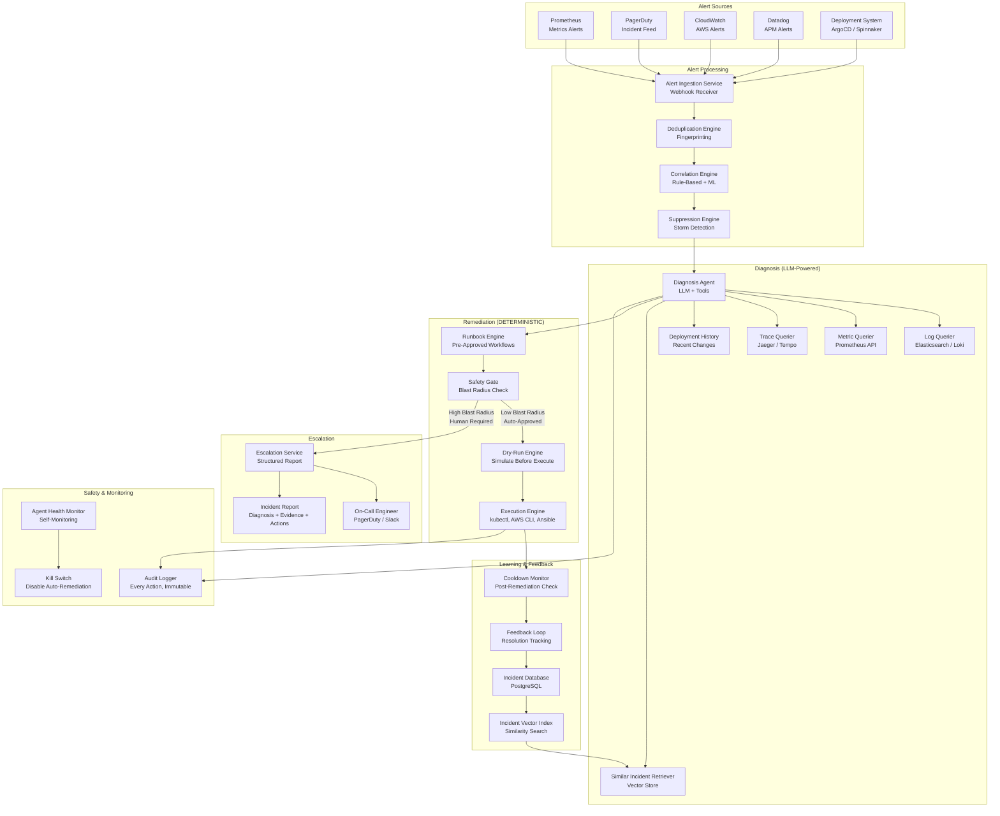
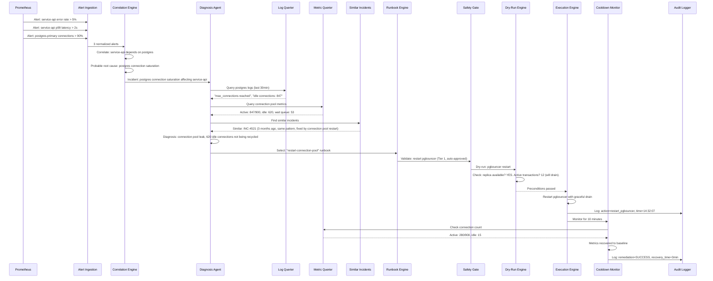

# Autonomous DevOps Agent

An autonomous DevOps agent that ingests alerts from monitoring systems, correlates them into incidents, uses LLM-powered diagnosis to identify root causes, selects pre-approved remediation runbooks, and executes them through deterministic safety gates -- all within 60 seconds of alert ingestion, with blast radius limits that ensure the agent never makes an outage worse.

---

## Problem Statement

> Design an AI agent that monitors production infrastructure, diagnoses incidents, and takes remediation actions. It should handle alerts from monitoring systems, investigate root causes, and either auto-remediate or escalate to on-call engineers with a detailed analysis.

---

## Clarifying Questions to Ask

1. **Infrastructure scope** -- What is the infrastructure footprint? Kubernetes, VMs, serverless, or a mix? How many services and environments (production, staging, development)?
2. **Monitoring stack** -- Which monitoring tools are in place (Prometheus, Datadog, PagerDuty, CloudWatch)? Are structured logs available in a queryable system (Elasticsearch, Loki)?
3. **Existing runbooks** -- Are there documented runbooks for common incidents? How many are formalized and how many are tribal knowledge?
4. **Risk tolerance** -- What auto-remediation actions are acceptable without human approval? Is there a service tier system (critical services vs. internal tools) that affects risk tolerance?
5. **Incident volume** -- How many alerts per day? What is the noise-to-signal ratio? What percentage of alerts are actionable?
6. **Team structure** -- How large is the on-call rotation? What is the current mean time to resolution (MTTR)? What is the escalation policy?

---

## Requirements

### Functional Requirements

1. Ingest alerts from monitoring systems (Prometheus, PagerDuty, CloudWatch, Datadog)
2. Deduplicate and correlate alerts across services into coherent incidents
3. Diagnose root causes by querying logs, metrics, traces, and deployment history
4. Select appropriate remediation runbooks based on diagnosis
5. Execute low-risk remediations automatically with safety gates
6. Escalate high-risk incidents to on-call engineers with structured analysis
7. Learn from past incidents by indexing resolved incidents for similarity search

### Non-Functional Requirements

| Requirement | Target |
|-------------|--------|
| Time to first investigation step | < 60 seconds from alert |
| Auto-remediation safety | Reversible, bounded, audited |
| False positive remediation rate | < 1% (must not take action on misdiagnosed incidents) |
| Audit trail | 100% of actions logged with timestamps |
| Availability | 99.99% (the agent must be more available than the systems it monitors) |
| Escalation response | Structured analysis delivered to on-call within 90 seconds |

### Out of Scope

- Capacity planning and predictive scaling
- Security incident response (SOC automation)
- Infrastructure provisioning and configuration management
- Cost optimization recommendations

---

## High-Level Architecture

### Architecture Walkthrough

The architecture enforces a strict boundary between LLM-powered diagnosis (allowed to reason, investigate, and suggest) and deterministic remediation (pre-approved scripts with safety checks).

The **Alert Processing** layer handles the first critical step: turning noisy alert streams into actionable incidents. The Alert Ingestion Service receives webhooks from all monitoring systems and normalizes them into a common alert format. The Deduplication Engine uses alert fingerprinting (source + metric + threshold + service) to collapse duplicate alerts into a single entry. The Correlation Engine groups related alerts into incidents -- for example, if a database goes down, it correlates the database alert with the downstream service error rate alerts and the user-facing latency alerts into one incident. The Suppression Engine detects alert storms (more than 50 alerts in 5 minutes from related services) and suppresses duplicate noise while preserving the root cause alert.

The **Diagnosis Layer** is LLM-powered and investigative. The Diagnosis Agent receives a correlated incident and begins investigation using tools: it queries logs for error patterns around the incident time, pulls metric graphs for the affected services, checks recent deployments for correlation with the incident onset, and retrieves similar past incidents from the vector store. The LLM synthesizes these data sources into a root cause hypothesis with supporting evidence. If similar past incidents are found, the agent considers those resolutions as strong hints for the current incident.

The **Remediation Layer** is entirely deterministic. The Runbook Engine stores pre-approved remediation procedures as parameterized workflows. Each runbook has preconditions (which incidents it applies to), parameters (e.g., service name, number of replicas), execution steps, rollback procedures, and a defined blast radius. The Safety Gate validates the proposed action: is the blast radius acceptable for auto-execution? Are all preconditions met? Has this action been approved for this service tier? Low-blast-radius actions (restart a single pod, clear a cache) are auto-approved and proceed to dry-run validation. High-blast-radius actions (roll back a production deployment, scale down a cluster) require human approval.

The **Escalation Service** packages the agent's investigation into a structured incident report for the on-call engineer: the correlated alerts, the root cause hypothesis with supporting evidence, similar past incidents and their resolutions, and the agent's recommended action (if it could not auto-remediate). This report saves the on-call engineer 10-15 minutes of initial triage.

The **Learning and Feedback** layer closes the loop. Every resolved incident (whether auto-remediated or human-resolved) is indexed in the incident database with the final root cause, resolution steps, and outcome. The vector index enables similarity search: when a new incident occurs, the agent retrieves past incidents with similar alert patterns, error messages, and affected services. The Cooldown Monitor watches metrics for 10 minutes after any remediation action to verify the fix was effective; if metrics do not improve, it escalates to the on-call engineer.

---

## Component Design

### 1. Alert Correlation Engine

The Correlation Engine is critical for reducing noise and enabling accurate diagnosis. It uses two correlation strategies: rule-based correlation (e.g., "if database X is down and services A, B, C that depend on database X have elevated error rates, group into one incident") and ML-based correlation (trained on historical incident data to learn which alert patterns co-occur). The rule-based layer handles known service dependency patterns with high precision. The ML layer catches emergent patterns that are not covered by static rules.

The engine maintains a service dependency graph (extracted from service mesh configuration or API gateway routing rules) that maps which services depend on which. When an alert fires for a service, the engine checks downstream services for correlated alerts within a 5-minute window. Correlated alerts are grouped into an incident with a designated "probable root cause" service (the highest in the dependency chain).

### 2. Diagnosis Agent (LLM)

The Diagnosis Agent operates as a tool-using LLM agent. Its system prompt includes the incident context (correlated alerts, affected services, timeline) and instructions to investigate using available tools. The agent follows a diagnostic methodology: (1) check for recent deployments that correlate with incident onset, (2) query logs for error patterns, (3) check resource metrics (CPU, memory, disk, network), (4) check dependencies (database, cache, external APIs), (5) retrieve similar past incidents.

The agent's output is a structured diagnosis: root cause hypothesis, supporting evidence (specific log lines, metric values, deployment timestamps), confidence level, and recommended remediation. If the agent cannot determine the root cause with sufficient confidence, it explicitly states "unable to determine root cause" and lists what it investigated and what additional data would help -- this is then included in the escalation report.

The agent is constrained to investigation only. It queries data sources (read-only access to logs, metrics, traces, and deployment history) but cannot take any remediation action directly. This separation ensures that LLM reasoning errors remain in the analysis domain and never cause infrastructure changes.

### 3. Similar Incident Retriever

Every resolved incident is embedded as a vector using a combination of: alert types, error messages, affected services, time-of-day patterns, and resolution steps. When a new incident occurs, the retriever finds the top 5 most similar past incidents and presents them to the Diagnosis Agent. Each similar incident includes: when it happened, what the root cause was, what remediation was applied, and whether the remediation was successful.

This is the agent's institutional memory. Over time, as more incidents are resolved and indexed, the agent's diagnostic accuracy improves because it can leverage historical patterns. A new on-call engineer benefits from the accumulated knowledge of every past incident, reducing the knowledge gap between senior and junior engineers.

### 4. Safety Gate (Deterministic)

The Safety Gate is the boundary between diagnosis and action. It enforces blast radius limits using a tiered approval system:

- **Tier 1 (Auto-Approved)**: Restart a single pod, clear a cache, increase replica count by 1-2, retry a failed job. These actions are low-risk, reversible, and bounded. The blast radius is a single service instance.
- **Tier 2 (Auto-Approved with Monitoring)**: Scale a service horizontally (up to 2x current count), toggle a feature flag off, redirect traffic from one region. These actions have moderate scope and require the Cooldown Monitor to verify effectiveness.
- **Tier 3 (Human Approval Required)**: Roll back a deployment, scale down a cluster, modify database configuration, restart a database, modify load balancer rules. These actions have large blast radius or are potentially irreversible.

The Safety Gate also enforces rate limits: no more than 3 auto-remediation actions per service per hour, and no more than 10 total auto-remediation actions per hour across all services. This prevents cascading automated actions from compounding an outage.

### 5. Dry-Run Engine

Before executing any auto-approved action, the Dry-Run Engine simulates the execution and presents what would happen. For a pod restart, it verifies: the pod exists, the service has sufficient replicas to tolerate the restart, there are no pending deployments, and the health check endpoint is responding on other replicas. For a scaling action, it verifies: the cluster has sufficient resources (CPU, memory) to schedule additional pods, the autoscaler is not already scaling, and the service's resource requests are within node capacity.

The dry-run output is logged in the audit trail. If any precondition check fails, the action is blocked and escalated to the on-call engineer with the specific failure reason.

### 6. Cooldown Monitor

After any remediation action, the Cooldown Monitor watches the affected service's metrics for 10 minutes. It checks: has the error rate returned to baseline? Has latency recovered? Is the service healthy according to its health check? If metrics improve within 5 minutes, the remediation is marked as successful. If metrics do not improve or worsen, the monitor triggers an escalation: "Auto-remediation attempted [action] at [time]. Metrics have not improved. Escalating for manual investigation." The monitor also checks for new alerts from the affected service during the cooldown period, which might indicate the remediation caused a new problem.

---

## Data Flow

### Happy Path Walkthrough

Prometheus fires three alerts within a 2-minute window: service-api error rate exceeds 5%, service-api p99 latency exceeds 2 seconds, and postgres-primary connections exceed 90%. The Alert Ingestion Service normalizes all three alerts. The Correlation Engine checks the service dependency graph: service-api depends on postgres-primary. The three alerts are correlated into a single incident with postgres connection saturation as the probable root cause.

The Diagnosis Agent begins investigation within 10 seconds of alert ingestion. It queries postgres logs and finds "max_connections reached" errors and 847 idle connections. It queries connection pool metrics and confirms 620 idle connections are not being recycled. It retrieves similar past incidents and finds INC-4521 from 3 months ago with the same pattern, resolved by restarting the connection pooler (pgbouncer).

The agent diagnoses a connection pool leak (idle connections accumulating without being recycled) and selects the "restart-connection-pool" runbook. The Safety Gate classifies this as Tier 1 (pgbouncer restart is low-blast-radius: it gracefully drains active connections and restarts, taking approximately 2 seconds). The Dry-Run Engine verifies a replica pgbouncer is available and that active transactions will drain gracefully.

The Execution Engine restarts pgbouncer. Within 3 minutes, connection count drops from 847 to 280, error rate returns to baseline, and latency recovers. The Cooldown Monitor marks the remediation as successful. Total time from first alert to resolution: 4 minutes, with zero human intervention.

### Error/Edge Case Path

During a major deployment rollout, 40 services simultaneously report elevated error rates. The Suppression Engine detects the alert storm (40+ alerts in 2 minutes from related services) and suppresses downstream noise, preserving the deployment event as the probable root cause. The Diagnosis Agent correlates the incident onset with the deployment timestamp (ArgoCD reports a deployment to service-core 90 seconds before the first alert).

The agent diagnoses a bad deployment and recommends rollback. The Safety Gate classifies a production deployment rollback as Tier 3 (high blast radius, human approval required). The Escalation Service packages the full analysis into a structured report: "Root cause: deployment v2.14.3 of service-core introduced a regression. 40 downstream services affected. Recommended action: rollback to v2.14.2. Evidence: error rate spike correlates exactly with deployment timestamp; no other changes in the deployment window." The report is delivered to the on-call engineer via PagerDuty and Slack within 90 seconds of the first alert. The engineer reviews the evidence, approves the rollback, and the Runbook Engine executes it.

---

## Scaling Considerations

The agent must be more reliable than the systems it monitors. It runs in a separate failure domain (different Kubernetes cluster, different cloud region if possible) with its own monitoring (self-monitoring via a simple health check that does not depend on the main monitoring stack).

**Alert volume scaling**: During major outages, alert volume can spike 100x. The Deduplication and Suppression engines handle this by collapsing duplicate alerts and suppressing storm noise. The Diagnosis Agent uses a priority queue with concurrency limits: maximum 5 concurrent incident diagnoses, prioritized by service tier (critical services first).

**Log and metric query scaling**: The Diagnosis Agent queries large volumes of logs and metrics during investigation. To prevent the agent from overwhelming the logging infrastructure during an outage (when logs are already under heavy load), queries are rate-limited and use sampling for high-volume log streams. The agent queries the most recent 30 minutes of data first and expands the window only if needed.

**Incident knowledge base scaling**: As the incident database grows (thousands of incidents over months), the similarity search remains fast because vector search is sublinear. The vector index is rebuilt weekly to incorporate newly resolved incidents. Retrieval is scoped to the same service or service group to keep results relevant.

**Multi-cluster support**: For organizations with multiple Kubernetes clusters or cloud regions, the agent runs one diagnosis pipeline per cluster with a global correlation layer that detects cross-cluster incidents (e.g., a shared database affecting services in multiple clusters).

---

## Cost Analysis

| Component | Specification | Monthly Cost |
|-----------|--------------|-------------|
| Agent infrastructure (3 replicas, separate cluster) | Diagnosis + execution services | $1,500 |
| LLM API calls (diagnosis) | ~3,000 incidents/month, avg $0.05/diagnosis | $150 |
| Vector store (incident knowledge base) | Milvus / pgvector, 10K incidents | $100 |
| Log/metric query costs | Elasticsearch/Prometheus API calls | $200 |
| Monitoring stack integration | Webhook receivers, API connectors | $100 |
| **Total monthly** | | **$2,050** |

The cost justification is straightforward: if the agent reduces mean time to resolution by 10 minutes per incident, and the organization has 200 incidents per month with an average revenue impact of $500 per minute of downtime, the agent saves $1M per month in reduced downtime. Even a 5% improvement in MTTR pays for the system many times over.

---

## Trade-offs & Alternatives

| Decision | Rationale | Alternative | Why Not |
|----------|-----------|-------------|---------|
| LLM for diagnosis, deterministic runbooks for remediation | LLM reasoning errors stay in the analysis domain and never cause infrastructure changes; pre-approved runbooks have known, tested behavior | LLM generates remediation scripts dynamically | An LLM-generated script could contain errors that worsen the outage; a hallucinated kubectl command could delete production resources; the risk is unacceptable |
| Blast radius tiering (auto-approve low, human-approve high) | Enables fast auto-remediation for common, safe actions while protecting against high-risk mistakes | Require human approval for all actions | Adds 5-15 minutes to every incident (on-call response time); defeats the purpose of autonomous remediation for routine incidents (pod restarts, cache clears) |
| Similar incident retrieval from vector store | Leverages institutional memory; new on-call engineers benefit from past resolutions; diagnosis accuracy improves over time | Diagnose every incident from scratch | Misses patterns that repeat monthly; slower diagnosis; does not learn from experience; on-call engineers already do this mentally but inconsistently |
| Dry-run validation before execution | Catches precondition failures (insufficient replicas, pending deployments) before taking action; prevents remediation from worsening the situation | Execute immediately after safety gate approval | A restart when only 1 replica is running causes a full outage; dry-run catches this and escalates instead of executing |
| Alert deduplication and storm suppression | Prevents the agent from being overwhelmed during major outages; focuses diagnosis on root cause rather than symptoms | Process every alert independently | 40 correlated alerts would spawn 40 independent diagnoses, each querying logs and metrics, overwhelming both the agent and the monitoring infrastructure |
| Cooldown monitoring post-remediation | Verifies the fix worked; detects if remediation caused new problems; provides confidence that auto-remediation is safe to continue using | Fire-and-forget execution | No feedback on whether the action helped; if the remediation failed or caused a new problem, the on-call engineer discovers it minutes later through new alerts rather than a structured escalation |

---

## Interview Tips

:::tip How to Present This (35 minutes)
- **Minutes 1-5**: Clarify requirements. Ask about infrastructure scope, existing monitoring tools, risk tolerance for auto-remediation, and incident volume. State the core design principle: "The LLM diagnoses, deterministic code remediates. The agent must never make an outage worse."
- **Minutes 5-15**: Draw the architecture. Walk through the flow from alert ingestion to remediation or escalation. Emphasize three layers: Alert Processing (deduplication, correlation, suppression), Diagnosis (LLM-powered investigation with read-only data access), and Remediation (deterministic runbooks with safety gates). The Safety Gate is the key architectural boundary.
- **Minutes 15-25**: Deep dive into the Correlation Engine (how service dependency graphs enable accurate root cause identification), the Safety Gate (tiered blast radius with specific examples of each tier), and the Similar Incident Retriever (how institutional memory improves diagnosis over time). Walk through the sequence diagram showing a complete incident lifecycle.
- **Minutes 25-30**: Discuss scaling (agent availability requirements, alert storm handling, multi-cluster support), cost analysis (frame it as MTTR reduction ROI), and the Cooldown Monitor (post-remediation verification as a safety net).
- **Minutes 30-35**: Handle follow-ups. Common questions: "What if the agent misdiagnoses and executes the wrong runbook?" (dry-run catches precondition failures; low-blast-radius actions are reversible; cooldown monitor detects if metrics do not improve and escalates), "How do you handle cascading failures?" (correlation engine groups alerts; suppression prevents storm overwhelm; diagnosis focuses on root cause service), "How do you build trust in auto-remediation?" (start in dry-run-only mode for 2 weeks; graduate to auto-remediation for Tier 1 only; expand scope incrementally based on success rate).
:::
