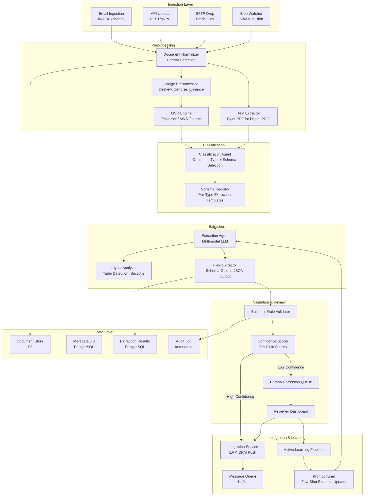
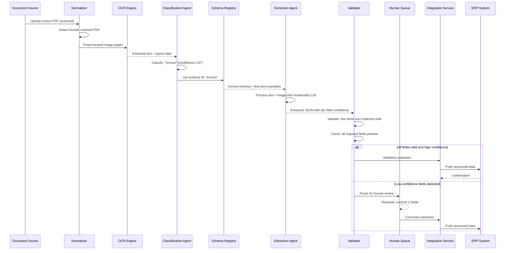
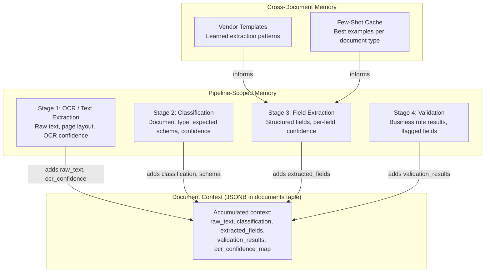
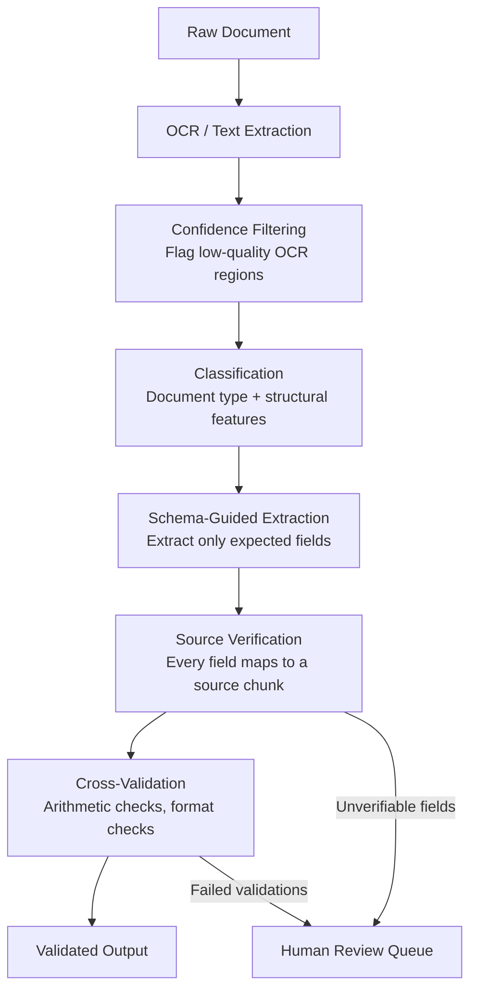

# Intelligent Document Processing Pipeline

An end-to-end document processing system that ingests unstructured business documents (invoices, contracts, forms), applies OCR and multimodal LLM extraction guided by per-document-type schemas, validates results against business rules, learns from human corrections, and pushes structured data to downstream systems -- processing 100,000 documents per day at 95%+ field-level extraction accuracy.

---

## Problem Statement

> Design a system that processes unstructured business documents (invoices, contracts, forms) and extracts structured data. The system should handle diverse formats, learn from corrections, and integrate with downstream business systems.

---

## Clarifying Questions to Ask

1. **Document type distribution** -- What is the mix of document types (invoices, contracts, purchase orders, receipts)? How many distinct layouts exist per type? Are most documents from a known set of vendors or highly diverse?
2. **Quality of inputs** -- What percentage of documents are scanned paper vs. digital-native PDFs? What is the average scan quality (DPI, skew, noise)?
3. **Schema stability** -- How frequently do extraction schemas change? Who defines them -- engineers, business users, or both?
4. **Accuracy requirements per field** -- Are all fields equally critical, or do some (e.g., invoice total, due date) have higher accuracy requirements than others?
5. **Downstream integration** -- What systems consume the extracted data (ERP, CRM, accounting)? Do they accept partial extractions or require all-or-nothing?
6. **Human reviewer capacity** -- How many reviewers are available for correction queues? What is the acceptable turnaround time for human-corrected documents?

---

## Requirements

### Functional Requirements

1. Ingest documents in multiple formats (PDF, image, scanned documents, email attachments)
2. Classify documents by type (invoice, contract, purchase order, receipt, form)
3. Extract key fields (dates, amounts, names, line items, clauses) into structured schemas
4. Validate extracted data against business rules (totals match line items, dates are valid, amounts are positive)
5. Route low-confidence extractions to human correction queue
6. Learn from human corrections to improve extraction accuracy over time
7. Push validated data to downstream systems (ERP, CRM) via APIs or message queues

### Non-Functional Requirements

| Requirement | Target |
|-------------|--------|
| Extraction accuracy (key fields) | > 95% |
| Processing latency | < 30 seconds per document |
| Throughput | 100,000 documents/day |
| Availability | 99.9% uptime |
| Human correction turnaround | < 2 hours for priority documents |
| Data retention | 7 years (regulatory compliance) |

### Out of Scope

- Handwriting recognition for free-form handwritten documents
- Real-time document streaming (batch and near-real-time only)
- Document generation or templating
- Contract negotiation or clause comparison

---

## High-Level Architecture



### Architecture Walkthrough

The architecture follows a linear pipeline with feedback loops, designed so each stage can be scaled independently.

The **Ingestion Layer** accepts documents from four sources: email (IMAP/Exchange integration for invoice-by-email workflows), API upload (for web applications and partner integrations), SFTP drops (for legacy batch processing), and blob storage watchers (for cloud-native workflows). All paths converge at the Document Normalizer.

The **Preprocessing** stage handles format detection and text extraction. Digital-native PDFs go through PyMuPDF for direct text extraction (fast, accurate, no OCR needed). Scanned documents and images go through an image preprocessor (deskew, denoise, contrast enhancement) followed by an OCR engine. The choice of OCR engine (Tesseract for cost, AWS Textract for accuracy on complex layouts) is configurable per document source.

The **Classification Agent** identifies the document type using a combination of layout features and text content. Once classified, it selects the appropriate extraction schema from the Schema Registry. The Schema Registry is a versioned store of per-document-type templates that define which fields to extract, their expected types, and validation rules.

The **Extraction Agent** is the core intelligence. It receives the document (both extracted text and the original image for layout awareness) along with the selected schema. The multimodal LLM processes both modalities, using the image to understand table structures, header-value relationships, and spatial layout that text extraction alone misses. It outputs structured JSON conforming to the schema, with a confidence score per extracted field.

The **Validation and Review** stage applies business rules (invoice total equals sum of line items, dates are chronologically valid, amounts are positive) and routes results based on field-level confidence. Documents where all fields exceed the confidence threshold go directly to integration. Documents with any low-confidence field route to the Human Correction Queue.

The **Integration Service** pushes validated extractions to downstream systems via Kafka, supporting both real-time and batch consumers. The **Active Learning Pipeline** aggregates human corrections, identifies which fields are most frequently corrected, and updates the extraction prompts with improved few-shot examples.

---

## Component Design

### 1. Document Normalizer

The normalizer detects the input format (PDF, TIFF, PNG, JPEG, DOCX) and routes to the appropriate text extraction path. For digital PDFs, it extracts text directly using PyMuPDF, preserving layout information. For scanned documents, it runs image preprocessing (deskew correction, noise reduction, contrast enhancement) before OCR. The normalizer also extracts document metadata (page count, file size, creation date) and generates a unique document ID for tracking through the pipeline. Documents exceeding 50 pages are split into logical sections to stay within LLM context limits.

### 2. Classification Agent

The Classification Agent uses a fine-tuned text classifier (DistilBERT) as its primary classification method, with an LLM fallback for documents that the classifier cannot categorize with sufficient confidence. The classifier is trained on labeled examples from the human correction queue. For a new document type, the system requires an initial set of 50 labeled examples to bootstrap the classifier; until then, the LLM handles classification directly. Classification accuracy exceeds 98% for the top 10 document types, which cover 90% of volume.

### 3. Schema Registry

The Schema Registry stores extraction templates as versioned JSON schemas. Each schema defines the fields to extract (name, type, description, required/optional, validation rules) and includes few-shot examples showing the expected extraction output for sample documents. Schemas are versioned so that extraction results can be traced to the schema version used. Business users can create new schemas through a guided interface, while engineers handle complex schemas with nested structures (e.g., invoice line items as arrays of objects).

### 4. Extraction Agent (Multimodal LLM)

The Extraction Agent is the most computationally expensive component and the accuracy bottleneck. It receives both the extracted text and the document image(s), enabling layout-aware extraction. For example, on an invoice, the LLM can see that a number appearing next to the label "Total" in the bottom-right corner is the invoice total, even if OCR extracted the text in a different order. The agent's prompt includes the schema (defining what to extract), 3-5 few-shot examples for the document type, and instructions to output structured JSON with a confidence score (0.0 to 1.0) per field. Fields where the agent is uncertain are explicitly marked with low confidence rather than silently guessed.

### 5. Business Rule Validator

The validator applies deterministic rules that catch extraction errors the LLM might make. Rules include: arithmetic validation (line item amounts sum to subtotal, subtotal plus tax equals total), date validation (invoice date is not in the future, due date is after invoice date), reference validation (purchase order numbers match expected format), and cross-field consistency (currency is consistent across all amount fields). Failed validations do not automatically reject the extraction; instead, they flag the specific fields for human review while accepting fields that pass validation.

### 6. Active Learning Pipeline

The learning pipeline closes the feedback loop between human corrections and extraction quality. It tracks correction frequency per field per document type, identifying systematic extraction failures. When a field is corrected more than 10% of the time, the pipeline triggers a prompt improvement cycle: it selects the most informative correction examples, adds them as few-shot examples in the extraction prompt, and evaluates the updated prompt against a held-out test set. If accuracy improves, the updated prompt is promoted to production. This pipeline runs daily, enabling continuous improvement without model fine-tuning.

---

## Data Flow



### Happy Path Walkthrough

A vendor emails an invoice PDF. The Email Ingestion service picks it up and passes it to the Normalizer, which detects a digital-native PDF. PyMuPDF extracts text directly (no OCR needed), preserving the layout structure. The Classification Agent identifies it as an invoice with 0.97 confidence and retrieves the invoice extraction schema. The Extraction Agent processes the text with the schema prompt and few-shot examples, extracting vendor name, invoice number, date, line items, subtotal, tax, and total -- all with confidence scores above 0.92. The Business Rule Validator confirms line items sum to the subtotal and subtotal plus tax equals the total. All validations pass. The Integration Service pushes the structured data to the ERP system via Kafka. Total processing time: 8 seconds.

### Error/Edge Case Path

A scanned contract arrives with a coffee stain obscuring the signature date. OCR extraction produces garbled text for that region. The Classification Agent correctly identifies it as a contract. The Extraction Agent extracts most fields successfully but assigns a confidence of 0.35 to the "effective_date" field because the source region is illegible. The Business Rule Validator flags the missing date. The document routes to the Human Correction Queue with only the date field highlighted for review (the reviewer does not need to re-check the 20 other correctly extracted fields). The reviewer enters the date from the original scan (visible at a different angle) and approves the extraction. The correction is logged, and the learning pipeline notes this as an OCR quality issue rather than an extraction prompt issue.

---

## Scaling Considerations

At 100,000 documents per day (~1.16 documents per second average, with peak bursts of 10x during month-end invoice processing), the pipeline needs to handle sustained throughput with burst capacity.

**OCR is the throughput bottleneck** for scanned documents. GPU-accelerated OCR (Textract or PaddleOCR) processes approximately 2 pages per second per GPU. With an average of 5 pages per document and 40% of documents requiring OCR, the system needs approximately 4 GPU instances for steady-state with 2 additional for burst capacity.

**LLM extraction** takes approximately 3-5 seconds per document. At peak throughput, this requires approximately 50-60 concurrent LLM calls. Using batched API calls and a pool of API keys across multiple providers provides the required throughput.

**Priority queuing** ensures time-sensitive documents (invoices near due date) are processed ahead of routine documents. A three-tier priority system (urgent, normal, batch) with separate processing pools prevents urgent documents from being stuck behind a batch upload of 10,000 archive documents.

**Horizontal scaling** is straightforward because each document is processed independently. The pipeline uses a work queue (Kafka with consumer groups) where each stage pulls work items independently, enabling auto-scaling based on queue depth.

---

## Cost Analysis

| Component | Volume/Day | Unit Cost | Daily Cost |
|-----------|-----------|-----------|------------|
| OCR processing (40% of docs) | 40,000 docs | $0.015/page, avg 5 pages | $3,000 |
| LLM extraction | 100,000 docs | $0.02/doc (avg 3K tokens) | $2,000 |
| Classification (lightweight) | 100,000 docs | $0.001/doc | $100 |
| Human review (8% of docs) | 8,000 docs | $0.50/doc (2 min at $15/hr) | $4,000 |
| Infrastructure (compute, storage, Kafka) | -- | -- | $400 |
| **Total daily** | | | **$9,500** |
| **Cost per document (blended)** | | | **$0.095** |

The largest cost lever is reducing the human review rate. Each 1% reduction in human review saves approximately $500/day. The active learning pipeline targets a 2-3% annual reduction in human review rate through continuous prompt improvement.

---

## Data Layer Deep Dive

### Database Selection Justification

Each data store in the architecture was chosen for a specific reason tied to the workload it serves. The table below summarizes the selection rationale and the alternatives that were evaluated and rejected.

| Store | Technology | Why This Choice | Alternative Considered | Why Not |
|-------|-----------|----------------|----------------------|---------|
| Document metadata, extraction results, processing state | PostgreSQL | ACID guarantees for processing pipeline state -- cannot lose track of a half-processed document; JSONB columns for heterogeneous extracted fields (invoices have different fields than contracts); full-text search via `tsvector` for document content search without a separate search engine | MongoDB | Flexible schema for varied document types, but processing pipelines need transactional guarantees -- a document partially processed without a checkpoint is a data integrity risk; ACID is non-negotiable for pipeline state management |
| Processing queue state and deduplication | Redis | Sub-millisecond reads for checking duplicate document hashes at upload time; processing progress tracking with atomic counters; pub/sub for notifying downstream systems when extraction completes; TTL-based expiration for temporary processing locks | SQS + DynamoDB | Works but adds operational complexity for what is essentially a processing status cache; two services to operate instead of one; DynamoDB provisioned capacity pricing is overkill for ephemeral queue state |
| Document chunk embeddings | pgvector | Semantic search across processed documents ("find all contracts mentioning indemnification clauses"); pgvector runs inside the same PostgreSQL instance used for metadata -- keeping embeddings co-located with metadata simplifies operations, joins, and backup strategy | Qdrant | Better performance for massive document stores exceeding 5M chunks, but adds a separate service with its own authentication, networking, and monitoring; operational complexity is not justified until the chunk count exceeds the pgvector performance threshold |
| Raw documents and OCR outputs | S3 (Object Storage) | PDFs, images, and scanned documents are large binary files; S3 provides versioned, encrypted storage with lifecycle policies for regulatory retention (7-year requirement); presigned URLs for secure, time-limited access from processing workers | Database BLOBs | Bloats the database, complicates backups (a 10TB document store makes PostgreSQL backup and restore impractical), does not scale cost-effectively, and lacks lifecycle management for retention policies |

### Schema Design

The following schemas define the core data model. Each table includes its indexes with justification for why each index exists.

#### documents

Tracks each document from upload through the entire processing pipeline to completion.

```sql
CREATE TABLE documents (
    id UUID PRIMARY KEY DEFAULT gen_random_uuid(),
    tenant_id VARCHAR(64) NOT NULL,
    file_name VARCHAR(255) NOT NULL,
    file_type VARCHAR(10) NOT NULL
        CHECK (file_type IN ('pdf', 'docx', 'xlsx', 'image', 'html', 'txt')),
    s3_key VARCHAR(512) NOT NULL,
    file_size_bytes BIGINT NOT NULL,
    page_count INTEGER,
    content_hash VARCHAR(64) NOT NULL,
    processing_status VARCHAR(20) NOT NULL DEFAULT 'uploaded'
        CHECK (processing_status IN (
            'uploaded', 'queued', 'extracting', 'chunking',
            'embedding', 'completed', 'failed'
        )),
    classification VARCHAR(50),
    error_message TEXT,
    created_at TIMESTAMPTZ NOT NULL DEFAULT now(),
    processed_at TIMESTAMPTZ
);

-- Deduplication: prevent processing the same document twice
CREATE UNIQUE INDEX idx_documents_content_hash ON documents(content_hash);

-- Dashboard queries: "show all documents for tenant X with status Y"
CREATE INDEX idx_documents_tenant_status ON documents(tenant_id, processing_status);

-- Processing pipeline: find documents stuck in a processing state
CREATE INDEX idx_documents_status_created ON documents(processing_status, created_at)
    WHERE processing_status NOT IN ('completed', 'failed');

-- Classification-based queries: "show all invoices for tenant X"
CREATE INDEX idx_documents_tenant_classification ON documents(tenant_id, classification);
```

**Index rationale**:
- `idx_documents_content_hash` -- A unique index on the SHA-256 hash of file contents. At upload time, the system computes the hash and attempts an insert; a unique constraint violation means the document is a duplicate. This is faster and more reliable than a SELECT-then-INSERT pattern.
- `idx_documents_tenant_status` -- Multi-tenant dashboards filter by tenant and processing status constantly. Without this index, every dashboard load scans the full table.
- `idx_documents_status_created` -- A partial index that only includes documents still in processing (excludes completed and failed). The health check query (see Key Queries below) uses this to find stuck documents without scanning the millions of completed documents.
- `idx_documents_tenant_classification` -- Supports filtered queries like "show all invoices for tenant X" used in downstream reporting and search interfaces.

#### document_chunks

Stores the extracted and chunked content from each document, including vector embeddings for semantic search.

```sql
CREATE TABLE document_chunks (
    id UUID PRIMARY KEY DEFAULT gen_random_uuid(),
    document_id UUID NOT NULL REFERENCES documents(id),
    chunk_index INTEGER NOT NULL,
    content TEXT NOT NULL,
    chunk_type VARCHAR(20) NOT NULL
        CHECK (chunk_type IN ('text', 'table', 'header', 'list', 'image_caption')),
    page_number INTEGER,
    bounding_box JSONB,
    embedding vector(1536),
    metadata JSONB DEFAULT '{}',
    created_at TIMESTAMPTZ NOT NULL DEFAULT now()
);

-- Primary access pattern: load all chunks for a document in order
CREATE INDEX idx_chunks_document ON document_chunks(document_id, chunk_index);

-- HNSW index for semantic search over document content
CREATE INDEX idx_chunks_embedding ON document_chunks
    USING hnsw (embedding vector_cosine_ops)
    WITH (m = 16, ef_construction = 200);
```

**Index rationale**:
- `idx_chunks_document` -- Every extraction and retrieval operation starts by loading chunks for a specific document in order. This composite index serves `WHERE document_id = ? ORDER BY chunk_index` as an index-only scan.
- `idx_chunks_embedding` -- The HNSW index enables sub-100ms approximate nearest neighbor search across all document chunks. Parameters `m = 16` and `ef_construction = 200` balance recall accuracy against index build time. At fewer than 5M chunks, HNSW provides better query latency than IVFFlat while maintaining recall above 0.95.

#### extracted_fields

Stores structured data extracted from documents -- the key output of the extraction pipeline.

```sql
CREATE TABLE extracted_fields (
    id UUID PRIMARY KEY DEFAULT gen_random_uuid(),
    document_id UUID NOT NULL REFERENCES documents(id),
    field_name VARCHAR(100) NOT NULL,
    field_value TEXT NOT NULL,
    field_type VARCHAR(20) NOT NULL
        CHECK (field_type IN ('string', 'number', 'date', 'currency', 'address')),
    confidence NUMERIC(3, 2) NOT NULL,
    source_chunk_id UUID REFERENCES document_chunks(id),
    created_at TIMESTAMPTZ NOT NULL DEFAULT now()
);

-- Load all extracted fields for a document (the primary read pattern)
CREATE INDEX idx_fields_document ON extracted_fields(document_id);

-- Find low-confidence fields across all documents for review queue
CREATE INDEX idx_fields_confidence ON extracted_fields(confidence)
    WHERE confidence < 0.7;

-- Analytics: aggregate field extraction accuracy by field name
CREATE INDEX idx_fields_name_confidence ON extracted_fields(field_name, confidence);
```

**Index rationale**:
- `idx_fields_document` -- After extraction, downstream systems and review UIs load all fields for a document. This index serves that query directly.
- `idx_fields_confidence` -- A partial index that only includes low-confidence fields. The human review queue queries this to find fields needing correction without scanning the millions of high-confidence fields.
- `idx_fields_name_confidence` -- Supports analytics queries that track extraction accuracy per field type over time (e.g., "what is the average confidence for invoice_total this month?").

#### processing_jobs

Tracks pipeline execution for each document, enabling monitoring, retry logic, and debugging.

```sql
CREATE TABLE processing_jobs (
    id UUID PRIMARY KEY DEFAULT gen_random_uuid(),
    document_id UUID NOT NULL REFERENCES documents(id),
    step_name VARCHAR(50) NOT NULL,
    status VARCHAR(20) NOT NULL DEFAULT 'pending'
        CHECK (status IN ('pending', 'running', 'completed', 'failed')),
    started_at TIMESTAMPTZ,
    completed_at TIMESTAMPTZ,
    error_message TEXT,
    retry_count INTEGER NOT NULL DEFAULT 0
);

-- Load all processing steps for a document (debugging and status display)
CREATE INDEX idx_jobs_document ON processing_jobs(document_id);

-- Find failed or stuck jobs for retry and alerting
CREATE INDEX idx_jobs_status ON processing_jobs(status, started_at)
    WHERE status IN ('running', 'failed');
```

**Index rationale**:
- `idx_jobs_document` -- Debugging and pipeline status UIs load all processing steps for a document to show which steps completed and which failed.
- `idx_jobs_status` -- A partial index for the health check system. Finds jobs stuck in "running" state (potential worker crashes) and "failed" jobs eligible for retry without scanning completed jobs.

### Key Queries

These are the actual queries the system executes in production, not simplified examples.

**1. Semantic search across document chunks with tenant filtering**

Used by downstream systems to find relevant content across all processed documents for a tenant.

```sql
SELECT dc.id, dc.content, dc.chunk_type, dc.page_number,
       d.file_name, d.classification,
       1 - (dc.embedding <=> $1) AS similarity
FROM document_chunks dc
JOIN documents d ON dc.document_id = d.id
WHERE d.tenant_id = $2
  AND d.processing_status = 'completed'
ORDER BY dc.embedding <=> $1
LIMIT 10;
```

The `<=>` operator computes cosine distance. The query joins chunks with documents to filter by tenant and only search completed documents. The `1 - distance` conversion returns cosine similarity (higher is better) for ranking results. The HNSW index on `embedding` provides sub-100ms response times.

**2. Extract all fields from invoices above a confidence threshold**

Used by the ERP integration service to pull high-confidence invoice data for automated processing.

```sql
SELECT d.id AS document_id, d.file_name,
       ef.field_name, ef.field_value, ef.field_type, ef.confidence
FROM extracted_fields ef
JOIN documents d ON ef.document_id = d.id
WHERE d.tenant_id = $1
  AND d.classification = 'invoice'
  AND ef.confidence >= $2
ORDER BY d.created_at DESC, ef.field_name;
```

This query powers the automated ERP push. Only fields above the confidence threshold (typically 0.85 for production, configurable per tenant) are included. Fields below the threshold require human review before integration.

**3. Processing pipeline status -- documents stuck in processing**

Used by the health check system to detect documents that have been processing for longer than the expected SLA.

```sql
SELECT d.id, d.file_name, d.processing_status, d.created_at,
       pj.step_name, pj.status, pj.started_at, pj.retry_count
FROM documents d
LEFT JOIN processing_jobs pj ON d.id = pj.document_id
    AND pj.status = 'running'
WHERE d.processing_status NOT IN ('completed', 'failed')
  AND d.created_at < now() - INTERVAL '10 minutes'
ORDER BY d.created_at ASC;
```

This query leverages the partial index on `documents(processing_status, created_at)` to efficiently find documents stuck in intermediate states. The 10-minute threshold is based on the 99th percentile processing time -- any document still processing after 10 minutes likely has a stuck worker. Results feed into the alerting system and the dead letter queue.

**4. Duplicate document detection using content_hash**

Used at upload time to prevent reprocessing documents that have already been ingested.

```sql
SELECT id, file_name, processing_status, created_at
FROM documents
WHERE content_hash = $1;
```

This query runs before any processing begins. The unique index on `content_hash` makes this an index-only lookup (sub-millisecond). If a match is found, the upload is rejected with a reference to the existing document, saving the full pipeline cost ($0.095 per document). The hash is computed client-side using SHA-256 over the raw file bytes.

---

## Agent Memory Architecture

### Memory Mode: Pipeline-Scoped with Document Context

The document processing agent does not have "conversations" -- it has processing pipelines. Unlike a chatbot that maintains dialogue state across turns, this agent builds an incremental understanding of a single document as it progresses through pipeline stages. Memory is organized around the document being processed, not around user interactions.



### Document Context Accumulation

When processing a document, each pipeline stage adds to the document's context, stored as JSONB in the `documents` table's metadata column. This accumulated context is what distinguishes the document processing agent from a stateless extraction function.

- **After OCR**: Raw text per page, OCR confidence scores per region, detected language, image quality metrics. This tells downstream stages which parts of the document are reliable and which may have OCR errors.
- **After Classification**: Document type (invoice, contract, receipt), classification confidence, and the selected extraction schema. This narrows the extraction agent's task from "extract everything" to "extract these specific fields."
- **After Extraction**: Structured fields with per-field confidence scores, source chunk references for each field, and any ambiguities detected (e.g., multiple possible values for a field). This is the primary output of the pipeline.

Each stage reads the context from prior stages and appends its own results. If extraction fails and retries, the retry has access to the same OCR and classification context without re-running those stages.

### Cross-Document Memory

For batch processing scenarios -- such as processing 500 invoices from the same vendor -- the agent learns extraction patterns from the first few documents and applies them to the rest. This is stored as "vendor templates" with expected field positions and formats.

When the system processes the first 5 invoices from a new vendor, it records which fields were found, their positions on the page, and the extraction patterns that succeeded. From the 6th invoice onward, these patterns are loaded as additional context for the extraction agent, improving both accuracy and speed. Vendor templates are stored in a separate table keyed by vendor identifier and document type, with a version number for tracking template evolution.

### Context Window Strategy

The document processing agent uses a focused context window for each extraction step, significantly smaller than a conversational agent because the task is narrower.

| Context Component | Token Budget | Source |
|-------------------|-------------|--------|
| Current page text | ~3,000 tokens | OCR / text extraction output |
| Extraction schema for this document type | ~500 tokens | Schema Registry |
| Few-shot examples from similar documents | ~1,500 tokens (3 examples x 500 tokens) | Few-shot cache / vendor templates |
| System instructions | ~1,000 tokens | Static configuration |
| **Total per extraction step** | **~6,000 tokens** | |

This compact context window keeps extraction cost low ($0.02 per document average) while providing sufficient context for accurate field extraction. Multi-page documents are processed page-by-page, with extracted fields aggregated and deduplicated after all pages are processed.

---

## Hallucination Mitigation

In a document processing context, hallucinations are particularly dangerous because the output feeds directly into business systems (ERP, accounting, legal). A fabricated invoice total or an invented contract clause can cause financial errors, compliance violations, or legal disputes. The system employs multiple layers of defense against hallucination, each targeting a specific failure mode.

### Hallucination Prevention Pipeline



### Extracted Field Fabrication

The most critical hallucination type: the agent extracts a value that does not exist in the document. For example, the LLM might "infer" an invoice number from context or generate a plausible-looking total that was never in the source text.

**Mitigation**: Every extracted field must include a `source_chunk_id` reference in the `extracted_fields` table. After extraction, the system verifies that the `field_value` appears in (or is mathematically derivable from) the referenced chunk's content. If the value cannot be found in the source text, the field's confidence is set to 0.0 and it is flagged for human review. This verification is rule-based (substring matching and numeric derivation checks), not LLM-based, ensuring the verification itself cannot hallucinate.

### Classification Hallucination

The agent classifies a document as an invoice when it is actually a receipt, or vice versa. Misclassification cascades into extraction errors because the wrong schema is applied.

**Mitigation**: Classification uses both content analysis (text-based features) AND structural features (page layout, presence of specific fields like "Invoice Number" vs. "Receipt Number," table structures, logo positions). The dual-signal approach catches cases where text content alone is ambiguous. Low-confidence classifications (below 0.7) are flagged for human review before extraction proceeds. This prevents wasting extraction compute on a document that would need to be re-extracted with the correct schema.

### OCR Error Propagation

The agent treats OCR errors as real content. For example, "lO" misread as "10," or "$1,234" misread as "$1,284." The LLM faithfully extracts the corrupted value because it appears in the text.

**Mitigation**: Three defenses work together. First, post-OCR spell checking flags words with low dictionary match scores. Second, OCR confidence scores from the engine itself are propagated to downstream stages -- low-confidence regions are marked so the extraction agent can flag values from those regions. Third, cross-validation of extracted numbers catches arithmetic inconsistencies: if line items sum to $1,234 but the extracted total is $1,284, the system flags both values for review rather than trusting either one.

### Table Extraction Errors

The agent misaligns table rows and columns, attributing a value from one row to a different row. This is common in complex multi-page tables where the LLM processes text that has lost its spatial layout.

**Mitigation**: Use table-specific extraction models (not just text-based LLM processing) that preserve the two-dimensional structure. The Layout Analyzer in the architecture specifically handles table detection and extraction. After extraction, validate tables against structural constraints: columns should have consistent types (a "quantity" column should contain only numbers), row counts should match the visual table structure, and column totals should match footer values if present.

### Date Format Hallucination

The agent interprets "01/02/2024" as January 2 vs. February 1 depending on its training data bias. This is not a traditional hallucination but a systematic misinterpretation that affects every document from certain locales.

**Mitigation**: Use document locale context (country of origin, language detected during OCR, tenant configuration) to determine date format conventions. Documents from US-based vendors use MM/DD/YYYY; documents from European vendors use DD/MM/YYYY. Ambiguous dates (where day and month are both 12 or less, e.g., "01/02/2024") are flagged for confirmation rather than silently interpreted. The system maintains a per-vendor date format preference learned from prior documents.

:::warning Critical Design Principle
Hallucination mitigation in document processing differs fundamentally from conversational AI. In a chatbot, you can ask the user to confirm. In document processing, there is no user in the loop during extraction -- the pipeline must catch errors autonomously or route to the review queue. Every mitigation layer must be automated and deterministic, not dependent on user interaction.
:::

---

## Production Issues and Fixes

The following table documents production issues observed in document processing pipeline deployments, their root causes, and the fixes applied. These are the issues that do not appear in architecture diagrams but dominate on-call rotations.

| Issue | Symptoms | Root Cause | Fix |
|-------|----------|-----------|-----|
| Duplicate document processing wasting resources | Same document processed 2-3 times; duplicate entries in ERP; wasted LLM and OCR spend | Multiple upload paths (email + API) ingesting the same document; no deduplication at the ingestion boundary | Content hash (SHA-256) deduplication at upload. Compute the hash before any processing begins and check against the unique index on `content_hash`. Reject duplicates with a reference to the existing document. Cost savings: ~5% of daily processing volume eliminated |
| OCR quality too low for handwritten documents | Extraction accuracy drops below 60% for handwritten forms; high rate of human review for these documents | Generic OCR engine (Tesseract) trained primarily on printed text; handwritten text produces garbled output | Route handwritten documents to a specialized OCR model (Azure Document Intelligence with handwriting mode) instead of the generic engine. Add a handwriting detection step after image preprocessing that checks stroke patterns and character regularity. Accuracy improved from 60% to 88% for handwritten forms |
| Large PDF timeouts | Documents with 100+ pages fail with processing timeouts; entire document must be re-queued | Single-threaded page processing with a 60-second timeout; large documents exceed the timeout before extraction completes | Page-level parallel processing: split the PDF into individual pages, process pages concurrently (up to 10 parallel workers per document), aggregate results. Process pages 1-10 first for a quick preview while remaining pages process in the background. Timeout per page (30 seconds) instead of per document |
| Extraction accuracy varies by vendor | 98% accuracy for some vendors, 75% for others; same document type (invoice) with wildly different accuracy | Different vendors use different layouts, terminology, and field positions; generic extraction prompt cannot cover all variations | Vendor-specific extraction templates with few-shot examples from that vendor's past documents. After processing 5+ documents from a vendor, the system builds a vendor template with field positions and extraction patterns. New documents from that vendor use the template as additional context, improving accuracy to 95%+ across all vendors |
| Embedding model mismatch after upgrade | Semantic search returns irrelevant results after deploying a new embedding model; search quality drops sharply | New embedding model produces vectors in a different embedding space than the old model; existing chunks have old embeddings, new chunks have new embeddings; cosine similarity between old and new embeddings is meaningless | Re-index all document chunks when the embedding model changes. Version embeddings with a model identifier column. During the re-indexing period, route search queries to the old index until the new index is complete. Add a pre-deployment check that compares embedding distributions between old and new models |
| PII in extracted fields not redacted | Compliance audit finds Social Security numbers, bank account numbers, and personal addresses stored in plaintext in the `extracted_fields` table | Extraction pipeline faithfully extracts all fields matching the schema, including PII fields, without any redaction layer | Add a PII detection layer (regex + NER model) after extraction but before storing in `extracted_fields`. Redact PII values (replace with masked tokens like `***-**-1234`) in the standard extraction results. Keep unredacted versions only in an encrypted audit store with restricted access and separate retention policies |
| Processing pipeline stuck with no progress | Documents remain in "extracting" or "chunking" status indefinitely; processing throughput drops to zero; queue depth grows | Worker process crashed or was OOM-killed mid-processing; no mechanism to detect and recover stuck jobs | Dead letter queue for documents that fail 3 times. Health check job runs every 5 minutes, identifies documents stuck in a processing state for more than 10 minutes (using the partial index on `processing_jobs`), and re-queues them with an incremented retry count. After 3 retries, move to the dead letter queue and alert the on-call engineer |

:::tip Operational Readiness
Before launching a document processing pipeline, build runbooks for each issue in this table. The first week of production will surface at least three of these problems. Content hash deduplication and stuck pipeline detection should be implemented before launch -- they are not optimizations, they are requirements. The remaining issues can be addressed as they appear, but having pre-written runbooks with specific metric thresholds reduces mean time to resolution from hours to minutes.
:::

---

## Trade-offs & Alternatives

| Decision | Rationale | Alternative | Why Not |
|----------|-----------|-------------|---------|
| Multimodal LLM extraction (text + image) | Captures layout context (tables, spatial relationships) that text-only extraction misses; 12% accuracy improvement on complex layouts | Text-only LLM extraction | Misses table structures, header-value spatial relationships, and handwritten annotations; accuracy drops to 83% on invoices with complex table layouts |
| Schema-driven extraction with per-type templates | Provides structured output guarantees; enables field-level validation; supports diverse document types without model retraining | Schema-free extraction (extract everything) | Produces inconsistent output schemas across documents; cannot validate completeness; downstream systems require predictable field names |
| Per-field confidence scoring | Enables targeted human review (reviewer checks only flagged fields, not the entire document); reduces review time by 60% | Document-level confidence only | Wastes reviewer time re-checking correctly extracted fields; a document with 20 correct fields and 1 incorrect field should only need review of that 1 field |
| Active learning from corrections | Continuously improves accuracy without model fine-tuning; adapts to new vendor formats and layout changes | Periodic model retraining | Retraining requires ML engineering effort and GPU compute; prompt-based improvements (adding few-shot examples) are faster and cheaper to deploy |
| Digital PDF direct extraction (skip OCR) | Faster, more accurate, and cheaper than OCR for digital-native documents | OCR everything uniformly | OCR on digital PDFs introduces errors that were not in the original text; adds latency and cost for no quality benefit |
| Kafka for integration layer | Decouples extraction pipeline from downstream consumers; supports both real-time and batch consumption patterns | Direct API calls to ERP/CRM | Tight coupling; if the ERP is down, the entire pipeline backs up; no replay capability for failed deliveries |

---

## Interview Tips

:::tip How to Present This (35 minutes)
- **Minutes 1-5**: Clarify document types, input quality, schema ownership, and downstream integration requirements. Ask about the ratio of scanned vs. digital documents -- this fundamentally affects the architecture (OCR cost and accuracy dominate for scanned-heavy workloads).
- **Minutes 5-15**: Draw the pipeline architecture. Walk through the flow left to right: ingestion, preprocessing, classification, extraction, validation, human review, integration. Emphasize the Schema Registry as the configurability mechanism and the multimodal extraction as the accuracy differentiator.
- **Minutes 15-25**: Deep dive into the Extraction Agent (why multimodal matters, how schema-driven prompts work, per-field confidence scoring) and the Active Learning Pipeline (how human corrections feed back into prompt improvement). These are the two most technically interesting components.
- **Minutes 25-30**: Discuss scaling (OCR as throughput bottleneck, priority queuing for month-end bursts), cost analysis (show per-document breakdown, identify human review as the cost lever), and the accuracy-cost tradeoff (higher LLM spend vs. lower human review rate).
- **Minutes 30-35**: Handle follow-ups. Common questions: "How do you handle a completely new document type?" (bootstrap with 50 labeled examples, LLM-only extraction until classifier is trained), "How do you ensure data privacy for sensitive documents?" (encryption at rest and in transit, PII detection and masking in logs, role-based access to correction queue), "What if OCR quality is poor?" (image preprocessing, fallback to higher-quality OCR engine, confidence-aware extraction that marks OCR-degraded regions).
:::
