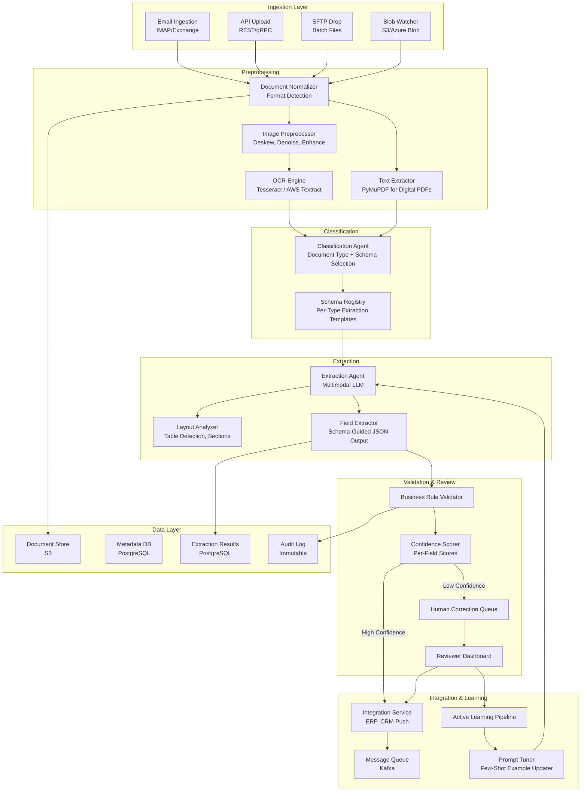
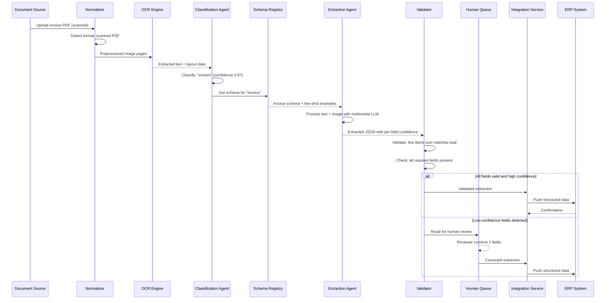

# Intelligent Document Processing Pipeline

An end-to-end document processing system that ingests unstructured business documents (invoices, contracts, forms), applies OCR and multimodal LLM extraction guided by per-document-type schemas, validates results against business rules, learns from human corrections, and pushes structured data to downstream systems -- processing 100,000 documents per day at 95%+ field-level extraction accuracy.

---

## Problem Statement

> Design a system that processes unstructured business documents (invoices, contracts, forms) and extracts structured data. The system should handle diverse formats, learn from corrections, and integrate with downstream business systems.

---

## Clarifying Questions to Ask

1. **Document type distribution** -- What is the mix of document types (invoices, contracts, purchase orders, receipts)? How many distinct layouts exist per type? Are most documents from a known set of vendors or highly diverse?
2. **Quality of inputs** -- What percentage of documents are scanned paper vs. digital-native PDFs? What is the average scan quality (DPI, skew, noise)?
3. **Schema stability** -- How frequently do extraction schemas change? Who defines them -- engineers, business users, or both?
4. **Accuracy requirements per field** -- Are all fields equally critical, or do some (e.g., invoice total, due date) have higher accuracy requirements than others?
5. **Downstream integration** -- What systems consume the extracted data (ERP, CRM, accounting)? Do they accept partial extractions or require all-or-nothing?
6. **Human reviewer capacity** -- How many reviewers are available for correction queues? What is the acceptable turnaround time for human-corrected documents?

---

## Requirements

### Functional Requirements

1. Ingest documents in multiple formats (PDF, image, scanned documents, email attachments)
2. Classify documents by type (invoice, contract, purchase order, receipt, form)
3. Extract key fields (dates, amounts, names, line items, clauses) into structured schemas
4. Validate extracted data against business rules (totals match line items, dates are valid, amounts are positive)
5. Route low-confidence extractions to human correction queue
6. Learn from human corrections to improve extraction accuracy over time
7. Push validated data to downstream systems (ERP, CRM) via APIs or message queues

### Non-Functional Requirements

| Requirement | Target |
|-------------|--------|
| Extraction accuracy (key fields) | > 95% |
| Processing latency | < 30 seconds per document |
| Throughput | 100,000 documents/day |
| Availability | 99.9% uptime |
| Human correction turnaround | < 2 hours for priority documents |
| Data retention | 7 years (regulatory compliance) |

### Out of Scope

- Handwriting recognition for free-form handwritten documents
- Real-time document streaming (batch and near-real-time only)
- Document generation or templating
- Contract negotiation or clause comparison

---

## High-Level Architecture

### Architecture Walkthrough

The architecture follows a linear pipeline with feedback loops, designed so each stage can be scaled independently.

The **Ingestion Layer** accepts documents from four sources: email (IMAP/Exchange integration for invoice-by-email workflows), API upload (for web applications and partner integrations), SFTP drops (for legacy batch processing), and blob storage watchers (for cloud-native workflows). All paths converge at the Document Normalizer.

The **Preprocessing** stage handles format detection and text extraction. Digital-native PDFs go through PyMuPDF for direct text extraction (fast, accurate, no OCR needed). Scanned documents and images go through an image preprocessor (deskew, denoise, contrast enhancement) followed by an OCR engine. The choice of OCR engine (Tesseract for cost, AWS Textract for accuracy on complex layouts) is configurable per document source.

The **Classification Agent** identifies the document type using a combination of layout features and text content. Once classified, it selects the appropriate extraction schema from the Schema Registry. The Schema Registry is a versioned store of per-document-type templates that define which fields to extract, their expected types, and validation rules.

The **Extraction Agent** is the core intelligence. It receives the document (both extracted text and the original image for layout awareness) along with the selected schema. The multimodal LLM processes both modalities, using the image to understand table structures, header-value relationships, and spatial layout that text extraction alone misses. It outputs structured JSON conforming to the schema, with a confidence score per extracted field.

The **Validation and Review** stage applies business rules (invoice total equals sum of line items, dates are chronologically valid, amounts are positive) and routes results based on field-level confidence. Documents where all fields exceed the confidence threshold go directly to integration. Documents with any low-confidence field route to the Human Correction Queue.

The **Integration Service** pushes validated extractions to downstream systems via Kafka, supporting both real-time and batch consumers. The **Active Learning Pipeline** aggregates human corrections, identifies which fields are most frequently corrected, and updates the extraction prompts with improved few-shot examples.

---

## Component Design

### 1. Document Normalizer

The normalizer detects the input format (PDF, TIFF, PNG, JPEG, DOCX) and routes to the appropriate text extraction path. For digital PDFs, it extracts text directly using PyMuPDF, preserving layout information. For scanned documents, it runs image preprocessing (deskew correction, noise reduction, contrast enhancement) before OCR. The normalizer also extracts document metadata (page count, file size, creation date) and generates a unique document ID for tracking through the pipeline. Documents exceeding 50 pages are split into logical sections to stay within LLM context limits.

### 2. Classification Agent

The Classification Agent uses a fine-tuned text classifier (DistilBERT) as its primary classification method, with an LLM fallback for documents that the classifier cannot categorize with sufficient confidence. The classifier is trained on labeled examples from the human correction queue. For a new document type, the system requires an initial set of 50 labeled examples to bootstrap the classifier; until then, the LLM handles classification directly. Classification accuracy exceeds 98% for the top 10 document types, which cover 90% of volume.

### 3. Schema Registry

The Schema Registry stores extraction templates as versioned JSON schemas. Each schema defines the fields to extract (name, type, description, required/optional, validation rules) and includes few-shot examples showing the expected extraction output for sample documents. Schemas are versioned so that extraction results can be traced to the schema version used. Business users can create new schemas through a guided interface, while engineers handle complex schemas with nested structures (e.g., invoice line items as arrays of objects).

### 4. Extraction Agent (Multimodal LLM)

The Extraction Agent is the most computationally expensive component and the accuracy bottleneck. It receives both the extracted text and the document image(s), enabling layout-aware extraction. For example, on an invoice, the LLM can see that a number appearing next to the label "Total" in the bottom-right corner is the invoice total, even if OCR extracted the text in a different order. The agent's prompt includes the schema (defining what to extract), 3-5 few-shot examples for the document type, and instructions to output structured JSON with a confidence score (0.0 to 1.0) per field. Fields where the agent is uncertain are explicitly marked with low confidence rather than silently guessed.

### 5. Business Rule Validator

The validator applies deterministic rules that catch extraction errors the LLM might make. Rules include: arithmetic validation (line item amounts sum to subtotal, subtotal plus tax equals total), date validation (invoice date is not in the future, due date is after invoice date), reference validation (purchase order numbers match expected format), and cross-field consistency (currency is consistent across all amount fields). Failed validations do not automatically reject the extraction; instead, they flag the specific fields for human review while accepting fields that pass validation.

### 6. Active Learning Pipeline

The learning pipeline closes the feedback loop between human corrections and extraction quality. It tracks correction frequency per field per document type, identifying systematic extraction failures. When a field is corrected more than 10% of the time, the pipeline triggers a prompt improvement cycle: it selects the most informative correction examples, adds them as few-shot examples in the extraction prompt, and evaluates the updated prompt against a held-out test set. If accuracy improves, the updated prompt is promoted to production. This pipeline runs daily, enabling continuous improvement without model fine-tuning.

---

## Data Flow

### Happy Path Walkthrough

A vendor emails an invoice PDF. The Email Ingestion service picks it up and passes it to the Normalizer, which detects a digital-native PDF. PyMuPDF extracts text directly (no OCR needed), preserving the layout structure. The Classification Agent identifies it as an invoice with 0.97 confidence and retrieves the invoice extraction schema. The Extraction Agent processes the text with the schema prompt and few-shot examples, extracting vendor name, invoice number, date, line items, subtotal, tax, and total -- all with confidence scores above 0.92. The Business Rule Validator confirms line items sum to the subtotal and subtotal plus tax equals the total. All validations pass. The Integration Service pushes the structured data to the ERP system via Kafka. Total processing time: 8 seconds.

### Error/Edge Case Path

A scanned contract arrives with a coffee stain obscuring the signature date. OCR extraction produces garbled text for that region. The Classification Agent correctly identifies it as a contract. The Extraction Agent extracts most fields successfully but assigns a confidence of 0.35 to the "effective_date" field because the source region is illegible. The Business Rule Validator flags the missing date. The document routes to the Human Correction Queue with only the date field highlighted for review (the reviewer does not need to re-check the 20 other correctly extracted fields). The reviewer enters the date from the original scan (visible at a different angle) and approves the extraction. The correction is logged, and the learning pipeline notes this as an OCR quality issue rather than an extraction prompt issue.

---

## Scaling Considerations

At 100,000 documents per day (~1.16 documents per second average, with peak bursts of 10x during month-end invoice processing), the pipeline needs to handle sustained throughput with burst capacity.

**OCR is the throughput bottleneck** for scanned documents. GPU-accelerated OCR (Textract or PaddleOCR) processes approximately 2 pages per second per GPU. With an average of 5 pages per document and 40% of documents requiring OCR, the system needs approximately 4 GPU instances for steady-state with 2 additional for burst capacity.

**LLM extraction** takes approximately 3-5 seconds per document. At peak throughput, this requires approximately 50-60 concurrent LLM calls. Using batched API calls and a pool of API keys across multiple providers provides the required throughput.

**Priority queuing** ensures time-sensitive documents (invoices near due date) are processed ahead of routine documents. A three-tier priority system (urgent, normal, batch) with separate processing pools prevents urgent documents from being stuck behind a batch upload of 10,000 archive documents.

**Horizontal scaling** is straightforward because each document is processed independently. The pipeline uses a work queue (Kafka with consumer groups) where each stage pulls work items independently, enabling auto-scaling based on queue depth.

---

## Cost Analysis

| Component | Volume/Day | Unit Cost | Daily Cost |
|-----------|-----------|-----------|------------|
| OCR processing (40% of docs) | 40,000 docs | $0.015/page, avg 5 pages | $3,000 |
| LLM extraction | 100,000 docs | $0.02/doc (avg 3K tokens) | $2,000 |
| Classification (lightweight) | 100,000 docs | $0.001/doc | $100 |
| Human review (8% of docs) | 8,000 docs | $0.50/doc (2 min at $15/hr) | $4,000 |
| Infrastructure (compute, storage, Kafka) | -- | -- | $400 |
| **Total daily** | | | **$9,500** |
| **Cost per document (blended)** | | | **$0.095** |

The largest cost lever is reducing the human review rate. Each 1% reduction in human review saves approximately $500/day. The active learning pipeline targets a 2-3% annual reduction in human review rate through continuous prompt improvement.

---

## Trade-offs & Alternatives

| Decision | Rationale | Alternative | Why Not |
|----------|-----------|-------------|---------|
| Multimodal LLM extraction (text + image) | Captures layout context (tables, spatial relationships) that text-only extraction misses; 12% accuracy improvement on complex layouts | Text-only LLM extraction | Misses table structures, header-value spatial relationships, and handwritten annotations; accuracy drops to 83% on invoices with complex table layouts |
| Schema-driven extraction with per-type templates | Provides structured output guarantees; enables field-level validation; supports diverse document types without model retraining | Schema-free extraction (extract everything) | Produces inconsistent output schemas across documents; cannot validate completeness; downstream systems require predictable field names |
| Per-field confidence scoring | Enables targeted human review (reviewer checks only flagged fields, not the entire document); reduces review time by 60% | Document-level confidence only | Wastes reviewer time re-checking correctly extracted fields; a document with 20 correct fields and 1 incorrect field should only need review of that 1 field |
| Active learning from corrections | Continuously improves accuracy without model fine-tuning; adapts to new vendor formats and layout changes | Periodic model retraining | Retraining requires ML engineering effort and GPU compute; prompt-based improvements (adding few-shot examples) are faster and cheaper to deploy |
| Digital PDF direct extraction (skip OCR) | Faster, more accurate, and cheaper than OCR for digital-native documents | OCR everything uniformly | OCR on digital PDFs introduces errors that were not in the original text; adds latency and cost for no quality benefit |
| Kafka for integration layer | Decouples extraction pipeline from downstream consumers; supports both real-time and batch consumption patterns | Direct API calls to ERP/CRM | Tight coupling; if the ERP is down, the entire pipeline backs up; no replay capability for failed deliveries |

---

## Interview Tips

:::tip How to Present This (35 minutes)
- **Minutes 1-5**: Clarify document types, input quality, schema ownership, and downstream integration requirements. Ask about the ratio of scanned vs. digital documents -- this fundamentally affects the architecture (OCR cost and accuracy dominate for scanned-heavy workloads).
- **Minutes 5-15**: Draw the pipeline architecture. Walk through the flow left to right: ingestion, preprocessing, classification, extraction, validation, human review, integration. Emphasize the Schema Registry as the configurability mechanism and the multimodal extraction as the accuracy differentiator.
- **Minutes 15-25**: Deep dive into the Extraction Agent (why multimodal matters, how schema-driven prompts work, per-field confidence scoring) and the Active Learning Pipeline (how human corrections feed back into prompt improvement). These are the two most technically interesting components.
- **Minutes 25-30**: Discuss scaling (OCR as throughput bottleneck, priority queuing for month-end bursts), cost analysis (show per-document breakdown, identify human review as the cost lever), and the accuracy-cost tradeoff (higher LLM spend vs. lower human review rate).
- **Minutes 30-35**: Handle follow-ups. Common questions: "How do you handle a completely new document type?" (bootstrap with 50 labeled examples, LLM-only extraction until classifier is trained), "How do you ensure data privacy for sensitive documents?" (encryption at rest and in transit, PII detection and masking in logs, role-based access to correction queue), "What if OCR quality is poor?" (image preprocessing, fallback to higher-quality OCR engine, confidence-aware extraction that marks OCR-degraded regions).
:::
