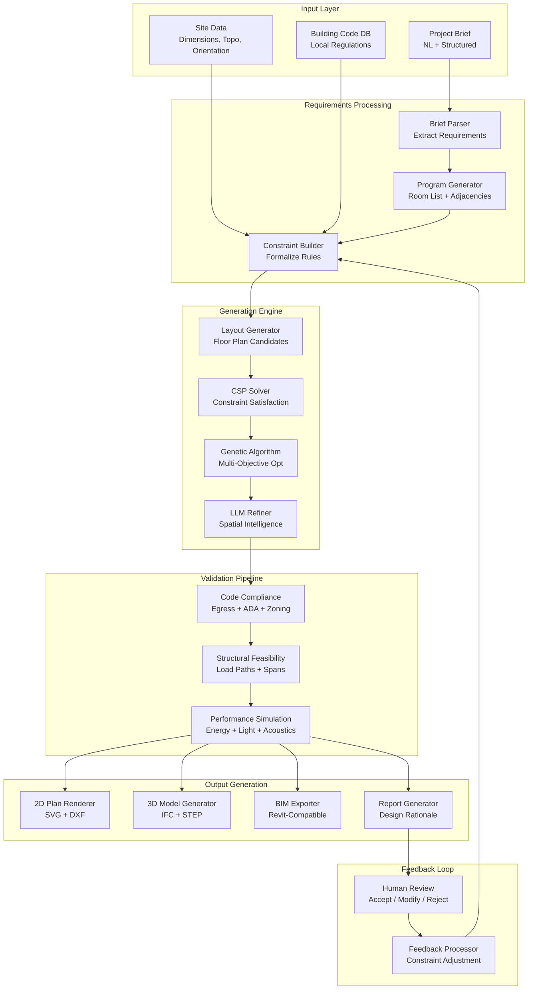
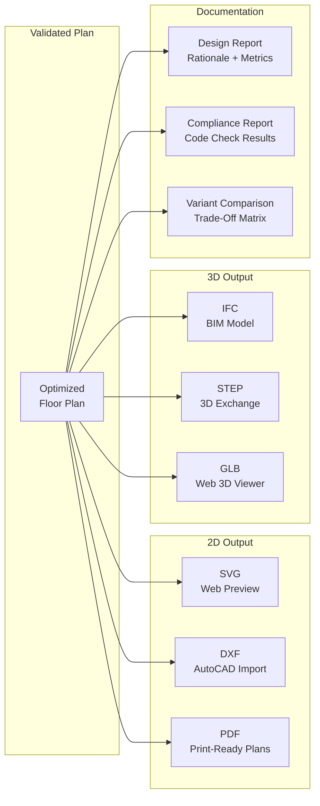

# AI System that Generates Building Plans

An AI system that generates architectural building plans from a set of requirements -- rooms, spatial constraints, budget, site dimensions, and regulatory constraints. The system combines generative AI with constraint satisfaction, building code compliance, structural feasibility validation, and multi-objective optimization to produce viable floor plans, 3D models, and BIM output. This is a compelling design problem because pure LLM approaches fall short on hard optimization constraints, making hybrid architectures essential.

---

## Problem Statement
> "Design a system that takes an architectural project brief (room requirements, site dimensions, budget, building codes) and generates multiple viable floor plan candidates. The system must satisfy hard constraints like building codes and egress requirements while optimizing across competing objectives like cost, energy efficiency, and spatial quality. How would you combine generative AI with formal optimization?"

---

## Clarifying Questions to Ask

1. **What building types are in scope?** Residential single-family, multi-family apartments, commercial office, mixed-use?
2. **Single story or multi-story?** Does the system need to handle vertical circulation (stairs, elevators)?
3. **Which building codes apply?** IBC only, or also local codes and international standards?
4. **What output formats are needed?** 2D floor plans (SVG/DXF), 3D models (IFC/STEP), or BIM-ready output for Revit?
5. **How many variants should be generated?** 3-5 or 20+? How should variants differ from each other?
6. **Is human feedback iterative?** Can the architect reject a plan and re-generate with adjusted constraints?
7. **What simulations are expected?** Energy, lighting, acoustics, or just structural feasibility?
8. **What is the acceptable generation time?** Minutes or hours?

---

## Requirements

### Functional Requirements

1. **Requirements parsing** -- extract rooms, sizes, adjacencies, constraints, and preferences from natural language briefs
2. **Generative design** -- produce multiple floor plan candidates that satisfy the requirements
3. **Building code compliance** -- check generated plans against local building codes (egress, accessibility, zoning)
4. **Structural feasibility** -- validate that the generated layout supports viable structural systems
5. **Multi-objective optimization** -- optimize across cost, energy efficiency, spatial efficiency, and natural light
6. **Iterative refinement** -- accept human feedback and re-generate or adjust plans
7. **Output formats** -- 2D floor plans (SVG/DXF), 3D models (IFC/STEP), BIM-ready output
8. **Simulation integration** -- connect to energy, lighting, and acoustic simulation tools for validation

### Non-Functional Requirements

| Requirement | Target |
|-------------|--------|
| Generation time (single floor) | < 2 minutes for 5 plan variants |
| Generation time (multi-story) | < 10 minutes for 5 variants |
| Code compliance rate | > 95% of generated plans pass compliance check |
| Structural feasibility rate | > 90% of plans are structurally viable |
| Output precision | All dimensions accurate to 1cm |
| Optimization convergence | Pareto-optimal within 5% of theoretical best |

### Out of Scope

- Detailed structural engineering (beam sizing, foundation design)
- MEP system layout (plumbing, electrical routing)
- Interior design and furniture placement
- Construction documentation

---

## High-Level Architecture

### Architecture Walkthrough

The system flows through four major phases. The **Input Layer** accepts a project brief (natural language plus structured data), site data (dimensions, topography, orientation), and a building code database for the applicable jurisdiction.

**Requirements Processing** uses an LLM to parse the natural language brief into a structured program (room list with sizes, adjacency requirements, access requirements, special constraints, budget tier, sustainability goals). The constraint builder then formalizes these into two categories: hard constraints (site boundary, minimum room sizes, egress, accessibility, structural grid) that must be satisfied, and soft constraints (adjacency preferences, natural light, views, circulation efficiency, cost) that are optimized toward with configurable weights.

The **Generation Engine** uses a three-stage hybrid approach: procedural generation creates initial candidates using grid-based and adjacency-driven strategies, a CSP solver filters out candidates that violate hard constraints and attempts to repair minor violations, and a genetic algorithm (NSGA-II) optimizes the surviving population across all objectives. An LLM refiner then post-processes the top candidates for spatial quality.

The **Validation Pipeline** runs code compliance checks (egress paths, ADA accessibility, zoning setbacks, fire separation, ventilation), structural feasibility analysis (load paths and maximum spans), and optional performance simulation (energy, lighting, acoustics). Only plans that pass all validation proceed to **Output Generation**, where they are exported as 2D plans, 3D models, BIM files, and a design rationale report. The architect reviews, and feedback loops back as constraint modifications for the next generation cycle.

---

## Component Design

### Requirements Parsing and Program Generation

The brief parser uses an LLM to extract structured requirements from the architect's natural language description. It produces a room list (with minimum and desired sizes), adjacency requirements (which rooms should be near each other), access requirements (entries, corridors, service access), special constraints (views, noise separation, security zones), budget tier, and sustainability goals (LEED level, energy targets).

After parsing, the system performs a feasibility sanity check: it computes whether the total required area can fit within the buildable site area at an assumed 85% spatial efficiency. If not, it flags a warning immediately rather than wasting compute on generation.

The constraint builder then separates requirements into hard and soft categories:

| Constraint Type | Examples | Behavior |
|----------------|----------|----------|
| Hard (must satisfy) | Site boundary, min room sizes, egress, ADA, structural grid | Candidate is rejected if violated |
| Soft (optimize toward) | Adjacency preferences, natural light, views, circulation, cost | Scored and optimized via genetic algorithm |

### Layout Generation with Hybrid Approach

The system uses three generation strategies to maximize diversity in the initial candidate pool:

**Strategy A -- Grid-based placement** divides the site into a grid and assigns rooms to cells based on size requirements. This produces regular, efficient layouts but may lack architectural creativity.

**Strategy B -- Adjacency-driven generation** builds a graph from adjacency requirements and converts it to a spatial layout using graph drawing algorithms. This respects spatial relationships but may produce irregular shapes.

**Strategy C -- LLM-guided spatial layout** asks the LLM to propose layout concepts (linear, courtyard, L-shaped) with room placement grids, corridor routing, and entry point locations. This adds architectural intelligence but requires validation.

After generating 20 initial candidates across all three strategies, the system filters through hard constraints, attempts to repair minor violations, and then runs 100 generations of the genetic algorithm using NSGA-II non-dominated sorting to produce a Pareto-optimal set.

### Multi-Objective Optimization

The genetic algorithm optimizes across six weighted objectives simultaneously:

| Objective | Weight | What It Measures |
|-----------|--------|-----------------|
| Spatial efficiency | 0.25 | Minimizes wasted space (net-to-gross ratio) |
| Circulation ratio | 0.20 | Minimizes corridor and hallway area |
| Adjacency score | 0.20 | Maximizes satisfaction of adjacency requirements |
| Natural light | 0.15 | Maximizes daylight factor for occupied rooms |
| Structural regularity | 0.10 | Prefers regular column grids (cheaper to build) |
| Cost estimate | 0.10 | Minimizes estimated construction cost |

The algorithm uses crossover (combining spatial arrangements from two parent plans) and mutation (shifting room positions, swapping rooms, adjusting corridor widths) to explore the solution space. All offspring are checked against hard constraints; invalid offspring are discarded.

### Building Code Compliance Checker

The compliance checker runs five categories of checks against applicable building codes. **Egress checks** calculate travel distance from every room to the nearest exit and verify it does not exceed the maximum for the occupancy type (per IBC 1017.1). **Accessibility checks** verify corridor widths, door widths, turning radii, and ramp slopes against ADA requirements. **Zoning checks** validate building height, floor area ratio (FAR), and setback distances. **Fire separation checks** verify fire-rated assemblies between occupancy groups. **Ventilation and light checks** verify minimum window area ratios.

Each finding includes the specific code section violated, the severity level, and a suggested fix, making the report actionable for the architect.

### Iterative Refinement with Human Feedback

When the architect provides feedback (text, annotations on the plan, or specific modification requests), the feedback processor uses an LLM to translate it into constraint modifications: new constraints to add, existing constraints to modify with new parameters, or constraints to remove or relax. The updated constraint set feeds back into the generation engine for the next cycle. This loop continues until the architect accepts a plan.

---

## Data Flow

The IFC (Industry Foundation Classes) output is the most important for professional use. IFC is the open standard for BIM data exchange, and generating valid IFC files means the AI-generated plan can be imported directly into Revit, ArchiCAD, or any BIM-compliant software for further development.

---

## Scaling Considerations

| Component | Strategy |
|-----------|----------|
| Layout generation | Embarrassingly parallel -- generate candidates on separate workers |
| Genetic algorithm | GPU-accelerated fitness evaluation; distributed population across workers |
| Compliance checking | Rule engine with cached code lookups; parallelize per building system |
| 3D model generation | Template-based BIM generation; GPU for geometry operations |
| Simulation | Delegate to external simulation services with async callback |

---

## Cost Analysis

| Component | Cost | Notes |
|-----------|------|-------|
| LLM calls (parsing + refinement) | $0.10-0.30 | 3-5 LLM calls per generation cycle |
| Optimization compute | $0.05-0.15 | CPU for GA, 100 generations |
| Compliance checking | $0.02 | Rule-based, fast |
| 3D model generation | $0.05-0.10 | Geometry computation |
| Simulation (if requested) | $0.20-0.50 | External simulation APIs |
| **Total per cycle** | **$0.42-1.05** | Including 5 plan variants |

---

## Trade-offs & Alternatives

| Decision | Rationale | Alternative | Why Not |
|----------|-----------|-------------|---------|
| Hybrid generation (procedural + CSP + GA) | LLMs cannot guarantee constraint satisfaction; formal optimization handles hard constraints while LLMs add spatial intelligence | Pure LLM generation | LLMs hallucinate dimensions, cannot guarantee egress compliance, and produce infeasible layouts for complex programs |
| NSGA-II multi-objective optimization | Produces a Pareto front showing trade-offs rather than a single "best" plan; architects need options | Weighted single-objective optimization | Collapses multiple objectives into one score, hiding trade-offs; the "best" plan depends on the architect's priorities |
| Three generation strategies for diversity | Grid, adjacency-graph, and LLM strategies produce fundamentally different layout typologies | Single generation strategy | Low diversity in candidates means the optimizer gets stuck in local optima |
| Hard/soft constraint separation | Hard constraints are non-negotiable (building codes); soft constraints allow trade-offs (adjacency vs. cost) | All constraints treated equally | Cannot distinguish "must" from "nice to have"; either too rigid or too permissive |
| Iterative feedback as constraint modification | Keeps the architect in control while leveraging the optimization engine | Free-form plan editing by the AI | Editing individual elements loses the benefit of global optimization; better to re-optimize with updated constraints |

---

## Interview Tips

:::tip How to Present This (35 minutes)
- **Minutes 1-5:** Clarify requirements -- building type, single vs. multi-story, which codes, output formats, generation time budget
- **Minutes 5-15:** Draw the architecture -- input processing, three-stage generation engine (procedural + CSP + GA + LLM refiner), validation pipeline, output generation, and feedback loop
- **Minutes 15-25:** Deep dive into the hybrid generation approach (why LLMs alone fail for constrained layout), multi-objective optimization with NSGA-II (Pareto front, crossover/mutation operators), and building code compliance checking (egress distance calculation, ADA verification)
- **Minutes 25-30:** Scaling (embarrassingly parallel candidate generation, GPU-accelerated fitness evaluation) and cost analysis ($0.42-1.05 per generation cycle including 5 variants)
- **Minutes 30-35:** Trade-offs (pure LLM vs. hybrid, single vs. multi-objective optimization, hard vs. soft constraints) and the iterative feedback loop (constraint modification vs. direct plan editing)
:::
