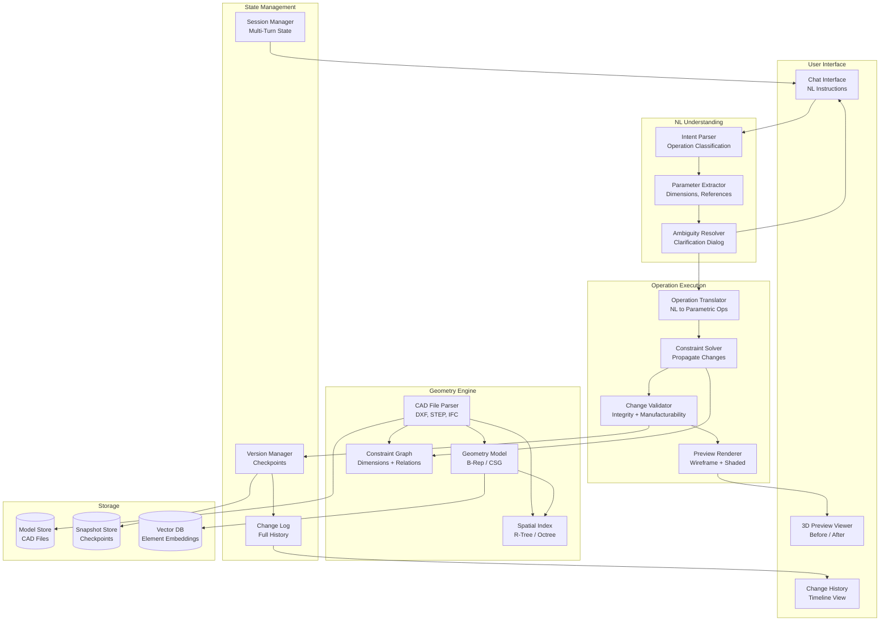
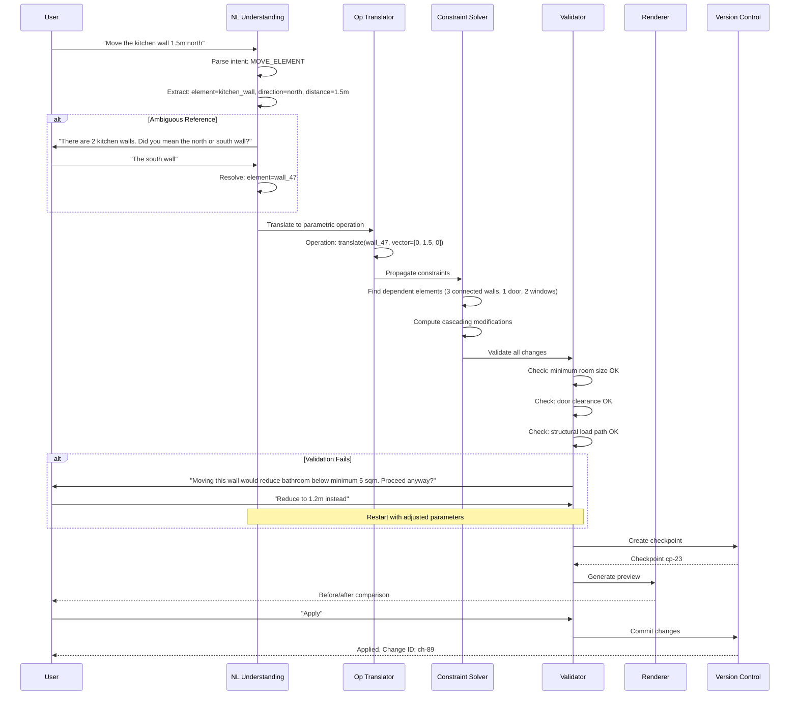

# AI Agent that Modifies CAD Models

An AI agent that parses CAD files (DXF, STEP, IFC), builds geometric and semantic understanding, translates natural language instructions into precise parametric operations, validates changes against structural and manufacturing constraints, and supports multi-turn dialog with undo/redo. This system bridges the gap between natural language understanding and exact geometric operations -- a domain where approximate answers are not acceptable.

---

## Problem Statement
> "Design an AI agent that can read CAD models in standard formats, understand their geometry and constraints, and modify them based on natural language instructions like 'move the kitchen wall 1.5 meters north.' The system must guarantee sub-millimeter precision, respect all existing constraints, and support undo/redo for every operation."

---

## Clarifying Questions to Ask

1. **Which CAD formats must be supported?** DXF, STEP, IFC only, or also proprietary formats like DWG and Solidworks?
2. **What is the typical model complexity?** How many elements (hundreds vs. hundreds of thousands)?
3. **Standalone tool or plugin?** Does it run as an independent application or integrate into existing CAD software?
4. **What types of modifications are expected?** Simple single-element moves, or complex multi-element cascading changes?
5. **What constraint systems exist?** Dimensional constraints, alignment constraints, connection constraints, or all of the above?
6. **How should ambiguity be handled?** When the user says "the wall" but there are three walls, should the system ask or guess?
7. **What validation is required post-modification?** Structural integrity only, or also manufacturability, code compliance, and clearance checks?
8. **Is there a safety tier system?** Should destructive operations require escalating levels of confirmation?

---

## Requirements

### Functional Requirements

1. **CAD file parsing** -- read and understand DXF, STEP, IFC, and proprietary formats
2. **Geometric understanding** -- comprehend spatial relationships, dimensions, tolerances, and constraints
3. **Natural language to parametric operations** -- translate instructions like "make the wall 2 meters longer" into exact geometric transformations
4. **Constraint solver integration** -- ensure modifications respect existing constraints (dimensions, alignments, connections)
5. **Change validation** -- verify structural integrity, manufacturability, and standards compliance after each change
6. **Undo/redo with version control** -- every modification creates a checkpoint; full change history
7. **Preview rendering** -- show before/after comparison before applying destructive operations
8. **Multi-turn modification dialog** -- support iterative refinement through conversation
9. **Safety checks** -- warn before destructive operations; require confirmation for large-scale changes

### Non-Functional Requirements

| Requirement | Target |
|-------------|--------|
| Operation latency (simple) | < 3s for single-element modifications |
| Operation latency (complex) | < 15s for multi-element cascading changes |
| Geometric precision | Sub-millimeter accuracy for all operations |
| Parse time (typical model) | < 10s for models with < 50K elements |
| Undo latency | < 1s to revert any operation |
| Constraint satisfaction | 100% -- no invalid states allowed |

### Out of Scope

- Creating models from scratch (see the Building Plan Generator design)
- Physical simulation (FEA, CFD)
- Rendering photorealistic images (only preview wireframes and shaded views)

---

## High-Level Architecture

### Architecture Walkthrough

The user interacts through a **Chat Interface** where they type natural language instructions. The **NL Understanding** layer parses intent (e.g., MOVE_ELEMENT), extracts parameters (direction, distance, target element), and resolves ambiguities by asking clarifying questions when references are unclear.

The **Geometry Engine** is the system's core data layer. It parses CAD files into an internal representation (B-Rep or CSG), builds a spatial index (R-tree or Octree) for efficient proximity queries, and maintains a constraint graph that encodes all dimensional and relational constraints between elements.

The **Operation Execution** layer translates parsed intent into precise parametric operations, propagates changes through the constraint graph to maintain model integrity, validates the result against structural and manufacturing rules, and renders a before/after preview. Only after user confirmation does the system commit the change.

**State Management** tracks all checkpoints and change history, enabling undo to any previous state. The session manager maintains multi-turn conversation context so the user can iteratively refine modifications.

---

## Component Design

### CAD File Parser and Geometry Model

The parser supports multiple CAD formats through format-specific handlers (DXF, STEP/STP, IFC, DWG). For each file, it classifies every element by type (wall, door, beam, pipe), extracts geometric properties (bounding box, centroid, area, volume, vertex count, topology type), and identifies dimensional constraints. After parsing, it builds two critical indices: a **spatial index** (R-tree) for fast proximity and intersection queries, and a **constraint graph** that encodes all relationships between elements.

| Format | Parser Strategy | Key Challenges |
|--------|----------------|----------------|
| DXF | Open standard, direct parsing | 2D-centric, limited semantic info |
| STEP | ISO standard, rich geometry | Complex B-Rep topology |
| IFC | BIM standard, semantic-rich | Large files, deep hierarchy |
| DWG | Proprietary, requires converter | License constraints |

### Natural Language to Parametric Operations

The operation translator bridges the gap between human language and precise geometry. It resolves natural language element references ("the wall near the entrance") to specific model elements using three strategies in order: exact name/ID match, spatial reference resolution (using the R-tree), and semantic search over element descriptions (using the vector DB). When multiple candidates match, it raises an ambiguity error that triggers a clarification dialog.

Once targets are resolved, the LLM generates the parametric operation with exact numeric parameters (all in meters, enforced to 4 decimal places). The available operation types include translate, rotate, scale, mirror, extend, trim, fillet, chamfer, add/remove/copy element, modify parameter, align, and distribute.

### Constraint Solver

The constraint solver is responsible for maintaining model integrity when any element is modified. It walks the constraint graph from the modified element outward (up to depth 5) to identify all dependent elements, clones the model state for safe computation, applies the primary operations, and then iteratively resolves constraint violations until the model reaches a stable state (up to 50 iterations).

If the solver cannot satisfy all constraints within the iteration limit, it reports which constraints remain violated and suggests alternative parameters. This guarantees the system never produces an invalid model state -- a non-negotiable requirement for CAD modification.

### Change Validation and Safety Checks

After constraint propagation, the validator runs five parallel checks: geometry validity (no self-intersecting faces), minimum dimensions (no room below code-required area), structural integrity (load paths maintained), manufacturability (achievable tolerances), and clearances (doors can open, corridors are wide enough).

The system also enforces a tiered safety model based on the scope of impact:

| Risk Level | Trigger | Action |
|------------|---------|--------|
| Low | Single element parameter change | Apply immediately after preview |
| Medium | 2-10 elements affected | Show preview, require confirmation |
| High | 10-50 elements cascading | Detailed impact report, explicit "I understand" confirmation |
| Critical | Structural element removal or > 50 affected elements | Require typed confirmation, log to audit trail |

### Version Control and Undo/Redo

Every modification creates a checkpoint before execution. The version manager stores delta snapshots (not full copies) for storage efficiency -- only the changes between consecutive checkpoints are persisted. This enables sub-second undo by replaying deltas backward. The change log records every checkpoint with a description, timestamp, affected elements, and delta size, providing a full audit trail of all AI-initiated modifications. Users can undo to the previous state or jump to any specific checkpoint in the history.

---

## Data Flow

The sequence above illustrates the complete modification lifecycle. Notice several key design decisions: ambiguity is resolved interactively (not guessed), constraint violations trigger a re-negotiation with the user rather than silent failure, and the checkpoint is created before the preview so the system can always roll back even if preview generation fails.

---

## Scaling Considerations

| Component | Strategy |
|-----------|----------|
| CAD parsing | Worker pool with format-specific containers; cache parsed models |
| Constraint solving | CPU-bound; scale with compute instances; timeout and approximate for large models |
| Spatial indexing | R-tree fits in memory for most models (< 100K elements); shard for mega-models |
| Version storage | Delta compression; garbage-collect old checkpoints after 30 days |
| Preview rendering | GPU pool for real-time wireframe; pre-rendered snapshots for history view |

---

## Cost Analysis

| Component | Cost/Operation | Notes |
|-----------|---------------|-------|
| LLM inference (intent + translation) | $0.02-0.10 | Depends on context size and clarification rounds |
| Constraint solving (CPU) | $0.001-0.01 | Scales with model complexity and constraint depth |
| Preview rendering (GPU) | $0.01-0.05 | Wireframe is cheap; shaded views cost more |
| Storage (delta snapshots) | $0.001 | Delta compression keeps cost minimal |
| **Total per modification** | **$0.03-0.17** | Typical session has 5-15 modifications |

For an engineer whose time costs $60-100/hour, even a $1 session cost is trivial if it saves 10 minutes of manual CAD operations per modification.

---

## Trade-offs & Alternatives

| Decision | Rationale | Alternative | Why Not |
|----------|-----------|-------------|---------|
| Late fusion for NL understanding (separate intent, parameter, ambiguity stages) | Each stage can be debugged and improved independently; ambiguity resolution needs user interaction | Single-shot LLM call to generate operation directly | Loses the ability to ask clarifying questions; harder to debug wrong operations |
| Constraint graph with iterative solver | Guarantees model integrity; handles cascading dependencies automatically | Manual dependency tracking per operation type | Does not scale to complex models; easy to miss dependencies; no convergence guarantee |
| Delta-based version storage | Storage-efficient; enables fast undo by replaying deltas | Full model snapshots at each checkpoint | Prohibitively expensive for large models; 50K-element model at every checkpoint wastes storage |
| Tiered safety confirmation | Proportional friction -- low-risk changes are fast, high-risk changes get scrutiny | Uniform confirmation for all operations | Too much friction for simple changes drives users away; too little for destructive changes is dangerous |
| R-tree spatial index | Industry-standard for spatial queries; memory-efficient for typical model sizes | Octree or brute-force spatial search | Octree is better for 3D but overkill for many 2D/2.5D CAD models; brute-force does not scale |

---

## Interview Tips

:::tip How to Present This (35 minutes)
- **Minutes 1-5:** Clarify requirements -- which CAD formats, modification complexity (single vs. cascading), standalone vs. plugin, safety expectations
- **Minutes 5-15:** Draw the architecture -- NL understanding pipeline (intent, parameter extraction, ambiguity resolution), geometry engine (parser, spatial index, constraint graph), operation execution (translator, solver, validator, renderer)
- **Minutes 15-25:** Deep dive into the constraint solver (graph traversal, iterative propagation, convergence guarantee) and NL-to-parametric-operation translation (reference resolution strategies, precision enforcement)
- **Minutes 25-30:** Discuss the safety tier system, version control with delta snapshots, and scaling strategies for large models
- **Minutes 30-35:** Trade-offs (iterative solver vs. manual tracking, delta vs. full snapshots) and edge cases (sub-millimeter precision, numerical stability, unit conversion errors)
:::
