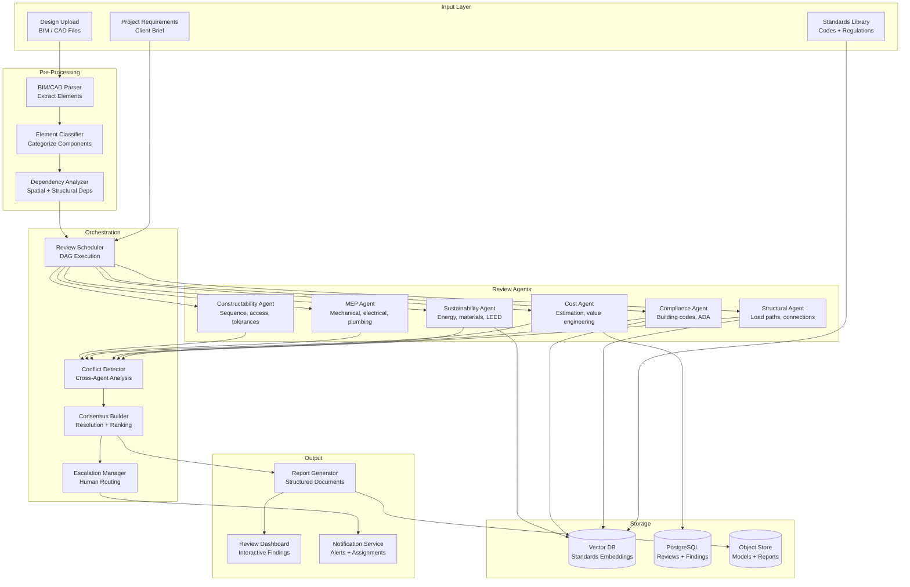
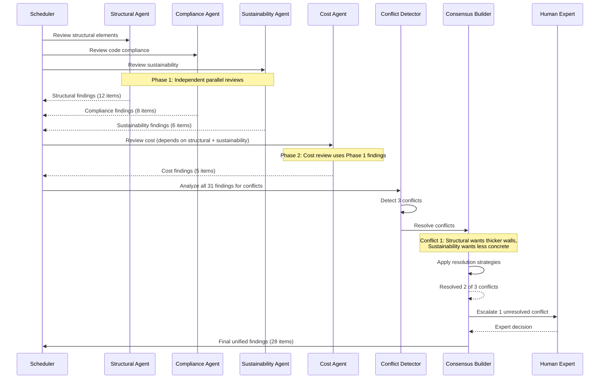

# Multi-Agent Design Review System

A multi-agent system that reviews engineering designs -- architectural, mechanical, and electrical -- using specialized review agents for structural integrity, code compliance, sustainability, cost estimation, and constructability. These agents collaborate through an orchestrated pipeline, resolve conflicts between their recommendations, and produce a unified review report. This design demonstrates multi-agent coordination, domain expertise decomposition, and consensus-building under uncertainty.

---

## Problem Statement
> "Design a multi-agent system that reviews engineering designs (BIM/CAD files) across multiple disciplines -- structural, compliance, sustainability, cost, MEP, and constructability. The agents must run in the correct dependency order, detect conflicts between their recommendations (e.g., structural wants thicker walls but sustainability wants less concrete), resolve those conflicts, and produce a unified review report. How do you handle agent coordination, conflict resolution, and human escalation?"

---

## Clarifying Questions to Ask

1. **Which design disciplines are in scope?** Structural, compliance, sustainability, cost, MEP, constructability -- all six or a subset?
2. **What input formats?** BIM models (IFC/Revit), CAD files (DXF/DWG), or both?
3. **New design vs. renovation?** Does the system need to handle existing condition assessments?
4. **Which compliance jurisdictions?** Single jurisdiction or multi-jurisdiction (IBC, local codes, international)?
5. **What is the acceptable review latency?** Under 30 minutes for a typical building, or is overnight acceptable?
6. **How should unresolved conflicts be handled?** Automated best-guess or mandatory human expert escalation?
7. **Are iterative review cycles needed?** After the designer addresses findings, should the system re-review incrementally?
8. **What is the target false positive rate?** Too many false positives erode reviewer trust.

---

## Requirements

### Functional Requirements

1. **Specialized review agents** -- dedicated agents for structural, compliance, sustainability, cost, MEP (mechanical/electrical/plumbing), and constructability review
2. **Review orchestration** -- coordinate agents in the correct sequence with dependency management
3. **Conflict detection** -- identify and resolve contradictions between agent recommendations
4. **Consensus building** -- produce a unified set of recommendations from multiple agent opinions
5. **Human expert escalation** -- route unresolved conflicts and low-confidence findings to human reviewers
6. **Compliance checking** -- verify against building codes (IBC, local codes), standards (ADA, ASHRAE), and zoning
7. **Report generation** -- structured reports with visualizations, severity ratings, and actionable recommendations
8. **Iterative review cycles** -- re-review after the designer addresses findings from a previous cycle

### Non-Functional Requirements

| Requirement | Target |
|-------------|--------|
| Full review latency | < 30 minutes for a typical building design |
| Finding accuracy | > 85% of flagged issues are genuine problems |
| False positive rate | < 15% (to maintain reviewer trust) |
| Compliance coverage | > 95% of applicable code sections checked |
| Concurrent reviews | 100+ simultaneous review sessions |
| Report generation | < 2 minutes after review completes |

### Out of Scope

- Physical simulation (FEA, CFD) -- the system interprets simulation results but does not run simulations
- Design modification (the system reviews, not redesigns)
- Construction scheduling and logistics

---

## High-Level Architecture

### Architecture Walkthrough

Designs enter through the **Input Layer** as BIM/CAD file uploads, accompanied by the applicable standards library and project requirements. The **Pre-Processing** layer parses files into structured element lists, classifies each component (wall, beam, pipe, duct), and analyzes spatial and structural dependencies between elements.

The **Review Agents** layer contains six specialized agents, each expert in one discipline. The **Orchestration** layer manages their execution through a DAG-based scheduler that respects dependencies: structural, compliance, and MEP agents run in parallel (Phase 1), while sustainability depends on structural findings, cost depends on both structural and sustainability, and constructability depends on structural and MEP (Phase 2).

After all agents complete, the **Conflict Detector** identifies contradictions between agent recommendations (e.g., structural recommends thicker walls while sustainability recommends less concrete). The **Consensus Builder** applies resolution strategies in priority order (safety first, then code compliance, then cost-benefit analysis). Conflicts that cannot be resolved with sufficient confidence are escalated to human experts through the **Escalation Manager**.

Finally, the **Report Generator** produces a structured document with an executive summary, findings organized by severity and building system, a compliance matrix, and prioritized recommendations.

---

## Component Design

### Review Orchestration Scheduler

The scheduler models agent dependencies as a directed acyclic graph (DAG) and executes agents in topological order with maximum parallelism. The dependency structure is:

| Agent | Dependencies | Phase |
|-------|-------------|-------|
| Structural | None | 1 (parallel) |
| Compliance | None | 1 (parallel) |
| MEP | None | 1 (parallel) |
| Sustainability | Structural | 2 |
| Cost | Structural, Sustainability | 2 |
| Constructability | Structural, MEP | 2 |

Each agent runs with a 5-minute timeout. If an agent fails or times out, the scheduler retries with a reduced scope (fewer elements) rather than blocking the entire review. Downstream agents that depend on a failed agent receive a partial findings set with a confidence downgrade.

### Specialized Review Agents

Each agent follows the same pattern: determine applicable code sections or standards, retrieve relevant documentation via RAG, analyze the design elements against those standards using an LLM, and produce structured findings with severity ratings and recommended fixes.

The **Compliance Agent** serves as a representative example. It determines applicable building codes based on the project location and building type, reviews each building system against those codes by retrieving relevant code sections via RAG and using an LLM to check compliance, and performs cross-checks for ADA accessibility and fire safety egress. Each finding includes the element ID, the specific code section violated, the severity (critical/major/minor), and a recommended fix.

The other agents follow similar patterns with domain-specific focus areas:

| Agent | Focus Areas | Key Checks |
|-------|------------|------------|
| Structural | Load paths, connections, spans | Member sizing adequacy, load transfer continuity, connection detailing |
| Sustainability | Energy, materials, LEED points | Insulation values, glazing ratios, material carbon footprint, LEED credit eligibility |
| Cost | Estimation, value engineering | Unit cost benchmarks, over-specified elements, cheaper material alternatives |
| MEP | Routing, clearances, coordination | Duct/pipe routing conflicts, equipment access clearance, energy code compliance |
| Constructability | Sequence, access, tolerances | Construction access paths, material handling feasibility, tolerance stackup |

### Conflict Detection and Consensus Building

The conflict detector checks known conflict patterns between agent pairs:

| Agent Pair | Conflict Type | Example |
|-----------|---------------|---------|
| Structural vs. Sustainability | Material quantity | Structural wants thicker concrete walls; sustainability wants less embodied carbon |
| Structural vs. Cost | Over-engineering | Structural recommends larger beams; cost flags over-specification |
| Compliance vs. Cost | Code minimum vs. value | Compliance requires expensive fire-rated assembly; cost suggests cheaper alternative |
| MEP vs. Structural | Penetration conflicts | MEP routes ducts through structural beams |
| Sustainability vs. Cost | Green premium | Sustainability recommends expensive high-performance glazing; cost flags the premium |

The detector also identifies spatial conflicts where two agents recommend contradictory actions for the same element.

The **Consensus Builder** applies resolution strategies in strict priority order:
1. **Safety first** -- structural and life-safety findings always take priority
2. **Code compliance** -- code compliance is non-negotiable and always wins
3. **Cost-benefit analysis** -- for non-safety, non-compliance conflicts, weigh cost against benefit
4. **Human escalation** -- if no strategy resolves the conflict with confidence above 0.7, route to a human expert

### Report Generation

The report generator organizes all findings by severity (critical, major, minor) and by building system, generates an executive summary using an LLM (3-5 paragraphs suitable for a project manager), builds a compliance matrix showing which code sections were checked and their status, and produces prioritized recommendations. The report includes both structured data for the interactive dashboard and a document export for offline review.

### Iterative Review Cycles

Design reviews are rarely one-shot. When the designer submits a revised design, the system diffs the new design against the previous version, identifies which building systems changed, determines which agents need to re-run (only those affected by the changes plus their dependents), runs a targeted partial review, and reconciles new findings with the previous review (marking addressed findings, retaining open findings, flagging new issues). This incremental approach avoids re-running all six agents when only one system changed.

---

## Data Flow

The sequence diagram illustrates the two-phase execution model. Phase 1 agents (structural, compliance, sustainability) run in parallel with no dependencies. Phase 2 agents (cost, constructability) run after their dependencies complete. After all agents finish, the conflict detector analyzes all 31 findings together, identifies 3 conflicts, and the consensus builder resolves 2 automatically using priority rules while escalating 1 to a human expert. The final unified set of 28 findings (after conflict resolution and deduplication) goes to the report generator.

---

## Scaling Considerations

| Component | Strategy |
|-----------|----------|
| Review agents | Stateless workers; scale per agent type based on demand |
| Standards RAG | Pre-computed embeddings; cached code sections per jurisdiction |
| BIM parsing | GPU-accelerated geometry processing; chunked for large models |
| Report generation | Template-based with LLM-generated sections; cached visualizations |
| Concurrent reviews | Queue-based with priority; dedicated GPU pool for large models |

Building codes vary by jurisdiction and are updated regularly. The standards database must be versioned and the system must track which code version was used for each review. Using an outdated code version in a review creates legal liability.

---

## Cost Analysis

| Component | Cost/Review | Notes |
|-----------|------------|-------|
| BIM parsing and pre-processing | $0.05-0.10 | CPU + geometry extraction |
| Agent LLM inference (6 agents) | $0.30-0.80 | 3-5 LLM calls per agent, parallel |
| RAG retrieval (standards) | $0.01-0.02 | Pre-computed embeddings, cached |
| Conflict detection + consensus | $0.05-0.10 | 2-3 LLM calls for conflict analysis |
| Report generation | $0.05-0.10 | LLM summary + template rendering |
| **Total per review** | **$0.46-1.12** | For a typical building design |

For a design review that would take a team of specialists 2-4 hours ($500-1,500 in labor), an automated first-pass at $1 per review provides enormous ROI, especially when considering that it catches issues early in the design cycle where fixes are cheapest.

---

## Trade-offs & Alternatives

| Decision | Rationale | Alternative | Why Not |
|----------|-----------|-------------|---------|
| Specialized agents per discipline | Each discipline has unique domain knowledge, standards, and review patterns; specialists outperform generalists | Single monolithic review agent | Cannot achieve deep domain expertise across all six disciplines; a single agent would miss domain-specific nuances |
| DAG-based orchestration with phases | Respects real dependencies (cost review needs structural data); maximizes parallelism within constraints | Sequential execution of all agents | Wastes time; structural and compliance can clearly run in parallel since they have no dependency |
| LLM-based conflict detection | Conflicts are often semantic (not structural); LLMs can understand that "thicker walls" and "less concrete" are contradictory | Rule-based conflict detection | Cannot anticipate all conflict types; too many rules to maintain; misses novel conflict patterns |
| Tiered resolution (safety > compliance > cost-benefit > human) | Clear priority hierarchy matches real-world engineering decision-making | All conflicts escalated to humans | Overwhelms human reviewers with conflicts that have obvious resolutions (safety always wins) |
| Incremental re-review on design changes | Avoids re-running all six agents when only one system changed; faster turnaround for iterative cycles | Full re-review every time | Wasteful; if only the HVAC system changed, re-running the structural agent adds latency without value |

---

## Interview Tips

:::tip How to Present This (35 minutes)
- **Minutes 1-5:** Clarify requirements -- which disciplines, input formats, compliance jurisdictions, latency expectations, false positive tolerance
- **Minutes 5-15:** Draw the architecture -- input processing, six specialized agents, DAG-based scheduler with two execution phases, conflict detection, consensus building, human escalation, report generation
- **Minutes 15-25:** Deep dive into agent orchestration (DAG dependencies, parallel phases, timeout/retry), conflict detection (known conflict patterns between agent pairs, spatial conflicts), and consensus resolution (priority hierarchy: safety > compliance > cost-benefit > escalate)
- **Minutes 25-30:** Discuss iterative review cycles (design diffing, targeted re-review, finding reconciliation) and scaling (stateless agents, cached standards, versioned code database)
- **Minutes 30-35:** Trade-offs (specialized vs. monolithic agents, LLM vs. rule-based conflict detection, full vs. incremental re-review) and the legal importance of standards versioning
:::
