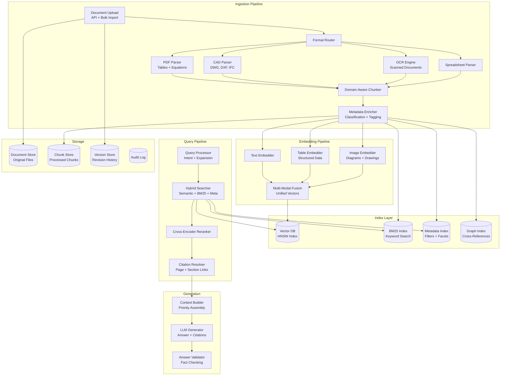

# RAG Platform for Engineering Documents

A Retrieval-Augmented Generation platform purpose-built for engineering documents -- technical manuals, specifications, standards, blueprints, datasheets, and regulatory filings. Unlike general-purpose RAG, engineering documents contain tables, equations, diagrams, cross-references, revision histories, and domain-specific terminology that demand specialized ingestion, chunking, and retrieval strategies. Incorrect information in this domain can have safety consequences, making accuracy non-negotiable.

---

## Problem Statement
> "Design a RAG platform for an engineering firm that has 10 million documents across technical manuals, specifications, standards, blueprints, and regulatory filings. The system must handle multi-format ingestion (PDF, CAD, scanned documents), preserve tables and equations during chunking, support hybrid search with exact code references (e.g., 'ASTM A36'), provide page-level citations for every answer, and enforce document-level access control. How would you architect this at scale?"

---

## Clarifying Questions to Ask

1. **What document formats dominate?** Primarily PDFs, or also CAD files (DWG/DXF), BIM models (IFC), and scanned legacy documents?
2. **How many documents and what is the growth rate?** 10M today, growing by how much per month?
3. **What are the typical query patterns?** Conceptual questions ("what is the deflection limit for steel beams?") or exact lookups ("ASTM A36 yield strength")?
4. **How critical is citation accuracy?** Is a wrong citation a minor inconvenience or a potential liability?
5. **Are there access control requirements?** Export-controlled data (ITAR/EAR), proprietary specs, or safety-critical documents?
6. **How are document versions managed?** Must the system distinguish between revisions and answer from the correct version?
7. **What is the query volume?** Hundreds per day or hundreds of thousands?
8. **Is there a latency requirement for generation?** Sub-3-second first token, or is longer acceptable for complex queries?

---

## Requirements

### Functional Requirements

1. **Multi-format ingestion** -- PDF, DWG (AutoCAD), IFC (BIM), STEP (3D), spreadsheets, Word documents, and scanned legacy documents
2. **Specialized chunking** -- preserve tables, equations, figure references, section hierarchy, and cross-document links
3. **Multi-modal embeddings** -- embed text, tables, diagrams, and engineering drawings into a unified vector space
4. **Hybrid search** -- combine semantic search, keyword/BM25 search, and structured metadata filtering
5. **Citation with page-level references** -- every answer links to exact page, section, and paragraph
6. **Version-aware retrieval** -- distinguish between document revisions; answer from the correct version
7. **Access control** -- document-level and collection-level permissions aligned with enterprise roles
8. **Domain-specific evaluation** -- measure retrieval and generation quality with engineering-specific benchmarks

### Non-Functional Requirements

| Requirement | Target |
|-------------|--------|
| Ingestion throughput | 10,000 documents/hour |
| Query latency (retrieval) | < 500ms for top-20 results |
| Query latency (generation) | < 3s for first token |
| Citation accuracy | > 95% of citations point to correct source section |
| Retrieval recall@20 | > 90% for domain-specific queries |
| Scale | 10M+ documents, 100M+ chunks |
| Availability | 99.9% uptime |

### Out of Scope

- Document authoring or editing
- Real-time collaboration on documents
- Translation (V1 supports English only)

---

## High-Level Architecture

### Architecture Walkthrough

The system has two major pipelines: ingestion (offline, batch) and query (online, real-time).

The **Ingestion Pipeline** routes uploaded documents to format-specific parsers (PDF with table/equation extraction, CAD for drawings, OCR for scanned documents, spreadsheet parser). Parsed content flows to a domain-aware chunker that applies different strategies based on content type (section-based for text, standalone chunks for tables and equations, captioned chunks for figures). A metadata enricher classifies each chunk, tags it with document type, product, section path, and version, and indexes it across four indices: vector DB (HNSW) for semantic search, BM25 for keyword search, metadata index for structured filtering, and a graph index for cross-reference resolution.

The **Embedding Pipeline** runs three parallel embedders (text, table, image) and fuses their outputs into unified vectors for the vector database.

The **Query Pipeline** processes incoming queries through intent classification and domain-specific query expansion (e.g., "beam deflection limit" expands to include "L/360", "serviceability", "IBC 1604.3"). Hybrid search runs semantic, keyword, and metadata queries in parallel, combines results using Reciprocal Rank Fusion (RRF), and applies a cross-encoder reranker to the top candidates. A citation resolver maps each result to its exact page, section, and paragraph in the source document.

The **Generation** layer assembles the top-ranked chunks into a context window with priority ordering, generates an answer with inline citations, and validates the answer against the source material for factual accuracy.

---

## Component Design

### Multi-Format Document Parsing

The ingestion pipeline routes documents to specialized parsers based on file extension. The **PDF Parser** is the most complex, handling three types of content that general-purpose parsers miss: tables (detected via layout analysis, then parsed into structured row/column format), equations (detected as image regions, then OCR'd into LaTeX), and figures/diagrams (detected, captioned from surrounding text, and described by a vision model for searchability).

For scanned legacy documents (TIFFs, image-based PDFs), the system detects that no extractable text exists and routes to the OCR engine, which produces lower-quality but searchable text.

| Format | Parser | Key Capability |
|--------|--------|----------------|
| PDF (digital) | Engineering PDF Parser | Table structure extraction, equation detection, figure captioning |
| PDF (scanned) | OCR Engine | Text recognition from images, layout reconstruction |
| DWG/DXF | CAD Parser | Drawing element extraction, layer information, dimensions |
| IFC | BIM Parser | Building element hierarchy, properties, spatial relationships |
| STEP/STP | STEP Parser | 3D geometry metadata, part hierarchy |
| XLSX/XLS | Spreadsheet Parser | Table extraction with header detection, formula evaluation |
| DOCX | Word Parser | Section hierarchy, embedded tables and images |

### Domain-Aware Chunking

The chunking strategy is the single highest-leverage component in an engineering RAG system. Poor chunking -- splitting tables across chunks, losing equation context, or breaking cross-references -- degrades retrieval quality more than any other factor.

The system applies four chunking strategies based on content type:

**Strategy 1 -- Section-based chunking** (for narrative text). Text is chunked by section boundaries from the document's table of contents, with a maximum token limit per chunk and configurable overlap. Each chunk inherits its section hierarchy path (e.g., "Chapter 3 > Structural Requirements > Load Combinations").

**Strategy 2 -- Table chunks**. Every table gets its own chunk, with the table title, column headers, and row count stored as metadata. Tables are never split across chunks. The table content is serialized to text for embedding while preserving the row/column structure.

**Strategy 3 -- Equation chunks**. Each equation is chunked with its surrounding context (the paragraph before and after) so that the equation's meaning is preserved. The LaTeX representation is included alongside the contextual text.

**Strategy 4 -- Figure chunks**. Each figure gets a chunk containing its caption and a vision-model-generated description of the image content, making diagrams searchable by semantic meaning.

Every chunk is enriched with its section path in the document hierarchy, document ID, and version number. A document-level summary chunk is also generated and inserted at the front of the chunk list to support broad queries.

### Hybrid Search with Multi-Modal Retrieval

The query pipeline implements a four-stage search process.

**Stage 1 -- Query expansion.** An LLM expands the user's query with technical synonyms, relevant standards references (ISO, IBC, ASHRAE, ASTM), and key numerical parameters. For example, "beam deflection limit" expands to include "L/360", "serviceability", and "IBC 1604.3". This dramatically improves recall for domain-specific queries.

**Stage 2 -- Parallel search.** Three searches run concurrently: semantic search over the vector DB (weighted 0.5), keyword/BM25 search over the text index (weighted 0.3), and structured metadata search (weighted 0.2). Each retrieves 3x the requested top-k to provide a large candidate pool.

**Stage 3 -- Reciprocal Rank Fusion (RRF).** The three result lists are combined using weighted RRF with k=60. RRF is chosen over simple score merging because it normalizes across different scoring scales (cosine similarity vs. BM25 scores vs. metadata match scores).

**Stage 4 -- Cross-encoder reranking.** The top 2x candidates from RRF are re-scored by a cross-encoder reranker that sees the full query-document pair. This adds approximately 100ms of latency but significantly improves precision, which is critical for engineering accuracy.

### Version-Aware Retrieval

Engineering documents have revisions, and answering from the wrong version can have legal and safety consequences. The system supports three version policies:

| Policy | Behavior | Use Case |
|--------|----------|----------|
| Latest | Only search the latest version of each document | Default for general queries |
| Specific version | Only search a specified revision | Auditing, regulatory compliance |
| As-of-date | Search the version that was current on a given date | Historical analysis, dispute resolution |

Results from non-latest versions are annotated with a warning indicating that a newer version exists, so users are never unknowingly working with outdated information.

### Citation Resolution

Every search result is resolved to a precise citation containing the document title, document ID, version, page number, section path, and chunk type (text, table, equation, figure). The system generates a deep link to the exact location in the source document for one-click verification. A source snippet from the original document is included so reviewers can verify the citation without opening the full document.

### Access Control

Engineering documents often contain proprietary information, export-controlled data (ITAR/EAR), or safety-critical specifications. Access control is enforced at the retrieval layer, not just the UI. Every search query is filtered by the user's permissions before results are returned. The system maintains document-level and collection-level permissions aligned with enterprise roles, checks classification levels (unclassified, confidential, export-controlled), and logs every query with the total results found, results returned, and results filtered for audit compliance.

### Evaluation Framework

The system measures five engineering-specific metrics: retrieval recall@20 (did the relevant chunks appear in the top 20?), citation accuracy (do citations point to the correct source section?), answer correctness (scored by LLM-as-judge with a domain expert rubric), table retrieval rate (were relevant tables found when the answer requires tabular data?), and cross-reference resolution rate (were linked documents correctly identified?). These metrics go beyond standard RAG evaluation because engineering queries frequently require table lookups and cross-document reasoning.

---

## Data Flow

The ingestion data flow proceeds as follows: document upload leads to format detection leads to specialized parsing leads to domain-aware chunking leads to metadata enrichment leads to parallel embedding (text, table, image) leads to multi-modal fusion leads to indexing across all four indices (vector, BM25, metadata, graph).

The query data flow proceeds as: user query leads to intent classification and query expansion leads to parallel hybrid search (semantic + keyword + metadata) leads to RRF fusion leads to cross-encoder reranking leads to citation resolution leads to context assembly leads to LLM generation with citations leads to answer validation leads to response with inline citations and deep links.

---

## Scaling Considerations

| Component | Strategy | Target Scale |
|-----------|----------|-------------|
| Document ingestion | Worker pool with format-specific queues | 10K docs/hour |
| Embedding computation | Batched GPU inference; pre-computed for static docs | 1M chunks/hour |
| Vector index | Sharded by collection; HNSW with quantization | 100M+ vectors |
| BM25 index | Elasticsearch cluster with cross-collection search | 100M+ documents |
| Query serving | Read replicas; edge caching for frequent queries | 10K QPS |
| Storage | Tiered: hot (SSD) / warm (HDD) / cold (object store) | Petabyte-scale |

---

## Cost Analysis

| Component | Monthly Cost (10M docs) | Notes |
|-----------|------------------------|-------|
| Storage (originals) | $2,000 | Object store, avg 5MB/doc |
| Vector DB | $5,000 | Managed service, 100M vectors |
| Embedding compute | $3,000 | One-time + incremental |
| LLM generation | $15,000 | 500K queries/month |
| Search infrastructure | $4,000 | Elasticsearch + reranker GPU |
| **Total** | **$29,000/month** | $0.06 per query at 500K queries |

For engineering firms, $0.06 per query is trivial compared to an engineer spending 30 minutes manually searching through specifications. If the platform saves 10 minutes per query and engineers cost $80/hour, the ROI is roughly 200x.

---

## Trade-offs & Alternatives

| Decision | Rationale | Alternative | Why Not |
|----------|-----------|-------------|---------|
| Domain-aware chunking (section + table + equation) | Engineering docs have structured elements (tables, equations) that must not be split; section hierarchy must be preserved | Fixed-size sliding window | Splits tables across chunks, loses equation context, breaks cross-references -- retrieval quality drops dramatically |
| Hybrid search (semantic + BM25 + metadata) | Engineers search by both concept ("deflection limit") and exact reference ("ASTM A36"); need both recall patterns | Semantic search only | Misses exact code references entirely; "ASTM A36" has no semantic meaning to a general embedding model |
| Domain fine-tuned embedding model | 15-20% recall improvement on engineering terminology over general-purpose models | General-purpose embeddings (e.g., OpenAI) | Acceptable as V1 but leaves significant retrieval quality on the table for domain-specific terms |
| Cross-encoder reranker | Critical for precision; worth the added 100ms latency when incorrect answers have safety consequences | No reranking (use retrieval scores directly) | Initial retrieval ranking is noisy; cross-encoder sees full query-document pair and catches subtle relevance signals |
| Version-aware retrieval with policies | Regulatory compliance requires answering from the applicable version; legal liability from outdated code references | Latest version only | Cannot support auditing, historical analysis, or regulatory queries that reference specific document revisions |

---

## Interview Tips

:::tip How to Present This (35 minutes)
- **Minutes 1-5:** Clarify requirements -- document formats, query patterns (conceptual vs. exact reference), scale (10M documents), citation accuracy requirements, access control needs
- **Minutes 5-15:** Draw the architecture -- ingestion pipeline (format routing, specialized parsers, domain-aware chunker, metadata enricher), embedding pipeline (text + table + image fusion), four-index layer (vector, BM25, metadata, graph), query pipeline (expansion, hybrid search, RRF, reranker, citation resolver), generation with validation
- **Minutes 15-25:** Deep dive into domain-aware chunking (why tables and equations need special treatment, four chunking strategies), hybrid search (query expansion with domain synonyms, RRF for score normalization, cross-encoder reranking for precision), and citation resolution (page-level deep links, source snippet verification)
- **Minutes 25-30:** Scaling (sharded vector index, tiered storage, format-specific worker pools) and cost analysis ($0.06/query, 200x ROI vs. manual search)
- **Minutes 30-35:** Trade-offs (domain-aware vs. fixed-size chunking, hybrid vs. semantic-only search, fine-tuned vs. general embeddings) and the critical importance of access control and version-aware retrieval for engineering compliance
:::
