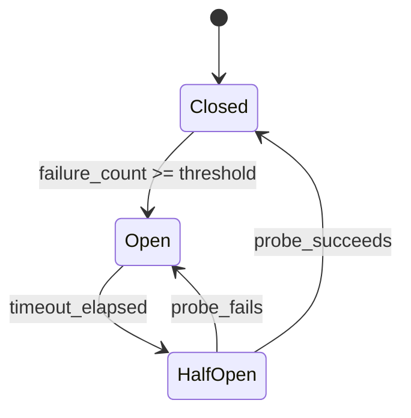

# Error Handling and Recovery

The most dangerous errors in agentic systems are semantic, not syntactic — the system does not crash, but the agent makes a wrong decision that appears correct. A hallucinated tool call returns HTTP 200 with plausible-looking wrong data. A misclassified intent routes the request to the wrong sub-agent. These silent failures bypass traditional error handling entirely because there is no exception to catch, no 5xx to retry. Designing error handling for agents means building detection for failures that look like successes, which requires fundamentally different patterns than conventional distributed systems.

---

## Error Taxonomy

Before designing recovery strategies, categorize the errors your system will encounter.

| Category | Examples | Retryable | Recovery Strategy |
|----------|----------|-----------|------------------|
| **Transient** | Network timeout, 503, connection reset | Yes | Retry with backoff |
| **Rate limit** | 429 from LLM API | Yes (after delay) | Backoff + queue throttling |
| **Context overflow** | Prompt exceeds max tokens | No (as-is) | Truncate, summarize, or split |
| **Malformed output** | LLM returns invalid JSON, wrong tool name | Partial | Re-prompt with correction |
| **Hallucination** | LLM invents a tool, fabricates data | No | Validation + re-prompt |
| **Tool failure** | External API down, permission denied | Depends | Fallback tool or skip |
| **Budget exceeded** | Cost or token budget exhausted | No | Graceful termination |
| **Poisoned input** | Prompt injection, adversarial input | No | Reject + log |

---

## Retry Strategies

### Exponential Backoff with Jitter

The standard pattern for transient failures. Exponential backoff prevents thundering herd; jitter prevents synchronized retries from multiple workers.

```python
def retry_with_backoff(max_retries=3, base_delay=1.0, max_delay=60.0, jitter=True):
    # Decorator: retries on transient exceptions with exponential backoff
    for attempt in range(max_retries + 1):
        try:
            return await func(*args, **kwargs)
        except retryable_exceptions:
            if attempt == max_retries: raise
            delay = min(base_delay * (2 ** attempt), max_delay)
            if jitter: delay *= (0.5 + random.random())
            await asyncio.sleep(delay)

# Usage
class LLMClient:
    @retry_with_backoff(max_retries=3, base_delay=1.0)
    async def generate(self, prompt, **kwargs):
        return await self._provider.complete(prompt, **kwargs)
```

### Rate-Limit-Aware Retry

LLM APIs return `Retry-After` headers when rate-limited. Respect these rather than using a generic backoff.

```python
class RateLimitAwareClient:
    async def generate(self, prompt, **kwargs):
        for attempt in range(5):
            try:
                return await self._provider.complete(prompt, **kwargs)
            except RateLimitError as e:
                wait = e.retry_after_seconds or (2 ** attempt)
                await asyncio.sleep(wait + random.uniform(0, 1))
        raise RateLimitExhaustedError("Not recovered after 5 attempts")
```

:::tip
Always extract the `Retry-After` header (or equivalent) from 429 responses. Blindly retrying with exponential backoff can be either too aggressive (still rate-limited) or too conservative (waiting longer than necessary).
:::

---

## Fallback Strategies

When the primary approach fails, fall back to a less capable but more reliable alternative.

### Fallback Chain

```python
class FallbackChain:
    # Try strategies in order until one succeeds
    async def execute(self, *args, **kwargs):
        errors = []
        for strategy in self.strategies:
            try:
                return await strategy.execute(*args, **kwargs)
            except Exception as e:
                errors.append(e)
        raise AllFallbacksExhaustedError(errors)

# Example: GPT-4o -> Claude Sonnet -> GPT-4o-mini -> cached -> template
llm_fallback = FallbackChain([GPT4o(), ClaudeSonnet(), GPT4oMini(),
                               CachedResponse(), Template()])
```

### Tool Fallback

```python
class ToolFallbackExecutor:
    # primary_tools + fallback_tools (e.g., cached version, alt API)

    async def execute(self, tool_name, params):
        try:
            return await self.primary[tool_name].run(params)
        except ToolExecutionError:
            pass  # try fallback
        if tool_name in self.fallback:
            try:
                return await self.fallback[tool_name].run(params)
            except ToolExecutionError:
                pass
        return {"error": True, "message": f"Tool '{tool_name}' unavailable",
                "suggestion": "Try an alternative approach or skip this step."}
```

---

## Dead-Letter Queues

When a task exhausts all retries, do not drop it silently. Route it to a dead-letter queue (DLQ) for investigation and potential manual replay.

```python
class DeadLetterHandler:
    async def handle_failed_task(self, task, error, attempt_count):
        entry = {task.task_id, task.payload, str(error), attempt_count, stack_trace}
        await self.dlq.put(entry)
        await self.alerter.send(severity="warning",
                                title=f"Task sent to DLQ: {task.task_id}")

    async def replay(self, task_id):
        # Re-submit a DLQ task after root cause is fixed
        entry = await self.dlq.get(task_id)
        await self.dispatcher.submit(AgentTask.from_dict(entry["payload"]))
        await self.dlq.mark_replayed(task_id)
```

:::info
Dead-letter queues are non-negotiable in production. Without them, failed tasks disappear, and you lose visibility into systematic issues (e.g., a tool that started failing for all requests).
:::

---

## Circuit Breakers

A circuit breaker prevents an agent from repeatedly calling a failing service, which wastes time and can worsen the downstream failure.

### State Machine



### Implementation

```python
# States: CLOSED (normal) -> OPEN (reject calls) -> HALF_OPEN (probe)

class CircuitBreaker:
    # failure_threshold, recovery_timeout, state, failure_count

    async def call(self, func, *args, **kwargs):
        if self.state == OPEN and timeout_elapsed():
            self.state = HALF_OPEN
        if self.state == OPEN:
            raise CircuitOpenError()
        try:
            result = await func(*args, **kwargs)
            self._on_success()   # HALF_OPEN -> CLOSED, reset count
            return result
        except Exception:
            self._on_failure()   # increment count, OPEN if >= threshold
            raise

# One breaker per dependency
llm_circuit = CircuitBreaker(failure_threshold=5, recovery_timeout=60)
```

---

## Production-Grade Adaptive Circuit Breaker

The counter-based circuit breaker above has two problems in production. First, a burst of 5 failures followed by 100 successes still triggers the breaker if the window has not reset — it conflates burst errors with sustained failure. Second, it treats all errors equally: a rate-limit 429 is a capacity signal (the service is alive but busy), while a connection refused is a health signal (the service may be down). They need different thresholds and different responses.

The following implementation uses a sliding time window instead of a simple counter, and classifies errors by type so that only genuine health failures contribute to the circuit-opening decision.

```python
import time
from collections import deque
from dataclasses import dataclass
from enum import Enum
from typing import Optional, Callable


class CircuitState(Enum):
    CLOSED = "closed"
    OPEN = "open"
    HALF_OPEN = "half_open"


@dataclass
class RequestOutcome:
    timestamp: float
    success: bool
    error_type: Optional[str]  # "health", "capacity", or None for success


class CircuitOpenError(Exception):
    def __init__(self, retry_after: float = 0):
        self.retry_after = retry_after
        super().__init__(f"Circuit open. Retry after {retry_after:.1f}s")


class RateLimitError(Exception):
    pass


class AdaptiveCircuitBreaker:
    """Sliding-window circuit breaker with per-error-type tracking and adaptive thresholds.

    The naive circuit breaker (count N failures, open circuit) has two problems:
    1. A burst of 5 failures followed by 100 successes still triggers the breaker
       if the window hasn't reset. It conflates burst errors with sustained failure.
    2. It treats all errors equally. A rate-limit error (429) is a capacity signal,
       not a health signal. A connection refused is a health signal. They need
       different thresholds.

    This implementation uses a sliding time window (not a counter) and differentiates
    between error types.
    """

    def __init__(
        self,
        window_seconds: int = 60,
        error_rate_threshold: float = 0.5,
        min_requests: int = 10,
        recovery_timeout: int = 30,
        half_open_max_requests: int = 3,
    ):
        self.window_seconds = window_seconds
        self.error_rate_threshold = error_rate_threshold
        self.min_requests = min_requests
        self.recovery_timeout = recovery_timeout
        self.half_open_max_requests = half_open_max_requests
        self.state = CircuitState.CLOSED
        self.requests: deque[RequestOutcome] = deque()
        self.last_failure_time: float = 0
        self.half_open_successes: int = 0
        self.half_open_attempts: int = 0

    async def call(self, func, *args, **kwargs):
        self._cleanup_old_requests()

        if self.state == CircuitState.OPEN:
            if time.time() - self.last_failure_time >= self.recovery_timeout:
                self.state = CircuitState.HALF_OPEN
                self.half_open_successes = 0
                self.half_open_attempts = 0
            else:
                raise CircuitOpenError(
                    retry_after=self.recovery_timeout
                    - (time.time() - self.last_failure_time)
                )

        if self.state == CircuitState.HALF_OPEN:
            if self.half_open_attempts >= self.half_open_max_requests:
                raise CircuitOpenError(retry_after=self.recovery_timeout)
            self.half_open_attempts += 1

        try:
            result = await func(*args, **kwargs)
            self._record_success()
            return result
        except Exception as e:
            self._record_failure(e)
            raise

    def _record_success(self):
        self.requests.append(RequestOutcome(time.time(), True, None))
        if self.state == CircuitState.HALF_OPEN:
            self.half_open_successes += 1
            if self.half_open_successes >= self.half_open_max_requests:
                self.state = CircuitState.CLOSED  # recovered

    def _record_failure(self, error: Exception):
        error_type = self._classify_error(error)
        self.requests.append(RequestOutcome(time.time(), False, error_type))
        self.last_failure_time = time.time()

        if self.state == CircuitState.HALF_OPEN:
            self.state = CircuitState.OPEN  # recovery failed
            return

        # Check if error rate exceeds threshold (only for health-related errors)
        health_errors = [
            r for r in self.requests if not r.success and r.error_type == "health"
        ]
        total_recent = len(self.requests)

        if total_recent >= self.min_requests:
            health_error_rate = len(health_errors) / total_recent
            if health_error_rate >= self.error_rate_threshold:
                self.state = CircuitState.OPEN

    def _classify_error(self, error: Exception) -> str:
        """Distinguish capacity errors from health errors.
        Rate limits (429) are capacity -- the service is alive but busy.
        Connection errors and 5xx are health -- the service may be down."""
        if isinstance(error, RateLimitError):
            return "capacity"  # does NOT count toward circuit breaker
        return "health"  # counts toward circuit breaker

    def _cleanup_old_requests(self):
        cutoff = time.time() - self.window_seconds
        while self.requests and self.requests[0].timestamp < cutoff:
            self.requests.popleft()
```

The error classification is the key design decision. Rate-limit errors (429) indicate a healthy service that is at capacity — opening the circuit breaker would make things worse by directing all traffic to a fallback that may also be at capacity. Connection refused and 5xx errors indicate a genuinely unhealthy service where the circuit breaker should protect the system. This distinction prevents false circuit openings during traffic spikes.

The `min_requests` threshold (default 10) prevents the circuit from opening on insufficient data. Without it, 2 failures out of 2 requests gives a 100% error rate and opens the circuit — even though 2 requests is statistically meaningless. Wait until you have enough samples to make a statistically meaningful decision.

---

## Timeout Management

Every external call needs a timeout. Without explicit timeouts, a hanging LLM call or tool execution can block an agent worker indefinitely.

### Timeout Budget Pattern

```python
class TimeoutBudget:
    # Distributes a total timeout across sequential steps
    def __init__(self, total_seconds):
        self.total = total_seconds
        self.start_time = time.time()

    @property
    def remaining(self):  return max(0, self.total - (time.time() - self.start_time))
    def allocate(self, fraction):  return self.remaining * fraction

# Usage: split remaining budget across LLM + tool
async def execute_agent_step(step, budget):
    if budget.remaining <= 0: raise TimeoutBudgetExhaustedError()
    reasoning = await wait_for(llm.generate(step.prompt), budget.allocate(0.6))
    result = await wait_for(tool.execute(step.tool, step.params), budget.allocate(0.4))
    return reasoning, result
```

### Recommended Timeouts

| Operation | Timeout | Rationale |
|-----------|---------|-----------|
| LLM generation (simple) | 15s | Most calls complete in 2-10s |
| LLM generation (complex, long output) | 60s | Long reasoning chains or code generation |
| Tool execution (API call) | 10s | External APIs should respond quickly |
| Tool execution (code sandbox) | 30s | Code execution can be slow |
| Tool execution (database query) | 5s | Queries should be optimized |
| End-to-end agent task | 120s | Total budget for a multi-step task |
| Human approval wait | 24h | Long-running workflows |

---

## Retry Budget Allocator

Without a shared budget, each step in an agent loop independently retries up to its own limit. A 10-step agent with 3 retries per step can make up to 40 LLM calls on a bad run, turning a $0.02 request into a $0.80 request and a 30-second task into a 5-minute timeout. The retry budget allocator caps total retries across the entire session so that isolated failures can recover while cascading failures trigger fast fallback.

```python
import time


class RetryBudgetAllocator:
    """Distributes a finite retry budget across all steps in an agent session.

    Without a shared budget, each step independently retries 3 times. A 10-step
    agent with 3 retries per step can make up to 40 LLM calls on a bad run,
    turning a $0.02 request into a $0.80 request. The budget allocator caps total
    retries across the entire session.
    """

    def __init__(self, total_retries: int = 5, total_timeout: float = 120.0):
        self.total_retries = total_retries
        self.remaining_retries = total_retries
        self.total_timeout = total_timeout
        self.start_time = time.time()

    def can_retry(self, error: Exception) -> bool:
        if self.remaining_retries <= 0:
            return False
        if time.time() - self.start_time >= self.total_timeout * 0.9:
            return False  # save 10% of timeout for graceful termination
        if not self._is_retryable(error):
            return False
        return True

    def consume_retry(self) -> int:
        self.remaining_retries -= 1
        return self.remaining_retries

    def _is_retryable(self, error: Exception) -> bool:
        return isinstance(error, (TimeoutError, RateLimitError, ConnectionError))

    @property
    def budget_exhausted(self) -> bool:
        return self.remaining_retries <= 0
```

The 90% timeout reservation ensures the agent has time to synthesize a partial result even when retries consume most of the time budget. Without this, the agent exhausts its timeout on retries and the user gets a raw timeout error instead of a partial but useful response.

---

## LLM-Specific Errors

### Rate Limit Handling

```python
class AdaptiveRateLimiter:
    # Semaphore-based; adjusts current_rpm based on API feedback
    # target_rpm = initial_rpm, current_rpm starts at target

    def on_success(self):
        # Slowly ramp back up toward target
        self.current_rpm = min(self.current_rpm + 1, self.target_rpm)

    def on_rate_limit(self):
        # Halve the rate on 429
        self.current_rpm = max(1, self.current_rpm // 2)
```

### Context Window Overflow

When the prompt exceeds the model's context window, the system must reduce the input size.

```python
class ContextOverflowHandler:
    # max_context = model's token limit

    async def handle_overflow(self, messages, system_prompt):
        if count_tokens(messages) <= self.max_context:
            return messages
        # Strategy 1: drop old messages, keep last N turns
        reduced = truncate_history(messages)
        if fits(reduced): return reduced
        # Strategy 2: summarize old messages
        summarized = [summary_of(messages[:-4])] + messages[-4:]
        if fits(summarized): return summarized
        # Strategy 3: truncate individual messages
        return truncate_messages(messages[-4:])
```

### Hallucination Detection

LLMs sometimes hallucinate tool names, parameter values, or factual claims. Detect and handle these before they propagate.

```python
class HallucinationDetector:
    def check_tool_call(self, tool_name, parameters):
        issues = []
        if not self.tool_registry.exists(tool_name):
            issues.append(f"Hallucinated tool: '{tool_name}'")
            closest = self.tool_registry.find_closest(tool_name)
            if closest: issues.append(f"Did you mean '{closest}'?")
            return issues
        # Validate parameters against tool schema
        issues.extend(validate_params(self.tool_registry.resolve(tool_name), parameters))
        return issues

    async def check_factual_claims(self, response, sources):
        return await self.fact_checker.verify(claim=response, evidence=sources)
```

:::warning
Hallucination detection is not foolproof. Treat it as a safety net, not a guarantee. For high-stakes actions (sending emails, modifying data, making payments), always require explicit validation or human approval regardless of hallucination checks.
:::

---

## Error Recovery in Agent Loops

Putting it all together: how does an agent loop handle errors gracefully?

```python
class ResilientAgentLoop:
    async def run(self, task):
        consecutive_errors = 0
        for step in range(self.max_steps):
            try:
                action = await self._get_action(task)
                if action.type == "final_answer": return action.content
                issues = self.hallucination_detector.check_tool_call(action.tool_name, action.parameters)
                if issues:
                    self.memory.add_system_message(f"Tool call issues: {issues}")
                    consecutive_errors += 1; continue
                result = await self._execute_tool_safely(action.tool_name, action.parameters)
                self.memory.add_tool_result(action.tool_name, result)
                consecutive_errors = 0
            except (TimeoutError, RateLimitError):
                consecutive_errors += 1
            except BudgetExceededError:
                return partial_response("Budget exceeded")
            if consecutive_errors >= self.max_consecutive_errors:
                return partial_response("Too many consecutive errors")
        return partial_response("Maximum steps reached")
```

---

## Error Recovery Tradeoffs

Every error handling mechanism involves a tradeoff. The following design decisions come up repeatedly when building production agent systems. There is no universally correct answer — the right choice depends on the workflow type, latency budget, and cost tolerance.

### 1. Retry vs Replan

When a tool call fails, you can retry the same call (hoping for transient recovery) or ask the LLM to replan (choose a different tool or approach). Retrying is cheap — no LLM call, just repeat the HTTP request. But it only works for transient errors. Replanning costs 1000-4000 tokens but can work around permanent failures such as an API being down or a tool being deprecated.

**Decision rule:** Retry up to 2 times for HTTP 5xx and rate limits. Replan immediately for 4xx errors, schema validation failures, and empty results. Never retry hallucinated tool calls — the LLM will hallucinate the same thing again because the same prompt produces the same completion.

### 2. Fail Fast vs Graceful Degradation

A strict system fails the entire request when any step fails. A lenient system skips failed steps and produces a partial result.

Fail-fast is appropriate for **transactional workflows** where a partial result is useless or dangerous — if step 3 of a 5-step payment flow fails, executing steps 4 and 5 on stale data can cause real harm. Graceful degradation is appropriate for **information-gathering workflows** — if 1 of 5 research sources fails, the other 4 still provide value.

The worst design: degrading silently without telling the user. Always surface which steps were skipped and why, so the user can judge whether the partial result is sufficient.

### 3. Error Budget Allocation

In a 10-step agent loop, how many retries total should you allow? Unlimited retries can turn a 30-second task into a 5-minute timeout. The approach: allocate a shared "retry budget" per session (e.g., 5 total retries across all steps). Each retry consumes from the shared budget. When the budget is exhausted, all subsequent failures trigger immediate fallback instead of retry. This prevents cascading retry storms while allowing recovery from isolated failures. See the Retry Budget Allocator implementation above for the concrete algorithm.

### 4. Timeout Granularity: Per-Step vs End-to-End

A per-step timeout (10s for each LLM call) prevents individual steps from blocking indefinitely. An end-to-end timeout (120s for the whole task) prevents the overall task from running too long. You need both: per-step timeouts protect against hung calls, end-to-end timeout protects against "death by a thousand cuts" where each step is slow but within its individual timeout.

The per-step timeout should be set based on **P99 latency** for that operation type, not a fixed value. If your LLM calls have P50 = 2s and P99 = 12s, a 10s per-step timeout will fail 1-2% of legitimate requests. A 15s timeout gives headroom without allowing indefinite hangs.

### 5. Fallback Provider Selection: Round-Robin vs Preference-Ordered

When the primary LLM is down, do you round-robin across fallbacks or use a strict preference order (GPT-4o then Claude Sonnet then GPT-4o-mini)? Preference order ensures consistent quality — the second-best model is tried before the cheapest. Round-robin distributes load but causes quality variance that is hard to debug.

**Use preference order for user-facing requests** where response quality matters. **Use round-robin for background batch processing** where throughput matters more than per-request quality consistency.

### Decision Summary

| Tradeoff | Option A | Option B | Use A When | Use B When |
|----------|----------|----------|------------|------------|
| Retry vs Replan | Retry same call | LLM replans with different tool | Transient errors (5xx, rate limit) | Permanent errors (4xx, schema, empty result) |
| Fail Fast vs Degrade | Abort entire request | Skip failed step, return partial | Transactional workflows | Information-gathering workflows |
| Retry Budget | Per-step budget (3 each) | Shared session budget (5 total) | Independent steps, no cost concern | Cost-sensitive, latency-bounded |
| Timeout Scope | Per-step only | Per-step + end-to-end | Simple single-step agents | Multi-step agents with variable latency |
| Fallback Order | Round-robin | Strict preference | Batch processing, load distribution | User-facing, quality-sensitive |

---

## Interview Preparation

**Sample question:** "How would you handle a scenario where your agent's primary LLM provider goes down mid-conversation?"

**Strong answer structure:**
1. **Circuit breaker** detects the failure after N consecutive errors and opens the circuit
2. **Fallback chain** routes to a secondary provider (or smaller local model)
3. **Checkpoint recovery** -- the agent's state was checkpointed after each step; the fallback provider resumes from the last checkpoint
4. **Graceful degradation** -- if no fallback is available, return a cached or templated response and queue the task for later
5. **Dead-letter queue** -- if the task cannot be completed, route it to the DLQ with full context for manual retry
6. **Observability** -- emit metrics on provider failover rate, alert on-call if DLQ depth exceeds threshold
