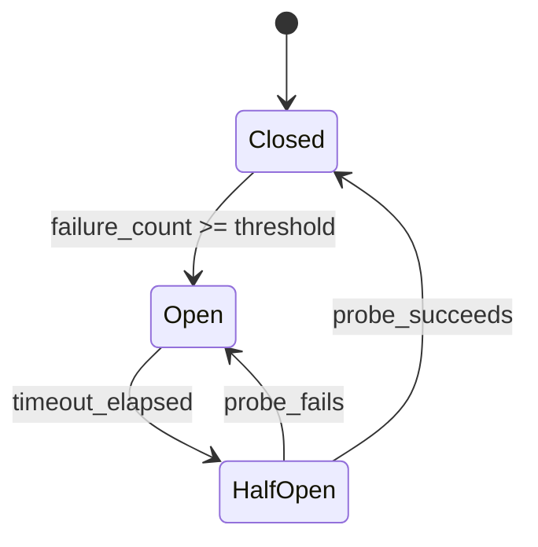

# Error Handling and Recovery

Agentic systems have more failure modes than traditional software. In addition to the usual network errors, timeouts, and crashes, you must handle LLM-specific failures: rate limits, context window overflow, malformed tool calls, and hallucinated outputs. This page covers the patterns that make agents resilient.

---

## Error Taxonomy

Before designing recovery strategies, categorize the errors your system will encounter.

| Category | Examples | Retryable | Recovery Strategy |
|----------|----------|-----------|------------------|
| **Transient** | Network timeout, 503, connection reset | Yes | Retry with backoff |
| **Rate limit** | 429 from LLM API | Yes (after delay) | Backoff + queue throttling |
| **Context overflow** | Prompt exceeds max tokens | No (as-is) | Truncate, summarize, or split |
| **Malformed output** | LLM returns invalid JSON, wrong tool name | Partial | Re-prompt with correction |
| **Hallucination** | LLM invents a tool, fabricates data | No | Validation + re-prompt |
| **Tool failure** | External API down, permission denied | Depends | Fallback tool or skip |
| **Budget exceeded** | Cost or token budget exhausted | No | Graceful termination |
| **Poisoned input** | Prompt injection, adversarial input | No | Reject + log |

---

## Retry Strategies

### Exponential Backoff with Jitter

The standard pattern for transient failures. Exponential backoff prevents thundering herd; jitter prevents synchronized retries from multiple workers.

```python
def retry_with_backoff(max_retries=3, base_delay=1.0, max_delay=60.0, jitter=True):
    # Decorator: retries on transient exceptions with exponential backoff
    for attempt in range(max_retries + 1):
        try:
            return await func(*args, **kwargs)
        except retryable_exceptions:
            if attempt == max_retries: raise
            delay = min(base_delay * (2 ** attempt), max_delay)
            if jitter: delay *= (0.5 + random.random())
            await asyncio.sleep(delay)

# Usage
class LLMClient:
    @retry_with_backoff(max_retries=3, base_delay=1.0)
    async def generate(self, prompt, **kwargs):
        return await self._provider.complete(prompt, **kwargs)
```

### Rate-Limit-Aware Retry

LLM APIs return `Retry-After` headers when rate-limited. Respect these rather than using a generic backoff.

```python
class RateLimitAwareClient:
    async def generate(self, prompt, **kwargs):
        for attempt in range(5):
            try:
                return await self._provider.complete(prompt, **kwargs)
            except RateLimitError as e:
                wait = e.retry_after_seconds or (2 ** attempt)
                await asyncio.sleep(wait + random.uniform(0, 1))
        raise RateLimitExhaustedError("Not recovered after 5 attempts")
```

:::tip
Always extract the `Retry-After` header (or equivalent) from 429 responses. Blindly retrying with exponential backoff can be either too aggressive (still rate-limited) or too conservative (waiting longer than necessary).
:::

---

## Fallback Strategies

When the primary approach fails, fall back to a less capable but more reliable alternative.

### Fallback Chain

```python
class FallbackChain:
    # Try strategies in order until one succeeds
    async def execute(self, *args, **kwargs):
        errors = []
        for strategy in self.strategies:
            try:
                return await strategy.execute(*args, **kwargs)
            except Exception as e:
                errors.append(e)
        raise AllFallbacksExhaustedError(errors)

# Example: GPT-4o -> Claude Sonnet -> GPT-4o-mini -> cached -> template
llm_fallback = FallbackChain([GPT4o(), ClaudeSonnet(), GPT4oMini(),
                               CachedResponse(), Template()])
```

### Tool Fallback

```python
class ToolFallbackExecutor:
    # primary_tools + fallback_tools (e.g., cached version, alt API)

    async def execute(self, tool_name, params):
        try:
            return await self.primary[tool_name].run(params)
        except ToolExecutionError:
            pass  # try fallback
        if tool_name in self.fallback:
            try:
                return await self.fallback[tool_name].run(params)
            except ToolExecutionError:
                pass
        return {"error": True, "message": f"Tool '{tool_name}' unavailable",
                "suggestion": "Try an alternative approach or skip this step."}
```

---

## Dead-Letter Queues

When a task exhausts all retries, do not drop it silently. Route it to a dead-letter queue (DLQ) for investigation and potential manual replay.

```python
class DeadLetterHandler:
    async def handle_failed_task(self, task, error, attempt_count):
        entry = {task.task_id, task.payload, str(error), attempt_count, stack_trace}
        await self.dlq.put(entry)
        await self.alerter.send(severity="warning",
                                title=f"Task sent to DLQ: {task.task_id}")

    async def replay(self, task_id):
        # Re-submit a DLQ task after root cause is fixed
        entry = await self.dlq.get(task_id)
        await self.dispatcher.submit(AgentTask.from_dict(entry["payload"]))
        await self.dlq.mark_replayed(task_id)
```

:::info
Dead-letter queues are non-negotiable in production. Without them, failed tasks disappear, and you lose visibility into systematic issues (e.g., a tool that started failing for all requests).
:::

---

## Circuit Breakers

A circuit breaker prevents an agent from repeatedly calling a failing service, which wastes time and can worsen the downstream failure.

### State Machine



### Implementation

```python
# States: CLOSED (normal) -> OPEN (reject calls) -> HALF_OPEN (probe)

class CircuitBreaker:
    # failure_threshold, recovery_timeout, state, failure_count

    async def call(self, func, *args, **kwargs):
        if self.state == OPEN and timeout_elapsed():
            self.state = HALF_OPEN
        if self.state == OPEN:
            raise CircuitOpenError()
        try:
            result = await func(*args, **kwargs)
            self._on_success()   # HALF_OPEN -> CLOSED, reset count
            return result
        except Exception:
            self._on_failure()   # increment count, OPEN if >= threshold
            raise

# One breaker per dependency
llm_circuit = CircuitBreaker(failure_threshold=5, recovery_timeout=60)
```

---

## Timeout Management

Every external call needs a timeout. Without explicit timeouts, a hanging LLM call or tool execution can block an agent worker indefinitely.

### Timeout Budget Pattern

```python
class TimeoutBudget:
    # Distributes a total timeout across sequential steps
    def __init__(self, total_seconds):
        self.total = total_seconds
        self.start_time = time.time()

    @property
    def remaining(self):  return max(0, self.total - (time.time() - self.start_time))
    def allocate(self, fraction):  return self.remaining * fraction

# Usage: split remaining budget across LLM + tool
async def execute_agent_step(step, budget):
    if budget.remaining <= 0: raise TimeoutBudgetExhaustedError()
    reasoning = await wait_for(llm.generate(step.prompt), budget.allocate(0.6))
    result = await wait_for(tool.execute(step.tool, step.params), budget.allocate(0.4))
    return reasoning, result
```

### Recommended Timeouts

| Operation | Timeout | Rationale |
|-----------|---------|-----------|
| LLM generation (simple) | 15s | Most calls complete in 2-10s |
| LLM generation (complex, long output) | 60s | Long reasoning chains or code generation |
| Tool execution (API call) | 10s | External APIs should respond quickly |
| Tool execution (code sandbox) | 30s | Code execution can be slow |
| Tool execution (database query) | 5s | Queries should be optimized |
| End-to-end agent task | 120s | Total budget for a multi-step task |
| Human approval wait | 24h | Long-running workflows |

---

## LLM-Specific Errors

### Rate Limit Handling

```python
class AdaptiveRateLimiter:
    # Semaphore-based; adjusts current_rpm based on API feedback
    # target_rpm = initial_rpm, current_rpm starts at target

    def on_success(self):
        # Slowly ramp back up toward target
        self.current_rpm = min(self.current_rpm + 1, self.target_rpm)

    def on_rate_limit(self):
        # Halve the rate on 429
        self.current_rpm = max(1, self.current_rpm // 2)
```

### Context Window Overflow

When the prompt exceeds the model's context window, the system must reduce the input size.

```python
class ContextOverflowHandler:
    # max_context = model's token limit

    async def handle_overflow(self, messages, system_prompt):
        if count_tokens(messages) <= self.max_context:
            return messages
        # Strategy 1: drop old messages, keep last N turns
        reduced = truncate_history(messages)
        if fits(reduced): return reduced
        # Strategy 2: summarize old messages
        summarized = [summary_of(messages[:-4])] + messages[-4:]
        if fits(summarized): return summarized
        # Strategy 3: truncate individual messages
        return truncate_messages(messages[-4:])
```

### Hallucination Detection

LLMs sometimes hallucinate tool names, parameter values, or factual claims. Detect and handle these before they propagate.

```python
class HallucinationDetector:
    def check_tool_call(self, tool_name, parameters):
        issues = []
        if not self.tool_registry.exists(tool_name):
            issues.append(f"Hallucinated tool: '{tool_name}'")
            closest = self.tool_registry.find_closest(tool_name)
            if closest: issues.append(f"Did you mean '{closest}'?")
            return issues
        # Validate parameters against tool schema
        issues.extend(validate_params(self.tool_registry.resolve(tool_name), parameters))
        return issues

    async def check_factual_claims(self, response, sources):
        return await self.fact_checker.verify(claim=response, evidence=sources)
```

:::warning
Hallucination detection is not foolproof. Treat it as a safety net, not a guarantee. For high-stakes actions (sending emails, modifying data, making payments), always require explicit validation or human approval regardless of hallucination checks.
:::

---

## Error Recovery in Agent Loops

Putting it all together: how does an agent loop handle errors gracefully?

```python
class ResilientAgentLoop:
    async def run(self, task):
        consecutive_errors = 0
        for step in range(self.max_steps):
            try:
                action = await self._get_action(task)
                if action.type == "final_answer": return action.content
                issues = self.hallucination_detector.check_tool_call(action.tool_name, action.parameters)
                if issues:
                    self.memory.add_system_message(f"Tool call issues: {issues}")
                    consecutive_errors += 1; continue
                result = await self._execute_tool_safely(action.tool_name, action.parameters)
                self.memory.add_tool_result(action.tool_name, result)
                consecutive_errors = 0
            except (TimeoutError, RateLimitError):
                consecutive_errors += 1
            except BudgetExceededError:
                return partial_response("Budget exceeded")
            if consecutive_errors >= self.max_consecutive_errors:
                return partial_response("Too many consecutive errors")
        return partial_response("Maximum steps reached")
```

---

## Interview Preparation

**Sample question:** "How would you handle a scenario where your agent's primary LLM provider goes down mid-conversation?"

**Strong answer structure:**
1. **Circuit breaker** detects the failure after N consecutive errors and opens the circuit
2. **Fallback chain** routes to a secondary provider (or smaller local model)
3. **Checkpoint recovery** -- the agent's state was checkpointed after each step; the fallback provider resumes from the last checkpoint
4. **Graceful degradation** -- if no fallback is available, return a cached or templated response and queue the task for later
5. **Dead-letter queue** -- if the task cannot be completed, route it to the DLQ with full context for manual retry
6. **Observability** -- emit metrics on provider failover rate, alert on-call if DLQ depth exceeds threshold
