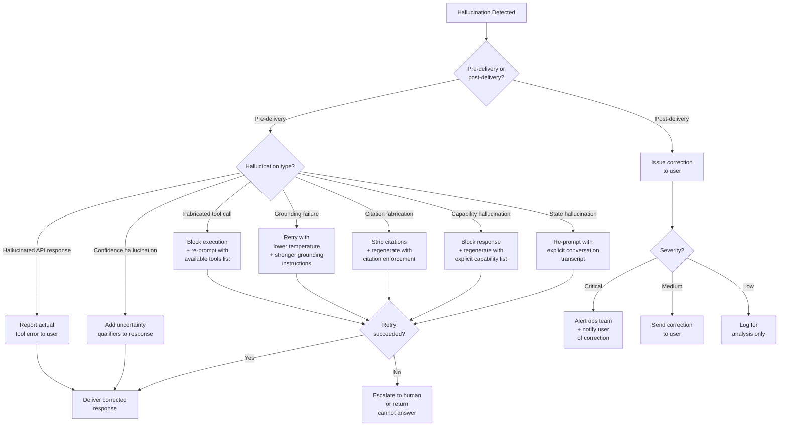
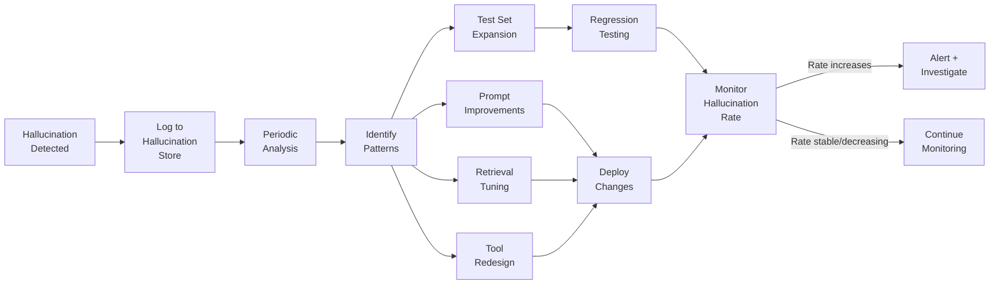
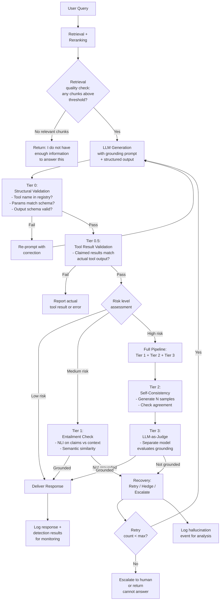

# Hallucination Mitigation

Hallucinations in agentic AI systems are categorically more dangerous than hallucinations in standalone LLM chat applications. When a chatbot hallucinates, a human reads a wrong sentence. When an agent hallucinates, it executes a wrong action -- it calls a fabricated tool, writes invented data to a database, sends a confidently wrong email, or reports task completion when nothing was actually done. The hallucination crosses the boundary from text into real-world side effects. Traditional LLM hallucination research focuses on factual accuracy of generated text; agentic hallucination mitigation must additionally address fabricated actions, invented state, and false capability claims -- failure modes that do not exist in non-agentic settings.

The cost asymmetry is extreme. Detecting a hallucination before the agent acts costs pennies (a schema validation, an entailment check). Detecting it after the agent acts costs orders of magnitude more (rolling back a database write, retracting a sent email, explaining to a customer why they received fabricated information). Every technique in this document is designed to shift detection left -- to catch hallucinations before they become actions.

---

## 1. Taxonomy of Hallucinations in Agentic Systems

Generic LLM hallucination taxonomies (factual errors, entity confusion, temporal errors) are necessary but insufficient for agents. Agentic systems introduce seven hallucination types that have no analogue in pure text generation.

### 1.1 Fabricated Tool Calls

The agent invents a tool that does not exist in the tool registry, or calls a real tool with fabricated parameters.

**Example:** The agent needs to look up an order. No `get_order` tool exists, but the agent generates a tool call to `get_order(order_id="ORD-2024-88712")`. The order ID is also invented -- the user never provided it.

**Why it happens:** The LLM's training data contains many examples of tool-calling patterns. When the model determines that a tool should exist, it generates a plausible call regardless of whether the tool is actually registered. Parameter fabrication occurs when the model infers what a parameter value "should be" from context rather than from explicit user input.

### 1.2 Hallucinated API Responses

When a tool call fails silently (returns an empty response, times out, or throws an unhandled exception), the agent generates a plausible-looking but completely fabricated response as if the tool had succeeded.

**Example:** The agent calls a weather API that returns a 500 error. Instead of reporting the failure, the agent responds: "The current temperature in San Francisco is 68F with partly cloudy skies." The response is entirely fabricated.

**Why it happens:** The model is trained to be helpful and to produce complete answers. When a tool response is absent or ambiguous, the model fills the gap from parametric knowledge rather than acknowledging the failure.

### 1.3 Grounding Failures

The agent ignores retrieved context and generates from its parametric (training) knowledge instead. The retrieved documents say X, but the agent says Y because Y is what the model "remembers" from training.

**Example:** A RAG agent retrieves a company's refund policy that states "refunds are processed within 14 business days." The agent responds: "Your refund will be processed within 3-5 business days" -- a common statement from training data, but wrong for this company.

**Why it happens:** When parametric knowledge conflicts with retrieved context, the model sometimes favors parametric knowledge, especially when the parametric knowledge is high-confidence (frequently seen during training) and the retrieved context is low-salience (buried in a long prompt or presented after strong parametric priors).

### 1.4 Citation Fabrication

The agent cites sources that do not exist or attributes claims to the wrong source.

**Example:** The agent responds "According to the Q3 2024 Earnings Report (page 12), revenue grew 23% year-over-year." The earnings report exists, but page 12 discusses operating expenses, not revenue. The 23% figure appears nowhere in the document.

**Why it happens:** The model generates citation-like structures because they appear authoritative. The model can fabricate DOIs, URLs, page numbers, and section headings that follow the correct format but point to nonexistent content.

### 1.5 State Hallucination

The agent "remembers" information from earlier in the conversation that was never actually said, or confuses information between different users/sessions.

**Example:** A multi-turn agent says "As you mentioned earlier, you prefer overnight shipping." The user never said this. The model confabulated a plausible user preference that fits the conversational pattern.

**Why it happens:** Long conversation histories create opportunities for the model to pattern-match against conversational structures rather than accurately recalling specific statements. In multi-session architectures where conversation summaries are used as memory, lossy summarization can introduce facts that were implied but never stated.

### 1.6 Capability Hallucination

The agent claims to have performed an action that it cannot actually perform -- either because the required tool does not exist or because the tool was not invoked.

**Example:** The agent says "I have sent a confirmation email to john@example.com" when no email-sending tool is available, or when the tool exists but the agent never actually called it.

**Why it happens:** The model has been trained on data where assistants confirm completed actions. The model generates action-completion language as a conversational pattern, independent of whether the action was actually executed.

### 1.7 Confidence Hallucination

The agent expresses high confidence in uncertain or incorrect answers, failing to communicate appropriate epistemic uncertainty.

**Example:** "The contract definitely expires on March 15, 2025" when the retrieved document is ambiguous about the exact date, or when no contract document was retrieved at all.

**Why it happens:** LLMs are not calibrated -- they do not have reliable internal uncertainty estimates. The model generates confident-sounding language by default because that is the dominant pattern in training data.

### Hallucination Type Comparison

| Type | Example | Detection Difficulty | Impact Severity | Frequency in Production |
|------|---------|---------------------|-----------------|------------------------|
| **Fabricated tool call** | Agent calls `delete_account(id="USR-999")` -- tool and ID both invented | Low (structural check) | Critical -- may execute destructive actions | Medium |
| **Hallucinated API response** | Agent reports "Order shipped" when shipping API returned 500 | Medium (requires comparing tool output to agent response) | High -- user acts on false information | Medium |
| **Grounding failure** | Agent ignores retrieved policy, answers from training data | High (requires NLI or semantic comparison) | High -- wrong answers presented as authoritative | High |
| **Citation fabrication** | Agent cites "Section 4.2" which does not exist in the document | Medium (requires lookup against source) | Medium -- erodes trust, complicates verification | Medium |
| **State hallucination** | Agent says "You mentioned you are a premium member" -- never said | High (requires full conversation scan) | Medium -- leads to wrong personalization or decisions | Low |
| **Capability hallucination** | Agent claims "Email sent" when no email tool was invoked | Low (check execution log) | Critical -- user believes action was taken | Low-Medium |
| **Confidence hallucination** | Agent says "definitely" about an uncertain claim | Very High (requires calibration analysis) | Medium -- user trusts wrong information | Very High |

:::warning
Grounding failures and confidence hallucinations are the hardest to detect because they produce well-formed, plausible text. Fabricated tool calls and capability hallucinations are the easiest to detect because they leave structural evidence (missing tool names in registry, missing entries in execution logs). Design your detection pipeline to exploit this: run cheap structural checks first, expensive semantic checks second.
:::

---

## 2. Detection Techniques

Detection techniques are ordered from cheapest/fastest to most expensive/slowest. A production system should run them in this order and short-circuit when a violation is found.

### 2.1 Structural Validation (Tier 0 -- Cheapest, Run First)

Structural validation catches fabricated tool calls, schema violations, and obviously malformed outputs. It costs nothing beyond CPU time and should run on every single agent output.

#### Tool Call Validation

Every tool call the agent generates must be validated against the tool registry before execution.

```python
from dataclasses import dataclass
from typing import Any
import jsonschema


@dataclass
class ToolValidationResult:
    is_valid: bool
    error_type: str | None = None
    error_detail: str | None = None


class ToolCallValidator:
    """Validates agent-generated tool calls against the tool registry."""

    def __init__(self, tool_registry: dict[str, dict]):
        # tool_registry maps tool_name -> {"description": ..., "parameters": <JSON Schema>}
        self._registry = tool_registry

    def validate(self, tool_name: str, parameters: dict[str, Any]) -> ToolValidationResult:
        # 1. Check tool exists
        if tool_name not in self._registry:
            return ToolValidationResult(
                is_valid=False,
                error_type="fabricated_tool",
                error_detail=f"Tool '{tool_name}' does not exist in registry. "
                             f"Available: {list(self._registry.keys())}",
            )

        tool_schema = self._registry[tool_name]["parameters"]

        # 2. Validate parameters against JSON Schema
        try:
            jsonschema.validate(instance=parameters, schema=tool_schema)
        except jsonschema.ValidationError as e:
            return ToolValidationResult(
                is_valid=False,
                error_type="invalid_parameters",
                error_detail=f"Parameter validation failed: {e.message}",
            )

        # 3. Check for suspicious parameter values (optional heuristics)
        suspicious = self._check_suspicious_values(tool_name, parameters)
        if suspicious:
            return ToolValidationResult(
                is_valid=False,
                error_type="suspicious_parameters",
                error_detail=suspicious,
            )

        return ToolValidationResult(is_valid=True)

    def _check_suspicious_values(self, tool_name: str, parameters: dict) -> str | None:
        """Heuristic checks for fabricated parameter values."""
        for key, value in parameters.items():
            if isinstance(value, str):
                # Detect placeholder-like values the LLM might generate
                placeholders = ["example", "test", "sample", "placeholder", "xxx", "12345"]
                if any(p in value.lower() for p in placeholders):
                    return f"Parameter '{key}' contains placeholder-like value: '{value}'"
        return None
```

#### Output Schema Validation

When the agent is expected to produce structured output, enforce the schema strictly.

```python
import jsonschema

RESPONSE_SCHEMA = {
    "type": "object",
    "properties": {
        "answer": {"type": "string", "minLength": 1},
        "sources": {
            "type": "array",
            "items": {
                "type": "object",
                "properties": {
                    "document_id": {"type": "string"},
                    "chunk_index": {"type": "integer", "minimum": 0},
                    "relevance_score": {"type": "number", "minimum": 0, "maximum": 1},
                },
                "required": ["document_id", "chunk_index"],
            },
        },
        "confidence": {"type": "number", "minimum": 0, "maximum": 1},
    },
    "required": ["answer", "sources", "confidence"],
}


def validate_agent_output(output: dict) -> tuple[bool, str | None]:
    """Validate that the agent's structured output conforms to the expected schema."""
    try:
        jsonschema.validate(instance=output, schema=RESPONSE_SCHEMA)
        return True, None
    except jsonschema.ValidationError as e:
        return False, f"Output schema violation: {e.message}"
```

#### Reference Validation

When the agent cites document IDs, URLs, or database records, verify they exist.

```python
class ReferenceValidator:
    """Validates that cited references actually exist in the source corpus."""

    def __init__(self, document_store):
        self._store = document_store

    async def validate_citations(self, citations: list[dict]) -> list[dict]:
        """Returns list of invalid citations with reasons."""
        invalid = []
        for citation in citations:
            doc_id = citation.get("document_id")
            chunk_idx = citation.get("chunk_index")

            # Check document exists
            doc = await self._store.get_document(doc_id)
            if doc is None:
                invalid.append({
                    "citation": citation,
                    "reason": f"Document '{doc_id}' does not exist in store",
                })
                continue

            # Check chunk index is valid
            if chunk_idx is not None and chunk_idx >= doc.chunk_count:
                invalid.append({
                    "citation": citation,
                    "reason": f"Chunk index {chunk_idx} out of range "
                              f"(document has {doc.chunk_count} chunks)",
                })

        return invalid
```

:::tip Interview Angle
When asked "How do you prevent hallucinated tool calls?", the first answer should always be structural validation -- it catches fabricated tool names and invalid parameters at near-zero cost. This is the highest-ROI mitigation and should be implemented before any model-based detection.
:::

---

### 2.2 Retrieval-Based Grounding Checks (Tier 1)

Grounding checks verify that the agent's response is actually supported by the retrieved context. This catches grounding failures and citation fabrication.

#### Entailment Verification

Use a lightweight Natural Language Inference (NLI) model to check whether the response is entailed by the retrieved context.

```python
from transformers import pipeline
from dataclasses import dataclass


@dataclass
class GroundingResult:
    is_grounded: bool
    entailment_score: float
    contradiction_score: float
    neutral_score: float
    flagged_claims: list[dict] | None = None


class EntailmentChecker:
    """
    Uses an NLI model to verify that agent responses are entailed
    by the retrieved context.

    Model: cross-encoder/nli-deberta-v3-base (or similar)
    - Entailment: the context supports the claim
    - Contradiction: the context contradicts the claim
    - Neutral: the context neither supports nor contradicts
    """

    def __init__(
        self,
        model_name: str = "cross-encoder/nli-deberta-v3-base",
        entailment_threshold: float = 0.7,
        contradiction_threshold: float = 0.5,
    ):
        self._classifier = pipeline(
            "zero-shot-classification",
            model=model_name,
            device="cpu",  # Use "cuda" in production
        )
        self._entailment_threshold = entailment_threshold
        self._contradiction_threshold = contradiction_threshold

    def check_grounding(
        self,
        response: str,
        context_chunks: list[str],
    ) -> GroundingResult:
        """
        Check if the response is entailed by the concatenated context.

        For production use, decompose the response into atomic claims
        and check each one independently (see claim_decomposition below).
        """
        combined_context = "\n\n".join(context_chunks)

        # NLI classification: does the context entail the response?
        result = self._classifier(
            sequences=response,
            candidate_labels=["entailment", "contradiction", "neutral"],
            hypothesis_template="{}",
            multi_label=False,
        )

        scores = dict(zip(result["labels"], result["scores"]))
        entailment = scores.get("entailment", 0)
        contradiction = scores.get("contradiction", 0)
        neutral = scores.get("neutral", 0)

        is_grounded = (
            entailment >= self._entailment_threshold
            and contradiction < self._contradiction_threshold
        )

        return GroundingResult(
            is_grounded=is_grounded,
            entailment_score=entailment,
            contradiction_score=contradiction,
            neutral_score=neutral,
        )
```

#### Claim Decomposition

Rather than checking the entire response as a single unit, decompose it into atomic claims and verify each independently. This provides finer-grained detection -- you can identify exactly which sentence is hallucinated.

```python
class ClaimDecomposer:
    """
    Decomposes an agent response into atomic, independently verifiable claims.
    Uses an LLM for decomposition (cheaper than the primary generation).
    """

    DECOMPOSITION_PROMPT = """Break the following text into a list of atomic factual claims.
Each claim should be a single, independently verifiable statement.
Do not include opinions, hedged statements, or meta-commentary.
Return as a JSON array of strings.

Text: {response}

Atomic claims (JSON array):"""

    def __init__(self, llm_client):
        self._llm = llm_client

    async def decompose(self, response: str) -> list[str]:
        result = await self._llm.generate(
            self.DECOMPOSITION_PROMPT.format(response=response),
            temperature=0.0,
            response_format={"type": "json_object"},
        )
        return result.get("claims", [])


class ClaimVerifier:
    """
    Verifies each atomic claim against the retrieved context chunks.
    Returns per-claim verification results.
    """

    def __init__(self, entailment_checker: EntailmentChecker):
        self._checker = entailment_checker

    def verify_claims(
        self,
        claims: list[str],
        context_chunks: list[str],
    ) -> list[dict]:
        results = []
        for claim in claims:
            grounding = self._checker.check_grounding(claim, context_chunks)
            results.append({
                "claim": claim,
                "is_grounded": grounding.is_grounded,
                "entailment_score": grounding.entailment_score,
                "contradiction_score": grounding.contradiction_score,
                "verdict": self._verdict(grounding),
            })
        return results

    def _verdict(self, grounding: GroundingResult) -> str:
        if grounding.contradiction_score >= 0.5:
            return "CONTRADICTED"
        if grounding.entailment_score >= 0.7:
            return "SUPPORTED"
        return "UNVERIFIABLE"
```

#### Semantic Similarity Check

A lightweight alternative to NLI: compute cosine similarity between the response embedding and the retrieved context embeddings. Low similarity suggests the response has drifted from the provided context.

```python
import numpy as np
from sentence_transformers import SentenceTransformer


class SemanticGroundingChecker:
    """
    Checks semantic similarity between agent response and retrieved context.
    Low similarity indicates potential grounding failure.
    """

    def __init__(
        self,
        model_name: str = "sentence-transformers/all-MiniLM-L6-v2",
        similarity_threshold: float = 0.45,
    ):
        self._model = SentenceTransformer(model_name)
        self._threshold = similarity_threshold

    def check(self, response: str, context_chunks: list[str]) -> dict:
        response_emb = self._model.encode([response])
        context_embs = self._model.encode(context_chunks)

        # Compute cosine similarity with each chunk
        similarities = np.dot(context_embs, response_emb.T).flatten()
        max_sim = float(np.max(similarities))
        avg_sim = float(np.mean(similarities))

        return {
            "max_similarity": max_sim,
            "avg_similarity": avg_sim,
            "is_grounded": max_sim >= self._threshold,
            "most_relevant_chunk_idx": int(np.argmax(similarities)),
        }
```

:::info
Semantic similarity is a weak signal compared to NLI. Two texts can be semantically similar (same topic) without one entailing the other. Use similarity as a fast pre-filter: if similarity is very low (< 0.3), the response is almost certainly ungrounded. If similarity is high, you still need entailment checking to confirm factual accuracy.
:::

---

### 2.3 Self-Consistency Checking (Tier 2)

Generate multiple responses to the same prompt at temperature > 0 and check whether they agree on factual claims. Disagreement indicates the model is uncertain, which correlates with hallucination risk.

```python
import asyncio
from collections import Counter


class SelfConsistencyChecker:
    """
    Generates multiple responses and checks for factual agreement.
    Disagreement on factual claims signals hallucination risk.
    """

    def __init__(self, llm_client, num_samples: int = 5, temperature: float = 0.7):
        self._llm = llm_client
        self._num_samples = num_samples
        self._temperature = temperature

    async def check(self, prompt: str, context: str) -> dict:
        # Generate multiple responses in parallel
        tasks = [
            self._llm.generate(
                prompt,
                context=context,
                temperature=self._temperature,
            )
            for _ in range(self._num_samples)
        ]
        responses = await asyncio.gather(*tasks)

        # Extract factual claims from each response
        decomposer = ClaimDecomposer(self._llm)
        all_claims = []
        for resp in responses:
            claims = await decomposer.decompose(resp)
            all_claims.append(set(claims))

        # Find claims that appear in all responses (consistent)
        # vs claims that appear in only some (inconsistent)
        claim_counts = Counter()
        for claims_set in all_claims:
            for claim in claims_set:
                claim_counts[claim] += 1

        consistent = {c for c, n in claim_counts.items() if n >= self._num_samples * 0.8}
        inconsistent = {c for c, n in claim_counts.items() if n < self._num_samples * 0.5}

        return {
            "num_samples": self._num_samples,
            "consistent_claims": list(consistent),
            "inconsistent_claims": list(inconsistent),
            "consistency_ratio": len(consistent) / max(len(claim_counts), 1),
            "is_reliable": len(inconsistent) == 0,
        }
```

:::warning
Self-consistency multiplies your LLM costs by the number of samples. Use it selectively: only for high-stakes outputs (financial calculations, medical information, legal advice) where the cost of a hallucination exceeds the cost of multiple LLM calls.
:::

**When self-consistency fails:** If the model consistently hallucinates the same wrong answer (e.g., a widely-believed misconception in training data), all samples will agree on the wrong claim. Self-consistency detects model uncertainty, not model error.

---

### 2.4 LLM-as-Judge (Tier 3)

Use a separate LLM call to evaluate whether the agent's response is grounded in the provided context. This is the most expensive detection technique but also the most flexible.

```python
class LLMGroundingJudge:
    """
    Uses a separate LLM call to evaluate whether the response
    is grounded in the provided context.
    """

    JUDGE_PROMPT = """You are a grounding verification judge. Your task is to determine
whether the Response is fully supported by the provided Context.

Context:
{context}

Response to evaluate:
{response}

For each sentence in the Response, determine:
1. SUPPORTED - the sentence is directly supported by information in the Context
2. PARTIALLY_SUPPORTED - the sentence is partially supported but adds unsupported details
3. NOT_SUPPORTED - the sentence contains information not found in the Context
4. CONTRADICTED - the sentence contradicts information in the Context

Return a JSON object with:
- "sentences": array of objects with "text", "verdict", and "reasoning"
- "overall_verdict": "GROUNDED" if all sentences are SUPPORTED or PARTIALLY_SUPPORTED,
  "PARTIALLY_GROUNDED" if some are NOT_SUPPORTED, "UNGROUNDED" if most are NOT_SUPPORTED
  or any are CONTRADICTED
- "grounding_score": float 0-1 representing overall groundedness
- "flagged_issues": array of strings describing specific grounding concerns"""

    def __init__(self, judge_llm_client):
        self._judge = judge_llm_client

    async def evaluate(self, response: str, context_chunks: list[str]) -> dict:
        context = "\n\n---\n\n".join(context_chunks)
        prompt = self.JUDGE_PROMPT.format(context=context, response=response)

        result = await self._judge.generate(
            prompt,
            temperature=0.0,
            response_format={"type": "json_object"},
        )
        return result
```

**Limitations of LLM-as-Judge:**

| Limitation | Description | Mitigation |
|-----------|-------------|------------|
| **Meta-hallucination** | The judge LLM can itself hallucinate, approving an ungrounded claim | Use a different model family for the judge than for the generator |
| **Context window limits** | Long contexts may exceed the judge's window | Chunk the evaluation: verify each response sentence against the top-3 most relevant context chunks |
| **Cost** | Each evaluation is a full LLM call ($0.01-0.05) | Only use for high-stakes outputs; use cheaper techniques as pre-filters |
| **Latency** | Adds 1-3 seconds per evaluation | Run in parallel with response delivery where possible; or gate only on high-risk outputs |

:::tip Interview Angle
When discussing LLM-as-Judge, always mention the meta-hallucination problem: the judge can approve a hallucinated response because it also lacks the knowledge to detect the fabrication. This demonstrates you understand the fundamental limitation rather than treating LLM-as-Judge as a silver bullet.
:::

---

### 2.5 Tool Result Validation (Tier 0.5)

This technique sits between structural validation and grounding checks. It validates that the agent's reported tool results match what the tool actually returned.

```python
class ToolResultValidator:
    """
    Compares what the tool actually returned with what the agent
    claims the tool returned. Detects hallucinated API responses.
    """

    def __init__(self):
        self._execution_log: list[dict] = []

    def record_execution(self, tool_name: str, params: dict, result: dict):
        """Called by the tool executor after every tool invocation."""
        self._execution_log.append({
            "tool_name": tool_name,
            "params": params,
            "result": result,
            "timestamp": time.time(),
        })

    def validate_agent_claims(self, agent_response: str) -> list[dict]:
        """
        Cross-reference the agent's natural language response against
        the actual tool execution results.
        """
        violations = []

        # Check: did the agent claim to call a tool it never called?
        for claimed_tool in self._extract_claimed_tools(agent_response):
            if not any(
                log["tool_name"] == claimed_tool
                for log in self._execution_log
            ):
                violations.append({
                    "type": "capability_hallucination",
                    "detail": f"Agent claims to have used '{claimed_tool}' "
                              f"but no execution record exists",
                })

        # Check: did the agent report results that differ from actual tool output?
        for log_entry in self._execution_log:
            if log_entry["result"].get("error"):
                # Tool returned an error -- agent should not report success
                if self._agent_claims_success(agent_response, log_entry["tool_name"]):
                    violations.append({
                        "type": "hallucinated_api_response",
                        "detail": f"Tool '{log_entry['tool_name']}' returned error: "
                                  f"{log_entry['result']['error']}, but agent "
                                  f"reports successful result",
                    })

        return violations

    def _extract_claimed_tools(self, response: str) -> list[str]:
        """Extract tool names the agent claims to have used from its response."""
        # Implementation depends on response format -- pattern matching,
        # structured output parsing, or LLM extraction
        pass

    def _agent_claims_success(self, response: str, tool_name: str) -> bool:
        """Detect if the agent's response implies successful tool execution."""
        # Heuristic: check for success-indicating language near tool mentions
        pass
```

**Idempotent verification** is a powerful variant for read-only tools: re-execute the same tool call and compare results. If the agent claims `get_weather("San Francisco")` returned 68F, re-run the call and verify.

```python
class IdempotentToolVerifier:
    """
    For idempotent (read-only) tools, re-execute the tool call
    and compare results with what the agent reported.
    """

    def __init__(self, tool_executor, idempotent_tools: set[str]):
        self._executor = tool_executor
        self._idempotent = idempotent_tools

    async def verify(self, tool_name: str, params: dict, claimed_result: dict) -> dict:
        if tool_name not in self._idempotent:
            return {"verifiable": False, "reason": "Tool is not idempotent"}

        actual_result = await self._executor.execute(tool_name, params)

        match = self._deep_compare(claimed_result, actual_result)
        return {
            "verifiable": True,
            "match": match,
            "claimed": claimed_result,
            "actual": actual_result,
        }

    def _deep_compare(self, claimed: dict, actual: dict, tolerance: float = 0.01) -> bool:
        """Deep comparison with tolerance for numeric fields."""
        if type(claimed) != type(actual):
            return False
        if isinstance(claimed, dict):
            return all(
                k in actual and self._deep_compare(claimed[k], actual[k], tolerance)
                for k in claimed
            )
        if isinstance(claimed, (int, float)):
            return abs(claimed - actual) <= tolerance
        return claimed == actual
```

---

## 3. Prevention Strategies

Detection catches hallucinations after generation. Prevention reduces their occurrence during generation. In practice you need both, but every prevented hallucination is one you do not need to detect, retry, or recover from.

### 3.1 Prompt Engineering for Grounding

#### System Prompt Constraints

The system prompt is your first line of defense. Explicit grounding instructions measurably reduce hallucination rates.

```python
GROUNDED_SYSTEM_PROMPT = """You are a customer support agent for Acme Corp.

GROUNDING RULES (you must follow these strictly):
1. Only use information from the RETRIEVED CONTEXT below to answer questions.
2. If the retrieved context does not contain the answer, say "I don't have
   enough information to answer that question" -- do NOT guess or use your
   general knowledge.
3. For every factual claim you make, cite the specific context chunk it came
   from using the format [Source: chunk_id].
4. If you are uncertain about any claim, explicitly state your uncertainty
   using phrases like "Based on the available context..." or "The retrieved
   documents suggest, but do not confirm...".
5. Never fabricate tool calls. Only call tools that are explicitly listed
   in your available tools. If no appropriate tool exists, say so.
6. When a tool call fails or returns an error, report the failure honestly.
   Never fabricate a successful result.

RETRIEVED CONTEXT:
{context}
"""
```

#### Few-Shot Grounding Examples

Include examples that demonstrate correct behavior for ambiguous situations -- especially examples of refusing to answer and reporting uncertainty.

```python
FEW_SHOT_GROUNDING = """
Example 1 (correct grounding):
Context: "Premium plan costs $49/month and includes 100GB storage."
User: "How much does the premium plan cost?"
Agent: "The premium plan costs $49/month. [Source: pricing_doc_chunk_3]"

Example 2 (correct refusal):
Context: "Premium plan costs $49/month and includes 100GB storage."
User: "What is the enterprise plan pricing?"
Agent: "I don't have information about enterprise plan pricing in the
available documentation. I can tell you about the premium plan ($49/month),
or I can connect you with a sales representative for enterprise pricing."

Example 3 (correct uncertainty):
Context: "Refund processing typically takes 5-10 business days, though
some cases may take longer."
User: "When will my refund arrive?"
Agent: "Based on the documentation, refund processing typically takes
5-10 business days, though the policy notes some cases may take longer.
For the exact status of your specific refund, I would need to check your
order details. [Source: refund_policy_chunk_1]"

Example 4 (correct tool failure reporting):
User: "What is the status of my order?"
[Tool call to get_order_status returns error: "Service unavailable"]
Agent: "I attempted to look up your order status, but the order tracking
system is currently unavailable. Please try again in a few minutes, or
contact support at support@acme.com for immediate assistance."
"""
```

#### Chain-of-Thought with Source Attribution

Force the model to explicitly reason about which context chunks support each claim before generating the final answer. This makes grounding failures visible in the reasoning trace.

```python
COT_GROUNDING_PROMPT = """Before answering, think step by step:

1. What specific question is the user asking?
2. Which retrieved context chunks are relevant to this question?
3. For each relevant chunk, what specific information does it provide?
4. Are there any aspects of the question NOT covered by the retrieved context?
5. Based ONLY on the retrieved context, what is the answer?

Show your reasoning, then provide the final answer with citations.

If step 4 identifies gaps, explicitly state what you cannot answer."""
```

:::info
Chain-of-thought with source attribution does not eliminate hallucinations, but it makes them detectable in the reasoning trace. If the model claims "Based on chunk_3, the refund period is 30 days" and chunk_3 actually says "14 days," the discrepancy is visible in the trace rather than hidden in the final output.
:::

---

### 3.2 Constrained Generation

Limit the output space so the model cannot generate hallucinated structures.

**Structured output mode:** Use JSON mode or function calling to constrain the output to a predefined schema.

```python
# Instead of free-form text, require structured output
STRUCTURED_OUTPUT_SCHEMA = {
    "type": "object",
    "properties": {
        "answer": {
            "type": "string",
            "description": "The answer, using only information from retrieved context",
        },
        "citations": {
            "type": "array",
            "items": {
                "type": "object",
                "properties": {
                    "chunk_id": {"type": "string"},
                    "quote": {
                        "type": "string",
                        "description": "Exact quote from the chunk supporting the claim",
                    },
                },
                "required": ["chunk_id", "quote"],
            },
        },
        "confidence": {
            "type": "string",
            "enum": ["high", "medium", "low", "cannot_answer"],
        },
        "unanswered_aspects": {
            "type": "array",
            "items": {"type": "string"},
            "description": "Aspects of the question not covered by retrieved context",
        },
    },
    "required": ["answer", "citations", "confidence"],
}
```

**Enum-based fields:** For categorical outputs, use enums to eliminate fabrication entirely.

```python
# The model cannot hallucinate a category that does not exist
CLASSIFICATION_SCHEMA = {
    "type": "object",
    "properties": {
        "intent": {
            "type": "string",
            "enum": ["billing", "technical_support", "account_management",
                     "feature_request", "complaint", "general_inquiry"],
        },
        "priority": {
            "type": "string",
            "enum": ["critical", "high", "medium", "low"],
        },
        "requires_human": {"type": "boolean"},
    },
    "required": ["intent", "priority", "requires_human"],
}
```

**Temperature management:** Lower temperature reduces creativity, which reduces hallucination for factual tasks.

| Task Type | Recommended Temperature | Reasoning |
|-----------|------------------------|-----------|
| Factual Q&A over retrieved docs | 0.0 - 0.1 | Minimize deviation from context |
| Tool parameter generation | 0.0 | Parameters must be exact |
| Classification/routing | 0.0 | Deterministic category selection |
| Summarization | 0.2 - 0.3 | Some variation acceptable, but stay faithful |
| Creative writing / brainstorming | 0.7 - 1.0 | Creativity valued over precision |

---

### 3.3 Retrieval Quality Improvements

Many grounding failures are actually retrieval failures -- the right information was not retrieved, so the model fills the gap from parametric knowledge. Improving retrieval quality directly reduces hallucination.

**Reranking with cross-encoders:**

```python
from sentence_transformers import CrossEncoder


class RerankedRetriever:
    """
    Two-stage retrieval: fast vector search followed by
    cross-encoder reranking for precision.
    """

    def __init__(
        self,
        vector_store,
        reranker_model: str = "cross-encoder/ms-marco-MiniLM-L-6-v2",
        initial_k: int = 20,
        final_k: int = 5,
        min_relevance: float = 0.7,
    ):
        self._store = vector_store
        self._reranker = CrossEncoder(reranker_model)
        self._initial_k = initial_k
        self._final_k = final_k
        self._min_relevance = min_relevance

    async def retrieve(self, query: str) -> list[dict]:
        # Stage 1: broad retrieval with bi-encoder
        candidates = await self._store.similarity_search(
            query, k=self._initial_k
        )

        # Stage 2: precise reranking with cross-encoder
        pairs = [(query, doc["content"]) for doc in candidates]
        scores = self._reranker.predict(pairs)

        # Attach scores and sort
        for doc, score in zip(candidates, scores):
            doc["rerank_score"] = float(score)

        ranked = sorted(candidates, key=lambda d: d["rerank_score"], reverse=True)

        # Apply minimum relevance threshold
        filtered = [d for d in ranked if d["rerank_score"] >= self._min_relevance]

        if not filtered:
            # No chunks meet the threshold -- return empty with flag
            return []

        return filtered[: self._final_k]
```

:::warning
Returning zero chunks is better than returning irrelevant chunks. Irrelevant context actively increases hallucination risk because the model attempts to incorporate the context even when it does not answer the question. If no chunks meet the relevance threshold, let the agent respond with "I don't have relevant information" rather than stuffing the context window with noise.
:::

**Query expansion:** Rewrite the user query before retrieval to improve recall.

```python
QUERY_EXPANSION_PROMPT = """Given the user's question, generate 3 alternative
phrasings that might match relevant documents. Include synonyms, related terms,
and different framings.

Original question: {query}

Return as a JSON array of 3 strings."""


class QueryExpander:
    def __init__(self, llm_client):
        self._llm = llm_client

    async def expand(self, query: str) -> list[str]:
        result = await self._llm.generate(
            QUERY_EXPANSION_PROMPT.format(query=query),
            temperature=0.3,
        )
        expanded = result.get("queries", [])
        return [query] + expanded  # Always include original
```

---

### 3.4 Context Window Management

How you fill the context window directly affects hallucination rates. More is not better.

**Priority-based context packing:**

```
Priority 1 (always included): System instructions + grounding rules
Priority 2 (always included): Current user query
Priority 3 (quality-filtered): Top-k retrieved chunks (post-reranking, above threshold)
Priority 4 (compressed): Recent conversation history (last 3-5 turns)
Priority 5 (summarized): Older conversation history (summary, not raw messages)
Priority 6 (if space allows): Additional context, examples, metadata
```

```python
class ContextPacker:
    """
    Packs the context window with priority ordering.
    Prevents overstuffing that leads to hallucination.
    """

    def __init__(self, max_tokens: int = 8000, tokenizer=None):
        self._max_tokens = max_tokens
        self._tokenizer = tokenizer

    def pack(
        self,
        system_prompt: str,
        query: str,
        retrieved_chunks: list[str],
        recent_history: list[dict],
        older_summary: str | None = None,
    ) -> str:
        budget = self._max_tokens
        sections = []

        # Priority 1: System prompt (always include)
        sections.append(system_prompt)
        budget -= self._count_tokens(system_prompt)

        # Priority 2: User query (always include)
        sections.append(f"User Query: {query}")
        budget -= self._count_tokens(query)

        # Priority 3: Retrieved chunks (include in order until budget exhausted)
        chunk_section = []
        for i, chunk in enumerate(retrieved_chunks):
            chunk_tokens = self._count_tokens(chunk)
            if chunk_tokens > budget:
                break
            chunk_section.append(f"[Chunk {i}]: {chunk}")
            budget -= chunk_tokens

        if chunk_section:
            sections.append("RETRIEVED CONTEXT:\n" + "\n\n".join(chunk_section))

        # Priority 4: Recent history (last N turns that fit)
        for msg in reversed(recent_history[-5:]):
            msg_text = f"{msg['role']}: {msg['content']}"
            msg_tokens = self._count_tokens(msg_text)
            if msg_tokens > budget:
                break
            sections.insert(-1, msg_text)  # Before retrieved context
            budget -= msg_tokens

        # Priority 5: Older summary (if budget remains)
        if older_summary and self._count_tokens(older_summary) <= budget:
            sections.insert(-1, f"Conversation Summary: {older_summary}")

        return "\n\n".join(sections)

    def _count_tokens(self, text: str) -> int:
        if self._tokenizer:
            return len(self._tokenizer.encode(text))
        return len(text) // 4  # Rough estimate
```

---

### 3.5 Tool Design for Hallucination Prevention

How tools return their results materially affects whether the agent hallucinates about those results.

**Principle 1: Explicit failure signals.** Tools should never return empty or ambiguous responses. Every response must clearly indicate success or failure.

```python
# BAD: ambiguous response -- agent may hallucinate data to fill the gap
def get_user(user_id: str) -> dict:
    user = db.find(user_id)
    return user  # Returns None if not found -- agent may fabricate a user

# GOOD: explicit, unambiguous response
def get_user(user_id: str) -> dict:
    user = db.find(user_id)
    if user is None:
        return {
            "status": "not_found",
            "message": f"No user found with ID '{user_id}'",
            "data": None,
        }
    return {
        "status": "success",
        "message": f"Found user '{user_id}'",
        "data": user.to_dict(),
    }
```

**Principle 2: Include provenance metadata.** Tool responses should include information about where the data came from and how confident the result is.

```python
def search_products(query: str) -> dict:
    results = product_index.search(query, top_k=5)
    return {
        "status": "success",
        "result_count": len(results),
        "results": [r.to_dict() for r in results],
        "metadata": {
            "source": "product_catalog_v3",
            "index_last_updated": "2024-11-15T08:00:00Z",
            "search_type": "semantic",
            "min_relevance_score": results[-1].score if results else None,
        },
    }
```

**Principle 3: Constrain tool output to what the agent needs.** Over-verbose tool responses create context the agent may misinterpret.

```python
# BAD: returns entire database row with 50 fields -- agent may confuse fields
def get_order(order_id: str) -> dict:
    return db.orders.find(order_id).to_dict()  # 50 fields, raw

# GOOD: returns only the fields relevant to the agent's task
def get_order_status(order_id: str) -> dict:
    order = db.orders.find(order_id)
    if order is None:
        return {"status": "not_found", "data": None}
    return {
        "status": "success",
        "data": {
            "order_id": order.id,
            "order_status": order.status,
            "estimated_delivery": order.estimated_delivery.isoformat(),
            "tracking_number": order.tracking_number,
        },
    }
```

---

## 4. Recovery Strategies

When a hallucination is detected, the system must decide how to recover. The recovery action depends on the hallucination type, severity, and whether the hallucinated output has already been delivered to the user or executed as an action.

### 4.1 Graceful Degradation

#### Recovery Decision Tree



#### Recovery Implementation

```python
from enum import Enum


class RecoveryAction(Enum):
    RETRY_LOWER_TEMP = "retry_lower_temp"
    RETRY_STRONGER_GROUNDING = "retry_stronger_grounding"
    BLOCK_AND_REPROMPT = "block_and_reprompt"
    STRIP_AND_REGENERATE = "strip_and_regenerate"
    ADD_HEDGING = "add_hedging"
    ESCALATE_TO_HUMAN = "escalate_to_human"
    RETURN_CANNOT_ANSWER = "return_cannot_answer"
    REPORT_TOOL_ERROR = "report_tool_error"


class HallucinationRecovery:
    """
    Determines and executes the appropriate recovery action
    when a hallucination is detected.
    """

    MAX_RETRIES = 2

    RECOVERY_MAP = {
        "fabricated_tool": RecoveryAction.BLOCK_AND_REPROMPT,
        "hallucinated_api_response": RecoveryAction.REPORT_TOOL_ERROR,
        "grounding_failure": RecoveryAction.RETRY_STRONGER_GROUNDING,
        "citation_fabrication": RecoveryAction.STRIP_AND_REGENERATE,
        "state_hallucination": RecoveryAction.RETRY_STRONGER_GROUNDING,
        "capability_hallucination": RecoveryAction.BLOCK_AND_REPROMPT,
        "confidence_hallucination": RecoveryAction.ADD_HEDGING,
    }

    async def recover(
        self,
        hallucination_type: str,
        original_prompt: str,
        original_response: str,
        context: dict,
        attempt: int = 0,
    ) -> dict:
        if attempt >= self.MAX_RETRIES:
            return await self._escalate(hallucination_type, context)

        action = self.RECOVERY_MAP.get(
            hallucination_type,
            RecoveryAction.ESCALATE_TO_HUMAN,
        )

        match action:
            case RecoveryAction.RETRY_LOWER_TEMP:
                return await self._retry_with_lower_temp(
                    original_prompt, context, attempt
                )
            case RecoveryAction.RETRY_STRONGER_GROUNDING:
                return await self._retry_with_grounding(
                    original_prompt, context, attempt
                )
            case RecoveryAction.BLOCK_AND_REPROMPT:
                return await self._block_and_reprompt(
                    original_prompt, context, attempt
                )
            case RecoveryAction.REPORT_TOOL_ERROR:
                return self._report_tool_error(context)
            case RecoveryAction.ADD_HEDGING:
                return self._add_hedging(original_response)
            case RecoveryAction.ESCALATE_TO_HUMAN:
                return await self._escalate(hallucination_type, context)

    async def _retry_with_grounding(self, prompt, context, attempt):
        """Re-prompt with stronger grounding instructions."""
        grounding_supplement = (
            "\n\nCRITICAL REMINDER: Your previous response contained information "
            "not found in the retrieved context. You MUST only use information "
            "from the RETRIEVED CONTEXT above. If the context does not contain "
            "the answer, respond with 'I don't have enough information to answer "
            "that question based on the available documentation.'"
        )
        enhanced_prompt = prompt + grounding_supplement
        # Re-generate with temperature=0
        return await self._llm.generate(
            enhanced_prompt, temperature=0.0, context=context
        )

    async def _escalate(self, hallucination_type, context):
        """Escalate to human when automated recovery fails."""
        return {
            "response": "I'm not confident I can provide an accurate answer "
                        "to this question. Let me connect you with a human agent "
                        "who can help.",
            "escalation_reason": f"Hallucination type '{hallucination_type}' "
                                 f"not resolved after {self.MAX_RETRIES} retries",
            "requires_human": True,
        }

    def _report_tool_error(self, context):
        """Honestly report tool failure instead of fabricating results."""
        tool_name = context.get("failed_tool", "the requested service")
        return {
            "response": f"I attempted to retrieve this information, but "
                        f"{tool_name} is currently unavailable. "
                        f"Please try again shortly or contact support.",
            "requires_human": False,
        }

    def _add_hedging(self, response):
        """Add uncertainty qualifiers to an overconfident response."""
        hedged = response.replace(
            "definitely", "based on available information,"
        ).replace(
            "certainly", "it appears that"
        ).replace(
            "always", "typically"
        ).replace(
            "never", "rarely"
        )
        return {
            "response": hedged,
            "modified": True,
            "requires_human": False,
        }
```

---

### 4.2 Feedback Loops

Detection without learning is waste. Every detected hallucination should feed back into system improvement.



#### Hallucination Logging Schema

```python
@dataclass
class HallucinationEvent:
    event_id: str
    timestamp: datetime
    session_id: str
    user_query: str
    retrieved_context: list[str]
    agent_response: str
    hallucination_type: str  # from taxonomy
    detection_method: str    # structural, entailment, llm_judge, etc.
    detection_score: float   # confidence of detection
    severity: str            # critical, high, medium, low
    recovery_action: str     # what was done
    recovery_success: bool   # did recovery fix the hallucination
    model_name: str
    model_temperature: float
    prompt_version: str
    metadata: dict           # additional context-specific data
```

#### Building a Hallucination Test Set

Logged hallucinations become regression tests. For each detected hallucination, create a test case:

```python
class HallucinationTestCase:
    """
    A regression test derived from a production hallucination.
    Used to verify that prompt/retrieval changes fix known issues.
    """

    def __init__(
        self,
        query: str,
        context_chunks: list[str],
        expected_behavior: str,
        hallucination_type: str,
        forbidden_claims: list[str],
        required_claims: list[str] | None = None,
    ):
        self.query = query
        self.context_chunks = context_chunks
        self.expected_behavior = expected_behavior
        self.hallucination_type = hallucination_type
        self.forbidden_claims = forbidden_claims
        self.required_claims = required_claims or []

    async def evaluate(self, agent) -> dict:
        response = await agent.run(self.query, context=self.context_chunks)

        # Check forbidden claims are absent
        violations = []
        for claim in self.forbidden_claims:
            if claim.lower() in response.lower():
                violations.append(f"Forbidden claim found: '{claim}'")

        # Check required claims are present
        missing = []
        for claim in self.required_claims:
            if claim.lower() not in response.lower():
                missing.append(f"Required claim missing: '{claim}'")

        return {
            "passed": len(violations) == 0 and len(missing) == 0,
            "violations": violations,
            "missing_claims": missing,
            "response": response,
        }


# Example test case from a real production hallucination
refund_policy_test = HallucinationTestCase(
    query="What is the refund policy?",
    context_chunks=[
        "Refunds are processed within 14 business days of receiving "
        "the returned item. Items must be in original packaging."
    ],
    expected_behavior="Agent should cite 14 business days, not 3-5 days",
    hallucination_type="grounding_failure",
    forbidden_claims=["3-5 business days", "3 to 5 days", "within a week"],
    required_claims=["14 business days"],
)
```

#### Hallucination Rate as a Key Metric

Track hallucination rate alongside traditional metrics. Set thresholds and alert on regression.

| Metric | Definition | Target (Production) | Alert Threshold |
|--------|-----------|---------------------|-----------------|
| **Hallucination rate** | % of responses flagged by any detection method | < 2% | > 5% |
| **Grounding rate** | % of claims entailed by retrieved context | > 95% | < 90% |
| **Citation accuracy** | % of citations that are valid and relevant | > 98% | < 95% |
| **Tool call validity** | % of tool calls with valid name + params | > 99.5% | < 98% |
| **False positive rate** | % of valid responses incorrectly flagged | < 5% | > 10% |

---

## 5. Hallucination Mitigation Pipeline

The complete end-to-end pipeline chains all techniques in cost-order, short-circuiting on failure.



### Pipeline Implementation

```python
class HallucinationMitigationPipeline:
    """
    End-to-end pipeline that chains detection techniques
    in cost-order with short-circuit evaluation.
    """

    def __init__(
        self,
        tool_validator: ToolCallValidator,
        tool_result_validator: ToolResultValidator,
        entailment_checker: EntailmentChecker,
        consistency_checker: SelfConsistencyChecker,
        llm_judge: LLMGroundingJudge,
        recovery: HallucinationRecovery,
        risk_classifier,
    ):
        self._tool_validator = tool_validator
        self._tool_result_validator = tool_result_validator
        self._entailment = entailment_checker
        self._consistency = consistency_checker
        self._judge = llm_judge
        self._recovery = recovery
        self._risk_classifier = risk_classifier

    async def process(
        self,
        agent_response: dict,
        context_chunks: list[str],
        tool_calls: list[dict],
        tool_results: list[dict],
    ) -> dict:
        # Tier 0: Structural Validation (always run, ~0ms, ~$0)
        for tool_call in tool_calls:
            result = self._tool_validator.validate(
                tool_call["name"], tool_call["parameters"]
            )
            if not result.is_valid:
                return await self._handle_hallucination(
                    result.error_type, agent_response, context_chunks
                )

        # Tier 0.5: Tool Result Validation (always run, ~0ms, ~$0)
        violations = self._tool_result_validator.validate_agent_claims(
            agent_response["text"]
        )
        if violations:
            return await self._handle_hallucination(
                violations[0]["type"], agent_response, context_chunks
            )

        # Risk assessment determines which additional tiers to run
        risk = self._risk_classifier.assess(agent_response, context_chunks)

        if risk == "low":
            return {"response": agent_response, "validated": True, "tier": 0}

        # Tier 1: Entailment Check (medium+ risk, ~50ms, ~$0.001)
        grounding = self._entailment.check_grounding(
            agent_response["text"], context_chunks
        )
        if not grounding.is_grounded:
            return await self._handle_hallucination(
                "grounding_failure", agent_response, context_chunks
            )

        if risk == "medium":
            return {"response": agent_response, "validated": True, "tier": 1}

        # Tier 2: Self-Consistency (high risk only, ~2s, ~$0.05)
        consistency = await self._consistency.check(
            agent_response["prompt"], agent_response["text"]
        )
        if not consistency["is_reliable"]:
            return await self._handle_hallucination(
                "confidence_hallucination", agent_response, context_chunks
            )

        # Tier 3: LLM Judge (high risk only, ~3s, ~$0.03)
        judgment = await self._judge.evaluate(
            agent_response["text"], context_chunks
        )
        if judgment.get("overall_verdict") in ("UNGROUNDED", "PARTIALLY_GROUNDED"):
            return await self._handle_hallucination(
                "grounding_failure", agent_response, context_chunks
            )

        return {"response": agent_response, "validated": True, "tier": 3}

    async def _handle_hallucination(self, h_type, response, context):
        """Route to recovery and log the event."""
        recovery_result = await self._recovery.recover(
            hallucination_type=h_type,
            original_prompt=response.get("prompt", ""),
            original_response=response.get("text", ""),
            context={"chunks": context},
        )
        # Log hallucination event (implementation in monitoring section)
        await self._log_hallucination(h_type, response, recovery_result)
        return recovery_result
```

---

## 6. Cost Analysis

Every detection technique has a cost in compute, latency, and money. The right approach is tiered: run cheap checks universally and expensive checks selectively.

### Cost Per Technique

| Technique | Cost Per Check | Latency | Compute | Run On |
|-----------|---------------|---------|---------|--------|
| **Structural validation** (tool name, schema) | ~$0 | < 1ms | CPU only | Every response |
| **Tool result validation** (compare claimed vs actual) | ~$0 | < 1ms | CPU only | Every tool call |
| **Semantic similarity** (embedding cosine) | ~$0.0001 | ~10ms | Embedding model inference | Every RAG response |
| **Entailment check** (NLI model) | ~$0.001 | ~50ms | NLI model inference | Medium+ risk responses |
| **Claim decomposition + verification** | ~$0.005 | ~200ms | LLM call + NLI | Medium+ risk responses |
| **Self-consistency** (N=5 samples) | ~$0.05 | ~2-5s | 5x LLM calls | High risk only |
| **LLM-as-Judge** | ~$0.01-0.05 | ~1-3s | 1x LLM call (judge) | High risk only |

### Risk-Based Tiering Strategy

| Risk Level | Criteria | Techniques Applied | Typical Added Cost | Typical Added Latency |
|-----------|----------|-------------------|-------------------|----------------------|
| **Low** | Informational queries, non-actionable responses | Tier 0 only (structural) | ~$0 | < 1ms |
| **Medium** | Queries involving retrieved documents, customer-facing responses | Tier 0 + Tier 0.5 + Tier 1 (entailment) | ~$0.002 | ~60ms |
| **High** | Financial data, medical info, legal advice, irreversible actions | Tier 0 through Tier 3 (full pipeline) | ~$0.06-0.10 | ~3-8s |

:::tip
The risk classifier itself can be a simple rule-based system. You do not need an LLM to determine risk level. Keywords (financial, medical, legal, delete, transfer), tool categories (payment tools, data mutation tools), and user tier (enterprise vs. free) are sufficient signals for tiering. Reserve the ML-based risk assessment for when the simple rules prove insufficient.
:::

### Cost Optimization Strategies

**1. Cache entailment results.** If the same context chunk + claim pair has been verified before, reuse the result. Context chunks change infrequently; cache hit rates of 30-50% are typical.

**2. Batch NLI inference.** If you decompose a response into 5 claims, batch them through the NLI model in a single forward pass rather than 5 sequential calls.

**3. Short-circuit on first failure.** If structural validation fails, do not proceed to entailment checking. The cheapest check already found the problem.

**4. Sample for monitoring.** For low-risk responses, run expensive checks on a random 5% sample to track the hallucination rate without paying full cost.

---

## 7. Measuring Hallucination Rate

You cannot improve what you do not measure. Hallucination measurement combines automated metrics (scalable but imperfect) with human evaluation (accurate but expensive).

### Key Metrics

| Metric | Definition | Calculation | Automated? |
|--------|-----------|-------------|------------|
| **Groundedness** | Fraction of response claims supported by retrieved context | (Entailed claims) / (Total claims) | Yes (NLI model) |
| **Factual accuracy** | Fraction of factual claims that are correct | (Correct claims) / (Total factual claims) | Partial (human + NLI) |
| **Citation precision** | Fraction of citations that are valid and supportive | (Valid citations) / (Total citations) | Yes (reference lookup) |
| **Citation recall** | Fraction of claims that have supporting citations | (Cited claims) / (Total claims) | Yes (structural check) |
| **Tool call validity** | Fraction of tool calls with correct name and params | (Valid calls) / (Total calls) | Yes (schema check) |
| **Hallucination rate** | Fraction of responses containing any hallucination | (Flagged responses) / (Total responses) | Yes (pipeline output) |
| **Recovery rate** | Fraction of detected hallucinations successfully recovered | (Recovered) / (Detected) | Yes (retry success tracking) |

### Evaluation Methodology

**Automated evaluation (daily, all traffic):**

```python
class HallucinationMetrics:
    """
    Collects and computes hallucination metrics from pipeline results.
    Runs on every response; aggregated daily.
    """

    def __init__(self):
        self._total_responses = 0
        self._flagged_responses = 0
        self._total_claims = 0
        self._grounded_claims = 0
        self._total_citations = 0
        self._valid_citations = 0
        self._total_tool_calls = 0
        self._valid_tool_calls = 0
        self._recovered = 0
        self._detected = 0

    def record(self, pipeline_result: dict):
        self._total_responses += 1
        if pipeline_result.get("hallucination_detected"):
            self._flagged_responses += 1
            self._detected += 1
            if pipeline_result.get("recovery_success"):
                self._recovered += 1

        # Per-claim metrics
        claims = pipeline_result.get("claim_results", [])
        self._total_claims += len(claims)
        self._grounded_claims += sum(
            1 for c in claims if c.get("verdict") == "SUPPORTED"
        )

        # Citation metrics
        citations = pipeline_result.get("citation_results", [])
        self._total_citations += len(citations)
        self._valid_citations += sum(1 for c in citations if c.get("valid"))

        # Tool call metrics
        tool_calls = pipeline_result.get("tool_validation_results", [])
        self._total_tool_calls += len(tool_calls)
        self._valid_tool_calls += sum(1 for t in tool_calls if t.get("is_valid"))

    def compute(self) -> dict:
        return {
            "hallucination_rate": self._safe_div(
                self._flagged_responses, self._total_responses
            ),
            "groundedness": self._safe_div(
                self._grounded_claims, self._total_claims
            ),
            "citation_precision": self._safe_div(
                self._valid_citations, self._total_citations
            ),
            "tool_call_validity": self._safe_div(
                self._valid_tool_calls, self._total_tool_calls
            ),
            "recovery_rate": self._safe_div(
                self._recovered, self._detected
            ),
            "total_responses": self._total_responses,
        }

    def _safe_div(self, a, b):
        return round(a / b, 4) if b > 0 else 0.0
```

**Human evaluation (weekly, sampled):**

Human evaluation remains the ground truth for hallucination measurement. Automated metrics have false positives (flagging correct responses) and false negatives (missing subtle hallucinations).

| Parameter | Recommendation |
|-----------|---------------|
| **Sample size** | 100-200 responses per week |
| **Sampling strategy** | 50% random, 30% from medium-risk, 20% from flagged-but-delivered |
| **Evaluator count** | 2 evaluators per response (compute inter-annotator agreement) |
| **Evaluation rubric** | Per-claim: supported / partially supported / not supported / contradicted |
| **Calibration** | Weekly calibration session with all evaluators on 10 shared examples |

**Benchmarking and alerting:**

```python
class HallucinationMonitor:
    """
    Tracks hallucination rate over time and alerts on regression.
    """

    def __init__(
        self,
        alert_threshold: float = 0.05,
        target_rate: float = 0.02,
        window_size: int = 1000,  # rolling window of responses
    ):
        self._threshold = alert_threshold
        self._target = target_rate
        self._window = deque(maxlen=window_size)

    def record(self, is_hallucination: bool):
        self._window.append(1 if is_hallucination else 0)
        current_rate = sum(self._window) / len(self._window)

        if current_rate > self._threshold:
            self._fire_alert(current_rate)

    def _fire_alert(self, current_rate: float):
        alert = {
            "severity": "critical" if current_rate > 0.10 else "warning",
            "metric": "hallucination_rate",
            "current_value": current_rate,
            "threshold": self._threshold,
            "target": self._target,
            "window_size": len(self._window),
            "message": f"Hallucination rate {current_rate:.1%} exceeds "
                       f"threshold {self._threshold:.1%}",
        }
        # Route to PagerDuty, Slack, etc.
        send_alert(alert)
```

---

## 8. Trade-offs and Decision Guide

Every hallucination mitigation technique trades cost and latency for detection accuracy. The right combination depends on your risk tolerance, traffic volume, and budget.

### Technique Comparison Matrix

| Technique | Cost/Request | Latency | Detection Rate | False Positive Rate | Catches |
|-----------|-------------|---------|---------------|--------------------|---------| 
| **Structural validation** | ~$0 | < 1ms | High (for structural errors) | Very Low | Fabricated tools, schema violations |
| **Tool result validation** | ~$0 | < 1ms | High (for tool-related) | Very Low | Hallucinated API responses, capability claims |
| **Semantic similarity** | ~$0.0001 | ~10ms | Low-Medium | Medium | Severe grounding failures |
| **NLI entailment** | ~$0.001 | ~50ms | Medium-High | Low-Medium | Grounding failures, contradictions |
| **Claim decomposition + NLI** | ~$0.005 | ~200ms | High | Low | Per-claim grounding failures |
| **Self-consistency (N=5)** | ~$0.05 | ~2-5s | Medium | Low | Confidence hallucinations, uncertain claims |
| **LLM-as-Judge** | ~$0.01-0.05 | ~1-3s | High | Medium | All types (but subject to meta-hallucination) |
| **Idempotent tool re-execution** | Variable | Variable | Very High | Very Low | Hallucinated API responses (read-only tools) |

### Decision Framework by Use Case

| Use Case | Risk Level | Recommended Techniques | Expected Added Cost | Expected Added Latency |
|----------|-----------|----------------------|--------------------|-----------------------|
| **Internal chatbot** (employee Q&A) | Low | Structural + semantic similarity | ~$0.0001/req | ~10ms |
| **Customer support** (external-facing) | Medium | Structural + entailment + claim verification | ~$0.006/req | ~250ms |
| **Financial advisory** | High | Full pipeline (all tiers) | ~$0.10/req | ~5-8s |
| **Medical triage** | Critical | Full pipeline + human review on flagged | ~$0.15/req + human cost | ~8s + human time |
| **Autonomous tool execution** (data writes) | High | Structural + tool result + LLM judge (pre-execution) | ~$0.05/req | ~3s |

### Architecture Decision Records

**Decision 1: Where to run detection -- synchronous vs. asynchronous?**

| Approach | Pros | Cons | When to Use |
|----------|------|------|-------------|
| **Synchronous** (before delivery) | Prevents hallucinated responses from reaching users | Adds latency to every response | High-stakes, user-facing, irreversible actions |
| **Asynchronous** (after delivery) | No added latency; full pipeline can run | Hallucinated response already delivered | Internal tools, low-risk queries, monitoring-only |
| **Hybrid** | Fast checks sync, expensive checks async | Implementation complexity | Most production systems |

**Decision 2: What model to use for the judge?**

| Strategy | Pros | Cons |
|----------|------|------|
| **Same model, same provider** | Simplest; cheapest (cached context) | Judge shares same blind spots as generator |
| **Same model family, different size** | Low cost; some diversity | Limited independence |
| **Different model family** | Maximum independence; different failure modes | Higher cost; additional API dependency |
| **Fine-tuned NLI model** | Fastest; cheapest at scale; no LLM API call | Requires training data; less flexible |

:::tip Interview Angle
The strongest answer in a system design interview is not "we use all the techniques." It is: "We tier our detection by risk level. Structural validation runs on everything at near-zero cost. Entailment checking runs on customer-facing responses. The full pipeline including LLM-as-Judge and self-consistency only runs on high-stakes outputs like financial or medical advice. This keeps our average added cost under $0.01/request while achieving > 95% detection on critical hallucinations."
:::

---

## Summary

Hallucination mitigation in agentic systems is not a single technique but a layered pipeline. The key principles:

1. **Agents hallucinate differently than chatbots.** Fabricated tool calls, hallucinated API responses, and capability claims are agent-specific failure modes that require agent-specific detection.

2. **Cheap checks first, expensive checks selectively.** Structural validation catches fabricated tools at zero cost. Reserve LLM-as-Judge for high-stakes outputs.

3. **Prevention reduces detection burden.** Grounded system prompts, structured outputs, retrieval quality improvements, and well-designed tool responses prevent hallucinations that would otherwise need to be caught.

4. **Detection without recovery is observation.** Every detection must map to a recovery action: retry, hedge, escalate, or refuse. Define the mapping before you build the detector.

5. **Measure continuously.** Track hallucination rate as a first-class production metric. Set thresholds, alert on regression, and feed detected hallucinations back into prompt and retrieval improvements.

6. **Accept the fundamental limitation.** No pipeline eliminates hallucinations entirely. The goal is not zero hallucinations but a hallucination rate below your risk tolerance, with reliable detection and graceful recovery for the hallucinations that do occur.
