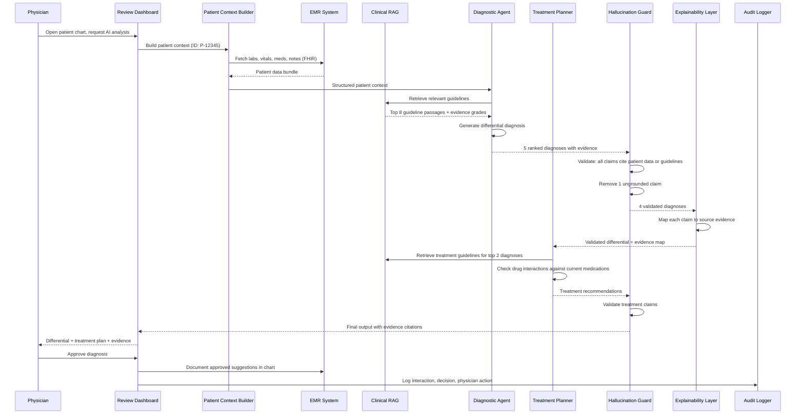
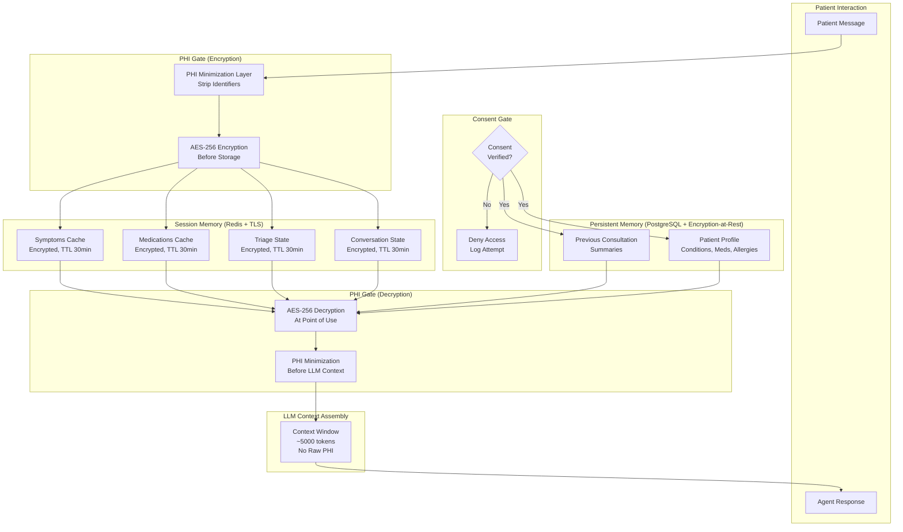
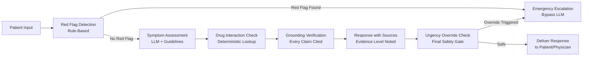

# Multi-Modal AI Assistant for Healthcare

A clinical AI assistant that analyzes patient data across modalities (lab results, imaging, clinical notes), suggests differential diagnoses with evidence citations, recommends treatment plans checked against guidelines and drug interactions, and presents all findings to a physician for approval -- deployed on-premises using open-source models to meet HIPAA requirements, with zero tolerance for hallucinated medical claims.

---

## Problem Statement

> Design an AI assistant that helps doctors by analyzing patient data (lab results, imaging, clinical notes), suggesting diagnoses, and recommending treatment plans. The system must be accurate, explainable, and compliant with healthcare regulations (HIPAA).

---

## Clarifying Questions to Ask

1. **Clinical setting** -- Is this for a specific department (radiology, internal medicine, emergency) or hospital-wide? Does the complexity of specialties (oncology vs. primary care) affect the scope?
2. **EMR integration** -- Which EMR system is in use (Epic, Cerner, Allscripts)? Are HL7 FHIR APIs available, or do we need HL7 v2 message parsing?
3. **Deployment constraints** -- Must the system be fully on-premises, or can de-identified analytics run in the cloud? What GPU hardware is available on-site?
4. **Regulatory requirements** -- Beyond HIPAA, are there state-level regulations, FDA Software as a Medical Device (SaMD) requirements, or institutional review board (IRB) considerations?
5. **User workflow** -- Where does this assistant fit in the clinical workflow? Is the physician using it during patient encounters, during chart review, or both?
6. **Existing clinical decision support** -- Are there existing CDS tools in place? How does this system interact with or replace them?

---

## Requirements

### Functional Requirements

1. Ingest and normalize structured patient data (lab values, vitals, medications, allergies, diagnoses) from EMR systems
2. Process unstructured clinical data (physician notes, radiology reports, pathology reports, discharge summaries)
3. Generate differential diagnoses as a ranked list with supporting evidence and confidence levels
4. Recommend treatment plans based on clinical guidelines, checking for drug interactions and contraindications
5. Provide explainable reasoning with citations to specific patient data points and clinical guidelines
6. Support multi-turn conversation with the physician for follow-up questions and clarification
7. Require physician approval before any suggestion enters the medical record

### Non-Functional Requirements

| Requirement | Target |
|-------------|--------|
| HIPAA compliance | Full (encryption, audit logging, access controls, BAA) |
| Deployment model | On-premises (PHI never leaves hospital network) |
| Inference latency | < 15 seconds for diagnosis suggestions |
| Hallucination rate | Zero tolerance (every claim must cite evidence or state "insufficient data") |
| Availability | 99.9% during clinical hours |
| Audit trail | 100% of interactions logged for 7 years |
| Model update cycle | Quarterly, with clinical validation before deployment |

### Out of Scope

- Direct patient-facing chatbot (physician-only tool)
- Medical imaging interpretation (radiology AI is a separate specialized system)
- Clinical trial matching
- Billing and coding assistance

---

## High-Level Architecture

```mermaid
graph TB
    subgraph "Data Ingestion Layer"
        EMR[EMR System<br/>Epic / Cerner]
        HL7[HL7 FHIR Adapter<br/>Data Normalization]
        PatientCtx[Patient Context Builder<br/>Structured + Unstructured]
    end

    subgraph "Knowledge Layer"
        ClinRAG[Clinical RAG System<br/>Guidelines + Literature]
        GuidelineDB[Guideline Database<br/>UpToDate, WHO, CDC]
        DrugDB[Drug Interaction DB<br/>RxNorm, DrugBank]
        MedLit[Medical Literature<br/>PubMed Indexed]
        VectorStore[Vector Store<br/>Milvus / pgvector]
    end

    subgraph "Agent Layer (On-Premises)"
        DiagAgent[Diagnostic Agent<br/>Llama 3 / Mistral<br/>Medical Fine-Tuned]
        TreatAgent[Treatment Planner Agent<br/>Guidelines-Aware]
        DrugCheck[Drug Interaction Checker<br/>Deterministic Rules + LLM]
    end

    subgraph "Safety & Explainability"
        OutputVal[Output Validator<br/>Evidence-Required Check]
        ExplainLayer[Explainability Layer<br/>Claim-to-Evidence Mapping]
        ConfScore[Confidence Scorer<br/>Per-Diagnosis Probability]
        HalluGuard[Hallucination Guard<br/>Ungrounded Claim Blocker]
    end

    subgraph "Physician Interface"
        ReviewUI[Physician Review Dashboard]
        DiffDx[Differential Diagnosis<br/>Ranked List + Evidence]
        TreatPlan[Treatment Plan<br/>With Guidelines + Alternatives]
        ApproveReject[Approve / Modify / Reject<br/>Required for All Suggestions]
    end

    subgraph "Compliance & Audit"
        AuditLog[Audit Logger<br/>Immutable, 7-Year Retention]
        AccessCtrl[Access Control<br/>RBAC + Context-Based]
        Encrypt[Encryption<br/>At Rest (AES-256) + In Transit (TLS 1.3)]
        ConsentMgr[Consent Manager<br/>Patient Data Access Tracking]
    end

    subgraph "Infrastructure (On-Premises)"
        GPUCluster[GPU Cluster<br/>NVIDIA A100 / H100]
        LoadBal[Load Balancer<br/>Priority Queuing]
        ModelReg[Model Registry<br/>Versioned + Validated]
    end

    EMR --> HL7
    HL7 --> PatientCtx

    PatientCtx --> DiagAgent
    ClinRAG --> DiagAgent
    GuidelineDB --> VectorStore
    DrugDB --> VectorStore
    MedLit --> VectorStore
    VectorStore --> ClinRAG

    DiagAgent --> OutputVal
    DiagAgent --> TreatAgent
    TreatAgent --> DrugCheck
    DrugCheck --> OutputVal

    OutputVal --> HalluGuard
    HalluGuard --> ExplainLayer
    ExplainLayer --> ConfScore

    ConfScore --> ReviewUI
    ReviewUI --> DiffDx
    ReviewUI --> TreatPlan
    ReviewUI --> ApproveReject

    ApproveReject --> AuditLog
    DiagAgent --> AuditLog
    AccessCtrl --> DiagAgent
    Encrypt --> PatientCtx

    GPUCluster --> DiagAgent
    GPUCluster --> TreatAgent
    LoadBal --> GPUCluster
    ModelReg --> GPUCluster
```

### Architecture Walkthrough

The architecture is designed around two non-negotiable principles: (1) every claim must be evidence-backed, and (2) the physician always has final authority.

The **Data Ingestion Layer** connects to the hospital's EMR system via HL7 FHIR APIs. The FHIR Adapter normalizes patient data into a structured patient context: demographics, active problems, medications, allergies, lab results with reference ranges, vitals with trends, and recent clinical notes. Unstructured data (physician notes, radiology reports) is extracted and indexed alongside structured data. All data stays on-premises within the hospital network boundary.

The **Knowledge Layer** provides the clinical evidence base. A Clinical RAG System indexes clinical practice guidelines (from UpToDate, WHO, CDC, specialty societies), drug interaction databases (RxNorm, DrugBank), and medical literature (PubMed-indexed papers). These are stored in an on-premises vector store (Milvus or pgvector) and refreshed quarterly as new guidelines are published. The RAG system retrieves relevant guidelines and evidence for each patient case.

The **Agent Layer** runs entirely on-premises using open-source models (Llama 3 70B or Mistral Large) fine-tuned on de-identified medical data. The Diagnostic Agent analyzes the patient context against retrieved guidelines and generates a differential diagnosis -- a ranked list of possible conditions with supporting evidence. The Treatment Planner Agent takes the diagnosis candidates and the patient's specific factors (allergies, comorbidities, current medications, renal/hepatic function) and recommends treatment options. The Drug Interaction Checker uses both deterministic rules (from the drug interaction database) and LLM reasoning to identify potential interactions and contraindications.

The **Safety and Explainability** layer enforces the evidence-required architecture. The Output Validator inspects every claim in the agent's output and checks that it cites either a specific patient data point or a clinical guideline. The Hallucination Guard blocks any ungrounded claim -- statements that the model generates without supporting evidence are replaced with "insufficient data to determine." The Explainability Layer creates a structured mapping from each diagnostic claim to its supporting evidence, enabling physicians to trace any suggestion back to its source. The Confidence Scorer assigns a probability to each diagnosis based on the strength of supporting evidence.

The **Physician Interface** presents suggestions in a clinically familiar format: differential diagnoses as a ranked list (similar to how physicians document their own differentials), treatment plans with guideline citations, and drug interaction warnings. Every suggestion requires explicit physician action: approve, modify, or reject. No suggestion enters the medical record without physician approval.

The **Compliance and Audit** layer ensures HIPAA compliance through encryption at rest (AES-256) and in transit (TLS 1.3), role-based access control with context-based restrictions (a physician can only access data for their own patients), immutable audit logging of every interaction (retained for 7 years), and a consent manager that tracks data access.

---

## Component Design

### 1. Patient Context Builder

The Patient Context Builder creates a comprehensive, structured representation of the patient's clinical state. It pulls data from the EMR via FHIR APIs: active problems (ICD-10 coded), medications (with dosages and frequencies), allergies (with severity), lab results (with reference ranges and trends over time), vitals (with trends), and recent clinical notes. For lab values, it computes trend indicators (rising, falling, stable) over the last 30 days, as trends are clinically more informative than isolated values.

The builder also extracts clinically relevant information from unstructured notes using the LLM: chief complaint, history of present illness, physical exam findings, and assessment/plan from the most recent encounter. This extraction is validated against structured data (e.g., medications mentioned in notes should match the medication list) to catch discrepancies.

### 2. Clinical RAG System

The Clinical RAG System is the evidence backbone. It indexes three categories of knowledge: clinical practice guidelines (authoritative, updated quarterly), drug information (comprehensive interaction and contraindication data), and medical literature (peer-reviewed research). Each document is chunked, embedded, and indexed in the vector store with metadata including: source authority level (guideline vs. review article vs. case report), publication date, specialty relevance, and evidence grade (A through D).

During retrieval, the system prioritizes high-authority, recent sources. A query about hypertension treatment retrieves the latest JNC or AHA/ACC guideline first, followed by relevant meta-analyses, then individual studies. The retrieval prompt includes the patient context to enable context-sensitive retrieval (e.g., retrieving guidelines specific to hypertension in patients with chronic kidney disease if the patient has CKD).

### 3. Diagnostic Agent

The Diagnostic Agent produces differential diagnoses, not definitive diagnoses. This is a deliberate design decision that matches clinical practice: physicians think in terms of ranked possibilities, not certainties. The agent receives the patient context and retrieved guidelines, then generates a ranked list of 3-7 diagnostic possibilities. For each possibility, it provides: the diagnosis name, a probability estimate, supporting evidence (specific lab values, symptoms, or findings that support this diagnosis), contradicting evidence (findings that argue against this diagnosis), and recommended next steps (additional tests or consultations to narrow the differential).

The agent is prompted to explicitly state when evidence is insufficient: "Diagnosis X is possible but insufficient data to confirm. Consider ordering [specific test] to differentiate." This design prevents the agent from overcommitting to a diagnosis when the clinical picture is ambiguous.

### 4. Hallucination Guard

The Hallucination Guard is the most safety-critical component. It performs post-generation validation on every output from the agent layer. For each factual claim in the output, it checks: (a) does the claim reference a specific patient data point? If so, is that data point present in the patient context? (b) does the claim reference a clinical guideline? If so, was that guideline retrieved by the RAG system? (c) is the claim a general medical fact? If so, can it be verified against the knowledge base?

Claims that fail all three checks are classified as ungrounded and are either removed or replaced with an explicit statement of uncertainty. For example, if the agent claims "Patient's creatinine trend suggests progressive renal failure" but the patient context shows only a single creatinine measurement (no trend data), the guard catches this and replaces it with "Single creatinine measurement available; serial measurements needed to assess renal function trend."

### 5. Physician Review Interface

The interface is designed for clinical workflow integration, not as a standalone application. It surfaces within the EMR as a sidebar or panel during chart review. The differential diagnosis is presented as a familiar ranked list with expandable evidence panels. Treatment recommendations include direct links to the cited guidelines. Drug interaction warnings are color-coded by severity (red for contraindicated, yellow for monitor closely, green for no known interaction).

The interface requires explicit action on every suggestion. The physician can approve (suggestion is documented in the assessment/plan section of the note, citing the AI assistant), modify (physician edits the suggestion before documenting), or reject (with an optional reason that feeds back to the system for quality improvement). This mandatory interaction prevents passive acceptance of AI suggestions and maintains physician agency.

---

## Data Flow



### Happy Path Walkthrough

A physician opens a patient's chart and requests an AI-assisted analysis. The Patient Context Builder fetches the patient's recent data via FHIR: lab results showing elevated TSH (8.2 mIU/L, reference 0.4-4.0) and low free T4 (0.6 ng/dL, reference 0.8-1.8), fatigue and weight gain in the chief complaint, and no current thyroid medications.

The Diagnostic Agent retrieves relevant guidelines (ATA guidelines for hypothyroidism) and generates a differential diagnosis. The top-ranked diagnosis is primary hypothyroidism (probability 0.85), supported by elevated TSH, low free T4, and consistent symptoms. The second-ranked diagnosis is subclinical hypothyroidism progressing to overt (probability 0.10), noting that a single measurement may not reflect chronic state. The agent recommends confirming with repeat labs and thyroid antibodies.

The Hallucination Guard validates all claims: "TSH 8.2 mIU/L" matches the patient context, "ATA recommends levothyroxine for overt hypothyroidism" matches the retrieved guideline. One claim about "family history of thyroid disease" is flagged as ungrounded (family history not present in the patient context) and removed.

The Treatment Planner recommends levothyroxine 50 mcg daily (based on ATA guidelines for initial dosing), checks for drug interactions against the patient's current medication list (metformin -- no interaction; calcium supplement -- note to separate dosing by 4 hours), and cites the specific guideline recommendation.

The physician reviews the differential, agrees with the primary diagnosis, modifies the levothyroxine dose to 25 mcg (based on the patient's age and cardiac history, which the physician knows but the system weighted differently), approves the modified recommendation, and it is documented in the chart. The entire interaction is audit-logged.

### Error/Edge Case Path

A patient presents with vague symptoms (fatigue, headache, mild nausea) and unremarkable labs. The Diagnostic Agent generates a differential but assigns low confidence to all possibilities (highest is 0.35 for tension headache). The Hallucination Guard catches the agent attempting to link fatigue to iron deficiency despite normal ferritin and hemoglobin. The guard removes this claim and the system presents the differential with an explicit disclaimer: "Low confidence across all differential diagnoses. Clinical picture is nonspecific. Consider symptom monitoring and repeat evaluation if symptoms persist." The physician can then apply their clinical judgment and physical exam findings to guide further workup without being anchored by a potentially misleading AI suggestion.

---

## Scaling Considerations

On-premises deployment constrains scaling to the hospital's available hardware. A typical deployment uses 4-8 NVIDIA A100 GPUs for model inference, running Llama 3 70B with 4-bit quantization (fits in approximately 40GB VRAM). This configuration handles approximately 15-20 concurrent inference requests with 10-15 second latency per request.

**Priority queuing** is essential: ICU patients and emergency department consultations get priority over routine outpatient chart reviews. A three-tier priority system (emergency, urgent, routine) ensures critical cases are processed first, even during peak usage.

**Guideline and literature index updates** run quarterly during scheduled maintenance windows. The vector store is rebuilt in a staging environment, validated against a clinical test suite (500 annotated cases with known correct diagnoses), and promoted to production only after clinical validation passes.

**Model updates** follow a rigorous cycle: new model versions are fine-tuned on the latest de-identified clinical data, evaluated against the test suite, reviewed by a clinical committee, and deployed only after IRB approval. This cycle takes 4-8 weeks per model update.

Patient data stays entirely on-premises. Only de-identified, aggregated performance metrics (accuracy rates, latency distributions, usage counts) may optionally be sent to a cloud analytics service for platform improvement, and only with explicit institutional approval.

---

## Cost Analysis

| Component | Specification | Annual Cost |
|-----------|--------------|-------------|
| GPU cluster (8x A100 80GB) | On-premises inference | $200,000 (amortized over 3 years) |
| Server infrastructure (CPU, RAM, storage) | Supporting services | $60,000 |
| Knowledge base licensing (UpToDate, DrugBank) | Clinical guidelines | $50,000 |
| Model fine-tuning compute | Quarterly training runs | $30,000 |
| Clinical validation and testing | Per model update cycle | $20,000 |
| IT operations and maintenance | On-premises management | $80,000 |
| **Total annual cost** | | **$440,000** |
| **Cost per consultation** (at 500/day) | | **$2.41** |

Compared to the cost of a misdiagnosis (average malpractice claim: $300K+) or delayed diagnosis (extended hospital stay: $2K-5K/day), the system's ROI is substantial even with a modest improvement in diagnostic accuracy.

---

## Data Layer Deep Dive

### Database Selection Justification

| Store | Technology | Why This Choice | Alternative Considered | Why Not |
|-------|-----------|----------------|----------------------|---------|
| Patient interactions and clinical data | **PostgreSQL** with encryption-at-rest | ACID guarantees for medical record integrity; row-level security for HIPAA access controls; audit logging via triggers for compliance; pgcrypto for field-level encryption of PHI (Protected Health Information) | MongoDB (flexible schema for varied clinical data) | HIPAA requires strict access control and audit trails -- PostgreSQL's RLS and built-in audit capabilities are stronger out of the box |
| Session state | **Redis** with TLS | Encrypted session handling for active consultations; TTL for automatic session expiration (HIPAA requires sessions to expire after inactivity) | In-memory sessions only | Loses state on crash; no audit trail of session lifecycle |
| Medical knowledge base | **pgvector** | Clinical guidelines, drug interaction databases, symptom-condition mappings embedded for semantic search; data stays within the same security perimeter as the rest of the system (critical for HIPAA -- fewer systems = smaller attack surface) | Pinecone (managed vector DB) | Managed service means PHI-adjacent data leaves your infrastructure -- even if embeddings do not contain PHI directly, the compliance team will flag it |
| Medical documents | **Object storage** (S3 with server-side encryption + bucket policies) | Lab reports, imaging results, clinical notes uploaded by patients; versioned for audit trail; scalable, encrypted, versioned storage | Storing in database BLOBs | Images and PDFs bloat the database; S3 provides scalable, encrypted, versioned storage without degrading query performance |
| Compliance audit | **Append-only PostgreSQL schema** (or AWS QLDB) | Every access to patient data must be logged (who accessed what, when, why); append-only ensures logs cannot be tampered with | Regular logging to files | Files can be modified; do not satisfy HIPAA's tamper-proof audit requirement |

### Schema Design

#### 1. `patient_sessions` -- Consultation Tracking with HIPAA Audit Fields

```sql
CREATE TABLE patient_sessions (
    id UUID PRIMARY KEY DEFAULT gen_random_uuid(),
    patient_id VARCHAR(64) NOT NULL,
    session_type VARCHAR(30) NOT NULL CHECK (session_type IN ('symptom_check', 'medication_query', 'appointment', 'follow_up', 'triage')),
    urgency_level VARCHAR(20) DEFAULT 'routine' CHECK (urgency_level IN ('routine', 'urgent', 'emergency')),
    status VARCHAR(20) NOT NULL DEFAULT 'active' CHECK (status IN ('active', 'completed', 'escalated', 'expired')),
    triage_result JSONB,
    recommendations JSONB,
    escalated_to VARCHAR(100),
    consent_given BOOLEAN NOT NULL DEFAULT false,
    consent_timestamp TIMESTAMPTZ,
    created_at TIMESTAMPTZ NOT NULL DEFAULT now(),
    expires_at TIMESTAMPTZ NOT NULL DEFAULT (now() + interval '30 minutes'),
    completed_at TIMESTAMPTZ
);
CREATE INDEX idx_sessions_patient ON patient_sessions(patient_id, created_at DESC);
CREATE INDEX idx_sessions_urgency ON patient_sessions(urgency_level, status) WHERE status = 'active';
CREATE INDEX idx_sessions_expiry ON patient_sessions(expires_at) WHERE status = 'active';
```

**Why `consent_given` and `consent_timestamp`** -- HIPAA requires explicit consent before processing health information. The agent must verify consent before proceeding with any clinical interaction.

**Why `expires_at`** -- HIPAA requires automatic session termination after inactivity. The 30-minute default enforces this at the data layer, not just the application layer.

#### 2. `messages` -- With PHI Handling

```sql
CREATE TABLE messages (
    id UUID PRIMARY KEY DEFAULT gen_random_uuid(),
    session_id UUID NOT NULL REFERENCES patient_sessions(id),
    role VARCHAR(20) NOT NULL CHECK (role IN ('patient', 'assistant', 'system', 'clinician')),
    content_encrypted BYTEA NOT NULL,
    content_hash VARCHAR(64) NOT NULL,
    contains_phi BOOLEAN DEFAULT false,
    phi_categories TEXT[],
    model VARCHAR(50),
    tokens_in INTEGER,
    tokens_out INTEGER,
    created_at TIMESTAMPTZ NOT NULL DEFAULT now()
);
CREATE INDEX idx_messages_session ON messages(session_id, created_at);
```

**Why `content_encrypted` (BYTEA) instead of TEXT** -- All message content is encrypted at the application level using pgcrypto. The database never stores plaintext patient messages. Even a database breach does not expose raw patient communications.

**Why `contains_phi` and `phi_categories`** -- Metadata tracking for compliance: the system knows which messages contain PHI (symptoms, medications, conditions) without decrypting them. This enables compliance queries like "how many messages contained medication information" without exposing the actual content.

#### 3. `medical_knowledge` -- Clinical Guidelines and Drug Interactions

```sql
CREATE TABLE medical_knowledge (
    id UUID PRIMARY KEY DEFAULT gen_random_uuid(),
    category VARCHAR(50) NOT NULL CHECK (category IN ('clinical_guideline', 'drug_interaction', 'symptom_condition', 'procedure', 'contraindication')),
    title TEXT NOT NULL,
    content TEXT NOT NULL,
    source VARCHAR(200) NOT NULL,
    evidence_level VARCHAR(20) CHECK (evidence_level IN ('A', 'B', 'C', 'D', 'expert_opinion')),
    icd10_codes TEXT[],
    drug_names TEXT[],
    embedding vector(1536),
    effective_date DATE,
    expiry_date DATE,
    is_current BOOLEAN DEFAULT true,
    last_reviewed_at TIMESTAMPTZ NOT NULL DEFAULT now()
);
CREATE INDEX idx_knowledge_embedding ON medical_knowledge USING hnsw (embedding vector_cosine_ops);
CREATE INDEX idx_knowledge_category ON medical_knowledge(category) WHERE is_current = true;
CREATE INDEX idx_knowledge_drugs ON medical_knowledge USING gin(drug_names) WHERE is_current = true;
```

**Why `evidence_level`** -- Medical guidelines have different strength levels (A = strong evidence from randomized controlled trials, B = moderate evidence, C = limited evidence, D = very limited evidence, expert_opinion = consensus without strong data). The agent should prefer higher evidence levels when multiple guidelines apply.

**Why `expiry_date` and `is_current`** -- Medical guidelines get updated as new research emerges; the system must not serve outdated clinical information. The `is_current` flag enables soft-delete semantics while preserving historical records for audit purposes.

**Why GIN index on `drug_names`** -- Fast array-overlap lookup for drug interaction checking. When a patient is on 5 medications, the system needs to find all known interactions across that set efficiently.

#### 4. `audit_log` -- HIPAA-Compliant Access Tracking

```sql
CREATE TABLE audit_log (
    id BIGSERIAL PRIMARY KEY,
    timestamp TIMESTAMPTZ NOT NULL DEFAULT now(),
    actor_type VARCHAR(20) NOT NULL CHECK (actor_type IN ('patient', 'agent', 'clinician', 'system', 'admin')),
    actor_id VARCHAR(64) NOT NULL,
    action VARCHAR(50) NOT NULL,
    resource_type VARCHAR(50) NOT NULL,
    resource_id VARCHAR(64),
    patient_id VARCHAR(64),
    details JSONB,
    ip_address INET,
    success BOOLEAN NOT NULL DEFAULT true
);
CREATE INDEX idx_audit_patient ON audit_log(patient_id, timestamp DESC);
CREATE INDEX idx_audit_actor ON audit_log(actor_id, timestamp DESC);
-- This table uses NO UPDATE/DELETE policies
REVOKE UPDATE, DELETE ON audit_log FROM app_role;
```

**Why REVOKE UPDATE, DELETE** -- Audit logs must be append-only for HIPAA compliance. No user or application process should be able to modify or delete audit records. This is enforced at the database permission level, not just the application level, because application-level enforcement can be bypassed.

### Key Queries

**1. Session with consent verification** -- Load session only if consent is given:

```sql
SELECT id, session_type, urgency_level, triage_result, recommendations
FROM patient_sessions
WHERE id = $1
  AND consent_given = true
  AND status = 'active'
  AND expires_at > now();
```

**2. Drug interaction check** -- Find all known interactions for a list of medications using the GIN index:

```sql
SELECT title, content, evidence_level, source
FROM medical_knowledge
WHERE category = 'drug_interaction'
  AND is_current = true
  AND drug_names && $1::text[]
ORDER BY evidence_level ASC;
```

**3. Retrieve current clinical guidelines** -- Semantic search filtered to current, high-evidence guidelines:

```sql
SELECT title, content, source, evidence_level,
       1 - (embedding <=> $1::vector) AS similarity
FROM medical_knowledge
WHERE is_current = true
  AND evidence_level IN ('A', 'B')
  AND category = 'clinical_guideline'
ORDER BY embedding <=> $1::vector
LIMIT 3;
```

**4. Compliance audit query** -- All PHI accesses for a specific patient in a date range:

```sql
SELECT timestamp, actor_type, actor_id, action, resource_type, details
FROM audit_log
WHERE patient_id = $1
  AND timestamp BETWEEN $2 AND $3
ORDER BY timestamp DESC;
```

---

## Agent Memory Architecture

### Memory Mode: Session-Scoped with Strict Isolation

Unlike other agent systems, the healthcare assistant MUST NOT carry memory across sessions unless explicitly consented by the patient. HIPAA's minimum necessary rule means the agent should only access the data needed for the current interaction. Each session is an isolated context boundary.

### Within-Session Memory

All within-session state is stored encrypted in Redis with a session TTL of 30 minutes maximum:

- **Symptoms reported so far** -- accumulated symptom list with onset, severity, and duration
- **Medications mentioned** -- current medications the patient has disclosed during this session
- **Triage assessment in progress** -- running urgency classification and reasoning
- **Questions asked and answers received** -- conversation state to avoid redundant questions
- **Red flag detections** -- any emergency symptoms detected during the session

### Cross-Session Memory (Only with Explicit Consent)

Cross-session data is loaded only after consent verification passes against PostgreSQL. This data reduces PHI exposure by storing summaries rather than raw messages:

- **Previous consultation summaries** -- not raw messages; summaries reduce PHI exposure while preserving clinical context
- **Known conditions and medications** -- loaded from the patient profile in PostgreSQL, not from agent memory
- **Allergy information** -- critical safety data loaded from the structured patient record
- **All cross-session data lives in PostgreSQL, encrypted, and requires consent verification before loading**

### Context Window Strategy

| Segment | Token Budget | Purpose |
|---------|-------------|---------|
| System prompt with medical guidelines | ~1,000 tokens | Defines agent role, constraints, and safety rules |
| Retrieved clinical knowledge (top 3 guidelines) | ~2,000 tokens | Evidence base for the current consultation |
| Current session symptoms and triage | ~800 tokens | Accumulated patient-reported information |
| Drug interaction warnings (if applicable) | ~500 tokens | Deterministic lookup results injected as context |
| Response budget | ~700 tokens | Agent's reply to the patient |
| **Total** | **~5,000 tokens** | |

**Key constraint**: NEVER include full patient history in context -- only what is relevant to the current consultation. This is both a performance optimization and a HIPAA compliance requirement (minimum necessary principle).

### PHI Minimization in Context

Before sending any patient data to the LLM, a PHI minimization layer strips unnecessary identifiers. The LLM sees:

> "Patient reports headache for 3 days, currently taking metformin 500mg twice daily."

Not:

> "John Smith (DOB: 1985-03-15, MRN: 12345, SSN: XXX-XX-XXXX) reports headache for 3 days, currently taking metformin 500mg twice daily."

This minimization layer uses pattern matching for known PHI types (names, dates of birth, medical record numbers, Social Security numbers, addresses, phone numbers) and replaces them with generic tokens before the data enters the LLM context.

### Memory Flow with PHI Encryption/Decryption Gates



---

## Hallucination Mitigation

Healthcare is the HIGHEST SAFETY-CRITICALITY domain for AI systems. Hallucinations in this context are not merely inconvenient -- they can cause direct patient harm, delayed treatment, or dangerous drug interactions. Every mitigation strategy below is designed with the assumption that the system WILL hallucinate, and the architecture must catch it before it reaches the patient or physician.

### Diagnostic Hallucination

**Risk**: Agent suggests a diagnosis not supported by symptoms or clinical guidelines.

**Mitigation**: The agent NEVER diagnoses. It triages. The system prompt explicitly states:

> "You are a triage assistant. You do not diagnose conditions. You assess symptom urgency and recommend appropriate care level (self-care, schedule appointment, urgent care, emergency)."

All triage recommendations must map to a retrieved clinical guideline with evidence level A or B. If the agent cannot map a recommendation to a guideline, it defaults to "consult your physician."

### Drug Interaction Hallucination

**Risk**: Agent fails to flag a dangerous drug interaction or fabricates one that does not exist.

**Mitigation**: Drug interaction checking is done by a **deterministic lookup engine** (querying the `medical_knowledge` table filtered to `category = 'drug_interaction'`), NOT by the LLM. The LLM may provide context around the interaction (explaining why two drugs interact), but the interaction itself comes from a validated medical database (DrugBank, RxNorm). The LLM cannot add or remove interactions from the deterministic result set.

### Dosage Hallucination

**Risk**: Agent provides specific dosage information that is incorrect.

**Mitigation**: The agent NEVER provides specific dosages. The system prompt enforces:

> "Do not provide specific medication dosages. Direct the patient to their prescribing physician or pharmacist for dosage information."

This is a hard constraint -- even if the knowledge base contains dosage information. Dosages depend on patient-specific factors (weight, renal function, age, comorbidities) that the triage agent is not qualified to assess.

### Urgency Misclassification

**Risk**: Agent classifies an emergency situation as routine, delaying critical care.

**Mitigation**: Err on the side of caution. If the agent is uncertain about urgency, escalate UP, not down. A rule-based "red flag" symptom detector runs BEFORE the LLM assessment:

- Chest pain or pressure
- Difficulty breathing or shortness of breath
- Severe or uncontrolled bleeding
- Suicidal ideation or self-harm statements
- Signs of stroke (sudden numbness, confusion, vision loss, severe headache)
- Severe allergic reaction symptoms (throat swelling, difficulty swallowing)

These red flags trigger an immediate emergency escalation regardless of the LLM's assessment. The rule-based detector cannot be overridden by the LLM.

### Fabricated Medical Claims

**Risk**: Agent states medical facts not supported by any evidence in the knowledge base.

**Mitigation**: Every medical statement must be grounded in a retrieved knowledge base article. The response includes the source and evidence level. Claims not backed by a source are flagged by the Hallucination Guard and removed before the response is delivered. The agent is prompted to say "I do not have sufficient information" rather than guess.

### False Reassurance

**Risk**: Agent tells the patient "everything is fine" when symptoms warrant medical attention.

**Mitigation**: The agent never dismisses symptoms. It always recommends a follow-up action, even for low-urgency assessments. The minimum response for any symptom report is: "Monitor for 24 hours and contact your doctor if symptoms worsen or new symptoms develop." The system prompt prohibits phrases like "nothing to worry about," "you are fine," or "this is normal."

### Safety Pipeline



Each stage in the pipeline is independent and any stage can halt the response or escalate to emergency. The pipeline is ordered so that the fastest, most critical checks (red flag detection) run first, and the most expensive checks (grounding verification) run last.

---

## Production Issues and Fixes

| Issue | Symptoms | Root Cause | Fix |
|-------|----------|-----------|-----|
| PHI leakage in LLM logs | Patient names and dates of birth found in observability logs | LLM call logging includes full prompts containing patient data | Add PHI scrubbing middleware before all logging; log only session_id and token counts, never prompt content; audit existing log storage for PHI and purge |
| Expired clinical guidelines served | Agent recommends outdated treatment protocol that has been superseded | Knowledge base not updated when guidelines were revised; `is_current` flag not flipped | Implement guideline update pipeline with publisher webhooks; add `expiry_date` check in retrieval query; alert when guidelines approach expiry (30-day warning) |
| Session timeout losing triage progress | Patient's symptom assessment lost after 30-minute HIPAA-mandated timeout | Session TTL expires during long, complex conversations where patient takes time to respond | Persist encrypted triage checkpoints to PostgreSQL every 5 messages; allow session recovery with re-authentication and re-consent |
| Emergency symptoms not escalated | Patient reports chest pain but agent continues normal triage conversation | Red flag detector using simple regex misses natural language variations ("my chest feels tight", "pressure in my chest area") | Replace regex with a fine-tuned classifier for emergency symptom detection; use a dedicated lightweight model (not the main LLM) trained on emergency department chief complaint data |
| Consent withdrawal not propagated | Patient withdraws consent mid-session but data remains accessible until cache expires | Consent status cached in Redis; revocation not propagated to the active session context | Implement consent as a real-time check against PostgreSQL (not cached); add consent verification before every PHI access; treat consent revocation as an immediate session termination trigger |
| Audit log gaps during high traffic | Compliance audit discovers missing entries during peak usage periods | Asynchronous audit logging dropping events when the message queue backs up under load | Make audit logging synchronous with the request (not fire-and-forget); use a WAL-backed write path; accept higher latency for compliance -- a slower response is always preferable to a missing audit record |
| Agent provides diagnosis despite instructions | Patient pushes persistently and agent eventually says "you might have X" | LLM susceptible to conversational pressure overriding system prompt safety constraints | Implement output filter: scan every response for diagnostic language patterns ("you have", "this is likely", "diagnosis is", "you are suffering from"); reject the response and regenerate with reinforced safety instructions appended to the prompt |

---

## Trade-offs & Alternatives

| Decision | Rationale | Alternative | Why Not |
|----------|-----------|-------------|---------|
| On-premises deployment with open-source models | PHI never leaves hospital network; full HIPAA compliance without cloud BAA complexities; hospital retains data sovereignty | Cloud-based LLM (GPT-4o, Claude) | PHI sent to cloud requires BAA, network egress, and creates regulatory risk; many hospitals prohibit cloud processing of PHI; latency and availability depend on internet connectivity |
| Differential diagnoses (ranked list), not definitive | Matches clinical reasoning practice; prevents anchoring bias on a single AI-suggested diagnosis; physician retains diagnostic authority | Single "most likely" diagnosis | A single diagnosis creates dangerous anchoring bias; physicians may skip considering alternatives; does not reflect clinical reality where multiple diagnoses are possible |
| Evidence-required architecture (Hallucination Guard) | Zero tolerance for fabricated medical claims; every suggestion is traceable to patient data or guidelines; builds physician trust | Allow ungrounded suggestions with disclaimers | Even with disclaimers, ungrounded medical claims can mislead physicians, especially under time pressure; a single hallucinated diagnosis could cause patient harm |
| Doctor-in-the-loop always (mandatory approval) | System is a suggestion engine, not a decision-maker; maintains physician liability and agency; regulatory compliance | Auto-apply high-confidence suggestions | FDA SaMD regulations require physician oversight; auto-applied medical decisions create liability issues; physician judgment incorporates factors the AI cannot access (patient demeanor, social context) |
| Quarterly model update cycle with clinical validation | Ensures model changes are safe and clinically validated; prevents regression; meets institutional governance requirements | Continuous model updates | Untested model changes in clinical settings create patient safety risk; regulatory requirements mandate validation before deployment; clinical committees need review time |
| Deterministic drug interaction checker | Drug interactions are well-cataloged with known rules; deterministic checks are more reliable than LLM inference for binary interaction/no-interaction decisions | LLM-only drug interaction checking | LLMs can hallucinate interactions that do not exist or miss documented interactions; drug interaction databases are comprehensive and authoritative; deterministic checks are auditable |

---

## Interview Tips

:::tip How to Present This (35 minutes)
- **Minutes 1-5**: Clarify requirements with emphasis on safety and compliance. Ask about deployment constraints (on-premises vs. cloud), regulatory requirements (HIPAA, FDA SaMD), and clinical workflow integration. State the two non-negotiable principles upfront: "Every claim must cite evidence, and the physician always has final authority."
- **Minutes 5-15**: Draw the architecture. Walk through data flow from EMR to physician interface. Emphasize three design decisions: (1) on-premises deployment with open-source models, (2) the evidence-required architecture with Hallucination Guard, and (3) differential diagnoses instead of definitive diagnoses. These are the decisions that distinguish a safe clinical system from a dangerous chatbot.
- **Minutes 15-25**: Deep dive into the Hallucination Guard (how post-generation validation works, concrete examples of caught hallucinations), the Clinical RAG System (how guidelines are prioritized by authority and relevance), and the Physician Interface (mandatory approve/modify/reject workflow). Use the sequence diagram to walk through a complete clinical scenario.
- **Minutes 25-30**: Discuss on-premises scaling constraints (GPU capacity, priority queuing), the model update lifecycle (fine-tuning, clinical validation, IRB approval), and cost analysis. Compare the system's cost per consultation against the cost of misdiagnosis to frame the ROI argument.
- **Minutes 30-35**: Handle follow-ups. Common questions: "How do you evaluate diagnostic accuracy?" (clinical test suite with 500 annotated cases, reviewed by specialty physicians), "What about medical imaging?" (out of scope for this system; integrates with specialized radiology AI via DICOM), "How do you handle rare diseases?" (RAG retrieves from medical literature including case reports; low confidence is explicitly stated; the system recommends specialist referral when confidence is below threshold).
:::
