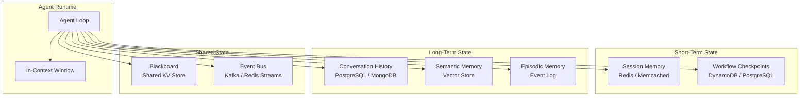
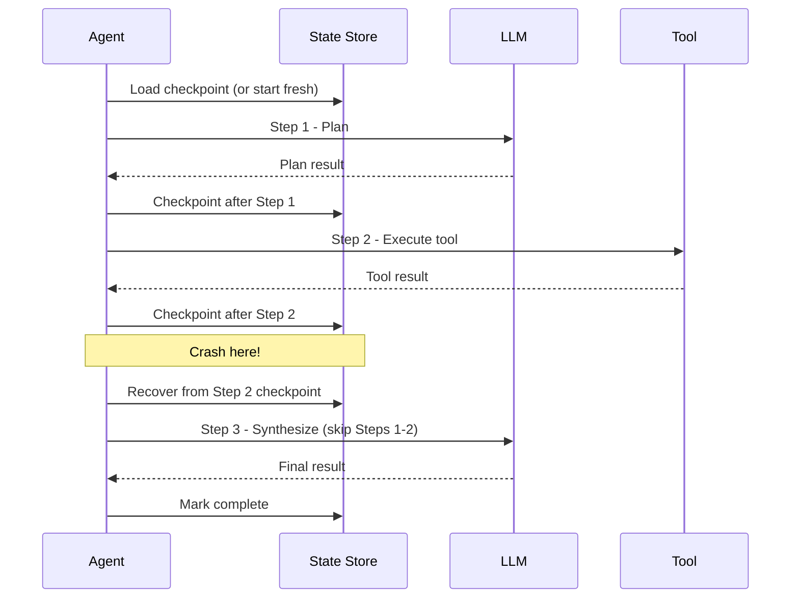
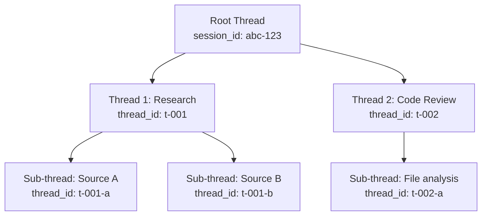

# Memory and State Management

An agent without memory is stateless and forgetful -- every interaction starts from zero. Production agentic systems require sophisticated state management that spans in-context memory, persistent storage, checkpointing for recovery, and conflict resolution for concurrent access.

---

## State Architecture Overview



---

## Distributed State

In a horizontally scaled system, agent workers are stateless. All state lives in external stores, and any worker must be able to pick up any session.

### State Categories

| Category | Lifetime | Store | Access Pattern |
|----------|----------|-------|---------------|
| **Turn context** | Single LLM call | In-context window | Read-only, constructed per call |
| **Session state** | Minutes to hours | Redis with TTL | Frequent read/write, low latency |
| **Workflow state** | Hours to days | DynamoDB / PostgreSQL | Checkpoint on each step |
| **Conversation history** | Days to months | PostgreSQL / MongoDB | Append-heavy, paginated reads |
| **Semantic memory** | Indefinite | Vector store (Pinecone, pgvector) | Similarity search |
| **User profile** | Indefinite | PostgreSQL | Read-heavy, rare updates |

### Session State Schema

```python
class SessionState:
    session_id: str
    user_id: str
    messages: list[dict]          # conversation turns
    summary: str                  # rolling summary for context window
    current_step: int             # workflow progress
    plan: list[dict]              # agent plan steps
    step_results: dict[int, Any]  # results keyed by step index
    active_tools: list[str]
    accumulated_cost: float
    token_count: int
    version: int                  # optimistic concurrency control
    ttl_seconds: int = 3600
```

---

## Checkpointing Strategies

Checkpointing allows an agent to resume from the last successful step after a crash, rather than restarting from the beginning.

### When to Checkpoint



### Implementation

```python
class CheckpointManager:
    def __init__(self, store): ...

    async def save_checkpoint(self, session_id, state):
        existing = await self.store.get(f"checkpoint:{session_id}")
        if existing and existing.version != state.version:
            raise ConcurrencyConflictError("Version mismatch")
        state.version += 1
        await self.store.set(f"checkpoint:{session_id}", state, ttl=state.ttl_seconds)

    async def load_checkpoint(self, session_id):
        return await self.store.get(f"checkpoint:{session_id}")

    async def resume_from_checkpoint(self, session_id):
        state = await self.load_checkpoint(session_id)
        return state, state.current_step + 1   # (state, next_step)
```

### Checkpoint Granularity Trade-offs

| Granularity | Checkpoint After | Pros | Cons |
|-------------|-----------------|------|------|
| **Per-step** | Every agent step | Minimal rework on recovery | High write volume |
| **Per-phase** | Plan, Execute, Synthesize | Balanced | May redo some steps |
| **Per-transaction** | Only on meaningful state changes | Low write volume | More rework on recovery |
| **Periodic** | Every N seconds | Predictable write rate | Unpredictable rework |

:::tip
For most production systems, **per-step checkpointing** is the right default. The write overhead (one small write per step) is negligible compared to the LLM call latency, and it minimizes wasted computation on recovery.
:::

---

## Session Persistence

### Short-Lived Sessions (Chatbot)

For interactive chat, the session typically lasts minutes to hours. Redis with TTL is the standard choice.

```python
class RedisSessionStore:
    def __init__(self, redis_url):
        self.client = redis.from_url(redis_url)

    async def save(self, session_id, state):
        await self.client.setex(
            f"session:{session_id}", state.ttl_seconds, json.dumps(state.to_dict()))

    async def load(self, session_id):
        data = await self.client.get(f"session:{session_id}")
        return SessionState.from_dict(json.loads(data)) if data else None

    async def extend_ttl(self, session_id, seconds):
        await self.client.expire(f"session:{session_id}", seconds)
```

### Long-Lived Sessions (Workflow)

For multi-day workflows (research agents, data pipeline agents), use a durable store like PostgreSQL.

```sql
CREATE TABLE agent_sessions (
    session_id    UUID PRIMARY KEY,
    user_id       UUID NOT NULL,
    state         JSONB NOT NULL,
    status        TEXT NOT NULL DEFAULT 'active',
    version       INTEGER NOT NULL DEFAULT 0,
    created_at    TIMESTAMPTZ NOT NULL DEFAULT now(),
    updated_at    TIMESTAMPTZ NOT NULL DEFAULT now(),
    expires_at    TIMESTAMPTZ
);

CREATE INDEX idx_sessions_user ON agent_sessions(user_id);
CREATE INDEX idx_sessions_status ON agent_sessions(status) WHERE status = 'active';

-- Optimistic concurrency control
CREATE OR REPLACE FUNCTION update_session(
    p_session_id UUID,
    p_state JSONB,
    p_expected_version INTEGER
) RETURNS BOOLEAN AS $$
BEGIN
    UPDATE agent_sessions
    SET state = p_state,
        version = version + 1,
        updated_at = now()
    WHERE session_id = p_session_id
      AND version = p_expected_version;
    RETURN FOUND;
END;
$$ LANGUAGE plpgsql;
```

---

## Conversation Threading

Production agents often handle branching conversations -- where a user revisits a previous point, or where multiple sub-conversations run in parallel.

### Thread Model



### Data Model

```python
class ConversationThread:
    thread_id: str
    parent_thread_id: str | None
    session_id: str
    messages: list[Message]
    status: str   # "active", "completed", "abandoned"

    def fork(self, new_thread_id):
        """Child thread inherits parent context but starts with empty messages."""
        return ConversationThread(new_thread_id, parent=self.thread_id,
                                  session=self.session_id, messages=[])

    def build_context(self, thread_store):
        """Walk up the thread hierarchy to assemble full context."""
        context, current = [], self
        while current:
            context = current.messages + context
            current = thread_store.get(current.parent_thread_id) if current.parent_thread_id else None
        return context
```

---

## State Serialization

Agent state contains diverse types -- messages, tool results, embeddings, file references. Choosing the right serialization format affects performance and debuggability.

### Format Comparison

| Format | Size | Speed | Human-Readable | Schema Evolution |
|--------|------|-------|----------------|-----------------|
| **JSON** | Large | Moderate | Yes | Flexible (schemaless) |
| **MessagePack** | Small | Fast | No | Flexible (schemaless) |
| **Protocol Buffers** | Smallest | Fastest | No | Excellent (schema versioning) |
| **Pickle** | Variable | Fast | No | Fragile (Python-only) |

:::warning
Never use Python pickle for agent state serialization. It is insecure (arbitrary code execution on deserialization), fragile across Python versions, and not portable across languages. Use JSON for debuggability or Protocol Buffers for performance.
:::

### Versioned Serialization

```python
class StateSerializer:
    CURRENT_VERSION = 3

    def serialize(self, state):
        data = {"_version": self.CURRENT_VERSION, **state.to_dict()}
        return json.dumps(data).encode()

    def deserialize(self, raw):
        data = json.loads(raw)
        version = data.get("_version", 1)
        # Chain migrations: v1 -> v2 (add 'plan'), v2 -> v3 (rename 'context' -> 'metadata')
        if version < 2: data.setdefault("plan", [])
        if version < 3: data["metadata"] = data.pop("context", {})
        return SessionState.from_dict(data)
```

---

## Conflict Resolution

When multiple workers or agent branches update the same state concurrently, conflicts must be resolved deterministically.

### Strategies

| Strategy | How It Works | Best For |
|----------|-------------|----------|
| **Optimistic concurrency (versioning)** | Read version, write only if version matches | Low-contention updates |
| **Last-writer-wins** | Timestamp-based, latest write takes precedence | Append-only data |
| **Merge** | Application-specific merge logic | Concurrent tool results |
| **Lock-based** | Distributed lock (Redlock) before write | Critical sections |

### Optimistic Concurrency Example

```python
class OptimisticStateStore:
    async def update(self, session_id, updater_fn, max_retries=5):
        for attempt in range(max_retries):
            state = await self.load(session_id)
            updated = updater_fn(state)
            ok = await self._compare_and_swap(session_id, updated, state.version)
            if ok:
                return updated
            await asyncio.sleep(0.01 * 2**attempt)  # backoff on conflict
        raise ConflictError(f"Failed after {max_retries} retries")
```

---

## TTL Policies

State that is never cleaned up eventually consumes all available storage. TTL (time-to-live) policies ensure state has a defined lifecycle.

### Recommended TTLs

| State Type | TTL | Rationale |
|-----------|-----|-----------|
| Active session state | 1-4 hours | User sessions rarely last longer |
| Workflow checkpoints | 7 days | Allow recovery from extended outages |
| Conversation history | 90 days | Compliance and user expectation |
| Tool result cache | 1-24 hours | Results go stale; balance freshness vs. cost |
| Semantic memory | No TTL (explicit deletion) | Long-term knowledge; managed by user |
| Rate limit counters | 1-60 minutes | Match the rate limit window |

### Tiered Expiration

```python
class TieredStateManager:
    """hot (Redis) -> warm (DynamoDB) -> cold (S3), with auto-promotion."""

    def __init__(self, hot, warm, cold): ...

    async def get(self, session_id):
        for tier in [self.hot, self.warm, self.cold]:
            state = await tier.get(session_id)
            if state:
                # Promote to faster tiers on access
                if tier is not self.hot:
                    await self.hot.set(session_id, state, ttl=3600)
                return state
        return None

    async def archive(self, session_id):
        state = await self.hot.get(session_id)
        if state:
            await self.cold.put(session_id, state)
            await self.hot.delete(session_id)
```

:::info
Tiered storage is the same pattern used by databases (buffer pool -> SSD -> archive). Apply the same thinking: hot data in memory, warm data in fast persistent storage, cold data in cheap bulk storage.
:::

---

## Context Window Management

The LLM context window is the most constrained form of agent memory. Managing what goes into the context window is critical for both quality and cost.

### Strategies

```python
class ContextWindowManager:
    def build_context(self, state, system_prompt):
        budget = self.max_tokens
        context = [{"role": "system", "content": system_prompt}]
        budget -= self._count_tokens(system_prompt) + 1024   # reserve for output
        current_turn = state.messages[-2:]                    # always include
        budget -= sum(self._count_tokens(m["content"]) for m in current_turn)
        # Fill remaining budget with most-recent history
        history = []
        for msg in reversed(state.messages[:-2]):
            cost = self._count_tokens(msg["content"])
            if budget - cost < 0: break
            history.insert(0, msg); budget -= cost
        # Prepend summary if history was truncated
        if len(history) < len(state.messages[:-2]) and state.summary:
            context.append({"role": "system", "content": f"Summary: {state.summary}"})
        return context + history + current_turn
```

---

## Interview Preparation

**Sample question:** "How would you manage state for an agent that handles multi-day research tasks with checkpointing?"

**Strong answer structure:**
1. **Externalized state** -- stateless workers, state in PostgreSQL (durable) with Redis cache (fast)
2. **Per-step checkpointing** -- save after each tool execution for minimal rework on recovery
3. **Optimistic concurrency** -- version field prevents lost updates from concurrent workers
4. **Tiered TTLs** -- active sessions in Redis (4h), checkpoints in PostgreSQL (7d), archives in S3
5. **Context window management** -- summarization for long histories, sliding window for recent turns
6. **Conversation threading** -- fork/join model for parallel research branches
7. **Versioned serialization** -- schema migrations so old checkpoints remain loadable
