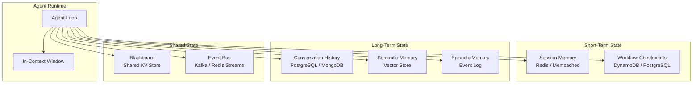
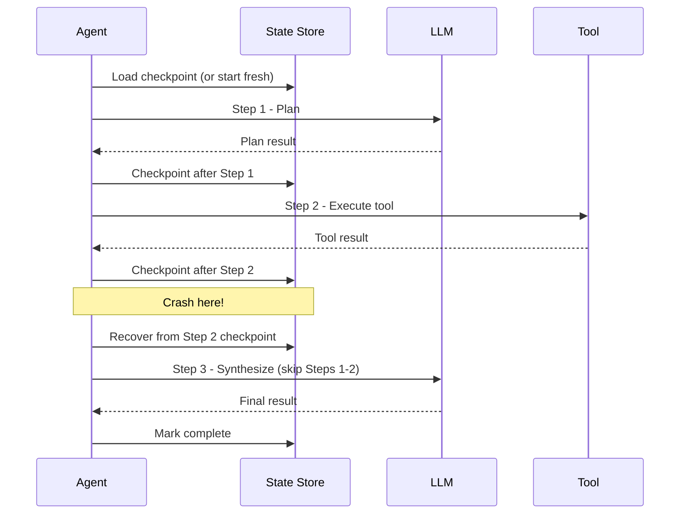
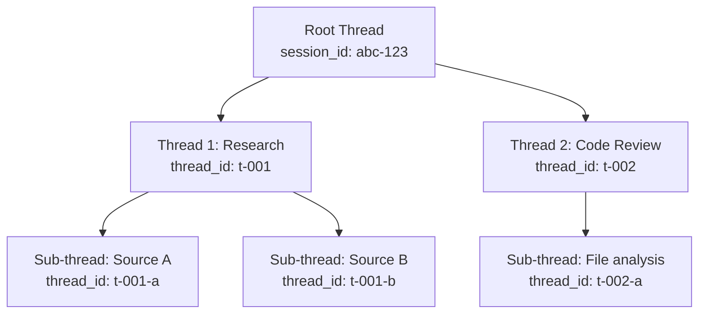

# Memory and State Management

Memory management in agentic AI is a multi-level optimization problem. At runtime, you are simultaneously managing a fixed-size context window (8K-128K tokens), a session cache (sub-millisecond reads, expensive per GB), durable storage (cheap, high latency), and semantic search indices (approximate nearest neighbor, variable latency). Every design decision is a tradeoff between recall quality, latency, and cost -- and the correct answer changes depending on conversation length, step cost, and concurrency model.

---

## State Architecture Overview



---

## Distributed State

In a horizontally scaled system, agent workers are stateless. All state lives in external stores, and any worker must be able to pick up any session.

### State Categories

| Category | Lifetime | Store | Access Pattern |
|----------|----------|-------|---------------|
| **Turn context** | Single LLM call | In-context window | Read-only, constructed per call |
| **Session state** | Minutes to hours | Redis with TTL | Frequent read/write, low latency |
| **Workflow state** | Hours to days | DynamoDB / PostgreSQL | Checkpoint on each step |
| **Conversation history** | Days to months | PostgreSQL / MongoDB | Append-heavy, paginated reads |
| **Semantic memory** | Indefinite | Vector store (Pinecone, pgvector) | Similarity search |
| **User profile** | Indefinite | PostgreSQL | Read-heavy, rare updates |

### Session State Schema

```python
class SessionState:
    session_id: str
    user_id: str
    messages: list[dict]          # conversation turns
    summary: str                  # rolling summary for context window
    current_step: int             # workflow progress
    plan: list[dict]              # agent plan steps
    step_results: dict[int, Any]  # results keyed by step index
    active_tools: list[str]
    accumulated_cost: float
    token_count: int
    version: int                  # optimistic concurrency control
    ttl_seconds: int = 3600
```

---

## Checkpointing Strategies

Checkpointing allows an agent to resume from the last successful step after a crash, rather than restarting from the beginning.

### When to Checkpoint



### Implementation

```python
class CheckpointManager:
    def __init__(self, store): ...

    async def save_checkpoint(self, session_id, state):
        existing = await self.store.get(f"checkpoint:{session_id}")
        if existing and existing.version != state.version:
            raise ConcurrencyConflictError("Version mismatch")
        state.version += 1
        await self.store.set(f"checkpoint:{session_id}", state, ttl=state.ttl_seconds)

    async def load_checkpoint(self, session_id):
        return await self.store.get(f"checkpoint:{session_id}")

    async def resume_from_checkpoint(self, session_id):
        state = await self.load_checkpoint(session_id)
        return state, state.current_step + 1   # (state, next_step)
```

### Checkpoint Granularity Trade-offs

| Granularity | Checkpoint After | Pros | Cons |
|-------------|-----------------|------|------|
| **Per-step** | Every agent step | Minimal rework on recovery | High write volume |
| **Per-phase** | Plan, Execute, Synthesize | Balanced | May redo some steps |
| **Per-transaction** | Only on meaningful state changes | Low write volume | More rework on recovery |
| **Periodic** | Every N seconds | Predictable write rate | Unpredictable rework |

:::tip
For most production systems, **per-step checkpointing** is the right default. The write overhead (one small write per step) is negligible compared to the LLM call latency, and it minimizes wasted computation on recovery.
:::

---

## Session Persistence

### Short-Lived Sessions (Chatbot)

For interactive chat, the session typically lasts minutes to hours. Redis with TTL is the standard choice.

```python
class RedisSessionStore:
    def __init__(self, redis_url):
        self.client = redis.from_url(redis_url)

    async def save(self, session_id, state):
        await self.client.setex(
            f"session:{session_id}", state.ttl_seconds, json.dumps(state.to_dict()))

    async def load(self, session_id):
        data = await self.client.get(f"session:{session_id}")
        return SessionState.from_dict(json.loads(data)) if data else None

    async def extend_ttl(self, session_id, seconds):
        await self.client.expire(f"session:{session_id}", seconds)
```

### Long-Lived Sessions (Workflow)

For multi-day workflows (research agents, data pipeline agents), use a durable store like PostgreSQL.

```sql
CREATE TABLE agent_sessions (
    session_id    UUID PRIMARY KEY,
    user_id       UUID NOT NULL,
    state         JSONB NOT NULL,
    status        TEXT NOT NULL DEFAULT 'active',
    version       INTEGER NOT NULL DEFAULT 0,
    created_at    TIMESTAMPTZ NOT NULL DEFAULT now(),
    updated_at    TIMESTAMPTZ NOT NULL DEFAULT now(),
    expires_at    TIMESTAMPTZ
);

CREATE INDEX idx_sessions_user ON agent_sessions(user_id);
CREATE INDEX idx_sessions_status ON agent_sessions(status) WHERE status = 'active';

-- Optimistic concurrency control
CREATE OR REPLACE FUNCTION update_session(
    p_session_id UUID,
    p_state JSONB,
    p_expected_version INTEGER
) RETURNS BOOLEAN AS $$
BEGIN
    UPDATE agent_sessions
    SET state = p_state,
        version = version + 1,
        updated_at = now()
    WHERE session_id = p_session_id
      AND version = p_expected_version;
    RETURN FOUND;
END;
$$ LANGUAGE plpgsql;
```

---

## Conversation Threading

Production agents often handle branching conversations -- where a user revisits a previous point, or where multiple sub-conversations run in parallel.

### Thread Model



### Data Model

```python
class ConversationThread:
    thread_id: str
    parent_thread_id: str | None
    session_id: str
    messages: list[Message]
    status: str   # "active", "completed", "abandoned"

    def fork(self, new_thread_id):
        """Child thread inherits parent context but starts with empty messages."""
        return ConversationThread(new_thread_id, parent=self.thread_id,
                                  session=self.session_id, messages=[])

    def build_context(self, thread_store):
        """Walk up the thread hierarchy to assemble full context."""
        context, current = [], self
        while current:
            context = current.messages + context
            current = thread_store.get(current.parent_thread_id) if current.parent_thread_id else None
        return context
```

---

## State Serialization

Agent state contains diverse types -- messages, tool results, embeddings, file references. Choosing the right serialization format affects performance and debuggability.

### Format Comparison

| Format | Size | Speed | Human-Readable | Schema Evolution |
|--------|------|-------|----------------|-----------------|
| **JSON** | Large | Moderate | Yes | Flexible (schemaless) |
| **MessagePack** | Small | Fast | No | Flexible (schemaless) |
| **Protocol Buffers** | Smallest | Fastest | No | Excellent (schema versioning) |
| **Pickle** | Variable | Fast | No | Fragile (Python-only) |

:::warning
Never use Python pickle for agent state serialization. It is insecure (arbitrary code execution on deserialization), fragile across Python versions, and not portable across languages. Use JSON for debuggability or Protocol Buffers for performance.
:::

### Versioned Serialization

```python
class StateSerializer:
    CURRENT_VERSION = 3

    def serialize(self, state):
        data = {"_version": self.CURRENT_VERSION, **state.to_dict()}
        return json.dumps(data).encode()

    def deserialize(self, raw):
        data = json.loads(raw)
        version = data.get("_version", 1)
        # Chain migrations: v1 -> v2 (add 'plan'), v2 -> v3 (rename 'context' -> 'metadata')
        if version < 2: data.setdefault("plan", [])
        if version < 3: data["metadata"] = data.pop("context", {})
        return SessionState.from_dict(data)
```

---

## Conflict Resolution

When multiple workers or agent branches update the same state concurrently, conflicts must be resolved deterministically.

### Strategies

| Strategy | How It Works | Best For |
|----------|-------------|----------|
| **Optimistic concurrency (versioning)** | Read version, write only if version matches | Low-contention updates |
| **Last-writer-wins** | Timestamp-based, latest write takes precedence | Append-only data |
| **Merge** | Application-specific merge logic | Concurrent tool results |
| **Lock-based** | Distributed lock (Redlock) before write | Critical sections |

### Optimistic Concurrency Example

```python
class OptimisticStateStore:
    async def update(self, session_id, updater_fn, max_retries=5):
        for attempt in range(max_retries):
            state = await self.load(session_id)
            updated = updater_fn(state)
            ok = await self._compare_and_swap(session_id, updated, state.version)
            if ok:
                return updated
            await asyncio.sleep(0.01 * 2**attempt)  # backoff on conflict
        raise ConflictError(f"Failed after {max_retries} retries")
```

---

## TTL Policies

State that is never cleaned up eventually consumes all available storage. TTL (time-to-live) policies ensure state has a defined lifecycle.

### Recommended TTLs

| State Type | TTL | Rationale |
|-----------|-----|-----------|
| Active session state | 1-4 hours | User sessions rarely last longer |
| Workflow checkpoints | 7 days | Allow recovery from extended outages |
| Conversation history | 90 days | Compliance and user expectation |
| Tool result cache | 1-24 hours | Results go stale; balance freshness vs. cost |
| Semantic memory | No TTL (explicit deletion) | Long-term knowledge; managed by user |
| Rate limit counters | 1-60 minutes | Match the rate limit window |

### Tiered Expiration

```python
class TieredStateManager:
    """hot (Redis) -> warm (DynamoDB) -> cold (S3), with auto-promotion."""

    def __init__(self, hot, warm, cold): ...

    async def get(self, session_id):
        for tier in [self.hot, self.warm, self.cold]:
            state = await tier.get(session_id)
            if state:
                # Promote to faster tiers on access
                if tier is not self.hot:
                    await self.hot.set(session_id, state, ttl=3600)
                return state
        return None

    async def archive(self, session_id):
        state = await self.hot.get(session_id)
        if state:
            await self.cold.put(session_id, state)
            await self.hot.delete(session_id)
```

:::info
Tiered storage is the same pattern used by databases (buffer pool -> SSD -> archive). Apply the same thinking: hot data in memory, warm data in fast persistent storage, cold data in cheap bulk storage.
:::

---

## Context Window Management

The LLM context window is the most constrained form of agent memory. Managing what goes into the context window is critical for both quality and cost.

### Strategies

```python
class ContextWindowManager:
    def build_context(self, state, system_prompt):
        budget = self.max_tokens
        context = [{"role": "system", "content": system_prompt}]
        budget -= self._count_tokens(system_prompt) + 1024   # reserve for output
        current_turn = state.messages[-2:]                    # always include
        budget -= sum(self._count_tokens(m["content"]) for m in current_turn)
        # Fill remaining budget with most-recent history
        history = []
        for msg in reversed(state.messages[:-2]):
            cost = self._count_tokens(msg["content"])
            if budget - cost < 0: break
            history.insert(0, msg); budget -= cost
        # Prepend summary if history was truncated
        if len(history) < len(state.messages[:-2]) and state.summary:
            context.append({"role": "system", "content": f"Summary: {state.summary}"})
        return context + history + current_turn
```

---

## Context Window Packing Algorithm

The context window is the scarcest resource in an agentic system. It is a fixed-size knapsack: you must decide what goes in and what gets dropped. The naive approach -- include the most recent messages until the budget runs out -- loses critical context that appeared earlier in the conversation. A better approach scores each candidate item by a composite priority (type weight, recency, relevance) and packs greedily by value density (priority per token).

```python
import json
import math
from dataclasses import dataclass, field
from typing import Any


@dataclass
class ContextItem:
    type: str               # e.g. "system_prompt", "recent_turns", "tool_schemas"
    content: str
    position: int           # original ordering index for re-sorting after packing
    metadata: dict = field(default_factory=dict)
    turn_index: int = 0     # conversation turn this item belongs to
    relevance_score: float = 1.0  # optional semantic relevance from RAG retrieval


class ContextWindowPacker:
    """Packs the highest-value content into a fixed token budget.

    The context window is the scarcest resource in an agentic system. A 128K-token
    model sounds large, but a production agent prompt consumes tokens fast:
    - System prompt: 500-2000 tokens
    - Tool schemas (20 tools): 3000-5000 tokens
    - RAG documents (5 chunks): 2500-5000 tokens
    - Conversation history: 200-500 tokens per turn
    - Reserved for output: 2000-4000 tokens

    At turn 15, you're already over 20K tokens. This algorithm decides what to keep.
    """

    PRIORITY_WEIGHTS = {
        "system_prompt": 1.0,      # always include -- defines agent behavior
        "current_turn": 0.95,      # always include -- user's current message
        "tool_schemas": 0.9,       # needed for tool calling
        "recent_turns": 0.8,       # last 2-4 turns for immediate context
        "rag_documents": 0.7,      # retrieved knowledge -- relevance varies
        "tool_results": 0.6,       # prior step results -- decay with age
        "summary": 0.5,            # compressed history -- fallback for dropped turns
        "older_history": 0.3,      # older turns -- summarize instead
    }

    def __init__(self, max_tokens: int, tokenizer, output_reserve: int = 4096):
        self.max_tokens = max_tokens
        self.tokenizer = tokenizer
        self.output_reserve = output_reserve  # tokens reserved for model output

    def pack(self, items: list[ContextItem]) -> list[ContextItem]:
        """Greedy knapsack: score each item, pack in priority order until full.

        Returns the items that fit, in conversation order (not priority order).
        """
        budget = self.max_tokens - self.output_reserve

        # Score each item: priority_weight * recency_boost * relevance_score
        scored = []
        for item in items:
            tokens = self.tokenizer.count(item.content)
            base_priority = self.PRIORITY_WEIGHTS.get(item.type, 0.1)
            recency = self._recency_score(item.turn_index, max_turn=len(items))
            relevance = item.relevance_score

            # Value density: priority per token. Prefer high-value, small items.
            density = (base_priority * recency * relevance) / max(tokens, 1)
            scored.append((density, tokens, base_priority, item))

        # Sort by density descending -- but always include must-have items first
        must_include = [(d, t, p, item) for d, t, p, item in scored if p >= 0.9]
        optional = [(d, t, p, item) for d, t, p, item in scored if p < 0.9]
        optional.sort(key=lambda x: x[0], reverse=True)

        # Pack must-includes
        packed, remaining = [], budget
        for d, tokens, p, item in must_include:
            if tokens <= remaining:
                packed.append(item)
                remaining -= tokens
            elif item.type == "tool_schemas":
                # Tool schemas can be truncated: keep only the tools used so far
                # plus top-k relevant unused tools that fit in the remaining budget
                truncated = self._truncate_tools(item, remaining)
                packed.append(truncated)
                remaining -= self.tokenizer.count(truncated.content)

        # Pack optionals greedily
        for d, tokens, p, item in optional:
            if tokens <= remaining:
                packed.append(item)
                remaining -= tokens
            elif item.type == "older_history" and remaining > 200:
                # If we can't fit full history, try to fit a summary
                summary = self._summarize_item(item, max_tokens=remaining)
                if summary:
                    packed.append(summary)
                    remaining -= self.tokenizer.count(summary.content)

        # Re-sort into conversation order for coherent context
        packed.sort(key=lambda item: item.position)
        return packed

    def _recency_score(self, turn_index: int, max_turn: int) -> float:
        """Exponential decay: recent turns score higher.

        With decay factor 2.0, a message from 5 turns ago scores ~0.37x
        the current turn. Messages from 15+ turns ago score < 0.05x.
        """
        if max_turn == 0:
            return 1.0
        normalized_age = (max_turn - turn_index) / max(max_turn, 1)
        return math.exp(-2.0 * normalized_age)  # half-life ~ 35% of conversation

    def _truncate_tools(self, item: ContextItem, budget: int) -> ContextItem:
        """Keep only tools that were used + top-k by relevance to fit budget."""
        tools = json.loads(item.content)
        used_names = item.metadata.get("used_tools", [])
        used = [t for t in tools if t["name"] in used_names]
        unused = [t for t in tools if t["name"] not in used_names]
        # Always keep used tools, fill remaining budget with most relevant unused
        result = used[:]
        for tool in unused:
            candidate = json.dumps(result + [tool])
            if self.tokenizer.count(candidate) <= budget:
                result.append(tool)
            else:
                break
        return ContextItem(
            type="tool_schemas",
            content=json.dumps(result),
            position=item.position,
            metadata=item.metadata,
        )

    def _summarize_item(self, item: ContextItem, max_tokens: int) -> ContextItem | None:
        """Produce a truncated version of the item that fits within max_tokens.

        In production, this would call an LLM for abstractive summarization.
        Here we use a simple truncation as a placeholder.
        """
        words = item.content.split()
        truncated = []
        for word in words:
            candidate = " ".join(truncated + [word])
            if self.tokenizer.count(candidate) > max_tokens:
                break
            truncated.append(word)
        if not truncated:
            return None
        return ContextItem(
            type="summary",
            content=" ".join(truncated),
            position=item.position,
            metadata={**item.metadata, "summarized_from": item.type},
        )
```

The packer's recency decay function (`exp(-2.0 * age)`) is calibrated so that a message from 5 turns ago scores roughly half as much as the current turn. This matches empirical findings: LLMs attend more strongly to recent context, and older information that has not been referenced recently is less likely to be relevant. The exponential curve means information from 15+ turns ago is almost never included raw -- it is either summarized or dropped entirely.

The tool schema truncation is a crucial optimization. With 50 registered tools at ~100 tokens each, tool schemas alone consume 5000 tokens. The packer keeps only tools the agent has already used (it will likely use them again) plus the top-k most relevant unused tools, cutting schema overhead by 60-80%.

---

## Memory Architecture Tradeoffs

The sections above describe the mechanisms. This section addresses the harder question: when to use which mechanism, and what you give up with each choice.

### 1. Full History vs Summarized Context

Keeping every message in the context window maximizes recall but costs O(n) tokens per turn, where n is the conversation length. At turn 20 with 500 tokens per turn, you are spending 10K tokens just on history -- roughly $0.025 per turn at GPT-4o rates. Summarization compresses the entire history into ~500 tokens but loses specific details (exact numbers, verbatim quotes, tool output).

The tradeoff: use full history for short conversations (under 10 turns) and rolling summarization for long ones. The break-even point is typically around 8-12 turns depending on model pricing. Below that threshold, the cost of summarization (an extra LLM call per turn, ~$0.005) exceeds the savings from reduced input tokens.

### 2. Redis vs DynamoDB for Session State

| Dimension | Redis | DynamoDB |
|-----------|-------|----------|
| Read latency | ~0.1ms | ~5ms |
| Durability | Volatile (data loss on restart without AOF/RDB) | Durable by default |
| Cost model | ~$0.17/GB/hr (ElastiCache) | ~$0.25/GB/month (on-demand) |
| Best for | Hot sessions under 4 hours | Persistent state across restarts |

Redis wins for active sessions where sub-millisecond access matters and data loss on restart is acceptable (the session can be rebuilt from durable storage). DynamoDB wins for checkpoint state you need to survive process restarts and infrastructure failures. Most production systems use both: Redis for the active session's working memory, DynamoDB or PostgreSQL for checkpoint persistence.

### 3. Per-Step vs Per-Phase Checkpointing

Per-step checkpointing writes state after every tool call (10-20 writes per session). Per-phase checkpointing writes after each major phase -- plan, execute, synthesize -- yielding roughly 3 writes per session. Per-step wastes I/O if individual steps are cheap (sub-second LLM calls costing under $0.001). Per-phase wastes compute if a failure discards 5 expensive tool calls (API queries, web scrapes) that must be re-executed.

The decision rule: if the average step cost exceeds $0.01 (in LLM tokens, API fees, or wall-clock time), use per-step checkpointing. Below that threshold, per-phase is sufficient and reduces write amplification.

### 4. Semantic Memory: Vector DB Selection

| System | Deployment | Latency at 1M vectors | Cost | Ops overhead |
|--------|-----------|----------------------|------|-------------|
| **pgvector** | Runs inside PostgreSQL | ~100ms | Free (uses existing DB) | None (existing infra) |
| **Pinecone** | Managed SaaS | ~10ms | ~$70/month per index | None |
| **Qdrant** | Self-hosted or cloud | ~5ms | Free (self-hosted) | Container management |

For fewer than 500K vectors, pgvector is almost always the correct choice -- it eliminates a dependency, and the latency difference (100ms vs 10ms) is negligible compared to LLM call latency (500-2000ms). Beyond 1M vectors, or when you need sub-10ms latency for real-time retrieval augmentation in a tight loop, move to a dedicated vector database. The operational cost of running a separate system only pays off when pgvector becomes the bottleneck.

### 5. Optimistic vs Pessimistic Concurrency

Optimistic concurrency (version check on write, retry on conflict) works when conflicts are rare -- fewer than 5% of writes collide. Pessimistic concurrency (acquire a distributed lock before writing) works when conflicts are frequent and retries are expensive. In agentic systems, most sessions are single-writer: one agent loop processes one user session at a time. This means optimistic concurrency is correct roughly 95% of the time. The exception is multi-agent collaboration on a shared artifact -- for example, parallel research workers writing findings to the same document -- where pessimistic locking (via Redlock or DynamoDB conditional writes) prevents lost updates.

### Decision Matrix

| Decision | Option A | Option B | Choose A When | Choose B When |
|----------|----------|----------|--------------|--------------|
| History strategy | Full history | Rolling summarization | Under 10 turns, cost is acceptable | 12+ turns, or cost-sensitive workload |
| Session store | Redis | DynamoDB | Hot sessions under 4h, sub-ms latency needed | State must survive restarts, durability required |
| Checkpoint granularity | Per-step | Per-phase | Avg step cost over $0.01 | Steps are cheap (under $0.001), minimize I/O |
| Vector DB | pgvector | Dedicated (Pinecone/Qdrant) | Under 500K vectors, existing PostgreSQL | 1M+ vectors, sub-10ms retrieval required |
| Concurrency | Optimistic (version check) | Pessimistic (distributed lock) | Single-writer sessions, under 5% conflict rate | Multi-agent shared writes, high contention |

---

## Interview Preparation

**Sample question:** "How would you manage state for an agent that handles multi-day research tasks with checkpointing?"

**Strong answer structure:**
1. **Externalized state** -- stateless workers, state in PostgreSQL (durable) with Redis cache (fast)
2. **Per-step checkpointing** -- save after each tool execution for minimal rework on recovery
3. **Optimistic concurrency** -- version field prevents lost updates from concurrent workers
4. **Tiered TTLs** -- active sessions in Redis (4h), checkpoints in PostgreSQL (7d), archives in S3
5. **Context window management** -- summarization for long histories, sliding window for recent turns
6. **Conversation threading** -- fork/join model for parallel research branches
7. **Versioned serialization** -- schema migrations so old checkpoints remain loadable
