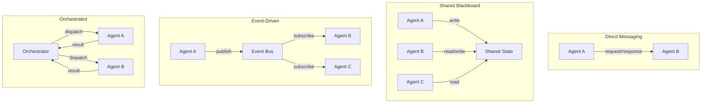
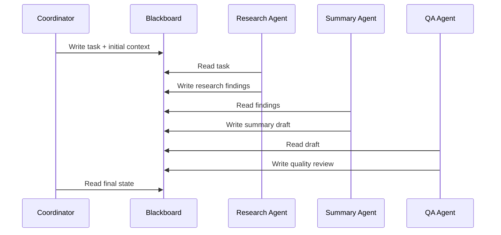
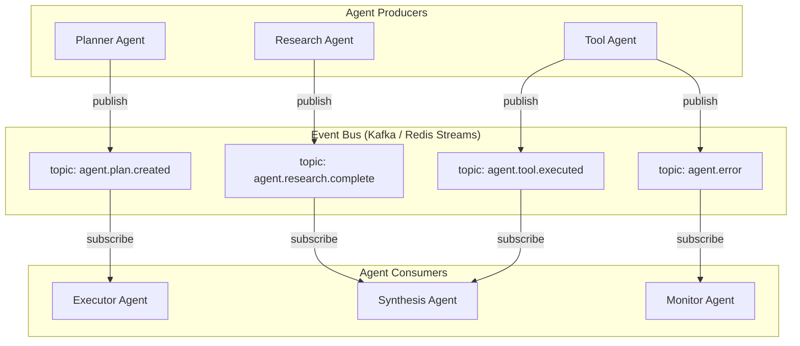
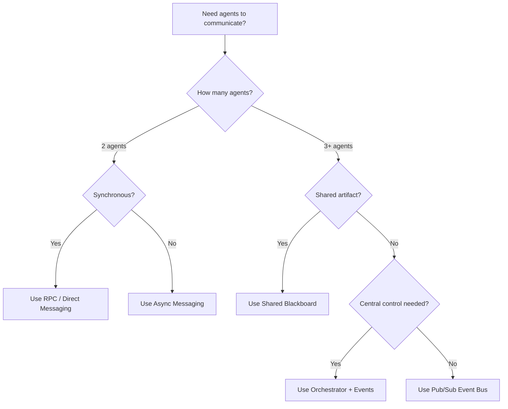

# Multi-Agent Communication

When a system has more than one agent, the agents need to talk to each other. The communication pattern you choose -- direct messaging, shared blackboard, event bus, or RPC -- shapes everything from latency to fault tolerance to debuggability. This page covers the core patterns, their trade-offs, and how to choose between them.

---

## Communication Patterns Overview



---

## Message Passing Patterns

### Request-Response (Synchronous)

The simplest pattern. One agent sends a request to another and waits for a response.

```python
# AgentMessage: sender, recipient, content, message_id, correlation_id, message_type, ttl

class DirectMessaging:
    # _pending maps message_id -> Future for outstanding requests

    async def send_and_wait(self, sender, recipient, content, timeout=30.0):
        msg = AgentMessage(sender, recipient, content, message_type="request")
        future = create_future()
        self._pending[msg.message_id] = future
        await self.transport.send(recipient, msg)
        return await wait_for(future, timeout)  # raises TimeoutError

    async def handle_incoming(self, msg):
        if msg.correlation_id in self._pending:
            self._pending.pop(msg.correlation_id).set_result(msg)
```

**When to use:** Simple two-agent handoffs, delegation chains, when the caller needs the result before proceeding.

**Trade-offs:** Tight coupling between agents. If Agent B is slow, Agent A blocks. Not suitable for fan-out patterns.

### Fire-and-Forget (Asynchronous)

The sender publishes a message and continues without waiting for a response.

```python
class AsyncMessaging:
    async def send(self, sender, recipient, content):
        msg = AgentMessage(sender, recipient, content, message_type="event")
        await self.transport.send(recipient, msg)
        # No waiting -- sender moves on immediately

    async def send_with_callback(self, sender, recipient, content, callback_queue):
        # Attach callback_queue to payload so recipient can respond later
        msg = AgentMessage(sender, recipient,
                           {**content, "_callback_queue": callback_queue})
        await self.transport.send(recipient, msg)
```

**When to use:** Notifications, logging, triggering background work, fan-out to multiple agents.

---

## Shared Blackboard

The blackboard pattern uses a shared data store that all agents can read from and write to. Agents observe the blackboard, decide if they can contribute, and write their results back.



### Implementation

```python
class Blackboard:
    # Shared state store + per-key subscriber callbacks

    async def write(self, key, value, author):
        entry = {value, author, timestamp, version}
        await self.store.set(key, entry)
        for callback in self._subscribers.get(key, []):
            await callback(key, entry)       # notify watchers

    async def read(self, key):
        return (await self.store.get(key))["value"]

    def subscribe(self, key, callback):
        self._subscribers.setdefault(key, []).append(callback)

    async def wait_for(self, key, timeout=60.0):
        # Block until key is written, then return its value
        event = asyncio.Event()
        self.subscribe(key, lambda k, e: event.set())
        await wait_for(event.wait(), timeout)
        return await self.read(key)
```

**When to use:** Multi-agent collaboration on a shared artifact (document, analysis, plan). Works well when agents contribute different aspects of a solution.

**Trade-offs:** Requires conflict resolution for concurrent writes. Harder to trace causality (who changed what and why). Can become a bottleneck under high write contention.

:::info
The blackboard pattern originated in AI research (Hearsay-II speech recognition system, 1980). It remains one of the most natural patterns for multi-agent collaboration because it decouples agents from each other -- they only need to know about the blackboard, not about each other.
:::

---

## Event-Driven Architecture

Agents communicate by publishing and subscribing to events on a message bus. This fully decouples producers from consumers.

### Event Bus Architecture



### Implementation

```python
# AgentEvent: event_type, source_agent, session_id, payload, event_id, metadata

class EventBus:
    # broker = Kafka, Redis Streams, NATS, etc.

    async def publish(self, event):
        topic = f"agent.{event.event_type}"
        await self.broker.publish(topic, serialize(event), key=event.session_id)

    async def subscribe(self, event_type, handler, group=None):
        await self.broker.subscribe(f"agent.{event_type}", handler,
                                    consumer_group=group)

    async def subscribe_pattern(self, pattern, handler):
        await self.broker.subscribe_pattern(pattern, handler)
```

### Event Choreography vs. Orchestration

| Approach | Description | Pros | Cons |
|----------|-------------|------|------|
| **Choreography** | Each agent reacts to events independently | Decoupled, scalable | Hard to trace flow, no central control |
| **Orchestration** | Central coordinator dispatches tasks to agents | Clear flow, easy to trace | Single point of failure, coupling |
| **Hybrid** | Orchestrator for the happy path, events for side effects | Balanced | More complex |

:::tip
For most production multi-agent systems, the **hybrid approach** works best. Use an orchestrator for the main workflow (it is easier to debug and manage), and use events for cross-cutting concerns like logging, monitoring, and notifications.
:::

---

## Pub/Sub Between Agents

When multiple agents need to react to the same event -- for example, a new customer message triggers both a classification agent and a sentiment analysis agent -- pub/sub is the natural pattern.

```python
class MultiAgentPubSub:
    async def fan_out(self, event, target_agents):
        await self.event_bus.publish(event)  # all subscribers receive it

    async def fan_in(self, session_id, expected_responses, timeout=60.0):
        responses = []
        done = asyncio.Event()

        async def collect(resp):
            if resp.session_id == session_id:
                responses.append(resp)
                if len(responses) >= expected_responses:
                    done.set()

        await self.event_bus.subscribe("*.complete", collect)
        await wait_for(done.wait(), timeout)  # partial results on timeout
        return responses
```

---

## RPC Between Agents

For tightly coupled agent interactions where one agent needs a specific result from another, RPC (Remote Procedure Call) provides a clean request-response model.

```python
class AgentRPC:
    # registry maps agent_name -> endpoint

    async def call(self, caller, target_agent, method, params, timeout=30.0):
        endpoint = self.registry.resolve(target_agent)
        request = {"jsonrpc": "2.0", "method": method,
                    "params": params, "id": uuid(), "metadata": {"caller": caller}}
        response = await self.transport.request(endpoint, request, timeout=timeout)
        if "error" in response:
            raise AgentRPCError(response["error"])
        return response["result"]
```

---

## Protocol Design

When agents are built by different teams or in different languages, a well-defined communication protocol is essential.

### Agent Communication Protocol (ACP)

```python
class AgentProtocolMessage:
    # Envelope: protocol_version, message_id, correlation_id, timestamp
    # Routing: source ("agent:research:instance-3"), destination ("agent:synthesis" | "broadcast:*")
    # Payload: message_type (task|result|error|heartbeat|control), content_type, payload dict
    # QoS:    priority (0=highest), ttl_seconds, require_ack
    # Tracing: trace_id, span_id, parent_span_id
    pass
```

### Message Type Taxonomy

| Type | Purpose | Response Expected |
|------|---------|------------------|
| `task` | Assign work to an agent | Yes (result or error) |
| `result` | Return completed work | No (but may trigger downstream) |
| `error` | Report a failure | No |
| `heartbeat` | Liveness signal | No |
| `control` | Start, stop, reconfigure | Yes (ack) |
| `query` | Request information without side effects | Yes |

---

## Serialization Formats

The choice of serialization format affects performance, debuggability, and cross-language compatibility.

| Format | Size | Speed | Human-Readable | Schema Support | Cross-Language |
|--------|------|-------|----------------|----------------|---------------|
| **JSON** | Large | Moderate | Yes | JSON Schema | Excellent |
| **Protocol Buffers** | Small | Fast | No | Built-in | Excellent |
| **MessagePack** | Small | Fast | No | External | Good |
| **Avro** | Small | Fast | No | Built-in (schema registry) | Good |
| **CBOR** | Small | Fast | No | CDDL | Good |

:::warning
For inter-agent communication, avoid Python-specific serialization (pickle, marshal). Multi-agent systems often evolve into polyglot environments where some agents are in Python, others in TypeScript or Go. Use a language-neutral format from the start.
:::

### Recommendation

- **Development and debugging:** JSON. Readable in logs, easy to inspect.
- **High-throughput production:** Protocol Buffers or MessagePack. Smaller payloads, faster serialization.
- **Schema evolution:** Avro with a schema registry. Guarantees backward/forward compatibility.

---

## Conversation Between Agents

When agents have a multi-turn dialogue (e.g., a supervisor agent and a worker agent iterating on a solution), structure the conversation with clear roles and turn management.

```python
class AgentConversation:
    # Two agents alternate turns up to max_turns

    async def run(self, initial_message):
        current_message = initial_message
        speaker = self.agent_a
        for turn in range(self.max_turns):
            response = await speaker.respond(current_message, self.transcript)
            self.transcript.append(response)
            if response.metadata.get("conversation_complete"):
                break
            current_message = response.text
            speaker = self.agent_b if speaker == self.agent_a else self.agent_a
        return self.transcript
```

---

## Pattern Selection Guide



---

## Interview Preparation

**Sample question:** "How would you design communication between a supervisor agent and 5 worker agents that collaborate on a research task?"

**Strong answer structure:**
1. **Orchestrator pattern** for the main flow -- supervisor assigns sub-tasks via a task queue
2. **Shared blackboard** for the research artifact -- each worker writes findings to a shared store
3. **Event bus** for progress and status -- workers publish progress events; supervisor subscribes
4. **Request-response** for synchronous decisions -- supervisor asks a worker to clarify a finding
5. **Protocol** with correlation IDs and trace context for end-to-end observability
6. **Fan-out / fan-in** for parallel research -- supervisor dispatches to all workers, collects results with a timeout
