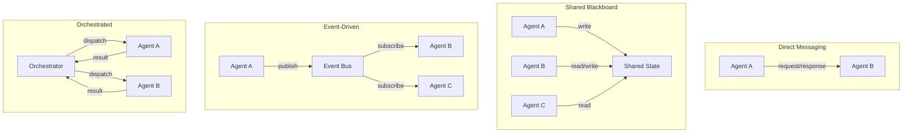
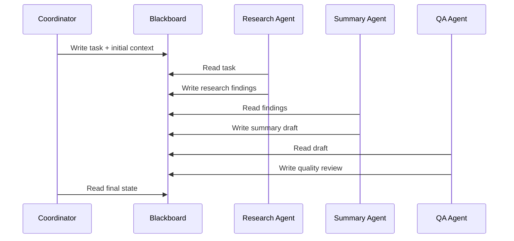
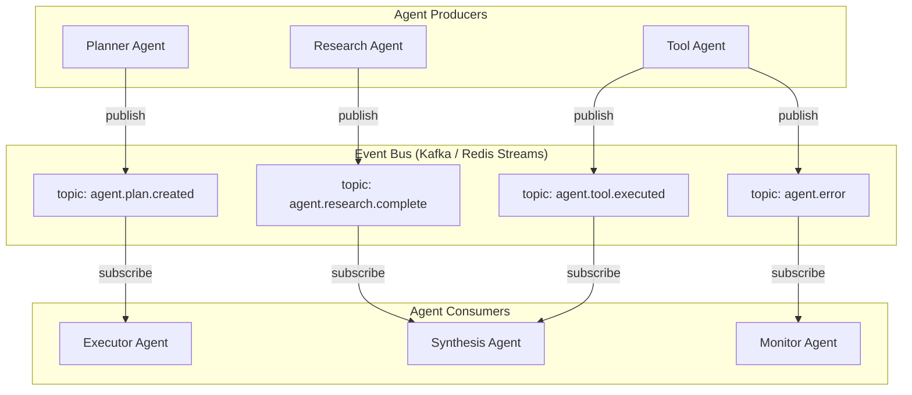
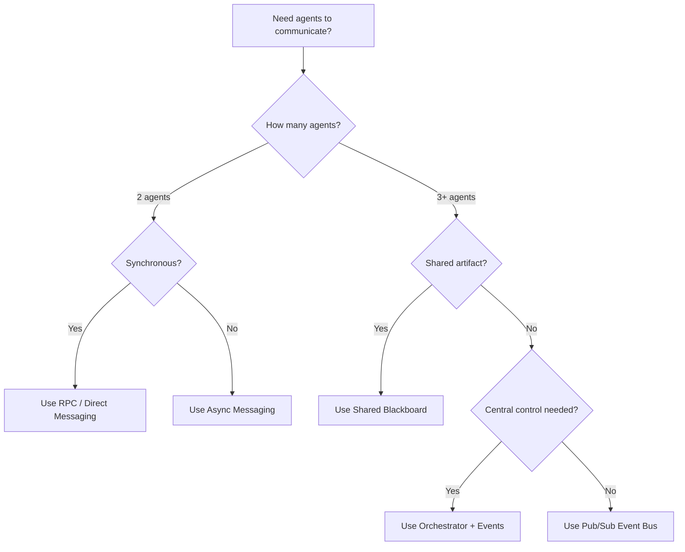

# Multi-Agent Communication

Multi-agent communication is fundamentally different from microservice communication: agents produce non-deterministic outputs, conversations carry branching state that must be tracked across turns, and the cost of a single "message" (an LLM call at 2-5 seconds and thousands of tokens) is roughly 1000x more expensive than an HTTP request between services. These constraints make protocol design decisions -- direct messaging vs. shared blackboard vs. event bus vs. RPC -- far more consequential, because a poor choice compounds latency, cost, and debugging difficulty multiplicatively rather than additively.

---

## Communication Patterns Overview



---

## Message Passing Patterns

### Request-Response (Synchronous)

The simplest pattern. One agent sends a request to another and waits for a response.

```python
# AgentMessage: sender, recipient, content, message_id, correlation_id, message_type, ttl

class DirectMessaging:
    # _pending maps message_id -> Future for outstanding requests

    async def send_and_wait(self, sender, recipient, content, timeout=30.0):
        msg = AgentMessage(sender, recipient, content, message_type="request")
        future = create_future()
        self._pending[msg.message_id] = future
        await self.transport.send(recipient, msg)
        return await wait_for(future, timeout)  # raises TimeoutError

    async def handle_incoming(self, msg):
        if msg.correlation_id in self._pending:
            self._pending.pop(msg.correlation_id).set_result(msg)
```

**When to use:** Simple two-agent handoffs, delegation chains, when the caller needs the result before proceeding.

**Trade-offs:** Tight coupling between agents. If Agent B is slow, Agent A blocks. Not suitable for fan-out patterns.

### Fire-and-Forget (Asynchronous)

The sender publishes a message and continues without waiting for a response.

```python
class AsyncMessaging:
    async def send(self, sender, recipient, content):
        msg = AgentMessage(sender, recipient, content, message_type="event")
        await self.transport.send(recipient, msg)
        # No waiting -- sender moves on immediately

    async def send_with_callback(self, sender, recipient, content, callback_queue):
        # Attach callback_queue to payload so recipient can respond later
        msg = AgentMessage(sender, recipient,
                           {**content, "_callback_queue": callback_queue})
        await self.transport.send(recipient, msg)
```

**When to use:** Notifications, logging, triggering background work, fan-out to multiple agents.

---

## Shared Blackboard

The blackboard pattern uses a shared data store that all agents can read from and write to. Agents observe the blackboard, decide if they can contribute, and write their results back.



### Implementation

```python
class Blackboard:
    # Shared state store + per-key subscriber callbacks

    async def write(self, key, value, author):
        entry = {value, author, timestamp, version}
        await self.store.set(key, entry)
        for callback in self._subscribers.get(key, []):
            await callback(key, entry)       # notify watchers

    async def read(self, key):
        return (await self.store.get(key))["value"]

    def subscribe(self, key, callback):
        self._subscribers.setdefault(key, []).append(callback)

    async def wait_for(self, key, timeout=60.0):
        # Block until key is written, then return its value
        event = asyncio.Event()
        self.subscribe(key, lambda k, e: event.set())
        await wait_for(event.wait(), timeout)
        return await self.read(key)
```

**When to use:** Multi-agent collaboration on a shared artifact (document, analysis, plan). Works well when agents contribute different aspects of a solution.

**Trade-offs:** Requires conflict resolution for concurrent writes. Harder to trace causality (who changed what and why). Can become a bottleneck under high write contention.

:::info
The blackboard pattern originated in AI research (Hearsay-II speech recognition system, 1980). It remains one of the most natural patterns for multi-agent collaboration because it decouples agents from each other -- they only need to know about the blackboard, not about each other.
:::

---

## Event-Driven Architecture

Agents communicate by publishing and subscribing to events on a message bus. This fully decouples producers from consumers.

### Event Bus Architecture



### Implementation

```python
# AgentEvent: event_type, source_agent, session_id, payload, event_id, metadata

class EventBus:
    # broker = Kafka, Redis Streams, NATS, etc.

    async def publish(self, event):
        topic = f"agent.{event.event_type}"
        await self.broker.publish(topic, serialize(event), key=event.session_id)

    async def subscribe(self, event_type, handler, group=None):
        await self.broker.subscribe(f"agent.{event_type}", handler,
                                    consumer_group=group)

    async def subscribe_pattern(self, pattern, handler):
        await self.broker.subscribe_pattern(pattern, handler)
```

### Event Choreography vs. Orchestration

| Approach | Description | Pros | Cons |
|----------|-------------|------|------|
| **Choreography** | Each agent reacts to events independently | Decoupled, scalable | Hard to trace flow, no central control |
| **Orchestration** | Central coordinator dispatches tasks to agents | Clear flow, easy to trace | Single point of failure, coupling |
| **Hybrid** | Orchestrator for the happy path, events for side effects | Balanced | More complex |

:::tip
For most production multi-agent systems, the **hybrid approach** works best. Use an orchestrator for the main workflow (it is easier to debug and manage), and use events for cross-cutting concerns like logging, monitoring, and notifications.
:::

---

## Pub/Sub Between Agents

When multiple agents need to react to the same event -- for example, a new customer message triggers both a classification agent and a sentiment analysis agent -- pub/sub is the natural pattern.

```python
class MultiAgentPubSub:
    async def fan_out(self, event, target_agents):
        await self.event_bus.publish(event)  # all subscribers receive it

    async def fan_in(self, session_id, expected_responses, timeout=60.0):
        responses = []
        done = asyncio.Event()

        async def collect(resp):
            if resp.session_id == session_id:
                responses.append(resp)
                if len(responses) >= expected_responses:
                    done.set()

        await self.event_bus.subscribe("*.complete", collect)
        await wait_for(done.wait(), timeout)  # partial results on timeout
        return responses
```

---

## RPC Between Agents

For tightly coupled agent interactions where one agent needs a specific result from another, RPC (Remote Procedure Call) provides a clean request-response model.

```python
class AgentRPC:
    # registry maps agent_name -> endpoint

    async def call(self, caller, target_agent, method, params, timeout=30.0):
        endpoint = self.registry.resolve(target_agent)
        request = {"jsonrpc": "2.0", "method": method,
                    "params": params, "id": uuid(), "metadata": {"caller": caller}}
        response = await self.transport.request(endpoint, request, timeout=timeout)
        if "error" in response:
            raise AgentRPCError(response["error"])
        return response["result"]
```

---

## Protocol Design

When agents are built by different teams or in different languages, a well-defined communication protocol is essential.

### Agent Communication Protocol (ACP)

```python
class AgentProtocolMessage:
    # Envelope: protocol_version, message_id, correlation_id, timestamp
    # Routing: source ("agent:research:instance-3"), destination ("agent:synthesis" | "broadcast:*")
    # Payload: message_type (task|result|error|heartbeat|control), content_type, payload dict
    # QoS:    priority (0=highest), ttl_seconds, require_ack
    # Tracing: trace_id, span_id, parent_span_id
    pass
```

### Message Type Taxonomy

| Type | Purpose | Response Expected |
|------|---------|------------------|
| `task` | Assign work to an agent | Yes (result or error) |
| `result` | Return completed work | No (but may trigger downstream) |
| `error` | Report a failure | No |
| `heartbeat` | Liveness signal | No |
| `control` | Start, stop, reconfigure | Yes (ack) |
| `query` | Request information without side effects | Yes |

---

## Serialization Formats

The choice of serialization format affects performance, debuggability, and cross-language compatibility.

| Format | Size | Speed | Human-Readable | Schema Support | Cross-Language |
|--------|------|-------|----------------|----------------|---------------|
| **JSON** | Large | Moderate | Yes | JSON Schema | Excellent |
| **Protocol Buffers** | Small | Fast | No | Built-in | Excellent |
| **MessagePack** | Small | Fast | No | External | Good |
| **Avro** | Small | Fast | No | Built-in (schema registry) | Good |
| **CBOR** | Small | Fast | No | CDDL | Good |

:::warning
For inter-agent communication, avoid Python-specific serialization (pickle, marshal). Multi-agent systems often evolve into polyglot environments where some agents are in Python, others in TypeScript or Go. Use a language-neutral format from the start.
:::

### Recommendation

- **Development and debugging:** JSON. Readable in logs, easy to inspect.
- **High-throughput production:** Protocol Buffers or MessagePack. Smaller payloads, faster serialization.
- **Schema evolution:** Avro with a schema registry. Guarantees backward/forward compatibility.

---

## Conversation Between Agents

When agents have a multi-turn dialogue (e.g., a supervisor agent and a worker agent iterating on a solution), structure the conversation with clear roles and turn management.

```python
class AgentConversation:
    # Two agents alternate turns up to max_turns

    async def run(self, initial_message):
        current_message = initial_message
        speaker = self.agent_a
        for turn in range(self.max_turns):
            response = await speaker.respond(current_message, self.transcript)
            self.transcript.append(response)
            if response.metadata.get("conversation_complete"):
                break
            current_message = response.text
            speaker = self.agent_b if speaker == self.agent_a else self.agent_a
        return self.transcript
```

---

## Pattern Selection Guide



---

## Multi-Agent Consensus Algorithm

When multiple agents process the same query in a fan-out pattern, you get multiple answers with varying confidence levels. Naive majority voting ignores confidence, and picking the single highest-confidence response ignores consensus signal. The following algorithm combines confidence calibration with agreement-weighted voting to produce a single result with a composite confidence score.

```python
from dataclasses import dataclass, field
from sklearn.isotonic import IsotonicRegression
from numpy import dot
from numpy.linalg import norm


@dataclass
class AgentResponse:
    agent_id: str
    content: str
    confidence: float
    embedding: list[float]
    calibrated_confidence: float = 0.0


@dataclass
class ConsensusResult:
    answer: str
    confidence: float
    strategy: str
    agreement_ratio: float = 0.0
    dissent: list[dict] = field(default_factory=list)


def cosine_similarity(a: list[float], b: list[float]) -> float:
    return float(dot(a, b) / (norm(a) * norm(b)))


class ConfidenceCalibrator:
    """Maps raw LLM confidence to empirical accuracy using isotonic regression.

    Raw LLM confidence is unreliable. A model saying "I'm 90% confident" might
    be correct only 70% of the time. Calibration learns this mapping from
    historical (confidence, was_correct) pairs.
    """

    def __init__(self, calibration_data: dict[str, list[tuple[float, bool]]]):
        self.models: dict[str, IsotonicRegression] = {}
        for agent_id, data in calibration_data.items():
            raw_scores = [d[0] for d in data]
            correct = [1.0 if d[1] else 0.0 for d in data]
            # Isotonic regression: monotone increasing mapping from raw -> calibrated
            self.models[agent_id] = IsotonicRegression(
                out_of_bounds="clip"
            ).fit(raw_scores, correct)

    def calibrate(self, raw_confidence: float, agent_id: str) -> float:
        if agent_id in self.models:
            return float(self.models[agent_id].predict([[raw_confidence]])[0])
        return raw_confidence * 0.7  # default: assume 30% overconfidence


class MultiAgentConsensus:
    """Aggregates outputs from multiple agents using confidence-weighted voting.

    When you fan out a task to 3 research agents, you get 3 different answers
    with 3 different confidence scores. Naive majority voting ignores confidence.
    This algorithm weights each agent's vote by calibrated confidence and agreement
    with other agents, producing a single result with a composite confidence score.

    Why calibrated confidence matters: LLMs are notoriously overconfident. An agent
    reporting 0.95 confidence is often wrong 20% of the time. Calibration maps
    raw confidence to empirical accuracy using historical data.
    """

    def __init__(self, calibrator: ConfidenceCalibrator):
        self.calibrator = calibrator

    async def aggregate(
        self,
        responses: list[AgentResponse],
        strategy: str = "weighted_vote",
    ) -> ConsensusResult:
        if not responses:
            raise ValueError("No responses to aggregate")
        if len(responses) == 1:
            return ConsensusResult(
                answer=responses[0].content,
                confidence=self.calibrator.calibrate(
                    responses[0].confidence, responses[0].agent_id
                ),
                strategy="single_agent",
                dissent=[],
            )

        # Step 1: Calibrate raw confidence scores
        for r in responses:
            r.calibrated_confidence = self.calibrator.calibrate(
                r.confidence, r.agent_id
            )

        if strategy == "weighted_vote":
            return self._weighted_vote(responses)
        elif strategy == "best_of_n":
            return self._best_of_n(responses)
        elif strategy == "merge":
            return await self._merge(responses)
        else:
            raise ValueError(f"Unknown strategy: {strategy}")

    def _weighted_vote(self, responses: list[AgentResponse]) -> ConsensusResult:
        """Weighted voting: each agent's vote is weighted by calibrated confidence
        multiplied by agreement with other agents.

        Agreement bonus: if 3 of 4 agents agree, those 3 get an agreement boost.
        This prevents a single high-confidence outlier from dominating.
        """
        # Cluster responses by semantic similarity
        clusters = self._cluster_responses(responses)

        best_cluster = None
        best_score = -1.0

        for cluster in clusters:
            # Cluster score = sum of (calibrated_confidence * agreement_bonus)
            agreement_bonus = len(cluster) / len(responses)
            cluster_score = sum(
                r.calibrated_confidence * (1 + agreement_bonus) for r in cluster
            )
            if cluster_score > best_score:
                best_score = cluster_score
                best_cluster = cluster

        # Within winning cluster, pick the response with highest calibrated confidence
        winner = max(best_cluster, key=lambda r: r.calibrated_confidence)
        dissenting = [r for r in responses if r not in best_cluster]

        composite_confidence = min(1.0, best_score / (len(responses) * 2))

        return ConsensusResult(
            answer=winner.content,
            confidence=composite_confidence,
            strategy="weighted_vote",
            agreement_ratio=len(best_cluster) / len(responses),
            dissent=[
                {
                    "agent": r.agent_id,
                    "answer_summary": r.content[:100],
                    "confidence": r.calibrated_confidence,
                }
                for r in dissenting
            ],
        )

    def _cluster_responses(
        self, responses: list[AgentResponse], threshold: float = 0.85
    ) -> list[list[AgentResponse]]:
        """Group responses by semantic similarity. Two responses are in the same
        cluster if their cosine similarity exceeds the threshold."""
        clusters: list[list[AgentResponse]] = []
        for r in responses:
            placed = False
            for cluster in clusters:
                if cosine_similarity(r.embedding, cluster[0].embedding) >= threshold:
                    cluster.append(r)
                    placed = True
                    break
            if not placed:
                clusters.append([r])
        return clusters

    def _best_of_n(self, responses: list[AgentResponse]) -> ConsensusResult:
        """Simply pick the highest-confidence response. Fast but ignores consensus."""
        best = max(responses, key=lambda r: r.calibrated_confidence)
        return ConsensusResult(
            answer=best.content,
            confidence=best.calibrated_confidence,
            strategy="best_of_n",
            agreement_ratio=0.0,
            dissent=[],
        )
```

The calibrator's default fallback (`raw * 0.7`) assumes 30% overconfidence, which is a conservative estimate based on published LLM calibration studies. In practice, calibrate per-agent and per-task-type: a code generation agent may be well-calibrated on syntax correctness but wildly overconfident on logical correctness.

The clustering threshold of 0.85 controls what counts as "agreement." Too low (0.7) and semantically different answers get clustered together, inflating agreement. Too high (0.95) and minor phrasing differences split genuine agreement into separate clusters. Tune on your evaluation set.

---

## Communication Pattern Tradeoffs in Practice

The patterns described above are not interchangeable. Each encodes a specific set of assumptions about failure modes, latency budgets, and operational cost. The following analysis covers the five most consequential tradeoff decisions in multi-agent system design.

### Orchestrator vs Choreography: The Debuggability Tax

Choreography (agents reacting to events independently) is elegant and decoupled, but debugging a failure requires reconstructing the event chain across multiple agents' logs. In a system with 5 agents processing an event cascade, a failure on agent 4 requires tracing back through 3 preceding event handlers to find the root cause -- and each handler may have transformed the payload, making it difficult to correlate upstream and downstream events. Orchestration makes the flow explicit and traceable: one coordinator knows the full execution history, every step is logged in sequence, and replaying a failed workflow is straightforward.

The tradeoff: orchestrators are single points of failure and throughput bottlenecks. If the orchestrator goes down, all workflows halt. If it processes tasks sequentially, it becomes the latency ceiling. **Recommendation:** use orchestration for the primary workflow (debuggability > decoupling) and choreography for side effects (logging, analytics, notifications) where occasional missed events are tolerable.

### Synchronous vs Asynchronous Agent Calls

Synchronous (request-response) is simple and gives the caller immediate feedback, but it chains latencies: if Agent A calls Agent B which calls Agent C, total latency = A + B + C. With LLM calls averaging 2-5 seconds each, a 3-agent chain takes 6-15 seconds -- well beyond acceptable user-facing response times. Asynchronous (fire-and-forget with callbacks) breaks the latency chain but introduces complexity: you need correlation IDs to match callbacks to requests, timeout handlers for agents that never respond, and partial-result assembly when some agents complete and others do not.

The decision depends on whether the caller needs the result to proceed. If yes, use synchronous with an aggressive timeout and a fallback (return a partial answer or a cached result). If no, use asynchronous and let results arrive when they are ready.

### Shared State vs Message Passing: The Consistency Problem

The blackboard pattern (shared state) is natural when agents build on each other's work, but concurrent writes create conflicts: Agent A writes research findings while Agent B simultaneously writes a contradictory finding to the same key. Without conflict resolution (last-write-wins, CRDTs, or optimistic locking with version checks), data corruption is inevitable. With message passing, each agent owns its state and conflicts are impossible -- but aggregating results requires an explicit merge step, and the merge logic itself can be complex.

**Use shared state** when agents contribute to a single artifact (document, plan, analysis) and the write pattern is append-only or partitioned by key. **Use message passing** when agents perform independent work that gets merged at the end, or when agents are distributed across network boundaries where shared-state latency is unacceptable.

### Fan-Out Parallelism: Latency vs Token Cost

Running 5 research agents in parallel reduces wall-clock time from 5xT to T, but costs 5x the tokens. If each parallel agent uses 4K tokens at $2.50/1M (GPT-4o input), a 5-way fan-out costs ~$0.05 per invocation vs ~$0.01 sequential. At 10K daily requests, that is $400/day extra -- $146K/year in additional token spend for the latency improvement. The question is whether latency or cost is the binding constraint.

For user-facing requests where latency directly impacts UX and conversion, parallelize aggressively. For background tasks (batch processing, offline analysis, pre-computation), serialize and save the token budget. For mixed workloads, use adaptive fan-out: start with 2 parallel agents and only fan out further if the first results are low-confidence (using the consensus algorithm above to decide).

### Result Aggregation: Voting vs Merging vs Selecting

When multiple agents produce answers, you need an aggregation strategy. **Voting** (majority wins) is simple but discards nuance -- the minority answer might be correct and more detailed. **Merging** (combine all outputs into a unified response) preserves information but requires a merge function, which often means another LLM call, adding latency and cost. **Selecting** (pick the best by a quality signal) is cheap but requires a reliable quality scorer, and quality scoring is itself a hard problem.

The right choice depends on the task type: use voting for classification tasks where discrete agreement is meaningful, merging for research synthesis where multiple perspectives add value, and selecting for generation tasks where style consistency matters and blending outputs would produce an incoherent result.

### Decision Summary

| Tradeoff | Option A | Option B | Choose A When | Choose B When |
|----------|----------|----------|---------------|---------------|
| **Orchestration vs Choreography** | Orchestration (central coordinator) | Choreography (event-driven) | Primary workflows; debuggability is critical | Side effects; independent, loosely coupled agents |
| **Sync vs Async** | Synchronous (request-response) | Asynchronous (fire-and-forget + callback) | Caller needs result to proceed; simple chains | Caller can continue without result; fan-out patterns |
| **Shared State vs Message Passing** | Blackboard (shared store) | Message passing (agent-owned state) | Single shared artifact; append-only writes | Independent work; distributed agents; merge at end |
| **Parallel vs Sequential Fan-Out** | Parallel (all agents at once) | Sequential (one at a time) | User-facing latency constraint | Background tasks; cost constraint |
| **Voting vs Merging vs Selecting** | Voting / Selecting | Merging | Classification; generation with style needs | Research synthesis; multi-perspective analysis |

---

## Interview Preparation

**Sample question:** "How would you design communication between a supervisor agent and 5 worker agents that collaborate on a research task?"

**Strong answer structure:**
1. **Orchestrator pattern** for the main flow -- supervisor assigns sub-tasks via a task queue
2. **Shared blackboard** for the research artifact -- each worker writes findings to a shared store
3. **Event bus** for progress and status -- workers publish progress events; supervisor subscribes
4. **Request-response** for synchronous decisions -- supervisor asks a worker to clarify a finding
5. **Protocol** with correlation IDs and trace context for end-to-end observability
6. **Fan-out / fan-in** for parallel research -- supervisor dispatches to all workers, collects results with a timeout
