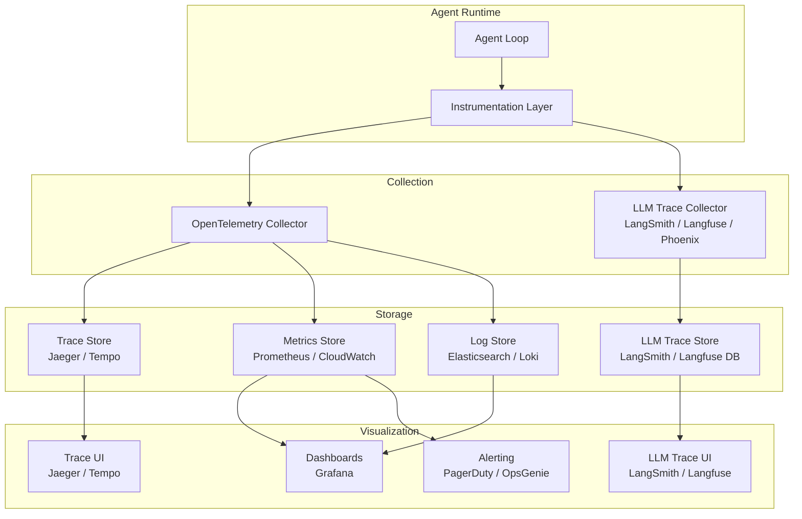
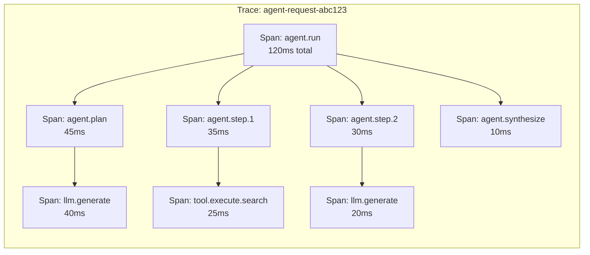
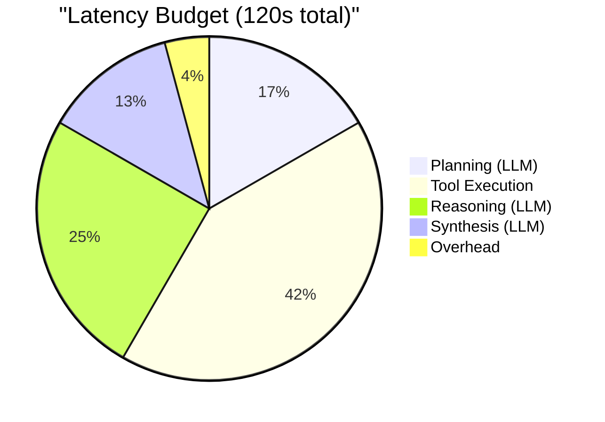

# Observability and Tracing

Observability for agentic systems is fundamentally a cost optimization problem. Full tracing -- every prompt, completion, tool call, and reasoning step -- at 10K requests/day generates roughly 200GB of trace data per month and costs $500+/month in storage alone. You are trading observability dollars for debugging speed. The question is not "should we trace" but "what is worth tracing and at what resolution?"

---

## Why Agent Observability Is Different

Traditional APM (Application Performance Monitoring) tracks request latency, error rates, and throughput. Agent observability must additionally track:

- **Reasoning quality** -- did the agent make good decisions?
- **Token economics** -- how many tokens were consumed and at what cost?
- **Tool effectiveness** -- which tools were called, and did they return useful results?
- **Multi-step causality** -- what chain of reasoning led to the final output?
- **Non-determinism** -- why did the same input produce a different output this time?

---

## Observability Architecture



---

## LLM Tracing

LLM-specific tracing captures the full prompt-completion lifecycle: what was sent to the model, what came back, how long it took, and how much it cost.

### Key Platforms

| Platform | Self-Hosted | Cloud | Open Source | Key Strength |
|----------|-----------|-------|-------------|-------------|
| **LangSmith** | No | Yes | No | Deep LangChain integration |
| **Langfuse** | Yes | Yes | Yes | Open source, self-hostable |
| **Arize Phoenix** | Yes | Yes | Yes | Evaluation and embeddings analysis |
| **OpenLLMetry** | Yes | No | Yes | OpenTelemetry-native |
| **Helicone** | No | Yes | Partial | Cost tracking focus |

### Instrumenting LLM Calls

```python
class InstrumentedLLMClient:
    async def generate(self, prompt, model="gpt-4o", **kwargs):
        with tracer.start_as_current_span("llm.generate") as span:
            span.set_attribute("llm.model", model)
            start = time.monotonic()
            try:
                response = await self.client.complete(prompt=prompt, model=model, **kwargs)
                # Record: tokens, duration, cost on the span
                span.set_attribute("llm.total_tokens", response.usage.total_tokens)
                span.set_attribute("llm.cost_usd", compute_cost(model, response.usage))
                await self.cost_tracker.record(model, response.usage)
                return response.text
            except Exception as e:
                span.set_status(StatusCode.ERROR, str(e))
                raise
```

---

## Distributed Tracing with OpenTelemetry

OpenTelemetry (OTel) provides a vendor-neutral standard for distributed tracing. For agentic systems, each agent step becomes a span within a trace.

### Trace Structure for an Agent



### Agent-Specific Span Attributes

```python
AGENT_SPAN_ATTRIBUTES = {
    # Identity:    agent.name, agent.version, agent.session_id
    # Step:        agent.step.number, agent.step.type (planning|reasoning|tool|synthesis)
    # LLM:         llm.model, llm.prompt_tokens, llm.completion_tokens, llm.total_cost_usd
    # Performance: agent.total_steps, agent.total_tool_calls, agent.total_tokens, agent.total_cost_usd
}
```

### Setting Up OpenTelemetry

```python
def setup_tracing(service_name, otlp_endpoint):
    provider = TracerProvider(resource=Resource({"service.name": service_name}))
    provider.add_span_processor(BatchSpanProcessor(
        OTLPSpanExporter(endpoint=otlp_endpoint)))
    trace.set_tracer_provider(provider)
    return trace.get_tracer(service_name)

# Initialize once at startup
tracer = setup_tracing("agent-service", "http://otel-collector:4317")
```

---

## Intelligent Trace Sampling

Head-based sampling (decide at request start whether to trace) is simple but blind -- it cannot know if a trace will be interesting until it completes. Tail-based sampling (decide after the trace completes) can prioritize interesting traces but requires buffering all traces temporarily. The following algorithm combines both approaches: sample a baseline of normal traffic while guaranteeing full capture of anomalous traces.

```python
import random
from dataclasses import dataclass, field
from typing import Protocol


class CompletedTrace(Protocol):
    """Protocol describing the attributes available on a completed trace."""
    has_error: bool
    duration_ms: float
    latency_p90: float
    latency_p99: float
    total_cost_usd: float
    step_count: int
    used_fallback: bool
    has_user_feedback: bool
    tool_combination_rarity: float  # 0.0 = common, 1.0 = never seen before


class ImportanceWeightedSampler:
    """Decides which completed traces to retain based on importance signals.

    Head-based sampling (decide at request start) is simple but blind -- it can't
    know if a trace will be interesting until it's complete. Tail-based sampling
    (decide after the trace completes) can prioritize interesting traces, but
    requires buffering all traces temporarily.

    This sampler buffers traces for a short window, scores their importance,
    and retains the most valuable ones within a storage budget.
    """

    def __init__(
        self,
        base_sample_rate: float = 0.1,
        max_daily_traces: int = 5000,
        buffer_seconds: int = 10,
    ):
        self.base_rate = base_sample_rate
        self.max_daily = max_daily_traces
        self.buffer_seconds = buffer_seconds
        self.daily_count = 0
        self.buffer: list[CompletedTrace] = []

    def score_trace(self, trace: CompletedTrace) -> float:
        """Score a completed trace's importance. Higher = more worth keeping.

        Scoring signals:
        - Errors are always interesting (score 1.0)
        - Slow traces reveal performance bottlenecks (score based on percentile)
        - Expensive traces reveal cost optimization opportunities
        - High step count may indicate confused agent loops
        - User-reported issues get maximum priority
        """
        score = 0.0

        # Error traces: always keep
        if trace.has_error:
            score = max(score, 1.0)

        # Latency outliers: keep traces above P90
        if trace.duration_ms > trace.latency_p90:
            # Scale from 0.7 (just above P90) to 1.0 (at P99+)
            percentile_position = min(
                1.0,
                (trace.duration_ms - trace.latency_p90)
                / (trace.latency_p99 - trace.latency_p90 + 1),
            )
            score = max(score, 0.7 + 0.3 * percentile_position)

        # Cost outliers: keep expensive traces
        if trace.total_cost_usd > 0.10:
            score = max(score, 0.8)
        if trace.total_cost_usd > 0.50:
            score = max(score, 1.0)

        # High step count: possible loop or confusion
        if trace.step_count > 10:
            score = max(score, 0.6)

        # Fallback/degradation triggered
        if trace.used_fallback:
            score = max(score, 0.7)

        # User feedback exists (thumbs up/down)
        if trace.has_user_feedback:
            score = max(score, 0.9)

        # New or rare tool combinations (novelty detection)
        if trace.tool_combination_rarity > 0.95:
            score = max(score, 0.5)

        return score

    def should_retain(self, trace: CompletedTrace) -> bool:
        """Decide whether to retain a trace in long-term storage."""
        importance = self.score_trace(trace)

        # Always retain high-importance traces
        if importance >= 0.8:
            self.daily_count += 1
            return True

        # For medium-importance, retain based on daily budget
        if importance >= 0.4:
            if self.daily_count < self.max_daily * 0.7:  # reserve 30% for high-importance
                self.daily_count += 1
                return True

        # For low-importance, use base sample rate
        if random.random() < self.base_rate:
            if self.daily_count < self.max_daily:
                self.daily_count += 1
                return True

        return False
```

The **70/30 budget split** (70% for medium-importance, 30% reserved for high-importance) prevents a flood of medium-importance traces from consuming the budget early in the day, leaving no room for high-importance traces later. Without this reservation, a morning traffic spike could exhaust the daily budget by noon.

The **tool combination rarity** signal catches novel agent behaviors that may not be errors but are worth investigating. If an agent uses a tool combination that appears in less than 5% of historical traces, it might be discovering a new workflow -- or it might be confused. Either way, it is worth keeping.

---

## Cost Tracking

LLM costs can spike unexpectedly. A runaway agent loop, an unoptimized prompt, or a sudden traffic increase can burn through budgets in minutes.

### Cost Tracking System

```python
# CostRecord: session_id, user_id, model, prompt_tokens, completion_tokens, cost_usd, timestamp

class CostTracker:
    async def record(self, session_id, user_id, model, prompt_tokens, completion_tokens):
        cost = compute_cost(model, prompt_tokens, completion_tokens)
        await self.store.append(CostRecord(session_id, user_id, model, cost))
        # Enforce budgets at session, user, and global level
        await self._check_session_budget(session_id)   # raises BudgetExceededError
        await self._check_user_budget(user_id)
        await self._check_global_budget()
```

### Cost Dashboard Metrics

| Metric | Granularity | Alert Threshold |
|--------|------------|-----------------|
| Cost per request | Per session | > $0.50 per request |
| Daily cost | Per user, per org | > daily budget |
| Cost per model | Aggregate | Unusual spike |
| Tokens per step | Per agent step | > 4000 tokens per step |
| Cost efficiency | Output quality / cost | Below baseline |

---

## Latency Budgets

Define how long each component of an agent request is allowed to take. This prevents any single component from consuming the entire timeout.

### Budget Allocation



### Implementation

```python
class LatencyBudget:
    # total_budget_ms, allocations per component, actuals per component

    def allocate(self, component, fraction):
        self.allocations[component] = self.total_budget * fraction

    def remaining(self, component):
        return max(0, self.allocations.get(component, 0) - self.actuals.get(component, 0))

    def record(self, component, duration_ms):
        self.actuals[component] = self.actuals.get(component, 0) + duration_ms
        if self.actuals[component] > self.allocations.get(component, float('inf')):
            logger.warning(f"'{component}' exceeded budget")

    @property
    def total_remaining(self):
        return max(0, self.total_budget - elapsed_ms())
```

---

## Metrics to Monitor

### Tier 1: Must-Have (Alert on Anomalies)

| Metric | Description | Alert Condition |
|--------|-------------|-----------------|
| `agent.request.error_rate` | Percentage of requests that fail | > 5% over 5 minutes |
| `agent.request.latency_p99` | 99th percentile end-to-end latency | > 60s |
| `agent.llm.rate_limit_count` | Number of 429 responses | > 10 per minute |
| `agent.cost.hourly_usd` | Hourly LLM spend | > 2x rolling average |
| `agent.dlq.depth` | Number of tasks in dead-letter queue | > 0 (any DLQ entry) |

### Tier 2: Operational (Dashboard)

| Metric | Description |
|--------|-------------|
| `agent.steps_per_request` | Average number of agent steps per request |
| `agent.tokens_per_request` | Total tokens consumed per request |
| `agent.tool.call_count` | Number of tool calls by tool name |
| `agent.tool.error_rate` | Error rate by tool name |
| `agent.fallback.triggered_count` | Number of fallback activations |
| `agent.circuit_breaker.state` | Current state of each circuit breaker |

### Tier 3: Quality (Weekly Review)

| Metric | Description |
|--------|-------------|
| `agent.response.user_rating` | User satisfaction score |
| `agent.response.groundedness` | Factual accuracy of responses |
| `agent.hallucination.detected_count` | Number of detected hallucinations |
| `agent.tool.relevance_score` | How often selected tools were actually used |

---

## Alerting Strategies

### Alert Hierarchy

```python
class AlertManager:
    async def evaluate_alerts(self, metrics):
        if metrics["error_rate_5m"] > 0.20:
            await self.page(severity="critical", title="Error rate > 20%")
        elif metrics["error_rate_5m"] > 0.05:
            await self.notify_slack(title="Error rate > 5%")

        if metrics["hourly_cost_usd"] > self.budget_threshold * 2:
            await self.page(severity="critical", title="Cost spike")
            await self.reduce_worker_count(factor=0.5)  # auto-mitigate

        if metrics["dlq_depth"] > 0:
            await self.notify_slack(title=f"DLQ has {metrics['dlq_depth']} entries")
```

:::warning
Alert fatigue kills observability. Start with a small set of high-signal alerts (error rate, cost spikes, DLQ depth). Add more only when you have a clear action for each alert. An alert without a runbook is noise.
:::

---

## Debugging Agent Failures

### The Agent Debugging Workflow

1. **Find the trace** -- use the session ID or request ID to locate the trace in your trace UI
2. **Identify the failing span** -- which step failed? LLM call? Tool execution? Validation?
3. **Inspect the prompt** -- was the LLM given correct context? Was the tool schema included?
4. **Check the LLM output** -- did the model hallucinate? Return malformed JSON? Refuse the request?
5. **Review tool results** -- did the tool return an error? Was the result what the agent expected?
6. **Compare with successful runs** -- find a similar successful request and diff the traces

### Structured Logging for Agents

```python
class ObservableAgentLoop:
    async def run_step(self, step_number, context):
        log = structlog.get_logger().bind(
            session_id=context["session_id"], step=step_number, agent=self.name)
        log.info("agent.step.start")
        try:
            action = await self.llm.generate(context["prompt"])
            log.info("agent.step.llm_complete", tokens=action.total_tokens)
            if action.type == "tool_call":
                result = await self.tool_executor.execute(action.tool_name, action.parameters)
                log.info("agent.step.tool_result", tool=action.tool_name,
                         success=not result.get("error"))
        except Exception as e:
            log.error("agent.step.error", error_type=type(e).__name__, exc_info=True)
            raise
```

---

## Observability Tradeoffs

Every observability decision in an agentic system involves a concrete tradeoff between cost, debuggability, privacy, and operational complexity. The following are the real design decisions engineers face when building an observability stack for agents.

### 1. Full Capture vs Sampling

Recording every prompt-completion pair gives perfect debuggability but at massive storage cost. At 10K daily agent requests averaging 8K tokens per request, you are storing 80M tokens/day of trace data. Sampling (capture 10% of traces) cuts cost 10x but means you will miss 90% of edge-case failures.

**The compromise:** head-based sampling for normal traffic (10%) plus tail-based sampling that captures 100% of error traces, slow traces (above P95 latency), and expensive traces (over $0.10 per request). This gives you full visibility into problems while sampling away routine successes.

### 2. Prompt Logging: Full vs Redacted vs Hash-Only

Full prompt logging enables prompt debugging but risks PII exposure and storage bloat. Redacted logging (mask PII patterns) reduces risk but can mask the exact context that caused a bug. Hash-only logging (store a hash of the prompt, not the content) is privacy-safe but useless for debugging.

**Recommendation:** full logging in a PII-safe environment with access controls and 30-day TTL. For HIPAA/GDPR workloads, redacted logging with an option to retrieve full prompts under an audited access flow.

### 3. Real-Time vs Batch Metrics

Real-time metrics (Prometheus scraping every 15s) give fast alerting but add load to the agent workers. Batch metrics (aggregate every 5 minutes from logs) are cheaper but introduce alerting delay. For Tier 1 metrics (error rate, cost spikes), real-time is non-negotiable -- a runaway agent loop can burn through your daily budget in 5 minutes. For Tier 3 metrics (quality scores, hallucination rates), batch is fine.

### 4. Vendor vs Self-Hosted Tracing

LangSmith (managed, $0 up to 5K traces/month, then $400+/month) vs Langfuse (self-hosted, free, requires ops) vs OpenTelemetry (vendor-neutral, requires assembly). LangSmith is fastest to start and best for LangChain shops. Langfuse wins for teams that need data sovereignty or have existing Kubernetes infrastructure. OTel wins if you already have a distributed tracing stack and want agent traces alongside service traces. Most teams start with a vendor and migrate to self-hosted when trace volume exceeds 100K/month and the bill becomes the problem.

### 5. Trace Granularity: Per-Session vs Per-Step

Per-session traces (one trace per user conversation) are cheap but collapse all steps into a single view. Per-step traces (one span per LLM call, tool execution, and decision point) give surgical debugging but generate 10-20 spans per session. At 10K daily sessions, that is 100K-200K spans/day.

**The answer:** per-step for development and staging, per-session with lazy expansion for production. Store the full per-step data but default the UI to session-level views with drill-down.

### Decision Summary

| Decision | Option A | Option B | Recommendation |
|----------|----------|----------|----------------|
| **Capture strategy** | Full capture (100%) | Sampled (10%) | Head-based 10% + tail-based 100% for errors/outliers |
| **Prompt logging** | Full content | Hash-only | Full with PII controls + 30-day TTL; redacted for regulated workloads |
| **Metrics pipeline** | Real-time (15s scrape) | Batch (5min aggregate) | Real-time for Tier 1 (errors, cost); batch for Tier 3 (quality) |
| **Tracing platform** | Vendor (LangSmith) | Self-hosted (Langfuse/OTel) | Vendor to start; migrate self-hosted at 100K+ traces/month |
| **Trace granularity** | Per-session | Per-step | Per-step in dev/staging; per-session with drill-down in production |

---

## Interview Preparation

**Sample question:** "How would you set up observability for an agentic system processing 10,000 requests per day?"

**Strong answer structure:**
1. **Distributed tracing** with OpenTelemetry -- every agent step is a span with LLM-specific attributes (model, tokens, cost)
2. **LLM tracing** with Langfuse or LangSmith -- capture full prompt-completion pairs for quality debugging
3. **Cost tracking** at session, user, and org level -- with budget enforcement and alerts
4. **Structured logging** with session IDs for correlation -- use structlog or equivalent
5. **Metrics pipeline** (Prometheus + Grafana) -- error rate, latency, cost, DLQ depth
6. **Alerting hierarchy** -- critical (page), warning (Slack), informational (dashboard)
7. **Latency budgets** -- allocate time across planning, tool execution, and synthesis
8. **Debugging workflow** -- trace ID lookup, span inspection, prompt/completion review, comparison with successful runs
