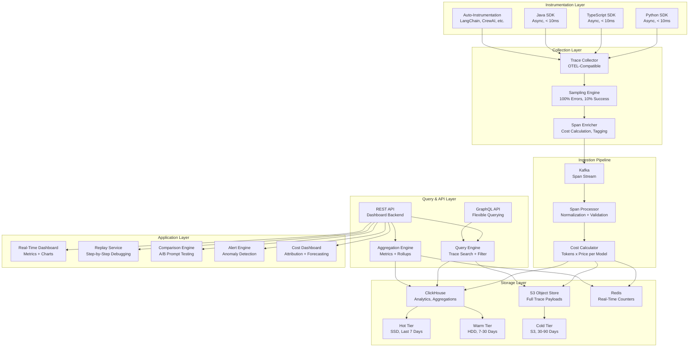
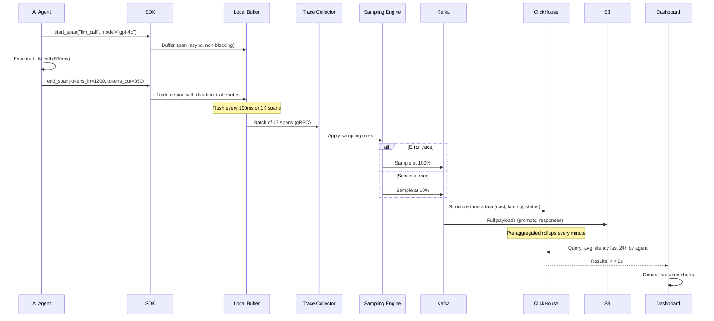
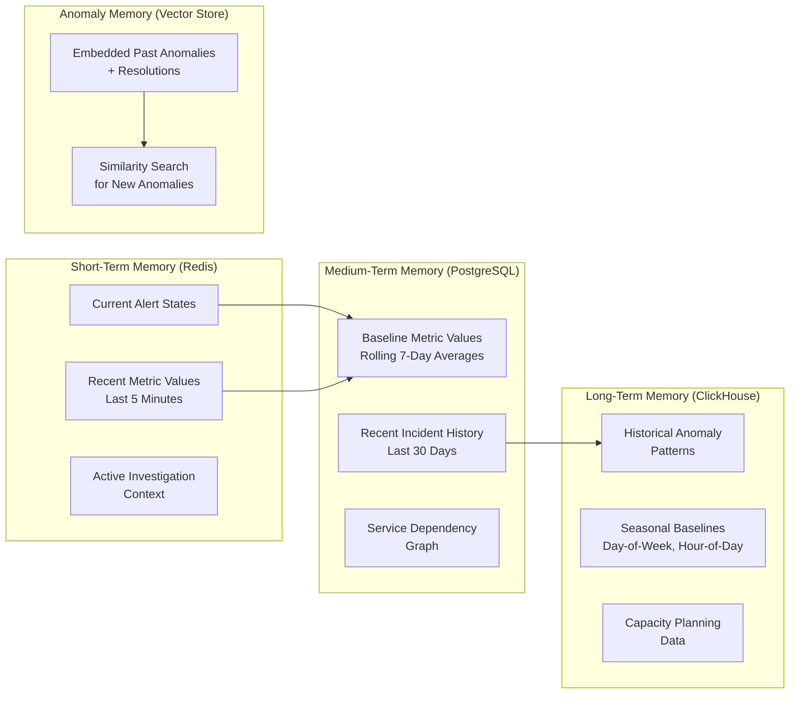
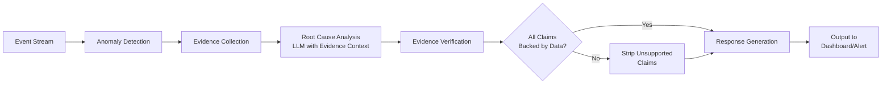

# Agent Observability and Debugging Platform

A purpose-built observability platform for AI agent systems -- "Datadog for AI agents" -- that captures execution traces across LLM calls, tool invocations, and decision points, provides real-time dashboards with cost attribution, supports step-by-step replay for debugging, and enables performance comparison across prompt and model versions, all while handling 1 billion trace spans per day with sub-10ms instrumentation overhead.

---

## Problem Statement

> Design a platform that provides observability, debugging, and optimization tools for AI agent deployments. Think of it as "Datadog for AI agents" -- engineering teams use it to understand, debug, and improve their agent systems.

---

## Clarifying Questions to Ask

1. **Agent diversity** -- Are we supporting a single agent framework (e.g., LangChain) or multiple? Do agents run in Python, TypeScript, Java, or all of the above?
2. **Scale of deployments** -- How many distinct agent deployments are we observing? What is the peak span ingestion rate? Are there burst patterns (e.g., batch agent runs)?
3. **Latency sensitivity** -- How sensitive are the instrumented agents to overhead? Is the 10ms overhead budget per span or per trace?
4. **Retention and compliance** -- How long must trace data be retained? Are there compliance requirements for data stored (PII in agent conversations, PHI in healthcare agents)?
5. **Existing observability stack** -- Do teams already use Datadog, Grafana, or Jaeger? Must we integrate with their existing dashboards or replace them?
6. **Multi-tenancy** -- Is this a platform serving multiple teams or organizations? What is the data isolation requirement?

---

## Requirements

### Functional Requirements

1. Capture and visualize agent execution traces (each step: LLM call, tool call, decision point, memory retrieval)
2. Real-time dashboards for key metrics (latency, cost, success rate, error rate, token usage)
3. Replay any agent interaction step-by-step for debugging
4. Compare agent performance across model versions and prompt changes (A/B testing)
5. Cost attribution per agent, per user, per feature, per conversation
6. Alerting on anomalies (latency spikes, cost overruns, error rate increases)

### Non-Functional Requirements

| Requirement | Target |
|-------------|--------|
| SDK overhead | < 10ms per trace (async, non-blocking) |
| Span ingestion | 1 billion spans/day (~11,500 spans/second) |
| Query latency (dashboard) | < 2 seconds for 24-hour aggregations |
| Trace retention | 90 days minimum |
| Availability | 99.9% for ingestion, 99.5% for query |
| Data isolation | Tenant-level isolation for multi-org deployments |

### Out of Scope

- Infrastructure monitoring (CPU, memory, disk -- that is Datadog's job)
- Model training pipeline observability
- Agent code deployment and CI/CD
- End-user analytics (conversion rates, user satisfaction)

---

## High-Level Architecture



### Architecture Walkthrough

The architecture follows the standard observability pipeline pattern (instrument, collect, store, query, visualize) with agent-specific extensions for cost attribution, LLM-aware replay, and prompt comparison.

The **Instrumentation Layer** provides lightweight SDKs for Python, TypeScript, and Java -- the three most common languages for agent development. The SDKs use async span export with local buffering: spans are written to a lock-free in-memory buffer and flushed to the collector in batches every 100ms or when the buffer reaches 1,000 spans. This ensures the instrumented agent experiences less than 10ms overhead per trace. Auto-instrumentation modules provide zero-code integration with popular agent frameworks (LangChain, CrewAI, AutoGen) by monkey-patching LLM client calls and tool execution entry points.

The **Collection Layer** receives spans via an OpenTelemetry-compatible protocol (OTLP over gRPC). The Sampling Engine applies head-based sampling: at the start of each trace, it decides whether to sample the trace at the full rate or the reduced rate. All error traces (any span with an error status) are sampled at 100%. Success traces are sampled at 10%. This reduces storage and processing volume by roughly 9x while retaining all error data for debugging. The Span Enricher adds computed fields: cost (tokens multiplied by per-model price), normalized latency percentiles, and tenant/agent/user tags.

The **Ingestion Pipeline** uses Kafka as the buffering layer between collection and storage. The Span Processor normalizes span formats (different SDKs may emit slightly different structures), validates required fields, and routes spans to the appropriate storage tier. The Cost Calculator enriches each LLM call span with cost data by looking up the model's per-token price and multiplying by the input and output token counts.

The **Storage Layer** uses a tiered strategy. ClickHouse handles analytical queries over structured span metadata (timestamps, durations, costs, error codes, agent IDs). It is partitioned by time and sharded by tenant for query isolation. S3 stores full trace payloads (including LLM prompts, responses, and tool call arguments/results) as compressed JSON. Redis maintains real-time counters for dashboard metrics (requests per second, error rate, running cost totals). Data ages through three tiers: hot (last 7 days on SSD for fast queries), warm (7-30 days on HDD for cost efficiency), and cold (30-90 days on S3 for compliance retention).

The **Query and API Layer** provides trace search (find traces by agent, user, time range, error type, cost range, latency percentile), aggregation (compute metrics over time windows), and flexible querying via both REST and GraphQL APIs.

The **Application Layer** builds on the query APIs to deliver the user-facing features: real-time dashboards, step-by-step trace replay, A/B comparison between prompt versions, anomaly-based alerting, and cost attribution dashboards.

---

## Component Design

### 1. SDK (Instrumentation)

The SDK is the most critical component from a user adoption perspective -- if it adds perceptible overhead or is difficult to integrate, teams will not adopt the platform. The SDK design follows three principles: (a) async-only span export (never block the agent's execution), (b) graceful degradation (if the collector is unreachable, buffer locally and retry; if the buffer is full, drop spans silently rather than crashing the agent), and (c) minimal API surface (three functions: start_span, end_span, add_attribute).

Each span carries: trace_id, span_id, parent_span_id, operation_name, start_time, duration, status (ok/error), and a map of attributes. For LLM calls, attributes include: model, provider, input_tokens, output_tokens, temperature, and the full prompt/response (configurable -- can be disabled for PII-sensitive deployments). For tool calls: tool_name, arguments, result, and latency.

### 2. Sampling Engine

At 1 billion spans per day, storing everything is cost-prohibitive ($15K+/month in storage alone). The sampling engine reduces volume while preserving debugging utility. It uses head-based sampling: when a new trace begins, the sampler generates a random number. If the trace is sampled, all spans in that trace are collected (keeping traces complete). The sampling rate is configurable per agent and per error status: 100% for errors, 10% for successes. This means every error trace is complete and debuggable, while success traces are statistically representative. The effective storage volume is approximately 190 million spans per day (100M error spans assuming a 10% error rate, plus 90M sampled success spans).

### 3. Cost Attribution Engine

Cost attribution is a differentiating feature for an AI agent observability platform. Traditional observability tools track infrastructure cost (compute, storage), but the dominant cost in agent systems is LLM API spend. The Cost Calculator maintains a price table mapping each model (GPT-4o, Claude 3.5 Sonnet, Llama 3, etc.) to its per-token input and output prices. For each LLM call span, it computes: cost = (input_tokens * input_price) + (output_tokens * output_price).

Costs aggregate up through the span hierarchy: a single agent conversation cost is the sum of all LLM call costs within that trace. These costs then aggregate by agent, by user, by feature, and by time period. The Cost Dashboard shows breakdowns such as: "The Research Agent spent $4,200 last week, 62% on GPT-4o for synthesis and 38% on GPT-4o-mini for search queries." This enables teams to identify cost optimization opportunities (e.g., routing more queries to cheaper models).

### 4. Replay Service

The Replay Service reconstructs an agent interaction from its trace spans for step-by-step debugging. It fetches the complete trace from storage (structured metadata from ClickHouse, full payloads from S3), orders spans by timestamp, and presents a timeline view showing: each LLM call (with the full prompt sent and response received), each tool call (with arguments and results), each decision point (which branch the agent took and why), and timing information (how long each step took, where the latency bottlenecks were).

For debugging, the replay can be "forked" at any step: the user can modify a prompt or tool response and re-run the agent from that point to test hypotheses about what went wrong. This is not live execution -- it replays the recorded data with the modification applied, showing how the agent would have behaved differently.

### 5. Comparison Engine

The Comparison Engine supports A/B testing of prompt changes and model swaps. When a team changes a prompt or switches models, they can run an evaluation suite (a fixed set of test inputs) against both the old and new versions. The engine collects traces from both runs and produces a comparison report: latency distribution (p50, p95, p99), cost per conversation, success rate, error rate, and output quality metrics (if the team defines custom evaluators).

The engine also supports automatic comparison: when a prompt changes (detected via hash comparison on the prompt template), it automatically triggers the evaluation suite and surfaces the before/after comparison on the dashboard. This prevents prompt regressions from reaching production undetected.

---

## Data Flow



### Happy Path Walkthrough

An AI agent processing a customer query starts an LLM call. The SDK creates a span with the trace ID, span ID, model name, and start timestamp. The span is written to the in-memory buffer in under 1ms (non-blocking). The agent proceeds with the LLM call (800ms). When the call completes, the SDK updates the span with duration, token counts, and the response (if payload capture is enabled).

Every 100ms, the buffer flushes accumulated spans to the Trace Collector via gRPC. The Collector receives 47 spans in this batch, runs them through the Sampling Engine (this trace is a success trace, and the random sample includes it in the 10%), enriches each LLM span with cost data ($0.0054 for this call based on GPT-4o pricing), and publishes to Kafka.

The Span Processor reads from Kafka, writes structured metadata to ClickHouse (partitioned by day, ordered by timestamp), and writes full payloads to S3 (keyed by trace_id/span_id). Redis counters are incremented for real-time dashboard metrics.

The dashboard queries ClickHouse for the last 24 hours of data: average latency by agent, cost by model, error rate trend. ClickHouse returns results in under 2 seconds using pre-aggregated materialized views. The dashboard renders real-time charts with 1-minute granularity.

### Error/Edge Case Path

If the Trace Collector is unreachable (network partition, collector crash), the SDK's local buffer accumulates spans up to a configurable limit (default 10,000 spans). If the buffer fills, the SDK drops the oldest spans silently -- it never blocks the agent or throws an exception. When connectivity is restored, buffered spans are flushed with their original timestamps, ensuring the trace timeline is accurate despite the delivery delay. The collector detects out-of-order spans and reorders them by timestamp before processing.

If ClickHouse experiences high query load (e.g., a team runs an expensive analytical query), the query engine implements query timeouts and resource limits per tenant to prevent a single query from degrading dashboard performance for all users. Long-running analytical queries are routed to read replicas to protect the primary ingestion path.

---

## Scaling Considerations

At 1 billion spans per day, the ingestion pipeline must sustain approximately 11,500 spans per second steady-state with burst capacity up to 50,000 spans per second (batch agent runs, traffic spikes).

**Kafka** handles the ingestion buffering with a 3-broker cluster, 12 partitions per topic, and 7-day retention. Each partition handles approximately 1,000 spans/second, well within Kafka's capabilities.

**ClickHouse** is the analytical query engine. It stores approximately 190 million spans per day (after sampling). With 90 days retention, the hot + warm tiers hold approximately 17 billion rows. ClickHouse handles this scale comfortably with time-based partitioning (one partition per day), sharding by tenant (4 shards), and materialized views for common aggregations (per-minute rollups of latency, cost, and error rate by agent). Queries over 24-hour windows execute in under 2 seconds.

**S3** stores full trace payloads at approximately 2KB per span (compressed). At 190 million spans per day, this is approximately 380GB per day, or 34TB over 90 days. At S3 Standard pricing, storage costs approximately $780/month. Cold-tier data (30-90 days) moves to S3 Infrequent Access, reducing cost by 40%.

**Tenant sharding** ensures that a high-volume tenant cannot degrade query performance for other tenants. Each tenant's data is isolated within ClickHouse shards, and query resource limits are enforced per tenant.

---

## Cost Analysis

| Component | Specification | Monthly Cost |
|-----------|--------------|-------------|
| Kafka cluster (3 brokers, m5.xlarge) | Ingestion buffering | $1,200 |
| ClickHouse cluster (4 shards, 2 replicas each) | Analytics queries | $4,800 |
| S3 storage (34TB, mixed tiers) | Trace payload storage | $780 |
| Redis cluster (3 nodes) | Real-time counters | $600 |
| Collector fleet (8 instances, c5.xlarge) | Span collection | $1,600 |
| API/Dashboard servers (4 instances) | User-facing services | $800 |
| **Total monthly infrastructure** | | **$9,780** |
| **Cost per million spans (stored)** | | **$1.71** |

At a SaaS pricing of $3-5 per million spans, the platform achieves healthy margins while remaining competitive with general-purpose observability tools that are not optimized for AI agent workloads.

---

## Data Layer Deep Dive

### Database Selection Justification

| Database | Use Case | Why This Choice | Alternative Considered | Why Not the Alternative |
|----------|----------|----------------|----------------------|------------------------|
| **ClickHouse** | Logs, metrics, alert event history | Columnar storage for fast aggregation queries (99th percentile latency, error rate trends). Excellent compression ratio (10-20x for log data). MergeTree engine for time-series data with automatic TTL-based data eviction. Handles both structured queries and text search via `hasToken()` and `hasSubstring()` functions. | Elasticsearch | Good for full-text log search but expensive at scale -- ClickHouse handles both structured queries and text search with lower resource usage. Elasticsearch requires significantly more memory and CPU for equivalent query throughput on structured aggregations. |
| **PostgreSQL** | Metadata, alert rules, dashboard definitions, user configuration | ACID guarantees for alert rule management -- cannot lose an alert configuration mid-update. Rich querying for rule evaluation. Schema enforcement for configuration integrity. Built-in audit trail via triggers. | Config files (YAML/JSON) | No audit trail, hard to manage across multiple instances, no version history, no transactional updates. A misconfigured YAML file can silently break alerting for all tenants. |
| **Redis** | Real-time alert state, metric caching, live dashboard feeds | Sub-millisecond reads for current alert states. Sorted sets for top-N computations (top 10 slowest endpoints). Pub/sub for real-time dashboard updates without polling. Atomic counter increments for rate metrics. | Polling ClickHouse directly | Too slow for real-time dashboards (ClickHouse query latency is 100ms-2s, not sub-ms). Adds unnecessary query load to the analytical cluster. Cannot support push-based dashboard updates. |
| **Object Storage (S3)** | Long-term log and trace archival | Cold storage for compliance -- retain logs for 90 days in hot storage, 1 year in cold. Glacier lifecycle policies for cost optimization. Virtually unlimited capacity at $0.023/GB/month (Standard) or $0.004/GB/month (Glacier). | Keeping everything in ClickHouse | Prohibitively expensive at petabyte scale. ClickHouse storage on SSDs costs 10-50x more per GB than S3. Older data is rarely queried and does not justify fast storage. |

### Schema Design

#### Logs Table (ClickHouse -- MergeTree)

```sql
CREATE TABLE logs
(
    timestamp       DateTime64(3),
    service_name    LowCardinality(String),
    log_level       LowCardinality(String),
    trace_id        String,
    span_id         String,
    message         String,
    attributes      Map(String, String),

    -- Materialized columns for fast filtering
    INDEX idx_trace_id trace_id TYPE bloom_filter(0.01) GRANULARITY 1,
    INDEX idx_message message TYPE tokenbf_v1(32768, 3, 0) GRANULARITY 1
)
ENGINE = MergeTree()
PARTITION BY toYYYYMMDD(timestamp)
ORDER BY (service_name, timestamp)
TTL timestamp + INTERVAL 90 DAY
SETTINGS index_granularity = 8192;
```

**Design choices:**
- `ORDER BY (service_name, timestamp)` -- the most common query pattern is "show me logs for service X in the last N hours." Ordering by service name first clusters all logs for a service together, then ordering by timestamp within that cluster enables fast time-range scans. ClickHouse can skip entire granules that do not match the service name.
- `LowCardinality(String)` for `service_name` and `log_level` -- these columns have few distinct values (tens of services, five log levels). LowCardinality uses dictionary encoding, reducing storage by 5-10x and speeding up filtering.
- `PARTITION BY toYYYYMMDD(timestamp)` -- one partition per day. TTL drops entire partitions when they expire (90 days), which is an O(1) metadata operation rather than row-by-row deletion.
- `bloom_filter` index on `trace_id` -- enables fast point lookups for trace correlation ("show me all logs for trace abc-123") without adding trace_id to the ORDER BY key.
- `tokenbf_v1` index on `message` -- token-level bloom filter that accelerates `hasToken()` text search queries without the overhead of a full inverted index.
- `Map(String, String)` for `attributes` -- flexible key-value storage for arbitrary metadata (user_id, request_id, deployment_version) without schema migration when new attributes are added.

#### Metrics Table (ClickHouse -- AggregatingMergeTree)

```sql
CREATE TABLE metrics
(
    timestamp       DateTime,
    metric_name     LowCardinality(String),
    service_name    LowCardinality(String),
    value           Float64,
    labels          Map(String, String)
)
ENGINE = MergeTree()
PARTITION BY toYYYYMMDD(timestamp)
ORDER BY (metric_name, service_name, timestamp)
TTL timestamp + INTERVAL 90 DAY;

-- Pre-aggregated rollups via materialized view
CREATE MATERIALIZED VIEW metrics_1m_rollup
ENGINE = AggregatingMergeTree()
PARTITION BY toYYYYMMDD(timestamp_bucket)
ORDER BY (metric_name, service_name, timestamp_bucket)
AS SELECT
    toStartOfMinute(timestamp)    AS timestamp_bucket,
    metric_name,
    service_name,
    avgState(value)               AS avg_value,
    maxState(value)               AS max_value,
    minState(value)               AS min_value,
    quantileState(0.95)(value)    AS p95_value,
    quantileState(0.99)(value)    AS p99_value,
    countState()                  AS sample_count
FROM metrics
GROUP BY metric_name, service_name, timestamp_bucket;
```

**Design choices:**
- `AggregatingMergeTree` for the materialized view -- stores partially aggregated states (not final values) so that ClickHouse can merge states from multiple parts efficiently. This enables 1-minute rollups to be queried over arbitrary time ranges with sub-second latency.
- The raw `metrics` table uses `MergeTree` (not AggregatingMergeTree) to preserve individual data points for ad-hoc analysis and precise percentile calculations over short time windows.
- Materialized view runs automatically on insert -- every metric written to the raw table is simultaneously aggregated into the rollup. No separate batch job required.

#### Alert Rules Table (PostgreSQL)

```sql
CREATE TABLE alert_rules (
    id                    UUID PRIMARY KEY DEFAULT gen_random_uuid(),
    name                  VARCHAR(255) NOT NULL,
    query                 TEXT NOT NULL,
    condition             VARCHAR(20) NOT NULL CHECK (condition IN ('above', 'below', 'anomaly')),
    threshold             DOUBLE PRECISION NOT NULL,
    window_minutes        INTEGER NOT NULL CHECK (window_minutes BETWEEN 1 AND 1440),
    severity              VARCHAR(20) NOT NULL CHECK (severity IN ('critical', 'warning', 'info')),
    notification_channels JSONB NOT NULL DEFAULT '[]',
    is_active             BOOLEAN NOT NULL DEFAULT true,
    last_triggered_at     TIMESTAMPTZ,
    created_by            VARCHAR(255) NOT NULL,
    created_at            TIMESTAMPTZ NOT NULL DEFAULT now(),
    updated_at            TIMESTAMPTZ NOT NULL DEFAULT now()
);

CREATE INDEX idx_alert_rules_active ON alert_rules (is_active) WHERE is_active = true;
CREATE INDEX idx_alert_rules_severity ON alert_rules (severity);
```

**Design choices:**
- PostgreSQL for ACID guarantees -- an alert rule update (change threshold + change notification channel) must be atomic. A partial update could cause alerts to fire to the wrong channel or with the wrong threshold.
- `CHECK` constraints on `condition` and `severity` -- enforce valid values at the database level, not just the application level. Prevents invalid alert rules from being created via API bugs.
- `JSONB` for `notification_channels` -- allows flexible channel configuration (Slack, PagerDuty, email, webhooks) without a separate join table. Supports queries like "find all rules that notify the #incidents Slack channel."
- Partial index on `is_active = true` -- the alert evaluation engine only queries active rules. The partial index keeps the index small and fast even as deactivated rules accumulate.

#### Alert Events Table (ClickHouse)

```sql
CREATE TABLE alert_events
(
    timestamp          DateTime64(3),
    rule_id            UUID,
    rule_name          LowCardinality(String),
    severity           LowCardinality(String),
    value              Float64,
    threshold          Float64,
    status             LowCardinality(String),  -- 'firing' or 'resolved'
    notification_sent  Bool,

    INDEX idx_rule_id rule_id TYPE bloom_filter(0.01) GRANULARITY 1
)
ENGINE = MergeTree()
PARTITION BY toYYYYMMDD(timestamp)
ORDER BY (severity, timestamp)
TTL timestamp + INTERVAL 365 DAY;
```

**Design choices:**
- ClickHouse (not PostgreSQL) for alert events -- alert history is append-only, high-volume, and queried analytically ("how many critical alerts fired last month?", "what is the mean time to resolution?"). ClickHouse handles this pattern orders of magnitude better than PostgreSQL.
- `ORDER BY (severity, timestamp)` -- the most common query is "show me recent critical alerts." Ordering by severity first clusters critical alerts together for fast retrieval.
- 365-day TTL -- alert history is kept longer than raw logs (90 days) because it is lower volume and valuable for trend analysis and compliance audits.

### Key Queries

#### 1. Log Search with Full-Text Filtering

```sql
-- Find error logs containing "timeout" for the payment service in the last hour
SELECT
    timestamp,
    log_level,
    trace_id,
    message,
    attributes['request_id'] AS request_id
FROM logs
WHERE service_name = 'payment-service'
  AND timestamp >= now() - INTERVAL 1 HOUR
  AND log_level = 'ERROR'
  AND hasToken(message, 'timeout')
ORDER BY timestamp DESC
LIMIT 100;
```

`hasToken()` splits the message into tokens by non-alphanumeric characters and checks for an exact token match. It leverages the `tokenbf_v1` bloom filter index to skip granules that definitely do not contain the token, making it significantly faster than `LIKE '%timeout%'` which must scan every row.

#### 2. Percentile Latency Calculation

```sql
-- Calculate p50, p95, p99 latency for each service over the last 24 hours
SELECT
    service_name,
    quantile(0.50)(value) AS p50_ms,
    quantile(0.95)(value) AS p95_ms,
    quantile(0.99)(value) AS p99_ms,
    count()               AS request_count
FROM metrics
WHERE metric_name = 'http_request_duration_ms'
  AND timestamp >= now() - INTERVAL 24 HOUR
GROUP BY service_name
ORDER BY p99_ms DESC;
```

ClickHouse's `quantile()` function uses the t-digest algorithm for approximate percentile calculation with high accuracy (< 1% error at the extremes). For pre-aggregated data from the materialized view, `quantileMerge()` combines the stored quantile states.

#### 3. Error Rate Trend

```sql
-- Error rate per 5-minute bucket for the last 6 hours
SELECT
    toStartOfFiveMinutes(timestamp) AS bucket,
    service_name,
    countIf(log_level = 'ERROR') AS error_count,
    count()                       AS total_count,
    round(countIf(log_level = 'ERROR') / count() * 100, 2) AS error_rate_pct
FROM logs
WHERE timestamp >= now() - INTERVAL 6 HOUR
GROUP BY bucket, service_name
ORDER BY bucket ASC, error_rate_pct DESC;
```

Time-bucketed aggregation using `toStartOfFiveMinutes()` aligns all timestamps to 5-minute boundaries for consistent trend visualization. The `countIf()` function avoids a separate subquery or CASE statement, keeping the query plan simple and fast.

#### 4. Alert Rule Evaluation

```sql
-- Check if the average error rate over the last 5 minutes exceeds the threshold
-- This query is run by the alert evaluation engine every 60 seconds for each active rule
SELECT
    avg(value) AS current_value
FROM metrics
WHERE metric_name = 'http_error_rate'
  AND service_name = 'payment-service'
  AND timestamp >= now() - INTERVAL 5 MINUTE;

-- The alert engine compares current_value against the rule's threshold:
-- If condition = 'above' AND current_value > threshold -> fire alert
-- If condition = 'below' AND current_value < threshold -> fire alert
-- If condition = 'anomaly' -> compare against rolling 7-day baseline +/- 3 std deviations
```

The alert evaluation engine runs on a 60-second loop, querying ClickHouse for each active rule's metric over its configured time window. For the `anomaly` condition, it computes the rolling baseline from the `metrics_1m_rollup` materialized view (7-day average and standard deviation for the same hour-of-day) and fires when the current value deviates by more than 3 standard deviations.

---

## Agent Memory Architecture

The observability agent operates in an event-driven mode with anomaly context -- unlike conversational agents, it does not maintain dialogue history. Instead, it processes continuous streams of metrics, logs, and traces to detect anomalies and investigate their root causes.

### Memory Tiers



**Short-term memory (Redis)** holds the data needed for the current evaluation cycle. Current alert states (firing, resolved, silenced) are stored as Redis hashes keyed by rule ID. Recent metric values for the last 5 minutes are stored in sorted sets keyed by metric name and service, enabling the alert engine to evaluate rules without querying ClickHouse for small time windows. Active investigation context -- when the agent is analyzing an anomaly, the intermediate findings (which services are affected, what metrics have been checked, what hypotheses have been tested) are stored in Redis with a 30-minute TTL.

**Medium-term memory (PostgreSQL)** holds reference data that changes slowly. Rolling 7-day baseline averages for each metric and service are recomputed hourly by a background job that queries the ClickHouse rollup table. Recent incident history (last 30 days of alert events with their resolutions) is stored here so the agent can reference "the last time this alert fired, the root cause was X." The service dependency graph (which services call which other services, derived from trace data) is materialized as an adjacency list table, updated daily.

**Long-term memory (ClickHouse)** holds the historical data used for trend analysis and capacity planning. Historical anomaly patterns -- all past anomalies with their timestamps, affected services, root causes, and resolutions -- are queried when the agent needs to understand seasonal patterns ("does this metric always spike on Monday mornings?"). Seasonal baselines use same-day-of-week and same-hour-of-day averages computed from 90 days of history, providing more accurate thresholds than simple rolling averages.

**Anomaly memory (Vector Store)** is the key differentiator from rule-based alerting. Past anomalies and their resolutions are embedded as vectors (using the anomaly description, affected metrics, root cause, and resolution steps as input text) and stored in a vector store. When a new anomaly occurs, the agent embeds the current anomaly description and retrieves the top-K most similar past anomalies. This enables the agent to suggest root causes based on historical patterns: "A similar anomaly occurred on March 15 when a database connection pool was exhausted -- the symptoms (rising latency + connection timeout errors) match the current anomaly."

### Context Window Strategy for Anomaly Investigation

The agent assembles a context window of approximately 5,000 tokens when investigating an anomaly:

| Context Component | Token Budget | Content |
|-------------------|-------------|---------|
| System instructions | ~400 | Role definition, output format, evidence requirements |
| Current anomaly description | ~300 | Which metric, which service, how far from baseline, when it started |
| Affected service's recent metrics | ~800 | Last 30 minutes of key metrics (latency, error rate, throughput, CPU, memory) |
| Service dependency graph | ~500 | Upstream and downstream services, recent health status of each |
| Similar past incidents | ~1,500 | Top 3 similar past anomalies with their root causes and resolutions |
| Recent deployments | ~500 | Deployments to the affected service or its dependencies in the last 2 hours |
| Response budget | ~1,000 | Reserved for the agent's analysis, root cause hypothesis, and recommended actions |

This fixed budget ensures consistent inference latency and cost regardless of anomaly complexity. If additional context is needed (e.g., more past incidents), the agent issues a follow-up retrieval with a refined query rather than expanding the context window.

---

## Hallucination Mitigation

Observability agents face unique hallucination risks because fabricated or inaccurate outputs can trigger unnecessary incident responses, page on-call engineers at 3 AM, or mask real issues behind false diagnoses. The mitigation strategy treats every agent output as a claim that must be backed by evidence.

### Mitigation Strategies

**Root cause fabrication** -- the agent suggests a root cause not supported by the data. This is the highest-risk hallucination because it sends engineering teams investigating the wrong direction during an outage. **Mitigation:** every root cause claim must reference specific metrics or log entries with precise values and timestamps. The agent cites the evidence: "Service X error rate increased from 0.1% to 5.2% at 14:32 UTC (metric: `http_error_rate`, source: ClickHouse query `metrics WHERE service_name='X' AND timestamp >= '2024-01-15 14:30:00'`)" -- never "the service seems to be having issues." Claims without cited evidence are stripped from the output by a post-processing validation step.

**Metric hallucination** -- the agent reports metric values that do not match the data. For example, it claims "latency is 450ms" when the actual p99 is 1,200ms. **Mitigation:** all metric values are computed by querying ClickHouse, never generated by the LLM. The LLM receives pre-computed metrics in its context and interprets and explains them. The response generation pipeline includes a verification step that cross-references any numeric values in the agent's output against the metrics provided in the context. Mismatched values are flagged and corrected.

**False correlation** -- the agent claims causation when there is only temporal correlation. For example, "Service A's latency spike caused Service B's errors" when both were independently affected by a network issue. **Mitigation:** the agent explicitly distinguishes between "correlated" (happened at the same time) and "caused by" (there is a known dependency path). Only claim causation when the service dependency graph shows a direct relationship between the two services AND the timing is consistent with the dependency direction (upstream failure precedes downstream failure). When the dependency graph does not show a direct link, the agent reports: "Service A and Service B both experienced degradation starting at 14:30 UTC. No direct dependency exists between them -- investigate a shared dependency (database, network, cloud provider)."

**Alert fatigue generation** -- the agent creates too many low-value alerts during cascading failures or noisy periods. **Mitigation:** alert deduplication groups related alerts by time window (alerts within 5 minutes of each other for the same service are grouped) and by service dependency (if Service A depends on Service B, and both are alerting, the root cause alert on Service B suppresses the symptom alert on Service A). Alerts are silenced during known maintenance windows configured in the alert_rules table. A minimum severity threshold prevents the agent from creating info-level alerts during an active incident when only critical and warning alerts are actionable.

**Stale baseline comparisons** -- the agent compares current metrics against outdated baselines. For example, using a pre-Black Friday traffic baseline during Black Friday, causing every metric to appear anomalous. **Mitigation:** seasonal baseline detection uses same-day-of-week and same-hour-of-day baselines from the last 4 weeks, not just simple rolling averages. The baseline selection logic checks for known events (holidays, sales events, maintenance windows) stored in a calendar table and adjusts accordingly. When a baseline shift is detected (sustained metric change for more than 1 hour that is not an anomaly), the system flags the shift and prompts an operator to confirm the new baseline.

### Hallucination Prevention Pipeline



The pipeline ensures that no LLM-generated claim reaches the end user without passing through the Evidence Verification stage. The Evidence Verification step checks: (1) every metric value cited in the analysis matches a value from the pre-computed context, (2) every causal claim references a path in the service dependency graph, (3) every temporal claim ("started at 14:32") matches the anomaly detection timestamp within a 1-minute tolerance.

---

## Production Issues and Fixes

### Issue 1: Alert Storm from Cascading Failures

**Symptom:** A database outage causes 15 dependent services to fail simultaneously. The alert engine fires 47 separate alerts within 2 minutes, overwhelming the on-call engineer's phone with notifications.

**Root cause:** Each service has independent alert rules that evaluate in isolation -- the alert engine has no concept of dependency relationships between services.

**Fix:** Alert correlation engine that groups alerts by time window and service dependency. When multiple alerts fire within a 5-minute window, the engine traverses the service dependency graph to identify the root service (the one with no upstream alerts also firing). All related alerts are grouped into a single incident with the root cause alert as the primary and dependent alerts listed as symptoms. The on-call engineer receives one notification: "Database X is down (affecting 15 downstream services)" instead of 47 separate pages.

### Issue 2: ClickHouse Query Timeouts on Large Time Ranges

**Symptom:** Dashboard queries for 30-day trends timeout after 30 seconds. Users report that the "Monthly Overview" dashboard is unusable.

**Root cause:** Dashboard queries hit the raw metrics table, scanning billions of rows for a 30-day aggregation. The query planner cannot optimize this because the data volume exceeds available memory for in-flight processing.

**Fix:** Route dashboard queries through pre-aggregated materialized views. The `metrics_1m_rollup` view reduces 30 days of raw data (billions of rows) to approximately 43,200 rows per metric per service (one row per minute). For 30-day dashboards, add a `metrics_1h_rollup` view that further aggregates to hourly granularity. Limit ad-hoc query time ranges to 7 days against raw data; longer ranges must use rollup tables. Add a query rewrite layer that automatically redirects queries to the appropriate rollup level based on the requested time range.

### Issue 3: Agent Misidentifies Root Cause During Multi-Service Outages

**Symptom:** During a complex outage involving 4 services, the agent confidently identifies Service C as the root cause. The engineering team spends 45 minutes investigating Service C before discovering the actual root cause is a configuration change in Service A.

**Root cause:** The agent committed to a single root cause hypothesis based on which service had the most dramatic metric change, not which service failed first or which is upstream of the others.

**Fix:** Present multiple hypotheses ranked by evidence strength rather than committing to a single root cause. The agent now outputs a ranked list: "Hypothesis 1 (confidence: high): Service A configuration change at 14:28 UTC -- 3 minutes before downstream failures began. Hypothesis 2 (confidence: medium): Service C connection pool exhaustion -- may be a symptom of Service A's failure." The ranking considers: temporal ordering (which service degraded first), dependency direction (upstream failures rank higher), and evidence specificity (a known deployment event ranks higher than a metric anomaly without explanation).

### Issue 4: Log Ingestion Lag Causing Delayed Alerting

**Symptom:** Alerts fire 5-10 minutes after the actual incident begins. Post-incident analysis shows that logs arrived in ClickHouse with a 5-minute delay during peak traffic.

**Root cause:** Kafka consumer lag increases during traffic spikes because the Span Processor cannot keep up with the ingestion rate. The alert evaluation engine queries ClickHouse, which only contains delayed data.

**Fix:** Monitor ingestion lag as its own metric. Add a dedicated metric `ingestion_lag_seconds` computed as the difference between the current wall-clock time and the newest timestamp in ClickHouse for each service. Alert when `ingestion_lag_seconds` exceeds 60 seconds. For the alert evaluation engine, switch latency-sensitive alerts (critical severity) to evaluate against Redis counters (updated in real-time by the Collector, before Kafka) rather than ClickHouse. Redis-based evaluation adds no more than 2 seconds of detection latency.

### Issue 5: Dashboard Query Load Affecting Alert Evaluation

**Symptom:** During business hours, when many users are viewing dashboards, alert evaluation latency increases from 2 seconds to 15 seconds. Some alert evaluation cycles are skipped entirely because the previous cycle has not completed.

**Root cause:** Dashboard queries and alert evaluation queries compete for the same ClickHouse resources (CPU, memory, I/O). A heavy dashboard query (e.g., 30-day cost attribution breakdown) consumes resources that delay alert queries.

**Fix:** Separate ClickHouse clusters for dashboards and alerting. The alerting cluster is a smaller, dedicated 2-shard cluster that receives the same data via Kafka (dual-write) but serves only alert evaluation queries. The dashboard cluster is the larger 4-shard cluster that handles all user-facing queries. This provides resource isolation -- a runaway dashboard query cannot affect alert latency. The alerting cluster is sized for the known, predictable workload of evaluating N alert rules every 60 seconds, while the dashboard cluster is sized for variable user-driven query patterns.

### Issue 6: Agent Recommends Scaling a Service Already at Maximum

**Symptom:** During a latency spike, the agent recommends "scale payment-service from 8 to 16 replicas." The service is already at 16 replicas (the auto-scaler hit the maximum), and the recommendation wastes investigation time.

**Root cause:** The agent's context did not include current resource allocation or cloud provider limits. It generated a plausible-sounding recommendation without verifying feasibility.

**Fix:** Include current resource allocation in the anomaly investigation context: current replica count, auto-scaler min/max configuration, current CPU/memory utilization per replica, and cloud provider quota limits. Before generating a scaling recommendation, the agent checks: (1) is the service already at its auto-scaler maximum? (2) does the cloud provider quota allow additional instances? (3) is the bottleneck actually CPU/memory (which scaling fixes) or something else (database connections, external API rate limits) that scaling will not help? The agent now responds: "payment-service is already at maximum replicas (16/16). CPU utilization is 45% per replica -- scaling is unlikely to help. The bottleneck appears to be database connection pool saturation (active connections: 95/100)."

### Issue 7: False Anomaly Detection After Service Migration (Baseline Shift)

**Symptom:** After migrating the search service from an older runtime to a new one, the agent fires continuous "latency anomaly" alerts for 3 days. The new runtime has 20% lower baseline latency, which the agent interprets as an anomaly compared to the old baseline.

**Root cause:** The agent's baseline is a rolling 7-day average that still includes data from the old runtime. The lower latency consistently falls outside the expected range (old baseline minus 3 standard deviations), triggering the anomaly detector.

**Fix:** Detect baseline shifts -- sustained metric changes lasting more than 1 hour that move in a consistent direction. When a shift is detected, the system: (1) checks for recent deployment or migration events in the service's event log, (2) if a deployment is found, automatically flags the baseline as "shifting" and suppresses anomaly alerts for that metric for 4 hours while the new baseline establishes, (3) after 4 hours, recomputes the baseline using only post-migration data. If no deployment event is found (organic baseline shift), the system creates a notification for an operator to review and confirm the new baseline before suppressing anomaly detection.

---

## Trade-offs & Alternatives

| Decision | Rationale | Alternative | Why Not |
|----------|-----------|-------------|---------|
| OpenTelemetry-compatible protocol | Teams can integrate with existing OTEL-instrumented services; avoid vendor lock-in; leverage the OTEL ecosystem for auto-instrumentation | Proprietary trace format | Forces teams to adopt a new standard; cannot leverage existing OTEL integrations; higher adoption friction |
| Head-based sampling (100% errors, 10% success) | Preserves complete error traces for debugging while reducing storage 9x; statistically representative success data | Tail-based sampling (decide after trace completes) | Tail-based sampling requires buffering entire traces before deciding, adding latency and memory pressure; at 1B spans/day this is prohibitively expensive |
| ClickHouse for analytics | Column-oriented storage is ideal for analytical queries (aggregations, filtering over billions of rows); 10-100x faster than row-oriented databases for these workloads | Elasticsearch or PostgreSQL | Elasticsearch is optimized for text search, not analytical aggregations; PostgreSQL cannot handle 190M rows/day with sub-2-second query performance |
| Tiered storage (hot/warm/cold) | Balances query performance with cost; recent data is fast, historical data is cheap | Keep everything on hot storage | 90 days on SSD would cost 5x more; queries on data older than 7 days are infrequent and can tolerate higher latency |
| Async SDK with local buffering | Eliminates performance impact on instrumented agents; graceful degradation when collector is unreachable | Synchronous span export | Adds 50-200ms per span to agent latency (network round-trip); unacceptable for latency-sensitive agents; collector downtime would crash agents |
| Cost attribution as first-class feature | LLM API spend is the dominant cost in agent systems (often 10x infrastructure cost); traditional observability tools do not track this | Add cost tracking as a plugin or extension | Cost is too central to agent operations to be an afterthought; per-span cost enrichment must happen in the ingestion pipeline for real-time dashboards |

---

## Interview Tips

:::tip How to Present This (35 minutes)
- **Minutes 1-5**: Clarify requirements. Ask about scale (spans per day), agent diversity (frameworks, languages), existing observability stack, and retention requirements. Frame the problem: "This is Datadog, but the 'application' is an AI agent, and the key metrics are LLM cost and token usage, not just latency and errors."
- **Minutes 5-15**: Draw the pipeline architecture: SDK to Collector to Kafka to ClickHouse/S3. Emphasize two key design decisions: (1) the async SDK with sub-10ms overhead (agents cannot tolerate slow instrumentation), and (2) the sampling strategy (100% errors, 10% success) that makes 1B spans/day economically feasible.
- **Minutes 15-25**: Deep dive into three differentiating features: Cost Attribution (how per-span cost enrichment works, how costs aggregate up to per-agent and per-user views), Replay Service (step-by-step debugging with full prompt/response reconstruction), and Comparison Engine (automated A/B testing when prompts change). These distinguish this platform from generic observability tools.
- **Minutes 25-30**: Discuss scaling (ClickHouse partitioning and sharding, tiered storage economics, Kafka sizing for ingestion), the cost model (per-million-span pricing vs. infrastructure cost), and multi-tenant isolation (sharding, query resource limits).
- **Minutes 30-35**: Handle follow-ups. Common questions: "How do you handle PII in traces?" (configurable payload scrubbing in the SDK, PII detection in the Span Processor, tenant-level policies for what gets stored), "How do you detect prompt regressions?" (Comparison Engine auto-triggers evaluation suites on prompt hash changes), "What about real-time alerting?" (Redis counters feed anomaly detection; alerts fire on latency spikes, cost overruns, and error rate increases via PagerDuty/Slack integration).
:::
