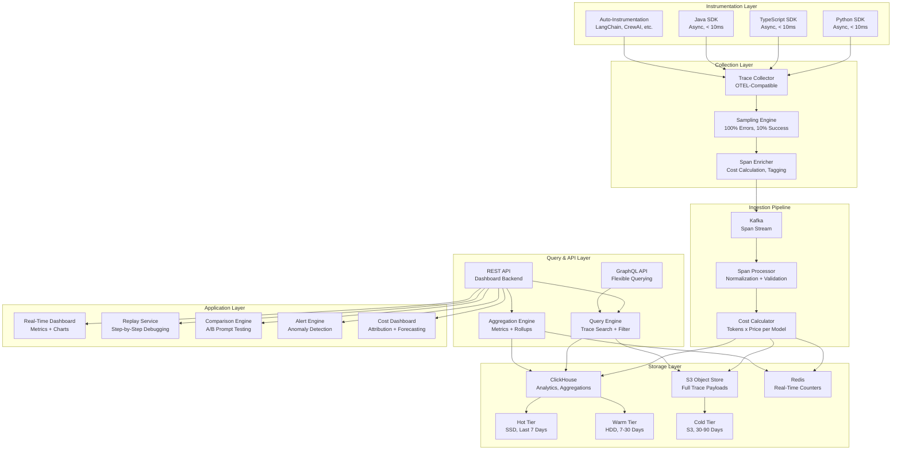
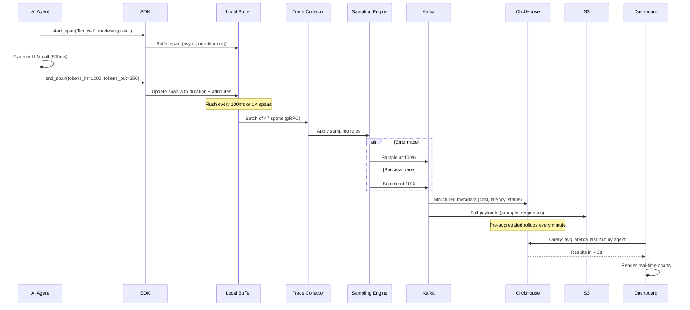

# Agent Observability and Debugging Platform

A purpose-built observability platform for AI agent systems -- "Datadog for AI agents" -- that captures execution traces across LLM calls, tool invocations, and decision points, provides real-time dashboards with cost attribution, supports step-by-step replay for debugging, and enables performance comparison across prompt and model versions, all while handling 1 billion trace spans per day with sub-10ms instrumentation overhead.

---

## Problem Statement

> Design a platform that provides observability, debugging, and optimization tools for AI agent deployments. Think of it as "Datadog for AI agents" -- engineering teams use it to understand, debug, and improve their agent systems.

---

## Clarifying Questions to Ask

1. **Agent diversity** -- Are we supporting a single agent framework (e.g., LangChain) or multiple? Do agents run in Python, TypeScript, Java, or all of the above?
2. **Scale of deployments** -- How many distinct agent deployments are we observing? What is the peak span ingestion rate? Are there burst patterns (e.g., batch agent runs)?
3. **Latency sensitivity** -- How sensitive are the instrumented agents to overhead? Is the 10ms overhead budget per span or per trace?
4. **Retention and compliance** -- How long must trace data be retained? Are there compliance requirements for data stored (PII in agent conversations, PHI in healthcare agents)?
5. **Existing observability stack** -- Do teams already use Datadog, Grafana, or Jaeger? Must we integrate with their existing dashboards or replace them?
6. **Multi-tenancy** -- Is this a platform serving multiple teams or organizations? What is the data isolation requirement?

---

## Requirements

### Functional Requirements

1. Capture and visualize agent execution traces (each step: LLM call, tool call, decision point, memory retrieval)
2. Real-time dashboards for key metrics (latency, cost, success rate, error rate, token usage)
3. Replay any agent interaction step-by-step for debugging
4. Compare agent performance across model versions and prompt changes (A/B testing)
5. Cost attribution per agent, per user, per feature, per conversation
6. Alerting on anomalies (latency spikes, cost overruns, error rate increases)

### Non-Functional Requirements

| Requirement | Target |
|-------------|--------|
| SDK overhead | < 10ms per trace (async, non-blocking) |
| Span ingestion | 1 billion spans/day (~11,500 spans/second) |
| Query latency (dashboard) | < 2 seconds for 24-hour aggregations |
| Trace retention | 90 days minimum |
| Availability | 99.9% for ingestion, 99.5% for query |
| Data isolation | Tenant-level isolation for multi-org deployments |

### Out of Scope

- Infrastructure monitoring (CPU, memory, disk -- that is Datadog's job)
- Model training pipeline observability
- Agent code deployment and CI/CD
- End-user analytics (conversion rates, user satisfaction)

---

## High-Level Architecture

### Architecture Walkthrough

The architecture follows the standard observability pipeline pattern (instrument, collect, store, query, visualize) with agent-specific extensions for cost attribution, LLM-aware replay, and prompt comparison.

The **Instrumentation Layer** provides lightweight SDKs for Python, TypeScript, and Java -- the three most common languages for agent development. The SDKs use async span export with local buffering: spans are written to a lock-free in-memory buffer and flushed to the collector in batches every 100ms or when the buffer reaches 1,000 spans. This ensures the instrumented agent experiences less than 10ms overhead per trace. Auto-instrumentation modules provide zero-code integration with popular agent frameworks (LangChain, CrewAI, AutoGen) by monkey-patching LLM client calls and tool execution entry points.

The **Collection Layer** receives spans via an OpenTelemetry-compatible protocol (OTLP over gRPC). The Sampling Engine applies head-based sampling: at the start of each trace, it decides whether to sample the trace at the full rate or the reduced rate. All error traces (any span with an error status) are sampled at 100%. Success traces are sampled at 10%. This reduces storage and processing volume by roughly 9x while retaining all error data for debugging. The Span Enricher adds computed fields: cost (tokens multiplied by per-model price), normalized latency percentiles, and tenant/agent/user tags.

The **Ingestion Pipeline** uses Kafka as the buffering layer between collection and storage. The Span Processor normalizes span formats (different SDKs may emit slightly different structures), validates required fields, and routes spans to the appropriate storage tier. The Cost Calculator enriches each LLM call span with cost data by looking up the model's per-token price and multiplying by the input and output token counts.

The **Storage Layer** uses a tiered strategy. ClickHouse handles analytical queries over structured span metadata (timestamps, durations, costs, error codes, agent IDs). It is partitioned by time and sharded by tenant for query isolation. S3 stores full trace payloads (including LLM prompts, responses, and tool call arguments/results) as compressed JSON. Redis maintains real-time counters for dashboard metrics (requests per second, error rate, running cost totals). Data ages through three tiers: hot (last 7 days on SSD for fast queries), warm (7-30 days on HDD for cost efficiency), and cold (30-90 days on S3 for compliance retention).

The **Query and API Layer** provides trace search (find traces by agent, user, time range, error type, cost range, latency percentile), aggregation (compute metrics over time windows), and flexible querying via both REST and GraphQL APIs.

The **Application Layer** builds on the query APIs to deliver the user-facing features: real-time dashboards, step-by-step trace replay, A/B comparison between prompt versions, anomaly-based alerting, and cost attribution dashboards.

---

## Component Design

### 1. SDK (Instrumentation)

The SDK is the most critical component from a user adoption perspective -- if it adds perceptible overhead or is difficult to integrate, teams will not adopt the platform. The SDK design follows three principles: (a) async-only span export (never block the agent's execution), (b) graceful degradation (if the collector is unreachable, buffer locally and retry; if the buffer is full, drop spans silently rather than crashing the agent), and (c) minimal API surface (three functions: start_span, end_span, add_attribute).

Each span carries: trace_id, span_id, parent_span_id, operation_name, start_time, duration, status (ok/error), and a map of attributes. For LLM calls, attributes include: model, provider, input_tokens, output_tokens, temperature, and the full prompt/response (configurable -- can be disabled for PII-sensitive deployments). For tool calls: tool_name, arguments, result, and latency.

### 2. Sampling Engine

At 1 billion spans per day, storing everything is cost-prohibitive ($15K+/month in storage alone). The sampling engine reduces volume while preserving debugging utility. It uses head-based sampling: when a new trace begins, the sampler generates a random number. If the trace is sampled, all spans in that trace are collected (keeping traces complete). The sampling rate is configurable per agent and per error status: 100% for errors, 10% for successes. This means every error trace is complete and debuggable, while success traces are statistically representative. The effective storage volume is approximately 190 million spans per day (100M error spans assuming a 10% error rate, plus 90M sampled success spans).

### 3. Cost Attribution Engine

Cost attribution is a differentiating feature for an AI agent observability platform. Traditional observability tools track infrastructure cost (compute, storage), but the dominant cost in agent systems is LLM API spend. The Cost Calculator maintains a price table mapping each model (GPT-4o, Claude 3.5 Sonnet, Llama 3, etc.) to its per-token input and output prices. For each LLM call span, it computes: cost = (input_tokens * input_price) + (output_tokens * output_price).

Costs aggregate up through the span hierarchy: a single agent conversation cost is the sum of all LLM call costs within that trace. These costs then aggregate by agent, by user, by feature, and by time period. The Cost Dashboard shows breakdowns such as: "The Research Agent spent $4,200 last week, 62% on GPT-4o for synthesis and 38% on GPT-4o-mini for search queries." This enables teams to identify cost optimization opportunities (e.g., routing more queries to cheaper models).

### 4. Replay Service

The Replay Service reconstructs an agent interaction from its trace spans for step-by-step debugging. It fetches the complete trace from storage (structured metadata from ClickHouse, full payloads from S3), orders spans by timestamp, and presents a timeline view showing: each LLM call (with the full prompt sent and response received), each tool call (with arguments and results), each decision point (which branch the agent took and why), and timing information (how long each step took, where the latency bottlenecks were).

For debugging, the replay can be "forked" at any step: the user can modify a prompt or tool response and re-run the agent from that point to test hypotheses about what went wrong. This is not live execution -- it replays the recorded data with the modification applied, showing how the agent would have behaved differently.

### 5. Comparison Engine

The Comparison Engine supports A/B testing of prompt changes and model swaps. When a team changes a prompt or switches models, they can run an evaluation suite (a fixed set of test inputs) against both the old and new versions. The engine collects traces from both runs and produces a comparison report: latency distribution (p50, p95, p99), cost per conversation, success rate, error rate, and output quality metrics (if the team defines custom evaluators).

The engine also supports automatic comparison: when a prompt changes (detected via hash comparison on the prompt template), it automatically triggers the evaluation suite and surfaces the before/after comparison on the dashboard. This prevents prompt regressions from reaching production undetected.

---

## Data Flow

### Happy Path Walkthrough

An AI agent processing a customer query starts an LLM call. The SDK creates a span with the trace ID, span ID, model name, and start timestamp. The span is written to the in-memory buffer in under 1ms (non-blocking). The agent proceeds with the LLM call (800ms). When the call completes, the SDK updates the span with duration, token counts, and the response (if payload capture is enabled).

Every 100ms, the buffer flushes accumulated spans to the Trace Collector via gRPC. The Collector receives 47 spans in this batch, runs them through the Sampling Engine (this trace is a success trace, and the random sample includes it in the 10%), enriches each LLM span with cost data ($0.0054 for this call based on GPT-4o pricing), and publishes to Kafka.

The Span Processor reads from Kafka, writes structured metadata to ClickHouse (partitioned by day, ordered by timestamp), and writes full payloads to S3 (keyed by trace_id/span_id). Redis counters are incremented for real-time dashboard metrics.

The dashboard queries ClickHouse for the last 24 hours of data: average latency by agent, cost by model, error rate trend. ClickHouse returns results in under 2 seconds using pre-aggregated materialized views. The dashboard renders real-time charts with 1-minute granularity.

### Error/Edge Case Path

If the Trace Collector is unreachable (network partition, collector crash), the SDK's local buffer accumulates spans up to a configurable limit (default 10,000 spans). If the buffer fills, the SDK drops the oldest spans silently -- it never blocks the agent or throws an exception. When connectivity is restored, buffered spans are flushed with their original timestamps, ensuring the trace timeline is accurate despite the delivery delay. The collector detects out-of-order spans and reorders them by timestamp before processing.

If ClickHouse experiences high query load (e.g., a team runs an expensive analytical query), the query engine implements query timeouts and resource limits per tenant to prevent a single query from degrading dashboard performance for all users. Long-running analytical queries are routed to read replicas to protect the primary ingestion path.

---

## Scaling Considerations

At 1 billion spans per day, the ingestion pipeline must sustain approximately 11,500 spans per second steady-state with burst capacity up to 50,000 spans per second (batch agent runs, traffic spikes).

**Kafka** handles the ingestion buffering with a 3-broker cluster, 12 partitions per topic, and 7-day retention. Each partition handles approximately 1,000 spans/second, well within Kafka's capabilities.

**ClickHouse** is the analytical query engine. It stores approximately 190 million spans per day (after sampling). With 90 days retention, the hot + warm tiers hold approximately 17 billion rows. ClickHouse handles this scale comfortably with time-based partitioning (one partition per day), sharding by tenant (4 shards), and materialized views for common aggregations (per-minute rollups of latency, cost, and error rate by agent). Queries over 24-hour windows execute in under 2 seconds.

**S3** stores full trace payloads at approximately 2KB per span (compressed). At 190 million spans per day, this is approximately 380GB per day, or 34TB over 90 days. At S3 Standard pricing, storage costs approximately $780/month. Cold-tier data (30-90 days) moves to S3 Infrequent Access, reducing cost by 40%.

**Tenant sharding** ensures that a high-volume tenant cannot degrade query performance for other tenants. Each tenant's data is isolated within ClickHouse shards, and query resource limits are enforced per tenant.

---

## Cost Analysis

| Component | Specification | Monthly Cost |
|-----------|--------------|-------------|
| Kafka cluster (3 brokers, m5.xlarge) | Ingestion buffering | $1,200 |
| ClickHouse cluster (4 shards, 2 replicas each) | Analytics queries | $4,800 |
| S3 storage (34TB, mixed tiers) | Trace payload storage | $780 |
| Redis cluster (3 nodes) | Real-time counters | $600 |
| Collector fleet (8 instances, c5.xlarge) | Span collection | $1,600 |
| API/Dashboard servers (4 instances) | User-facing services | $800 |
| **Total monthly infrastructure** | | **$9,780** |
| **Cost per million spans (stored)** | | **$1.71** |

At a SaaS pricing of $3-5 per million spans, the platform achieves healthy margins while remaining competitive with general-purpose observability tools that are not optimized for AI agent workloads.

---

## Trade-offs & Alternatives

| Decision | Rationale | Alternative | Why Not |
|----------|-----------|-------------|---------|
| OpenTelemetry-compatible protocol | Teams can integrate with existing OTEL-instrumented services; avoid vendor lock-in; leverage the OTEL ecosystem for auto-instrumentation | Proprietary trace format | Forces teams to adopt a new standard; cannot leverage existing OTEL integrations; higher adoption friction |
| Head-based sampling (100% errors, 10% success) | Preserves complete error traces for debugging while reducing storage 9x; statistically representative success data | Tail-based sampling (decide after trace completes) | Tail-based sampling requires buffering entire traces before deciding, adding latency and memory pressure; at 1B spans/day this is prohibitively expensive |
| ClickHouse for analytics | Column-oriented storage is ideal for analytical queries (aggregations, filtering over billions of rows); 10-100x faster than row-oriented databases for these workloads | Elasticsearch or PostgreSQL | Elasticsearch is optimized for text search, not analytical aggregations; PostgreSQL cannot handle 190M rows/day with sub-2-second query performance |
| Tiered storage (hot/warm/cold) | Balances query performance with cost; recent data is fast, historical data is cheap | Keep everything on hot storage | 90 days on SSD would cost 5x more; queries on data older than 7 days are infrequent and can tolerate higher latency |
| Async SDK with local buffering | Eliminates performance impact on instrumented agents; graceful degradation when collector is unreachable | Synchronous span export | Adds 50-200ms per span to agent latency (network round-trip); unacceptable for latency-sensitive agents; collector downtime would crash agents |
| Cost attribution as first-class feature | LLM API spend is the dominant cost in agent systems (often 10x infrastructure cost); traditional observability tools do not track this | Add cost tracking as a plugin or extension | Cost is too central to agent operations to be an afterthought; per-span cost enrichment must happen in the ingestion pipeline for real-time dashboards |

---

## Interview Tips

:::tip How to Present This (35 minutes)
- **Minutes 1-5**: Clarify requirements. Ask about scale (spans per day), agent diversity (frameworks, languages), existing observability stack, and retention requirements. Frame the problem: "This is Datadog, but the 'application' is an AI agent, and the key metrics are LLM cost and token usage, not just latency and errors."
- **Minutes 5-15**: Draw the pipeline architecture: SDK to Collector to Kafka to ClickHouse/S3. Emphasize two key design decisions: (1) the async SDK with sub-10ms overhead (agents cannot tolerate slow instrumentation), and (2) the sampling strategy (100% errors, 10% success) that makes 1B spans/day economically feasible.
- **Minutes 15-25**: Deep dive into three differentiating features: Cost Attribution (how per-span cost enrichment works, how costs aggregate up to per-agent and per-user views), Replay Service (step-by-step debugging with full prompt/response reconstruction), and Comparison Engine (automated A/B testing when prompts change). These distinguish this platform from generic observability tools.
- **Minutes 25-30**: Discuss scaling (ClickHouse partitioning and sharding, tiered storage economics, Kafka sizing for ingestion), the cost model (per-million-span pricing vs. infrastructure cost), and multi-tenant isolation (sharding, query resource limits).
- **Minutes 30-35**: Handle follow-ups. Common questions: "How do you handle PII in traces?" (configurable payload scrubbing in the SDK, PII detection in the Span Processor, tenant-level policies for what gets stored), "How do you detect prompt regressions?" (Comparison Engine auto-triggers evaluation suites on prompt hash changes), "What about real-time alerting?" (Redis counters feed anomaly detection; alerts fire on latency spikes, cost overruns, and error rate increases via PagerDuty/Slack integration).
:::
