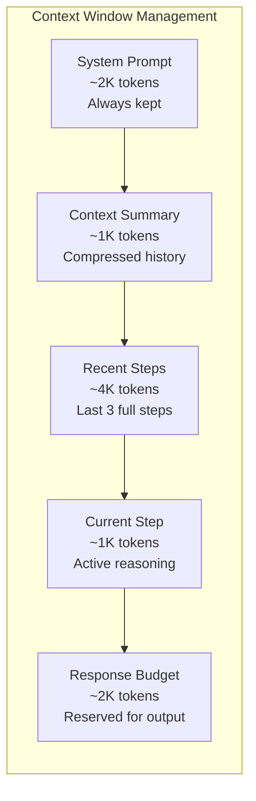
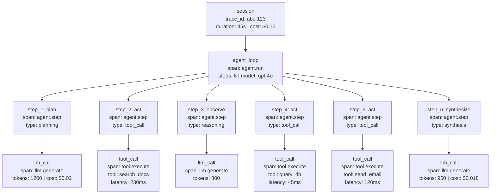
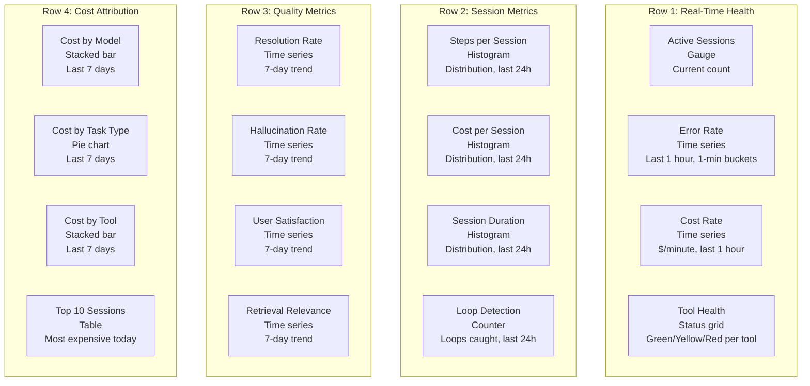
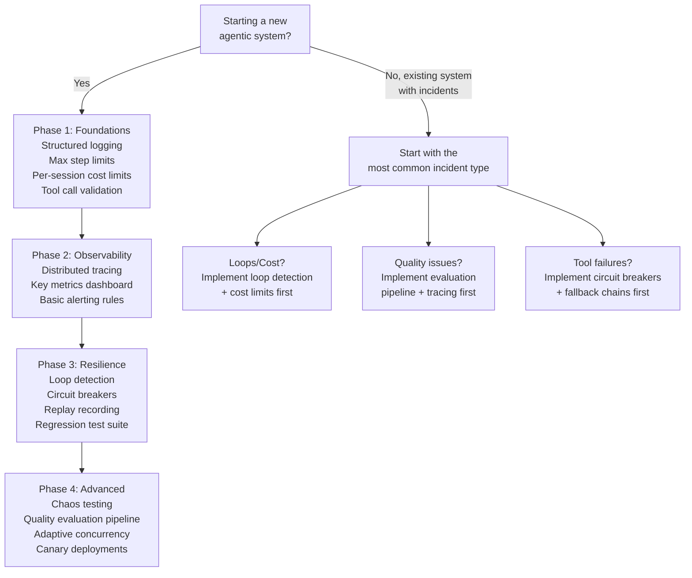

# Production Issues and Debugging

Traditional distributed systems fail in predictable ways: a database goes down, a service returns 5xx, a queue backs up. You get a stack trace, you find the root cause, you fix the code. Agentic AI systems fail in ways that produce no stack trace at all. The agent enters an infinite loop, but every individual step succeeds. The retrieval pipeline returns chunks, but they are from a stale index, so the agent confidently delivers a wrong answer. The LLM provider silently updates the model behind your pinned version string, and your carefully tuned prompts start producing subtly degraded outputs. These are not bugs you find with `grep` in your logs -- they are emergent failures that require purpose-built detection, debugging, and recovery strategies.

This document catalogs the failure modes you will encounter in production agentic systems, provides concrete debugging strategies with code, and includes incident playbooks you can adapt for your own on-call rotations.

---

## 1. Common Failure Modes

### 1.1 Agent Loop Failures

Agent loop failures are the most common class of production incidents in agentic systems. They are also the most expensive, because each wasted step burns LLM tokens.

#### Infinite Loops

The agent keeps calling the same tool or repeating the same reasoning step without making progress toward task completion.

**Causes:**
- Ambiguous or unreachable success criteria in the system prompt
- A tool returning the same error repeatedly, and the agent retrying without changing its approach
- Circular planning: the agent decomposes a task, fails at a subtask, re-plans, and arrives at the same decomposition
- Output parsing failures that consume the error message and regenerate the same malformed output

**Detection:**
- Step counter exceeds a configurable threshold (e.g., 25 steps for a task that normally completes in 5-8)
- Repeated tool calls with identical or near-identical parameters within a sliding window
- Hash-based cycle detection: hash the last N (action, parameters) tuples and detect duplicates

**Fix:**

```python
import hashlib
from collections import deque
from dataclasses import dataclass, field


@dataclass
class LoopDetector:
    """Detects infinite loops by tracking recent agent steps and identifying cycles.

    Uses a sliding window of step hashes. If the same hash appears more than
    `max_repeats` times within the window, the agent is stuck.
    """
    window_size: int = 10
    max_repeats: int = 3
    _history: deque = field(default_factory=lambda: deque(maxlen=10))

    def _hash_step(self, tool_name: str, parameters: dict) -> str:
        content = f"{tool_name}:{sorted(parameters.items())}"
        return hashlib.sha256(content.encode()).hexdigest()[:16]

    def record_and_check(self, tool_name: str, parameters: dict) -> bool:
        """Record a step and return True if a loop is detected."""
        step_hash = self._hash_step(tool_name, parameters)
        self._history.append(step_hash)

        # Count occurrences of this hash in the window
        count = sum(1 for h in self._history if h == step_hash)
        return count >= self.max_repeats

    def get_loop_summary(self) -> str:
        """Return a human-readable summary for forced termination."""
        from collections import Counter
        counts = Counter(self._history)
        repeated = {h: c for h, c in counts.items() if c >= self.max_repeats}
        return f"Loop detected: {len(repeated)} repeated patterns in last {len(self._history)} steps"
```

**Integration into the agent loop:**

```python
async def agent_loop(task: str, max_steps: int = 25):
    loop_detector = LoopDetector(window_size=10, max_repeats=3)
    steps = []

    for step_num in range(max_steps):
        action = await llm_decide_next_action(task, steps)

        if action.type == "finish":
            return action.result

        if loop_detector.record_and_check(action.tool_name, action.parameters):
            logger.warning("Loop detected", extra={
                "session_id": session_id,
                "step": step_num,
                "summary": loop_detector.get_loop_summary(),
            })
            # Force the agent to summarize what it has so far and exit
            return await force_graceful_termination(task, steps)

        result = await execute_tool(action.tool_name, action.parameters)
        steps.append({"action": action, "result": result})

    # Max steps exceeded
    return await force_graceful_termination(task, steps)
```

:::warning
Do not simply kill the agent when a loop is detected. Force a graceful termination that summarizes partial progress. An abrupt termination with no output is worse than a partial answer, because the user has no visibility into what happened.
:::

---

#### Premature Termination

The agent stops before completing the task, returning an incomplete or empty response.

**Causes:**
- Context window overflow: the conversation history exceeds the model's maximum context length, and the API returns a truncated response or an error that the agent interprets as "done"
- Cost budget hit: a per-session cost limit is reached, and the termination handler does not produce a useful summary
- Overly aggressive early-stopping heuristics: a confidence threshold or step budget that is too low for complex tasks
- The model generates a "finish" action prematurely because the task description is ambiguous

**Detection:**
- Task completion rate monitoring: track the percentage of sessions that produce a "complete" result versus "partial" or "error"
- Incomplete output patterns: responses that end mid-sentence, responses that address only the first sub-task, responses with placeholder text
- Context utilization alerts: sessions where token usage approaches the model's context limit

**Fix:**
- Progressive summarization: periodically summarize earlier steps to free context window space
- Budget headroom: set the internal budget trigger at 80% of the hard limit, giving the agent room to produce a summary
- Task complexity estimation: before starting, estimate the expected number of steps and adjust budgets accordingly

```python
class ContextManager:
    """Manages context window usage with progressive summarization."""

    def __init__(self, max_tokens: int, summarize_threshold: float = 0.7):
        self.max_tokens = max_tokens
        self.summarize_threshold = summarize_threshold

    async def maybe_summarize(self, messages: list[dict]) -> list[dict]:
        current_tokens = count_tokens(messages)
        utilization = current_tokens / self.max_tokens

        if utilization < self.summarize_threshold:
            return messages

        # Keep the system prompt and last 3 messages; summarize everything else
        system_prompt = messages[0]
        recent = messages[-3:]
        middle = messages[1:-3]

        summary = await llm_summarize(middle)
        return [system_prompt, {"role": "system", "content": f"Previous context summary: {summary}"}] + recent
```

---

#### Planning Paralysis

The agent spends excessive steps on planning, decomposition, and re-planning without executing any tool calls.

**Causes:**
- Complex tasks that trigger deep recursive decomposition
- Insufficient tool guidance: the agent does not know which tool to use for a sub-task, so it keeps planning around the gap
- High model uncertainty: the model is not confident enough to commit to an action, so it keeps deliberating

**Detection:**
- Ratio of planning steps to action steps: if the agent has taken 8 planning steps and 0 action steps, something is wrong
- Time-in-planning metric: the cumulative time spent in planning spans versus execution spans

**Fix:**
- Planning budget: limit the number of consecutive planning steps before forcing an action
- Forced action injection: after N planning steps, inject a system message like "You have planned enough. Execute your next action now."
- Tool suggestion: if the agent is uncertain about which tool to use, provide a ranked list of candidate tools based on the current sub-task

---

### 1.2 Tool Failures

#### Hallucinated Tool Calls

The agent calls tools that do not exist in the tool registry, or uses parameters that do not match the tool's schema.

**Causes:**
- Tool names that resemble functions the model saw during training (e.g., the agent calls `search_web` when the registered tool is `web_search`)
- Tool schemas dropped from the context window due to truncation
- Model hallucination under high temperature or with vague instructions

**Detection:**
- Tool registry validation: every tool call must be validated against the registry before execution
- Schema mismatch errors: the tool exists, but the parameters do not match the expected schema

**Fix:**

```python
from jsonschema import validate, ValidationError


class StrictToolExecutor:
    """Validates tool calls against the registry before execution.

    Rejects hallucinated tools and malformed parameters with actionable
    error messages that guide the LLM to self-correct.
    """

    def __init__(self, registry: dict):
        self.registry = registry  # {tool_name: {"handler": callable, "schema": dict}}

    async def execute(self, tool_name: str, parameters: dict) -> dict:
        if tool_name not in self.registry:
            available = ", ".join(sorted(self.registry.keys()))
            return {
                "error": f"Tool '{tool_name}' does not exist. Available tools: {available}",
                "error_type": "tool_not_found",
            }

        tool = self.registry[tool_name]
        try:
            validate(instance=parameters, schema=tool["schema"])
        except ValidationError as e:
            return {
                "error": f"Invalid parameters for '{tool_name}': {e.message}",
                "error_type": "schema_validation_error",
                "expected_schema": tool["schema"],
            }

        return await tool["handler"](**parameters)
```

:::tip Interview Angle
When discussing tool call validation, emphasize that returning a structured error message to the LLM (rather than raising an exception) gives the agent a chance to self-correct on the next step. This is a key difference from traditional API design where you would fail fast.
:::

---

#### Silent Tool Failures

The tool returns HTTP 200 with an empty result, wrong data, or a success response that actually represents a failure.

**Causes:**
- Upstream API contract changes: a field is renamed or removed, but the response structure still passes basic validation
- Authorization issues: the API returns an empty result set instead of 403 when the token lacks the right scope
- Pagination not handled: the tool returns only the first page of results, missing critical data on subsequent pages

**Detection:**
- Response schema validation: validate the tool's response against an expected schema, not just the HTTP status code
- Empty result alerting: a tool that returns zero results when the query clearly should have matches
- Result cardinality checks: if a search tool returns exactly 0 or exactly 1 result when historical data shows it should return 5-20, flag it

**Fix:**

```python
@dataclass
class ToolResponseValidator:
    """Validates tool responses beyond HTTP status codes.

    Catches silent failures where the tool returns 200 but the data
    is empty, malformed, or semantically wrong.
    """
    min_result_count: int = 0
    required_fields: list[str] = field(default_factory=list)
    max_staleness_seconds: int | None = None

    def validate(self, response: dict) -> dict:
        errors = []

        # Check for empty results
        if "results" in response and len(response["results"]) < self.min_result_count:
            errors.append(
                f"Expected at least {self.min_result_count} results, got {len(response['results'])}"
            )

        # Check required fields
        for f in self.required_fields:
            if f not in response or response[f] is None:
                errors.append(f"Required field '{f}' is missing or null")

        # Check data freshness
        if self.max_staleness_seconds and "last_updated" in response:
            age = time.time() - response["last_updated"]
            if age > self.max_staleness_seconds:
                errors.append(
                    f"Data is {age:.0f}s old, max allowed is {self.max_staleness_seconds}s"
                )

        if errors:
            return {"error": "; ".join(errors), "error_type": "response_validation_error", "raw_response": response}

        return response
```

---

#### Tool Timeout Cascading

One slow tool call blocks the entire agent loop, causing downstream timeouts and degraded user experience.

**Causes:**
- Upstream API latency spike with no timeout configured on the client side
- Network issues (DNS resolution delays, connection pool exhaustion)
- The tool makes a synchronous call to a service that is itself waiting on another slow dependency

**Detection:**
- Per-tool latency monitoring at p50, p95, and p99
- Timeout alerts: any tool call exceeding its configured timeout
- Agent step duration anomalies: steps that take 10x longer than the historical median

**Fix:**

```python
import asyncio


async def execute_with_timeout(
    tool_name: str,
    parameters: dict,
    handler: callable,
    timeout_seconds: float = 10.0,
    fallback_handler: callable | None = None,
) -> dict:
    """Execute a tool call with a per-tool timeout and optional fallback.

    If the primary handler exceeds the timeout, tries the fallback.
    If no fallback is available, returns a structured timeout error
    that the LLM can reason about.
    """
    try:
        return await asyncio.wait_for(handler(**parameters), timeout=timeout_seconds)
    except asyncio.TimeoutError:
        if fallback_handler:
            try:
                return await asyncio.wait_for(fallback_handler(**parameters), timeout=timeout_seconds)
            except asyncio.TimeoutError:
                pass

        return {
            "error": f"Tool '{tool_name}' timed out after {timeout_seconds}s",
            "error_type": "timeout",
            "suggestion": "Try a simpler query or use an alternative approach",
        }
```

:::info
Per-tool timeouts are non-negotiable in production. A single missing timeout can cause a 30-second agent response to balloon to 5 minutes when an upstream API hangs. Set aggressive defaults (10s) and tune per tool based on historical p99 latency.
:::

---

### 1.3 State and Memory Failures

#### State Corruption

The agent's internal state becomes inconsistent -- the step counter does not match the actual number of steps, the checkpoint contains a partial write, or concurrent requests corrupt shared state.

**Causes:**
- Concurrent writes to the same session state from multiple workers (e.g., a retry and the original request both proceeding)
- Partial checkpoint writes: the process crashes between writing step data and updating the step counter
- Serialization bugs: a new field is added to the state object but not included in the serializer

**Detection:**
- State invariant checks on every load: `assert len(state.steps) == state.step_count`
- Version mismatch detection: the checkpoint version does not match the expected schema version
- Checksum validation: the stored checksum does not match the computed checksum of the state data

**Fix:**

```python
import json
import hashlib
from dataclasses import dataclass


@dataclass
class AgentCheckpoint:
    """Atomic, self-validating checkpoint for agent state.

    Every checkpoint includes a version, a checksum, and invariant
    validation. State is loaded only if all checks pass.
    """
    session_id: str
    step_count: int
    steps: list[dict]
    context_summary: str
    version: int = 3  # Schema version

    def compute_checksum(self) -> str:
        content = json.dumps({
            "session_id": self.session_id,
            "step_count": self.step_count,
            "steps": self.steps,
            "context_summary": self.context_summary,
            "version": self.version,
        }, sort_keys=True)
        return hashlib.sha256(content.encode()).hexdigest()

    def validate(self) -> list[str]:
        errors = []
        if len(self.steps) != self.step_count:
            errors.append(f"Step count mismatch: {self.step_count} != {len(self.steps)}")
        if self.version != 3:
            errors.append(f"Schema version mismatch: expected 3, got {self.version}")
        for i, step in enumerate(self.steps):
            if "action" not in step or "result" not in step:
                errors.append(f"Step {i} missing required fields")
        return errors

    async def save(self, store) -> None:
        errors = self.validate()
        if errors:
            raise StateCorruptionError(f"Cannot save invalid state: {errors}")
        checksum = self.compute_checksum()
        await store.put(
            key=f"checkpoint:{self.session_id}",
            value=json.dumps({"data": self.__dict__, "checksum": checksum}),
        )

    @classmethod
    async def load(cls, session_id: str, store) -> "AgentCheckpoint":
        raw = await store.get(f"checkpoint:{session_id}")
        if raw is None:
            raise CheckpointNotFoundError(session_id)
        parsed = json.loads(raw)
        checkpoint = cls(**parsed["data"])
        if checkpoint.compute_checksum() != parsed["checksum"]:
            raise StateCorruptionError(f"Checksum mismatch for session {session_id}")
        errors = checkpoint.validate()
        if errors:
            raise StateCorruptionError(f"Invariant violations: {errors}")
        return checkpoint
```

---

#### Context Window Overflow

The conversation history grows too large for the model's context window, causing truncation, API errors, or degraded response quality.

**Causes:**
- Long multi-turn conversations without summarization
- Verbose tool results (e.g., a search tool returning full document content instead of snippets)
- System prompts that are too large, leaving insufficient room for conversation history

**Detection:**
- Token count approaching model limit (alert at 80% utilization)
- Truncation errors from the LLM API
- Sudden quality degradation in long sessions (the model "forgets" earlier context)

**Fix:**
- Rolling summarization (shown in Section 1.1)
- Tool result truncation: enforce max character limits on tool responses, with a link to the full result
- Message pruning: drop the oldest non-system messages when approaching the limit
- Tiered context: keep full detail for the last 3 steps, summaries for the previous 10, and drop anything older



---

#### Memory Leaks in Session Storage

Redis, in-memory stores, or database tables grow unbounded as sessions accumulate without cleanup.

**Causes:**
- Sessions not cleaned up after completion or timeout
- TTL not set on session keys in Redis
- Orphaned sessions from crashed workers that never sent a "session complete" signal
- Large tool results stored inline in session state instead of by reference

**Detection:**
- Memory usage monitoring on Redis or the session store
- Session count alerts: the number of active sessions exceeds the expected range
- Key size distribution: identify unusually large keys that may contain verbose tool results

**Fix:**
- TTL on all session keys: set a TTL of 2x the maximum expected session duration
- Background cleanup job: periodically scan for sessions older than the TTL that were not properly closed
- Session reaping: when a worker starts, check for orphaned sessions from its previous incarnation
- Store large tool results by reference (in S3 or a blob store) rather than inline in session state

---

### 1.4 LLM-Specific Failures

#### Model Degradation

Response quality drops without any code change, prompt change, or deployment.

**Causes:**
- Provider model updates: the LLM provider silently updates the model behind a version string (e.g., `gpt-4o` pointing to a different snapshot)
- Rate limit throttling returning degraded responses: some providers return shorter or lower-quality completions under heavy load rather than returning 429
- Infrastructure issues: GPU memory pressure on the provider side causing lower-quality sampling

**Detection:**
- Quality score monitoring: run a small evaluation suite on a schedule (every hour or every deployment) and track scores over time
- A/B comparison with a frozen baseline: periodically compare current model outputs against a cached set of "known good" outputs for the same inputs
- Token distribution monitoring: if the average completion length changes significantly, the model behavior has shifted

**Fix:**
- Pin model versions to specific snapshots (e.g., `gpt-4o-2024-11-20` instead of `gpt-4o`)
- Quality regression alerts: if the evaluation score drops more than 10% from the 7-day rolling average, alert on-call
- Fallback to previous version: maintain a mapping of "current" and "fallback" model versions, and switch automatically on quality drop

:::warning
"Pinning" a model version does not guarantee stability. Some providers deprecate snapshot versions or make infrastructure changes that affect behavior. Always monitor quality, even on pinned versions.
:::

---

#### Rate Limit Storms

A burst of requests exhausts the provider's rate limits, causing cascading failures across all sessions.

**Causes:**
- Retry storms: a transient error triggers retries from many concurrent sessions simultaneously
- Traffic spikes: a marketing campaign, a batch job, or a viral moment drives sudden load
- No backpressure: the system accepts requests faster than the LLM provider can process them

**Detection:**
- 429 response rate monitoring: alert when the 429 rate exceeds 5% of total requests
- Request queue depth: the number of pending LLM requests exceeds the expected range
- Retry rate monitoring: the retry-to-original-request ratio exceeds 2:1

**Fix:**

```python
import asyncio
import time
from dataclasses import dataclass, field


@dataclass
class AdaptiveConcurrencyLimiter:
    """Adjusts concurrency based on success and failure signals.

    Increases concurrency when requests succeed; decreases on rate limits.
    Prevents retry storms by applying backpressure at the application level
    rather than letting the LLM provider enforce it with 429s.
    """
    min_concurrency: int = 2
    max_concurrency: int = 50
    _current: int = 10
    _semaphore: asyncio.Semaphore = field(init=False)
    _last_adjustment: float = field(default_factory=time.monotonic)

    def __post_init__(self):
        self._semaphore = asyncio.Semaphore(self._current)

    async def acquire(self):
        await self._semaphore.acquire()

    def release(self, success: bool):
        self._semaphore.release()
        now = time.monotonic()
        if now - self._last_adjustment < 1.0:
            return  # Adjust at most once per second

        self._last_adjustment = now
        if success:
            self._current = min(self._current + 1, self.max_concurrency)
        else:
            # Multiplicative decrease on failure
            self._current = max(self._current // 2, self.min_concurrency)
        self._semaphore = asyncio.Semaphore(self._current)
```

---

#### Cost Runaway

A session or a batch of sessions spends far more than expected, exhausting the budget and potentially incurring unexpected charges.

**Causes:**
- Infinite loops (each loop iteration burns tokens)
- Verbose prompts: a prompt engineering change inadvertently doubles the system prompt size
- No budget enforcement: the system has no per-session cost limit
- A tool returning very large results that are included verbatim in the next LLM call

**Detection:**
- Per-session cost tracking: every LLM call records its token usage and cost
- Budget alerts: alert when a session exceeds 3x the median session cost
- Anomaly detection on the cost-per-minute metric

**Fix:**

```python
@dataclass
class SessionBudget:
    """Enforces per-session cost limits with early warning.

    Tracks cumulative cost across all LLM calls in a session and
    raises alerts at warning thresholds before hitting the hard limit.
    """
    max_cost_usd: float = 1.0
    warning_threshold: float = 0.7  # Warn at 70% of budget
    _spent: float = 0.0
    _step_costs: list[float] = field(default_factory=list)

    def record(self, cost_usd: float) -> None:
        self._spent += cost_usd
        self._step_costs.append(cost_usd)

        if self._spent >= self.max_cost_usd:
            raise BudgetExhaustedError(
                f"Session budget exceeded: ${self._spent:.4f} >= ${self.max_cost_usd:.4f}"
            )

        if self._spent >= self.max_cost_usd * self.warning_threshold:
            logger.warning("Session approaching budget limit", extra={
                "spent": self._spent,
                "limit": self.max_cost_usd,
                "utilization": self._spent / self.max_cost_usd,
            })

    @property
    def remaining(self) -> float:
        return max(0, self.max_cost_usd - self._spent)

    @property
    def most_expensive_step(self) -> tuple[int, float]:
        if not self._step_costs:
            return (0, 0.0)
        idx = max(range(len(self._step_costs)), key=lambda i: self._step_costs[i])
        return (idx, self._step_costs[idx])
```

---

### 1.5 Data and Retrieval Failures

#### Stale Embeddings

The vector store contains embeddings from outdated document versions, causing the RAG pipeline to retrieve information that is no longer accurate.

**Causes:**
- Source documents are updated, but re-indexing is not triggered (missing webhook, cron job failure)
- Partial re-indexing failures: some documents are re-indexed but others fail silently
- The re-indexing pipeline has a backlog, and the vector store serves stale data during the gap

**Detection:**
- Source-vs-chunk timestamp comparison: for each chunk served, compare its indexed timestamp against the source document's last-modified timestamp
- Staleness alerts: alert when more than 10% of served chunks are older than the staleness threshold
- Re-indexing pipeline health monitoring: track success/failure rates and backlog depth

**Fix:**

```python
@dataclass
class StalenessChecker:
    """Checks whether retrieved chunks are stale relative to their source documents.

    Runs as a post-retrieval filter. Stale chunks are either dropped or
    annotated with a warning so the LLM knows the information may be outdated.
    """
    max_staleness_seconds: int = 3600  # 1 hour

    async def filter_chunks(
        self, chunks: list[dict], source_store
    ) -> list[dict]:
        filtered = []
        for chunk in chunks:
            source_ts = await source_store.get_last_modified(chunk["source_id"])
            chunk_ts = chunk.get("indexed_at", 0)

            if source_ts - chunk_ts > self.max_staleness_seconds:
                chunk["stale_warning"] = (
                    f"This information was indexed {(source_ts - chunk_ts) / 3600:.1f} hours ago "
                    f"and may be outdated."
                )
            filtered.append(chunk)
        return filtered
```

---

#### Retrieval Quality Degradation

The RAG pipeline returns chunks that are syntactically retrieved but semantically irrelevant to the query.

**Causes:**
- Embedding model changed (a provider update or a deliberate migration) without re-indexing existing documents
- Chunk size mismatch: chunks are too large (diluting relevance) or too small (losing context)
- Metadata filters are too broad or too narrow, returning the wrong document subset
- Query-document vocabulary mismatch: the user's query uses different terminology than the indexed documents

**Detection:**
- Retrieval relevance scoring: compute a relevance score (e.g., cross-encoder reranker score) for each retrieved chunk and monitor the distribution
- User feedback signals: "not helpful" ratings on RAG-powered responses
- A/B testing: compare retrieval quality metrics between the current and a baseline configuration

**Fix:**
- Retrieval evaluation pipeline: run a nightly evaluation against a golden set of query-chunk pairs with known relevance labels
- A/B testing chunk strategies: test different chunk sizes, overlap percentages, and metadata strategies
- Minimum relevance threshold: drop chunks below a cross-encoder score threshold rather than passing low-quality context to the LLM
- Hybrid retrieval: combine dense vector search with sparse keyword search (BM25) to handle vocabulary mismatch

---

## 2. Debugging Strategies

### 2.1 Distributed Tracing for Agents

Traditional distributed tracing (Jaeger, Zipkin) tracks request flow across microservices. Agent tracing must additionally capture the reasoning chain: which steps the agent took, what the LLM produced at each step, which tools were called with what parameters, and how much each step cost.

#### Trace Hierarchy



#### Key Span Attributes

Every span in the trace hierarchy should carry a standard set of attributes for filtering and aggregation:

| Span Type | Attributes |
|-----------|-----------|
| **Session** | `session.id`, `session.user_id`, `session.task_type`, `session.total_cost_usd`, `session.total_steps` |
| **Agent Loop** | `agent.model`, `agent.version`, `agent.max_steps`, `agent.loop_detected` |
| **Step** | `step.number`, `step.type` (plan/act/observe/synthesize), `step.duration_ms` |
| **LLM Call** | `llm.model`, `llm.prompt_tokens`, `llm.completion_tokens`, `llm.cost_usd`, `llm.temperature` |
| **Tool Call** | `tool.name`, `tool.parameters_hash`, `tool.result_size_bytes`, `tool.latency_ms`, `tool.error` |
| **Retrieval** | `retrieval.query_hash`, `retrieval.num_chunks`, `retrieval.avg_relevance_score`, `retrieval.source_ids` |

#### Instrumentation Code

```python
from opentelemetry import trace
from opentelemetry.trace import StatusCode

tracer = trace.get_tracer("agent-service")


async def instrumented_agent_loop(task: str, session_id: str):
    with tracer.start_as_current_span("session") as session_span:
        session_span.set_attribute("session.id", session_id)
        session_span.set_attribute("session.task_type", classify_task(task))

        total_cost = 0.0
        step_count = 0

        with tracer.start_as_current_span("agent.run") as agent_span:
            agent_span.set_attribute("agent.model", "gpt-4o-2024-11-20")

            for step_num in range(MAX_STEPS):
                with tracer.start_as_current_span("agent.step") as step_span:
                    step_span.set_attribute("step.number", step_num)
                    step_count += 1

                    # LLM call
                    with tracer.start_as_current_span("llm.generate") as llm_span:
                        response = await llm_client.generate(prompt)
                        llm_span.set_attribute("llm.prompt_tokens", response.usage.prompt_tokens)
                        llm_span.set_attribute("llm.completion_tokens", response.usage.completion_tokens)
                        cost = compute_cost(response.usage)
                        llm_span.set_attribute("llm.cost_usd", cost)
                        total_cost += cost

                    # Tool call (if action requires it)
                    if response.action.tool_name:
                        with tracer.start_as_current_span("tool.execute") as tool_span:
                            tool_span.set_attribute("tool.name", response.action.tool_name)
                            result = await tool_executor.execute(
                                response.action.tool_name,
                                response.action.parameters
                            )
                            tool_span.set_attribute("tool.result_size_bytes", len(str(result)))

        session_span.set_attribute("session.total_cost_usd", total_cost)
        session_span.set_attribute("session.total_steps", step_count)
```

---

### 2.2 Replay Debugging

The most powerful debugging technique for agentic systems is replay: record every input and output at each step, then replay a failed session with the same inputs to reproduce the issue deterministically.

#### Why Replay Matters

Agentic systems are non-deterministic. The same prompt can produce different tool calls on each run. If you cannot reproduce a failure, you cannot debug it. Replay solves this by capturing the exact LLM responses and tool results, then feeding them back during replay to eliminate non-determinism.

#### Replay Framework

```python
import json
import time
from dataclasses import dataclass, field
from pathlib import Path
from enum import Enum


class ReplayMode(Enum):
    RECORD = "record"
    REPLAY = "replay"


@dataclass
class StepRecord:
    step_number: int
    timestamp: float
    llm_input: dict          # The prompt/messages sent to the LLM
    llm_output: dict         # The raw LLM response
    tool_name: str | None
    tool_input: dict | None
    tool_output: dict | None


@dataclass
class SessionRecorder:
    """Records and replays agent sessions for debugging.

    In RECORD mode, captures every LLM and tool interaction.
    In REPLAY mode, returns recorded responses instead of making live calls.
    """
    session_id: str
    mode: ReplayMode = ReplayMode.RECORD
    _steps: list[StepRecord] = field(default_factory=list)
    _replay_index: int = 0

    def record_step(self, step: StepRecord) -> None:
        if self.mode != ReplayMode.RECORD:
            raise ValueError("Cannot record in replay mode")
        self._steps.append(step)

    def get_replay_step(self) -> StepRecord:
        if self.mode != ReplayMode.REPLAY:
            raise ValueError("Cannot replay in record mode")
        if self._replay_index >= len(self._steps):
            raise ReplayExhaustedError(
                f"Replay exhausted at step {self._replay_index}, "
                f"original session had {len(self._steps)} steps"
            )
        step = self._steps[self._replay_index]
        self._replay_index += 1
        return step

    def save(self, directory: Path) -> Path:
        filepath = directory / f"session_{self.session_id}.jsonl"
        with open(filepath, "w") as f:
            for step in self._steps:
                f.write(json.dumps(step.__dict__, default=str) + "\n")
        return filepath

    @classmethod
    def load(cls, filepath: Path) -> "SessionRecorder":
        steps = []
        with open(filepath) as f:
            for line in f:
                steps.append(StepRecord(**json.loads(line)))
        session_id = filepath.stem.replace("session_", "")
        recorder = cls(session_id=session_id, mode=ReplayMode.REPLAY, _steps=steps)
        return recorder


class ReplayableLLMClient:
    """LLM client that supports record and replay modes.

    In record mode, calls the real LLM and records the response.
    In replay mode, returns the recorded response without calling the LLM.
    """

    def __init__(self, real_client, recorder: SessionRecorder):
        self.real_client = real_client
        self.recorder = recorder

    async def generate(self, messages: list[dict], **kwargs) -> dict:
        if self.recorder.mode == ReplayMode.REPLAY:
            step = self.recorder.get_replay_step()
            return step.llm_output

        # Real call
        response = await self.real_client.generate(messages, **kwargs)
        self.recorder.record_step(StepRecord(
            step_number=len(self.recorder._steps),
            timestamp=time.time(),
            llm_input={"messages": messages, **kwargs},
            llm_output=response,
            tool_name=None,
            tool_input=None,
            tool_output=None,
        ))
        return response
```

#### Diff Replay for Non-Determinism Analysis

When replaying a session produces different results than the original, diff the two recordings step-by-step to identify where divergence begins:

```python
def diff_sessions(original: SessionRecorder, replayed: SessionRecorder) -> list[dict]:
    """Compare two session recordings step-by-step.

    Returns a list of divergence points with details about what changed.
    The first divergence is usually the root cause.
    """
    divergences = []
    for i, (orig, replay) in enumerate(zip(original._steps, replayed._steps)):
        if orig.tool_name != replay.tool_name:
            divergences.append({
                "step": i,
                "type": "tool_name_mismatch",
                "original": orig.tool_name,
                "replayed": replay.tool_name,
            })
        elif orig.tool_input != replay.tool_input:
            divergences.append({
                "step": i,
                "type": "tool_input_mismatch",
                "original": orig.tool_input,
                "replayed": replay.tool_input,
            })
        elif orig.tool_output != replay.tool_output:
            divergences.append({
                "step": i,
                "type": "tool_output_mismatch",
                "original": orig.tool_output,
                "replayed": replay.tool_output,
            })
    return divergences
```

---

### 2.3 State Snapshot Analysis

When an agent produces a wrong result, the question is: at which step did the state become invalid? State snapshot analysis answers this by dumping the full agent state at each checkpoint and comparing snapshots to identify the corruption point.

#### Automated Invariant Checking

```python
@dataclass
class StateInvariantChecker:
    """Validates agent state invariants at every checkpoint.

    Catches state corruption early by verifying structural and semantic
    invariants after every step, rather than discovering corruption
    only when the final result is wrong.
    """

    def check(self, state: dict) -> list[str]:
        violations = []

        # Structural invariants
        if state["step_count"] != len(state["steps"]):
            violations.append(
                f"step_count ({state['step_count']}) != len(steps) ({len(state['steps'])})"
            )

        if state["total_cost"] < 0:
            violations.append(f"Negative total cost: {state['total_cost']}")

        # Monotonicity: step numbers must be strictly increasing
        step_numbers = [s["step_number"] for s in state["steps"]]
        if step_numbers != sorted(step_numbers):
            violations.append(f"Non-monotonic step numbers: {step_numbers}")

        # Cost consistency: sum of step costs must equal total cost
        computed_cost = sum(s.get("cost_usd", 0) for s in state["steps"])
        if abs(computed_cost - state["total_cost"]) > 0.001:
            violations.append(
                f"Cost mismatch: sum of steps ({computed_cost:.4f}) "
                f"!= total ({state['total_cost']:.4f})"
            )

        # No duplicate step numbers
        if len(step_numbers) != len(set(step_numbers)):
            violations.append(f"Duplicate step numbers detected")

        # Every step must have a result
        for i, step in enumerate(state["steps"]):
            if "result" not in step:
                violations.append(f"Step {i} has no result field")

        return violations
```

#### Bisecting State Corruption

When you have a corrupted final state, use binary search across checkpoints to find the exact step where corruption was introduced:

```python
async def bisect_corruption(
    session_id: str, store, checker: StateInvariantChecker
) -> int | None:
    """Find the first step where state invariants are violated.

    Loads checkpoints at exponentially spaced intervals (binary search)
    to efficiently find the corruption point in long sessions.
    """
    checkpoints = await store.list_checkpoints(session_id)
    if not checkpoints:
        return None

    low, high = 0, len(checkpoints) - 1

    while low < high:
        mid = (low + high) // 2
        state = await store.load_checkpoint(checkpoints[mid])
        violations = checker.check(state)

        if violations:
            high = mid
        else:
            low = mid + 1

    return low if checker.check(await store.load_checkpoint(checkpoints[low])) else None
```

---

### 2.4 Log Analysis Patterns

Effective debugging of agentic systems requires structured logging with a consistent schema. Unstructured log messages like `"Processing step 3..."` are nearly useless when investigating a production incident across thousands of concurrent sessions.

#### Structured Logging Schema

```python
import structlog
import uuid

logger = structlog.get_logger()


def create_session_logger(session_id: str, user_id: str) -> structlog.BoundLogger:
    """Create a logger bound to a specific session.

    All log entries from this logger will include the session_id and user_id,
    enabling efficient log filtering during incident investigation.
    """
    return logger.bind(
        session_id=session_id,
        user_id=user_id,
        trace_id=str(uuid.uuid4()),
    )


# Usage in the agent loop
log = create_session_logger("sess-abc123", "user-456")

log.info("agent.step.start", step_number=3, step_type="tool_call")
log.info("tool.call", tool_name="search_docs", parameters={"query": "refund policy"})
log.info("tool.result", tool_name="search_docs", result_count=5, latency_ms=230)
log.info("llm.call", model="gpt-4o", prompt_tokens=1200, completion_tokens=350, cost_usd=0.02)
log.warning("loop.detected", repeated_tool="search_docs", repeat_count=3)
log.error("budget.exceeded", spent_usd=1.05, limit_usd=1.00)
```

#### Key Investigation Queries

| Investigation | Log Query (Datadog/Loki syntax) | What to Look For |
|---------------|-------------------------------|------------------|
| Why did this session loop? | `session_id:sess-abc123 event:tool.call` | Repeated tool calls with identical parameters |
| Why did this response hallucinate? | `session_id:sess-abc123 (event:tool.result OR event:llm.call)` | Compare retrieval results against the LLM's response -- did the LLM use the retrieved context or fabricate content? |
| Why did this cost so much? | `session_id:sess-abc123 event:llm.call \| stats sum(cost_usd) by step_number` | Identify the most expensive step; check for unexpectedly high prompt token counts |
| Why did this session time out? | `session_id:sess-abc123 event:tool.result \| sort latency_ms desc` | Find the slowest tool call; check if it cascaded |
| Why did quality drop across all sessions? | `event:llm.call model:gpt-4o \| timechart avg(completion_tokens)` | Sudden change in completion token distribution suggests a model update |

---

## 3. Incident Playbooks

### 3.1 Playbook: Agent Stuck in Infinite Loop

| Field | Details |
|-------|---------|
| **Severity** | P2 (user-facing degradation, cost impact) |
| **Symptoms** | Session duration >> p99, step count >> max expected, repeated tool calls in logs, cost spike on single session |
| **Alert** | `session.step_count > 20 AND session.status = "running"` |

**Investigation Steps:**

1. Identify the stuck session: query for sessions with step count > threshold and status "running"
2. Pull the session trace: load the full trace from Jaeger/Langfuse and examine the step sequence
3. Identify the loop pattern: look for repeated (tool_name, parameters) tuples -- this tells you what the agent is stuck on
4. Check the tool response: is the tool returning an error that the agent cannot recover from? Is it returning a success response that the agent cannot parse?
5. Check the system prompt: does the success criteria match what the agent is trying to achieve? Is there an exit condition?
6. Check for recent changes: was the prompt, model version, or tool implementation changed recently?

**Mitigation:**

1. If a single session: kill it via the admin API and notify the user with a summary of partial progress
2. If multiple sessions: check for a systematic cause (tool outage, prompt regression) before killing
3. Increase the loop detection threshold temporarily if the detection is too aggressive

**Prevention:**

- Implement the `LoopDetector` from Section 1.1
- Set a hard `max_steps` limit on every agent loop
- Add a "circuit breaker" that disables a tool if it fails N times in a row within a session
- Include explicit exit conditions in the system prompt

---

### 3.2 Playbook: Hallucination Spike

| Field | Details |
|-------|---------|
| **Severity** | P1 (user trust impact, potential safety issue) |
| **Symptoms** | User reports of factually incorrect responses, quality score drop > 15%, hallucination detection rate spike |
| **Alert** | `hallucination_rate > 0.10 sustained for 15 minutes` |

**Investigation Steps:**

1. Check the timeline: when did the hallucination rate start increasing? Correlate with deployment events
2. Check model version: did the LLM provider update the model? Query `event:llm.call | stats count by llm.model_version`
3. Check retrieval quality: are the retrieved chunks relevant? Pull sample sessions and examine the retrieval results versus the LLM output
4. Check prompt changes: was the system prompt modified recently? Diff the current prompt against the last known-good version
5. Check tool responses: are tools returning empty or wrong results that the LLM is "filling in" with hallucinated content?
6. Run the evaluation suite: execute the golden test set against the current configuration and compare with the baseline

**Mitigation:**

1. If caused by a model update: switch to the fallback model version
2. If caused by a prompt change: rollback to the previous prompt version
3. If caused by retrieval degradation: increase the minimum relevance threshold to filter out low-quality chunks
4. If cause is unclear: enable "grounded only" mode -- instruct the LLM to only use information from retrieved context and refuse to answer if context is insufficient

**Prevention:**

- Pin model versions and monitor quality on pinned versions
- Require A/B testing for all prompt changes, with hallucination rate as a gate metric
- Implement output grounding checks: verify that key claims in the response are supported by the retrieved context
- Run the evaluation suite on every deployment and block rollout if hallucination rate increases

---

### 3.3 Playbook: Cost Spike

| Field | Details |
|-------|---------|
| **Severity** | P2 (financial impact, potential service degradation) |
| **Symptoms** | Budget alerts firing, cost dashboard showing > 3x normal spend, individual sessions exceeding per-session limits |
| **Alert** | `cost.hourly > 5 * cost.hourly.7d_avg` |

**Investigation Steps:**

1. Identify top-cost sessions: query `event:llm.call | stats sum(cost_usd) by session_id | sort desc | head 20`
2. Check for loops: are the expensive sessions stuck in loops? Cross-reference with the loop detection alert
3. Check for verbose prompts: has the system prompt size increased? Query `event:llm.call | stats avg(prompt_tokens) by hour`
4. Check for tool result inflation: are tools returning larger results than normal? Query `event:tool.result | stats avg(result_size_bytes) by tool_name`
5. Check for traffic spike: is the cost increase proportional to a traffic increase, or is the per-session cost itself higher?
6. Check concurrency: are there more concurrent sessions than normal? A batch job or traffic spike can explain the cost increase

**Mitigation:**

1. Kill long-running sessions that exceed the per-session cost limit
2. Reduce concurrency to slow the burn rate while investigating
3. If caused by verbose prompts: rollback the prompt change
4. If caused by a traffic spike: enable request queuing with backpressure
5. If caused by loops: deploy the loop detection fix

**Prevention:**

- Enforce per-session cost limits (the `SessionBudget` from Section 1.4)
- Set per-step cost tracking so you can identify which step is expensive
- Implement a global cost kill switch that pauses all agent sessions when the hourly cost exceeds a threshold
- Require cost impact analysis for all prompt changes

---

### 3.4 Playbook: Response Quality Degradation

| Field | Details |
|-------|---------|
| **Severity** | P2 (user experience degradation) |
| **Symptoms** | User feedback scores declining, quality evaluation scores dropping, resolution rate decreasing, escalation rate increasing |
| **Alert** | `quality_score.1h_avg < quality_score.7d_avg * 0.85` |

**Investigation Steps:**

1. Check the timeline: when did quality start degrading? Correlate with deployments, model updates, and infrastructure changes
2. Run A/B comparison: take 50 recent queries and run them against the current configuration and the last known-good configuration. Compare outputs side-by-side
3. Check model version: has the LLM provider updated the model? Even pinned versions can behave differently after provider infrastructure changes
4. Check retrieval pipeline: are embeddings stale? Has the vector store been re-indexed recently? Run retrieval quality evaluation
5. Check tool availability: are all tools responding correctly? A degraded tool can cause the agent to produce lower-quality responses even without explicit errors
6. Check resource pressure: are workers under CPU or memory pressure? Resource contention can cause timeouts that lead to degraded responses

**Mitigation:**

1. Rollback to the last known-good prompt version
2. Switch to the fallback model version
3. If retrieval is degraded: trigger a full re-index and increase the minimum relevance threshold in the meantime
4. If a tool is degraded: enable the fallback tool or disable the tool and instruct the agent to work without it

**Prevention:**

- Canary deployments for prompt changes: deploy to 5% of traffic, monitor quality for 1 hour, then roll out to 100%
- Automated quality monitoring with evaluation suites on a schedule
- Model version change detection: alert when the model version string or behavior fingerprint changes
- Track quality metrics per model version, per prompt version, and per tool version independently

---

### 3.5 Playbook: Upstream Tool Outage

| Field | Details |
|-------|---------|
| **Severity** | P1-P3 (depends on the tool's criticality) |
| **Symptoms** | Tool timeout spikes, 5xx responses from tool endpoints, circuit breaker opening, agent responses that say "I was unable to access..." |
| **Alert** | `tool.error_rate > 0.50 for tool_name:X sustained for 5 minutes` |

**Investigation Steps:**

1. Identify the failing tool: query `event:tool.result error_type:* | stats count by tool_name, error_type`
2. Check circuit breaker state: is the circuit breaker open, half-open, or closed? If open, the system is already protecting itself
3. Check upstream status: is the upstream API reporting an outage? Check their status page
4. Check credentials: did an API key expire or get rotated? Check for 401/403 responses
5. Check network: can the agent service reach the tool's endpoint? DNS issues, firewall changes, and VPN issues can all cause tool outages
6. Assess blast radius: how many sessions depend on this tool? What percentage of agent tasks require it?

**Mitigation:**

1. If a fallback tool exists: verify the fallback is healthy, then ensure the circuit breaker is routing to it
2. If no fallback: enable graceful degradation -- instruct the agent to acknowledge the limitation and provide the best answer it can without the tool
3. If the tool is recovering: set the circuit breaker to half-open and allow a trickle of requests through to test recovery
4. Communicate to users: if the degradation is user-visible, update the status page

**Prevention:**

- Circuit breakers on every external tool call (see the Error Handling and Recovery document)
- Fallback chains for critical tools: primary tool -> secondary tool -> cached result -> graceful degradation message
- Tool health checks: periodic synthetic requests to verify tool availability before user traffic hits it
- Dependency mapping: document which tools are critical (task fails without them) versus optional (task degrades without them)

---

## 4. Monitoring and Alerting

### 4.1 Key Metrics for Agentic Systems

| Metric | What It Measures | Alert Threshold | Why It Matters |
|--------|-----------------|-----------------|----------------|
| **Steps per session (mean)** | Average agent complexity | > 2x historical mean | Indicates planning or execution regression |
| **Steps per session (p99)** | Worst-case agent behavior | > 3x historical p99 | Catches infinite loops before they burn budget |
| **Cost per session (mean)** | Average cost efficiency | > 2x historical mean | Detects cost regression from prompt or model changes |
| **Cost per session (p99)** | Worst-case cost | > $5 (configurable) | Catches runaway sessions |
| **Tool call latency (p50)** | Typical tool performance | > 2x historical p50 | Detects tool degradation early |
| **Tool call latency (p99)** | Worst-case tool performance | > 5s | Catches timeout-prone tool calls |
| **Tool error rate** | Tool reliability | > 5% per tool | Triggers circuit breaker investigation |
| **Hallucination rate** | Output accuracy | > 10% of responses flagged | Critical for user trust |
| **Resolution rate** | Task completion success | < 80% (configurable) | Measures end-to-end effectiveness |
| **Escalation rate** | Failure to resolve autonomously | > 20% | Indicates agent capability gaps |
| **Loop detection rate** | Frequency of stuck agents | > 1% of sessions | Indicates systemic planning issues |
| **Context window utilization** | % of max tokens used | > 85% mean | Predicts context overflow failures |
| **LLM API error rate** | Provider reliability | > 2% | Triggers fallback provider |
| **Retrieval relevance score** | RAG quality | Mean < 0.6 | Indicates stale or mismatched embeddings |

### 4.2 Dashboard Design

A production dashboard for agentic systems should be organized into three tiers: real-time operational health, historical trends, and drill-down investigation.



#### Dashboard Implementation Notes

- **Real-time panels** should refresh every 10-30 seconds and use 1-minute aggregation buckets
- **Historical panels** should use 1-hour aggregation buckets for 7-day views and 1-day buckets for 30-day views
- **Drill-down**: clicking on any data point should link to the relevant session trace in Jaeger/Langfuse
- **Annotations**: deployment events, model version changes, and prompt updates should be overlaid as annotations on time-series panels

### 4.3 Alerting Rules

#### Critical (Page On-Call)

| Alert | Condition | Action |
|-------|-----------|--------|
| Cost runaway | Hourly cost > 5x 7-day hourly average | Kill long-running sessions, reduce concurrency, investigate |
| Infinite loop storm | Loop detection rate > 5% of sessions in 15 minutes | Check for systematic cause (tool outage, prompt regression) |
| LLM API down | LLM API error rate > 50% for 5 minutes | Activate fallback provider |
| Data exfiltration attempt | Prompt injection detected with data access pattern | Block session, alert security team |

#### Warning (Notify Channel)

| Alert | Condition | Action |
|-------|-----------|--------|
| Quality score drop | Quality score 1h average < 85% of 7-day average | Investigate model version, retrieval quality, prompt changes |
| Tool latency spike | Any tool p99 latency > 5s for 10 minutes | Check upstream health, consider circuit breaker |
| Session count spike | Active sessions > 3x normal for time of day | Check for traffic source, verify scaling |
| Budget warning | Daily cost at 70% of daily budget before noon | Review top-cost sessions, check for loops |
| Retrieval quality drop | Mean retrieval relevance score < 0.6 for 1 hour | Check embedding freshness, re-index if needed |

#### Info (Log Only)

| Alert | Condition | Action |
|-------|-----------|--------|
| New model version detected | Model version string changed from previous | Log for investigation, schedule evaluation run |
| Embedding re-index started | Re-indexing pipeline triggered | Track completion, verify quality after |
| Circuit breaker state change | Any tool circuit breaker opens or closes | Log the transition for post-incident review |
| Configuration change | System prompt or tool configuration updated | Log for audit trail |

---

## 5. Testing Strategies for Production Readiness

### 5.1 Chaos Testing for Agents

Chaos testing for agentic systems injects failures at every integration point -- LLM, tools, state store, retrieval -- and verifies that the agent degrades gracefully rather than crashing, looping, or producing dangerous output.

```python
import random
from dataclasses import dataclass
from enum import Enum


class ChaosMode(Enum):
    TOOL_TIMEOUT = "tool_timeout"
    TOOL_EMPTY_RESPONSE = "tool_empty_response"
    TOOL_WRONG_SCHEMA = "tool_wrong_schema"
    LLM_RATE_LIMIT = "llm_rate_limit"
    LLM_INVALID_JSON = "llm_invalid_json"
    LLM_HIGH_LATENCY = "llm_high_latency"
    STATE_VERSION_MISMATCH = "state_version_mismatch"
    STATE_MISSING_CHECKPOINT = "state_missing_checkpoint"


@dataclass
class ChaosConfig:
    """Configuration for chaos injection in agent testing.

    Each mode has an independent probability of firing on each call.
    Multiple modes can be active simultaneously.
    """
    active_modes: list[ChaosMode]
    probability: float = 0.1  # 10% chance of injection per call

    def should_inject(self, mode: ChaosMode) -> bool:
        return mode in self.active_modes and random.random() < self.probability


class ChaosToolExecutor:
    """Wraps a real tool executor with chaos injection.

    Used in staging and load testing environments to verify the agent
    handles tool failures gracefully.
    """

    def __init__(self, real_executor, chaos_config: ChaosConfig):
        self.real_executor = real_executor
        self.chaos = chaos_config

    async def execute(self, tool_name: str, parameters: dict) -> dict:
        if self.chaos.should_inject(ChaosMode.TOOL_TIMEOUT):
            await asyncio.sleep(30)  # Simulate timeout
            raise TimeoutError(f"Chaos: {tool_name} timed out")

        if self.chaos.should_inject(ChaosMode.TOOL_EMPTY_RESPONSE):
            return {"results": [], "chaos_injected": True}

        if self.chaos.should_inject(ChaosMode.TOOL_WRONG_SCHEMA):
            return {"unexpected_field": "chaos", "chaos_injected": True}

        return await self.real_executor.execute(tool_name, parameters)


class ChaosLLMClient:
    """Wraps a real LLM client with chaos injection."""

    def __init__(self, real_client, chaos_config: ChaosConfig):
        self.real_client = real_client
        self.chaos = chaos_config

    async def generate(self, messages: list[dict], **kwargs) -> dict:
        if self.chaos.should_inject(ChaosMode.LLM_RATE_LIMIT):
            raise RateLimitError("Chaos: rate limit exceeded", retry_after=5)

        if self.chaos.should_inject(ChaosMode.LLM_INVALID_JSON):
            return {"content": "This is not valid JSON {{{", "chaos_injected": True}

        if self.chaos.should_inject(ChaosMode.LLM_HIGH_LATENCY):
            await asyncio.sleep(15)  # Simulate slow response

        return await self.real_client.generate(messages, **kwargs)
```

#### Chaos Test Scenarios

| Scenario | Injection | Expected Behavior | Failure If |
|----------|----------|-------------------|------------|
| Tool timeout | 100% timeout on search tool | Agent reports inability to search, provides best-effort answer | Agent loops, crashes, or hangs |
| Empty results | Search returns zero results | Agent acknowledges no results found, asks user for more context | Agent hallucinates results |
| LLM rate limit | 50% of LLM calls return 429 | Agent retries with backoff, completes within 2x normal time | Agent crashes or exceeds 5x normal time |
| Invalid JSON from LLM | LLM returns malformed JSON | Agent re-prompts for structured output, recovers within 2 retries | Agent crashes or loops |
| State corruption | Checkpoint has wrong version | Agent detects corruption, starts fresh or loads last good checkpoint | Agent uses corrupted state silently |
| All tools down | 100% failure on all tools | Agent provides a text-only response, clearly states limitations | Agent loops trying tools |

---

### 5.2 Regression Testing

Regression testing for agentic systems is fundamentally harder than for deterministic software because the same input can produce different valid outputs. The solution is to test for behavioral properties rather than exact output matches.

```python
@dataclass
class GoldenTestCase:
    """A test case with expected behavioral properties rather than exact output.

    Checks properties like: "the response mentions the refund policy",
    "the agent called the search tool at least once", "the session
    cost was under $0.50".
    """
    test_id: str
    input_task: str
    expected_tool_calls: list[str]         # Tools that must be called
    forbidden_tool_calls: list[str]        # Tools that must NOT be called
    expected_output_contains: list[str]    # Strings the output must contain
    expected_output_not_contains: list[str]  # Strings the output must NOT contain
    max_steps: int
    max_cost_usd: float
    min_quality_score: float               # Evaluated by a judge LLM


class RegressionRunner:
    """Runs a suite of golden test cases and reports pass/fail.

    Designed to run against prompt changes, model upgrades, and tool
    changes. Results are compared against a stored baseline.
    """

    def __init__(self, agent_factory, judge_llm):
        self.agent_factory = agent_factory
        self.judge_llm = judge_llm

    async def run_suite(self, test_cases: list[GoldenTestCase]) -> dict:
        results = []
        for tc in test_cases:
            agent = self.agent_factory()
            session = await agent.run(tc.input_task)

            checks = {
                "tool_calls": self._check_tool_calls(session, tc),
                "output_content": self._check_output_content(session.output, tc),
                "step_budget": session.step_count <= tc.max_steps,
                "cost_budget": session.total_cost <= tc.max_cost_usd,
                "quality_score": await self._evaluate_quality(session, tc),
            }

            results.append({
                "test_id": tc.test_id,
                "passed": all(v if isinstance(v, bool) else v >= tc.min_quality_score for v in checks.values()),
                "checks": checks,
            })

        passed = sum(1 for r in results if r["passed"])
        return {
            "total": len(results),
            "passed": passed,
            "failed": len(results) - passed,
            "pass_rate": passed / len(results) if results else 0,
            "results": results,
        }

    def _check_tool_calls(self, session, tc: GoldenTestCase) -> bool:
        called_tools = {s["tool_name"] for s in session.steps if s.get("tool_name")}
        expected = set(tc.expected_tool_calls)
        forbidden = set(tc.forbidden_tool_calls)
        return expected.issubset(called_tools) and not forbidden.intersection(called_tools)

    def _check_output_content(self, output: str, tc: GoldenTestCase) -> bool:
        output_lower = output.lower()
        has_required = all(s.lower() in output_lower for s in tc.expected_output_contains)
        has_no_forbidden = not any(s.lower() in output_lower for s in tc.expected_output_not_contains)
        return has_required and has_no_forbidden

    async def _evaluate_quality(self, session, tc: GoldenTestCase) -> float:
        prompt = f"""Evaluate the quality of this agent response on a scale of 0.0 to 1.0.

Task: {tc.input_task}
Response: {session.output}

Score 1.0 for a complete, accurate, well-structured response.
Score 0.0 for an irrelevant, incorrect, or empty response.
Return only a float number."""
        score_text = await self.judge_llm.generate([{"role": "user", "content": prompt}])
        return float(score_text.strip())
```

:::tip Interview Angle
When discussing testing strategies, emphasize that agentic systems require property-based testing rather than exact-match testing. You test that "the agent called the right tools and the output contains the right information" rather than "the output is exactly this string." This is because non-determinism in LLM responses makes exact matching impossible.
:::

---

### 5.3 Load Testing

Load testing agentic systems is more complex than traditional load testing because each "request" is a multi-step conversation that can last seconds to minutes and consume variable resources.

#### Key Dimensions to Test

| Dimension | What to Measure | Target |
|-----------|----------------|--------|
| **Concurrent sessions** | Max sessions before degradation | Define SLO (e.g., 500 concurrent) |
| **Steps per second** | Throughput of the agent loop | Baseline + 2x headroom |
| **LLM API concurrency** | Concurrent LLM calls before rate limiting | Below provider rate limit |
| **Tool concurrency** | Concurrent tool calls per upstream API | Below upstream rate limit |
| **Memory per session** | RAM consumed per active session | Total memory / max sessions |
| **State store throughput** | Reads/writes per second to checkpoint store | 2x peak expected throughput |

#### Load Test Design

```python
import asyncio
import time
from dataclasses import dataclass


@dataclass
class LoadTestConfig:
    concurrent_sessions: int = 100
    ramp_up_seconds: int = 60
    duration_seconds: int = 300
    task_distribution: dict = None  # {"simple": 0.6, "medium": 0.3, "complex": 0.1}


async def run_load_test(config: LoadTestConfig, agent_factory):
    """Run a load test with realistic conversation patterns.

    Ramps up sessions linearly over ramp_up_seconds, then maintains
    steady state for duration_seconds. Collects latency, cost, error
    rate, and resource utilization metrics.
    """
    results = []
    semaphore = asyncio.Semaphore(config.concurrent_sessions)

    async def run_session(session_num: int):
        async with semaphore:
            task = generate_realistic_task(config.task_distribution)
            agent = agent_factory()
            start = time.monotonic()
            try:
                session = await agent.run(task)
                results.append({
                    "session": session_num,
                    "duration": time.monotonic() - start,
                    "steps": session.step_count,
                    "cost": session.total_cost,
                    "success": True,
                })
            except Exception as e:
                results.append({
                    "session": session_num,
                    "duration": time.monotonic() - start,
                    "error": str(e),
                    "success": False,
                })

    # Ramp up
    tasks = []
    sessions_per_second = config.concurrent_sessions / config.ramp_up_seconds
    for i in range(config.concurrent_sessions):
        await asyncio.sleep(1.0 / sessions_per_second)
        tasks.append(asyncio.create_task(run_session(i)))

    await asyncio.gather(*tasks)

    # Compute summary statistics
    successes = [r for r in results if r["success"]]
    failures = [r for r in results if not r["success"]]
    return {
        "total": len(results),
        "success_rate": len(successes) / len(results),
        "latency_p50": percentile([r["duration"] for r in successes], 50),
        "latency_p99": percentile([r["duration"] for r in successes], 99),
        "cost_total": sum(r["cost"] for r in successes),
        "cost_p99": percentile([r["cost"] for r in successes], 99),
        "errors": [(r["session"], r["error"]) for r in failures],
    }
```

#### Identifying Bottlenecks

The most common bottlenecks in agentic systems, in order of likelihood:

1. **LLM API rate limits**: the provider's token-per-minute or request-per-minute limit is the first ceiling you hit. Mitigate with adaptive concurrency and request queuing.
2. **State store throughput**: if every step writes a checkpoint, the state store becomes a bottleneck at high concurrency. Mitigate with batched writes and asynchronous checkpointing.
3. **Tool API rate limits**: upstream tools often have lower rate limits than the LLM provider. Mitigate with per-tool concurrency limits and request caching.
4. **Memory**: each session holds context, state, and tool results in memory. At 500 concurrent sessions with 50KB per session, that is 25MB -- manageable. But at 5000 sessions with verbose tool results, memory can balloon.
5. **CPU**: token counting, embedding computation, and response parsing are CPU-bound. Profile to identify hot paths.

---

## 6. Trade-offs and Decision Guide

Every debugging and monitoring capability comes with a cost. The guide below helps you decide where to invest based on your system's maturity and scale.

### Monitoring Depth vs. Operational Cost

| Capability | Implementation Cost | Operational Cost | Value at Scale |
|------------|-------------------|-----------------|----------------|
| Structured logging | Low (1-2 days) | Low ($50-200/mo storage) | High -- baseline for all debugging |
| Distributed tracing | Medium (1 week) | Medium ($200-1000/mo) | High -- essential for multi-step debugging |
| Full replay recording | High (2 weeks) | High ($500-2000/mo storage) | Critical -- only way to reproduce non-deterministic failures |
| Quality evaluation pipeline | High (2-3 weeks) | Medium ($100-500/mo compute) | High -- catches silent degradation |
| Chaos testing | Medium (1 week) | Low (run in CI/staging) | Medium -- prevents known failure modes |
| Load testing | Medium (1 week) | Low (run periodically) | Medium -- identifies bottlenecks before production |

### Decision Matrix: What to Implement First



### Debugging Capability vs. Performance Overhead

| Technique | Runtime Overhead | Storage Overhead | When to Use |
|-----------|-----------------|-----------------|-------------|
| Structured logging | < 1ms per log line | ~1 KB per step | Always on in production |
| Span tracing | 1-5ms per span | ~2 KB per span | Always on with sampling |
| Full prompt/response recording | 0ms (async) | 5-50 KB per step | Always on, with tail-based sampling |
| State invariant checking | 1-2ms per check | 0 (in-memory) | Always on in production |
| Replay recording | 1-5ms per step (async write) | 10-100 KB per session | Always on, retain for 7-30 days |
| Token-level attribution | 10-50ms per response | 10-50 KB per response | On-demand for debugging |

:::info
The general principle is: record everything asynchronously, sample what you store, and retain everything for incidents. The async recording adds negligible latency to the agent loop. The cost is in storage, which is manageable with tail-based sampling (keep 100% of error traces, 10% of success traces).
:::

### Summary of Key Recommendations

1. **Always implement loop detection and cost limits before going to production.** These are the two failure modes that can cause the most damage with no code change required to trigger them.

2. **Structured logging is non-negotiable.** Without session-level, step-level structured logs, you cannot debug any production incident efficiently.

3. **Replay capability is the single most valuable debugging investment.** Non-deterministic systems cannot be debugged by reading code alone. You need to replay the exact sequence of events that led to the failure.

4. **Pin model versions and monitor quality even on pinned versions.** Provider infrastructure changes can affect behavior without changing the version string.

5. **Chaos test before every major release.** Inject tool failures, LLM failures, and state corruption in staging. If the agent does not degrade gracefully, it will not degrade gracefully in production.

6. **Design alerts around business impact, not just technical metrics.** "Cost per session is 3x normal" is more actionable than "LLM latency is 2x normal," because the former tells you the impact while the latter requires further investigation.

7. **Build incident playbooks before you need them.** The five playbooks in Section 3 cover the most common incident types. Customize them for your system's specific tools, models, and SLOs, and make sure every on-call engineer has read them.
