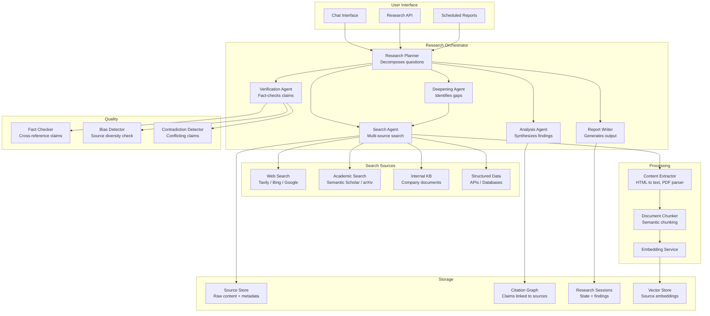
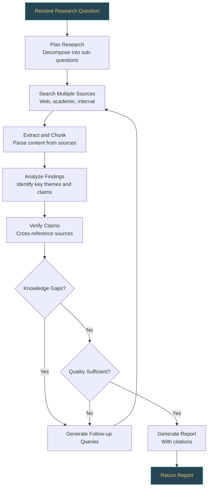
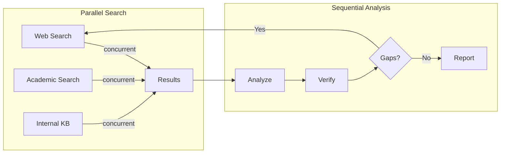
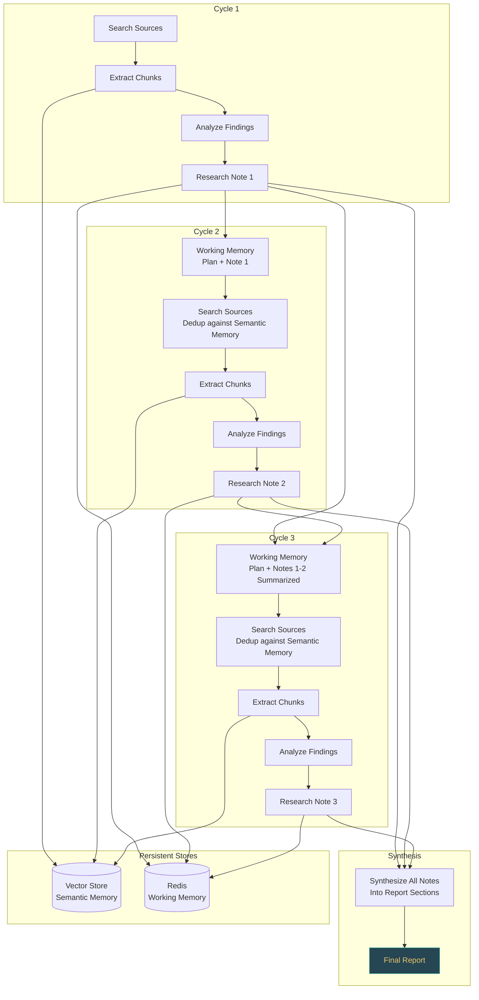

# Research Agent

An autonomous research agent takes a research question, searches multiple sources, synthesizes findings, tracks citations, and produces a structured report. This is one of the most compelling agentic system design problems because it demands planning under uncertainty, iterative deepening, cost control, and rigorous information quality assessment.

---

## Problem Statement

> **Interviewer:** Design an autonomous research agent that accepts a natural language research question, searches across the web, academic databases, and internal knowledge bases, reads and synthesizes content from multiple sources, tracks citations for every claim, and produces a structured research report. The system should handle tasks that range from quick lookups (under 2 minutes) to deep investigations (up to 15 minutes), and must remain cost-efficient while maintaining high factual accuracy.

---

## Clarifying Questions to Ask

1. **Scope of sources** -- Are we limited to public web and academic papers, or must the agent also search internal knowledge bases, structured databases, or proprietary APIs?
2. **Depth levels** -- Should the system support multiple depth modes (quick lookup vs. deep research), and how should it decide when to stop deepening?
3. **Latency tolerance** -- What are the acceptable response times? Is the user waiting synchronously, or can this be a background job with progress updates?
4. **Output format** -- Should the report be markdown, PDF, or structured JSON? Does the consumer want an executive summary, full analysis, or both?
5. **Cost constraints** -- Is there a per-task token budget? How should the agent behave when approaching the spending limit?
6. **Quality bar** -- What citation accuracy and factual correctness rates are expected? Must every claim be backed by a verifiable source, or are some unsupported observations acceptable?

---

## Requirements

### Functional Requirements

1. **Multi-source search** -- query web search, academic papers, internal knowledge bases, and structured databases
2. **Information synthesis** -- combine findings from multiple sources into a coherent analysis
3. **Citation tracking** -- every claim must be linked to its source with a verifiable citation
4. **Iterative deepening** -- identify knowledge gaps and perform additional research to fill them
5. **Report generation** -- produce a structured report with executive summary, findings, analysis, and references
6. **Quality control** -- verify claims against sources, detect contradictions, and flag low-confidence findings

### Non-Functional Requirements

| Requirement | Target |
|-------------|--------|
| Latency (quick research) | < 2 minutes |
| Latency (deep research) | < 15 minutes |
| Citation accuracy | > 95% of citations correctly link to source material |
| Source diversity | At least 3 independent sources per major finding |
| Factual accuracy | > 90% of claims verifiable against cited sources |
| Cost per research task | < $2.00 for deep research |

### Out of Scope

- Real-time data (stock prices, live events)
- Primary research (conducting surveys, experiments)
- Languages other than English (V1)

---

## High-Level Architecture



### Architecture Walkthrough

The architecture is organized into five layers.

**User Interface Layer** -- Requests enter through a chat interface (for interactive research), a REST API (for programmatic access), or a scheduler (for recurring reports). All three entry points feed into the Research Orchestrator.

**Research Orchestrator** -- This is the brain of the system, built around the Plan-and-Execute pattern. The Research Planner decomposes the incoming question into sub-questions and creates a full research plan before any execution begins. Workers (Search Agent, Analysis Agent, Verification Agent, Deepening Agent, Report Writer) execute phases of that plan. After each phase completes, the Planner revises the remaining steps based on what has been discovered so far. This is not a reactive loop where the agent improvises; it is a structured plan that adapts as evidence accumulates.

**Search Sources** -- The Search Agent queries multiple sources in parallel: web search engines (Tavily, Bing, Google), academic databases (Semantic Scholar, arXiv), internal knowledge bases, and structured data APIs. Results from all sources are deduplicated and re-ranked by relevance.

**Processing Layer** -- Raw content from search results passes through the Content Extractor (handling HTML, PDFs, and API responses), then through a Document Chunker that produces semantically coherent segments, and finally through an Embedding Service that indexes chunks into the vector store for retrieval during synthesis.

**Storage and Quality Layers** -- The Source Store holds raw content and metadata. The Citation Graph maps every claim to its supporting sources. Research Sessions track the state of each task, including cumulative token spend. The Quality subsystem (Fact Checker, Bias Detector, Contradiction Detector) runs as a validation pass before report generation.

---

## Component Design

### Research Planner

**What it does:** The Planner decomposes a broad research question into specific, searchable sub-questions and creates a full research plan before any execution begins.

**Why it exists:** Without decomposition, the agent would attempt to answer complex questions with a single search query, producing shallow and incomplete results. The Planner enforces the Plan-and-Execute pattern: create the plan first, then execute it phase by phase, revising remaining steps based on findings from completed phases.

**Key design decisions:**

- Each sub-question is tagged with a priority level (critical, important, supplementary) and the planner orders execution by priority so the most essential information is gathered first.
- The planner specifies which source types to search for each sub-question and what type of evidence to look for (statistics, expert opinions, case studies).
- After each execution phase, the planner receives a summary of findings and revises the remaining plan. This is not full re-planning from scratch; it is incremental revision of the remaining steps.
- For quick research, the planner generates 2-3 sub-questions. For deep research, it generates 5-8.

### Search Agent

**What it does:** Executes searches across multiple source providers in parallel, deduplicates results, and re-ranks them by semantic relevance.

**Why it exists:** No single source provides comprehensive coverage. Web search captures current information, academic search provides peer-reviewed depth, internal knowledge bases contain proprietary context, and structured APIs offer precise data. Parallel execution across all relevant sources is essential for both coverage and latency.

**Key design decisions:**

| Decision | Rationale |
|----------|-----------|
| Parallel search across sources | Reduces latency from serial sum to parallel max. A failed source does not block others. |
| Per-source timeout (15 seconds) | Prevents a slow source from stalling the entire search phase. Timed-out sources are logged and skipped. |
| Semantic re-ranking | Initial search results are ranked by the source engine's relevance scoring, which varies by provider. Re-ranking with embedding similarity against the original query produces a consistent, quality-ordered result set. |
| Deduplication by URL and content hash | Multiple sources often return the same page. Deduplication prevents redundant extraction and analysis. |

### Content Extractor

**What it does:** Converts raw source content (HTML pages, PDFs, API responses) into clean text, then chunks it semantically for embedding and analysis.

**Why it exists:** Search results are URLs and snippets. The agent needs full content to extract evidence, verify claims, and build citations. Different content types require different parsing strategies -- HTML needs tag stripping and boilerplate removal, PDFs need layout-aware text extraction, and API responses need JSON flattening.

**Key design decisions:**

- Content type is auto-detected from the URL and HTTP headers, with specialized parsers for each type.
- Semantic chunking (target size: 1000 tokens) preserves paragraph and section boundaries rather than splitting at arbitrary character offsets. This produces chunks that are coherent units of meaning, which improves both embedding quality and citation accuracy.
- Metadata (title, word count, chunk count, extraction timestamp) is captured alongside the content for provenance tracking.

### Analysis Agent

**What it does:** Synthesizes findings from extracted content, identifies key themes and claims, and associates each claim with its supporting citations.

**Why it exists:** Raw extracted text is not a research finding. The Analysis Agent performs the intellectual work of reading across sources, identifying patterns, extracting specific claims, and assessing the strength of evidence behind each claim.

**Key design decisions:**

- Every claim produced by the Analysis Agent must be paired with at least one citation. The citation includes the source URL, the specific passage that supports the claim, and a confidence score indicating how strongly the source supports the claim.
- Claims are categorized by type (fact, opinion, statistic, case study) so the report can present them appropriately.
- The agent receives existing findings as context to avoid generating duplicate claims and to enable cross-referencing.

### Verification Agent

**What it does:** Cross-references findings against their cited sources and against each other, checking for unsupported claims, contradictions, and insufficient source diversity.

**Why it exists:** LLMs can hallucinate citations, misrepresent source content, or fail to notice when two sources contradict each other. The Verification Agent acts as an independent quality gate that catches these errors before they reach the final report.

**Key design decisions:**

- **Support checking:** For each finding-citation pair, the agent verifies that the cited text actually supports the stated claim. This catches the common failure mode where an LLM cites a source that discusses the topic but does not support the specific claim.
- **Contradiction detection:** The agent compares all findings pairwise to identify contradictions. When found, contradictions are flagged so the report can present both perspectives rather than silently favoring one.
- **Source diversity validation:** If all findings come from fewer than 3 unique domains, the agent flags the research as having insufficient source diversity and recommends broadening the search.
- **Temperature zero for verification prompts:** Verification requires deterministic, precise judgment. Using temperature 0 for verification LLM calls reduces variability in the quality gate.

### Report Writer

**What it does:** Generates a structured research report from verified findings, with inline citations, an executive summary, detailed analysis organized by theme, a section on contradictions and uncertainties, and a numbered reference list.

**Why it exists:** The final deliverable is a human-readable report, not a bag of findings. The Report Writer transforms structured data into a coherent narrative that follows academic conventions (inline citation notation, reference list, explicit uncertainty flagging).

**Key design decisions:**

- The report follows a fixed structure: Executive Summary, Key Findings, Detailed Analysis, Contradictions and Uncertainties, Recommendations for Further Research, and References.
- Every factual claim in the report must have at least one inline citation using [N] notation. The writer performs a post-processing pass to verify all citation references resolve to entries in the reference list.
- Low-confidence findings are explicitly flagged in the report text rather than silently included at the same confidence level as well-supported claims.

### Deepening Agent

**What it does:** Evaluates the current state of research, identifies knowledge gaps, and generates follow-up queries to fill them.

**Why it exists:** Initial search rarely covers a complex topic completely. The Deepening Agent enables iterative refinement by identifying what is missing (unanswered sub-questions, weak evidence, unresolved contradictions) and directing additional search passes to fill those gaps.

**Key design decisions:**

- **Iteration cap of 3:** Deepening is capped at a maximum of 3 iterations. Beyond this point, diminishing returns set in and token costs escalate without proportional quality improvement. If the research is still incomplete after 3 rounds, the report is generated with explicit notes about remaining gaps.
- **Quality threshold for early termination:** Deepening stops early if citation coverage exceeds 95% and there are zero weak findings, even if the iteration cap has not been reached.
- **Top-3 gaps per iteration:** Each deepening iteration addresses at most 3 knowledge gaps to keep the search focused and cost-controlled. Gaps are prioritized by impact on the overall research question.
- **Cost-aware deepening:** The Deepening Agent checks cumulative token spend before initiating additional search passes. When approaching the per-task budget, the agent forces synthesis of existing findings rather than searching further.

---

## Data Flow



### Research Lifecycle Walkthrough

1. **Question intake** -- The user submits a natural language research question. The system classifies it by depth (quick or deep) based on complexity or explicit user preference.

2. **Planning** -- The Research Planner decomposes the question into 2-8 sub-questions, each tagged with priority, target source types, and expected evidence types. This is the full plan created upfront.

3. **Parallel search** -- The Search Agent executes queries across all specified sources concurrently. Each source has a 15-second timeout. Failed sources are logged and skipped without blocking the pipeline.

4. **Content extraction** -- Search results are fetched, parsed (HTML, PDF, or API), and chunked into semantically coherent segments. Chunks are embedded and stored in the per-task ephemeral vector store.

5. **Analysis and synthesis** -- The Analysis Agent reads across all extracted content, identifies key themes and claims, and pairs each claim with supporting citations. Claims are categorized and scored by confidence.

6. **Verification** -- The Verification Agent cross-references every claim against its cited source text, detects contradictions between findings, and checks source diversity. Issues are flagged in a verification report.

7. **Gap assessment and deepening** -- The Deepening Agent evaluates whether the research is complete. If knowledge gaps exist and the iteration cap (3 rounds) and token budget have not been exhausted, it generates follow-up queries and the process loops back to search. Otherwise, it forces synthesis.

8. **Report generation** -- The Report Writer produces the final structured report with inline citations, an executive summary, and explicit flagging of contradictions and low-confidence findings. A post-processing step validates that all citation references resolve correctly.

---

## Scaling Considerations

### Concurrency Model



| Optimization | Impact |
|-------------|--------|
| Parallel source search | 3-5x faster search phase |
| Embedding cache | Avoid re-embedding known content |
| Source content cache | Avoid re-fetching recently accessed pages |
| Early termination | Stop deepening when quality threshold met |
| Streaming report | Return sections as they are generated |

### Infrastructure Decisions

- **Task queue (Celery + Redis)** manages long-running research jobs, enabling idempotent task execution and resume-on-failure for tasks that take hours.
- **Async workers** for search and PDF processing, which are I/O-bound and benefit from non-blocking execution.
- **Rate limiting per source API** to avoid bans from web search providers and academic databases.
- **Cached search results and paper embeddings** for popular research topics to avoid redundant processing.
- **Server-sent events (SSE) or WebSocket** for streaming progress updates to users during long-running tasks.

---

## Cost Analysis

### Token Budget Per Task

Each research task is assigned a token budget tracked in the task state. The cumulative spend is updated after every LLM call. When spend approaches the budget ceiling, the system forces the agent to stop searching and synthesize whatever it has gathered so far.

| Phase | Tokens (Typical) | Cost |
|-------|-----------------|------|
| Planning | 5K | $0.02 |
| Search + extraction (5 sources) | 30K | $0.10 |
| Analysis | 25K | $0.15 |
| Verification | 15K | $0.08 |
| Deepening (1 iteration) | 30K | $0.15 |
| Report generation | 20K | $0.12 |
| **Total (deep research)** | **125K** | **$0.62** |

### Cost Control Mechanisms

- **Per-task budget cap:** Each task has a hard ceiling (default $2.00 for deep research). The orchestrator tracks cumulative spend in the task state and halts further search when approaching the limit.
- **Phase-level spend tracking:** Each phase (planning, search, analysis, verification, deepening, report) logs its token consumption independently, enabling fine-grained cost attribution and identification of cost outliers.
- **Forced synthesis on budget approach:** When cumulative spend reaches 80% of the task budget, the Deepening Agent is instructed to skip further searches and proceed directly to report generation with available findings.
- **Depth-based budget allocation:** Quick research tasks receive a lower budget (approximately $0.30) with fewer sub-questions and no deepening iterations. Deep research tasks receive the full budget.

---

## Failure Modes

| Failure | Impact | Mitigation |
|---------|--------|------------|
| Search source down | Incomplete results | Degrade gracefully; note limited sources in report |
| Paywalled content | Cannot access full text | Use snippet/abstract; note access limitation |
| Contradictory sources | Confusing findings | Verification agent flags contradictions; present both perspectives |
| Hallucinated citations | Fake references | Verify URLs are valid and content matches |
| Circular reasoning | Agent cites its own prior output | Track source provenance; exclude agent-generated content |
| Token budget exceeded | Incomplete analysis | Prioritize critical sub-questions; generate partial report |

:::warning
The most insidious failure mode is **hallucinated citations** -- where the agent invents a reference that looks plausible but does not exist. The verification agent must check that every cited URL returns a page, and that the cited text actually appears on that page. Never trust the LLM to accurately recall source content from its training data.
:::

---

## Quality Metrics

| Metric | Measurement | Target |
|--------|-------------|--------|
| Citation accuracy | % of citations that link to actual content supporting the claim | > 95% |
| Source diversity | Number of unique domains cited | > 3 per major finding |
| Factual accuracy | Human evaluation of claims against sources | > 90% |
| Completeness | % of sub-questions adequately addressed | > 85% |
| Contradiction detection | % of contradictions flagged | > 80% |
| Report coherence | Human evaluation of structure and readability | > 4/5 |

---

## Data Layer Deep Dive

### Database Selection Justification

| Store | Technology | Why This Choice | Alternative Considered | Why Not |
|-------|-----------|----------------|----------------------|---------|
| Research sessions and citation graph | PostgreSQL | ACID guarantees for citation integrity (you cannot lose a citation link), rich querying for cross-referencing claims across sources, JSONB for heterogeneous source metadata | MongoDB | Schema flexibility is nice for varied source types, but citation graph queries are relational in nature -- joins across claims, sources, and citations map naturally to SQL |
| Research progress state | Redis | Sub-ms reads for real-time progress updates, pub/sub for streaming progress to the UI | Polling PostgreSQL | Adds latency, database load for what is essentially a live status display |
| Source embeddings | pgvector or Qdrant | Semantic search across previously retrieved sources, deduplication of similar sources. pgvector if running < 500K chunks; Qdrant if you need advanced payload filtering (e.g., filter by source type, date range, credibility score simultaneously) | Pinecone | Managed, but more expensive; research agent's vector store is transient per task, not a permanent index |
| Raw source content | S3 (Object Storage) | PDFs, HTML snapshots, full articles are too large for database columns. Store raw content in S3, metadata and chunks in PostgreSQL/vector store | PostgreSQL TEXT columns | Works for small documents, but large PDFs bloat the database and slow backups |

### Schema Design

#### research_sessions -- tracks each research task

```sql
CREATE TABLE research_sessions (
    id UUID PRIMARY KEY DEFAULT gen_random_uuid(),
    user_id VARCHAR(64) NOT NULL,
    query TEXT NOT NULL,
    depth_mode VARCHAR(20) NOT NULL CHECK (depth_mode IN ('quick', 'standard', 'deep')),
    status VARCHAR(20) NOT NULL DEFAULT 'planning' CHECK (status IN ('planning', 'searching', 'analyzing', 'verifying', 'writing', 'completed', 'failed')),
    plan JSONB,
    findings JSONB DEFAULT '[]',
    token_budget INTEGER NOT NULL DEFAULT 50000,
    tokens_used INTEGER DEFAULT 0,
    cost_usd NUMERIC(10, 6) DEFAULT 0,
    started_at TIMESTAMPTZ NOT NULL DEFAULT now(),
    completed_at TIMESTAMPTZ
);
CREATE INDEX idx_sessions_user ON research_sessions(user_id, started_at DESC);
CREATE INDEX idx_sessions_status ON research_sessions(status) WHERE status != 'completed';
```

#### sources -- raw source documents

```sql
CREATE TABLE sources (
    id UUID PRIMARY KEY DEFAULT gen_random_uuid(),
    session_id UUID NOT NULL REFERENCES research_sessions(id),
    url TEXT,
    title TEXT,
    source_type VARCHAR(30) NOT NULL CHECK (source_type IN ('web', 'academic', 'internal_kb', 'structured_data')),
    raw_content_s3_key TEXT,
    content_hash VARCHAR(64),
    credibility_score NUMERIC(3, 2),
    retrieved_at TIMESTAMPTZ NOT NULL DEFAULT now()
);
CREATE UNIQUE INDEX idx_sources_dedup ON sources(session_id, content_hash);
CREATE INDEX idx_sources_session ON sources(session_id);
```

#### claims -- atomic claims extracted from sources

```sql
CREATE TABLE claims (
    id UUID PRIMARY KEY DEFAULT gen_random_uuid(),
    session_id UUID NOT NULL REFERENCES research_sessions(id),
    claim_text TEXT NOT NULL,
    source_id UUID NOT NULL REFERENCES sources(id),
    chunk_index INTEGER,
    confidence NUMERIC(3, 2),
    verification_status VARCHAR(20) DEFAULT 'unverified' CHECK (verification_status IN ('unverified', 'verified', 'contradicted', 'unsupported')),
    supporting_sources UUID[] DEFAULT '{}',
    contradicting_sources UUID[] DEFAULT '{}',
    created_at TIMESTAMPTZ NOT NULL DEFAULT now()
);
CREATE INDEX idx_claims_session ON claims(session_id);
CREATE INDEX idx_claims_verification ON claims(verification_status) WHERE verification_status != 'verified';
```

#### citations -- links between report statements and source evidence

```sql
CREATE TABLE citations (
    id UUID PRIMARY KEY DEFAULT gen_random_uuid(),
    session_id UUID NOT NULL REFERENCES research_sessions(id),
    report_section VARCHAR(50),
    statement_text TEXT NOT NULL,
    claim_id UUID REFERENCES claims(id),
    source_id UUID NOT NULL REFERENCES sources(id),
    source_quote TEXT,
    page_number INTEGER,
    created_at TIMESTAMPTZ NOT NULL DEFAULT now()
);
CREATE INDEX idx_citations_session ON citations(session_id);
```

### Key Queries

**Get all verified claims for a session with their sources:**

```sql
SELECT c.claim_text, c.confidence, s.title, s.url, s.source_type, s.credibility_score
FROM claims c
JOIN sources s ON c.source_id = s.id
WHERE c.session_id = :session_id
  AND c.verification_status = 'verified'
ORDER BY c.confidence DESC;
```

**Find contradicted claims -- claims where contradicting_sources is not empty:**

```sql
SELECT c.claim_text, c.confidence, c.contradicting_sources,
       s.title AS original_source, s.url AS original_url
FROM claims c
JOIN sources s ON c.source_id = s.id
WHERE c.session_id = :session_id
  AND c.verification_status = 'contradicted'
  AND array_length(c.contradicting_sources, 1) > 0;
```

**Citation completeness check -- find report statements without citation backing:**

```sql
SELECT ct.statement_text, ct.report_section
FROM citations ct
LEFT JOIN claims cl ON ct.claim_id = cl.id
WHERE ct.session_id = :session_id
  AND ct.claim_id IS NULL;
```

**Source diversity check -- count distinct source types per session:**

```sql
SELECT s.source_type, COUNT(DISTINCT s.id) AS source_count,
       AVG(s.credibility_score) AS avg_credibility
FROM sources s
WHERE s.session_id = :session_id
GROUP BY s.source_type
ORDER BY source_count DESC;
```

---

## Agent Memory Architecture

The research agent's memory model differs fundamentally from a conversational chatbot. A chatbot maintains a running dialogue history across turns; a research agent accumulates evidence across multiple search-analyze cycles within a single task.

### Memory Modes

- **Task-scoped with progressive accumulation.** The research agent's memory grows during a single task, not across sessions. It accumulates findings, sources, and claims over multiple search-analyze cycles. When the task completes, its working memory is discarded; only the final report and citation graph persist in the database.

### Working Memory

The current research plan, active sub-questions, and recently retrieved chunks. Stored in Redis for fast access by the orchestrator. This is the agent's "scratchpad" -- the information it needs right now to decide what to do next. Working memory is updated at the end of each cycle and evicted when the task completes.

### Episodic Memory

Each search-analyze cycle produces a "research note" -- a structured summary of what was found, what was useful, and what gaps remain. These notes form the agent's memory of what it has already tried, preventing redundant searches. For example, if the agent searched for "transformer architecture performance benchmarks" in cycle 1 and found three relevant papers, the research note records this so cycle 2 does not repeat the same query.

### Semantic Memory

All retrieved source chunks are embedded and stored in the vector store. When the agent searches for new information, it first checks semantic similarity against already-retrieved chunks to avoid re-processing duplicate content. The deduplication threshold is cosine similarity > 0.92 -- chunks above this threshold are considered duplicates and skipped.

### Context Window Strategy

The research agent faces a unique challenge -- it must synthesize information from many sources, but the context window is limited. The allocation strategy per LLM call is:

| Component | Token Allocation |
|-----------|-----------------|
| Research plan | ~500 tokens |
| Current sub-question + retrieved chunks (top 5) | ~3,000 tokens |
| Research notes from prior cycles (summarized) | ~1,500 tokens |
| System prompt + tools | ~1,000 tokens |
| **Total per step** | **~6,000 tokens** |

The key insight is that research notes are incrementally summarized -- raw findings are processed into structured notes, which are later condensed into the final report sections. This prevents context window overflow while preserving the essential information from every cycle.

### Memory Flow Across Research Cycles



---

## Hallucination Mitigation

Research agents face hallucination risks that are distinct from and more dangerous than those in conversational AI. A chatbot hallucination is usually obviously wrong to the user. A research agent hallucination -- a fabricated citation, an invented statistic, a misattributed claim -- can be invisible because it looks exactly like a real finding.

### Citation Fabrication Prevention

The biggest hallucination risk. The agent must not invent sources. Mitigation: every citation in the final report must map to an entry in the citations table, which itself must reference a real source with a verifiable URL. The verification pipeline checks that the source was actually retrieved and that the cited quote appears in the source content (fuzzy match with Levenshtein-based threshold of 0.85). If a citation cannot be traced back to a retrieved source, it is stripped from the report and the corresponding claim is flagged as unsupported.

### Claim Verification Pipeline

Each claim extracted from a source is cross-referenced against other sources:

- Claims supported by 2+ independent sources are marked **verified**.
- Claims with no corroboration from other sources are marked **unsupported** and flagged in the report with an explicit disclaimer.
- Claims contradicted by other sources are marked **contradicted** and presented as contested findings with evidence from both sides.

### Grounding Enforcement

The synthesis agent (which combines findings into prose) receives only the structured claims and citations as input -- NOT the raw source text. This forces the agent to generate from verified claims rather than hallucinating from training data. The system prompt explicitly states: "Every statement in the report must be backed by a claim ID. Do not add information beyond what is in the provided claims."

### Confidence Scoring

Each section of the report receives a confidence score based on: number of supporting sources, source credibility scores, and claim verification status. Sections with confidence below 0.5 are flagged with a warning: "This finding has limited supporting evidence."

### Anti-Plagiarism Check

The report writer is instructed to synthesize, not copy. Cosine similarity between report sentences and source chunks is computed; any sentence with similarity > 0.95 to a source is flagged as potential plagiarism and rewritten. This ensures the report is original synthesis rather than copy-paste from sources.

### Hallucination Mitigation Pipeline


---

## Production Issues and Fixes

| Issue | Symptoms | Root Cause | Fix |
|-------|----------|-----------|-----|
| Research loops on broad topics | Agent keeps searching without converging; token spend climbs linearly without quality improvement | Query too broad, no stopping criteria beyond iteration cap | Implement convergence detection: if last 3 search cycles found < 5% new unique claims, stop and synthesize with available findings |
| Source quality degradation | Report includes unreliable blog posts alongside academic papers; user trust erodes | No source credibility filtering; all sources treated as equally authoritative | Add credibility scoring: academic papers > established media > blogs; weight claims by source credibility in verification and synthesis |
| Token budget exhaustion before synthesis | Agent spends entire budget on search and extraction, with no tokens remaining for report generation | No budget allocation per phase; search phase consumes tokens greedily | Reserve 30% of budget for synthesis and report writing; enforce phase-specific budget limits with hard caps per phase |
| Duplicate sources inflating findings | Same information counted as corroboration from multiple sources; artificially high confidence scores | Same article retrieved from different URLs (mirrors, aggregators, syndication) | Content deduplication using content_hash on raw text; deduplicate before counting corroboration sources |
| Contradictory findings without resolution | Report presents contradictions without analysis; user left to resolve conflicting information | Agent does not compare claims across sources; contradictions pass through silently | Add contradiction detection step: compare claims pairwise using NLI model (entailment/contradiction/neutral); present contradictions explicitly with evidence from both sides |
| Stale academic paper references | Agent cites retracted or superseded papers; findings based on discredited research | No recency or retraction status checking for academic sources | Add retraction database check (Retraction Watch API); prefer recent publications; flag papers older than 5 years with a recency warning |
| Slow deep research exceeding timeout | 15-minute research tasks timing out at the infrastructure level; users receive no results | Too many sequential search-analyze cycles; each cycle blocks on the previous one | Parallelize independent sub-question searches; set per-cycle time limit of 3 minutes; synthesize with whatever is available at timeout rather than failing |

---

## Trade-offs & Alternatives

| Decision | Rationale | Alternative | Why Not |
|----------|-----------|-------------|---------|
| Plan-and-Execute pattern | Full plan created upfront allows structured execution and incremental revision based on findings. Prevents aimless searching. | Reactive loop (search, observe, decide next step) | Reactive agents waste tokens exploring tangents and lack a coherent strategy. Planning provides structure while still allowing adaptation. |
| Per-task ephemeral vector store | Each research task gets its own vector store, populated only with sources found during that task. Prevents cross-task contamination and simplifies cleanup. | Shared persistent vector store across tasks | Cross-task contamination risks irrelevant or stale sources influencing current research. Shared stores also create cleanup and retention headaches. |
| Iterative deepening capped at 3 iterations | Diminishing returns set in rapidly. Most gaps are filled in 1-2 rounds; 3 rounds covers edge cases while keeping costs predictable. | Unlimited deepening until quality threshold met | Unbounded loops risk runaway costs and latency. An agent could cycle indefinitely on an unanswerable sub-question. |
| Forced synthesis on budget approach | When cumulative spend reaches 80% of budget, stop searching and generate the report with available findings. | Hard cut-off at budget limit | A hard cut-off might kill the process mid-generation, losing all work. Forced synthesis produces a useful (if incomplete) deliverable. |
| Semantic re-ranking of search results | Produces consistent quality ordering across heterogeneous source providers. | Trust each source engine's native ranking | Native rankings are not comparable across providers. A Bing result ranked 3rd and an arXiv result ranked 1st are not on the same scale. |
| Parallel source search | Reduces search phase latency from serial sum to parallel max. | Sequential search with early stopping | Sequential search is simpler but 3-5x slower. For a 2-minute quick-research target, parallel execution is necessary. |
| Temperature 0 for verification prompts | Verification requires deterministic, precise judgment. Low temperature reduces variability in quality gate decisions. | Default temperature (0.7) | Higher temperature introduces randomness into pass/fail decisions, making the quality gate unreliable. |
| Separate Verification Agent | Independent quality gate catches hallucinated citations, misrepresented sources, and contradictions. | Inline verification within Analysis Agent | Self-verification is unreliable. The same model that generated a hallucinated claim is unlikely to catch it on review. Separation of concerns improves accuracy. |

---

## Interview Tips

:::tip How to Present This (35 minutes)
1. **Clarify requirements** (3 min) -- Ask about source types, depth levels, latency expectations, output format, cost constraints, and quality bar. This shows you do not jump to solutions.
2. **Draw the architecture** (5 min) -- Sketch the five layers (UI, Orchestrator, Sources, Processing, Storage/Quality) and the iterative research loop. Highlight the Plan-and-Execute pattern.
3. **Deep dive: Research Planner and iterative deepening** (7 min) -- Explain how the planner decomposes questions, how the deepening loop works, why it is capped at 3 iterations, and how cost budgets gate further exploration.
4. **Deep dive: Citation tracking and verification** (7 min) -- Walk through how every claim links to a source passage, how the Verification Agent independently checks support, and how hallucinated citations are caught.
5. **Data flow walkthrough** (5 min) -- Trace the full lifecycle: question to plan to parallel search to extraction to synthesis to verification to deepening to report.
6. **Cost control and scaling** (4 min) -- Cover token budgets, per-phase spend tracking, forced synthesis on budget approach, parallel search, caching, and early termination.
7. **Failure modes** (2 min) -- Hit the top three: hallucinated citations, contradictory sources, and budget exhaustion. For each, state the impact and mitigation.
8. **Trade-offs** (2 min) -- Discuss one or two key decisions (per-task vector store vs. shared, plan-and-execute vs. reactive) with clear rationale and why you rejected the alternative.
:::

:::info
The research agent is an excellent system design interview topic because it tests your ability to design for uncertainty. Unlike a CRUD system where the data flow is deterministic, a research agent must adapt its strategy based on what it finds. Interviewers want to see that you can handle this non-determinism with structured iteration (Plan-and-Execute pattern), quality thresholds (verification agent, citation accuracy gates), cost controls (token budgets, forced synthesis), and graceful degradation (partial reports when budget is exhausted or sources are unavailable).
:::
