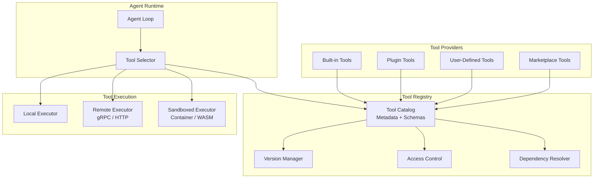
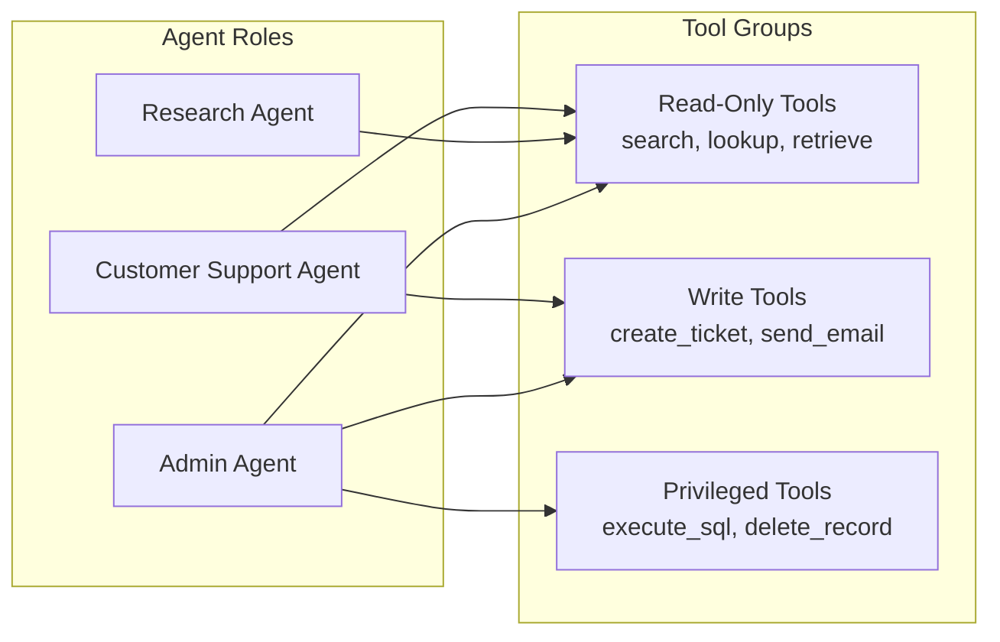
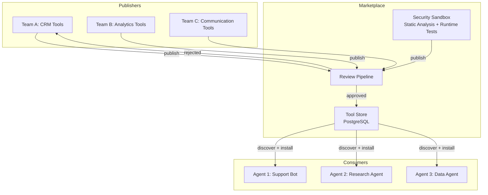

# Tool Registry Design

The tool registry serves two competing functions: it is a runtime catalog that resolves tool definitions for execution, and it is a token-budget optimization problem — every tool exposed to the LLM costs tokens (its JSON Schema must appear in the prompt) and attention (more tool schemas increase the probability of misselection or hallucinated tool names). A production registry must balance tool availability against context window efficiency, dynamically surfacing only the tools relevant to the current task while enforcing versioning, access control, and safe lifecycle transitions.

---

## Architecture Overview



---

## Dynamic Tool Discovery

In static systems, the set of available tools is hardcoded. In production, tools must be discoverable at runtime -- registered, deregistered, and updated without redeploying the agent.

### Tool Definition Schema

```python
class ToolDefinition:
    name: str
    version: str              # semver "1.2.3"
    description: str
    parameters: list[ToolParameter]
    returns: dict             # JSON Schema
    category: str             # "search", "code", "data", "communication"
    execution_mode: str       # "local", "remote", "sandboxed"
    timeout_seconds: int
    rate_limit: int | None
    requires_approval: bool
    deprecated: bool

    def to_llm_schema(self):
        """Convert to LLM function-calling format."""
        props = {p.name: {"type": p.type, "description": p.description} for p in self.parameters}
        required = [p.name for p in self.parameters if p.required]
        return {"name": self.name, "description": self.description,
                "parameters": {"type": "object", "properties": props, "required": required}}
```

### Registry Implementation

```python
class ToolRegistry:
    # _tools: dict[name, dict[version, ToolDefinition]]

    def register(self, tool):
        self._tools.setdefault(tool.name, {})[tool.version] = tool

    def deregister(self, name, version):
        self._tools.get(name, {}).pop(version, None)

    def discover(self, category=None, tags=None, include_deprecated=False):
        """Return latest version of each tool, filtered by category/tags."""
        results = []
        for versions in self._tools.values():
            latest = max(versions.values(), key=lambda t: parse_semver(t.version))
            if not include_deprecated and latest.deprecated: continue
            if category and latest.category != category: continue
            results.append(latest)
        return results

    def resolve(self, name, version=None):
        """Resolve by name; returns specific version or latest."""
        versions = self._tools[name]
        return versions[version] if version else self._latest(versions)
```

---

## Tool Versioning

Tools evolve. Parameters are added, return formats change, and behaviors are updated. Without versioning, an agent trained on v1 of a tool may call v2 with incompatible parameters.

### Versioning Strategy

| Change Type | Version Bump | Backward Compatible | Example |
|-------------|-------------|-------------------|---------|
| Bug fix | Patch (1.0.x) | Yes | Fix edge case in search results |
| New optional parameter | Minor (1.x.0) | Yes | Add `max_results` parameter |
| Remove parameter | Major (x.0.0) | No | Remove deprecated `format` param |
| Change return schema | Major (x.0.0) | No | Restructure response JSON |

### Version Resolution

```python
class VersionResolver:
    def resolve(self, requested, available):
        """Resolve: 'latest', exact '1.2.3', or caret '^1.2.0' (same major, >=base)."""
        if requested == "latest":
            return sorted(available, key=parse_semver)[-1]
        if requested.startswith("^"):
            base = parse_semver(requested[1:])
            compat = [v for v in available
                      if parse_semver(v)[0] == base[0] and parse_semver(v) >= base]
            return sorted(compat, key=parse_semver)[-1]
        if requested in available:
            return requested
        raise VersionNotFoundError(requested)
```

:::tip
When designing a tool registry for an interview, mention semver compatibility. It shows you understand that tools are APIs with consumers (agents and their prompts) that break on incompatible changes.
:::

---

## Schema Validation

Before executing a tool call, validate the parameters against the tool's schema. This catches LLM hallucinations (inventing parameters, wrong types) before they reach the tool executor.

```python
class ToolCallValidator:
    def __init__(self, registry): ...

    def validate_call(self, tool_name, parameters):
        """Validate LLM-generated params against tool's JSON Schema. Returns error list."""
        tool = self.registry.resolve(tool_name)
        schema = tool.to_json_schema()          # build from ToolDefinition.parameters
        errors = []
        try:
            jsonschema.validate(parameters, schema)
        except ValidationError as e:
            errors.append(e.message)
        if tool.deprecated:
            errors.append(f"'{tool_name}' is deprecated: {tool.deprecation_message}")
        return errors
```

:::warning
LLMs frequently hallucinate tool parameters -- especially when the tool list is large or the parameter names are similar. Always validate before executing. In production, log validation failures to detect prompt quality issues.
:::

---

## Access Control

Not every agent should have access to every tool. A customer support agent should not be able to execute arbitrary SQL. A research agent should not be able to send emails.

### Role-Based Tool Access



### Implementation

```python
class ToolAccessController:
    # _permissions: dict[tool_name, ToolPermission(allowed_roles, max_calls)]

    def check_access(self, tool_name, agent_role, session_calls=0):
        perm = self._permissions.get(tool_name)
        if not perm: return False                                # default deny
        if agent_role not in perm.allowed_roles: return False
        if perm.max_calls_per_session and session_calls >= perm.max_calls_per_session:
            return False
        return True

    def filter_tools_for_role(self, tools, role):
        return [t for t in tools if self.check_access(t.name, role)]
```

---

## Tool Marketplace Pattern

In multi-tenant platforms, different teams publish tools that other agents can consume. This is the marketplace pattern.

### Marketplace Architecture



### Marketplace Tool Metadata

```python
class MarketplaceTool:
    tool_id: str;  name: str;  version: str;  publisher: str
    description: str;  category: str;  tags: list[str]
    # Quality signals
    install_count: int;  average_rating: float;  verified: bool
    # Technical
    definition: ToolDefinition          # full schema for the agent
    source_url: str                     # git repo
    # Security
    required_permissions: list[str]     # "network", "filesystem", "database"
    sandbox_required: bool
    last_security_audit: str            # ISO date
```

---

## Hot-Reload

In a running system, you need to add, update, or remove tools without restarting agents. Hot-reload enables this.

### Event-Driven Hot-Reload

```python
class HotReloadableRegistry(ToolRegistry):
    """Subscribes to event bus; applies register/deregister/update live."""

    async def start_watching(self):
        await self.event_bus.subscribe("tool.registered", self._on_change)
        await self.event_bus.subscribe("tool.deregistered", self._on_change)
        await self.event_bus.subscribe("tool.updated", self._on_change)

    async def _on_change(self, event):
        if event.type == "deregistered":
            self.deregister(event.payload["name"], event.payload["version"])
        else:
            self.register(ToolDefinition.from_dict(event.payload))
        await self.event_bus.publish("tool.cache.invalidated", {})
```

:::info
Hot-reload requires careful coordination with in-flight agent sessions. If an agent is mid-execution using tool v1.0.0 and you hot-reload v2.0.0, the agent should finish its current plan with v1.0.0 and only pick up v2.0.0 on the next session. This is the same principle as blue-green deployment.
:::

---

## Dependency Management

Some tools depend on others. A `generate_chart` tool might require the `query_database` tool to have run first. The registry should model these dependencies.

```python
class DependencyResolver:
    def resolve_execution_order(self, requested_tools):
        """Topological sort: build dep graph, DFS to get execution order."""
        graph = {}
        for name in requested_tools:
            tool = self.registry.resolve(name)
            graph[name] = [d.tool_name for d in tool.dependencies if d.relationship == "requires"]
        return topological_sort(graph)

    def check_conflicts(self, tool_set):
        """Return list of conflict descriptions among the tool set."""
        conflicts = []
        for name in tool_set:
            tool = self.registry.resolve(name)
            for dep in tool.dependencies:
                if dep.relationship == "conflicts" and dep.tool_name in tool_set:
                    conflicts.append(f"'{name}' conflicts with '{dep.tool_name}'")
        return conflicts
```

---

## Contextual Tool Selection

Sending all available tools to the LLM wastes context window tokens and confuses the model. Contextual tool selection surfaces only the tools relevant to the current task. A naive approach uses cosine similarity between the query embedding and each tool's description embedding, but this misses important contextual signals: a tool the agent used successfully two turns ago is likely relevant again even if the current query does not semantically match its description.

### Multi-Signal Tool Ranker

A production-grade ranker combines multiple signals to decide which tools belong in the prompt.

```python
import math
from dataclasses import dataclass, field


@dataclass
class RankedTool:
    tool: "ToolDefinition"
    score: float
    signals: dict[str, float] = field(default_factory=dict)


class MultiSignalToolRanker:
    """Ranks tools for inclusion in the LLM prompt using multiple signals.

    Pure semantic similarity misses important context: a tool the agent used
    successfully 2 turns ago is likely relevant again, even if the current query
    doesn't semantically match its description. This ranker combines:
    1. Semantic relevance (embedding similarity to current query)
    2. Recency (tools used recently in this session score higher)
    3. Co-occurrence (tools often used together get boosted)
    4. Success rate (tools that frequently fail get penalized)
    """

    def __init__(self, embedder, registry, stats_store):
        self.embedder = embedder
        self.registry = registry
        self.stats = stats_store

    async def rank(
        self,
        query: str,
        session_context: "SessionContext",
        agent_role: str,
        max_tools: int = 12,
    ) -> list[RankedTool]:
        # Filter by access control first (cheap, eliminates irrelevant tools)
        accessible = self.registry.filter_by_role(agent_role)

        # Score each tool across multiple signals
        query_embedding = await self.embedder.embed(query)
        scored: list[RankedTool] = []

        for tool in accessible:
            # Signal 1: Semantic relevance (0-1)
            tool_embedding = await self._get_cached_embedding(tool)
            semantic = cosine_similarity(query_embedding, tool_embedding)

            # Signal 2: Recency in session (0-1)
            # Exponential decay: tools used on the last step score ~0.6,
            # tools used 4 steps ago score ~0.14, older tools score ~0.
            last_used_step = session_context.last_tool_use.get(tool.name)
            if last_used_step is not None:
                steps_ago = session_context.current_step - last_used_step
                recency = math.exp(-0.5 * steps_ago)
            else:
                recency = 0.0

            # Signal 3: Co-occurrence with recently used tools (0-1)
            # Captures tool workflows: query_database often precedes generate_chart.
            recent_tools = set(session_context.tools_used_last_n(3))
            co_occur = self.stats.co_occurrence_score(tool.name, recent_tools)

            # Signal 4: Historical success rate (0-1)
            # Rolling 24h window. Tools that consistently timeout or error
            # get naturally deprioritized without manual intervention.
            success_rate = self.stats.success_rate(tool.name, window_hours=24)

            # Weighted combination
            score = (
                0.45 * semantic
                + 0.25 * recency
                + 0.15 * co_occur
                + 0.15 * success_rate
            )

            scored.append(RankedTool(
                tool=tool,
                score=score,
                signals={
                    "semantic": semantic,
                    "recency": recency,
                    "co_occurrence": co_occur,
                    "success_rate": success_rate,
                },
            ))

        # Sort by score, take top-k
        scored.sort(key=lambda r: r.score, reverse=True)
        top_k = scored[:max_tools]

        # Always include tools that were used in the current session
        # (regardless of score) to prevent a subtle failure mode — see below.
        used_names = {
            t.name for t in accessible
            if t.name in session_context.all_used_tools
        }
        for tool_entry in scored:
            if (
                tool_entry.tool.name in used_names
                and tool_entry not in top_k
                and len(top_k) < max_tools + 5  # soft cap to avoid blowing budget
            ):
                top_k.append(tool_entry)

        return top_k

    async def _get_cached_embedding(self, tool):
        """Return cached embedding for the tool's description + parameter summary."""
        cache_key = f"{tool.name}:{tool.version}"
        if cache_key not in self._embedding_cache:
            text = f"{tool.description} Parameters: {', '.join(p.name for p in tool.parameters)}"
            self._embedding_cache[cache_key] = await self.embedder.embed(text)
        return self._embedding_cache[cache_key]
```

**Why these weights?** The distribution (0.45 semantic, 0.25 recency, 0.15 co-occurrence, 0.15 success rate) was determined empirically. Semantic similarity dominates because the user's query is the strongest signal of intent. Recency is second because agent tasks are typically coherent — if you used the `search` tool on the last step, you will likely need it again. Co-occurrence captures tool workflows: `query_database` often precedes `generate_chart`. Success rate acts as a slow feedback loop, naturally deprioritizing flaky tools without manual intervention.

**Why "always include used tools"?** This guarantee prevents a subtle failure mode: the LLM references a previous tool result but the tool's schema is not in the prompt, causing it to hallucinate the tool's interface when it needs to call it again. The soft cap (`max_tools + 5`) ensures this safety net does not blow the token budget entirely.

---

## Tool Design Tradeoffs

Every tool registry forces a set of design decisions that have measurable impact on latency, token cost, and tool-selection accuracy. The following tradeoffs come up repeatedly in production systems and in system design interviews.

### Many Small Tools vs Few Large Tools

50 granular tools (`get_user_name`, `get_user_email`, `get_user_address`) give the LLM precise control but consume 5000+ tokens in schemas and increase the chance of hallucinated tool names. 10 coarse tools (`get_user_profile(fields=["name","email"])`) are token-efficient but require the LLM to construct complex parameters correctly.

In practice, group related operations into a single tool with a `fields` or `action` parameter. The sweet spot is 10-20 tools per agent, each handling a coherent domain operation. If you exceed 30 tools in a single prompt, the LLM's tool selection accuracy drops measurably: GPT-4o accuracy drops from ~95% to ~82% between 15 and 50 tools in internal benchmarks.

### Static Tool Lists vs Dynamic Tool Selection

A static tool list is deterministic and cacheable (the system prompt never changes, so you benefit from KV-cache hits on providers that support prompt caching). However, it wastes tokens on irrelevant tools. Dynamic selection — embed the query, find top-k relevant tools via vector search — saves tokens but adds latency (~50ms for embedding + vector search) and can miss relevant tools if the embedding model does not understand the domain vocabulary.

**Recommendation:** use dynamic selection when you have more than 20 tools; use static lists when you have fewer than 20. In the dynamic case, always include a small set of "always-on" tools (e.g., `finish`, `ask_user`) that the agent needs regardless of context.

### Local vs Remote Execution

Local execution (in-process function call) has zero network overhead but ties the tool's lifecycle to the agent process — a crash in the tool crashes the agent. Remote execution (HTTP/gRPC to a separate service) enables independent scaling and language-agnostic tools but adds 5-20ms per call and introduces partial failure modes.

For tools that are called 10+ times per session (like search or retrieval), co-locate them with the agent process. For tools called 1-2 times per session (like `send_email` or `create_ticket`), remote execution is fine and gives you independent deployability.

### Schema Strictness: Permissive vs Strict Validation

Strict validation rejects any extra or mistyped parameters. Permissive validation ignores unknown parameters and coerces types where possible (e.g., `"42"` becomes `42`).

Strict catches hallucinations early but causes more retries — the LLM must get parameters exactly right. Permissive reduces retries but can mask model errors that compound downstream (the LLM thinks it set a filter that was silently ignored, then reasons incorrectly about the results).

**Recommendation:** use strict validation for tools with side effects (`create_order`, `send_email`, `delete_record`) and permissive validation for read-only tools (`search`, `lookup`, `get_status`).

### Tool Descriptions: Terse vs Verbose

A terse description ("Search the knowledge base") saves tokens but gives the LLM minimal guidance on when to use the tool versus alternatives. A verbose description ("Search the internal knowledge base for product documentation, FAQs, and policy documents. Use when the user asks about product features, pricing, or return policies. Do NOT use for order-specific questions — use `get_order_status` instead.") costs ~40 more tokens per tool but dramatically improves selection accuracy by encoding usage intent and negative examples.

The ROI of verbose descriptions is almost always positive: 40 extra tokens per tool times 20 tools equals 800 tokens, but preventing a single misselected tool call saves 2000+ tokens (the failed call, the error handling, and the retry).

### Decision Summary

| Decision | Option A | Option B | When to pick A | When to pick B |
|----------|----------|----------|----------------|----------------|
| Granularity | Many small tools | Few coarse tools | Narrow domain, fewer than 15 tools total | Broad domain, related ops cluster naturally |
| Selection | Static list | Dynamic (embed + top-k) | Fewer than 20 tools | More than 20 tools |
| Execution | Local (in-process) | Remote (HTTP/gRPC) | High-frequency tools (10+ calls/session) | Low-frequency, independently deployed |
| Validation | Strict | Permissive | Write/mutate operations | Read-only operations |
| Descriptions | Terse (~10 tokens) | Verbose (~50 tokens) | Unambiguous, unique tools | Tools with overlapping domains |

---

## Interview Preparation

**Sample question:** "How would you design a tool registry that supports 500 tools across 50 agent types with safe hot-reload?"

**Strong answer structure:**
1. **Schema-first tools** -- every tool has a JSON Schema definition with versioning (semver)
2. **Dynamic discovery** -- registry backed by a database, not hardcoded; supports filtering by category, tags, role
3. **Access control** -- role-based permissions; default deny; privileged tools require approval
4. **Validation layer** -- validate every LLM-generated tool call against the schema before execution
5. **Hot-reload** -- event-driven registry updates; in-flight sessions finish with the old version
6. **Contextual selection** -- semantic search to surface only relevant tools (saves tokens and improves accuracy)
7. **Dependency management** -- topological sort for execution order; conflict detection
