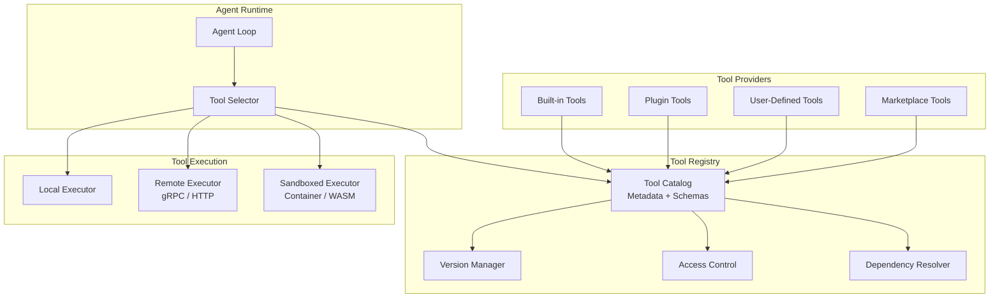
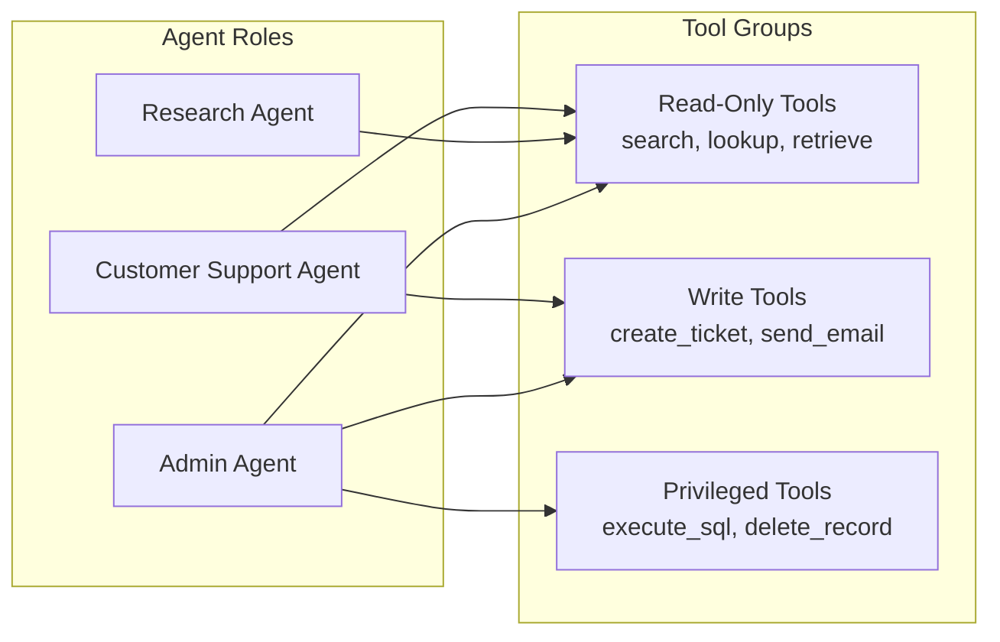
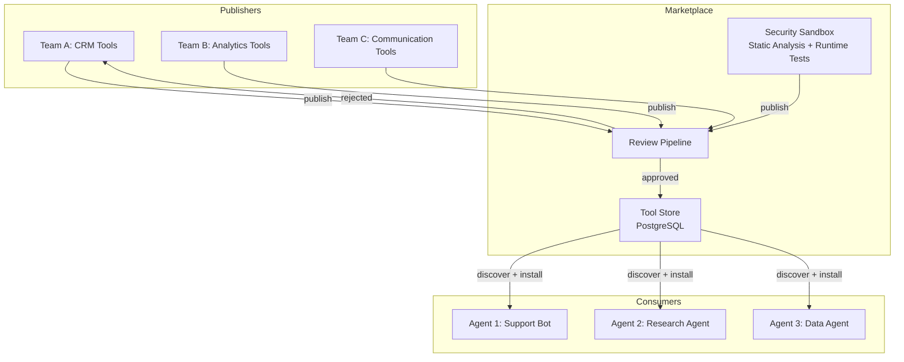

# Tool Registry Design

Tools are what make an agent more than a chatbot. The tool registry is the component that tells the agent what it can do, validates how it calls tools, and manages the lifecycle of tool availability. A well-designed registry is the difference between a brittle prototype and a production system that can safely evolve.

---

## Architecture Overview



---

## Dynamic Tool Discovery

In static systems, the set of available tools is hardcoded. In production, tools must be discoverable at runtime -- registered, deregistered, and updated without redeploying the agent.

### Tool Definition Schema

```python
class ToolDefinition:
    name: str
    version: str              # semver "1.2.3"
    description: str
    parameters: list[ToolParameter]
    returns: dict             # JSON Schema
    category: str             # "search", "code", "data", "communication"
    execution_mode: str       # "local", "remote", "sandboxed"
    timeout_seconds: int
    rate_limit: int | None
    requires_approval: bool
    deprecated: bool

    def to_llm_schema(self):
        """Convert to LLM function-calling format."""
        props = {p.name: {"type": p.type, "description": p.description} for p in self.parameters}
        required = [p.name for p in self.parameters if p.required]
        return {"name": self.name, "description": self.description,
                "parameters": {"type": "object", "properties": props, "required": required}}
```

### Registry Implementation

```python
class ToolRegistry:
    # _tools: dict[name, dict[version, ToolDefinition]]

    def register(self, tool):
        self._tools.setdefault(tool.name, {})[tool.version] = tool

    def deregister(self, name, version):
        self._tools.get(name, {}).pop(version, None)

    def discover(self, category=None, tags=None, include_deprecated=False):
        """Return latest version of each tool, filtered by category/tags."""
        results = []
        for versions in self._tools.values():
            latest = max(versions.values(), key=lambda t: parse_semver(t.version))
            if not include_deprecated and latest.deprecated: continue
            if category and latest.category != category: continue
            results.append(latest)
        return results

    def resolve(self, name, version=None):
        """Resolve by name; returns specific version or latest."""
        versions = self._tools[name]
        return versions[version] if version else self._latest(versions)
```

---

## Tool Versioning

Tools evolve. Parameters are added, return formats change, and behaviors are updated. Without versioning, an agent trained on v1 of a tool may call v2 with incompatible parameters.

### Versioning Strategy

| Change Type | Version Bump | Backward Compatible | Example |
|-------------|-------------|-------------------|---------|
| Bug fix | Patch (1.0.x) | Yes | Fix edge case in search results |
| New optional parameter | Minor (1.x.0) | Yes | Add `max_results` parameter |
| Remove parameter | Major (x.0.0) | No | Remove deprecated `format` param |
| Change return schema | Major (x.0.0) | No | Restructure response JSON |

### Version Resolution

```python
class VersionResolver:
    def resolve(self, requested, available):
        """Resolve: 'latest', exact '1.2.3', or caret '^1.2.0' (same major, >=base)."""
        if requested == "latest":
            return sorted(available, key=parse_semver)[-1]
        if requested.startswith("^"):
            base = parse_semver(requested[1:])
            compat = [v for v in available
                      if parse_semver(v)[0] == base[0] and parse_semver(v) >= base]
            return sorted(compat, key=parse_semver)[-1]
        if requested in available:
            return requested
        raise VersionNotFoundError(requested)
```

:::tip
When designing a tool registry for an interview, mention semver compatibility. It shows you understand that tools are APIs with consumers (agents and their prompts) that break on incompatible changes.
:::

---

## Schema Validation

Before executing a tool call, validate the parameters against the tool's schema. This catches LLM hallucinations (inventing parameters, wrong types) before they reach the tool executor.

```python
class ToolCallValidator:
    def __init__(self, registry): ...

    def validate_call(self, tool_name, parameters):
        """Validate LLM-generated params against tool's JSON Schema. Returns error list."""
        tool = self.registry.resolve(tool_name)
        schema = tool.to_json_schema()          # build from ToolDefinition.parameters
        errors = []
        try:
            jsonschema.validate(parameters, schema)
        except ValidationError as e:
            errors.append(e.message)
        if tool.deprecated:
            errors.append(f"'{tool_name}' is deprecated: {tool.deprecation_message}")
        return errors
```

:::warning
LLMs frequently hallucinate tool parameters -- especially when the tool list is large or the parameter names are similar. Always validate before executing. In production, log validation failures to detect prompt quality issues.
:::

---

## Access Control

Not every agent should have access to every tool. A customer support agent should not be able to execute arbitrary SQL. A research agent should not be able to send emails.

### Role-Based Tool Access



### Implementation

```python
class ToolAccessController:
    # _permissions: dict[tool_name, ToolPermission(allowed_roles, max_calls)]

    def check_access(self, tool_name, agent_role, session_calls=0):
        perm = self._permissions.get(tool_name)
        if not perm: return False                                # default deny
        if agent_role not in perm.allowed_roles: return False
        if perm.max_calls_per_session and session_calls >= perm.max_calls_per_session:
            return False
        return True

    def filter_tools_for_role(self, tools, role):
        return [t for t in tools if self.check_access(t.name, role)]
```

---

## Tool Marketplace Pattern

In multi-tenant platforms, different teams publish tools that other agents can consume. This is the marketplace pattern.

### Marketplace Architecture



### Marketplace Tool Metadata

```python
class MarketplaceTool:
    tool_id: str;  name: str;  version: str;  publisher: str
    description: str;  category: str;  tags: list[str]
    # Quality signals
    install_count: int;  average_rating: float;  verified: bool
    # Technical
    definition: ToolDefinition          # full schema for the agent
    source_url: str                     # git repo
    # Security
    required_permissions: list[str]     # "network", "filesystem", "database"
    sandbox_required: bool
    last_security_audit: str            # ISO date
```

---

## Hot-Reload

In a running system, you need to add, update, or remove tools without restarting agents. Hot-reload enables this.

### Event-Driven Hot-Reload

```python
class HotReloadableRegistry(ToolRegistry):
    """Subscribes to event bus; applies register/deregister/update live."""

    async def start_watching(self):
        await self.event_bus.subscribe("tool.registered", self._on_change)
        await self.event_bus.subscribe("tool.deregistered", self._on_change)
        await self.event_bus.subscribe("tool.updated", self._on_change)

    async def _on_change(self, event):
        if event.type == "deregistered":
            self.deregister(event.payload["name"], event.payload["version"])
        else:
            self.register(ToolDefinition.from_dict(event.payload))
        await self.event_bus.publish("tool.cache.invalidated", {})
```

:::info
Hot-reload requires careful coordination with in-flight agent sessions. If an agent is mid-execution using tool v1.0.0 and you hot-reload v2.0.0, the agent should finish its current plan with v1.0.0 and only pick up v2.0.0 on the next session. This is the same principle as blue-green deployment.
:::

---

## Dependency Management

Some tools depend on others. A `generate_chart` tool might require the `query_database` tool to have run first. The registry should model these dependencies.

```python
class DependencyResolver:
    def resolve_execution_order(self, requested_tools):
        """Topological sort: build dep graph, DFS to get execution order."""
        graph = {}
        for name in requested_tools:
            tool = self.registry.resolve(name)
            graph[name] = [d.tool_name for d in tool.dependencies if d.relationship == "requires"]
        return topological_sort(graph)

    def check_conflicts(self, tool_set):
        """Return list of conflict descriptions among the tool set."""
        conflicts = []
        for name in tool_set:
            tool = self.registry.resolve(name)
            for dep in tool.dependencies:
                if dep.relationship == "conflicts" and dep.tool_name in tool_set:
                    conflicts.append(f"'{name}' conflicts with '{dep.tool_name}'")
        return conflicts
```

---

## Contextual Tool Selection

Sending all available tools to the LLM wastes context window tokens and confuses the model. Contextual tool selection surfaces only the tools relevant to the current task.

```python
class ContextualToolSelector:
    async def select_tools(self, query, agent_role, max_tools=10):
        """Surface only relevant tools to save context tokens."""
        accessible = [t for t in self.registry.discover()
                      if self._has_access(t, agent_role)]      # 1: ACL filter
        query_emb = await self.embedder.embed(query)
        scored = [(cosine_sim(query_emb, await self._get_emb(t)), t)
                  for t in accessible]                          # 2: semantic rank
        scored.sort(reverse=True, key=lambda x: x[0])
        return [t for _, t in scored[:max_tools]]               # 3: top-k
```

---

## Interview Preparation

**Sample question:** "How would you design a tool registry that supports 500 tools across 50 agent types with safe hot-reload?"

**Strong answer structure:**
1. **Schema-first tools** -- every tool has a JSON Schema definition with versioning (semver)
2. **Dynamic discovery** -- registry backed by a database, not hardcoded; supports filtering by category, tags, role
3. **Access control** -- role-based permissions; default deny; privileged tools require approval
4. **Validation layer** -- validate every LLM-generated tool call against the schema before execution
5. **Hot-reload** -- event-driven registry updates; in-flight sessions finish with the old version
6. **Contextual selection** -- semantic search to surface only relevant tools (saves tokens and improves accuracy)
7. **Dependency management** -- topological sort for execution order; conflict detection
