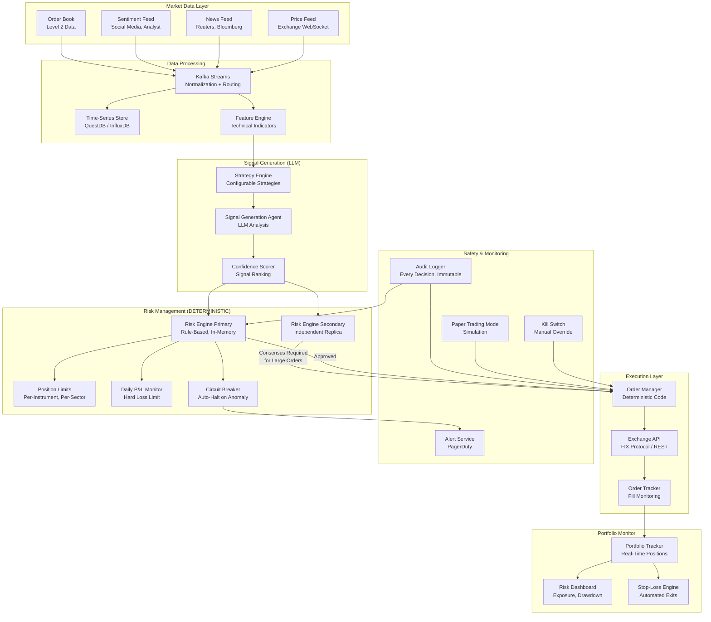
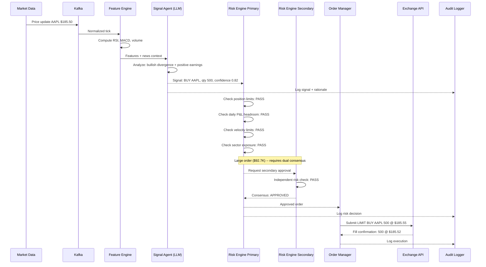

# Real-Time Trading Agent

A real-time trading system that uses LLM-powered agents for market analysis and signal generation while enforcing all risk management and trade execution through deterministic, rule-based engines. Safety is the overriding design principle: the LLM provides intelligence, but never touches the execution path, ensuring that no model hallucination or latency spike can cause unbounded financial loss.

---

## Problem Statement

> Design an AI agent that monitors financial markets, identifies trading opportunities based on configurable strategies, and executes trades -- with real-time risk management guardrails. Safety is paramount: a bug must not cause unbounded financial loss.

---

## Clarifying Questions to Ask

1. **Asset classes and markets** -- Which markets are we trading (equities, futures, crypto, forex)? Are we dealing with a single exchange or multiple? What are the exchange API latency characteristics?
2. **Strategy complexity** -- Are strategies purely quantitative (technical indicators), fundamentals-based (news, earnings), or a mix? How many concurrent strategies run simultaneously?
3. **Position sizing and capital** -- What is the total capital under management? What are the maximum position sizes per instrument, per sector, and portfolio-wide?
4. **Regulatory requirements** -- Are there regulatory reporting obligations (MiFID II, SEC)? Do we need pre-trade compliance checks?
5. **Risk tolerance** -- What is the maximum acceptable daily loss? What about maximum drawdown before the system halts all trading?
6. **Deployment model** -- Is this co-located with the exchange (ultra-low latency) or running in a cloud environment? What is the acceptable end-to-end latency from signal to order?

---

## Requirements

### Functional Requirements

1. Ingest real-time market data (price feeds, order book depth, news, social sentiment)
2. Analyze data against configurable trading strategies using LLM reasoning
3. Generate trade signals with confidence scores and supporting rationale
4. Validate all signals through deterministic risk management checks
5. Execute approved trades through exchange APIs with complete audit trail
6. Monitor portfolio risk in real-time (P&L, exposure, drawdown)
7. Provide manual kill switch and automated circuit breakers

### Non-Functional Requirements

| Requirement | Target |
|-------------|--------|
| Signal generation latency | < 100ms for quantitative signals |
| Risk check latency | < 10ms (deterministic, in-memory) |
| Order execution latency | < 50ms from risk approval to exchange |
| Audit trail completeness | 100% of decisions logged with timestamps |
| Availability | 99.99% during market hours |
| Recovery time | < 5 seconds (halt trading, preserve positions) |

### Out of Scope

- High-frequency trading (nanosecond latency market making)
- Portfolio rebalancing and long-term investment management
- Retail user interface or brokerage platform
- Cryptocurrency DeFi protocol integration

---

## High-Level Architecture

### Architecture Walkthrough

The architecture enforces a strict separation between the intelligence layer (LLM-powered, allowed to be slow and fallible) and the safety layer (deterministic, required to be fast and correct).

The **Market Data Layer** ingests real-time price feeds, news, sentiment data, and order book depth. All data flows through Kafka for normalization, timestamping, and routing. This ensures every piece of data is consistently formatted and available for both real-time processing and historical replay.

The **Data Processing** layer computes technical indicators (moving averages, RSI, MACD, volume profiles) in the Feature Engine and stores time-series data in QuestDB for backtesting and historical analysis.

The **Signal Generation** layer is the only LLM-powered component. The Strategy Engine applies configurable trading strategies. The Signal Generation Agent uses an LLM to analyze market conditions: it reads recent price action, news headlines, and sentiment data, then produces trade signals with a confidence score and a natural-language rationale explaining the opportunity. This is an advisory output -- it suggests what to trade but has zero authority to execute.

The **Risk Management** layer is entirely deterministic, rule-based, and runs in-memory for sub-10ms latency. Every signal passes through position limit checks, sector exposure checks, daily P&L limit validation, and circuit breaker status verification. For large orders (exceeding a configurable notional threshold), both the primary and secondary risk engines must independently approve the trade (consensus requirement). The risk engines are written in compiled, statically-typed code with no LLM dependencies.

The **Execution Layer** receives only risk-approved orders. The Order Manager formats orders for the exchange API, submits them, and tracks fills. The Order Tracker monitors execution quality (slippage, partial fills, rejections) and updates the Portfolio Tracker.

The **Safety and Monitoring** layer provides defense in depth. The Kill Switch can halt all trading instantly (manual button or API call). Paper Trading Mode runs the full pipeline but substitutes a simulated exchange for the real one. The Audit Logger records every data point, signal, risk decision, and trade with microsecond timestamps in an immutable log for regulatory compliance.

---

## Component Design

### 1. Signal Generation Agent (LLM)

The Signal Generation Agent is the intelligence layer. It receives structured market data (recent candles, computed indicators, relevant news headlines, sentiment scores) and the configured trading strategy parameters. The LLM analyzes this context and produces a structured signal: instrument, direction (buy/sell), suggested size, confidence score (0.0 to 1.0), and a rationale.

The agent uses a constrained output format (JSON schema validation) to prevent hallucinated fields. The confidence score is calibrated against historical accuracy: a signal at 0.8 confidence historically produces profitable trades 72% of the time. Signals below a configurable confidence threshold (default 0.6) are logged but not forwarded to the risk engine.

The LLM call is asynchronous and not in the critical execution path. If the LLM takes 2 seconds instead of 100ms, the risk engine and execution layer are unaffected -- they simply receive the signal later. This design means LLM latency variability never impacts trade execution timing.

### 2. Risk Engine (Deterministic)

The Risk Engine is the safety cornerstone. It is written in Rust for performance and memory safety, runs entirely in-memory, and has zero external dependencies during execution. It enforces hard limits that cannot be overridden by the LLM or any other component:

- **Position limits**: Maximum notional per instrument, per sector, and portfolio-wide. No single position can exceed 5% of capital.
- **Daily P&L limit**: If realized + unrealized P&L exceeds the daily loss limit (e.g., -2% of capital), all trading halts and existing positions enter a controlled wind-down.
- **Velocity checks**: No more than N orders per minute per instrument (prevents runaway loops).
- **Concentration limits**: Maximum sector and correlation-based exposure.
- **Circuit breaker**: If the risk engine detects anomalous behavior (e.g., 10 consecutive losing trades, unusual position size requests), it halts trading and alerts the operations team.

For large orders (above a configurable notional threshold, e.g., $500K), the dual risk engine consensus is required: both the primary and secondary risk engines must independently approve the trade. The secondary engine runs on separate hardware with independently maintained rule sets, providing protection against a bug in a single risk engine implementation.

### 3. Kill Switch

The Kill Switch is a separate, independent service with its own health check and monitoring. It operates at three levels: (1) halt new order submission, (2) cancel all open orders, (3) liquidate all positions via market orders. The Kill Switch is accessible via a physical button in the trading room, a web dashboard, a mobile app, and an automated trigger from the circuit breaker. It does not depend on the main application -- even if the trading system is completely unresponsive, the Kill Switch can independently cancel orders and flatten positions through a direct exchange API connection.

### 4. Paper Trading Mode

Every strategy must complete a minimum of 2 weeks in paper trading mode before approval for live trading. Paper trading uses the exact same signal generation, risk management, and order management code -- the only difference is that the Order Manager sends orders to a simulated exchange that models realistic fills with slippage and partial fills. Evaluation metrics include Sharpe ratio, maximum drawdown, win rate, average profit/loss per trade, and maximum consecutive losses. A strategy is promoted to live only after human review of paper trading results.

### 5. Audit Logger

The Audit Logger captures every event in the system with microsecond timestamps in an append-only, immutable log. Events include: market data received, feature computed, signal generated (with full rationale), risk check passed/failed (with reason), order submitted, fill received, position updated, and P&L recalculated. The log is written to both a local append-only file (for crash recovery) and a remote durable store (Kafka topic with infinite retention). This log enables complete reconstruction of any trading day for regulatory review, debugging, or backtesting.

---

## Data Flow

### Happy Path Walkthrough

A price tick for AAPL arrives via the exchange WebSocket. Kafka normalizes the tick and routes it to the Feature Engine, which computes updated technical indicators (RSI has crossed above 30, MACD shows bullish divergence). The Signal Generation Agent receives the features along with recent news context (positive earnings surprise announced 2 hours ago). The LLM analyzes the confluence of signals and generates a BUY signal for 500 shares with a confidence score of 0.82 and a rationale citing the technical setup plus fundamental catalyst.

The signal reaches the primary Risk Engine, which runs five checks in under 5ms: position limits (current AAPL exposure plus 500 shares is within the 5% capital limit), daily P&L (current P&L is +0.3%, well within the -2% halt threshold), velocity (only 2 orders in AAPL in the last hour), and sector exposure (technology sector at 18%, below the 25% cap). Because the order notional exceeds $50K, the dual consensus protocol activates: the secondary Risk Engine independently verifies all limits and confirms approval.

The Order Manager formats a limit buy order (price set at market plus 0.03% buffer) and submits to the exchange. The fill arrives at $185.52. The Portfolio Tracker updates positions and P&L. The Audit Logger records every step with timestamps.

### Error/Edge Case Path

The Signal Generation Agent experiences a 5-second LLM latency spike due to provider load. During this time, the Risk Engine and Execution Layer are completely unaffected -- they continue processing previously generated signals and monitoring existing positions. When the delayed signal finally arrives, it is timestamped. The Risk Engine checks if the market data underlying the signal is stale (more than 30 seconds old). If stale, the signal is rejected as "stale_data" and logged. If not stale, it proceeds through normal risk checks. This design ensures LLM latency never compromises execution quality.

If the Risk Engine detects that daily P&L has crossed -1.5% (approaching the -2% halt threshold), it switches to "defensive mode": all new buy signals are rejected, and only position-reducing (sell) signals are accepted. If P&L crosses -2%, all trading halts and the Alert Service pages the operations team. Stop-loss orders on existing positions continue to execute even in halt mode.

---

## Scaling Considerations

The system has two fundamentally different performance profiles: the **fast path** (market data through risk engine to execution) and the **slow path** (LLM signal generation).

The fast path must be deterministic and sub-100ms. This is achieved by keeping the Risk Engine and Order Manager in-memory with zero external dependencies. The time-series store is append-only and never read in the hot path. Risk limits are loaded into memory at startup and updated via an out-of-band configuration channel.

The slow path (LLM analysis) runs asynchronously. Multiple signal generation agents can run in parallel for different instruments and strategies. Signals are queued and processed by the risk engine in arrival order. If the LLM provider is slow or unavailable, the system continues operating with previously generated signals and existing stop-loss orders.

For multi-strategy deployments, each strategy runs as an independent signal generation pipeline with its own LLM context and risk budget. The portfolio-level risk engine aggregates across all strategies to enforce total exposure limits.

Geographic co-location with exchange data centers reduces network latency for the execution path. The LLM analysis runs in cloud infrastructure since its latency requirements (sub-second, not sub-millisecond) do not require co-location.

---

## Cost Analysis

| Component | Volume/Day | Unit Cost | Daily Cost |
|-----------|-----------|-----------|------------|
| Market data feeds | 5M ticks | $0 (exchange subscription: $2K/mo) | $67 |
| LLM signal generation | 5,000 analyses | $0.03/analysis (avg 4K tokens) | $150 |
| Infrastructure (Kafka, QuestDB, compute) | -- | -- | $200 |
| Exchange connectivity (co-location, FIX) | -- | -- | $100 |
| Monitoring and alerting | -- | -- | $50 |
| **Total daily infrastructure** | | | **$567** |
| **Monthly infrastructure** | | | **$17,000** |

The infrastructure cost is negligible compared to trading capital. The critical cost metric is the system's risk-adjusted return: a well-designed risk engine that prevents a single catastrophic loss event (which could be millions of dollars) pays for the entire system's infrastructure for years.

---

## Trade-offs & Alternatives

| Decision | Rationale | Alternative | Why Not |
|----------|-----------|-------------|---------|
| LLM for analysis only, deterministic execution | LLM hallucinations or latency spikes cannot cause trades; safety is absolute | LLM generates and executes trades directly | A single hallucinated order size or wrong direction could cause catastrophic loss; unacceptable risk for financial systems |
| Dual risk engine consensus for large orders | Protects against bugs in a single risk engine implementation; independent validation | Single risk engine for all order sizes | A bug in one risk engine could approve an oversized position; dual consensus catches single-point failures |
| Paper trading mandatory before live | Validates strategy performance with realistic simulation before risking capital | Deploy strategies directly to live trading | Untested strategies may have edge cases (specific market conditions, data gaps) that only surface over extended testing |
| Kill switch as independent service | Remains operational even if the main system crashes; direct exchange connection | Kill switch embedded in the main application | If the application is unresponsive (deadlock, resource exhaustion), an embedded kill switch is also unavailable |
| Rust for risk engine | Memory safety eliminates entire class of bugs (buffer overflows, null dereferences); performance meets sub-10ms requirement | Python or Java risk engine | Python is too slow for sub-10ms hot path; Java GC pauses introduce unpredictable latency; Rust provides both safety and performance |
| Append-only audit log with immutable storage | Regulatory compliance requires tamper-proof records; enables complete day reconstruction | Mutable database for trade records | Auditors and regulators require proof that records were not altered; append-only logs with checksums provide this guarantee |

---

## Interview Tips

:::tip How to Present This (35 minutes)
- **Minutes 1-5**: Clarify requirements with emphasis on safety. Ask about asset classes, capital size, risk limits, and regulatory obligations. State the fundamental design principle upfront: "The LLM provides intelligence but never touches execution. Safety is enforced by deterministic code."
- **Minutes 5-15**: Draw the architecture with the clear separation between the LLM signal path and the deterministic execution path. Walk through the data flow from market data to executed trade. Emphasize the Risk Engine as the safety centerpiece -- spend extra time here.
- **Minutes 15-25**: Deep dive into the Risk Engine (hard limits, velocity checks, dual consensus), the Kill Switch (independent service, three escalation levels), and Paper Trading Mode (mandatory validation before live). Explain why each safety mechanism exists with concrete failure scenarios it prevents.
- **Minutes 25-30**: Discuss the fast path vs. slow path performance model, explain why LLM latency variability is acceptable (async, not in critical path), and cover the cost analysis. Mention that infrastructure cost is negligible compared to the risk it mitigates.
- **Minutes 30-35**: Handle follow-ups. Common questions: "What if the LLM generates consistently wrong signals?" (paper trading catches this before live; circuit breaker detects consecutive losses and halts), "How do you handle flash crashes?" (circuit breaker triggers on abnormal price moves; kill switch flattens positions), "How do you backtest strategies?" (replay historical data from the time-series store through the signal generation pipeline).
:::
