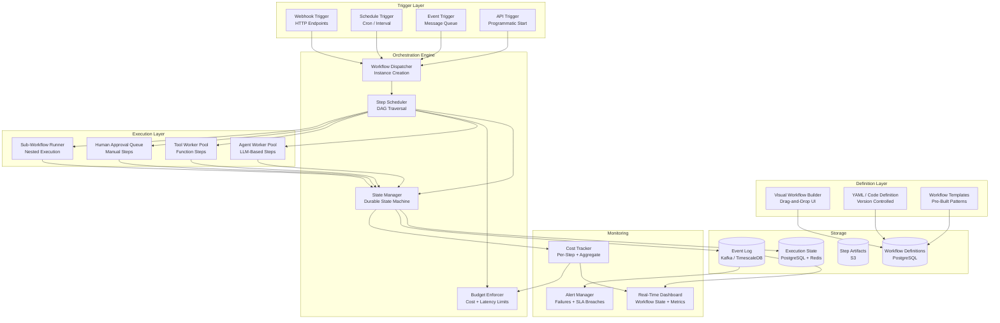
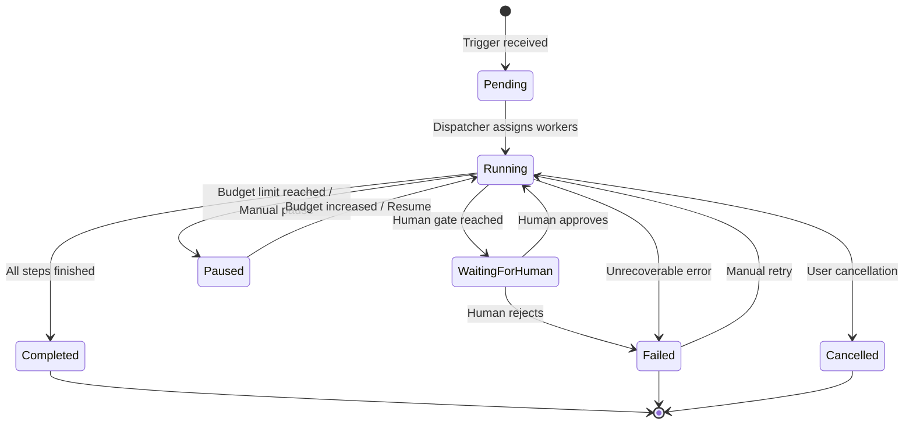
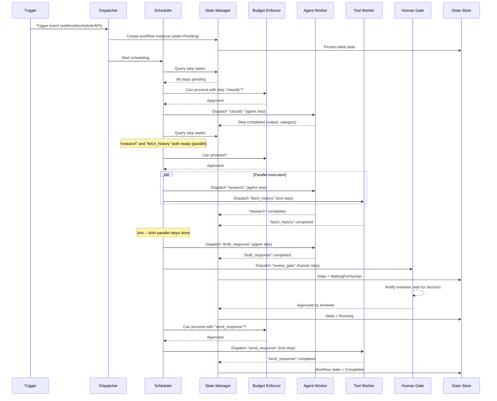
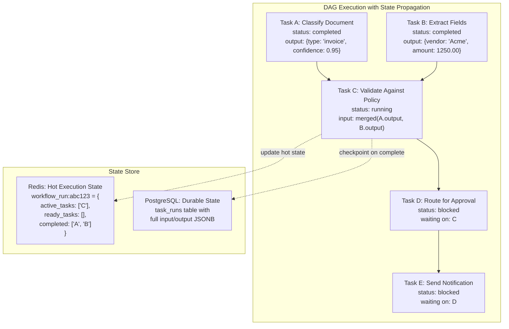
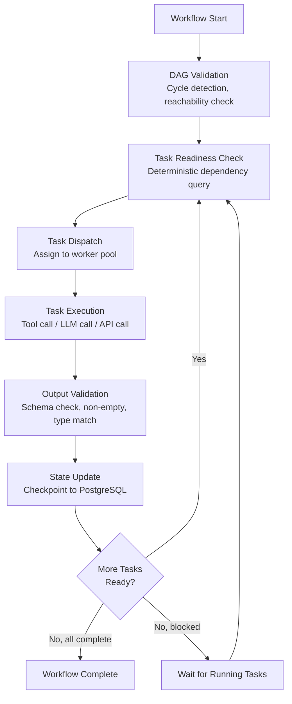

# Workflow Orchestrator

An AI Workflow Orchestrator is a system that defines, executes, and monitors complex workflows composed of AI agents, tools, and human checkpoints. Think of it as Apache Airflow meets LangGraph, purpose-built for agentic AI workloads -- supporting DAG-based workflow definitions, dynamic task routing, parallel execution, error handling with retry policies, human approval gates, sub-workflow composition, cost and latency budgets, and event-driven triggers.

---

## Problem Statement

> "We need a platform that lets teams define multi-step AI workflows as directed acyclic graphs, execute them with support for parallelism and conditional branching, include human-in-the-loop approval gates, enforce cost and latency budgets, and provide real-time visibility into execution state. The system must handle 10,000+ concurrent workflows, survive worker crashes without losing state, and guarantee exactly-once step execution for steps with external side effects."

---

## Clarifying Questions to Ask

1. **Workflow complexity** -- What is the expected number of steps per workflow? Are we looking at simple linear chains (3-5 steps) or complex DAGs with 50+ nodes, fan-out/fan-in patterns, and nested sub-workflows?
2. **Human gate frequency** -- How often do workflows require human approval? Is it every workflow or only for high-risk actions? What is the expected approval turnaround time?
3. **Agent heterogeneity** -- Do workflows mix different LLM providers and models (e.g., a fast classifier on Haiku followed by a deep reasoner on Opus), or do they use a single model throughout?
4. **Determinism expectations** -- How do we handle the non-deterministic nature of LLM steps? Should re-runs of the same workflow with the same inputs produce identical routing decisions?
5. **Multi-tenancy** -- Is this a shared platform serving multiple teams? Do we need tenant-level isolation for budgets, quotas, and workflow definitions?
6. **Integration surface** -- What external systems must workflows interact with (APIs, databases, message queues, file storage)? Are there compliance requirements around data leaving the system?
7. **Versioning and rollback** -- When a workflow definition is updated, what happens to in-flight executions? Do we support running multiple versions simultaneously?
8. **SLA requirements** -- Are there hard deadlines for workflow completion, or are latency budgets advisory? What happens when a budget is exceeded -- pause, alert, or cancel?

---

## Requirements

### Functional Requirements

1. **Workflow definition** -- Define workflows as DAGs with typed inputs/outputs, conditional branching, and loops
2. **Visual workflow builder** -- Drag-and-drop UI for creating and editing workflows
3. **Dynamic task routing** -- Route tasks to different agents or paths based on runtime conditions (rule-based, LLM-classified, or score-threshold strategies)
4. **Parallel execution with join semantics** -- Run independent tasks in parallel; join with configurable merge strategies
5. **Error handling and retry** -- Configurable retry policies (exponential/linear backoff), fallback paths, and dead letter queues
6. **Human approval gates** -- Pause workflow execution pending human review with timeout-based escalation
7. **Sub-workflow composition** -- Nest workflows within workflows for reuse and independent lifecycle management
8. **Real-time monitoring** -- Live dashboard showing workflow state, per-step metrics, token usage, and cost accumulation
9. **Cost and latency budgets** -- Enforce per-workflow and per-step limits on total cost (USD) and execution time
10. **Event-driven triggers** -- Start workflows from webhooks, cron schedules, message queue events, or programmatic API calls
11. **Integration with external systems** -- HTTP APIs, databases, file systems, message brokers

### Non-Functional Requirements

| Requirement | Target |
|-------------|--------|
| Workflow start latency | < 500ms from trigger to first step execution |
| Step scheduling latency | < 100ms between step completion and next step start |
| Concurrent workflows | 10,000+ simultaneous workflow executions |
| Fault tolerance | No workflow lost on worker crash; exactly-once step execution |
| State persistence | Durable; survive system restarts |
| Dashboard latency | < 2s for real-time workflow state |
| API response time | < 200ms for workflow submission |

### Out of Scope

- Agent development, training, or fine-tuning
- Data pipeline ETL (use Airflow/Dagster for that)
- Long-running batch ML training jobs
- End-user authentication and identity management

---

## High-Level Architecture



### Architecture Walkthrough

The architecture is organized into five layers, each with distinct responsibilities.

The **Definition Layer** provides multiple ways to author workflows. A visual drag-and-drop builder serves non-technical users, while YAML and code-based definitions give engineers version-controlled precision. Pre-built templates accelerate adoption for common patterns like customer support pipelines, document processing chains, and content moderation workflows. All definitions are persisted to PostgreSQL as versioned DAG structures.

The **Trigger Layer** accepts workflow start signals from four sources: HTTP webhooks for event-driven integrations, cron-based schedules for periodic runs, message queue consumers for event streaming architectures, and a direct API for programmatic invocation. Each trigger creates a workflow instance and hands it to the Dispatcher.

The **Orchestration Engine** is the brain of the system. The Dispatcher validates the trigger payload, creates a workflow instance with initial state, and passes it to the Step Scheduler. The Scheduler performs DAG traversal to identify steps whose dependencies are fully satisfied, then dispatches them to the appropriate worker pool. The State Manager maintains a durable state machine for every workflow and step, persisting transitions to PostgreSQL with Redis caching for hot-path reads. The Budget Enforcer checks cost and latency limits before every step dispatch, pausing workflows that approach their budgets.

The **Execution Layer** contains four specialized worker pools. Agent Workers execute LLM-based steps by invoking the configured model with the step's prompt and context. Tool Workers run deterministic function steps such as API calls, database queries, or file operations. The Human Approval Queue parks workflow execution and notifies the assigned reviewer via the notification service. Sub-Workflow Runners spawn nested workflow instances, treating them as atomic steps in the parent workflow.

The **Monitoring** layer provides real-time visibility. The Dashboard consumes events from Kafka and displays live workflow state, per-step timings, token usage, and cost accumulation via WebSocket push. The Alert Manager watches for failures, SLA breaches, and budget warnings. The Cost Tracker aggregates spend per step, per workflow, and per tenant.

---

## Workflow State Machine

Each workflow instance follows a state machine that governs its lifecycle.



---

## Component Design

### 1. Workflow Definition and DAG Model

A workflow is modeled as a directed acyclic graph where each node is a **StepDefinition** and each edge carries an optional condition expression. The WorkflowDefinition contains the full set of steps, edges, trigger configurations, budget limits, and a global error policy.

Each step has a **type** that determines its execution semantics: `agent` (LLM invocation), `tool` (deterministic function), `human_gate` (manual approval), `sub_workflow` (nested execution), or `router` (dynamic branching). Steps carry typed input and output schemas that enable compile-time validation -- the system checks that every edge connects compatible types before the workflow is saved.

Validation at definition time catches several classes of errors: cycles in the graph, edges referencing nonexistent steps, unreachable steps that no path can reach, and type mismatches between connected steps. This fail-fast approach prevents runtime surprises.

An example workflow for customer support might chain five steps: a classifier agent (Haiku, 30s timeout) feeds into a researcher agent (Sonnet, 120s timeout), whose output goes to a draft-response agent (Sonnet, 60s timeout), then to a human approval gate (assigned to support leads, 4-hour timeout), and finally to an email-sending tool step. The entire workflow carries a budget of $2.00 and a 10-minute wall-clock limit.

### 2. Step Scheduler with DAG Traversal

The Step Scheduler is responsible for determining which steps are ready to execute at any given moment. It performs a dependency scan across all pending steps in a workflow instance, checking three conditions for each: (a) all upstream dependencies have completed, (b) any conditional edge evaluates to true, and (c) the budget enforcer approves proceeding.

Steps that pass all three checks are marked as "running" and dispatched to the appropriate worker pool based on their type -- agent steps go to the agent queue, tool steps to the tool queue, human gates to the approval queue, and sub-workflows to the sub-workflow runner. Before dispatch, the scheduler collects the outputs of all upstream steps to assemble the input payload for the next step.

When a step with a conditional edge fails its condition check, the scheduler marks it as "skipped" rather than "failed," allowing the rest of the DAG to proceed. If the budget enforcer denies a step, the entire workflow transitions to "paused" and an alert is fired to operators.

The scheduler uses **lock-free DAG traversal** with optimistic concurrency on state updates. This means multiple scheduler instances can process different workflows simultaneously without contending on shared locks. For a single workflow, step state transitions are serialized through compare-and-swap operations on the state store.

### 3. Dynamic Task Router

The router step is a special node type that evaluates runtime conditions to determine which downstream path the workflow should follow. Three routing strategies are supported.

**Rule-based routing** evaluates a list of condition expressions against the step's input data in order, selecting the first matching route. This is deterministic and fast, suitable for well-understood branching logic.

**LLM-classified routing** sends the input data and a description of available routes to a lightweight LLM, which selects the best-matching route. This handles ambiguous or natural-language inputs where rules would be brittle. A default route is always configured as a fallback in case the LLM returns an unrecognized route ID.

**Score-threshold routing** compares a numeric score in the input against configured thresholds to select the appropriate path. This is common for confidence-based branching, such as routing low-confidence classifications to a human reviewer.

### 4. Error Handling and Retry Policies

Every step carries a RetryPolicy that specifies the maximum number of retries, the base delay, the maximum delay, the backoff strategy (exponential or linear), and a list of retryable error types (timeout, rate limit, transient). An optional fallback step can be configured to execute when all retries are exhausted.

When a step fails, the error handler follows a decision cascade. First, it checks whether retries remain -- if so, it computes the backoff delay and schedules a retry. Second, if retries are exhausted and a fallback step is configured, the handler redirects execution to the fallback. Third, it consults the workflow-level error policy: "continue" skips the failed step and proceeds, "pause" halts the workflow for manual intervention, and "fail" terminates the entire workflow.

Exponential backoff uses the formula `min(base_delay * 2^attempt, max_delay)`, while linear backoff uses `min(base_delay * (attempt + 1), max_delay)`. For a default policy with base delay 2s and max delay 60s, the exponential sequence is 2s, 4s, 8s -- aggressive enough to recover from transient failures without overwhelming the upstream service.

### 5. Human Approval Gates

Human approval gates pause workflow execution and create an approval request assigned to a specific role (e.g., "support_lead", "compliance_officer"). The request includes the workflow context, the data produced by upstream steps, and a deadline computed from the step's configured timeout (default: 24 hours).

The notification service delivers the approval request via the configured channels (email, Slack, in-app notification) with a direct link to the approval UI. The UI presents the full context, upstream step outputs, and action buttons for approve or reject. Reviewers can attach notes that flow back into the workflow as additional context for downstream steps.

On approval, the scheduler resumes the workflow from the gate step, injecting any reviewer-provided modifications into the step output. On rejection, the step is marked as failed and the workflow-level error policy determines next steps (typically failing the workflow or routing to an exception-handling sub-workflow).

If the deadline passes without a decision, the system escalates to the next tier of reviewers or auto-rejects based on the workflow's escalation policy.

### 6. Cost and Latency Budget Enforcement

Budget enforcement operates at two levels. **Per-step limits** cap the cost of any individual step (e.g., a research agent step capped at $0.50). **Per-workflow limits** cap the aggregate cost and wall-clock duration of the entire execution (e.g., $2.00 total and 10 minutes).

Before every step dispatch, the budget enforcer queries the cost tracker for the workflow's accumulated spend, estimates the cost of the next step (using the step's configured limit or a historical average for the step type and model), and compares the projected total against the budget. If the budget would be exceeded, the workflow pauses and an alert fires.

For latency budgets, the enforcer computes elapsed time since workflow start and compares it against the configured maximum duration. This catches runaway workflows that might be stuck in retry loops or waiting on slow external services.

Cost estimation for LLM steps uses historical per-model averages maintained by the cost tracker. When no history exists for a step type, a conservative default estimate of $0.10 is used. As the system accumulates execution data, estimates become increasingly accurate.

### 7. Real-Time Monitoring Dashboard

The monitoring dashboard provides a live view of every workflow instance. For each workflow, it displays the overall state, elapsed time, a per-step breakdown (state, start/end times, cost, token usage, error messages, retry count), total accumulated cost, remaining budget, and any pending approval requests.

The dashboard is powered by a WebSocket push architecture. As the state manager commits step transitions, it publishes events to Kafka. The dashboard service consumes these events and pushes updates to connected clients in real time, achieving sub-2-second latency from state change to screen update.

Historical views use pre-aggregated metrics stored in TimescaleDB, enabling efficient queries over workflow completion rates, average durations, cost distributions, and failure patterns across time ranges.

---

## Data Flow

The following sequence illustrates the end-to-end flow for a workflow that includes parallel steps and a human approval gate.



**Walkthrough**: A trigger event arrives at the Dispatcher, which creates a new workflow instance in Pending state and persists it. The Scheduler begins DAG traversal, identifies the entry step ("classify"), checks the budget, and dispatches it to an Agent Worker. When classify completes, the Scheduler finds two steps with satisfied dependencies ("research" and "fetch_history") and dispatches them in parallel. Once both complete (the join point), the Scheduler dispatches "draft_response." After that step completes, the workflow enters the human approval gate -- the instance transitions to WaitingForHuman state while a reviewer is notified. Upon approval, the workflow resumes, the final "send_response" tool step executes, and the workflow transitions to Completed.

---

## Scaling Considerations

| Component | Strategy |
|-----------|----------|
| Workflow Dispatcher | Partitioned by workflow_id using consistent hashing for affinity; horizontally scalable across multiple instances |
| Step Scheduler | Lock-free DAG traversal with optimistic concurrency on state updates; each scheduler instance handles a partition of workflows |
| Agent Workers | Auto-scaled pool with per-model queues for GPU efficiency; scale based on queue depth per model type |
| Tool Workers | Stateless function execution; scale horizontally based on queue depth |
| State Store | PostgreSQL for durability with Redis for hot state and distributed locking; read replicas for dashboard queries |
| Event Log | Kafka for high-throughput event streaming; TimescaleDB for queryable historical metrics |
| Dashboard | WebSocket push for real-time updates; pre-aggregated metrics for historical views; CDN-cached static assets |

### Fault Tolerance

| Failure Mode | Recovery Strategy |
|-------------|-------------------|
| Worker crash mid-step | Step timeout triggers retry; idempotent step execution with idempotency keys prevents duplicate side effects |
| Scheduler crash | State persisted in DB; new scheduler resumes from last committed state via leader election |
| Database unavailable | Queue backs up; steps retry with backoff; no data loss due to write-ahead logging |
| LLM provider outage | Model router fails over to alternative provider; degraded routing uses rule-based fallback |
| Network partition | Workflow pauses automatically; resumes when connectivity restored; fencing tokens prevent split-brain |

---

## Cost Analysis

| Component | Cost Driver | Estimated Monthly Cost (10K concurrent workflows) |
|-----------|-------------|---------------------------------------------------|
| Orchestration Engine (Scheduler, Dispatcher) | Compute (CPU-bound) | $800-1,200 (4-6 instances, c5.xlarge equivalent) |
| Agent Workers | LLM API calls + compute | $5,000-50,000+ (depends entirely on model mix and step count) |
| PostgreSQL (State Store) | Storage + IOPS | $400-800 (db.r6g.xlarge with provisioned IOPS) |
| Redis (Hot State) | Memory | $200-400 (cache.r6g.large) |
| Kafka (Event Log) | Throughput + storage | $300-600 (3-broker cluster) |
| S3 (Artifacts) | Storage + requests | $50-200 |
| Dashboard / Monitoring | Compute + WebSocket connections | $200-400 |
| **Total (excluding LLM costs)** | | **$1,950-3,600/month** |

The dominant cost is LLM API usage, which is why per-step and per-workflow budget enforcement is critical. Infrastructure costs are modest relative to the LLM spend for most deployments.

---

## Data Layer Deep Dive

### Database Selection Justification

Each data store in the architecture was chosen for a specific reason tied to the workload it serves. The table below summarizes the selection rationale and the alternatives that were evaluated and rejected.

| Store | Technology | Why This Choice | Alternative Considered | Why Not |
|-------|-----------|----------------|----------------------|---------|
| Workflow definitions, execution state, task metadata | PostgreSQL | ACID guarantees for workflow state -- a workflow with 50 steps must have exactly-once execution per step; losing state means re-executing completed steps or skipping steps entirely. JSONB columns for heterogeneous task parameters and results. Advisory locks for distributed coordination when needed | MongoDB | Flexible schema for varied task configurations, but workflow execution is fundamentally a state machine with ordering constraints and foreign key relationships between tasks -- this maps naturally to relational modeling, not document storage |
| Active workflow execution state, distributed locking | Redis | Sub-millisecond reads for checking if a task is ready to execute; distributed locks for preventing duplicate task execution across workers; pub/sub for notifying workers when upstream tasks complete | ZooKeeper | Stronger consistency guarantees but significantly higher operational complexity; Redis distributed locks with Redlock are sufficient for workflow coordination at this scale, and the team already operates Redis for caching |
| DAG storage | PostgreSQL (same instance) | Workflow DAGs are stored as adjacency lists (task_id, depends_on). PostgreSQL's recursive CTEs make topological sort queries possible directly in SQL, avoiding application-level graph traversal. Keeping DAGs in the same database as workflow state enables transactional consistency across DAG definition and execution state | Neo4j | Graph database is conceptually better for DAGs, but adds operational complexity for what amounts to a few hundred nodes per workflow -- PostgreSQL handles this fine with adjacency list representation and recursive queries |
| Task artifacts | S3 (Object Storage) | Large intermediate outputs (data files, generated reports, model checkpoints) passed between tasks. S3 with presigned URLs decouples artifact size from database storage limits and network bandwidth between services | Redis / PostgreSQL passthrough | Not viable for large artifacts; Redis is for metadata and coordination, PostgreSQL is for structured state -- neither is designed for multi-megabyte binary blobs. S3 handles artifacts from kilobytes to gigabytes uniformly |

### Schema Design

The following schemas define the core data model. Each table includes its indexes with justification for why each index exists.

#### workflows

Stores workflow definitions including the DAG structure, trigger configuration, and execution policies.

```sql
CREATE TABLE workflows (
    id UUID PRIMARY KEY DEFAULT gen_random_uuid(),
    name VARCHAR(255) NOT NULL,
    description TEXT,
    dag_definition JSONB NOT NULL,         -- { "nodes": [...], "edges": [...] }
    trigger_type VARCHAR(20) NOT NULL
        CHECK (trigger_type IN ('manual', 'scheduled', 'event', 'api')),
    trigger_config JSONB DEFAULT '{}',     -- cron expression, webhook URL, event filter
    timeout_seconds INTEGER DEFAULT 3600,
    max_retries INTEGER DEFAULT 3,
    created_by VARCHAR(128) NOT NULL,
    created_at TIMESTAMPTZ NOT NULL DEFAULT now(),
    updated_at TIMESTAMPTZ NOT NULL DEFAULT now()
);

-- Lookup workflows by creator for management UI
CREATE INDEX idx_workflows_created_by ON workflows(created_by, created_at DESC);

-- Filter workflows by trigger type for scheduler polling
CREATE INDEX idx_workflows_trigger_type ON workflows(trigger_type)
    WHERE trigger_type = 'scheduled';
```

**Index rationale**:
- `idx_workflows_created_by` -- The workflow management UI lists all workflows owned by a user sorted by creation date. This composite index serves that query without a sort operation.
- `idx_workflows_trigger_type` -- The schedule poller queries only scheduled workflows. A partial index reduces scan size by excluding manual, event, and API-triggered workflows.

#### workflow_runs

Tracks each execution instance of a workflow from creation through completion or failure.

```sql
CREATE TABLE workflow_runs (
    id UUID PRIMARY KEY DEFAULT gen_random_uuid(),
    workflow_id UUID NOT NULL REFERENCES workflows(id),
    status VARCHAR(20) NOT NULL DEFAULT 'pending'
        CHECK (status IN ('pending', 'running', 'paused', 'completed',
                          'failed', 'cancelled', 'timed_out')),
    trigger_event JSONB,                   -- payload that triggered this run
    started_at TIMESTAMPTZ,
    completed_at TIMESTAMPTZ,
    error_message TEXT,
    total_tasks INTEGER NOT NULL DEFAULT 0,
    completed_tasks INTEGER NOT NULL DEFAULT 0,
    version INTEGER NOT NULL DEFAULT 1,    -- optimistic concurrency control
    created_at TIMESTAMPTZ NOT NULL DEFAULT now()
);

-- Dashboard query: all runs for a workflow sorted by recency
CREATE INDEX idx_workflow_runs_workflow ON workflow_runs(workflow_id, created_at DESC);

-- Active run monitoring: find all currently executing workflows
CREATE INDEX idx_workflow_runs_status ON workflow_runs(status)
    WHERE status IN ('running', 'paused');

-- Orphan detection: find running workflows with stale timestamps
CREATE INDEX idx_workflow_runs_started ON workflow_runs(started_at)
    WHERE status = 'running';
```

**Index rationale**:
- `idx_workflow_runs_workflow` -- The run history page for a workflow loads recent runs. This composite index serves `WHERE workflow_id = ? ORDER BY created_at DESC` as an index-only scan.
- `idx_workflow_runs_status` -- The monitoring dashboard filters for active workflows. A partial index on running and paused states avoids scanning completed and failed runs, which dominate the table over time.
- `idx_workflow_runs_started` -- The orphan reaper process scans for running workflows whose `started_at` exceeds the timeout threshold. A partial index on running status keeps this scan efficient as the table grows.

#### tasks

Defines individual task nodes within a workflow, including their type, configuration, and dependencies.

```sql
CREATE TABLE tasks (
    id UUID PRIMARY KEY DEFAULT gen_random_uuid(),
    workflow_id UUID NOT NULL REFERENCES workflows(id),
    task_name VARCHAR(255) NOT NULL,
    task_type VARCHAR(20) NOT NULL
        CHECK (task_type IN ('llm_call', 'tool_call', 'human_approval',
                             'conditional', 'parallel_group', 'sub_workflow')),
    config JSONB NOT NULL DEFAULT '{}',    -- model, prompt template, tool config, etc.
    dependencies UUID[] DEFAULT '{}',       -- array of task IDs this depends on
    timeout_seconds INTEGER DEFAULT 300,
    retry_policy JSONB DEFAULT '{"max_retries": 3, "backoff": "exponential", "base_delay_seconds": 2}',
    created_at TIMESTAMPTZ NOT NULL DEFAULT now()
);

-- Load all tasks for a workflow (used during DAG construction)
CREATE INDEX idx_tasks_workflow ON tasks(workflow_id);
```

**Index rationale**:
- `idx_tasks_workflow` -- When a workflow run starts, the scheduler loads all tasks for the workflow to build the in-memory DAG. This index serves `WHERE workflow_id = ?` efficiently.

#### task_runs

Tracks execution instances of individual tasks within a workflow run, including input/output data and artifact references.

```sql
CREATE TABLE task_runs (
    id UUID PRIMARY KEY DEFAULT gen_random_uuid(),
    workflow_run_id UUID NOT NULL REFERENCES workflow_runs(id),
    task_id UUID NOT NULL REFERENCES tasks(id),
    status VARCHAR(20) NOT NULL DEFAULT 'blocked'
        CHECK (status IN ('blocked', 'ready', 'running', 'completed',
                          'failed', 'skipped', 'timed_out')),
    input_data JSONB,
    output_data JSONB,
    artifact_s3_keys TEXT[] DEFAULT '{}',   -- S3 keys for large artifacts
    started_at TIMESTAMPTZ,
    completed_at TIMESTAMPTZ,
    retry_count INTEGER NOT NULL DEFAULT 0,
    worker_id VARCHAR(128),                 -- which worker is executing this task
    error_message TEXT,
    created_at TIMESTAMPTZ NOT NULL DEFAULT now()
);

-- Fast task dispatch: find all ready tasks for a workflow run
CREATE INDEX idx_task_runs_ready ON task_runs(workflow_run_id, status)
    WHERE status = 'ready';

-- Worker crash recovery: find all tasks assigned to a specific worker
CREATE INDEX idx_task_runs_worker ON task_runs(worker_id, status)
    WHERE status = 'running';

-- Join queries: look up task runs by task definition
CREATE INDEX idx_task_runs_task ON task_runs(task_id);

-- Stuck task detection: running tasks sorted by start time
CREATE INDEX idx_task_runs_running ON task_runs(started_at)
    WHERE status = 'running';
```

**Index rationale**:
- `idx_task_runs_ready` -- The scheduler's hot loop queries for tasks in 'ready' state for a given workflow run. This partial index contains only ready tasks, keeping the index small as most tasks transition through ready quickly. This is the most frequently executed query in the system.
- `idx_task_runs_worker` -- When a worker crashes, the recovery process must find all tasks assigned to that worker. The partial index on running status avoids scanning completed task history.
- `idx_task_runs_task` -- Used for joining task_runs back to task definitions when loading execution state.
- `idx_task_runs_running` -- The stuck task detector scans for running tasks whose `started_at` exceeds their configured timeout. Partial index on running status keeps this efficient.

### Key Queries

These are the actual queries the system executes in production, not simplified examples.

**1. Get all ready tasks for a workflow run**

Used by the scheduler to dispatch tasks whose dependencies are all completed. This is the most critical query in the system -- it runs every time a task completes to determine what can execute next.

```sql
SELECT tr.id, tr.task_id, t.task_name, t.task_type, t.config, tr.input_data
FROM task_runs tr
JOIN tasks t ON tr.task_id = t.id
WHERE tr.workflow_run_id = $1
  AND tr.status = 'ready'
  AND NOT EXISTS (
      SELECT 1
      FROM unnest(t.dependencies) AS dep_id
      JOIN task_runs dep_tr ON dep_tr.task_id = dep_id
          AND dep_tr.workflow_run_id = $1
      WHERE dep_tr.status != 'completed'
  );
```

The `NOT EXISTS` subquery ensures that every dependency of each candidate task has a corresponding task_run in 'completed' status. Tasks whose dependencies include any non-completed task_run are excluded. The partial index on `task_runs(workflow_run_id, status) WHERE status = 'ready'` makes the outer scan touch only ready tasks.

**2. Workflow execution progress**

Used by the monitoring dashboard to display a progress summary for each running workflow.

```sql
SELECT
    tr.status,
    COUNT(*) AS task_count,
    MIN(tr.started_at) AS earliest_start,
    MAX(tr.completed_at) AS latest_completion
FROM task_runs tr
WHERE tr.workflow_run_id = $1
GROUP BY tr.status
ORDER BY CASE tr.status
    WHEN 'completed' THEN 1
    WHEN 'running' THEN 2
    WHEN 'ready' THEN 3
    WHEN 'blocked' THEN 4
    WHEN 'failed' THEN 5
    WHEN 'skipped' THEN 6
    WHEN 'timed_out' THEN 7
END;
```

The `CASE` ordering presents statuses in a logical progression from done to pending. The dashboard uses this to render a progress bar and status breakdown without multiple queries.

**3. Stuck task detection**

Used by a background health-check process that runs every 30 seconds to find tasks that have been running longer than their configured timeout.

```sql
SELECT tr.id, tr.task_id, t.task_name, tr.worker_id, tr.started_at,
       t.timeout_seconds,
       EXTRACT(EPOCH FROM (now() - tr.started_at)) AS running_seconds
FROM task_runs tr
JOIN tasks t ON tr.task_id = t.id
WHERE tr.status = 'running'
  AND tr.started_at < now() - (t.timeout_seconds || ' seconds')::INTERVAL;
```

Tasks exceeding their timeout are marked as 'timed_out' and the workflow's error policy determines the next action. The partial index on `task_runs(started_at) WHERE status = 'running'` keeps this scan efficient across thousands of concurrent workflow runs.

**4. Topological sort of workflow DAG**

Used at workflow creation time to validate that the DAG is acyclic and to compute execution order. Uses a recursive CTE on the task dependency relationship.

```sql
WITH RECURSIVE topo AS (
    -- Base case: tasks with no dependencies (entry points)
    SELECT t.id, t.task_name, 0 AS depth, ARRAY[t.id] AS path
    FROM tasks t
    WHERE t.workflow_id = $1
      AND (t.dependencies IS NULL OR t.dependencies = '{}')

    UNION ALL

    -- Recursive case: tasks whose dependencies are all in the visited set
    SELECT t.id, t.task_name, topo.depth + 1, topo.path || t.id
    FROM tasks t
    JOIN topo ON topo.id = ANY(t.dependencies)
    WHERE t.workflow_id = $1
      AND t.id != ALL(topo.path)       -- cycle detection
      AND NOT EXISTS (
          SELECT 1 FROM unnest(t.dependencies) AS dep
          WHERE dep != ALL(
              SELECT id FROM topo
          )
      )
)
SELECT id, task_name, depth
FROM topo
ORDER BY depth, task_name;
```

If the number of rows returned is fewer than the total number of tasks in the workflow, the missing tasks are part of a cycle. The workflow is rejected at creation time with an error listing the unreachable tasks.

---

## Agent Memory Architecture

The workflow orchestrator's memory model differs fundamentally from conversational agents. Instead of maintaining a conversation history, the orchestrator's memory is the workflow execution state itself -- which tasks have completed, what their outputs were, and which tasks are ready to run.

### Memory Mode: Execution-Scoped with DAG Awareness

The orchestrator does not maintain a free-form memory. Its memory is structured around the DAG execution state:

1. **Which tasks have completed** -- stored in `task_runs.status`
2. **What each completed task produced** -- stored in `task_runs.output_data`
3. **Which tasks are now unblocked** -- derived from dependency resolution queries
4. **What the accumulated context is** -- assembled from upstream task outputs along DAG edges

This is fundamentally different from a chatbot's sliding-window memory. The orchestrator's memory is a directed graph of typed data flowing along explicit edges, not a linear sequence of messages.

### State Propagation Through the DAG



When a task completes, its output becomes available as input to downstream tasks. The orchestrator assembles each task's input by collecting the `output_data` from all upstream tasks (those listed in the task's `dependencies` array) and merging them into the task's `input_data` field. This means a task with three upstream dependencies receives a merged JSON object containing all three outputs.

### Context Window for Orchestration Decisions

When the orchestrator's LLM makes routing or strategy decisions, the context window is deliberately compact:

| Context Component | Token Budget | Source |
|-------------------|-------------|--------|
| Workflow DAG structure (nodes, edges, types) | ~500 tokens | `workflows.dag_definition` |
| Current execution state (task statuses) | ~500 tokens | `task_runs` status summary |
| Recently completed task outputs | ~1,000 tokens | `task_runs.output_data` for last 3 completed tasks |
| Pending and blocked tasks | ~500 tokens | `task_runs` WHERE status IN ('ready', 'blocked') |
| System instructions (routing rules, error policies) | ~500 tokens | Static configuration |
| **Total per orchestration decision** | **~3,000 tokens** | |

This compact context window is possible because the orchestrator delegates actual work to task executors. The orchestrator only needs enough context to make routing and error-handling decisions -- it never needs the full content of every task output.

### Checkpoint and Resume

The orchestrator checkpoints after every task completion. The checkpoint is not an opaque blob -- it is the structured state in PostgreSQL (`workflow_runs` + `task_runs`).

On crash recovery, the orchestrator:
1. Loads the `workflow_run` record to determine the workflow and its current status
2. Loads all `task_runs` for that run to reconstruct the execution state
3. Identifies tasks in 'ready' status that were never dispatched (or tasks in 'running' that have exceeded their timeout)
4. Resumes dispatching from exactly where it left off

This is the key advantage of explicit state storage over in-memory execution -- you never re-execute a completed task, and you never lose track of where you are in the DAG.

---

## Hallucination Mitigation

In a workflow orchestrator, hallucinations manifest differently than in conversational agents. The LLM is not generating customer-facing text -- it is making execution decisions. A hallucinated decision can skip required tasks, fabricate outputs, or route workflows incorrectly. The consequences are silent data corruption rather than visible bad responses.

### Hallucination Prevention Pipeline



### Layer 1: Task Skip Hallucination

**Risk**: The orchestrator's LLM decides to skip a required task, perhaps because it believes the task is unnecessary or its output can be inferred.

**Mitigation**: DAG enforcement is structural, not LLM-decided. The orchestrator cannot skip a task unless the task is explicitly marked as optional in the workflow definition or a conditional edge evaluates to false (using the deterministic rule engine, not LLM judgment). All tasks in the DAG are mandatory by default. The LLM has no mechanism to remove a task from the execution plan -- it can only influence routing decisions at designated router nodes.

### Layer 2: Dependency Resolution Hallucination

**Risk**: The orchestrator's LLM believes a task's dependencies are satisfied when they are not -- for example, deciding that a validation task can run before the data extraction task has completed.

**Mitigation**: Dependency checking is a deterministic SQL query, not an LLM decision. The query checks `SELECT FROM task_runs WHERE task_id IN (dependencies) AND status = 'completed'` -- if any dependency is not in 'completed' status, the task remains blocked. The LLM orchestrates high-level strategy; the database enforces execution order. There is no code path where the LLM can override a dependency check.

### Layer 3: Output Fabrication

**Risk**: The orchestrator's LLM fabricates a task output instead of actually executing the task -- for example, generating a plausible-looking JSON result without calling the underlying tool or API.

**Mitigation**: Task outputs come from actual task execution results (tool calls, LLM responses, API calls), not from the orchestrator's decision-making LLM. The system validates that `task_run.output_data` was set by the task executor process, not by the orchestrator. Each task executor writes its output with a cryptographic attestation (a hash of the execution trace) that the orchestrator cannot forge. If `output_data` is present without a corresponding execution record, the task_run is flagged and the workflow pauses for investigation.

### Layer 4: Incorrect Conditional Routing

**Risk**: In conditional workflows (if-then-else branches), the orchestrator's LLM routes the workflow to the wrong branch -- for example, sending a low-risk document to the manual review path or skipping compliance checks for a high-value transaction.

**Mitigation**: Conditional evaluation is deterministic wherever possible. Condition expressions are evaluated against task outputs using a rule engine that supports comparison operators, threshold checks, and pattern matching. Only genuinely ambiguous routing decisions (where rules cannot capture the logic) go to the LLM, and those decisions are logged with full context for audit. The rule engine handles the common cases; the LLM handles the edge cases.

### Layer 5: Timeout Mismanagement

**Risk**: The orchestrator's LLM decides to extend the timeout on a stuck task instead of failing it, effectively preventing the workflow from progressing through its error-handling path.

**Mitigation**: Timeout enforcement is handled by a background worker process, not the LLM. When a task exceeds its configured `timeout_seconds`, the background process marks it as 'timed_out' regardless of what the orchestrator's LLM thinks. The LLM cannot modify timeout values at runtime -- they are set in the task definition and enforced by infrastructure. This separation of concerns ensures that a hallucinating LLM cannot keep a stuck workflow alive indefinitely.

:::warning Critical Design Principle
The orchestrator's LLM makes strategy decisions (which route to take at a router node, how to handle an ambiguous error). It does not make execution decisions (whether a task's dependencies are met, whether a task has timed out, whether a task should be skipped). Execution decisions are deterministic and enforced by code and database queries. This boundary is the primary defense against orchestration hallucinations.
:::

---

## Production Issues and Fixes

The following table documents production issues observed in workflow orchestrator deployments, their root causes, and the fixes applied. These are the issues that dominate on-call rotations but do not appear in architecture diagrams.

| Issue | Symptoms | Root Cause | Fix |
|-------|----------|-----------|-----|
| Circular dependency in DAG causes infinite wait | Workflow run stays in 'running' state indefinitely; some tasks remain permanently 'blocked'; no error raised | A cycle was introduced in the DAG definition (Task A depends on Task C, which depends on Task B, which depends on Task A). The scheduler waits for dependencies that can never be satisfied | Validate DAG for cycles at workflow creation time using topological sort (the recursive CTE query above). Reject workflows with cycles before they can be saved. Add a runtime safety check: if no task transitions from 'blocked' to 'ready' for 5 minutes and tasks remain blocked, flag the workflow for investigation |
| Task retry storm overwhelms downstream services | Downstream API returns 429 (rate limited) or 503; multiple tasks retrying simultaneously amplify the load; cascading failures across workflows sharing the same downstream service | A transient downstream failure triggers retries across dozens of concurrent workflows simultaneously. Linear or fixed-delay retries create thundering herd on recovery | Exponential backoff with jitter on all retries (`base_delay * 2^attempt + random(0, base_delay)`). After max retries, mark the task as failed and evaluate DAG continuation rules: fail-fast (terminate workflow) vs. best-effort (skip failed task if downstream tasks can proceed without its output). Add per-service circuit breakers shared across all workflows |
| Parallel task resource contention | Worker pool saturated; task queue depth grows; scheduling latency exceeds SLA; some workflows starve while one workflow with a 50-task fan-out consumes all workers | A single workflow with a large parallel fan-out dispatches all its tasks simultaneously, consuming the entire worker pool and starving other workflows | Implement per-workflow concurrency limits (e.g., max 10 parallel tasks per workflow run). Prioritize tasks on the critical path of the DAG (longest remaining path to completion) over tasks on non-critical branches. Add a global fairness scheduler that round-robins across workflows rather than processing one workflow's queue exhaustively |
| Workflow state corruption from concurrent updates | `completed_tasks` counter is incorrect (shows 12 but only 10 tasks are actually completed); workflow marked 'completed' prematurely; downstream systems receive incomplete results | Two task completions arrive simultaneously and both read the same `version` value before updating; one update overwrites the other (lost update problem) | Optimistic concurrency control using the `version` column: every update includes `WHERE version = $expected_version` and increments the version. If the update affects 0 rows, the operation retries by re-reading the current state. This serializes concurrent updates without database-level locks that would reduce throughput |
| Long-running sub-workflow blocks parent | Parent workflow run exceeds its timeout because a sub-workflow is stuck or running slowly; the parent cannot proceed or fail gracefully | Sub-workflow timeout was not configured independently; it inherited the parent's remaining time budget, which was insufficient for the sub-workflow's complexity | Configure sub-workflow timeouts independently of the parent. The parent tracks the sub-workflow as a single task with its own timeout. If the sub-workflow times out, the parent's error policy handles it like any other timed-out task -- route to a timeout-handling branch, retry, or fail the parent workflow |
| Large artifact transfer between tasks saturates network and database | PostgreSQL disk usage spikes; replication lag increases; task completion latency degrades from 100ms to 5+ seconds | Intermediate task outputs (generated reports, data files, model checkpoints) stored directly in `task_runs.output_data` as base64-encoded JSONB. A 50MB report encoded as base64 becomes 67MB of JSONB, bloating WAL writes and replication | Use S3 presigned URLs for artifact transfer. Task executors upload artifacts to S3 and store only the S3 key in `task_runs.artifact_s3_keys`. Downstream tasks download artifacts via presigned URLs. Set a size threshold (1MB): outputs below the threshold go in `output_data` JSONB; outputs above go to S3. This keeps PostgreSQL lean while preserving small outputs inline for query convenience |
| Orphaned workflow runs after orchestrator crash | Workflow runs stuck in 'running' state with no progress; tasks remain in 'running' status indefinitely; no worker is processing them; manual intervention required to recover each stuck workflow | The orchestrator instance crashed (OOM, hardware failure, deployment) while workflows were in progress. No other instance picks up the orphaned workflows because there is no heartbeat or lease mechanism | Implement a background reaper process that runs every 60 seconds. It queries for `workflow_runs` in 'running' status whose last state change (max `task_runs.completed_at` or `workflow_runs.started_at`) is older than 5 minutes. Orphaned runs are re-assigned to an active orchestrator instance via leader election. The new orchestrator loads the full execution state from PostgreSQL and resumes from the last checkpoint. Add a heartbeat column to `workflow_runs` updated every 30 seconds by the owning orchestrator |

:::tip Operational Readiness
Before launching a workflow orchestrator, build runbooks for each issue in this table. The first month of production will surface at least three of these problems -- particularly the retry storm, concurrent state corruption, and orphaned workflow issues. Having pre-written runbooks with specific metric thresholds (queue depth > 1000, version conflict rate > 5%, orphan age > 5 minutes) and remediation steps reduces mean time to resolution from hours to minutes.
:::

---

## Trade-offs & Alternatives

| Decision | Rationale | Alternative | Why Not |
|----------|-----------|-------------|---------|
| PostgreSQL + Redis for state | Redis provides sub-millisecond reads for hot state; PostgreSQL guarantees durability and survives full Redis loss | Redis only | A Redis crash would lose in-flight workflow state; unacceptable for production workflows with side effects |
| DAG with per-step state machine | DAG captures workflow structure; state machine captures step lifecycle (pending, running, retrying, completed, failed) | Pure DAG without state machine | Loses granularity on retry state, pause/resume semantics, and human gate transitions |
| Capped parallelism per workflow | Prevents a single workflow from starving others for worker resources; controls cost accumulation rate | Unlimited parallelism | A 50-step fan-out could consume the entire agent pool and blow through budgets before enforcement can react |
| Async human gates with timeout | Humans respond in minutes to hours; blocking a thread or worker during that time wastes resources | Synchronous blocking | Would require one thread per waiting approval; at scale, thousands of blocked threads is untenable |
| Separate instances for sub-workflows | Each sub-workflow gets independent state tracking, retry policy, budget, and monitoring | Inline expansion into parent DAG | Loses isolation; a failure in the sub-workflow contaminates the parent's step state; cannot reuse sub-workflows independently |
| Kafka for event log | High throughput, durable, replayable; supports multiple consumers (dashboard, alerting, analytics) | Direct database writes | Cannot support real-time push to dashboard at scale; loses replay capability for debugging |
| Idempotency keys for side-effecting steps | Guarantees exactly-once execution semantics even after retries | No idempotency enforcement | Retrying an email-send step would send duplicate emails; retrying an API call could create duplicate records |

---

## Interview Tips

:::tip How to Present This (35 minutes)

**Minutes 0-2: Clarify scope.** Ask about workflow complexity, human gate frequency, multi-tenancy needs, and SLA expectations. Confirm whether this is a platform serving multiple teams or a single-application orchestrator.

**Minutes 2-5: Workflow definition model.** Explain the DAG-of-steps model with typed edges and conditional branching. Mention compile-time validation (cycle detection, type compatibility, reachability). This shows you think about developer experience and fail-fast design.

**Minutes 5-8: State machine design.** Draw the workflow state machine on the whiteboard. Walk through the key transitions: Pending to Running, Running to WaitingForHuman, and the Paused state for budget enforcement. Emphasize that every transition is persisted durably before proceeding.

**Minutes 8-14: DAG scheduler deep dive.** This is the core algorithm. Explain dependency resolution, parallel dispatch, join semantics, and how conditional edges cause steps to be skipped rather than failed. Mention the budget check gate before every dispatch.

**Minutes 14-17: Error handling.** Walk through the retry decision cascade: retry with backoff, fallback step, workflow-level policy (continue/pause/fail). Mention idempotency keys for side-effecting steps -- this is the detail that separates senior candidates.

**Minutes 17-20: Human approval gates.** Explain the async model with timeout-based escalation. Highlight that the workflow instance transitions to WaitingForHuman state and releases all worker resources. Mention that reviewer notes flow back into the workflow as additional context.

**Minutes 20-23: Budget enforcement.** Explain dual-level enforcement (per-step and per-workflow) for both cost and latency. Mention cost estimation using historical averages. This demonstrates you understand the operational reality of LLM costs.

**Minutes 23-27: Monitoring and observability.** Describe the event-driven architecture: state changes publish to Kafka, dashboard consumes via WebSocket push. Mention pre-aggregated metrics for historical analysis.

**Minutes 27-30: Scaling and fault tolerance.** Cover partitioned dispatching, lock-free scheduling, auto-scaled worker pools, and the PostgreSQL + Redis hybrid for state. Walk through the crash recovery scenario: worker dies mid-step, timeout fires, scheduler retries with idempotency key.

**Minutes 30-35: Trade-offs and extensions.** Discuss the key trade-offs table. If time permits, mention extensions: workflow versioning with in-flight migration, A/B testing of workflow variants, and cross-region execution for compliance.

**Key signals interviewers look for:**
- You model the workflow as a DAG with a separate state machine per step (not just per workflow)
- You enforce budgets proactively (before dispatch, not after completion)
- You handle human gates asynchronously without blocking workers
- You guarantee exactly-once semantics for side-effecting steps via idempotency keys
- You separate hot state (Redis) from durable state (PostgreSQL) with clear reasoning

:::
