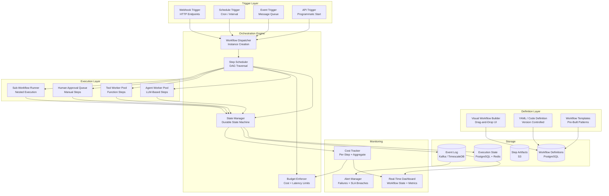
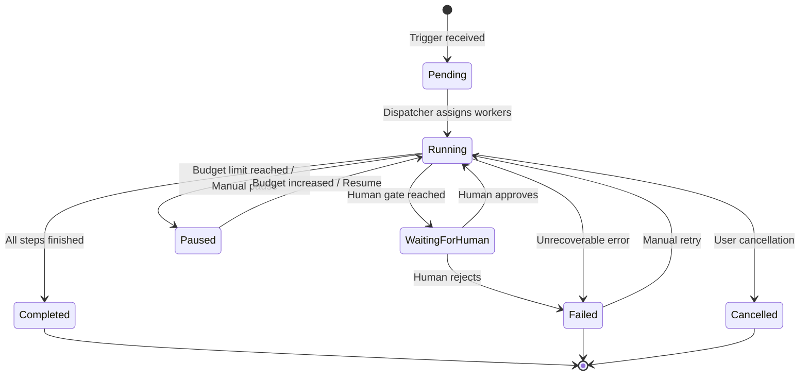
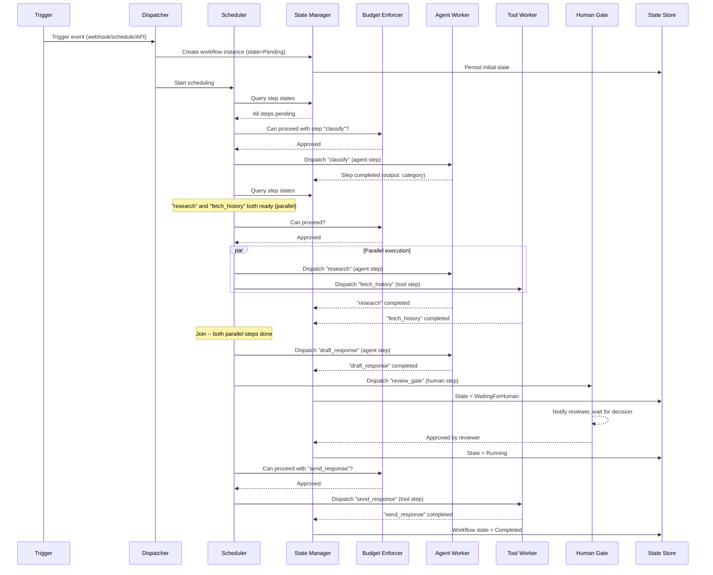

# Workflow Orchestrator

An AI Workflow Orchestrator is a system that defines, executes, and monitors complex workflows composed of AI agents, tools, and human checkpoints. Think of it as Apache Airflow meets LangGraph, purpose-built for agentic AI workloads -- supporting DAG-based workflow definitions, dynamic task routing, parallel execution, error handling with retry policies, human approval gates, sub-workflow composition, cost and latency budgets, and event-driven triggers.

---

## Problem Statement

> "We need a platform that lets teams define multi-step AI workflows as directed acyclic graphs, execute them with support for parallelism and conditional branching, include human-in-the-loop approval gates, enforce cost and latency budgets, and provide real-time visibility into execution state. The system must handle 10,000+ concurrent workflows, survive worker crashes without losing state, and guarantee exactly-once step execution for steps with external side effects."

---

## Clarifying Questions to Ask

1. **Workflow complexity** -- What is the expected number of steps per workflow? Are we looking at simple linear chains (3-5 steps) or complex DAGs with 50+ nodes, fan-out/fan-in patterns, and nested sub-workflows?
2. **Human gate frequency** -- How often do workflows require human approval? Is it every workflow or only for high-risk actions? What is the expected approval turnaround time?
3. **Agent heterogeneity** -- Do workflows mix different LLM providers and models (e.g., a fast classifier on Haiku followed by a deep reasoner on Opus), or do they use a single model throughout?
4. **Determinism expectations** -- How do we handle the non-deterministic nature of LLM steps? Should re-runs of the same workflow with the same inputs produce identical routing decisions?
5. **Multi-tenancy** -- Is this a shared platform serving multiple teams? Do we need tenant-level isolation for budgets, quotas, and workflow definitions?
6. **Integration surface** -- What external systems must workflows interact with (APIs, databases, message queues, file storage)? Are there compliance requirements around data leaving the system?
7. **Versioning and rollback** -- When a workflow definition is updated, what happens to in-flight executions? Do we support running multiple versions simultaneously?
8. **SLA requirements** -- Are there hard deadlines for workflow completion, or are latency budgets advisory? What happens when a budget is exceeded -- pause, alert, or cancel?

---

## Requirements

### Functional Requirements

1. **Workflow definition** -- Define workflows as DAGs with typed inputs/outputs, conditional branching, and loops
2. **Visual workflow builder** -- Drag-and-drop UI for creating and editing workflows
3. **Dynamic task routing** -- Route tasks to different agents or paths based on runtime conditions (rule-based, LLM-classified, or score-threshold strategies)
4. **Parallel execution with join semantics** -- Run independent tasks in parallel; join with configurable merge strategies
5. **Error handling and retry** -- Configurable retry policies (exponential/linear backoff), fallback paths, and dead letter queues
6. **Human approval gates** -- Pause workflow execution pending human review with timeout-based escalation
7. **Sub-workflow composition** -- Nest workflows within workflows for reuse and independent lifecycle management
8. **Real-time monitoring** -- Live dashboard showing workflow state, per-step metrics, token usage, and cost accumulation
9. **Cost and latency budgets** -- Enforce per-workflow and per-step limits on total cost (USD) and execution time
10. **Event-driven triggers** -- Start workflows from webhooks, cron schedules, message queue events, or programmatic API calls
11. **Integration with external systems** -- HTTP APIs, databases, file systems, message brokers

### Non-Functional Requirements

| Requirement | Target |
|-------------|--------|
| Workflow start latency | < 500ms from trigger to first step execution |
| Step scheduling latency | < 100ms between step completion and next step start |
| Concurrent workflows | 10,000+ simultaneous workflow executions |
| Fault tolerance | No workflow lost on worker crash; exactly-once step execution |
| State persistence | Durable; survive system restarts |
| Dashboard latency | < 2s for real-time workflow state |
| API response time | < 200ms for workflow submission |

### Out of Scope

- Agent development, training, or fine-tuning
- Data pipeline ETL (use Airflow/Dagster for that)
- Long-running batch ML training jobs
- End-user authentication and identity management

---

## High-Level Architecture

### Architecture Walkthrough

The architecture is organized into five layers, each with distinct responsibilities.

The **Definition Layer** provides multiple ways to author workflows. A visual drag-and-drop builder serves non-technical users, while YAML and code-based definitions give engineers version-controlled precision. Pre-built templates accelerate adoption for common patterns like customer support pipelines, document processing chains, and content moderation workflows. All definitions are persisted to PostgreSQL as versioned DAG structures.

The **Trigger Layer** accepts workflow start signals from four sources: HTTP webhooks for event-driven integrations, cron-based schedules for periodic runs, message queue consumers for event streaming architectures, and a direct API for programmatic invocation. Each trigger creates a workflow instance and hands it to the Dispatcher.

The **Orchestration Engine** is the brain of the system. The Dispatcher validates the trigger payload, creates a workflow instance with initial state, and passes it to the Step Scheduler. The Scheduler performs DAG traversal to identify steps whose dependencies are fully satisfied, then dispatches them to the appropriate worker pool. The State Manager maintains a durable state machine for every workflow and step, persisting transitions to PostgreSQL with Redis caching for hot-path reads. The Budget Enforcer checks cost and latency limits before every step dispatch, pausing workflows that approach their budgets.

The **Execution Layer** contains four specialized worker pools. Agent Workers execute LLM-based steps by invoking the configured model with the step's prompt and context. Tool Workers run deterministic function steps such as API calls, database queries, or file operations. The Human Approval Queue parks workflow execution and notifies the assigned reviewer via the notification service. Sub-Workflow Runners spawn nested workflow instances, treating them as atomic steps in the parent workflow.

The **Monitoring** layer provides real-time visibility. The Dashboard consumes events from Kafka and displays live workflow state, per-step timings, token usage, and cost accumulation via WebSocket push. The Alert Manager watches for failures, SLA breaches, and budget warnings. The Cost Tracker aggregates spend per step, per workflow, and per tenant.

---

## Workflow State Machine

Each workflow instance follows a state machine that governs its lifecycle.

---

## Component Design

### 1. Workflow Definition and DAG Model

A workflow is modeled as a directed acyclic graph where each node is a **StepDefinition** and each edge carries an optional condition expression. The WorkflowDefinition contains the full set of steps, edges, trigger configurations, budget limits, and a global error policy.

Each step has a **type** that determines its execution semantics: `agent` (LLM invocation), `tool` (deterministic function), `human_gate` (manual approval), `sub_workflow` (nested execution), or `router` (dynamic branching). Steps carry typed input and output schemas that enable compile-time validation -- the system checks that every edge connects compatible types before the workflow is saved.

Validation at definition time catches several classes of errors: cycles in the graph, edges referencing nonexistent steps, unreachable steps that no path can reach, and type mismatches between connected steps. This fail-fast approach prevents runtime surprises.

An example workflow for customer support might chain five steps: a classifier agent (Haiku, 30s timeout) feeds into a researcher agent (Sonnet, 120s timeout), whose output goes to a draft-response agent (Sonnet, 60s timeout), then to a human approval gate (assigned to support leads, 4-hour timeout), and finally to an email-sending tool step. The entire workflow carries a budget of $2.00 and a 10-minute wall-clock limit.

### 2. Step Scheduler with DAG Traversal

The Step Scheduler is responsible for determining which steps are ready to execute at any given moment. It performs a dependency scan across all pending steps in a workflow instance, checking three conditions for each: (a) all upstream dependencies have completed, (b) any conditional edge evaluates to true, and (c) the budget enforcer approves proceeding.

Steps that pass all three checks are marked as "running" and dispatched to the appropriate worker pool based on their type -- agent steps go to the agent queue, tool steps to the tool queue, human gates to the approval queue, and sub-workflows to the sub-workflow runner. Before dispatch, the scheduler collects the outputs of all upstream steps to assemble the input payload for the next step.

When a step with a conditional edge fails its condition check, the scheduler marks it as "skipped" rather than "failed," allowing the rest of the DAG to proceed. If the budget enforcer denies a step, the entire workflow transitions to "paused" and an alert is fired to operators.

The scheduler uses **lock-free DAG traversal** with optimistic concurrency on state updates. This means multiple scheduler instances can process different workflows simultaneously without contending on shared locks. For a single workflow, step state transitions are serialized through compare-and-swap operations on the state store.

### 3. Dynamic Task Router

The router step is a special node type that evaluates runtime conditions to determine which downstream path the workflow should follow. Three routing strategies are supported.

**Rule-based routing** evaluates a list of condition expressions against the step's input data in order, selecting the first matching route. This is deterministic and fast, suitable for well-understood branching logic.

**LLM-classified routing** sends the input data and a description of available routes to a lightweight LLM, which selects the best-matching route. This handles ambiguous or natural-language inputs where rules would be brittle. A default route is always configured as a fallback in case the LLM returns an unrecognized route ID.

**Score-threshold routing** compares a numeric score in the input against configured thresholds to select the appropriate path. This is common for confidence-based branching, such as routing low-confidence classifications to a human reviewer.

### 4. Error Handling and Retry Policies

Every step carries a RetryPolicy that specifies the maximum number of retries, the base delay, the maximum delay, the backoff strategy (exponential or linear), and a list of retryable error types (timeout, rate limit, transient). An optional fallback step can be configured to execute when all retries are exhausted.

When a step fails, the error handler follows a decision cascade. First, it checks whether retries remain -- if so, it computes the backoff delay and schedules a retry. Second, if retries are exhausted and a fallback step is configured, the handler redirects execution to the fallback. Third, it consults the workflow-level error policy: "continue" skips the failed step and proceeds, "pause" halts the workflow for manual intervention, and "fail" terminates the entire workflow.

Exponential backoff uses the formula `min(base_delay * 2^attempt, max_delay)`, while linear backoff uses `min(base_delay * (attempt + 1), max_delay)`. For a default policy with base delay 2s and max delay 60s, the exponential sequence is 2s, 4s, 8s -- aggressive enough to recover from transient failures without overwhelming the upstream service.

### 5. Human Approval Gates

Human approval gates pause workflow execution and create an approval request assigned to a specific role (e.g., "support_lead", "compliance_officer"). The request includes the workflow context, the data produced by upstream steps, and a deadline computed from the step's configured timeout (default: 24 hours).

The notification service delivers the approval request via the configured channels (email, Slack, in-app notification) with a direct link to the approval UI. The UI presents the full context, upstream step outputs, and action buttons for approve or reject. Reviewers can attach notes that flow back into the workflow as additional context for downstream steps.

On approval, the scheduler resumes the workflow from the gate step, injecting any reviewer-provided modifications into the step output. On rejection, the step is marked as failed and the workflow-level error policy determines next steps (typically failing the workflow or routing to an exception-handling sub-workflow).

If the deadline passes without a decision, the system escalates to the next tier of reviewers or auto-rejects based on the workflow's escalation policy.

### 6. Cost and Latency Budget Enforcement

Budget enforcement operates at two levels. **Per-step limits** cap the cost of any individual step (e.g., a research agent step capped at $0.50). **Per-workflow limits** cap the aggregate cost and wall-clock duration of the entire execution (e.g., $2.00 total and 10 minutes).

Before every step dispatch, the budget enforcer queries the cost tracker for the workflow's accumulated spend, estimates the cost of the next step (using the step's configured limit or a historical average for the step type and model), and compares the projected total against the budget. If the budget would be exceeded, the workflow pauses and an alert fires.

For latency budgets, the enforcer computes elapsed time since workflow start and compares it against the configured maximum duration. This catches runaway workflows that might be stuck in retry loops or waiting on slow external services.

Cost estimation for LLM steps uses historical per-model averages maintained by the cost tracker. When no history exists for a step type, a conservative default estimate of $0.10 is used. As the system accumulates execution data, estimates become increasingly accurate.

### 7. Real-Time Monitoring Dashboard

The monitoring dashboard provides a live view of every workflow instance. For each workflow, it displays the overall state, elapsed time, a per-step breakdown (state, start/end times, cost, token usage, error messages, retry count), total accumulated cost, remaining budget, and any pending approval requests.

The dashboard is powered by a WebSocket push architecture. As the state manager commits step transitions, it publishes events to Kafka. The dashboard service consumes these events and pushes updates to connected clients in real time, achieving sub-2-second latency from state change to screen update.

Historical views use pre-aggregated metrics stored in TimescaleDB, enabling efficient queries over workflow completion rates, average durations, cost distributions, and failure patterns across time ranges.

---

## Data Flow

The following sequence illustrates the end-to-end flow for a workflow that includes parallel steps and a human approval gate.

**Walkthrough**: A trigger event arrives at the Dispatcher, which creates a new workflow instance in Pending state and persists it. The Scheduler begins DAG traversal, identifies the entry step ("classify"), checks the budget, and dispatches it to an Agent Worker. When classify completes, the Scheduler finds two steps with satisfied dependencies ("research" and "fetch_history") and dispatches them in parallel. Once both complete (the join point), the Scheduler dispatches "draft_response." After that step completes, the workflow enters the human approval gate -- the instance transitions to WaitingForHuman state while a reviewer is notified. Upon approval, the workflow resumes, the final "send_response" tool step executes, and the workflow transitions to Completed.

---

## Scaling Considerations

| Component | Strategy |
|-----------|----------|
| Workflow Dispatcher | Partitioned by workflow_id using consistent hashing for affinity; horizontally scalable across multiple instances |
| Step Scheduler | Lock-free DAG traversal with optimistic concurrency on state updates; each scheduler instance handles a partition of workflows |
| Agent Workers | Auto-scaled pool with per-model queues for GPU efficiency; scale based on queue depth per model type |
| Tool Workers | Stateless function execution; scale horizontally based on queue depth |
| State Store | PostgreSQL for durability with Redis for hot state and distributed locking; read replicas for dashboard queries |
| Event Log | Kafka for high-throughput event streaming; TimescaleDB for queryable historical metrics |
| Dashboard | WebSocket push for real-time updates; pre-aggregated metrics for historical views; CDN-cached static assets |

### Fault Tolerance

| Failure Mode | Recovery Strategy |
|-------------|-------------------|
| Worker crash mid-step | Step timeout triggers retry; idempotent step execution with idempotency keys prevents duplicate side effects |
| Scheduler crash | State persisted in DB; new scheduler resumes from last committed state via leader election |
| Database unavailable | Queue backs up; steps retry with backoff; no data loss due to write-ahead logging |
| LLM provider outage | Model router fails over to alternative provider; degraded routing uses rule-based fallback |
| Network partition | Workflow pauses automatically; resumes when connectivity restored; fencing tokens prevent split-brain |

---

## Cost Analysis

| Component | Cost Driver | Estimated Monthly Cost (10K concurrent workflows) |
|-----------|-------------|---------------------------------------------------|
| Orchestration Engine (Scheduler, Dispatcher) | Compute (CPU-bound) | $800-1,200 (4-6 instances, c5.xlarge equivalent) |
| Agent Workers | LLM API calls + compute | $5,000-50,000+ (depends entirely on model mix and step count) |
| PostgreSQL (State Store) | Storage + IOPS | $400-800 (db.r6g.xlarge with provisioned IOPS) |
| Redis (Hot State) | Memory | $200-400 (cache.r6g.large) |
| Kafka (Event Log) | Throughput + storage | $300-600 (3-broker cluster) |
| S3 (Artifacts) | Storage + requests | $50-200 |
| Dashboard / Monitoring | Compute + WebSocket connections | $200-400 |
| **Total (excluding LLM costs)** | | **$1,950-3,600/month** |

The dominant cost is LLM API usage, which is why per-step and per-workflow budget enforcement is critical. Infrastructure costs are modest relative to the LLM spend for most deployments.

---

## Trade-offs & Alternatives

| Decision | Rationale | Alternative | Why Not |
|----------|-----------|-------------|---------|
| PostgreSQL + Redis for state | Redis provides sub-millisecond reads for hot state; PostgreSQL guarantees durability and survives full Redis loss | Redis only | A Redis crash would lose in-flight workflow state; unacceptable for production workflows with side effects |
| DAG with per-step state machine | DAG captures workflow structure; state machine captures step lifecycle (pending, running, retrying, completed, failed) | Pure DAG without state machine | Loses granularity on retry state, pause/resume semantics, and human gate transitions |
| Capped parallelism per workflow | Prevents a single workflow from starving others for worker resources; controls cost accumulation rate | Unlimited parallelism | A 50-step fan-out could consume the entire agent pool and blow through budgets before enforcement can react |
| Async human gates with timeout | Humans respond in minutes to hours; blocking a thread or worker during that time wastes resources | Synchronous blocking | Would require one thread per waiting approval; at scale, thousands of blocked threads is untenable |
| Separate instances for sub-workflows | Each sub-workflow gets independent state tracking, retry policy, budget, and monitoring | Inline expansion into parent DAG | Loses isolation; a failure in the sub-workflow contaminates the parent's step state; cannot reuse sub-workflows independently |
| Kafka for event log | High throughput, durable, replayable; supports multiple consumers (dashboard, alerting, analytics) | Direct database writes | Cannot support real-time push to dashboard at scale; loses replay capability for debugging |
| Idempotency keys for side-effecting steps | Guarantees exactly-once execution semantics even after retries | No idempotency enforcement | Retrying an email-send step would send duplicate emails; retrying an API call could create duplicate records |

---

## Interview Tips

:::tip How to Present This (35 minutes)

**Minutes 0-2: Clarify scope.** Ask about workflow complexity, human gate frequency, multi-tenancy needs, and SLA expectations. Confirm whether this is a platform serving multiple teams or a single-application orchestrator.

**Minutes 2-5: Workflow definition model.** Explain the DAG-of-steps model with typed edges and conditional branching. Mention compile-time validation (cycle detection, type compatibility, reachability). This shows you think about developer experience and fail-fast design.

**Minutes 5-8: State machine design.** Draw the workflow state machine on the whiteboard. Walk through the key transitions: Pending to Running, Running to WaitingForHuman, and the Paused state for budget enforcement. Emphasize that every transition is persisted durably before proceeding.

**Minutes 8-14: DAG scheduler deep dive.** This is the core algorithm. Explain dependency resolution, parallel dispatch, join semantics, and how conditional edges cause steps to be skipped rather than failed. Mention the budget check gate before every dispatch.

**Minutes 14-17: Error handling.** Walk through the retry decision cascade: retry with backoff, fallback step, workflow-level policy (continue/pause/fail). Mention idempotency keys for side-effecting steps -- this is the detail that separates senior candidates.

**Minutes 17-20: Human approval gates.** Explain the async model with timeout-based escalation. Highlight that the workflow instance transitions to WaitingForHuman state and releases all worker resources. Mention that reviewer notes flow back into the workflow as additional context.

**Minutes 20-23: Budget enforcement.** Explain dual-level enforcement (per-step and per-workflow) for both cost and latency. Mention cost estimation using historical averages. This demonstrates you understand the operational reality of LLM costs.

**Minutes 23-27: Monitoring and observability.** Describe the event-driven architecture: state changes publish to Kafka, dashboard consumes via WebSocket push. Mention pre-aggregated metrics for historical analysis.

**Minutes 27-30: Scaling and fault tolerance.** Cover partitioned dispatching, lock-free scheduling, auto-scaled worker pools, and the PostgreSQL + Redis hybrid for state. Walk through the crash recovery scenario: worker dies mid-step, timeout fires, scheduler retries with idempotency key.

**Minutes 30-35: Trade-offs and extensions.** Discuss the key trade-offs table. If time permits, mention extensions: workflow versioning with in-flight migration, A/B testing of workflow variants, and cross-region execution for compliance.

**Key signals interviewers look for:**
- You model the workflow as a DAG with a separate state machine per step (not just per workflow)
- You enforce budgets proactively (before dispatch, not after completion)
- You handle human gates asynchronously without blocking workers
- You guarantee exactly-once semantics for side-effecting steps via idempotency keys
- You separate hot state (Redis) from durable state (PostgreSQL) with clear reasoning

:::
