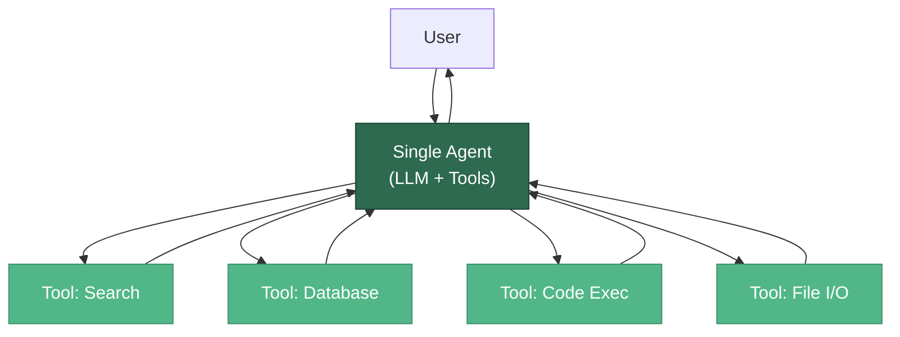
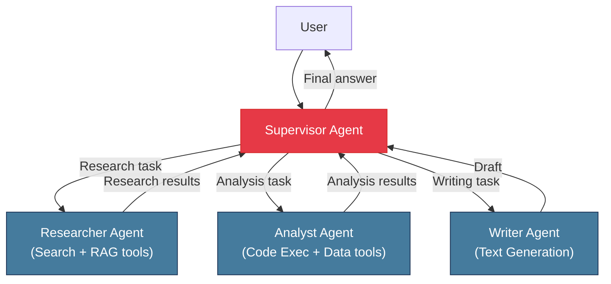
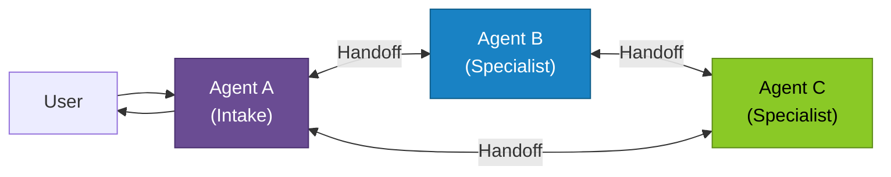
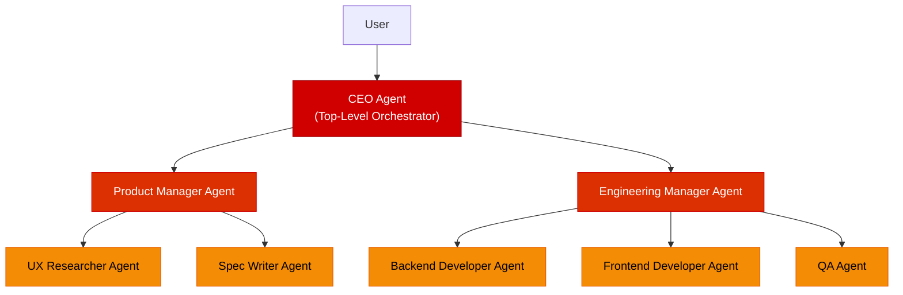
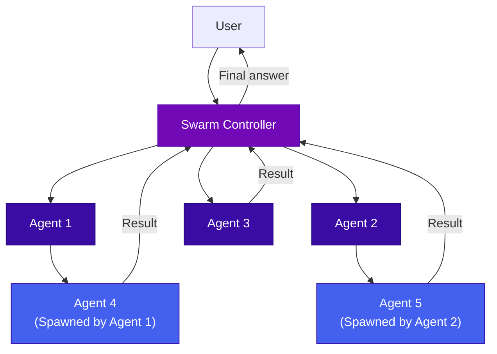
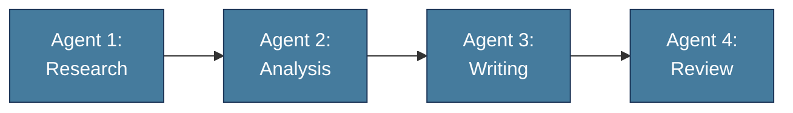
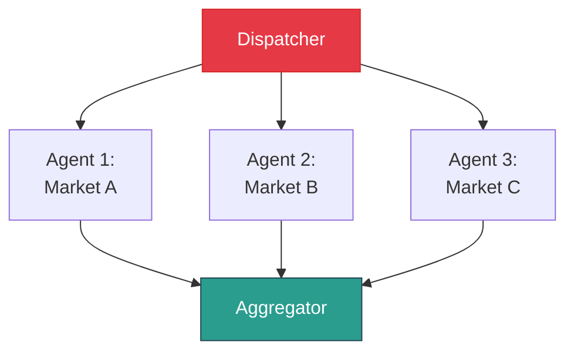
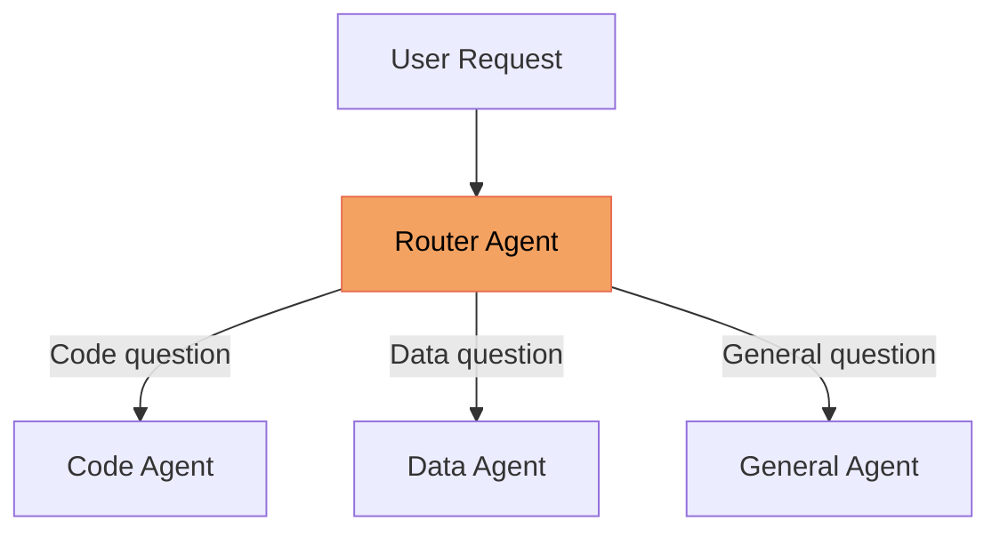
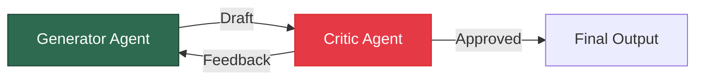
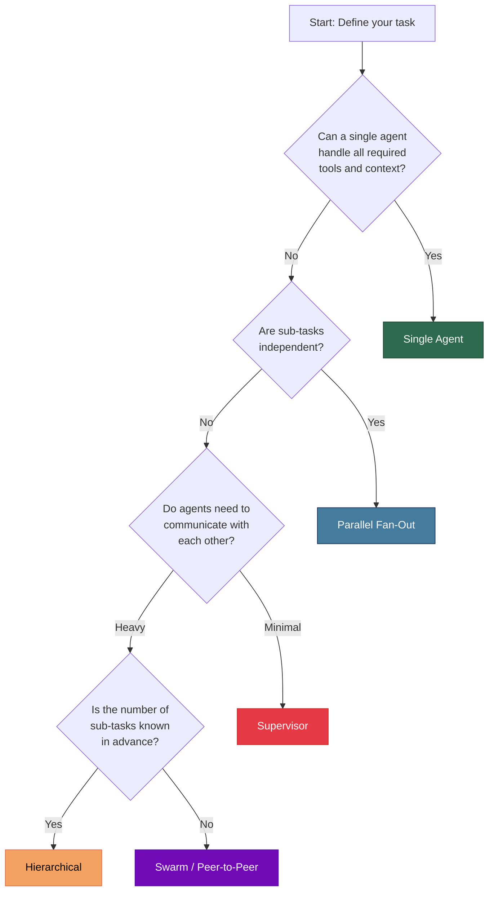

# Agent Architectures

The architecture of an agent system determines how work is organized, how decisions are made, and how the system scales. This page covers the major architectural patterns -- from a single agent handling everything to complex multi-agent systems where specialized agents collaborate.

---

## Single-Agent Architecture

The simplest architecture: one LLM-powered agent with access to a set of tools, operating in a single reasoning loop.



### When to Use

- The task can be accomplished with a manageable number of tools (fewer than ~15-20)
- There is no need for specialized roles or expertise
- Low latency is important (single LLM call chain)
- The problem fits within a single context window

### Limitations

- **Context window pressure**: One agent must hold the entire task state, all tool schemas, instructions, and conversation history
- **Jack of all trades**: A single system prompt must cover all capabilities, which degrades quality as complexity grows
- **No parallelism**: Steps execute sequentially within the loop
- **Blast radius**: A failure in reasoning affects the entire task

---

## Multi-Agent Architectures

When tasks grow in complexity, splitting work across multiple specialized agents offers better modularity, parallelism, and reliability.

### Why Go Multi-Agent?

| Benefit | Explanation |
|---------|-------------|
| **Specialization** | Each agent has a focused system prompt and a small, relevant tool set |
| **Parallelism** | Independent sub-tasks can run concurrently |
| **Context efficiency** | Each agent only needs context relevant to its role |
| **Fault isolation** | One agent's failure does not corrupt the entire system |
| **Scalability** | Add new agents without modifying existing ones |

:::warning Not Always Better
Multi-agent systems introduce communication overhead, coordination complexity, and higher cost. Do not use a multi-agent architecture when a single agent with good tool design will suffice. Complexity should be driven by genuine need.
:::

---

### Pattern 1: Supervisor Architecture

A **supervisor agent** (also called orchestrator or manager) receives the user request, delegates sub-tasks to specialized worker agents, collects their results, and synthesizes the final response.



**Characteristics:**
- Centralized decision-making: the supervisor decides what to delegate and when
- Workers do not communicate with each other directly
- The supervisor maintains the global state and plan
- Workers can be implemented as simple tool-augmented agents or even deterministic functions

**Implementation with LangGraph:**

```python
from __future__ import annotations

from typing import Annotated, Literal, TypedDict

from langchain_core.messages import AnyMessage, HumanMessage
from langchain_openai import ChatOpenAI
from langgraph.graph import END, StateGraph
from langgraph.graph.message import add_messages
from langgraph.prebuilt import create_react_agent
from pydantic import BaseModel


# --- Shared state -------------------------------------------------------

class SupervisorState(TypedDict):
    messages: Annotated[list[AnyMessage], add_messages]
    next_worker: str


# --- Worker agents (each a ReAct sub-agent) -----------------------------

researcher = create_react_agent(
    ChatOpenAI(model="gpt-4o", temperature=0),
    tools=[],  # bind search / RAG tools here
    prompt="You are a research specialist. Find factual information.",
)

analyst = create_react_agent(
    ChatOpenAI(model="gpt-4o", temperature=0),
    tools=[],  # bind data / code-exec tools here
    prompt="You are a data analyst. Analyze data and produce insights.",
)

writer = create_react_agent(
    ChatOpenAI(model="gpt-4o", temperature=0),
    tools=[],
    prompt="You are a professional writer. Produce polished prose.",
)


# --- Supervisor node (routes to workers) --------------------------------

class RouteDecision(BaseModel):
    next: Literal["researcher", "analyst", "writer", "FINISH"]


supervisor_llm = ChatOpenAI(model="gpt-4o", temperature=0)


def supervisor(state: SupervisorState) -> SupervisorState:
    decision: RouteDecision = supervisor_llm.with_structured_output(
        RouteDecision
    ).invoke(
        state["messages"]
        + [HumanMessage(content="Which worker should act next, or FINISH?")]
    )
    return {"next_worker": decision.next}


# --- Build the graph ----------------------------------------------------

def route(state: SupervisorState) -> str:
    return state["next_worker"]


graph = StateGraph(SupervisorState)
graph.add_node("supervisor", supervisor)
graph.add_node("researcher", researcher)
graph.add_node("analyst", analyst)
graph.add_node("writer", writer)

graph.set_entry_point("supervisor")
graph.add_conditional_edges("supervisor", route, {
    "researcher": "researcher",
    "analyst": "analyst",
    "writer": "writer",
    "FINISH": END,
})
for worker_name in ["researcher", "analyst", "writer"]:
    graph.add_edge(worker_name, "supervisor")  # results flow back

supervisor_agent = graph.compile()
```

**Best for:** Tasks with clear sub-task boundaries, teams with distinct expertise areas, systems where you need a single point of control.

---

### Pattern 2: Peer-to-Peer Architecture

Agents communicate directly with each other without a central coordinator. Each agent decides when to pass work to another agent.



**Characteristics:**
- Decentralized control: no single agent is "in charge"
- Agents use **handoffs** to transfer control to the most appropriate peer
- Each agent maintains its own context and tools
- Conversation history may travel with the handoff or be summarized

**Example: Customer service handoff with LangGraph**

LangGraph models peer-to-peer handoffs as **conditional edges** between agent nodes. Each agent can route to any peer based on the conversation content.

```python
from __future__ import annotations

from typing import Annotated, Literal, TypedDict

from langchain_core.messages import AnyMessage, HumanMessage
from langchain_openai import ChatOpenAI
from langgraph.graph import END, StateGraph
from langgraph.graph.message import add_messages
from pydantic import BaseModel


class HandoffState(TypedDict):
    messages: Annotated[list[AnyMessage], add_messages]


llm = ChatOpenAI(model="gpt-4o", temperature=0)


class HandoffDecision(BaseModel):
    next: Literal["sales", "support", "billing", "DONE"]
    reason: str


def make_agent_node(persona: str):
    """Factory: creates an agent node with a specific persona."""
    def node_fn(state: HandoffState) -> HandoffState:
        response = llm.invoke(
            [{"role": "system", "content": persona}] + state["messages"]
        )
        return {"messages": [response]}
    return node_fn


def decide_handoff(state: HandoffState) -> str:
    decision: HandoffDecision = llm.with_structured_output(
        HandoffDecision
    ).invoke(
        state["messages"]
        + [HumanMessage(content=(
            "Based on the conversation, should control stay here or hand off? "
            "Options: sales, support, billing, DONE."
        ))]
    )
    return decision.next


graph = StateGraph(HandoffState)
graph.add_node("sales", make_agent_node("You are a sales agent."))
graph.add_node("support", make_agent_node("You are a tech-support agent."))
graph.add_node("billing", make_agent_node("You are a billing agent."))

graph.set_entry_point("sales")
for agent_name in ["sales", "support", "billing"]:
    graph.add_conditional_edges(agent_name, decide_handoff, {
        "sales": "sales", "support": "support",
        "billing": "billing", "DONE": END,
    })

handoff_agent = graph.compile()
```

**Best for:** Customer service routing, conversational systems where the user's needs evolve, systems where agents have overlapping but distinct capabilities.

---

### Pattern 3: Hierarchical Architecture

A multi-level tree where a top-level agent delegates to mid-level agents, which in turn delegate to worker agents. This is the supervisor pattern applied recursively.



**Characteristics:**
- Each level adds a layer of abstraction and planning
- Mid-level agents can run their own sub-teams in parallel
- Information flows up (results) and down (tasks)
- Most similar to how large organizations operate

**Best for:** Complex projects with multiple workstreams, systems requiring different levels of planning granularity, enterprise workflows with established team structures.

---

### Pattern 4: Swarm Architecture

A dynamic, self-organizing system where many lightweight agents work on a shared task. Agents can spawn new agents, merge results, and adapt to changing conditions.



**Characteristics:**
- Agents are lightweight and often share the same base prompt with different context
- The number of active agents is dynamic -- they are created and destroyed as needed
- Communication happens through a shared state or message bus
- Particularly effective for exploration tasks (search, code generation, brainstorming)

**Swarm pattern with LangGraph:**

LangGraph provides `create_swarm` for building swarm-style multi-agent systems where agents hand off to each other dynamically via tool calls.

```python
from __future__ import annotations

from langchain_core.tools import tool
from langchain_openai import ChatOpenAI
from langgraph.prebuilt import create_react_agent
from langgraph_swarm import create_handoff_tool, create_swarm


# --- Handoff tools (each agent gets tools to transfer to peers) ---------

handoff_to_billing = create_handoff_tool(
    agent_name="billing",
    description="Transfer to the billing agent for invoices, refunds, and payments.",
)
handoff_to_technical = create_handoff_tool(
    agent_name="technical",
    description="Transfer to technical support for troubleshooting and bugs.",
)
handoff_to_triage = create_handoff_tool(
    agent_name="triage",
    description="Transfer back to triage if the issue was misrouted.",
)


# --- Domain tools -------------------------------------------------------

@tool
def lookup_invoice(invoice_id: str) -> str:
    """Look up an invoice by ID."""
    return f"Invoice {invoice_id}: $99.00, paid 2026-01-15"


@tool
def search_kb(query: str) -> str:
    """Search the knowledge base for troubleshooting articles."""
    return f"KB results for '{query}': ..."


# --- Agent definitions --------------------------------------------------

llm = ChatOpenAI(model="gpt-4o", temperature=0)

triage = create_react_agent(
    llm,
    tools=[handoff_to_billing, handoff_to_technical],
    prompt="You are a triage agent. Classify the issue and hand off.",
    name="triage",
)

billing = create_react_agent(
    llm,
    tools=[lookup_invoice, handoff_to_triage],
    prompt="You are a billing specialist. Handle payment inquiries.",
    name="billing",
)

technical = create_react_agent(
    llm,
    tools=[search_kb, handoff_to_triage],
    prompt="You are a tech-support specialist. Troubleshoot issues.",
    name="technical",
)


# --- Compile the swarm --------------------------------------------------

swarm = create_swarm(
    agents=[triage, billing, technical],
    default_active_agent="triage",
).compile()
```

**Best for:** Customer service with many specialties, parallel exploration (generate-and-filter), tasks where the number of sub-tasks is not known upfront.

---

## Agent Orchestration Patterns

Beyond the high-level architecture, there are specific patterns for how agents are orchestrated within these architectures.

### Sequential Chain

Agents execute in a fixed order. Output of one becomes input of the next.



### Parallel Fan-Out / Fan-In

Multiple agents work simultaneously on independent sub-tasks. Results are merged.



### Conditional Routing

A router agent inspects the task and directs it to the appropriate specialist.



### Iterative Debate / Critique

Two or more agents take opposing roles (generator vs. critic) and iterate until the output meets quality standards.



---

## Choosing the Right Architecture

Use this decision framework to select the appropriate architecture for your use case.



### Architecture Comparison Matrix

| Criterion | Single Agent | Supervisor | Peer-to-Peer | Hierarchical | Swarm |
|-----------|-------------|------------|--------------|--------------|-------|
| **Complexity** | Low | Medium | Medium | High | High |
| **Latency** | Lowest | Medium | Variable | Highest | Variable |
| **Cost** | Lowest | Medium | Medium | Highest | Variable |
| **Fault tolerance** | None | Moderate | Good | Good | Best |
| **Scalability** | Limited | Good | Good | Excellent | Excellent |
| **Debugging** | Easiest | Moderate | Hard | Hard | Hardest |
| **Best for** | Simple tasks | Clear delegation | Routing/handoff | Complex projects | Exploration |

:::tip Start Simple, Scale Up
Begin with a single agent. When you hit limitations (context window overflow, quality degradation from too many tools, need for parallelism), refactor to a supervisor architecture. Only adopt hierarchical or swarm patterns when the task complexity genuinely demands it.
:::

---

## Communication Between Agents

How agents exchange information is critical to multi-agent system design.

### Direct Message Passing

Agents send structured messages directly to each other. Simple but creates tight coupling.

### Shared State (Blackboard)

All agents read from and write to a shared state object. This is the default pattern in LangGraph -- every node receives the full state and returns a partial update that is merged back.

```python
from __future__ import annotations

from typing import Annotated, TypedDict

from langchain_core.messages import AnyMessage
from langgraph.graph.message import add_messages


class SharedState(TypedDict):
    """Shared state accessible by all agents in a LangGraph multi-agent graph."""
    messages: Annotated[list[AnyMessage], add_messages]
    user_request: str
    research_findings: list[str]
    analysis_results: dict[str, str]
    draft_report: str
    review_feedback: list[str]
    final_output: str
    iteration_count: int


# Every node function has the same signature:
#   def node(state: SharedState) -> dict:  # returns a *partial* update
#       ...
# LangGraph merges the returned dict into the full state automatically.
# The `add_messages` reducer on the messages field appends rather than
# overwrites, giving agents a shared conversation history.
```

### Event Bus / Message Queue

Agents publish events and subscribe to topics. Fully decoupled but adds infrastructure complexity. Best for production systems with many agents.

---

## Summary

- **Single-agent** architecture is the default starting point -- simple, fast, and easy to debug.
- **Supervisor** architecture introduces delegation with centralized control -- the most common multi-agent pattern.
- **Peer-to-peer** architecture enables direct agent-to-agent handoffs -- ideal for routing and conversational systems.
- **Hierarchical** architecture layers multiple levels of delegation -- suited for complex, enterprise-scale projects.
- **Swarm** architecture uses dynamic, self-organizing agents -- powerful for exploration and adaptive workloads.
- **Orchestration patterns** (sequential, parallel, conditional, debate) can be applied within any architecture.
- Always choose the simplest architecture that meets your requirements.

---

## Further Reading

- [What Are AI Agents?](./what-are-agents.md) -- Foundational agent concepts.
- [Planning and Reasoning](./planning-and-reasoning.md) -- How agents within these architectures plan and coordinate.
- [Guardrails and Safety](./guardrails-and-safety.md) -- Safety considerations for multi-agent systems.
