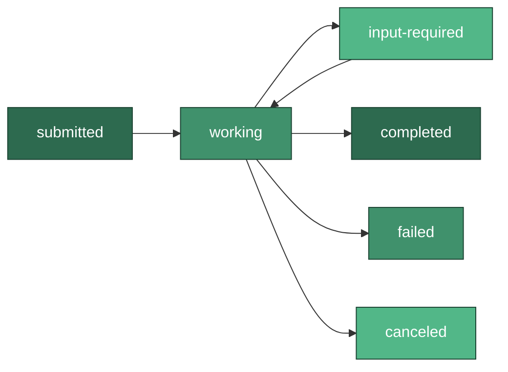
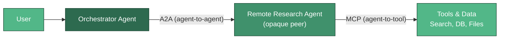

# Agent Interoperability Protocols (A2A)

Most multi-agent systems today run **in-process**: a single codebase wires several agents together with a framework like LangGraph or CrewAI, sharing memory, tools, and state. But the moment agents are built by **different teams, frameworks, or vendors**, that shared-memory assumption breaks. Agent interoperability protocols standardize how autonomous agents discover and delegate work to one another as **opaque peers** across a network boundary -- without exposing their internal state, memory, prompts, or tools. The dominant emerging standard is Google's **Agent-to-Agent (A2A)** protocol.

---

## When You Need Cross-Vendor Interop

The first design decision is whether you need a wire protocol at all. In-process orchestration is simpler, faster, and easier to debug -- reach for interop protocols only when a real boundary exists.

| Dimension | In-Process Orchestration | Cross-Boundary Interop (A2A) |
|-----------|--------------------------|------------------------------|
| Ownership | One team, one codebase | Different orgs / vendors / teams |
| Framework | Single (LangGraph, CrewAI, AutoGen) | Mixed and independent |
| State sharing | Shared memory and objects | None -- agents are opaque |
| Transport | Function calls | HTTP + JSON-RPC 2.0 over the network |
| Coupling | Tight | Loose, contract-based |
| Discovery | Import / registry in code | Agent Card over HTTP |
| Best for | Cohesive apps, low latency | Federated ecosystems, third-party agents |

:::tip Rule of thumb
If both agents live in the same repository and can `import` each other, use in-process orchestration. Introduce A2A only when you cross an organizational or network boundary and cannot (or should not) see inside the other agent.
:::

---

## Google A2A

Google introduced **A2A** in April 2025 and donated it to the **Linux Foundation** in June 2025, with 150+ organizations backing the specification. It gives independently built agents a common language for delegation.

- **Transport:** HTTP with **JSON-RPC 2.0** as the baseline (later bindings add gRPC and plain REST).
- **Opacity:** A remote agent is a black box. It exposes *what* it can do via its Agent Card, never *how* it does it -- no internal tools, prompts, or memory leak across the boundary. This is the key contrast with in-process multi-agent systems.
- **Long-running work:** Tasks can stream incremental updates via Server-Sent Events (SSE) or push notifications, so a client can delegate a job that takes minutes or hours.

### Core Objects

| Object | Role |
|--------|------|
| **Agent Card** | Machine-readable capability manifest (discovery) |
| **Task** | A unit of work with a lifecycle and a stable ID |
| **Message** | A turn in the conversation between client and agent |
| **Part** | A typed chunk of content inside a message (text, file, data) |
| **Artifact** | A durable output the agent produces for a task |

### Task Lifecycle

A task moves through a well-defined set of states, which lets clients handle async and human-in-the-loop flows predictably.



The `input-required` state is what makes A2A suitable for real delegation: a remote agent can pause, ask the client for clarification, and resume -- without the client knowing anything about its internals.

---

## Agent Cards

Discovery is anchored on a small JSON document published at a **well-known URL**: `/.well-known/agent-card.json` (renamed from the earlier `agent.json`). A client fetches it to learn an agent's skills, input/output modes, transport, and security schemes before ever sending a task.

```python
# Conceptual / schema-level Agent Card served at /.well-known/agent-card.json
agent_card = {
    "name": "research-agent",
    "description": "Performs multi-source web research and returns cited summaries.",
    "url": "https://agents.example.com/research",
    "version": "1.0.0",
    "capabilities": {"streaming": True, "pushNotifications": False},
    "defaultInputModes": ["text/plain"],
    "defaultOutputModes": ["text/plain"],
    "skills": [
        {
            "id": "web-research",
            "name": "Web Research",
            "description": "Answer a question with cited sources.",
            "tags": ["research", "search"],
        }
    ],
}
```

Once a client has the card, delegating work is a single JSON-RPC call. The snippet below is **conceptual / schema-level** -- it shows the wire shape rather than binding to any specific A2A SDK version.

```python
# Conceptual / schema-level A2A task request (JSON-RPC 2.0 over HTTP)
import json
import httpx  # or `requests`

request = {
    "jsonrpc": "2.0",
    "id": "req-1",
    "method": "message/send",
    "params": {
        "message": {
            "role": "user",
            "parts": [{"kind": "text", "text": "Summarize the 2025 A2A spec."}],
        }
    },
}


def send_task(base_url: str) -> dict:
    response = httpx.post(f"{base_url}/", json=request, timeout=30)
    response.raise_for_status()
    return response.json()


print(json.dumps(request, indent=2))
```

:::info Discovery, not invocation
The Agent Card only *advertises* capabilities. It never contains prompts, model names, or tool definitions. The client decides whether the advertised skills fit, then sends a Task -- the agent stays opaque throughout.
:::

---

## The Broader Landscape

A2A is the most visible standard, but it sits in a small ecosystem. Two other efforts matter for interview conversations.

| Initiative | Origin | What It Is | Relationship to A2A |
|------------|--------|------------|---------------------|
| **AGNTCY** | Cisco-led, Linux Foundation (July 2025) | An **infrastructure** layer for an "Internet of Agents" -- identity, discovery, and messaging plumbing | Interoperates with A2A and MCP; **not** a wire-protocol competitor |
| **ACP** | IBM Research (March 2025) | A REST-native agent protocol powering the open-source **BeeAI** platform | Announced convergence into A2A |

:::info ACP is converging, not competing
In August–September 2025, ACP announced a merger/convergence **with A2A** under the Linux Foundation. Treat ACP as **converging** toward the shared standard rather than as a live rival protocol. AGNTCY, meanwhile, is complementary infrastructure -- it provides the "roads" on which A2A traffic can travel.
:::

---

## How A2A Complements MCP

The cleanest mental model: **MCP is agent-to-tool; A2A is agent-to-agent.** The [Model Context Protocol](./model-context-protocol) connects a single agent to its tools, data, and context. A2A connects that agent to *other* agents it does not own. They compose rather than compete.



The orchestrator delegates a task to a remote agent over **A2A**. That remote agent -- entirely opaque to the orchestrator -- privately uses **MCP** to reach its own tools and data. Neither protocol has visibility into the other's layer, which is exactly what keeps the boundary clean.

:::warning Do not reach for A2A too early
A2A adds network latency, auth, and failure modes that in-process calls avoid. If you control both agents and they share a runtime, orchestrate them in code. Adopt A2A when opacity and cross-org delegation are genuine requirements, not defaults.
:::

---

## Common Interview Questions

**Q: What problem does A2A solve that a framework like LangGraph or CrewAI does not?**
In-process frameworks assume shared memory, shared tools, and one codebase. A2A targets the opposite: agents built by different teams or vendors that must collaborate over a network as opaque peers, exposing capabilities but never internal state.

**Q: How is A2A different from MCP?**
MCP connects an agent to its tools and context (agent-to-tool). A2A connects an agent to other agents (agent-to-agent). They are complementary: an agent might expose an A2A endpoint to peers while using MCP internally to reach its tools.

**Q: What does "opaque agent" mean and why does it matter?**
An opaque agent advertises only *what* it can do (via its Agent Card) and never *how*. Its prompts, models, memory, and tools stay private. This enables loose coupling and cross-vendor trust: you integrate against a contract, not an implementation.

**Q: How does a client discover an A2A agent's capabilities?**
It fetches the Agent Card at `/.well-known/agent-card.json`, which declares skills, input/output modes, transport, and security schemes. The client uses this to decide whether the agent fits before sending a Task.

**Q: Is ACP a competitor to A2A?**
No longer. ACP (IBM Research, March 2025, powering BeeAI) announced convergence with A2A under the Linux Foundation in late 2025. Frame it as consolidating toward A2A, alongside complementary infrastructure like Cisco-led AGNTCY.

---

## Further Reading

- [Model Context Protocol](./model-context-protocol) -- The complementary agent-to-tool standard A2A composes with.
- [Multi-Agent Communication](../architecture-design/multi-agent-communication.md) -- Messaging patterns for agents that collaborate.
- [Multi-Agent Pattern](../design-patterns/multi-agent-pattern.md) -- When and how to decompose work across agents.
- [Multi-Agent Crew Implementation](../implementations/multi-agent-crew.md) -- A concrete in-process orchestration example.
- [Framework Comparison](../frameworks/framework-comparison.md) -- Choosing between orchestration frameworks before you reach for a wire protocol.
