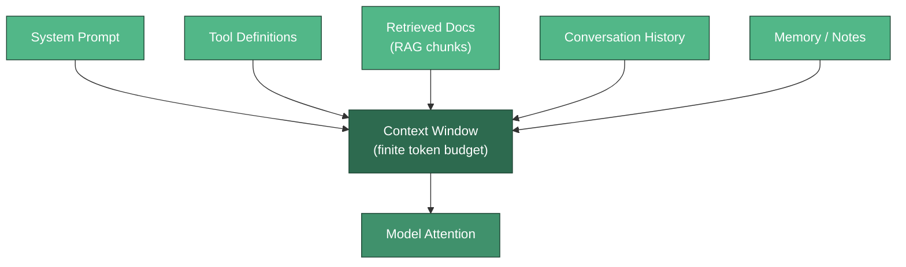
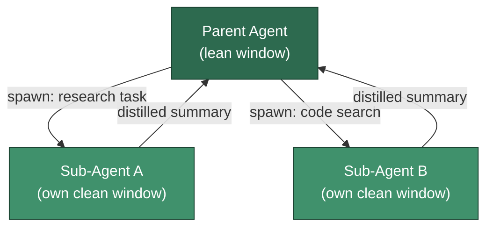

# Context Engineering

**Context engineering is the discipline of curating exactly what occupies a model's finite context window at each step of an agent's run** -- the system prompt, tool definitions, retrieved documents, message history, and memory. It reframes "prompt engineering" as an ongoing *systems* problem: because a model's usable recall degrades as its window fills (a phenomenon called **context rot**), engineers must actively manage context through compaction, note-taking, sub-agent isolation, and tool-result pruning -- all while preserving prompt-cache-friendly stable prefixes. The term was popularized in 2025; Anthropic's ["Effective context engineering for AI agents"](https://www.anthropic.com/engineering/effective-context-engineering-for-ai-agents) (September 2025, released alongside Claude Sonnet 4.5) is the canonical reference.

---

## What Enters the Window

At every turn, the agent runtime assembles a payload of tokens for the model. Each source competes for the same finite budget, so context engineering starts with knowing what is actually in the window and why.

| Source | What It Contains | Stability |
|--------|------------------|-----------|
| System prompt | Role, constraints, output format | Stable (front-load it) |
| Tool definitions | Names, schemas, descriptions | Stable |
| Retrieved docs (RAG) | Chunks fetched for this query | Volatile per turn |
| Conversation history | User/assistant/tool messages | Grows every turn |
| Memory / notes | Facts recalled from durable storage | Selectively injected |



:::info Distinct from RAG
[RAG](../foundations/rag-basics.md) decides **what to retrieve** into the window for a single query. Context engineering decides **what stays in the window** across many turns -- pruning, summarizing, and re-injecting as the run evolves. RAG is one input; context engineering is the ongoing management of all inputs.
:::

---

## Context Rot

A larger context window is not a free lunch. Empirically, a model's ability to accurately recall any single token *decreases* as the total number of tokens rises -- this is **context rot**. The model has a finite *attention budget*, and every token added to the window dilutes the attention available to every other token.

The practical consequence: a fact buried at position 50,000 of a 100,000-token window may be effectively invisible, even though it is technically "in context." Filling the window with marginally relevant material actively degrades performance on the material that matters.

:::warning More context is not strictly better
Stuffing every possibly-relevant document into the prompt hurts more than it helps once you cross the rot threshold. Treat context as a scarce resource with diminishing (then *negative*) returns. Optimize for the smallest set of highest-signal tokens, not the largest set of plausibly-useful ones.
:::

---

## Compaction & Summarization

When a conversation approaches the window limit, **compaction** replaces the bulky older middle of the history with a compact summary and reinitializes the run from it. The engineering skill is in *what you choose to preserve*: keep open decisions, unresolved tasks, and key constraints; discard raw tool dumps, verbose logs, and superseded intermediate steps.

```python
"""Compact a conversation when it grows too large.

Keeps the system prompt and the most recent turns verbatim, and replaces the
older middle of the conversation with a single summary message. The summarizer
is injected so this runs without any LLM dependency.
"""
from typing import Callable

Message = dict  # {"role": str, "content": str}


def estimate_tokens(text: str) -> int:
    # Rough heuristic: ~4 characters per token.
    return max(1, len(text) // 4)


def total_tokens(messages: list[Message]) -> int:
    return sum(estimate_tokens(m["content"]) for m in messages)


def compact_history(
    messages: list[Message],
    summarize: Callable[[str], str],
    token_threshold: int = 2000,
    keep_recent: int = 4,
) -> list[Message]:
    """Return a compacted copy of `messages` if it exceeds the token threshold."""
    if total_tokens(messages) <= token_threshold:
        return messages

    system = [m for m in messages if m["role"] == "system"]
    body = [m for m in messages if m["role"] != "system"]

    recent = body[-keep_recent:]
    older = body[:-keep_recent]
    if not older:
        return messages

    transcript = "\n".join(f"{m['role']}: {m['content']}" for m in older)
    summary_msg: Message = {
        "role": "system",
        "content": "Summary of earlier conversation:\n" + summarize(transcript),
    }
    # NOTE: compaction invalidates the prompt cache for everything after the summary.
    return system + [summary_msg] + recent


if __name__ == "__main__":
    fake_summarize = lambda text: f"[{len(text)} chars condensed to key decisions]"
    convo = [{"role": "system", "content": "You are a helpful research agent."}]
    for i in range(20):
        convo.append({"role": "user", "content": f"Question {i} " * 30})
        convo.append({"role": "assistant", "content": f"Answer {i} " * 30})

    compacted = compact_history(convo, fake_summarize)
    print(f"Before: {len(convo)} msgs / {total_tokens(convo)} tokens")
    print(f"After:  {len(compacted)} msgs / {total_tokens(compacted)} tokens")
```

---

## Structured Note-Taking / Scratchpads

Compaction is lossy, and window resets discard everything not carried forward. **Structured note-taking** gives the agent an escape hatch: it writes durable notes to *external* storage -- a `NOTES.md` file, a database row, a scratchpad object -- that survive compaction and even full session restarts. On its next turn (or next session), the agent re-reads those notes back into the window on demand.

This decouples what the agent *knows* from what currently *fits*. A long-running agent might record its plan, discovered facts, and dead-ends to `NOTES.md`, let the raw exploration fall out of the window during compaction, then reload only the distilled notes. See [Memory Systems](./memory-systems.md) and [Memory & State Management](../architecture-design/memory-and-state-management.md) for durable-store patterns.

---

## Sub-Agent Context Isolation

Instead of one agent accumulating a bloated window, a parent agent can spawn **sub-agents**, each with a clean, purpose-built context. A sub-agent does the heavy, token-hungry work (reading twenty files, crawling logs) in *its own* window, and returns only a distilled summary to the parent. The parent's window stays lean.



The raw tool outputs and intermediate reasoning never touch the parent's context -- only the compressed result crosses the boundary. This is the context-management rationale behind multi-agent architectures.

---

## Tool-Result Pruning

Tool calls return large payloads -- API responses, file contents, search results. Once the agent has extracted what it needs from a result, the raw output is dead weight. **Tool-result pruning** truncates or drops stale, large tool outputs after they have been consumed, keeping only the extracted conclusion.

| Strategy | When to Apply |
|----------|---------------|
| Truncate | Output exceeds a size cap; keep the head/tail |
| Replace with reference | Store full output externally, keep a pointer |
| Drop after consumption | The agent has already acted on the result |
| Summarize in place | Result is still relevant but verbose |

A common pattern: keep the *most recent* tool result in full (the agent may still be reasoning over it) and collapse older ones to a one-line marker like `[tool_result: 12 flights fetched, top 3 kept]`.

---

## Prompt & KV Caching Interplay

Providers cache the KV state of a **stable prefix** of the prompt. On a cache hit, the cached prefix is billed and processed far more cheaply. This makes the *ordering* of context a first-class concern: the byte-stable, unchanging parts (system prompt, tool definitions) should sit at the very front so the cache covers as much as possible.

:::tip Front-load stable, byte-identical content
Keep the system prompt and tool definitions **byte-stable and front-loaded** to maximize cache hits. Even a single-character change to the prefix -- or reordering tool definitions -- busts the cache from that point onward, forcing a full recompute of everything after the edit.
:::

Here is the tension at the heart of context engineering: **compaction and dynamic edits save tokens but bust the cache.** When you rewrite the middle of a conversation, everything after the edit point can no longer be served from cache. The right move is to batch context edits (compact once, decisively) rather than nibbling at the prefix every turn -- trading a one-time cache miss for a sustainable, low-rot window. Good [prompting technique](../foundations/prompting-techniques.md) still matters, but it now operates inside this caching-aware budget.

---

## Common Interview Questions

**Q: What is context engineering, and how does it differ from prompt engineering?**
Prompt engineering optimizes a *single* static instruction. Context engineering treats the entire window -- system prompt, tools, retrieved docs, history, memory -- as a scarce resource to be *continuously* curated across an agent's multi-turn run. It is a systems discipline, not a one-shot wording exercise.

**Q: What is context rot and why does it matter?**
Context rot is the empirical degradation of a model's recall for any given token as the total token count rises. Because attention is a finite budget, every added token dilutes attention over the rest. It matters because it means "just add more context" backfires past a threshold -- relevant facts get buried and effectively ignored.

**Q: How does compaction differ from structured note-taking?**
Compaction summarizes a near-full conversation *in place* and reinitializes from the summary -- it is lossy and lives inside the window. Structured note-taking writes durable notes to *external* storage that survive compaction and session resets, to be re-read on demand. They are complementary: notes are the safety net that compaction relies on.

**Q: Why does compaction conflict with prompt caching?**
Providers cache stable prefixes. Compaction rewrites the middle of the conversation, which changes the byte sequence and invalidates the cache for everything after the edit point. The mitigation is to compact decisively and infrequently, and to keep the front-loaded prefix byte-stable between edits.

**Q: How do sub-agents help manage context?**
A sub-agent runs token-heavy work in its own clean window and returns only a distilled summary. The parent never ingests the raw tool outputs or intermediate reasoning, so its window stays lean and low-rot even for large, multi-step tasks.

---

## Further Reading

- [Memory Systems](./memory-systems.md) -- Durable stores that back structured note-taking and survive compaction.
- [Prompting Techniques](../foundations/prompting-techniques.md) -- Crafting the stable, high-signal instructions that anchor the window.
- [RAG Basics](../foundations/rag-basics.md) -- Deciding what to retrieve into the window each turn.
- [Reasoning Models & Test-Time Compute](../foundations/reasoning-models.md) -- Reasoning tokens consume the same window budget context engineering manages.
- [Memory & State Management](../architecture-design/memory-and-state-management.md) -- Architecting the external state that context engineering leans on.
- Anthropic, ["Effective context engineering for AI agents"](https://www.anthropic.com/engineering/effective-context-engineering-for-ai-agents) (September 2025) -- The canonical reference, released with Claude Sonnet 4.5.
