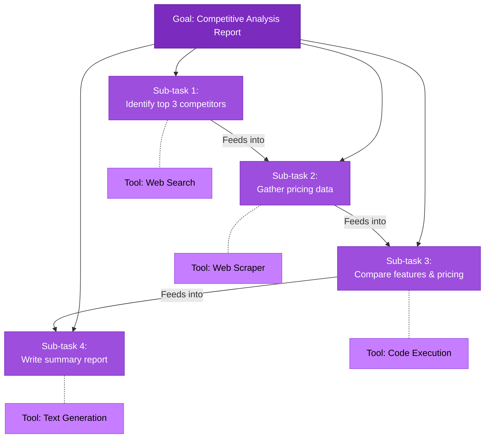
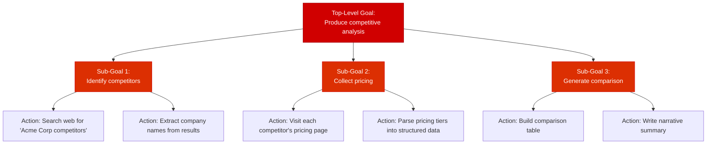
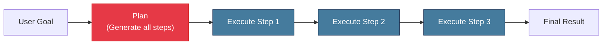
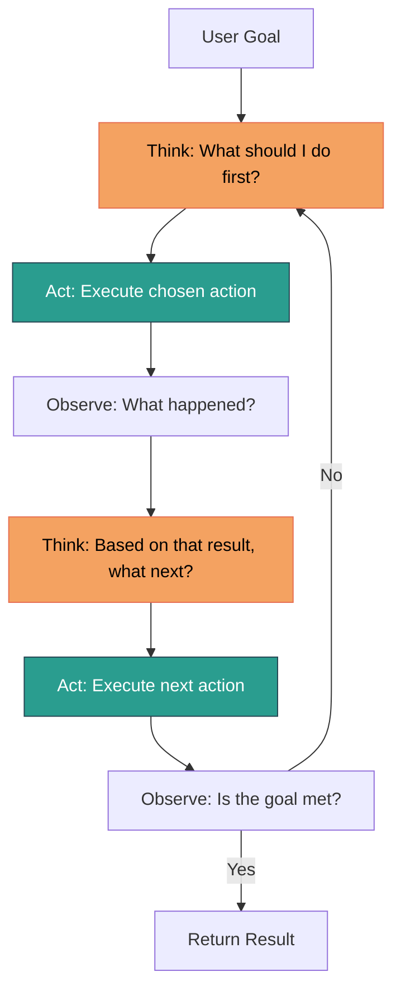
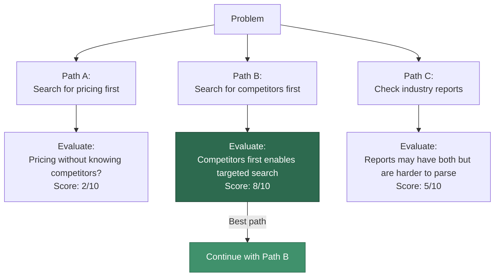

# Planning and Reasoning

Planning and reasoning are what separate a true agent from a tool-augmented chatbot. While a chatbot reacts to the immediate input, an agent **decomposes goals into sub-tasks**, **sequences actions strategically**, and **adjusts its plan when things go wrong**.

This page covers the core planning and reasoning techniques that underpin modern agentic systems.

---

## Why Planning Matters

Consider a request like: *"Research the top 3 competitors of Acme Corp, compare their pricing, and write a summary report."*

A chatbot would attempt to answer in a single generation, likely hallucinating competitor data. An agent with planning capabilities would:

1. Identify the sub-tasks (find competitors, get pricing for each, compare, write report)
2. Order them by dependency (cannot compare until pricing is gathered)
3. Execute each sub-task using appropriate tools
4. Synthesize the results into a final report



---

## Task Decomposition

Task decomposition is the process of breaking a complex goal into smaller, manageable sub-tasks. This is the foundation of all agent planning.

### Approaches to Decomposition

**1. Prompt-Based Decomposition** -- Ask the LLM to explicitly break down the task before executing anything.

```python
DECOMPOSITION_PROMPT = """
You are a planning agent. Given a user goal, break it down into a numbered
list of concrete sub-tasks. Each sub-task should be:
- Specific and actionable
- Small enough to complete in one or two tool calls
- Ordered by dependency (tasks that depend on others come later)

User Goal: {goal}

Sub-tasks:
"""

def decompose_task(goal: str, llm) -> list[str]:
    """Use the LLM to break a goal into sub-tasks."""
    prompt = DECOMPOSITION_PROMPT.format(goal=goal)
    response = llm.generate(prompt)
    # Parse numbered list into a Python list
    tasks = []
    for line in response.strip().split("\n"):
        line = line.strip()
        if line and line[0].isdigit():
            # Remove numbering prefix like "1. " or "1) "
            task = line.split(".", 1)[-1].strip() if "." in line[:3] else line
            tasks.append(task)
    return tasks
```

**2. Schema-Based Decomposition** -- Use structured output to force the LLM to produce a well-formed plan.

```python
from pydantic import BaseModel

class SubTask(BaseModel):
    id: int
    description: str
    depends_on: list[int]  # IDs of prerequisite tasks
    tools_needed: list[str]

class Plan(BaseModel):
    goal: str
    sub_tasks: list[SubTask]
    success_criteria: str
```

**3. Recursive Decomposition** -- Break tasks into sub-tasks, then break those sub-tasks further until each is atomic. This is how systems like HuggingGPT and Plan-and-Execute agents work.

---

## Goal-Directed Behavior

An agent exhibits goal-directed behavior when it maintains a representation of its objective and continuously evaluates whether its actions are moving toward that objective.

### The Goal Stack

Sophisticated agents maintain a **goal stack** -- a hierarchy of goals and sub-goals that guides action selection.



:::info Implementation Note
Most current agent frameworks do not maintain an explicit goal stack. Instead, the goal hierarchy is implicit in the LLM's chain-of-thought reasoning and the conversation history. Frameworks like LangGraph allow you to make this more explicit through state machines.
:::

---

## Inner Monologue

**Inner monologue** (also called "scratchpad" or "thought") is the technique of having the agent think out loud before taking action. This reasoning trace is visible to the developer for debugging but hidden from the end user.

```python
INNER_MONOLOGUE_SYSTEM_PROMPT = """
You are a research agent. Before each action, write your reasoning in a
<thought> block. Consider:
- What do I know so far?
- What do I still need to find out?
- What is the best next action?
- What could go wrong?

Then choose an action. After observing the result, reflect on whether it
met your expectations before proceeding.

Format:
<thought>Your reasoning here</thought>
<action>tool_name(arg1="value1", arg2="value2")</action>
"""
```

The inner monologue serves multiple purposes:
- **Improves accuracy**: Forcing the model to reason explicitly reduces errors
- **Aids debugging**: Developers can trace why the agent chose a particular action
- **Enables self-correction**: The model can catch its own logical mistakes before acting

---

## Planning Strategies

### Top-Down Planning (Plan-Then-Execute)

Create the full plan upfront, then execute it step by step. This is simple and predictable but brittle when the environment is dynamic.



**Pros**: Predictable token usage, easy to display progress, clear stopping criteria.

**Cons**: Cannot adapt if early steps produce unexpected results. The plan may become invalid.

### Iterative Refinement (ReAct-Style)

Plan one step at a time. After each action, observe the result and decide what to do next. This is the approach used by ReAct, AutoGPT, and most modern agent frameworks.



**Pros**: Adaptive, handles uncertainty well, naturally self-correcting.

**Cons**: Higher token usage, can loop or drift, harder to predict total cost.

### Hybrid: Plan-and-Solve

Generate a high-level plan, then use iterative refinement within each step. This combines the structure of top-down planning with the adaptability of ReAct.

```python
def plan_and_solve(goal: str, agent, max_replans: int = 3):
    """Hybrid strategy: create a plan, execute iteratively, replan if needed."""
    plan = agent.create_plan(goal)

    for attempt in range(max_replans):
        for i, step in enumerate(plan.steps):
            result = agent.execute_step(step)

            if result.failed:
                # Replan from the current position
                remaining_goal = f"""
                Original goal: {goal}
                Completed steps: {plan.steps[:i]}
                Failed step: {step}
                Error: {result.error}
                Please create a revised plan to achieve the original goal.
                """
                plan = agent.create_plan(remaining_goal)
                break  # Restart with new plan
        else:
            # All steps completed successfully
            return agent.synthesize_results(plan)

    return "Failed to complete the goal after maximum replanning attempts."
```

---

## Reasoning Techniques

### Chain-of-Thought (CoT)

The most widely used reasoning technique. The model produces a step-by-step reasoning trace before arriving at an answer.

```
Question: If a train travels 120 km in 2 hours, then stops for 30 minutes,
then travels 90 km in 1.5 hours, what is its average speed for the entire trip?

Chain-of-Thought:
1. Total distance = 120 + 90 = 210 km
2. Total time = 2 hours + 0.5 hours + 1.5 hours = 4 hours
3. Average speed = Total distance / Total time = 210 / 4 = 52.5 km/h

Answer: 52.5 km/h
```

In agents, CoT manifests as the model's inner monologue between actions. It is essential for multi-step tool use.

### Tree-of-Thought (ToT)

An extension of CoT where the model explores **multiple reasoning paths** in parallel and evaluates which path is most promising before continuing.



:::tip When to Use ToT
Tree-of-Thought is expensive (multiple LLM calls per reasoning step). Use it when:
- The problem has multiple valid approaches and the wrong choice is costly
- You need high-reliability reasoning (e.g., code generation, math proofs)
- You can afford the additional latency and token cost
:::

### Reflection and Self-Critique

After completing a task or sub-task, the agent evaluates its own output. This is used in systems like Reflexion and CRITIC.

```python
REFLECTION_PROMPT = """
You just completed the following task:
Task: {task}
Your output: {output}

Critically evaluate your output:
1. Does it fully address the task requirements?
2. Are there any factual errors or unsupported claims?
3. Is anything missing?
4. What would you do differently?

If the output needs improvement, describe the specific changes needed.
If the output is satisfactory, respond with "APPROVED".
"""
```

---

## When Planning Fails

Even well-designed agents encounter planning failures. Understanding failure modes and recovery strategies is essential.

### Common Failure Modes

| Failure Mode | Description | Example |
|--------------|-------------|---------|
| **Infinite loop** | Agent repeats the same actions without progress | Searching for the same query repeatedly |
| **Goal drift** | Agent loses track of the original objective | Starts researching tangential topics |
| **Premature termination** | Agent declares success before the goal is met | Returns partial results as the final answer |
| **Over-planning** | Agent spends too many tokens planning without acting | Generates a 20-step plan for a 2-step task |
| **Tool fixation** | Agent keeps trying the same failing tool | Retrying a broken API instead of using an alternative |

### Recovery Strategies

**1. Maximum iteration limits** -- The simplest safeguard. Cap the number of reasoning-action cycles.

**2. Progress checks** -- Periodically evaluate whether the agent is making progress toward its goal.

```python
PROGRESS_CHECK_PROMPT = """
Original goal: {goal}
Steps completed so far: {steps}
Results so far: {results}

Are you making progress toward the goal?
- If YES, continue with the next step.
- If NO, explain what is blocking progress and propose a new approach.
- If the goal is ALREADY MET, provide the final answer.
"""
```

**3. Fallback strategies** -- When the primary approach fails, switch to an alternative.

**4. Human escalation** -- When the agent detects it is stuck, ask a human for guidance.

**5. Replanning with context** -- Feed the failure information back into the planner to generate a revised plan (as shown in the `plan_and_solve` example above).

:::warning Guard Against Runaway Costs
Without iteration limits and progress checks, an agent can consume thousands of API calls and dollars in token costs while stuck in a loop. Always set hard limits on:
- Maximum LLM calls per task
- Maximum token budget per task
- Maximum wall-clock time per task
:::

---

## Putting It All Together: A Planning Agent in LangGraph

The plan-and-execute pattern maps naturally onto a LangGraph state graph: one node creates the plan, another executes the current step (using a ReAct sub-agent), and a conditional edge decides whether to continue, replan, or finish.

```python
from __future__ import annotations

from enum import Enum
from typing import Annotated, TypedDict

from langchain_core.messages import AnyMessage, HumanMessage, SystemMessage
from langchain_openai import ChatOpenAI
from langgraph.graph import END, StateGraph
from langgraph.graph.message import add_messages
from langgraph.prebuilt import create_react_agent
from pydantic import BaseModel, Field


# --- Structured plan models ---------------------------------------------

class StepStatus(str, Enum):
    PENDING = "pending"
    COMPLETED = "completed"
    FAILED = "failed"


class PlanStep(BaseModel):
    id: int
    description: str
    status: StepStatus = StepStatus.PENDING
    result: str | None = None
    error: str | None = None


class AgentPlan(BaseModel):
    goal: str
    steps: list[PlanStep]


# --- State ---------------------------------------------------------------

class PlanState(TypedDict):
    messages: Annotated[list[AnyMessage], add_messages]
    goal: str
    plan: AgentPlan | None
    current_step_index: int
    replan_count: int
    final_answer: str


MAX_REPLANS = 3

planner_llm = ChatOpenAI(model="gpt-4o", temperature=0)
executor_llm = ChatOpenAI(model="gpt-4o", temperature=0)


# --- Graph nodes ---------------------------------------------------------

def create_plan(state: PlanState) -> PlanState:
    """Ask the LLM to decompose the goal into an ordered list of steps."""
    context = ""
    if state.get("plan"):
        failed = [s for s in state["plan"].steps if s.status == StepStatus.FAILED]
        done = [s for s in state["plan"].steps if s.status == StepStatus.COMPLETED]
        context = (
            f"\nPrevious attempt had failures: {failed}\n"
            f"Already completed: {done}\nRevise the plan accordingly."
        )

    plan: AgentPlan = planner_llm.with_structured_output(AgentPlan).invoke(
        [
            SystemMessage(content=(
                "You are a planning agent. Decompose the goal into concrete, "
                "ordered steps. Return a JSON AgentPlan."
            )),
            HumanMessage(content=f"Goal: {state['goal']}{context}"),
        ]
    )
    return {"plan": plan, "current_step_index": 0}


def execute_step(state: PlanState) -> PlanState:
    """Execute the current plan step using a ReAct sub-agent."""
    plan = state["plan"]
    idx = state["current_step_index"]
    step = plan.steps[idx]

    # Build a lightweight ReAct executor for this step
    executor = create_react_agent(executor_llm, tools=[])  # bind real tools here
    try:
        result = executor.invoke(
            {"messages": [HumanMessage(content=step.description)]},
            config={"recursion_limit": 10},
        )
        step.status = StepStatus.COMPLETED
        step.result = result["messages"][-1].content
    except Exception as exc:
        step.status = StepStatus.FAILED
        step.error = str(exc)

    return {"plan": plan, "current_step_index": idx + 1}


def synthesize(state: PlanState) -> PlanState:
    """Combine all step results into a final answer."""
    results = "\n".join(
        f"- {s.description}: {s.result}" for s in state["plan"].steps if s.result
    )
    answer = planner_llm.invoke(
        [
            SystemMessage(content="Synthesize the following step results into a coherent answer."),
            HumanMessage(content=f"Goal: {state['goal']}\n\nResults:\n{results}"),
        ]
    )
    return {"final_answer": answer.content}


# --- Routing logic -------------------------------------------------------

def after_step(state: PlanState) -> str:
    plan = state["plan"]
    idx = state["current_step_index"]

    # Check for failures → replan
    if any(s.status == StepStatus.FAILED for s in plan.steps):
        if state.get("replan_count", 0) < MAX_REPLANS:
            return "replan"
        return "synthesize"  # give up gracefully

    # More steps remaining → continue
    if idx < len(plan.steps):
        return "execute_step"

    # All steps done
    return "synthesize"


# --- Build the graph -----------------------------------------------------

graph = StateGraph(PlanState)

graph.add_node("create_plan", create_plan)
graph.add_node("execute_step", execute_step)
graph.add_node("synthesize", synthesize)
graph.add_node("replan", lambda s: {**create_plan(s), "replan_count": s.get("replan_count", 0) + 1})

graph.set_entry_point("create_plan")
graph.add_edge("create_plan", "execute_step")
graph.add_conditional_edges("execute_step", after_step, {
    "execute_step": "execute_step",
    "replan": "replan",
    "synthesize": "synthesize",
})
graph.add_edge("replan", "execute_step")
graph.add_edge("synthesize", END)

planning_agent = graph.compile()
```

This graph encodes the plan-then-execute strategy with built-in replanning: if a step fails, the `replan` node regenerates the plan with failure context, and execution resumes -- all within the same compiled, checkpointable graph.

---

## Summary

- **Task decomposition** breaks complex goals into manageable sub-tasks -- the foundation of agent planning.
- **Top-down planning** creates the full plan upfront; **iterative refinement** plans one step at a time; **hybrid approaches** combine both.
- **Chain-of-thought** enables step-by-step reasoning; **tree-of-thought** explores multiple paths; **reflection** enables self-correction.
- Planning **fails** through loops, drift, premature termination, and tool fixation -- mitigate with iteration limits, progress checks, and replanning.
- **Goal-directed behavior** and **inner monologue** are what make agents more capable than simple tool-calling pipelines.

---

## Further Reading

- [What Are AI Agents?](./what-are-agents.md) -- The agent loop that planning operates within.
- [Memory Systems](./memory-systems.md) -- How agents maintain context across planning steps.
- [Agent Architectures](./agent-architectures.md) -- How planning works in multi-agent systems.
