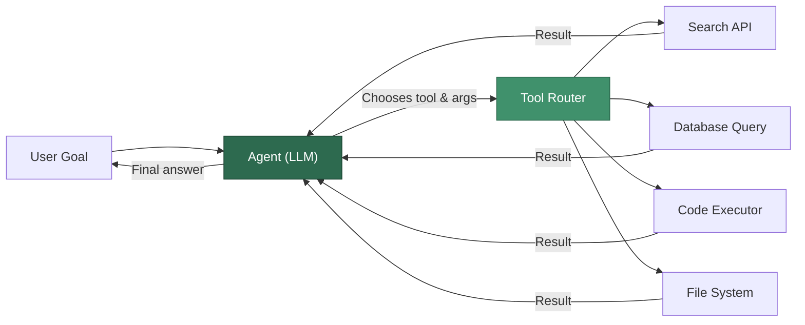
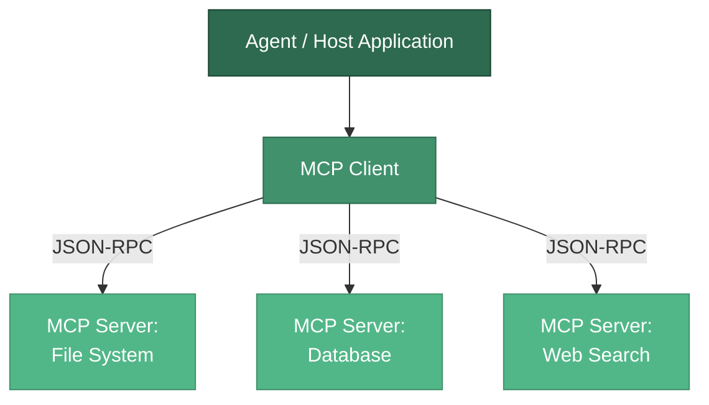

# Tools and Function Calling

An LLM on its own can only generate text. **Tools** are the bridge between an agent's reasoning and the real world -- they let the model search the web, query databases, execute code, send emails, and interact with any external system.

Function calling is the mechanism by which an LLM signals *which* tool it wants to use and *with what arguments*, allowing the host application to execute the function and return the result.

---

## What Are Tools?

In the context of AI agents, a **tool** is any callable function, API endpoint, or capability that the agent can invoke during its reasoning loop. Tools extend the agent beyond pure text generation.



Common categories of tools include:

| Category | Examples | When to Use |
|----------|----------|-------------|
| **Information Retrieval** | Web search, RAG retrieval, Wikipedia lookup | Agent needs facts it was not trained on |
| **Data Operations** | SQL queries, API calls, spreadsheet reads | Agent needs to access structured data |
| **Code Execution** | Python sandbox, shell commands | Agent needs to compute, transform, or validate |
| **Communication** | Email, Slack, SMS | Agent needs to reach humans or other systems |
| **File Operations** | Read/write files, parse PDFs | Agent needs to process documents |
| **Specialized** | Image generation, translation, math solver | Domain-specific capabilities |

---

## Tool Schemas and Definitions

Every tool must be described to the LLM so it knows *what* the tool does, *when* to use it, and *what arguments* it requires. This description is called a **tool schema**.

### Anatomy of a Tool Schema

```python
# A well-defined tool schema for a weather lookup
weather_tool = {
    "type": "function",
    "function": {
        "name": "get_current_weather",
        "description": (
            "Get the current weather for a specific city. "
            "Use this when the user asks about current weather conditions. "
            "Do NOT use for forecasts or historical weather."
        ),
        "parameters": {
            "type": "object",
            "properties": {
                "city": {
                    "type": "string",
                    "description": "The city name, e.g. 'San Francisco' or 'London'",
                },
                "units": {
                    "type": "string",
                    "enum": ["celsius", "fahrenheit"],
                    "description": "Temperature unit preference",
                },
            },
            "required": ["city"],
        },
    },
}
```

:::tip Schema Design Matters
The quality of your tool descriptions directly impacts how well the agent uses them. Be specific about:
- **What** the tool does (and what it does *not* do)
- **When** to use it vs. other tools
- **What** each parameter means, with examples
- **What** the return value looks like
:::

---

## OpenAI Function Calling

OpenAI's Chat Completions API supports tool use through the `tools` parameter. The model does not execute the function itself; it returns a structured JSON object indicating which function to call and with what arguments.

```python
from openai import OpenAI
import json

client = OpenAI()

# Step 1: Define tools
tools = [
    {
        "type": "function",
        "function": {
            "name": "search_knowledge_base",
            "description": "Search the internal knowledge base for company policies and procedures.",
            "parameters": {
                "type": "object",
                "properties": {
                    "query": {
                        "type": "string",
                        "description": "The search query in natural language",
                    },
                    "department": {
                        "type": "string",
                        "enum": ["hr", "engineering", "finance", "legal"],
                        "description": "Filter results to a specific department",
                    },
                },
                "required": ["query"],
            },
        },
    }
]

# Step 2: Send the request with tools
messages = [{"role": "user", "content": "What is the parental leave policy?"}]

response = client.chat.completions.create(
    model="gpt-4o",
    messages=messages,
    tools=tools,
    tool_choice="auto",  # Let the model decide whether to call a tool
)

# Step 3: Check if the model wants to call a tool
message = response.choices[0].message

if message.tool_calls:
    for tool_call in message.tool_calls:
        function_name = tool_call.function.name
        arguments = json.loads(tool_call.function.arguments)

        # Step 4: Execute the function locally
        result = search_knowledge_base(**arguments)  # Your implementation

        # Step 5: Send the result back to the model
        messages.append(message)
        messages.append({
            "role": "tool",
            "tool_call_id": tool_call.id,
            "content": json.dumps(result),
        })

    # Step 6: Get the final response
    final_response = client.chat.completions.create(
        model="gpt-4o",
        messages=messages,
        tools=tools,
    )
    print(final_response.choices[0].message.content)
```

:::info Parallel Tool Calls
OpenAI models can request **multiple tool calls** in a single response. Your agent loop must handle this by executing all requested calls and returning all results before the next LLM invocation. Set `parallel_tool_calls=False` if you need sequential execution.
:::

---

## Anthropic Tool Use

Anthropic's Messages API takes a similar approach but with slightly different schema conventions.

```python
import anthropic
import json

client = anthropic.Anthropic()

# Define tools using Anthropic's format
tools = [
    {
        "name": "get_stock_price",
        "description": (
            "Retrieves the current stock price for a given ticker symbol. "
            "Returns the price in USD with the timestamp of the last trade."
        ),
        "input_schema": {
            "type": "object",
            "properties": {
                "ticker": {
                    "type": "string",
                    "description": "Stock ticker symbol, e.g. 'AAPL', 'GOOGL'",
                },
            },
            "required": ["ticker"],
        },
    }
]

# Send request
response = client.messages.create(
    model="claude-sonnet-4-20250514",
    max_tokens=1024,
    tools=tools,
    messages=[{"role": "user", "content": "What is Apple's stock price right now?"}],
)

# Process tool use blocks
for block in response.content:
    if block.type == "tool_use":
        tool_name = block.name
        tool_input = block.input
        tool_use_id = block.id

        # Execute the tool
        result = get_stock_price(tool_input["ticker"])

        # Return result to Claude
        followup = client.messages.create(
            model="claude-sonnet-4-20250514",
            max_tokens=1024,
            tools=tools,
            messages=[
                {"role": "user", "content": "What is Apple's stock price right now?"},
                {"role": "assistant", "content": response.content},
                {
                    "role": "user",
                    "content": [
                        {
                            "type": "tool_result",
                            "tool_use_id": tool_use_id,
                            "content": json.dumps(result),
                        }
                    ],
                },
            ],
        )
```

### Key Differences: OpenAI vs. Anthropic

| Aspect | OpenAI | Anthropic |
|--------|--------|-----------|
| Schema key | `parameters` | `input_schema` |
| Tool call location | `message.tool_calls` | `content` blocks with `type: "tool_use"` |
| Result role | `role: "tool"` | `role: "user"` with `tool_result` content |
| Parallel calls | Supported via `parallel_tool_calls` | Supported natively |
| Tool choice | `tool_choice: "auto" / "required" / {"function": {"name": ...}}` | `tool_choice: {"type": "auto" / "any" / "tool", "name": ...}` |

---

## Model Context Protocol (MCP)

**MCP** is an open protocol (initiated by Anthropic) that standardizes how applications provide tools, resources, and prompts to LLMs. Think of it as a **USB-C for AI tools** -- a universal interface so any agent can connect to any tool server.



### MCP Core Concepts

- **Host**: The application where the agent runs (e.g., Claude Desktop, your custom app)
- **Client**: Maintains a 1:1 connection with a single MCP server
- **Server**: Exposes tools, resources, and prompts over the protocol
- **Transport**: Communication layer (stdio for local, HTTP+SSE for remote)

### Building an MCP Server (Python)

```python
from mcp.server.fastmcp import FastMCP

# Create a server
mcp = FastMCP("demo-tools")

@mcp.tool()
def calculate_bmi(weight_kg: float, height_m: float) -> str:
    """Calculate Body Mass Index from weight in kilograms and height in meters."""
    bmi = weight_kg / (height_m ** 2)
    category = (
        "underweight" if bmi < 18.5
        else "normal" if bmi < 25
        else "overweight" if bmi < 30
        else "obese"
    )
    return f"BMI: {bmi:.1f} ({category})"

@mcp.tool()
def convert_currency(amount: float, from_currency: str, to_currency: str) -> str:
    """Convert an amount between currencies using the latest exchange rates."""
    # In production, call a real exchange rate API
    rates = {"USD": 1.0, "EUR": 0.92, "GBP": 0.79, "JPY": 149.50}
    usd_amount = amount / rates.get(from_currency, 1.0)
    converted = usd_amount * rates.get(to_currency, 1.0)
    return f"{amount} {from_currency} = {converted:.2f} {to_currency}"

if __name__ == "__main__":
    mcp.run(transport="stdio")
```

:::info Why MCP Matters
Without MCP, every agent framework has its own tool definition format. MCP provides a single standard so tools can be written once and used by Claude, ChatGPT, open-source agents, or any compliant host. This is especially powerful for enterprise environments with many internal tools.
:::

---

## Tools in LangGraph

LangGraph provides first-class support for tool use through **`@tool`-decorated functions**, **model binding**, and the **`ToolNode`** prebuilt component. This section shows how tools are defined, bound to a model, and executed inside a LangGraph agent graph.

### Defining Tools and Binding to a Model

```python
from __future__ import annotations

from typing import Annotated, TypedDict

from langchain_core.messages import AnyMessage
from langchain_core.tools import tool
from langchain_openai import ChatOpenAI
from langgraph.graph import END, StateGraph
from langgraph.graph.message import add_messages
from langgraph.prebuilt import ToolNode
from pydantic import BaseModel, Field


# --- Tool definitions with typed args via Pydantic ----------------------

class SearchArgs(BaseModel):
    query: str = Field(description="Natural-language search query")
    department: str | None = Field(
        default=None, description="Optional department filter: hr, engineering, finance, legal"
    )


@tool(args_schema=SearchArgs)
def search_knowledge_base(query: str, department: str | None = None) -> str:
    """Search the internal knowledge base for company policies and procedures."""
    return f"Results for '{query}' (dept={department}): ..."


@tool
def get_current_weather(city: str, units: str = "celsius") -> str:
    """Get the current weather for a specific city."""
    return f"Weather in {city}: 22 {units}"


tools = [search_knowledge_base, get_current_weather]


# --- Bind tools to the LLM ---------------------------------------------

llm = ChatOpenAI(model="gpt-4o", temperature=0).bind_tools(tools)


# --- Build a LangGraph agent that uses ToolNode ------------------------

class State(TypedDict):
    messages: Annotated[list[AnyMessage], add_messages]


def call_model(state: State) -> State:
    return {"messages": [llm.invoke(state["messages"])]}


def should_continue(state: State) -> str:
    last = state["messages"][-1]
    if hasattr(last, "tool_calls") and last.tool_calls:
        return "tools"
    return END


graph = StateGraph(State)
graph.add_node("agent", call_model)
graph.add_node("tools", ToolNode(tools))

graph.set_entry_point("agent")
graph.add_conditional_edges("agent", should_continue, {"tools": "tools", END: END})
graph.add_edge("tools", "agent")

agent = graph.compile()
```

Key points:
- **`@tool`** registers a Python function as a LangChain tool. Pydantic `args_schema` provides strict argument typing.
- **`.bind_tools(tools)`** converts tool schemas into the format the model expects (OpenAI-style or Anthropic-style, depending on the chat model class).
- **`ToolNode(tools)`** is a prebuilt LangGraph node that automatically dispatches incoming `tool_calls` to the matching function and returns `ToolMessage` results.

### MCP Integration with LangGraph

LangGraph agents can consume tools served over MCP using `langchain-mcp-adapters`, which wraps MCP tool servers as LangChain tools.

```python
from langchain_mcp_adapters.client import MultiServerMCPClient
from langgraph.prebuilt import create_react_agent
from langchain_openai import ChatOpenAI

# Configure MCP server connections
async def build_mcp_agent():
    async with MultiServerMCPClient(
        {
            "filesystem": {
                "command": "npx",
                "args": ["-y", "@modelcontextprotocol/server-filesystem", "/tmp/safe"],
                "transport": "stdio",
            },
            "weather": {
                "url": "http://localhost:8080/sse",
                "transport": "sse",
            },
        }
    ) as mcp_client:
        # MCP tools are automatically converted to LangChain tools
        mcp_tools = mcp_client.get_tools()

        # Build a LangGraph ReAct agent with MCP-sourced tools
        llm = ChatOpenAI(model="gpt-4o", temperature=0)
        agent = create_react_agent(llm, mcp_tools)

        result = await agent.ainvoke(
            {"messages": [{"role": "user", "content": "List files in /tmp/safe"}]}
        )
        return result
```

This pattern means any MCP server -- whether local (stdio) or remote (SSE) -- can supply tools to a LangGraph agent with no custom glue code.

---

## Tool Selection Strategies

When an agent has access to many tools, how does it decide which one to use?

### Strategy 1: Let the Model Decide

Pass all tool schemas to the model and let it choose. This works well when you have fewer than ~20 tools with clear, non-overlapping descriptions.

### Strategy 2: Tool Filtering / Retrieval

When you have dozens or hundreds of tools, embed tool descriptions in a vector store and retrieve the most relevant tools based on the user's query before passing them to the model.

```python
from openai import OpenAI
import numpy as np

client = OpenAI()

def select_relevant_tools(query: str, all_tools: list, top_k: int = 5) -> list:
    """Use semantic similarity to select the most relevant tools for a query."""
    # Embed the query
    query_embedding = client.embeddings.create(
        model="text-embedding-3-small",
        input=query,
    ).data[0].embedding

    # Embed tool descriptions (in production, pre-compute and cache these)
    tool_descriptions = [t["function"]["description"] for t in all_tools]
    tool_embeddings = client.embeddings.create(
        model="text-embedding-3-small",
        input=tool_descriptions,
    ).data

    # Compute cosine similarity and return top-k tools
    similarities = []
    for i, te in enumerate(tool_embeddings):
        sim = np.dot(query_embedding, te.embedding) / (
            np.linalg.norm(query_embedding) * np.linalg.norm(te.embedding)
        )
        similarities.append((sim, all_tools[i]))

    similarities.sort(key=lambda x: x[0], reverse=True)
    return [tool for _, tool in similarities[:top_k]]
```

### Strategy 3: Tool Routing

Use a lightweight classifier or a smaller LLM to route queries to the appropriate tool category before the main agent runs.

### Strategy 4: Hierarchical Tool Access

Organize tools into groups. A supervisor agent delegates to sub-agents, each of which has access to a focused set of tools.

---

## Error Handling in Tool Calls

Tools fail. APIs time out, databases go down, and models generate invalid arguments. Robust agents handle these failures gracefully.

### Common Failure Modes

| Failure | Cause | Mitigation |
|---------|-------|------------|
| **Invalid arguments** | Model produces malformed JSON or wrong types | Validate with Pydantic; return a clear error message so the model can retry |
| **Tool not found** | Model hallucinates a tool name | Validate against the known tool list; return available tool names |
| **Execution error** | API timeout, rate limit, permission denied | Catch exceptions; return structured error info; implement retry logic |
| **Unexpected output** | Tool returns data the model cannot parse | Normalize tool outputs to a consistent format |

### Robust Tool Execution Pattern

```python
import json
import traceback
from pydantic import ValidationError

def safe_execute_tool(tool_call, available_tools: dict) -> str:
    """Execute a tool call with comprehensive error handling."""
    function_name = tool_call.function.name

    # Guard: Does the tool exist?
    if function_name not in available_tools:
        return json.dumps({
            "error": f"Unknown tool '{function_name}'.",
            "available_tools": list(available_tools.keys()),
            "suggestion": "Please choose from the available tools.",
        })

    # Guard: Are the arguments valid JSON?
    try:
        arguments = json.loads(tool_call.function.arguments)
    except json.JSONDecodeError as e:
        return json.dumps({
            "error": f"Invalid JSON in arguments: {e}",
            "raw_arguments": tool_call.function.arguments,
            "suggestion": "Please provide valid JSON arguments.",
        })

    # Guard: Do the arguments match the expected schema?
    tool_func = available_tools[function_name]
    try:
        result = tool_func(**arguments)
        return json.dumps({"status": "success", "result": result})
    except TypeError as e:
        return json.dumps({
            "error": f"Argument mismatch: {e}",
            "suggestion": "Check the required parameters and their types.",
        })
    except Exception as e:
        return json.dumps({
            "error": f"Tool execution failed: {type(e).__name__}: {e}",
            "suggestion": "The tool encountered an error. You may retry or try an alternative approach.",
        })
```

:::warning Never Silently Swallow Errors
Always return error information to the LLM. If the model does not know a tool call failed, it will proceed with invalid assumptions. Structured error messages with suggestions help the model self-correct.
:::

---

## Best Practices

1. **Write precise tool descriptions** -- The description is your most important lever for tool selection accuracy.
2. **Use enums and constraints** -- Restrict parameter values when possible to reduce hallucinated arguments.
3. **Validate inputs with Pydantic** -- Parse arguments into typed models before execution.
4. **Return structured results** -- Consistent JSON responses are easier for the model to interpret.
5. **Limit the tool count** -- Fewer, well-described tools outperform many vaguely described ones.
6. **Sandbox execution** -- Never execute arbitrary code without sandboxing (see [Guardrails and Safety](./guardrails-and-safety.md)).
7. **Log everything** -- Record tool calls, arguments, results, and latency for debugging and evaluation.

---

## Summary

- **Tools** are the mechanism by which agents interact with the external world.
- **Function calling** is the protocol: the LLM outputs structured tool calls, your code executes them, and results flow back.
- **OpenAI** and **Anthropic** have similar but not identical APIs for tool use.
- **MCP** is an emerging standard that decouples tool implementation from agent frameworks.
- **Tool selection** becomes critical at scale -- use retrieval, routing, or hierarchical access.
- **Error handling** is non-negotiable: validate inputs, catch failures, and always inform the model.

---

## Further Reading

- [What Are AI Agents?](./what-are-agents.md) -- Foundational concepts and the agent loop.
- [Planning and Reasoning](./planning-and-reasoning.md) -- How agents decide *which* tools to use and *in what order*.
- [Guardrails and Safety](./guardrails-and-safety.md) -- Sandboxing tool execution and preventing misuse.
