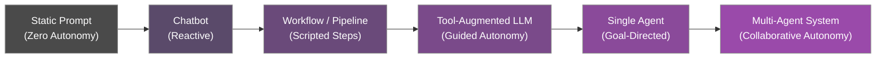
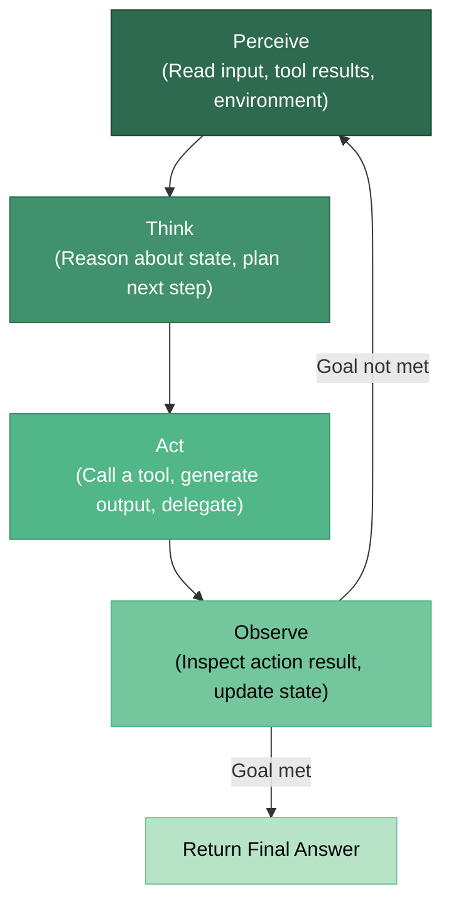

# What Are AI Agents?

An **AI agent** is a software system that uses a large language model (LLM) as its core reasoning engine to autonomously perceive its environment, make decisions, take actions, and learn from the outcomes -- all in pursuit of a goal defined by a human.

Unlike a simple prompt-response chatbot, an agent operates in a **loop**: it observes, thinks, acts, and then observes again until the task is complete or a stopping condition is met.

:::info Key Insight
The word *agent* comes from the Latin *agere* -- "to act." The defining characteristic of an AI agent is not intelligence alone, but the capacity to **take action** in the world and **adapt** based on what happens next.
:::

---

## The Autonomy Spectrum

Not every AI-powered system is an agent. Systems exist on a spectrum from fully manual to fully autonomous.



| Level | System | Autonomy | Example |
|-------|--------|----------|---------|
| 0 | Static Prompt | None -- single input/output | A pre-written template that fills blanks |
| 1 | Chatbot | Reactive -- responds to user turns | ChatGPT in basic conversation mode |
| 2 | Workflow | Scripted -- fixed sequence of steps | LangChain `SequentialChain` |
| 3 | Tool-Augmented LLM | Guided -- model chooses from available tools | An LLM with access to a calculator and search API |
| 4 | Single Agent | Goal-directed -- plans and executes autonomously | A ReAct agent that researches and writes a report |
| 5 | Multi-Agent System | Collaborative -- multiple agents coordinate | A team of agents where one plans, one codes, one reviews |

:::tip Interview Angle
When asked "What is an AI agent?" in an interview, avoid the trap of saying "it is an LLM that uses tools." That describes level 3. A true agent also exhibits **goal-directed planning**, **adaptive reasoning**, and an **observation-action loop**.
:::

---

## The Agent Loop

Every agent, regardless of framework or complexity, follows a fundamental cycle.



### Phase Breakdown

**1. Perceive** -- The agent receives information. This could be the user's original request, the result of a previous tool call, an error message, or an observation from the environment.

**2. Think** -- The LLM reasons about the current state. It considers: What is my goal? What do I know so far? What should I do next? This is where chain-of-thought, planning, and self-reflection happen.

**3. Act** -- The agent executes a concrete action. It might call a function (search the web, query a database, write a file), delegate to another agent, or produce a final answer.

**4. Observe** -- The agent inspects the result of its action. Did the API return valid data? Did the code execution succeed? Is the task complete?

The loop repeats until the agent determines that the goal has been satisfied, a maximum iteration limit is reached, or an unrecoverable error occurs.

---

## Key Properties of AI Agents

Researchers identify four core properties that distinguish agents from simpler systems.

### Perception

The ability to take in information from the environment. For LLM-based agents, this includes:

- User messages and conversation history
- Tool and API responses
- File contents, database query results
- Structured observations from the environment

### Reasoning

The ability to process perceived information and form plans. This goes beyond simple next-token prediction:

- **Chain-of-thought**: Step-by-step logical deduction
- **Task decomposition**: Breaking a complex goal into sub-tasks
- **Self-reflection**: Evaluating whether the current approach is working
- **Hypothesis formation**: Considering multiple possible actions and their outcomes

### Action

The ability to affect the external world through tool use:

- Calling APIs (search, email, databases)
- Executing code in sandboxed environments
- Writing and reading files
- Communicating with other agents or humans

### Learning

The ability to improve over time, either within a session or across sessions:

- **In-context learning**: Adapting behavior based on examples and feedback within the conversation
- **Memory retrieval**: Pulling relevant information from past interactions
- **Self-correction**: Recognizing mistakes and adjusting strategy

:::warning Common Misconception
Many systems marketed as "agents" lack true learning capabilities. A system that follows a fixed tool-calling pattern without adapting its strategy based on outcomes is better described as a **tool-augmented pipeline**, not an agent.
:::

---

## Agent vs. Chatbot vs. Workflow vs. Pipeline

Understanding the distinctions between these terms is critical for both interviews and system design.

| Characteristic | Chatbot | Workflow | Pipeline | Agent |
|----------------|---------|----------|----------|-------|
| **Interaction** | Reactive, turn-by-turn | Triggered, multi-step | Batch or streaming | Goal-driven, iterative |
| **Control Flow** | User-directed | Pre-defined graph | Linear sequence | LLM-directed, dynamic |
| **Tool Use** | None or limited | Fixed tool calls per step | Fixed tool calls per stage | Dynamic tool selection |
| **State** | Conversation history | Step outputs passed forward | Stage outputs passed forward | Rich working memory |
| **Planning** | None | Pre-planned by developer | Pre-planned by developer | Runtime planning by LLM |
| **Error Handling** | Ask user to rephrase | Retry or fail the step | Retry or fail the stage | Reflect, re-plan, adapt |
| **Stopping** | User ends conversation | All steps completed | Pipeline completes | Goal achieved or max iterations |
| **Example** | Customer service bot | "Summarize email then translate" | ETL data processing | Research assistant that finds, reads, and synthesizes papers |

### When to Use What

```python
# Decision framework (pseudocode)
def choose_system(requirements):
    if requirements.is_single_turn and not requirements.needs_tools:
        return "Chatbot"

    if requirements.steps_are_known_ahead_of_time:
        if requirements.steps_are_linear:
            return "Pipeline"
        else:
            return "Workflow (DAG)"

    if requirements.needs_dynamic_planning:
        if requirements.needs_multiple_specialized_roles:
            return "Multi-Agent System"
        else:
            return "Single Agent"
```

:::tip Design Principle
Start with the simplest system that solves your problem. Do not build an agent when a pipeline will do. Agents introduce non-determinism, higher latency, and increased cost. Use them when the task genuinely requires adaptive, goal-directed behavior.
:::

---

## Anatomy of a Minimal Agent in LangGraph

Here is a stripped-down agent loop built with **LangGraph** to illustrate the perceive-think-act-observe cycle as an explicit state graph. LangGraph models agent control flow as a directed graph where nodes are processing steps and edges define transitions -- making the loop visible, debuggable, and extensible.

```python
from __future__ import annotations

from typing import Annotated, TypedDict

from langchain_core.messages import AnyMessage, HumanMessage, SystemMessage
from langchain_openai import ChatOpenAI
from langgraph.graph import END, StateGraph
from langgraph.graph.message import add_messages
from langgraph.prebuilt import ToolNode


# --- Tools the agent can use -------------------------------------------

def search_web(query: str) -> str:
    """Search the web for current information."""
    return f"Top result for '{query}': ..."


def calculate(expression: str) -> str:
    """Evaluate a mathematical expression safely."""
    allowed = set("0123456789+-*/.(). ")
    if not all(ch in allowed for ch in expression):
        return "Error: invalid characters in expression."
    return str(eval(expression))  # noqa: S307 – demo only


tools = [search_web, calculate]


# --- State definition --------------------------------------------------

class AgentState(TypedDict):
    messages: Annotated[list[AnyMessage], add_messages]


# --- Graph construction -------------------------------------------------

llm = ChatOpenAI(model="gpt-4o", temperature=0).bind_tools(tools)


def think(state: AgentState) -> AgentState:
    """PERCEIVE + THINK: the LLM reads the conversation and decides the
    next action (tool call) or produces a final answer."""
    response = llm.invoke(state["messages"])
    return {"messages": [response]}


def should_continue(state: AgentState) -> str:
    """OBSERVE: inspect the last message -- if the LLM issued tool calls,
    route to the 'act' node; otherwise the goal is met."""
    last = state["messages"][-1]
    if hasattr(last, "tool_calls") and last.tool_calls:
        return "act"
    return END


# Build the graph
graph = StateGraph(AgentState)
graph.add_node("think", think)
graph.add_node("act", ToolNode(tools))          # ACT: execute tool calls

graph.set_entry_point("think")
graph.add_conditional_edges("think", should_continue, {"act": "act", END: END})
graph.add_edge("act", "think")                   # loop back: observe → think

agent = graph.compile()


# --- Run the agent ------------------------------------------------------

def run_agent(goal: str) -> str:
    """Invoke the compiled LangGraph agent with a user goal."""
    initial_state: AgentState = {
        "messages": [
            SystemMessage(content="You are a helpful agent. Use tools to accomplish the goal."),
            HumanMessage(content=goal),
        ],
    }
    final_state = agent.invoke(initial_state, config={"recursion_limit": 20})
    return final_state["messages"][-1].content
```

The graph above maps directly onto the perceive-think-act-observe diagram: the `think` node is the LLM reasoning step, the `act` node (a `ToolNode`) executes chosen tools, and the conditional edge inspects the result to decide whether to loop or stop.

---

## Summary

- An AI agent is an LLM-powered system that operates in a **perceive-think-act-observe** loop to achieve goals autonomously.
- Agents sit at the higher end of the **autonomy spectrum**, above chatbots, workflows, and pipelines.
- The four key properties are **perception**, **reasoning**, **action**, and **learning**.
- Use agents when tasks require **dynamic planning and adaptive behavior** -- not for every LLM-powered feature.

---

## Further Reading

- [Tools and Function Calling](./tools-and-function-calling.md) -- How agents interact with the outside world.
- [Planning and Reasoning](./planning-and-reasoning.md) -- How agents decompose goals and think step by step.
- [Memory Systems](./memory-systems.md) -- How agents remember and learn.
- [Agent Architectures](./agent-architectures.md) -- Single-agent vs. multi-agent system design.
