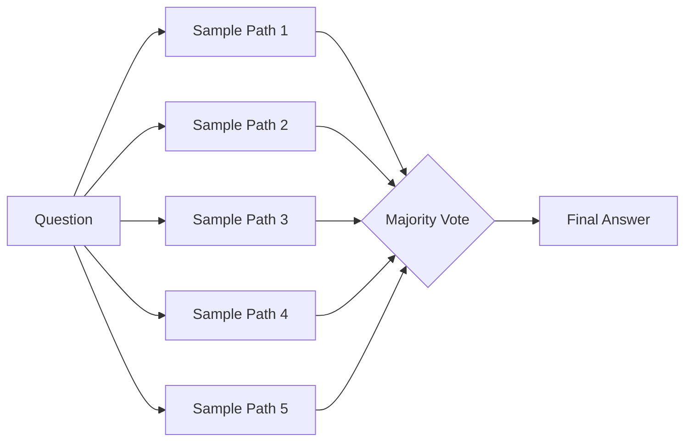
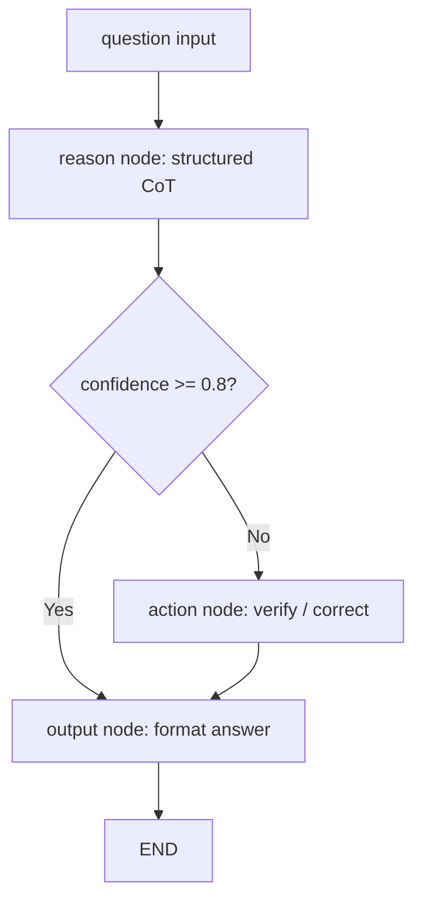

# Chain-of-Thought Reasoning

Chain-of-Thought (CoT) prompting encourages a language model to produce intermediate reasoning steps before arriving at a final answer. Instead of jumping straight to the output, the model "shows its work," which dramatically improves performance on arithmetic, commonsense, and symbolic reasoning tasks.

## What Is Chain-of-Thought?

In standard prompting, you ask a question and get a direct answer. With CoT, you instruct the model to reason step by step. The key insight from Wei et al. (2022) is that this simple change unlocks latent reasoning abilities in large models.

```text
Standard:  Q: "If a store has 23 apples and sells 17, how many remain?"
           A: "6"

CoT:       Q: "If a store has 23 apples and sells 17, how many remain? Think step by step."
           A: "The store starts with 23 apples. It sells 17. 23 - 17 = 6. The answer is 6."
```

:::info Why It Works
CoT decomposes complex problems into smaller, manageable sub-problems. Each intermediate step provides a "scaffold" that keeps the model on track and reduces the chance of errors.
:::

## Variants of Chain-of-Thought

### Zero-Shot CoT

The simplest form: append "Let's think step by step" to your prompt. No examples needed.

### Few-Shot CoT

Provide 2-3 worked examples in the prompt that demonstrate step-by-step reasoning. The model learns the pattern and applies it to new questions.

### Self-Consistency

Self-consistency (Wang et al., 2022) improves CoT by sampling **multiple reasoning paths** and taking a majority vote on the final answer. Different reasoning chains may make different mistakes, but the correct answer tends to appear most frequently.



:::tip
Zero-shot CoT is remarkably effective. Kojima et al. (2022) showed that simply adding "Let's think step by step" improved accuracy by 10-40% on reasoning benchmarks.
:::

## LangGraph Implementation: CoT as a Graph Node

In an agentic pipeline, CoT is most useful as an **explicit reasoning node** that runs before the action node. The LangGraph implementation below enforces structured CoT output via Pydantic, then passes the parsed reasoning into subsequent nodes.

```python
"""Chain-of-Thought as a LangGraph node with structured Pydantic output."""

from __future__ import annotations

import logging
import operator
from typing import Annotated, Any, Literal, Sequence, TypedDict

from langchain_core.messages import AIMessage, BaseMessage, HumanMessage, SystemMessage
from langchain_openai import ChatOpenAI
from langgraph.graph import END, StateGraph
from pydantic import BaseModel, Field

logger = logging.getLogger(__name__)

# ---------------------------------------------------------------------------
# Structured CoT output models
# ---------------------------------------------------------------------------

class ReasoningStep(BaseModel):
    """A single step in the chain-of-thought."""
    step_number: int = Field(..., description="Sequential step number")
    thought: str = Field(..., description="The reasoning for this step")
    conclusion: str = Field(..., description="What was established in this step")


class CoTOutput(BaseModel):
    """Structured chain-of-thought reasoning output."""
    question: str = Field(..., description="The original question restated")
    steps: list[ReasoningStep] = Field(..., description="Ordered reasoning steps")
    final_answer: str = Field(..., description="The definitive answer")
    confidence: float = Field(
        ..., ge=0.0, le=1.0, description="Confidence in the answer"
    )


# ---------------------------------------------------------------------------
# Graph state
# ---------------------------------------------------------------------------

class CoTState(TypedDict):
    """State flowing through the chain-of-thought graph."""
    messages: Annotated[Sequence[BaseMessage], operator.add]
    question: str
    reasoning: CoTOutput | None
    needs_action: bool


# ---------------------------------------------------------------------------
# CoT system prompt
# ---------------------------------------------------------------------------

COT_SYSTEM_PROMPT = """You are a precise analytical reasoner. When given a question:

1. Restate the question to confirm understanding.
2. Break your reasoning into numbered steps. Each step should have a clear thought and conclusion.
3. Arrive at a final answer only after all steps are complete.
4. Assess your confidence (0.0 to 1.0) in the answer.

Be thorough but concise. Show every logical inference."""


# ---------------------------------------------------------------------------
# Graph nodes
# ---------------------------------------------------------------------------

def reasoning_node(state: CoTState) -> dict[str, Any]:
    """Perform structured chain-of-thought reasoning."""
    llm = ChatOpenAI(model="gpt-4o", temperature=0.0)
    structured_llm = llm.with_structured_output(CoTOutput)

    messages = [
        SystemMessage(content=COT_SYSTEM_PROMPT),
        HumanMessage(content=state["question"]),
    ]
    cot_result: CoTOutput = structured_llm.invoke(messages)

    logger.info(
        "CoT reasoning completed: steps=%d confidence=%.2f",
        len(cot_result.steps),
        cot_result.confidence,
    )

    summary = _format_reasoning(cot_result)
    return {
        "messages": [AIMessage(content=summary)],
        "reasoning": cot_result,
        "needs_action": cot_result.confidence < 0.8,
    }


def action_node(state: CoTState) -> dict[str, Any]:
    """Take action based on reasoning -- e.g., look up info or verify."""
    llm = ChatOpenAI(model="gpt-4o", temperature=0.0)
    reasoning = state["reasoning"]

    messages = [
        SystemMessage(
            content=(
                "You are a verification agent. The reasoning agent was not fully "
                "confident. Review the reasoning and provide a corrected or "
                "confirmed final answer."
            )
        ),
        HumanMessage(
            content=(
                f"Question: {reasoning.question}\n\n"
                f"Reasoning steps:\n{_format_steps(reasoning)}\n\n"
                f"Proposed answer: {reasoning.final_answer}\n"
                f"Confidence: {reasoning.confidence}\n\n"
                "Verify or correct the answer."
            )
        ),
    ]
    response: AIMessage = llm.invoke(messages)
    logger.info("Verification node produced response.")
    return {"messages": [response]}


def output_node(state: CoTState) -> dict[str, Any]:
    """Format the final output for the user."""
    reasoning = state["reasoning"]
    answer_text = (
        f"**Answer:** {reasoning.final_answer}\n\n"
        f"**Reasoning ({len(reasoning.steps)} steps, "
        f"confidence {reasoning.confidence:.0%}):**\n"
        + _format_steps(reasoning)
    )
    return {"messages": [AIMessage(content=answer_text)]}


# ---------------------------------------------------------------------------
# Routing
# ---------------------------------------------------------------------------

def route_after_reasoning(state: CoTState) -> Literal["action", "output"]:
    """Route to verification if confidence is low, else straight to output."""
    if state.get("needs_action", False):
        return "action"
    return "output"


# ---------------------------------------------------------------------------
# Graph assembly
# ---------------------------------------------------------------------------

def build_cot_graph() -> Any:
    """Compile the CoT reasoning graph."""
    graph = StateGraph(CoTState)

    graph.add_node("reason", reasoning_node)
    graph.add_node("action", action_node)
    graph.add_node("output", output_node)

    graph.set_entry_point("reason")
    graph.add_conditional_edges("reason", route_after_reasoning, {
        "action": "action",
        "output": "output",
    })
    graph.add_edge("action", "output")
    graph.add_edge("output", END)

    return graph.compile()


async def run_cot(question: str) -> str:
    """Run a question through the CoT graph and return the final answer."""
    app = build_cot_graph()
    initial_state: CoTState = {
        "messages": [],
        "question": question,
        "reasoning": None,
        "needs_action": False,
    }
    result = await app.ainvoke(initial_state)
    return result["messages"][-1].content


# ---------------------------------------------------------------------------
# Helpers
# ---------------------------------------------------------------------------

def _format_reasoning(cot: CoTOutput) -> str:
    lines = [f"Question: {cot.question}", ""]
    for step in cot.steps:
        lines.append(f"Step {step.step_number}: {step.thought}")
        lines.append(f"  -> {step.conclusion}")
    lines.append(f"\nFinal Answer: {cot.final_answer}")
    lines.append(f"Confidence: {cot.confidence:.0%}")
    return "\n".join(lines)


def _format_steps(cot: CoTOutput) -> str:
    return "\n".join(
        f"{s.step_number}. {s.thought} -> {s.conclusion}" for s in cot.steps
    )
```

### How the Graph Works



| Node | Responsibility |
|------|---------------|
| **reason** | Produces structured `CoTOutput` via `with_structured_output` |
| **action** | Verification node invoked only when confidence is below threshold |
| **output** | Formats the final answer with reasoning trace for the user |

## Self-Consistency via Parallel CoT Branches

LangGraph can model self-consistency by spawning parallel reasoning branches and aggregating with a majority-vote node.

```python
"""Self-consistency CoT: sample N reasoning paths, majority-vote the answer."""

from collections import Counter
from typing import Any, TypedDict

from langchain_core.messages import HumanMessage, SystemMessage
from langchain_openai import ChatOpenAI
from langgraph.graph import END, StateGraph
from pydantic import BaseModel, Field


class SampleAnswer(BaseModel):
    reasoning: str = Field(..., description="Step-by-step reasoning")
    answer: str = Field(..., description="Final answer")


class ConsistencyState(TypedDict):
    question: str
    samples: list[SampleAnswer]
    final_answer: str


def sample_node(state: ConsistencyState) -> dict[str, Any]:
    """Generate N diverse reasoning paths at higher temperature."""
    llm = ChatOpenAI(model="gpt-4o", temperature=0.7)
    structured_llm = llm.with_structured_output(SampleAnswer)
    num_samples = 5

    samples: list[SampleAnswer] = []
    for _ in range(num_samples):
        result = structured_llm.invoke([
            SystemMessage(content="Solve the problem step by step."),
            HumanMessage(content=state["question"]),
        ])
        samples.append(result)

    return {"samples": samples}


def vote_node(state: ConsistencyState) -> dict[str, Any]:
    """Majority-vote across sampled answers."""
    answers = [s.answer.strip().lower() for s in state["samples"]]
    counter = Counter(answers)
    best, count = counter.most_common(1)[0]
    total = len(answers)
    return {"final_answer": f"{best} (consensus: {count}/{total} paths agreed)"}


def build_consistency_graph() -> Any:
    graph = StateGraph(ConsistencyState)
    graph.add_node("sample", sample_node)
    graph.add_node("vote", vote_node)
    graph.set_entry_point("sample")
    graph.add_edge("sample", "vote")
    graph.add_edge("vote", END)
    return graph.compile()
```

## When CoT Helps vs. Hurts

### CoT Helps When

| Scenario | Why |
|----------|-----|
| **Multi-step arithmetic** | Decomposition prevents calculation errors |
| **Logical reasoning** | Explicit steps catch logical fallacies |
| **Complex word problems** | Separates information extraction from computation |
| **Commonsense reasoning chains** | Makes implicit knowledge explicit |
| **Code generation** | Planning the algorithm before writing code |

### CoT Can Hurt When

| Scenario | Why |
|----------|-----|
| **Simple factual recall** | "What is the capital of France?" -- extra reasoning adds latency for no gain |
| **Creative writing** | Step-by-step reasoning can make output mechanical and less creative |
| **Small models** | Models under ~10B parameters often produce incoherent reasoning chains |
| **Time-critical tasks** | The extra tokens slow down response time |

## Comparison of CoT Variants

| Variant | LLM Calls | Accuracy Boost | Best For |
|---------|-----------|----------------|----------|
| Zero-shot CoT | 1 | Moderate | Quick reasoning with no examples |
| Few-shot CoT | 1 | High | Well-defined problem types |
| Self-consistency | N (samples) | Very high | Math and logic with clear answers |
| Tree-of-Thought | O(breadth^depth) | Highest | Complex search and planning problems |
| CoT + Verification | 2 | High | Reducing false positives |

## Key Takeaways

- Chain-of-thought prompting is the **simplest and most impactful** technique for improving LLM reasoning.
- In LangGraph, enforce CoT as a dedicated graph node with Pydantic-structured output before any action node.
- Zero-shot CoT ("Let's think step by step") requires no examples and works surprisingly well.
- Self-consistency boosts reliability by sampling diverse reasoning paths and voting.
- Use `with_structured_output` to guarantee parseable CoT results in production pipelines.

## Further Reading

- Wei, J. et al. "Chain-of-Thought Prompting Elicits Reasoning in Large Language Models" (NeurIPS 2022)
- Kojima, T. et al. "Large Language Models are Zero-Shot Reasoners" (NeurIPS 2022)
- Wang, X. et al. "Self-Consistency Improves Chain of Thought Reasoning in Language Models" (ICLR 2023)
- Yao, S. et al. "Tree of Thoughts: Deliberate Problem Solving with Large Language Models" (NeurIPS 2023)
