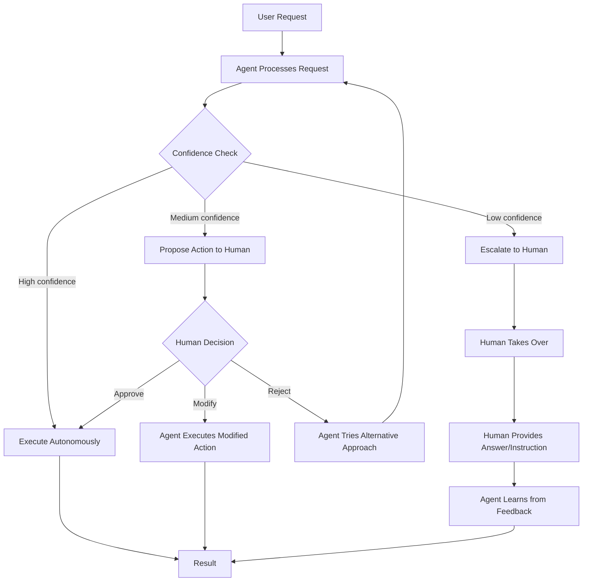
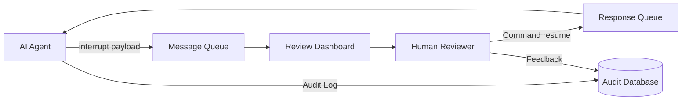

# Human-in-the-Loop

Human-in-the-Loop (HITL) is a design pattern where an AI agent **pauses at critical decision points to request human review, approval, or input** before proceeding. Rather than fully autonomous operation, the agent operates on a spectrum -- handling routine tasks independently while escalating high-stakes, ambiguous, or low-confidence situations to a human operator.

## Why Human-in-the-Loop?

Fully autonomous agents are fast but risky. They can hallucinate, misinterpret instructions, or take irreversible actions with unintended consequences. HITL provides a safety net that balances agent capability with human judgment.

:::info The Autonomy Spectrum
Most production agents are not fully autonomous or fully manual. They sit somewhere on a spectrum:

**Fully Manual** ←→ **Human Approves Every Step** ←→ **Human Approves Key Steps** ←→ **Human Reviews After** ←→ **Fully Autonomous**

The right position depends on the stakes, the agent's reliability, and the cost of errors.
:::

## HITL Workflow



## LangGraph Native HITL: interrupt_before and interrupt_after

LangGraph provides first-class HITL support through **interrupt mechanisms**. These pause graph execution at specific nodes, allow a human to review or modify state, and resume with the human's input. This is fundamentally different from ad-hoc approval gates -- it is built into the graph execution engine.

### Core Mechanisms

| Mechanism | Purpose | When to Use |
|-----------|---------|-------------|
| `interrupt_before` | Pause **before** a node executes | Preview and approve planned actions |
| `interrupt_after` | Pause **after** a node executes | Review outputs before they propagate |
| Dynamic breakpoints | Pause conditionally based on state | Variable-risk actions |
| `Command` | Resume with modifications to state | Human edits agent's proposed action |

## Implementation: Approval Pattern with interrupt_before

The most common HITL pattern: the agent plans an action, execution pauses for human approval, and the human can approve, modify, or reject.

```python
"""Human-in-the-loop with LangGraph interrupt_before."""

from __future__ import annotations

import logging
import operator
from typing import Annotated, Any, Literal, Sequence, TypedDict

from langchain_core.messages import AIMessage, BaseMessage, HumanMessage, SystemMessage
from langchain_core.tools import tool
from langchain_openai import ChatOpenAI
from langgraph.checkpoint.memory import MemorySaver
from langgraph.graph import END, StateGraph
from langgraph.prebuilt import ToolNode
from langgraph.types import interrupt, Command
from pydantic import BaseModel, Field

logger = logging.getLogger(__name__)

# ---------------------------------------------------------------------------
# Tools (some are high-risk)
# ---------------------------------------------------------------------------

@tool
def search_database(query: str) -> str:
    """Search the customer database. This is a read-only, low-risk operation."""
    return f"Database results for: {query}"


@tool
def send_email(to: str, subject: str, body: str) -> str:
    """Send an email to a customer. HIGH RISK: requires human approval."""
    return f"Email sent to {to}: {subject}"


@tool
def process_refund(order_id: str, amount: float) -> str:
    """Process a customer refund. HIGH RISK: financial action requires approval."""
    return f"Refund of ${amount:.2f} processed for order {order_id}"


ALL_TOOLS = [search_database, send_email, process_refund]
HIGH_RISK_TOOLS = {"send_email", "process_refund"}

# ---------------------------------------------------------------------------
# State
# ---------------------------------------------------------------------------

class HITLState(TypedDict):
    """State for the HITL agent graph."""
    messages: Annotated[Sequence[BaseMessage], operator.add]
    pending_approval: dict[str, Any] | None
    human_decision: str  # "approved", "modified", "rejected"
    audit_log: list[dict[str, Any]]


# ---------------------------------------------------------------------------
# Agent node
# ---------------------------------------------------------------------------

def agent_node(state: HITLState) -> dict[str, Any]:
    """LLM decides the next action."""
    llm = ChatOpenAI(model="gpt-4o", temperature=0.0).bind_tools(ALL_TOOLS)
    response: AIMessage = llm.invoke(state["messages"])
    return {"messages": [response]}


# ---------------------------------------------------------------------------
# Risk assessment + interrupt
# ---------------------------------------------------------------------------

def risk_gate_node(state: HITLState) -> dict[str, Any]:
    """Assess risk of pending tool calls and interrupt if high-risk."""
    last_msg = state["messages"][-1]

    if not hasattr(last_msg, "tool_calls") or not last_msg.tool_calls:
        return {}

    # Check if any tool call is high-risk
    high_risk_calls = [
        tc for tc in last_msg.tool_calls if tc["name"] in HIGH_RISK_TOOLS
    ]

    if high_risk_calls:
        # Format the approval request for the human
        calls_summary = "\n".join(
            f"  - {tc['name']}({tc['args']})" for tc in high_risk_calls
        )

        # This pauses the graph and waits for human input
        human_response = interrupt({
            "type": "approval_required",
            "description": f"The agent wants to execute high-risk actions:\n{calls_summary}",
            "tool_calls": high_risk_calls,
            "options": ["approve", "reject", "modify"],
        })

        # Process human response
        decision = human_response.get("decision", "rejected")
        logger.info("Human decision: %s", decision)

        audit_entry = {
            "action": "risk_gate",
            "tool_calls": [tc["name"] for tc in high_risk_calls],
            "decision": decision,
        }

        if decision == "rejected":
            reject_msg = HumanMessage(
                content=f"The human reviewer REJECTED the action. Reason: {human_response.get('reason', 'No reason given')}. Try a different approach."
            )
            return {
                "messages": [reject_msg],
                "human_decision": "rejected",
                "audit_log": state.get("audit_log", []) + [audit_entry],
            }

        if decision == "modify":
            # Human provided modified arguments
            modified = human_response.get("modified_calls", high_risk_calls)
            logger.info("Human modified tool calls: %s", modified)

        return {
            "human_decision": decision,
            "audit_log": state.get("audit_log", []) + [audit_entry],
        }

    # Low-risk: auto-approve
    return {"human_decision": "approved"}


# ---------------------------------------------------------------------------
# Tool execution
# ---------------------------------------------------------------------------

def tool_exec_node(state: HITLState) -> dict[str, Any]:
    """Execute tools only if approved."""
    if state.get("human_decision") == "rejected":
        return {}

    tool_node = ToolNode(ALL_TOOLS)
    return tool_node.invoke(state)


# ---------------------------------------------------------------------------
# Routing
# ---------------------------------------------------------------------------

def route_after_agent(state: HITLState) -> Literal["risk_gate", "end"]:
    last = state["messages"][-1]
    if hasattr(last, "tool_calls") and last.tool_calls:
        return "risk_gate"
    return "end"


def route_after_risk(state: HITLState) -> Literal["execute", "agent"]:
    if state.get("human_decision") == "rejected":
        return "agent"  # Let agent try a different approach
    return "execute"


# ---------------------------------------------------------------------------
# Graph assembly
# ---------------------------------------------------------------------------

def build_hitl_graph() -> Any:
    """Compile the HITL agent graph with interrupt support."""
    graph = StateGraph(HITLState)

    graph.add_node("agent", agent_node)
    graph.add_node("risk_gate", risk_gate_node)
    graph.add_node("execute", tool_exec_node)

    graph.set_entry_point("agent")
    graph.add_conditional_edges("agent", route_after_agent, {
        "risk_gate": "risk_gate",
        "end": END,
    })
    graph.add_conditional_edges("risk_gate", route_after_risk, {
        "execute": "execute",
        "agent": "agent",
    })
    graph.add_edge("execute", "agent")

    # Checkpointer is required for interrupt to work
    checkpointer = MemorySaver()
    return graph.compile(checkpointer=checkpointer)
```

### Using the HITL Graph

```python
"""Running the HITL graph with human interaction."""

import asyncio
from langchain_core.messages import HumanMessage


async def demo_hitl_interaction() -> None:
    """Demonstrate the interrupt-based HITL flow."""
    app = build_hitl_graph()
    config = {"configurable": {"thread_id": "hitl-demo-1"}}

    # Step 1: Start the agent
    initial_state: HITLState = {
        "messages": [HumanMessage(content="Refund $50 for order #12345")],
        "pending_approval": None,
        "human_decision": "",
        "audit_log": [],
    }

    # The graph will pause at risk_gate due to interrupt()
    result = await app.ainvoke(initial_state, config=config)

    # Step 2: The graph is now paused. Check the interrupt payload.
    # In production, this would be surfaced via a webhook or UI.
    # The interrupt payload contains the approval request.

    # Step 3: Resume with human approval
    result = await app.ainvoke(
        Command(resume={"decision": "approve"}),
        config=config,
    )

    # The agent now executes the refund tool and returns the result.
    print(result["messages"][-1].content)
```

## Dynamic Breakpoints

For cases where the interrupt decision depends on runtime state (e.g., refund amount), use conditional logic inside the node to decide whether to interrupt.

```python
"""Dynamic breakpoints based on state conditions."""


def dynamic_risk_gate(state: HITLState) -> dict[str, Any]:
    """Interrupt only when the action exceeds a threshold."""
    last_msg = state["messages"][-1]

    if not hasattr(last_msg, "tool_calls") or not last_msg.tool_calls:
        return {"human_decision": "approved"}

    for tc in last_msg.tool_calls:
        # Dynamic condition: refunds over $100 require approval
        if tc["name"] == "process_refund":
            amount = tc["args"].get("amount", 0)
            if amount > 100.0:
                human_response = interrupt({
                    "type": "high_value_approval",
                    "description": f"Refund of ${amount:.2f} exceeds $100 threshold.",
                    "tool_call": tc,
                })
                decision = human_response.get("decision", "rejected")
                return {"human_decision": decision}

        # Dynamic condition: emails to external domains need review
        if tc["name"] == "send_email":
            to_addr = tc["args"].get("to", "")
            if not to_addr.endswith("@company.com"):
                human_response = interrupt({
                    "type": "external_email_review",
                    "description": f"Email to external address: {to_addr}",
                    "tool_call": tc,
                })
                decision = human_response.get("decision", "rejected")
                return {"human_decision": decision}

    return {"human_decision": "approved"}
```

## Designing for Human Oversight

Effective HITL is not just about pausing execution. It requires designing the entire agent experience around human oversight.

### Principles

| Principle | Description |
|-----------|-------------|
| **Transparency** | Always show the agent's reasoning, not just its proposed action |
| **Context sufficiency** | Provide enough context for the human to make an informed decision quickly |
| **Graceful degradation** | If the human is unavailable, queue the request or fall back safely |
| **Audit trail** | Log every human decision with timestamp, rationale, and outcome |
| **Minimal interruption** | Only escalate when it genuinely matters; too many false alarms cause alert fatigue |

### Anti-Patterns

:::warning Common Mistakes
- **Approval fatigue**: Asking for approval on every action trains humans to blindly approve. Reserve gates for consequential decisions.
- **Insufficient context**: Presenting "Should I proceed? [Y/N]" without explaining what the agent plans to do.
- **No timeout handling**: If a human does not respond, the agent blocks forever. Always set timeouts with fallback behavior.
- **Ignoring feedback**: Collecting feedback but never using it to improve the agent.
:::

## HITL in Production Architecture



Key infrastructure components:
- **Checkpointer** (required): LangGraph persists graph state across the interrupt. Use `MemorySaver` for dev, PostgreSQL/Redis for production.
- **Message queue** for async approval requests (the agent should not block a thread).
- **Review dashboard** that surfaces interrupt payloads with full context and one-click approve/reject.
- **Audit database** for compliance, debugging, and feedback analysis.
- **Timeout handler** that escalates or falls back when reviewers do not respond promptly.

:::warning Confidence Calibration
LLMs are often poorly calibrated -- they may express high confidence even when wrong. Supplement self-assessed confidence with:
- **Logprob-based uncertainty** (when available from the API)
- **Consistency checks** (ask the same question multiple ways)
- **Domain-specific heuristics** (e.g., if the query mentions an entity not in your knowledge base, confidence should be low)
:::

## Key Takeaways

- HITL is not a sign of agent weakness; it is a feature that makes agents **trustworthy enough for production**.
- LangGraph provides native HITL via `interrupt()`, `Command(resume=...)`, and checkpointers.
- Use `interrupt_before` to preview actions; `interrupt_after` to review outputs.
- Dynamic breakpoints let you interrupt conditionally based on risk level, amount, or other state.
- A `MemorySaver` checkpointer (dev) or persistent store (prod) is **required** for interrupts to work.
- Design approval gates that show full context and reasoning, not just the proposed action.
- Guard against approval fatigue by reserving human review for genuinely consequential decisions.
- Build async infrastructure (queues, dashboards, timeouts) for production-grade HITL.

## Further Reading

- Amershi, S. et al. "Guidelines for Human-AI Interaction" (CHI 2019)
- Li, J. et al. "Human-in-the-Loop Machine Learning: A Survey" (ACM Computing Surveys, 2024)
- LangGraph human-in-the-loop documentation
- LangGraph `interrupt` and `Command` API reference
- Anthropic Constitutional AI and human oversight principles
