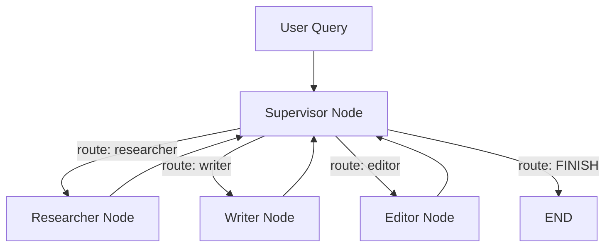
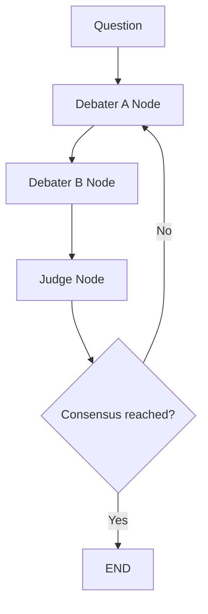
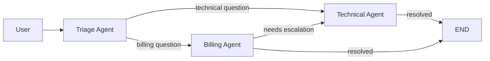

# Multi-Agent Collaboration

Multi-agent systems use **two or more specialized LLM agents** that work together to solve tasks no single agent handles well alone. Each agent has a distinct role, persona, or capability, and they coordinate through structured communication patterns. This mirrors how human teams work: specialists collaborate, debate, and delegate to produce better outcomes than any individual could achieve.

## Why Multi-Agent?

| Single Agent Limitations | Multi-Agent Solutions |
|--------------------------|----------------------|
| Context window overload on complex tasks | Each agent focuses on a subset |
| Role confusion when juggling many personas | Dedicated roles per agent |
| No built-in quality assurance | Agents review each other's work |
| Hard to parallelize reasoning | Agents can think concurrently |

:::info When to Go Multi-Agent
Use multi-agent when a task naturally decomposes into distinct roles (e.g., researcher + writer + editor) or when adversarial evaluation improves quality (e.g., debate). For simple tasks, a single agent with tools is simpler and cheaper.
:::

## Pattern 1: Supervisor with Conditional Routing

A central **supervisor agent** receives the user's request, decides which worker to invoke next via a conditional edge, and synthesizes the final result. In LangGraph, the supervisor is a node whose structured output drives the routing.



```python
"""Supervisor multi-agent pattern in LangGraph."""

from __future__ import annotations

import logging
import operator
from typing import Annotated, Any, Literal, Sequence, TypedDict

from langchain_core.messages import AIMessage, BaseMessage, HumanMessage, SystemMessage
from langchain_openai import ChatOpenAI
from langgraph.graph import END, StateGraph
from pydantic import BaseModel, Field

logger = logging.getLogger(__name__)

# ---------------------------------------------------------------------------
# State
# ---------------------------------------------------------------------------

class SupervisorState(TypedDict):
    messages: Annotated[Sequence[BaseMessage], operator.add]
    next_worker: str
    iteration: int
    max_iterations: int

# ---------------------------------------------------------------------------
# Supervisor routing model
# ---------------------------------------------------------------------------

class RouteDecision(BaseModel):
    next: Literal["researcher", "writer", "editor", "FINISH"] = Field(
        ..., description="Which worker to invoke next, or FINISH if done"
    )
    reasoning: str = Field(..., description="Why this worker was chosen")

# ---------------------------------------------------------------------------
# Nodes
# ---------------------------------------------------------------------------

WORKER_SYSTEM_PROMPTS: dict[str, str] = {
    "researcher": "You are a research specialist. Gather facts and data relevant to the task.",
    "writer": "You are a professional writer. Produce clear, well-structured prose.",
    "editor": "You are a meticulous editor. Fix errors, improve clarity, ensure completeness.",
}


def supervisor_node(state: SupervisorState) -> dict[str, Any]:
    """Decide which worker to invoke next."""
    llm = ChatOpenAI(model="gpt-4o", temperature=0.0)
    structured_llm = llm.with_structured_output(RouteDecision)

    workers = list(WORKER_SYSTEM_PROMPTS.keys())
    decision: RouteDecision = structured_llm.invoke([
        SystemMessage(content=(
            f"You are a supervisor managing workers: {workers}. "
            "Examine the conversation and decide which worker should act next, "
            "or FINISH if the task is complete."
        )),
        *state["messages"],
    ])

    logger.info("Supervisor routes to %s: %s", decision.next, decision.reasoning)
    return {
        "next_worker": decision.next,
        "iteration": state["iteration"] + 1,
    }


def _make_worker_node(worker_name: str):
    """Factory for worker nodes."""
    def worker_node(state: SupervisorState) -> dict[str, Any]:
        llm = ChatOpenAI(model="gpt-4o", temperature=0.0)
        response: AIMessage = llm.invoke([
            SystemMessage(content=WORKER_SYSTEM_PROMPTS[worker_name]),
            *state["messages"],
        ])
        logger.info("Worker %s produced response.", worker_name)
        return {"messages": [HumanMessage(content=f"[{worker_name}]: {response.content}")]}
    return worker_node


def route_supervisor(state: SupervisorState) -> str:
    """Route based on supervisor decision and iteration budget."""
    if state["iteration"] >= state["max_iterations"]:
        return "FINISH"
    return state["next_worker"]


# ---------------------------------------------------------------------------
# Graph assembly
# ---------------------------------------------------------------------------

def build_supervisor_graph(max_iterations: int = 6) -> Any:
    graph = StateGraph(SupervisorState)

    graph.add_node("supervisor", supervisor_node)
    for name in WORKER_SYSTEM_PROMPTS:
        graph.add_node(name, _make_worker_node(name))

    graph.set_entry_point("supervisor")
    graph.add_conditional_edges("supervisor", route_supervisor, {
        "researcher": "researcher",
        "writer": "writer",
        "editor": "editor",
        "FINISH": END,
    })
    for name in WORKER_SYSTEM_PROMPTS:
        graph.add_edge(name, "supervisor")

    return graph.compile()
```

:::tip Supervisor Best Practice
Give the supervisor a high-capability model (e.g., GPT-4o, Claude Opus) and workers cheaper, faster models. The supervisor needs strong reasoning for planning; workers need domain expertise but not as much general intelligence.
:::

## Pattern 2: Debate as a Cycle Between Agents

Two or more agents argue opposing positions in a cycle. A judge node evaluates arguments and decides whether consensus has been reached or another round is needed.



```python
"""Debate pattern as a LangGraph cycle."""

from __future__ import annotations

import logging
import operator
from typing import Annotated, Any, Literal, Sequence, TypedDict

from langchain_core.messages import AIMessage, BaseMessage, HumanMessage, SystemMessage
from langchain_openai import ChatOpenAI
from langgraph.graph import END, StateGraph
from pydantic import BaseModel, Field

logger = logging.getLogger(__name__)


class JudgeVerdict(BaseModel):
    decision: Literal["continue", "consensus"] = Field(
        ..., description="Whether to continue debating or accept consensus"
    )
    summary: str = Field(..., description="Summary of the current state of debate")
    winner: str = Field(default="", description="Winning position if consensus reached")


class DebateState(TypedDict):
    messages: Annotated[Sequence[BaseMessage], operator.add]
    question: str
    round_number: int
    max_rounds: int
    verdict: str


def debater_a_node(state: DebateState) -> dict[str, Any]:
    llm = ChatOpenAI(model="gpt-4o", temperature=0.3)
    response: AIMessage = llm.invoke([
        SystemMessage(content="You are Debater A. Argue FOR the proposition. Be persuasive and evidence-based."),
        *state["messages"],
    ])
    return {"messages": [HumanMessage(content=f"[Debater A, Round {state['round_number'] + 1}]: {response.content}")]}


def debater_b_node(state: DebateState) -> dict[str, Any]:
    llm = ChatOpenAI(model="gpt-4o", temperature=0.3)
    response: AIMessage = llm.invoke([
        SystemMessage(content="You are Debater B. Argue AGAINST the proposition. Find weaknesses in A's arguments."),
        *state["messages"],
    ])
    return {"messages": [HumanMessage(content=f"[Debater B, Round {state['round_number'] + 1}]: {response.content}")]}


def judge_node(state: DebateState) -> dict[str, Any]:
    llm = ChatOpenAI(model="gpt-4o", temperature=0.0)
    structured_llm = llm.with_structured_output(JudgeVerdict)

    verdict: JudgeVerdict = structured_llm.invoke([
        SystemMessage(content="You are an impartial judge. Evaluate both arguments fairly."),
        *state["messages"],
    ])

    logger.info("Judge round=%d decision=%s", state["round_number"], verdict.decision)
    return {
        "round_number": state["round_number"] + 1,
        "verdict": verdict.summary if verdict.decision == "consensus" else "",
    }


def should_continue_debate(state: DebateState) -> Literal["continue", "done"]:
    if state["verdict"]:
        return "done"
    if state["round_number"] >= state["max_rounds"]:
        return "done"
    return "continue"


def build_debate_graph(max_rounds: int = 3) -> Any:
    graph = StateGraph(DebateState)
    graph.add_node("debater_a", debater_a_node)
    graph.add_node("debater_b", debater_b_node)
    graph.add_node("judge", judge_node)

    graph.set_entry_point("debater_a")
    graph.add_edge("debater_a", "debater_b")
    graph.add_edge("debater_b", "judge")
    graph.add_conditional_edges("judge", should_continue_debate, {
        "continue": "debater_a",
        "done": END,
    })
    return graph.compile()
```

## Pattern 3: Swarm Handoff

The swarm pattern allows agents to **hand off control** to one another dynamically. Each agent can transfer the conversation to a specialist when it encounters a sub-task outside its expertise. LangGraph models this with `Command` for explicit handoff.



```python
"""Swarm handoff pattern with LangGraph."""

from __future__ import annotations

import logging
import operator
from typing import Annotated, Any, Literal, Sequence, TypedDict

from langchain_core.messages import AIMessage, BaseMessage, HumanMessage, SystemMessage
from langchain_openai import ChatOpenAI
from langgraph.graph import END, StateGraph
from pydantic import BaseModel, Field

logger = logging.getLogger(__name__)


class HandoffDecision(BaseModel):
    target: Literal["billing", "technical", "DONE"] = Field(
        ..., description="Agent to hand off to, or DONE if resolved"
    )
    message: str = Field(..., description="Message to pass along with handoff")


class SwarmState(TypedDict):
    messages: Annotated[Sequence[BaseMessage], operator.add]
    current_agent: str
    handoff_count: int
    max_handoffs: int


def _make_agent_node(agent_name: str, system_prompt: str):
    """Create an agent node that can hand off to other agents."""
    def node(state: SwarmState) -> dict[str, Any]:
        llm = ChatOpenAI(model="gpt-4o", temperature=0.0)
        structured_llm = llm.with_structured_output(HandoffDecision)

        decision: HandoffDecision = structured_llm.invoke([
            SystemMessage(content=(
                f"{system_prompt}\n\n"
                "If the query is outside your expertise, hand off to another agent. "
                "If you have fully resolved the query, respond with target=DONE."
            )),
            *state["messages"],
        ])

        logger.info("Agent %s -> %s: %s", agent_name, decision.target, decision.message[:80])
        return {
            "messages": [HumanMessage(content=f"[{agent_name}]: {decision.message}")],
            "current_agent": decision.target,
            "handoff_count": state["handoff_count"] + 1,
        }
    return node


def triage_node(state: SwarmState) -> dict[str, Any]:
    """Initial triage agent that routes to the right specialist."""
    llm = ChatOpenAI(model="gpt-4o", temperature=0.0)
    structured_llm = llm.with_structured_output(HandoffDecision)

    decision: HandoffDecision = structured_llm.invoke([
        SystemMessage(content="You are a triage agent. Route to 'billing' or 'technical' based on the query."),
        *state["messages"],
    ])
    return {
        "current_agent": decision.target,
        "messages": [HumanMessage(content=f"[triage]: Routing to {decision.target}")],
        "handoff_count": 1,
    }


def route_handoff(state: SwarmState) -> str:
    if state["handoff_count"] >= state["max_handoffs"]:
        return "DONE"
    return state["current_agent"]


def build_swarm_graph(max_handoffs: int = 5) -> Any:
    graph = StateGraph(SwarmState)

    graph.add_node("triage", triage_node)
    graph.add_node("billing", _make_agent_node(
        "billing", "You are a billing specialist. Handle invoices, payments, and refunds."
    ))
    graph.add_node("technical", _make_agent_node(
        "technical", "You are a technical support engineer. Handle bugs, configs, and integrations."
    ))

    graph.set_entry_point("triage")
    graph.add_conditional_edges("triage", route_handoff, {
        "billing": "billing",
        "technical": "technical",
        "DONE": END,
    })
    graph.add_conditional_edges("billing", route_handoff, {
        "billing": "billing",
        "technical": "technical",
        "DONE": END,
    })
    graph.add_conditional_edges("technical", route_handoff, {
        "billing": "billing",
        "technical": "technical",
        "DONE": END,
    })

    return graph.compile()
```

## Choosing the Right Pattern

| Pattern | Best For | Agents Needed | Complexity |
|---------|----------|---------------|------------|
| **Supervisor** | Complex tasks with clear sub-task decomposition | 3-5 | Medium |
| **Debate** | Ambiguous questions, reducing bias | 2-3 | Low |
| **Swarm handoff** | Customer support, multi-domain routing | 2-5 | Low |

## Shared Context and Communication

Multi-agent systems in LangGraph share state through the `TypedDict` state object. All nodes read from and write to the same state, providing a natural blackboard pattern.

| Approach | LangGraph Mechanism |
|----------|---------------------|
| **Message passing** | `messages` field with `operator.add` annotation |
| **Shared memory** | Custom state fields accessible by all nodes |
| **Structured handoff** | Pydantic models in state for typed inter-agent data |
| **Event history** | Append-only lists in state for audit trails |

:::warning Cost Consideration
Multi-agent systems multiply LLM costs by the number of agents times the number of rounds. Start with the simplest pattern that fits your use case; add complexity only when needed.
:::

## Key Takeaways

- Multi-agent systems decompose complex problems into specialized roles, improving quality and maintainability.
- The **supervisor** pattern uses LangGraph conditional edges to route between worker nodes dynamically.
- **Debate** is modeled as a cycle: debaters take turns, a judge node decides when to stop.
- **Swarm handoff** lets agents transfer control to specialists via structured routing decisions.
- LangGraph's shared `TypedDict` state provides natural inter-agent communication.
- Start simple; add agents and coordination only when single-agent approaches are insufficient.

## Further Reading

- Wu, Q. et al. "AutoGen: Enabling Next-Gen LLM Applications via Multi-Agent Conversation" (2023)
- Li, G. et al. "CAMEL: Communicative Agents for 'Mind' Exploration of Large Language Model Society" (NeurIPS 2023)
- Hong, S. et al. "MetaGPT: Meta Programming for A Multi-Agent Collaborative Framework" (ICLR 2024)
- LangGraph multi-agent documentation
