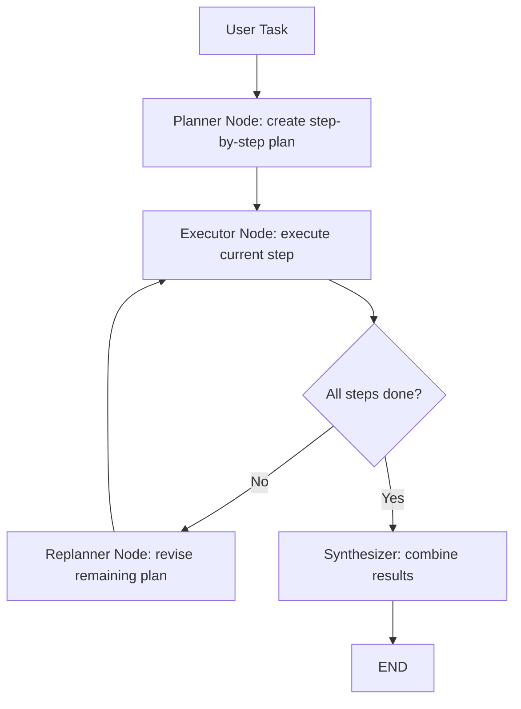
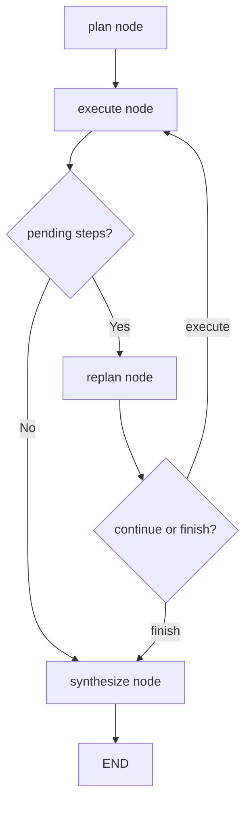

# Plan-and-Execute

The Plan-and-Execute pattern separates agent behavior into two distinct phases: first **create a plan** (a sequence of steps), then **execute each step** one at a time. After execution, the agent may **revise the plan** based on what it learned. This separation makes complex tasks more manageable, debuggable, and controllable than interleaved approaches like ReAct.

## Why Separate Planning from Execution?

In ReAct, the agent decides what to do one step at a time. This works well for short tasks but can lose coherence on longer ones -- the agent may forget its overall strategy, revisit dead ends, or miss important steps. Plan-and-Execute addresses this by making the overall strategy explicit upfront.

:::info Key Insight
Planning and execution require different cognitive modes. Planning needs broad strategic thinking; execution needs focused, detail-oriented action. Separating them lets you optimize each phase independently.
:::

## Architecture



The three key components:

| Component | Role |
|-----------|------|
| **Planner** | Generates an ordered list of steps from the task description |
| **Executor** | Carries out a single step using tools or LLM reasoning |
| **Replanner** | Revises the remaining plan based on execution results so far |

## LangGraph Implementation

The plan-and-execute pattern maps to a LangGraph graph with structured Pydantic plan output, an executor node that processes one step at a time, and a replanner node with a conditional edge that decides whether to continue, replan, or finish.

```python
"""Plan-and-Execute pattern as a LangGraph graph."""

from __future__ import annotations

import logging
import operator
from typing import Annotated, Any, Literal, Sequence, TypedDict

from langchain_core.messages import AIMessage, BaseMessage, HumanMessage, SystemMessage
from langchain_openai import ChatOpenAI
from langgraph.graph import END, StateGraph
from pydantic import BaseModel, Field

logger = logging.getLogger(__name__)

# ---------------------------------------------------------------------------
# Structured plan models
# ---------------------------------------------------------------------------

class PlanStep(BaseModel):
    """A single step in the execution plan."""
    step_number: int = Field(..., description="Sequential step number")
    description: str = Field(..., description="What to do in this step")
    expected_output: str = Field(..., description="What the step should produce")


class ExecutionPlan(BaseModel):
    """An ordered plan to accomplish a task."""
    goal: str = Field(..., description="Restated goal")
    steps: list[PlanStep] = Field(..., description="Ordered steps to execute")


class StepResult(BaseModel):
    """Result of executing a single step."""
    step_number: int
    description: str
    output: str
    success: bool


class ReplanDecision(BaseModel):
    """Decision from the replanner."""
    action: Literal["continue", "replan", "finish"] = Field(
        ..., description="Whether to continue with current plan, replan, or finish"
    )
    revised_steps: list[PlanStep] = Field(
        default_factory=list, description="New steps if replanning"
    )
    reasoning: str = Field(..., description="Why this action was chosen")


# ---------------------------------------------------------------------------
# State
# ---------------------------------------------------------------------------

class PlanExecState(TypedDict):
    """State for the plan-and-execute graph."""
    messages: Annotated[Sequence[BaseMessage], operator.add]
    task: str
    plan: ExecutionPlan | None
    pending_steps: list[PlanStep]
    completed_results: list[StepResult]
    current_step: PlanStep | None
    replan_count: int
    max_replans: int


# ---------------------------------------------------------------------------
# Planner node
# ---------------------------------------------------------------------------

def planner_node(state: PlanExecState) -> dict[str, Any]:
    """Generate an execution plan for the task."""
    llm = ChatOpenAI(model="gpt-4o", temperature=0.0)
    structured_llm = llm.with_structured_output(ExecutionPlan)

    plan: ExecutionPlan = structured_llm.invoke([
        SystemMessage(content=(
            "You are a planning agent. Break the task into concrete, actionable steps. "
            "Each step should be independently executable. Keep the plan concise (3-7 steps)."
        )),
        HumanMessage(content=f"Task: {state['task']}"),
    ])

    logger.info("Planner created %d steps for: %s", len(plan.steps), plan.goal)

    return {
        "plan": plan,
        "pending_steps": list(plan.steps),
        "current_step": plan.steps[0] if plan.steps else None,
    }


# ---------------------------------------------------------------------------
# Executor node
# ---------------------------------------------------------------------------

def executor_node(state: PlanExecState) -> dict[str, Any]:
    """Execute the current step."""
    step = state["current_step"]
    if step is None:
        return {}

    llm = ChatOpenAI(model="gpt-4o", temperature=0.0)

    # Build context from completed results
    context_lines = [
        f"Step {r.step_number}: {r.description} -> {r.output}"
        for r in state["completed_results"]
    ]
    context = "\n".join(context_lines) if context_lines else "(no prior results)"

    response: AIMessage = llm.invoke([
        SystemMessage(content=(
            "You are an execution agent. Complete the assigned step thoroughly. "
            "Use the context from previous steps."
        )),
        HumanMessage(content=(
            f"Overall task: {state['task']}\n\n"
            f"Previous results:\n{context}\n\n"
            f"Current step ({step.step_number}): {step.description}\n"
            f"Expected output: {step.expected_output}\n\n"
            "Provide your complete result:"
        )),
    ])

    result = StepResult(
        step_number=step.step_number,
        description=step.description,
        output=response.content,
        success=True,
    )

    # Advance to next step
    remaining = state["pending_steps"][1:]
    next_step = remaining[0] if remaining else None

    logger.info("Executed step %d: %s", step.step_number, step.description[:60])

    return {
        "messages": [response],
        "completed_results": state["completed_results"] + [result],
        "pending_steps": remaining,
        "current_step": next_step,
    }


# ---------------------------------------------------------------------------
# Replanner node
# ---------------------------------------------------------------------------

def replanner_node(state: PlanExecState) -> dict[str, Any]:
    """Decide whether to continue, replan, or finish."""
    llm = ChatOpenAI(model="gpt-4o", temperature=0.0)
    structured_llm = llm.with_structured_output(ReplanDecision)

    completed_text = "\n".join(
        f"  Step {r.step_number}: {r.description} -> {'OK' if r.success else 'FAILED'}: {r.output[:100]}"
        for r in state["completed_results"]
    )
    pending_text = "\n".join(
        f"  Step {s.step_number}: {s.description}"
        for s in state["pending_steps"]
    )

    decision: ReplanDecision = structured_llm.invoke([
        SystemMessage(content=(
            "You are a replanning agent. Review progress and decide: "
            "'continue' with remaining steps, 'replan' with revised steps, "
            "or 'finish' if the task is already complete."
        )),
        HumanMessage(content=(
            f"Task: {state['task']}\n\n"
            f"Completed steps:\n{completed_text}\n\n"
            f"Remaining steps:\n{pending_text or '(none)'}\n\n"
            "What should we do next?"
        )),
    ])

    logger.info("Replanner decision: %s reason=%s", decision.action, decision.reasoning[:60])

    updates: dict[str, Any] = {}
    if decision.action == "replan" and decision.revised_steps:
        updates["pending_steps"] = decision.revised_steps
        updates["current_step"] = decision.revised_steps[0] if decision.revised_steps else None
        updates["replan_count"] = state["replan_count"] + 1

    return updates


# ---------------------------------------------------------------------------
# Routing logic
# ---------------------------------------------------------------------------

def route_after_replan(state: PlanExecState) -> Literal["execute", "finish"]:
    """Route based on replanner decision and budget."""
    if state["replan_count"] >= state["max_replans"]:
        logger.warning("Max replans reached: %d", state["replan_count"])
        return "finish"
    if not state["pending_steps"]:
        return "finish"
    return "execute"


def route_after_execute(state: PlanExecState) -> Literal["replan", "finish"]:
    """After execution, go to replanner to assess progress."""
    if not state["pending_steps"]:
        return "finish"
    return "replan"


# ---------------------------------------------------------------------------
# Synthesizer node
# ---------------------------------------------------------------------------

def synthesizer_node(state: PlanExecState) -> dict[str, Any]:
    """Combine all step results into a final response."""
    llm = ChatOpenAI(model="gpt-4o", temperature=0.0)

    results_text = "\n\n".join(
        f"**Step {r.step_number}: {r.description}**\n{r.output}"
        for r in state["completed_results"]
    )
    response: AIMessage = llm.invoke([
        SystemMessage(content="Synthesize all step results into a cohesive final answer."),
        HumanMessage(content=f"Task: {state['task']}\n\nStep Results:\n{results_text}"),
    ])

    return {"messages": [response]}


# ---------------------------------------------------------------------------
# Graph assembly
# ---------------------------------------------------------------------------

def build_plan_and_execute_graph(max_replans: int = 2) -> Any:
    """Compile the plan-and-execute graph."""
    graph = StateGraph(PlanExecState)

    graph.add_node("plan", planner_node)
    graph.add_node("execute", executor_node)
    graph.add_node("replan", replanner_node)
    graph.add_node("synthesize", synthesizer_node)

    graph.set_entry_point("plan")
    graph.add_edge("plan", "execute")
    graph.add_conditional_edges("execute", route_after_execute, {
        "replan": "replan",
        "finish": "synthesize",
    })
    graph.add_conditional_edges("replan", route_after_replan, {
        "execute": "execute",
        "finish": "synthesize",
    })
    graph.add_edge("synthesize", END)

    return graph.compile()


async def run_plan_and_execute(task: str, max_replans: int = 2) -> str:
    """Run the plan-and-execute graph for a task."""
    app = build_plan_and_execute_graph(max_replans=max_replans)
    initial_state: PlanExecState = {
        "messages": [],
        "task": task,
        "plan": None,
        "pending_steps": [],
        "completed_results": [],
        "current_step": None,
        "replan_count": 0,
        "max_replans": max_replans,
    }
    result = await app.ainvoke(initial_state)
    return result["messages"][-1].content
```

### How the Graph Works



| Node | Responsibility |
|------|---------------|
| **plan** | Produces a structured `ExecutionPlan` with Pydantic |
| **execute** | Runs the current step with context from completed results |
| **replan** | Assesses progress, may revise remaining steps |
| **synthesize** | Combines all step results into a final answer |

## Comparison: Plan-and-Execute vs. ReAct

| Dimension | Plan-and-Execute | ReAct |
|-----------|-----------------|-------|
| **Planning** | Explicit upfront plan | Implicit, one step at a time |
| **Visibility** | Full plan visible before execution | Only the current thought is visible |
| **Adaptability** | Requires explicit replan step | Naturally adapts each iteration |
| **Coherence** | High -- follows a structured plan | Can lose direction on long tasks |
| **Overhead** | Planning phase adds latency | No planning overhead |
| **Debugging** | Easy -- inspect the plan | Medium -- inspect the trace |
| **Best for** | Complex multi-stage workflows | Exploratory information gathering |

:::tip Hybrid Approach
Many production systems combine both: Plan-and-Execute for the top-level workflow, with ReAct-style agents as executors for individual steps. This gives you strategic planning with tactical flexibility.
:::

## When to Use Plan-and-Execute

**Good fit:**
- Multi-stage research tasks (gather data, analyze, write report)
- Code generation projects (design, implement, test, document)
- Data pipelines (extract, transform, validate, load)
- Any task where the user benefits from seeing the plan upfront

**Poor fit:**
- Simple single-step tasks (overhead of planning is not justified)
- Highly dynamic environments where the plan becomes stale instantly
- Conversational agents where the "task" evolves turn by turn

## Key Takeaways

- Plan-and-Execute separates strategic planning from tactical execution, improving coherence on complex tasks.
- In LangGraph, model it as: planner node, executor node, replanner node with conditional edges.
- Pydantic models (`ExecutionPlan`, `PlanStep`, `ReplanDecision`) enforce structured, parseable plans.
- The replanning mechanism lets the agent recover from failures without starting over.
- Combine Plan-and-Execute at the macro level with ReAct or tool use at the micro level for maximum effectiveness.
- Always enforce hard limits on steps, replans, and cost to prevent runaway execution.

## Further Reading

- Wang, L. et al. "Plan-and-Solve Prompting: Improving Zero-Shot Chain-of-Thought Reasoning" (ACL 2023)
- Nakajima, Y. "BabyAGI" (GitHub, 2023)
- LangGraph Plan-and-Execute tutorial
- Devin and SWE-agent architectures (plan-then-code paradigm)
